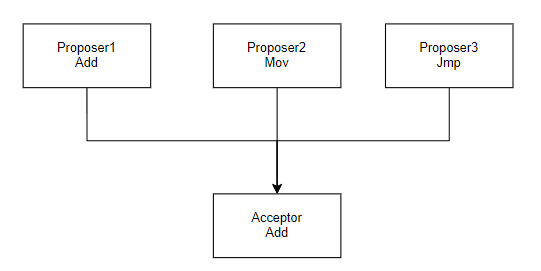

# 1. The Byzantine Generals Problem

拜占庭将军问题。

# 2. CAP

- **Consistency**

一致性指的是客户端的每次操作，不管访问哪个节点，要么读到的都是同一份最新写入的数据，要么读取失败。也就是说**如果对某一个节点更新成功，其他节点必定也会更新成功。**

一致性强调的是数据正确。就比如有两个节点AB，然后客户端将A中的数据从1改为2，然后接着从节点B中读取数据，发现还是1，这就是数据不一致。但是如果A更新了数据之后，通过节点间的通讯，同时将AB两个节点的值都更新为2，这时候就是满足数据一致性了。

- **Availability**

可用性说的是任何来自客户端的请求，不管是访问哪个非故障节点都能够得到响应数据（不是错误或者超时的响应），但**不保证是同一份最新数据，强调的只是服务可用。**

举例来说，客户端分别向节点AB发起请求，此时节点A中的数据是2，节点B中的数据还未被同步，仍然是1，但是在可用性条件下，不管此时节点之间的数据是否一致，只要节点服务器收到请求就会响应。因此客户端的两次请求会返回不一样的数据。

- **Partition Tolerance**

分区容错性表示当分布式系统出现网络分区的时候，仍然能够对外提供服务。或者说当节点之间出现任意数量的消息丢失或者高延迟的时候，系统仍然在继续工作。分布式系统告诉客户端，无论我内部出现了什么样的数据同步问题，我都会一直运行。**强调的是集群对分区故障的容错能力**

对于分布式系统来说，它涉及到多节点之间的通讯和交互，因此节点之间的分区故障是必然的，所以**在分布式系统中Partition Tolerance是必须要考虑的**

网络分区？指的是在分布式系统中，多个节点之前的网络本来是连通的，但是由于某些故障导致某些节点之间不连通了，整个网络就被分成了几个区域，这就叫网络分区。

对于分布式系统中CAP的选择，其实并不是简单的三选二。因为只要有网络交互，就一定会有网络延迟和数据丢失，因此这种情况是我们必须要去接受的，也就是我们节点之间的分区故障是必然发生的，**Partition Tolerance是前提，必须要保证。**因此我们只能从剩下的CA中二选一。也就是要么保证数据正确，要么保证服务可用。

- 当选择了Consistency的时候，就一定会读取到最新的数据，但是如果因为消息丢失、延迟过高发生了网络分区，这个时候集群节点为了不破坏一致性，可能会因为无法响应最新的数据而返回出错信息。
- 如果选择avaliability的时候，系统将始终处理客户端的请求，返回特定信息。如果发生了网络分区，一些节点无法返回最新的特定信息，为了不破坏avaliability，只能返回自己当前对应的旧的特定信息。舍弃了一致性，达到了高可用。

其实如果分布式系统中不存在网络分区，也就是正常运行的情况下，从逻辑上来看CA是可以共存的。

对于CP模型的KV存储来说，适合用于提供基础服务，保存少量数据，但是需要一致性。就比如zookeeper，任何时刻对zookeeper的读请求都能得到一致性的结果，但是zookeeper不保证每次请求的可用性，比如在Leader选举过程中或者半数以上的机器不可用的时候服务就是不可用的。

对于AP模型的KV存储来说，适合查询量大，不要求数据的一致性，但是重点在于性能和吞吐量。即能够容忍可能的短暂的一致性延迟，广泛应用于分布式缓存系统。

nacos的配置中心就是使用的CP保证各节点配置强一致，注册中心使用的是AP

# 3. Transaction

其实对于单机的事务来说，满足ACID还是比较简单的，像我们的MySQL数据库其实就满足了ACID，支持事务。但是在分布式系统中，涉及到各个节点之间的操作，还是比较困难。

## 3.1 2PC

## 3.2 TCC（Try-Confirm-Cancel）

## 3.3 3PC

# 4. BASE Theory（❓）

BASE理论的内容：基本可用（Basically Available）、软状态（Soft State，是实现服务可用性的时候系统数据的一种过渡状态，也可以说是不同节点间，数据副本存在短暂的不一致）、最终一致性（Eventually Consistent），它可以理解为AP的延伸，是对互联网大规模分布式系统的实践总结，强调可用性。因为AP其实是一个动态模型，目前没有现成的库或方案，它是基于业务场景特点妥协折中后设计实现的。不过可以借助BASE理论帮助你达成目的。

**什么是基本可用？如何实现基本可用？**

首先基本可用大概就是说当系统在出现不可预知的故障的时候，可以允许部分功能的可用性，保障核心功能的可用性，去适应外界的压力，防止强行要求强可用性最终导致系统崩溃。比如响应时间上的损失、系统功能上的损失。

实现基本可用可以有四种方案：

1. **流量削峰：**就拿12306来说，如果所有的抢票请求都集中在九点钟，服务器肯定就无法承受这么大的压力，于是我们就可以让不同地方的火车票在不同的时候售票。比如深圳发车的八点开抢，北京发车的九点开抢。
2. **延迟响应：**还是购票，我们可以发现当我们提交了请求之后，12306并不是立刻给我们响应，而是等待几分钟或者几十分钟之后系统才进行处理。当系统在出现超出系统处理能力的突发流量的情况下，会通过牺牲响应时间的可用性来保证核心功能的运行。
3. **体验降级：**比如突然系统中有大量的用户涌进来，系统过载导致大量图片因为网络超时无法显示，就可以进行体验降级，比如降低图片的清晰度和大小来提升系统的处理能力。
4. **过载保护：**将接收到的请求放在指定的队列中进行处理，如果请求等待时间超时了，就可以直接拒绝超时请求。再比如如果队列直接满了就可以清除队列中的一定数量的排队请求或者直接拒绝后续的请求来让系统不过载，实现系统的基本可用。
5. **故障隔离：**出现故障的时候要做到故障隔离，避免影响其他的服务。
6. **弹性扩容：**基于Metric和Monitor实现系统态势感知，做到弹性伸缩。

**什么是最终一致性？**

他强调的是在系统中的所有的数据副本，在经过一段时间的同步之后，最终能够达到一个一致的状态。本质是需要系统保证最终数据能够达到一致性而不是需要实时保证系统数据的强一致。

如何实现最终一致性？

1. **读时修复：**在写数据的时候不关心失败还是成功，在读取数据的时候，我们可以同时读取多个节点的同一份数据，然后按照一定的规则检测数据的不一致，比如以超过半数的数据为准，进行修复。❓极端情况下，如果所有节点的数据都不一样，应该听谁的呢？通过多次执行异步修复来实现一致性，待做。
2. **写时修复：**在写入数据的时候，如果其中一个写失败了就会缓存起来，然后系统自动通过重试的手段进行修复。这种写时修复不需要进行数据对比，**性能最好，推荐优先实现**。本质是“失败-缓存-重传”的重试机制，不涉及到一致性对比
3. **异步修复：**通过定时不同节点比对的方式，来对照数据是否需要修复，如果需要修复就进行同步。这种修复方式涉及到数据的对比，性能不是很好。定时对账检测副本数据的一致性。

**总结：**

BASE理论其实是对CAP中一致性和可用性权衡的结果，它来源于对大规模互联网分布式系统实践的总结，是基于CAP定理逐步演化而来的。核心思想就是如果不是必须的话，不推荐事先事务或者强一致性，鼓励可用性和性能优先，根据业务的场景特点来实现非常弹性的基本可用，以及实现数据的最终一致性。

BASE理论在很大程度上解决了事务型系统在性能、容错、可用性等方面的痛点。

# 5. Distributed ID

# 6. Algorithm

## 6.1 Paxos

Paxos算法是基于消息传递且具有高度容错特性的**共识性算法**。

在我们常见的分布式系统中，总会发生通信异常、节点故障、网络分区等情况。Paxos算法需要解决的问题在于**如何在一个可能发生上述异常的分布式系统中，快速且正确地在集群内部对某个数据的值（可以是一条日志，也可以是一条命令）达成共识性，并且保证不论发生以上任何异常，都不会破坏整个系统决议的共识机制**

在Paxos算法中，并不会去考虑拜占庭将军问题，即虽然有可能一个消息被传递了两次，但是绝对不会出现错误的消息。只要等待足够的时间，消息就会被传到。

但是需要考虑的是各种角色的计算速度可能不同，甚至可能因为宕机而终止运行，随后又被重启。在没有记录之前已选择的value的情况下，之前选择的value会丢失，因此需要记录之前已选择的value。

消息可以延时，可以重复，可以丢失，但是其内容无法被篡改。

### Basic Paxos

对于Basic Paxos来说，它描述的是多节点之间如何就某个值（提案 value）达成共识。

在Basic Paxos中，一共有三种角色，每个节点都可以允许身兼数职。

- proposers提出提案，提案信息包括提案编号和提议的vlaue
- acceptor收到提案之后可以接受（accept）提案，如果提案获得多数派的acceptors的接受，则该提案被批准（chosen）
- learners只能学习被批准的提案，相当于一个存储备份

划分角色之后就可以拥有更加精确的定义：

1. 决议（value）只能在被proposers提出之后才能被批准（未经批准的决议称为“提案proposal”）；、
2. 在一次Paxos算法的执行实例中，只能chosen一个value；
3. learners只能获得被chosen的value。

如果只有一个acceptor，有很多个proposer

对于这种情况，要想保证共识其实很简答，我们只需要让整个acceptor只接受第一个proposer提出的value就可以了，后续的一概不接受。这种方案简单易懂，但是如果当前acceptor挂掉之后且无法恢复了，被选择的value也跟着丢失了，显然是符合要求的。

接下来只需考虑多个Proposer和多个Acceptor的情况。

[Paxos算法 - 维基百科，自由的百科全书 (wikipedia.org)](https://zh.wikipedia.org/wiki/Paxos算法)

[一致性算法Paxos解决了什么问题 - 大数据 - 亿速云 (yisu.com)](https://www.yisu.com/zixun/500499.html)

[Paxos原理（一）：Basic Paxos - 掘金 (juejin.cn)](https://juejin.cn/post/6844903450585595912#heading-3)
