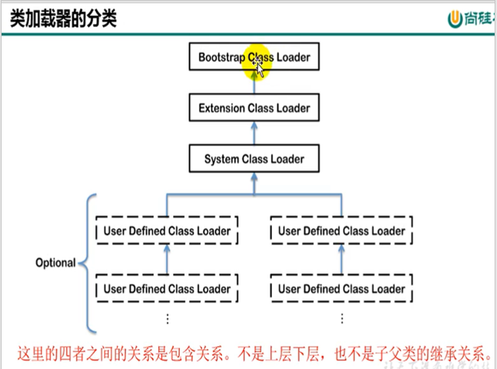

## 1、类加载子系统作用


1. Class Loader SubSystem（类加载子系统）负责从文件系统或网络中加载Class Files，Class Files在文件开头有特定的文件标识
2. ClassLoader只负责class文件的加载，至于它是否可以允许，则有Execution Engine（执行引擎）决定。（可以理解为媒婆负责介绍对象，能不能成就得看自己的努力了）
3. 加载的类信息存放于一块称为方法区（Method Area）的内存空间。除了类的信息外，方法区（Method Area）中还会存放运行时常量池信息，可能还包括字符串字面量和数字常量（这部分信息是Class文件中常量池部分的内存映射）

### 1.1 类加载器ClassLoader角色


## 2、类的加载过程


### 2.1 加载

1. 通过一个类的全限定名获取定义此类的二进制字节流
2. 将这个字节流所代表的静态存储结构转换为方法区的运行时数据结构
3. **在内存中生成一个代表这个类的java.lang.Class文件**，作为方法区这个类的各种数据的访问入口

### 2.2 链接

#### 验证

- 目的在于确保Class文件的字节流中包含信息符合当前虚拟机要求，保证被加载类的正确性，不会危害虚拟机自身安全
- 主要包括四种验证：文件格式验证、元数据验证、字节码验证、符号引用验证

#### 2.2.2 准备

- 为类变量分配内存并且设置该类变量的默认初始值，即零值（引用类型为null、布尔值为false等）
- **这里不包含用final修饰的static，因为final在编译的时候就会分配了，准备阶段会显示初始化**
- **这里不会为实例变量分配初始化**（因为还没有初始化），类变量会分配在方法区中，而实例变量是会随着对象一起分配到Java堆中

#### 2.2.3 解析

- 将常量池内的符号引用转换为直接引用的过程
- 事实上，解析操作往往会伴随着JVM在执行完初始化之后再执行
- 符号引用就是一组符号来描述所引用的目标。符号引用的字面量形式明确定义在《java虚拟机规范》的Class文件格式中，直接引用和就是直接指向目标的指针、相对偏移量或一个间接定位到目标的句柄
- 解析动作主要针对类或接口、字段、类方法、接口方法、方法类型等。对应常量池中的CONSTANT_Class_info、CONSTANT_Fieldref_info、CONSTANT_Methodref_info等。

### 2.3 初始化

- 初始化阶段就是执行类构造器方法<clinit>()的过程。

- 这个方法不需要定义，是javac编译器自动收集类中的所有类变量的赋值动作和静态代码块中的语句合并而来。也就是说如果一个类没有类变量和静态代码块，那么该类在初始化的时候是不会有<Clinit>()方法的。

- 构造器方法中指定按语句在源文件中出现的顺序执行

  ```java
  public class ClassInitTest {
     private static int num = 1;
  
     static{
         num = 2;
         number = 20;
         System.out.println(num);
         //System.out.println(number);//报错：非法的前向引用。可以赋值，但是不能调用
     }
  
     private static int number = 10;  
      //linking之prepare: number = 0 --> initial: 20 --> 10
  
      public static void main(String[] args) {
          System.out.println(ClassInitTest.num);//2
          System.out.println(ClassInitTest.number);//10
      }
  }
  ```

- <clinit>()不同于类的构造器。（构造器是虚拟机视角下的<init>()）

- 若该类具有父类，JVM会保证子类的<clinit>()执行前，父类的<clinit>()已经执行完毕。

  ```java
  public class ClinitTest1 {
      static class Father{
          public static int A = 1;
          static{
              A = 2;
          }
      }
  
      static class Son extends Father{
          public static int B = A;
      }
  
      public static void main(String[] args) {
          //加载Father类，其次加载Son类。
          System.out.println(Son.B);//2
      }
  }
  ```

  要加载Son类的时候，首先去初始化Father类，初始化的时候会自动的执行类中的类变量和静态代码块，因此B的值为2

- 虚拟机必须保证一个类的<clinit>()方法在多线程下被同步加锁。

  ```java
  public class DeadThreadTest {
      public static void main(String[] args) {
          Runnable r = () -> {
              System.out.println(Thread.currentThread().getName() + "开始");
              DeadThread dead = new DeadThread();
              System.out.println(Thread.currentThread().getName() + "结束");
          };
  
          Thread t1 = new Thread(r,"线程1");
          Thread t2 = new Thread(r,"线程2");
  
          t1.start();
          t2.start();
      }
  }
  
  class DeadThread{
      static{
          if(true){
              System.out.println(Thread.currentThread().getName() + "初始化当前类");
              while(true){
  
              }
          }
      }
  }
  ```

  在对DeadThread进行初始化的时候，由于静态代码块里面是死循环，因此会一直初始化。此时另一个线程也要初始化DeadThread，但是由于第一个DeadThread并未完成初始化，因此它无法初始化成功。

  

## 3、类加载器的分类

- JVM支持两种类型的类加载器，分别为引导类加载器（Bootstrap ClassLoader）和自定义类加载器（User-Defined ClassLoader）。

- 从概念上来讲，自定义类加载器一般指的是程序中由开发人员自定义的一类加载器，但是Java虚拟机规范却没有这么定义，而是将**所有派生于抽象类ClassLoader的类加载器都划分为自定义加载器**。

- 无论类加载器的类型如何分类，我们在程序中最常见的类加载器始终只有三个

  

  也就是说，JVM将Bootstarp Class Loader 分为一类，将扩展类加载器（Extension ClassLoader）、系统类加载器（SystemClassLoader）、还有其余的用户自定义的类加载器同一称为自定义类加载器

### 3.1 BootstrapClassLoader

- 这个类加载使用C/C++语言实现的，嵌套在JVM内部
- 它用来加载Java的核心库（JAVA_HOME/jre/lib/rt.jar、resources.jar或sun.boot.class.path路径下的内容），用于提供JVM自身所需要的类
- 并不继承自java.lang.ClassLoader，因此没有父加载器
- 加载扩展类和应用程序类加载器，并指定为他们的父类加载器
- 出于安全考虑，**Bootstrap启动类加载器只加载包名为java、javax、sun等开头的类**，比如java.lang.String。

### 3.2 ExtensionClassLoader

- java语言编写，由sun.misc.Launcher$ExtClassLoader实现。
- 派生于ClassLoader类
- 父类加载器为启动类加载器
- 从java.ext.dirs系统属性所指定的目录中加载类库，或从JDK的安装目录的jre/lib/ext子目录（扩展目录）下加载类库。如果用户创建的JAR放在此目录下，也会自动由扩展类加载器加载

### 3.3 AppClassLoader

- java语言编写，由sun.misc.Launcher&AppClassLoader实现
- 派生于ClassLoader类
- 父类加载器为扩展类加载器
- 它负责加载环境变量classpath或系统属性java.class.path指定路径下的类库
- **该类加载器是程序中默认的类加载器**，一般来说，java应用的类都是由它来完成加载
- 通过ClassLoader#getSystemClassLoader()方法可以获取到该类加载器

### 3.4 用户自定义类加载器

- 为什么要自定义类加载器？
  - 隔离加载类
  - 修改类加载的方式
  - 扩展加载源
  - 防止源码泄露
- 自定义类加载器实现步骤
  1. 开发人员可以通过继承抽象类java.lang.ClassLoader类的方式，实现自己的类加载器，以满足一些特殊的需求
  2. 在JDK1.2之前，在自定义类加载器时，总会去继承ClassLoader类并重写loadClass方法，从而实现自定义的类加载器，但在JDK1.2之后，已不再建议用户去覆盖loadClass方法，而是建议把自定义的类加载逻辑写在findClass方法中
  3. 在编写自定义类加载器时，如果没有太过于复杂的需求，可以直接继承URLClassLoader类，这样就可以避免自己去编写findClass方法级其获取字节码流的方式，使自定义类加载器编写更加简洁。

## 4、ClassLoader的使用说明

ClassLoader类是一个抽象类，其后所有的类加载器都继承自ClassLoader，不包括BootstrapClassLoader


**获取ClassLoader的途径**


## 5、双亲委派机制

java虚拟机对class文件采用的是**按需加载**方式，也就是说当需要使用该类时才会将它的class文件加载到内存生成class对象。而且加载某个类的class文件时，java虚拟机采用的是双亲委派模式，**即把请求交由父类处理**，它是一种任务委派模式

**工作原理**

1. 如果一个类加载器收到了类加载请求，它并不会自己先去加载，而是把这个请求委托给父类的加载器去加载
2. 如果父类加载器还存在其父类加载器，则进一步向上委托，依次递归请求，最终到达顶层的启动类加载器；
3. 如果父类加载器可以完成类加载任务就成功返回，倘若父类加载器无法完成此加载任务，子加载器才会尝试自己去加载，这就是双亲委派模式

**优势**

- 避免类的重复加载

- 保护程序安全，防止核心API被随意串改

  - 自定义类：java.lang.String
  - 自定义类：java.lang.MyString

  这两个类都无法被加载，就是因为双亲委派机制

**沙箱安全机制**

自定义String类，但是在加载自定义String类时会率先使用引导类加载器加载，而引导类加载器在加载过程中会加载jdk自带的文件（rt.jar包中的java\lang\String.class），报错信息说没有main方法，就是因为加载的是rt.jar包中的String类，这样可以保证对java核心源代码的保护，这就是沙箱安全机制

测试类如下：

```java
package com.atguigu.java1;

public class StringTest {

    public static void main(String[] args) {
        java.lang.String str = new java.lang.String();
        System.out.println("hello,atguigu.com");
    }
}
```

自定义java.lang包下的String类：

```java
package java.lang;

public class String {
    static{
        System.out.println("我是自定义的String类的静态代码块");
    }
    //错误: 在类 java.lang.String 中找不到 main 方法
    public static void main(String[] args) {
        System.out.println("hello,String");
    }
}
```

运行StringTest的main方法，只会打印hello,atguigu.com ，不会打印自定义的String类中的静态代码块中的内容，说明我们自定义的String类没有进行初始化

运行自定义String类中的main方法，会报错：


这就是上面说的沙箱安全机制

## 6、其他

- 在JVM中表示两个class对象是否为同一类存在两个必要条件：
  - 类的完整包名必须一致，包括包名
  - 加载这个类的ClassLoader（指ClassLaoder实例对象）必须相同
- 换句话说，在JVM中，即使这两个类对象来源同一个Class文件，被同一个虚拟机所加载，只要加载它们的ClassLoader实例对象不是同一个，那么这两个类对象也不是相等的

比如说我们自定义的String类和系统的String类，都是定义在java.lang下的，但是他们两个的ClassLoader不一样，因此就不是同一个类

JVM必须知道一个类型是由启动加载器加载的还是由用户类加载器加载的。如果一个类型是由用户类加载器加载的，那么JVM会**将这个类加载器的一个引用作为类型信息的一部分保存在方法区中**。当解析一个类型到另一个类型的引用时，JVM需要保证这两个类型的类加载器是相同的

**Java程序对类的使用方式：类的主动使用和被动使用**

**主动使用**，有7种情况：

- 创建类的实例
- 访问某个类的接口或静态变量，或者对该静态变量赋值
- 调用类的静态方法
- 反射（如Class.forName（“com.tomasCarry.Test”））
- 初始化一个类的子类
- Java虛拟机启动时被标明为启动类的类
- JDK 7开始提供的动态语言支持：java.lang.invoke.MethodHandle实例的解析结果 REF_getStatic、REF_putStatic、REF_invokeStatic句柄对应的类没有初始化，则初始化

除了以上7种情况，其他的使用都是**被动使用**，都不会导致类的初始化