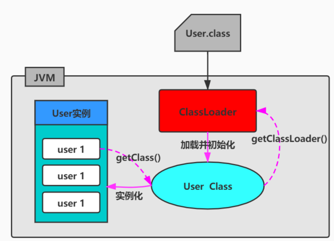
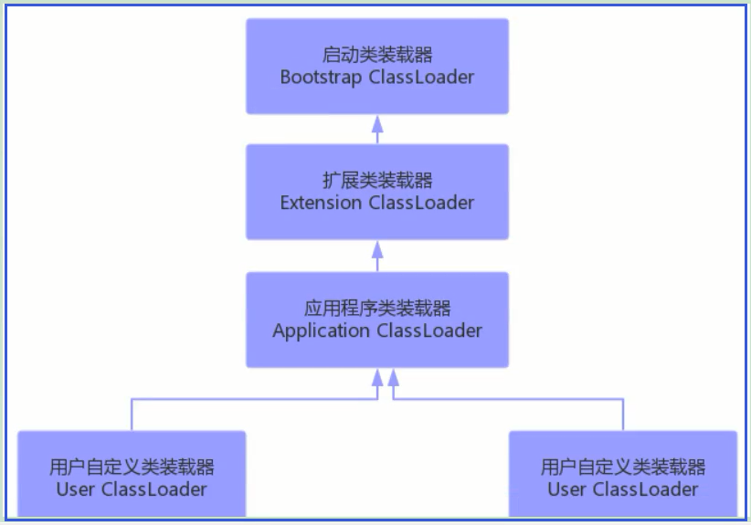
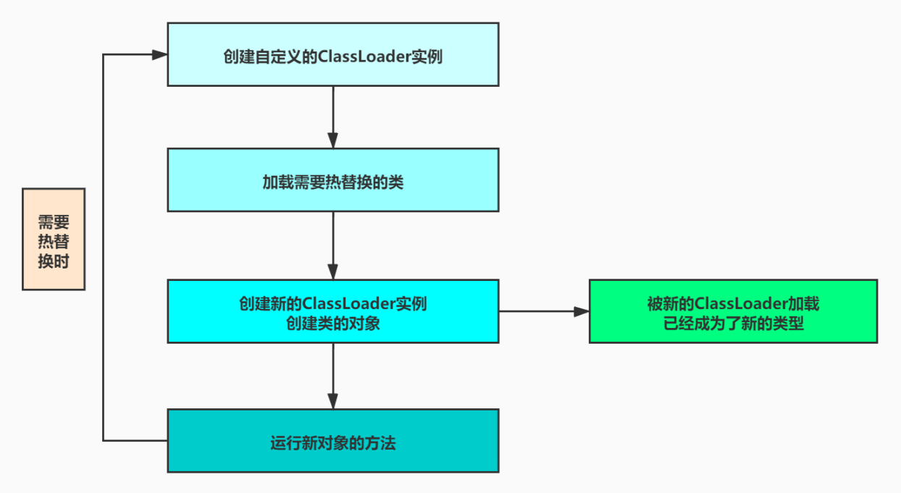
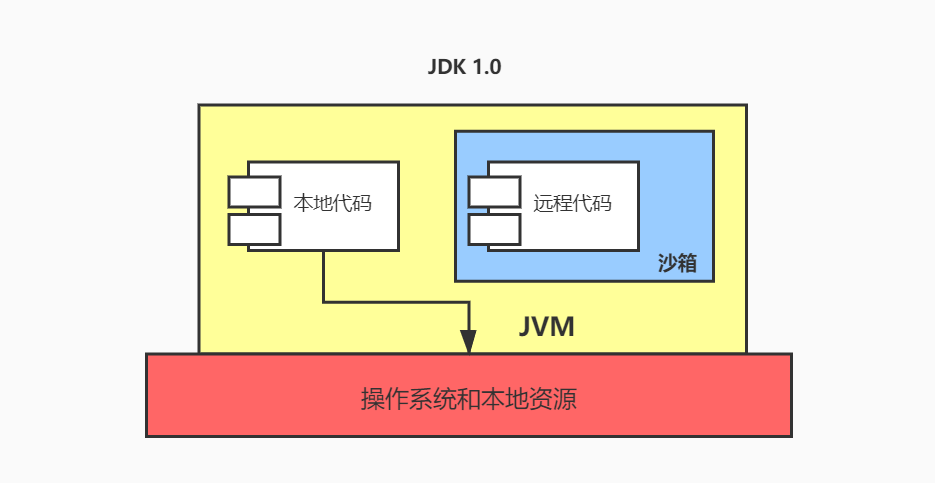
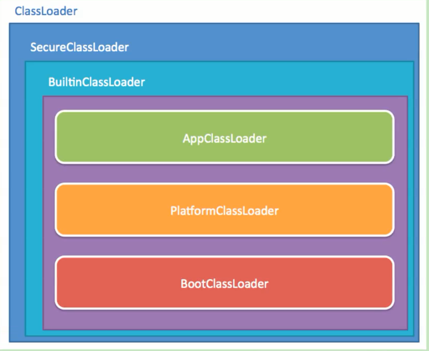
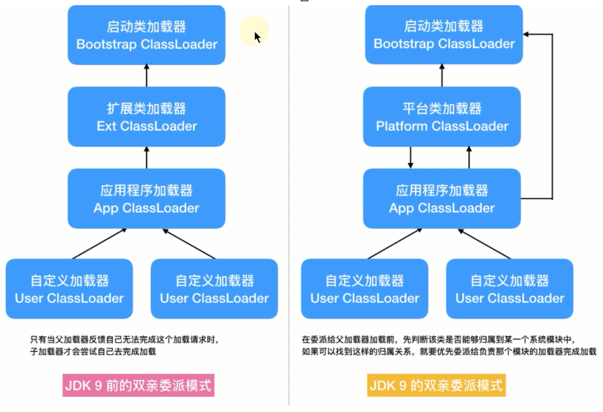

## 01、概述

ClassLoader是Java的核心组件，所有的Class都是由ClassLoader进行加载的，ClassLoader负责通过各种方式将Class信息的二进制数据流读入JVM内部，转换为一个与目标类对应的java.lang.Class对象实例。然后交给Java虚拟机进行链接、初始化等操作。因此ClassLoader在整个装载阶段，只能影响到类的加载，无法通过ClassLoader去改变类的链接和初始化行为。至于它是否可以运行，则由Execution Engine决定



类加载器最早出现在 Java 1.0 版本中，那个时候只是单纯地为了满足 Java Applet 应用而被研发出来，但如今类加载器却在 OSGI、字节码加解密领域大放异彩。这主要归功于 Java 虚拟机的设计者们当初在设计类加载器的时候，并没有考虑将它绑定在 JVM 内部，这样做的好处就是能够更加灵活和动态地执行类加载操作

### 1.1 类加载的分类

Class文件的显示加载与隐式加载的方式是指JVM加载Class文件到内存的方式

- 显示加载指的是在代码中通过调用ClassLoader加载Class对象，如直接使用Class.forName(name)或this.getClass().getClassLoader().loadClass()加载Class对象
- 隐式加载则是不直接在代码中调用ClassLoader的方法加载Class对象，而是通过虚拟机自动加载到内存中，如在加载某个类的Class文件时，该类的Class文件中引用了另外一个类的对象，此时额外引用的类将通过JVM自动加载到内存中

### 1.2 类加载器的必要性

一般情况下，Java 开发人员并不需要在程序中显式地使用类加载器，但是了解类加载器的加载机制却显得至关重要。从以下几个方面说：

- 避免在开发中遇到 java.lang.ClassNotFoundException 异常或 java.lang.NoClassDeFoundError 异常时手足无措。只有了解类加载器的加载机制才能够在出现异常的时候快速地根据错误异常日志定位问题和解决问题
- 需要支持类的动态加载或需要对编译后的字节码文件进行加解密操作时，就需要与类加载器打交道了
- 开发人员可以在程序中编写自定义类加载器来重新定义类的加载规则，以便实现一些自定义的处理逻辑

### 1.3 命名空间

对于任意一个类，**都需要由加载它的类加载器和这个类本身一同确认其在Java虚拟机中的唯一性**。每一个类加载器，都拥有一个独立的类命名空间：**比较两个类是否相等，只有在这两个类是由同一个类加载器的前提下才有意义**。否则即使这两个类源自同一个Class文件，被同一个虚拟机加载，只要加载他们的类加载器不同，那么这两个类就必定不相等

- 每个类加载器都有自己的命名空间，命名空间由该加载器以及所有的父加载器所加载的类组成
- 在同一命名空间中，不会出现类的完整名字（包括类的包名）相同的两个类
- 在不同的命名空间中，有可能出现类的完整名字（包括类的包名）相同的两个类

在大型应用中，可以借助这个特性来运行同一个类的不同版本

### 1.4 类加载机制的基本特征

- 双亲委派模型。但不是所有类加载都遵守这个模型，有的时候，启动类加载器所加载的类型，是可能要加载用户代码的，比如 JDK 内部的 ServiceProvider/ServiceLoader 机制，用户可以在标准 API 框架上，提供自己的实现，JDK 也需要提供些默认的参考实现。例如，Java 中 JNDI、JDBC、文件系统、Cipher 等很多方面，都是利用的这种机制，这种情况就不会用双亲委派模型去加载，而是利用所谓的上下文加载器
- 可见性，子类加载器可以访问父加载器加载的类型，但是反过来是不允许的。不然，因为缺少必要的隔离，我们就没有办法利用类加载器去实现容器的逻辑
- 单一性，由于父加载器的类型对于子加载器是可见的，所以父加载器中加载过的类型，就不会在子加载器中重复加载。但是注意，类加载器"邻居"间，同一类型仍然可以被加载多次，因为相互并不可见

## 02、类的加载器分类

JVM 支持两种类型的类加载器，分别为引导类加载器(Bootstrap ClassLoader)和自定义类加载器(User-Defined ClassLoader)

从概念上来讲，自定义类加载器一般指的是程序中由开发人员自定义的一类类加载器，但是 Java 虚拟机规范却没有这么定义，而是将所有派生于抽象类 ClassLoader 的类加载器都划分为自定义类加载器。无论类加载器的类型如何划分，在程序中我们最常见的类加载器结构主要是如下情况：



除了顶层的启动类加载器外，其余的类加载器都应当有自己的"父类"加载器

不同类加载器看似是继承(Inheritance)关系，实际上是包含关系。在下层加载器中，包含着上层加载器的引用

### 2.1 引导类加载器

- 使用C/C++实现的，嵌套在JVM内部
- 它用来加载Java核心库（JAVA_HOME/jre/lib/rt.jar或sun.boot.classs.path路径下的内容）。用于提供JVM自身需要的类
- 并不继承自java.lang.ClassLoader，没有父加载器
- 处于安全考虑，Bootstrap启动类只加载java、Javax、sun等开头的类
- 加载扩展类和应用程序类加载器，并指定为他们的父类加载器

### 2.2 扩展类加载器

Extension ClassLoader

- Java 语言编写，由 sun.misc.Launcher$ExtClassLoader 实现
- 继承于 ClassLoader 类
- 父类加载器为启动类加载器
- 从 java.ext.dirs 系统属性所指定的目录中加载类库，或从 JDK 的安装目录的 jre/lib/ext 子目录下加载类库。如果用户创建的 JAR 放在此目录下，也会自动由扩展类加载器加载


### 2.3 系统类加载器

应用程序类加载器(系统类加载器，AppClassLoader)

- Java 语言编写，由 sun.misc.Launcher$AppClassLoader 实现
- 继承于 ClassLoader 类
- 父类加载器为扩展类加载器
- 它负责加载环境变量 classpath 或系统属性 java.class.path 指定路径下的类库
- **应用程序中的类加载器默认是系统类加载器**
- 它是用户自定义类加载器的默认父加载器
- 通过 ClassLoader 的 getSystemClassLoader() 方法可以获取到该类加载器

### 2.4 用户自定义类加载器

- 在 Java 的日常应用程序开发中，类的加载几乎是由上述3种类加载器相互配合执行的。在必要时，我们还可以自定义类加载器，来定制类的加载方式
- 体现 Java 语言强大生命力和巨大魅力的关键因素之一便是，Java 开发者可以自定义类加载器来实现类库的动态加载，加载源可以是本地的 JAR 包，也可以是网络上的远程资源
- **通过类加载器可以实现非常绝妙的插件机制**，这方面的实际应用案例不胜枚举。例如，著名的 OSGI 组件框架，再如 Eclipse 的插件机制。类加载器为应用程序提供了一种动态增加新功能的机制，这种机制无需重新打包发布应用程序就能实现
- 同时，**自定义加载器能够实现应用隔离**，例如 Tomcat、Spring 等中间件和组件框架都在内部实现了自定义的加载器，并通过自定义加载器隔离不同的组件模块。这种机制比 C/C++ 程序要好太多，想不修改 C/C++ 程序就能为其新增功能，几乎是不可能的，仅仅一个兼容性便能阻挡所有美好的设想
- 自定义类加载器通常需要继承于 ClassLoader

## 03、测试不同的类加载器

每个 Class 对象都会包含一个定义它的 ClassLoader 的一个引用

获取 ClassLoader 的途径


说明：

站在程序的角度看，引导类加载器与另外两种类加载器(系统类加载器和扩展类加载器)并不是同一个层次意义上的加载器，引导类加载器是使用 C++ 语言编写而成的，而另外两种类加载器则是使用 Java 语言编写的。由于引导类加载器压根儿就不是一个 Java 类，因此在 Java 程序中只能打印出空值

数组类的 Class 对象，不是由类加载器去创建的，而是在 Java 运行期 JVM 根据需要自动创建的。对于数组类的类加载器来说，是通过 Class.geetClassLoader() 返回的，与数组当中元素类型的类加载器是一样的：如果数组当中的元素类型是基本数据类型，数组类是没有类加载器的

```java
String[] strArr = new String[6];
System.out.println(strArr.getClass().getClassLoader());
//运行结果：null

ClassLoaderTest[] test = new ClassLoaderTest[1];
System.out.println(test.getClass().getClassLoader());
//运行结果：sun.misc.Launcher$AppClassLoader@18b4aac2

int[] inst = new int[2];
System.out.println(inst.getClass().getClassLoader());
//运行结果：null
```

## 04、ClassLoader源码解析


## 05、双亲委派模型

### 5.1 定义与本质

类加载器用来把类加载到Java虚拟机中。从JDK1.2版本开始，类的加载过程采用双亲委派机制，这种机制能更好地保证java平台的安全。

1.定义
如果一个类加载器在接到加载类的请求时，它首先不会自己尝试去加载这个类，而是把这个请求任务委托给父类加载器去完成，依次递归，如果父类加载器可以完成类加载任务，就成功返回。只有父类加载器无法完成此加载任务时，才自己去加载。

2.本质
规定了类加载的顺序是:引导类加载器先加载，若加载不到，由扩展类加载器加载，若还加载不到，才会由系统类加载器或自定义的类加载器进行加载。


### 5.2 优势与劣势

**1.双亲委派机制优势**

- 避免类的重复加载，确保一个类的全局唯一性
- **Java类随着它的类加载器一起具备了一种带有优先级的层次关系，通过这种层级关可以避免类的重复加载**，当父亲已经加载了该类时，就没有必要子ClassLoader再加载一次。
- 保护程序安全，防止核心API被随意篡改

**2.代码支持**

双亲委派机制在java.lang.ClassLoader.loadClass(String,boolean)接口中体现。该接口的逻辑如下:

(1)先在当前加载器的缓存中查找有无目标类，如果有，直接返回。

(2)判断当前加载器的父加载器是否为空，如果不为空，则调用parent.loadClass(name，false)接口进行加载。

(3)反之，如果当前加载器的父类加载器为空，则调用findBootstrapClassOrNull(name)接口，让引导类加载器进加载。

(4)如果通过以上3条路径都没能成功加载，则调用findClass(name)接口进行加载。该接口最终会调用java.lang.ClassLoader接口的defineClass系列的native接口加载目标Java类。

双亲委派的模型就隐藏在这第2和第3步中。

**3.举例**

假设当前加载的是java.lang.Object这个类，很显然，该类属于JDK中核心得不能再核心的一个类，因此一定只能由引导类加载器进行加载。当JVM准备加载java.lang.Object时，JVM默认会使用系统类加载器去加载，按照上面4步加载的逻辑，在第1步从系统类的缓存中肯定查找不到该类，于是进入第2步。由于从系统类加载器的父加载器是扩展类加载器，于是扩展类加载器继续从第1步开始重复。由于扩展类加载器的缓存中也一定查找不到该类，因此进入第2步。扩展类的父加载器是null,因此系统调用findClass(String)，最终通过引导类加载器进行加载。

**4.思考**

如果在自定义的类加载器中重写java.lang.ClassLoader.loadClass(String)或java.lang.ClassLoader.loadClass(String, boolean)方法,抹去其中的双亲委派机制,仅保留上面这4步中的第1步与第4步，那么是不是就能够加载核心类库了呢?
这也不行!因为JDK还为核心类库提供了一层保护机制。不管是自定义的类加载器，还是系统类加载器还是扩展类加载器，最终都必须调用java.lang.classLoader.defineClass(String,byte[], int, int, ProtectionDomain)方法，而该方法会执行preDefineClass()接口，该接口中提供了对JDK核心类库的保护。

**5.双亲委托模式的弊端**

检查类是否加载的委托过程是单向的，这个方式虽然从结构上说比较清晰，使各个ClassLoader的职责非常明确，但是同时会带来一个问题，即顶层的ClassLoader无法访问底层的ClassLoader所加载的类。

通常情况下，启动类加载器中的类为系统核心类，包括一些重要的系统接口，而在应用类加载器中，为应用类。按照这种模式，应用类访问系统类自然是没有问题，但是系统类访问应用类就会出现问题。比如在系统类中提供了一个接口，该接口需要在应用类中得以实现，该接口还绑定一个工厂方法，用于创建该接口的实例，而接口和工厂方法都在启动类加载器中。这时，就会出现该工厂方法无法创建由应用类加载器加载的应用实例的问题。

**6.结论:**

**由于Java虚拟机规范并没有明确要求类加载器的加载机制一定要使用双亲委派模型，只是建议采用这种方式而己。**

比如在Tomcat中，类加载器所采用的加载机制就和传统的双亲委派模型有一定区别，当缺省的类加载器接收到一个类的加载任务时，首先会由它自行加载，当它加载失败时，才会将类的加载任务委派给它的超类加载器去执行，这同时也是Servlet规范推荐的一种做法。

### 5.3 破坏双亲委派机制

双亲委派模型并不是一个具有强制性约束的模型，而是Java设计者推荐给开发者们的类加载器实现方式。

在Java的世界中大部分的类加载器都遵循这个模型，但也有例外的情况，直到Java模块化出现为止，双亲委派模型主要出现过3次较大规模“被破坏”的情况。

**第一次破坏双亲委派机制:**

双亲委派模型的第一次“被破坏”其实发生在双亲委派模型出现之前--即JDK1.2面世以前的“远古”时代。

由于双亲委派模型在JDK 1.2之后才被引入，但是类加载器的概念和抽象类java.lang.ClassLoader则在Java的第一个版本中就已经存在，面对已经存在的用户自定义类加载器的代码，Java设计者们引入双亲委派模型时不得不做出一些妥协，**为了兼容这些已有代码，无法再以技术手段避免loadClass()被子类覆盖的可能性**，只能在JDK1.2之后的java.lang.ClassLoader中添加一个新的protected方法findClass()，并引导用户编写的类加载逻辑时尽可能去重写这个方法，而不是在loadClass()中编写代码。上节我们已经分析过loadClass()方法，双亲委派的具体逻辑就实现在这里面，按照loadClass()方法的逻辑，如果父类加载失败，会自动调用自己的findClass()方法来完成加载，这样既不影响用户按照自己的意愿去加载类，又可以保证新写出来的类加载器是符合双亲委派规则的。

**第二次破坏双亲委派机制:线程上下文类加载器**

双亲委派模型的第二次“被破坏”是由这个模型自身的缺陷导致的，双亲委派很好地解决了各个类加载器协作时基础类型的一致性问题〈越基础的类由越上层的加载器进行加载），基础类型之所以被称为“基础”，是因为它们总是作为被用户代码继承、调用的API存在，但程序设计往往没有绝对不变的完美规则，如果有基础类型又要调用回用户的代码,那该怎么办呢?

这并非是不可能出现的事情，一个典型的例子便是JNDI服务，JNDI现在已经是Java的标准服务，它的代码由启动类加载器来完成加载（在JDK 1.3时加入到rt.jar的)，肯定属于Java中很基础的类型了。但JNDI存在的目的就是对资源进行查找和集中管理，它需要调用由其他厂商实现并部署在应用程序的ClassPath下的NDI服务提供者接口（Service Provider Interface，SPI）的代码，现在问题来了，启动类加载器是绝不可能认识、加载这些代码的，那该怎么办?(SPI:在Java平台中，通常把核心类rt.jar中提供外部服务、可由应用层自行实现的接口称为SPI)

为了解决这个困境，Java的设计团队只好引入了一个不太优雅的设计:线程上下文类加载器（Thread ContextClassLoader)。这个类加载器可以通过java.lang.Thread类的setContextClassLoader()方法进行设置，如果创建线程时还未设置，它将会从父线程中继承一个，如果在应用程序的全局范围内都没有设置过的话，那这个类加载器默认就是应用程序类加载器。

有了线程上下文类加载器，程序就可以做一些“舞弊”的事情了。JNDI服务使用这个线程上下文类加载器去加载所需的SPI服务代码，这是一种父类加载器去请求子类加载器完成类加载的行为，这种行为实际上是打通了双亲委派模型的层次结构来逆向使用类加载器，已经违背了双亲委派模型的一般性原则，但也是无可奈何的事情。Java中涉及SPI的加载基本上都采用这种方式来完成，例如NDI、JDBC、JCE、JAXB和BT等。不过，当SPI的服务提供者多于一个的时候，代码就只能根据具体提供者的类型来硬编码判断，为了消除这种极不优雅的实现方式，在JDK 6时，JDK提供了java.util.ServiceLoader类，以META-INF/services中的配置信息，辅以责任链模式，这才算是给SPI的加载提供了一种相对合理的解决方案。


默认上下文加载器就是应用类加载器，这样以上下文加载器为中介，使得启动类加载器中的代码也可以访问应用类加载器中的类。

**第三次破坏双亲委派机制:**

双亲委派模型的第三次“被破坏”是由于用户对程序动态性的追求而导致的。如:代码热替换（Hot Swap)、模块热部署（Hot Deployment）等

IBM公司主导的JSR-291(即OSGi R4.2）实现模块化热部署的关键是它自定义的类加载器机制的实现，每一个程序模块（OSGi中称为Bundle)都有一个自己的类加载器，当需要更换一个Bundle时，就把Bundle连同类加载器一起换掉以实现代码的热替换。在OSGi环境下，类加载器不再双亲委派模型推荐的树状结构，而是进一步发展为更加复杂的网状结构。

当收到类加载请求时，OSGi将按照下面的顺序进行类搜索:（不细讲）

1）将以java.*开头的类，委派给父类加载器加载。

2）否则，将委派列表名单内的类，委派给父类加载器加载。

3）否则，将Import列表中的类，委派给Export这个类的Bundle的类加载器加载。

4）否则，查找当前Bundle的ClassPath，使用自己的类加载器加载。

5）否则，查找类是否在自己的Fragment Bundle中，如果在，则委派给Fragment Bundle的类加载器加载。

6）否则，查找Dynamic Import列表的Bundle，委派给对应Bundle的类加载器加载。

7）否则，类查找失败。

说明:只有开头两点仍然符合双亲委派模型的原则，其余的类查找都是在平级的类加载器中进行的

小结:

这里，我们使用了“被破坏”这个词来形容上述不符合双亲委派模型原则的行为，但这里“被破坏”并不一定是带有贬义的。只要有明确的目的和充分的理由，突破旧有原则无疑是一种创新。

正如:OSGi中的类加载器的设计不符合传统的双亲委派的类加载器架构，且业界对其为了实现热部署而带来的额外的高复杂度还存在不少争议，但对这方面有了解的技术人员基本还是能达成一个共识，认为OSGi中对类加载器的运用是值得学习的，完全弄懂了OSGi的实现，就算是掌握了类加载器的精粹。

### **5.4 热替换的实现**

热替换是指在程序的运行过程中，不停止服务，只通过替换程序文件来修改程序的行为。热替换的关键需求在于服务不能中断，修改必须立即表现正在运行的系统之中。基本上大部分脚本语言都是天生支持热替换的，比如: PHP，只要替换了PHP源文件，这种改动就会立即生效，而无需重启Web服务器。

但对Java来说，热替换并非天生就支持，如果一个类已经加载到系统中，通过修改类文件，并无法让系统再来加载并重新定义这个类。因此，在Java中实现这一功能的一个可行的方法就是灵活运用ClassLoader。

注意:由不同ClassLoader加载的同名类属于不同的类型，不能相互转换和兼容。即两个不同的ClassLoader加载同个类，在虚拟机内部，会认为这2个类是完全不同的。

根据这个特点，可以用来模拟热替换的实现，基本思路如下图所示:



## 06、沙箱安全机制

沙箱安全机制

- 保护程序安全
- 保护 Java 原生的 JDK 代码

Java 安全模型的核心就是 Java 沙箱(Sandbox)。什么是沙箱？沙箱就是一个限制程序运行的环境

沙箱机制就是将 Java 代码限定在虚拟机(JVM)特定的运行范围中，并且严格限制代码对本地系统资源访问。通过这样的措施来保证对代码的有限隔离，防止对本地系统造成破坏

沙箱主要限制系统资源访问，那系统资源包括什么？CPU、内存、文件系统、网络。不同级别的沙箱对这些资源访问的限制也可以不一样

所有的 Java 程序运行都可以指定沙箱，可以定制安全策略

### 6.1 JDK1.0时期

在Java中将执行程序分成本地代码和远程代码两种，本地代码默认视为可信任的，而远程代码则被看作是不受信的。对于授信的本地代码，可以访问一切本地资源。而对于非授信的远程代码在早期的Java实现中，安全依赖于沙箱（Sandbox）机制。如下图所示JDK1.0安全模型



### 6.2 JDK1.1时期

JDK1.0中如此严格的安全机制也给程序的功能扩展带来障碍，比如当用户希望远程代码访问本地系统的文件时候，就无法实现。
因此在后续的Java1.1版本中，针对安全机制做了改进，增加了安全策略。允许用户指定代码对本地资源的访问权限。如下图所示JDK1.1安全模型


### 6.3 JDK1.2时期

在Java1.2版本中，再次改进了安全机制，增加了代码签名。不论本地代码或是远程代码，都会按照用户的安全策略设定，由类加载器加载到虚拟机中权限不同的运行空间，来实现差异化的代码执行权限控制。如下图所示JDK1.2安全模型


### 6.4 JDK1.6时期

当前最新的安全机制实现，则引入了域(Domain)的概念。

虚拟机会把所有代码加载到不同的系统域和应用域。系统域部分专门负责与关键资源进行交互，而各个应用域部分则通过系统域的部分代理来对各种需要的资源进行访问。虚拟机中不同的受保护域(Protected Domain)，对应不一样的权限（Permission)。存在于不同域中的类文件就具有了当前域的全部权限，如下图所示，最新的安全模型（jdk1.6)


## 07、自定义类的加载器

**1.为什么要自定义类加载器?**

- 隔离加载类

  在某些框架内进行中间件与应用的模块隔离，把类加载到不同的环境。比如:阿里内某容器框架通过自定义类加载器确保应用中依赖的jar包不会影响到中间件运行时使用的jar包。再比如: Tomcat这类web应用服务器，内部自定义了好几种类加载器，用于隔离同一个web应用服务器上的不同应用程序。（类的仲裁-->类冲突）

- 修改类加载的方式
  类的加载模型并非强制，除Bootstrap外，其他的加载并非一定要引入，或者根据实际情况在某个时间点进行按需进行动态加载

- 扩展加载源
  比如从数据库、网络、甚至是电视机机顶盒进行加载

- 防止源码泄漏
  Java代码容易被编译和篡改，可以进行编译加密。那么类加载也需要自定义，还原加密的字节码。

**2.常见的场景**

- 实现类似进程内隔离，类加载器实际上用作不同的命名空间，以提供类似容器、模块化的效果。例如，两个模块依赖于某个类库的不同版本，如果分别被不同的容器加载，就可以互不干扰。这个方面的集大成者是Java EE和OSGI、JPMS等框架。
- 应用需要从不同的数据源获取类定义信息，例如网络数据源，而不是本地文件系统。或者是需要自己操纵字节码，动态修改或者生成类型。

**3.注意:**

在一般情况下，使用不同的类加载器去加载不同的功能模块，会提高应用程序的安全性。但是，如果涉及Java类型转换，则加载器反而容易产生不美好的事情。在做Java类型转换时，只有两个类型都是由同一个加载器所加载，才能进行类型转换，否则转换时会发生异常。

----

用户通过定制自己的类加载器，这样可以重新定义类的加载规则，以便实现一些自定义的处理逻辑。

**1.实现方式**

- Java提供了抽象类java.lang.ClassLoader，所有用户自定义的类加载器都应该继承ClassLoader类。
- 在自定义ClassLoader 的子类时候，我们常见的会有两种做法:
  - 方式一:重写loadclass()方法
  - **重写findClass()方法【推荐】**

**2.对比**

这两种方法本质上差不多，毕竟loadClass()也会调用findClass()，但是从逻辑上讲我们最好不要直接修改
loadClass()的内部逻辑。建议的做法是只在findClass()里重写自定义类的加载方法，根据参数指定类的名字，返回对应的Class对象的引用。

- loadClass()这个方法是实现双亲委派模型逻辑的地方，擅自修改这个方法会导致模型被破坏，容易造成问题。因此我们最好是在双亲委派模型框架内进行小范围的改动，不破坏原有的稳定结构。同时，也避免了自己重写loadClass()方法的过程中必须写双亲委托的重复代码，从代码的复用性来看，不直接修改这个方法始终是比较好的选择。
- 当编写好自定义类加载器后，便可以在程序中调用loadClass(）方法来实现类加载操作。

**3.说明**

- 其父类加载器是系统类加载器
- JVM中的所有类加载都会使用java.lang.ClassLoader.loadClass(String)接口(自定义类加载器并重写java.lang.ClassLoader.loadClass(String)接口的除外)，连JDK的核心类库也不能例外。

## 08、Java9新特性

为了保证兼容性，JDK 9没有从根本上改变三层类加载器架构和双亲委派模型，但为了模块化系统的顺利运行，仍然发生了一些值得被注意的变动。

1.扩展机制被移除，扩展类加载器由于向后兼容性的原因被保留，不过被重命名为平台类加载器（platform classloader)。可以通过ClassLoader的新方法getPlatformClassLoader()来获取。

JDK 9时基于模块化进行构建（原来的 rt.jar 和 tools.jar 被拆分成数十个 JMOD 文件)，其中的Java类库就已天然地满足了可扩展的需求，那自然无须再保留<JAVA_HONE>\lib\ext 目录，此前使用这个目录或者 java.ext.dirs系统变量来扩展JDK功能的机制已经没有继续存在的价值了。

2.平台类加载器和应用程序类加载器都不再继承自 java.net.URLClassLoader。
现在启动类加载器、平台类加载器、应用程序类加载器全都继承于jdk.internal.loader.BuiltinClassLoader。



如果有程序直接依赖了这种继承关系，或者依赖了URLClassLoader类的特定方法，那代码很可能会在 JDK9及更高版本的JDK中崩溃。

3.在Java 9中，类加载器有了名称。该名称在构造方法中指定，可以通过getName()方法来获取。平台类加载器的名称是platform，应用类加载器的名称是app。类加载器的名称在调试与类加载器相关的问题时会非常有用。

4.启动类加载器现在是在jvm内部和java类库共同协作实现的类加载器〈以前是C++实现)，但为了与之前代码兼容，在获取启动类加载器的场景中仍然会返回null，而不会得到BootClassLoader实例。

5.类加载的委派关系也发生了变动。

当平台及应用程序类加载器收到类加载请求，在委派给父加载器加载前，要先判断该类是否能够归属到某一个系统模块中，如果可以找到这样的归属关系，就要优先委派给负责那个模块的加载器完成加载。



在Java模块化系统明确规定了三个类加载器负责各自加载的模块