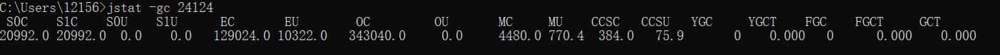
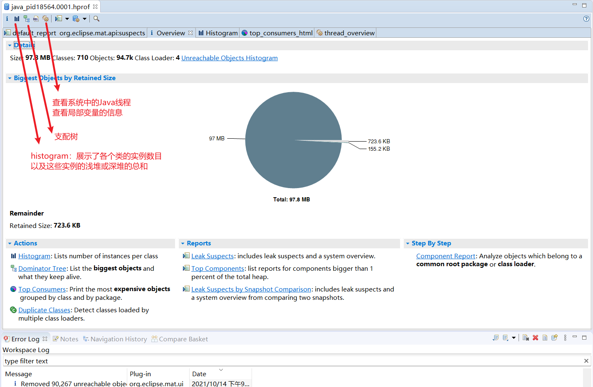
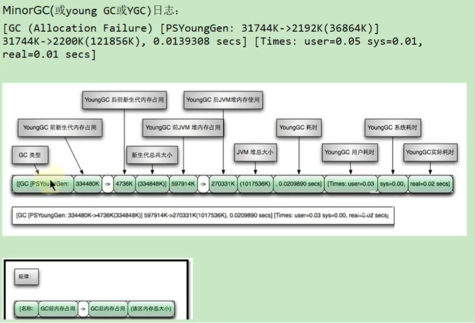
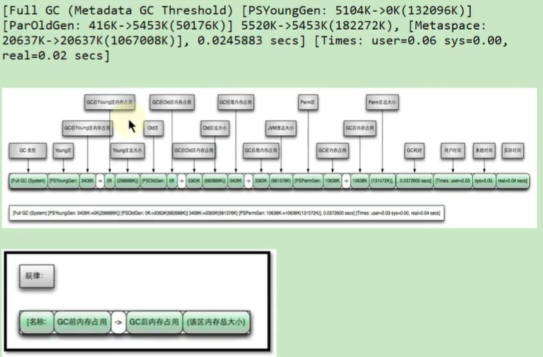
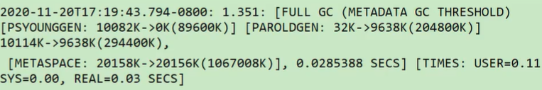

# 第一章 概述篇

## 1.1 背景说明

1. 生产环境中的问题：

   - 生产环境发生了内存溢出该如何处理？
   - 生产环境应该给服务器分配多少内存合适？
   - 如何对垃圾回收器的性能进行调优？
   - 生产环境CPU负载飙高该如何处理？
   - 生产环境应该给应用分配多少线程合适？
   - 不加log，如何确定请求是否执行了某一行代码？
   - 不加log，如何实时查看某个方法的入参和返回值？

2. 为什么要调优？

   防止出现OOM、解决OOM、减少FullGC出现的频率

3. 不同阶段的考虑：

   上线前、项目运行阶段、线上出现OOM

## 1.2 调优概述

1. 监控的依据

   运行日志、异常堆栈、GC日志、线程快照、堆转储快照

2. 调优的大方向

   合理地编写代码、充分并合理的使用硬件资源、合理地进行JVM调优

## 1.3 性能优化的步骤

1. （发现问题）：性能监控

   > 性能监控是一种非强行或者入侵方式收集或查看应用运营性能数据的活动
   >
   > 监控通常是指一种在生产、质量评估或者开发环境下实施的带有预防或主动性的活动
   >
   > 当应用相关干系人提出性能问题却没有提供足够多的线索时，首先我们需要进行性能监控，随后是性能分析

   GC、cpu load过高、OOM、内存泄漏、死锁、程序响应时间较长

2. （排查问题）：性能分析

   > 性能分析是一种侵入方式收集运行性能数据的活动，它会影响应用的吞吐量或响应性
   >
   > 性能分析是针对性能问题的答复结果，关注的范围通常比性能监控更加集中
   >
   > 性能分析很少在生产环境下进行，通常是在质量评估、系统测试或者开发环境下进行，是性能监控之后的步骤

   - 打印GC日志，通过GCviewer或者http://gceasy.io来分析异常信息
   - 灵活运用命令行工具、jstack、jmap、jinfo等
   - dump出堆文件，使用内存分析工具分析文件
   - 使用阿里Arthas、jconsole、JVisualVM来实时查看JVM状态
   - jstack查看堆栈信息

3. （解决问题）：性能调优

   > 一种为改善应用响应性或吞吐量而更改参数、源代码、属性配置的活动，性能调优是在性能监控、性能分析之后的活动

   - 适当增加内存，更具业务背景选择垃圾回收器
   - 优化代码，控制内存使用
   - 增加机器，分散节点压力
   - 合理设置线程池线程数量
   - 使用中间件提高程序效率，比如缓存、消息队列等

## 1.4 性能评价/测试指标

1. 停顿时间（或响应时间）

   提交请求和返回该请求的响应之间使用的时间，在垃圾回收环节中：暂停时间：垃圾收集时，程序的工作线程被暂停的时间

   -XX：MaxGCPauseMillis

2. 吞吐量：对单位时间内完成的工作量（请求）的量度，在GC中，运行用户代码的事件占总运行时间的比例 -XX：GCTimeRatio = n，吞吐量为1-1/(1 + n)

3. 并发数：同一时刻，对服务器有实际交互的请求数

4. 内存占用：Java堆区所占的内存大小

# 第二章 JVM监控及诊断工具-命令行篇

## 2.1 jps：查看正在运行的Java进程

Javav Process Status

显示指定系统内所有的HotSpot虚拟机进程（查看虚拟机进程信息），可用于查询正在运行的虚拟机进程。说明：对于本地虚拟机进程来说，进程的本地虚拟机ID与操作系统的进程ID是一致的，是唯一的。

基本语法：jsp [ options ]  [ hostid ]，还可以通过jps -help 来产看对应的参数信息

**options参数**：

-q：仅仅显示LVMID（local virtual machine id），即本地虚拟机唯一id，不显示主类的名称

-l：输出应用程序主类的全类名 或 如果进程执行的是jar包，则输出jar完整路径

-m：输出虚拟机进程启动时传递给主类main( )的参数

-v：列出虚拟机进程启动时的JVM参数。比如：-Xms20m -Xmx50m是启动程序指定的jvm参数

以上参数可以综合使用：jps -l -m 等价于jps -lm

将信息输出到同级文件中：命令 > 文件名称	：	jps -l > a.txt

如果某Java进程关闭了默认开启的UsePerfData参数（即使用参数 -XX：-UsePerfData），那么jps命令（以及下面介绍的jstat）将无法探知该Java进程

**hostid参数**：

RMI注册表中注册的主机名。如果想要远程监控主机上的java程序，需要安装jstatd。

对于具有更严格的安全实践的网络场所而言，可能使用一个自定义的策略文件来显示对特定的可信主机或网络的访问，尽管这种技术容易受到IP地址欺诈攻击

如果安全问题无法使用一个定制的策略文件来处理，那么最安全的操作是不允许jstatd服务器，而是在本地使用jstat和jps工具

## 2.2 jstat：查看JVM统计信息

JVM Statistics Monitoring Tool：用于监视虚拟机各种运行状态信息的命令行工具。它可以显示本地或者远程虚拟机进程中的类装载、内存、垃圾收集、JIT编译等运行数据。在没有GUI图形界面，只提供了纯文本控制台环境的服务器上，它将是运行期定位虚拟机性能问题的首选工具。常用于检测垃圾回收问题以及内存泄漏问题

**基本语法**

jstat  < option> [-t] [-h< lines > ]  < vmid > [ < interval> [ < count> ] ]

其中的vmid就是进程id号，也就是通过jps查看到的那串数字 

**option**

- **类转载相关的**：

  -class：显示ClassLoader的相关信息：类的装载、卸载数量、总空间、类装载所消耗的时间等

- **垃圾回收相关的：**

  -gc：显示与GC相关的堆信息。包括Eden区、两个Survivor区、老年代、永久代等的容量、已用空间、GC时间合计等信息

  -gccapacity：显示内容与-gc基本相同，但是输出主要关注已使用空间占总空间的百分比。

  -gcutil：显示内容与-gc基本相同，单输出主要关注已使用空间占总空间的百分比

  -gccause：与-gcutil功能一样，但是会额外输出导致最后一次或当前正在发生的GC产生的原因

  -gcnew：显示新生代GC状况

  -gcnewcapacity：显示内容与-gcnew基本相同，输出主要关注使用到的最大、最小空间

  -gcold：显示老年代GC状况

  -gcoldcapacity：显示内容基本与-gcold相同，输出主要关注使用到的最大、最小空间

  -gcpermcapacity：显示永久代使用到的最大、最小空间

- **JIT相关的：**

  -compiler：显示JIT编译器编译过的方法、耗时等信息

  -printcompilation：输出已经被JIT编译的方法

**interval参数**：用于指定输出统计数据的周期，单位为毫秒。即：查询间隔

**count参数**：用于指定查询的总次数

**-t参数**：可以在输出信息前加上一个Timestamp列，显示程序的运行时间。单位秒

> 我们可以比较Java进行的启动时间以及总GC时间（GCT列），或者两次测量的间隔时间以及总GC时间的增量来得出GC时间占运行时间的比例。
>
> 如果该比例超过20%，则说明目前堆的压力较大；如果该比例超过90%，则说明堆里几乎没有可用空间，随时都可能抛出OOM异常。

**-h参数**：可以在周期性数据输出时，输出多少行数据后输出一个表头信息

举例：`jstat -class -t -h3 13152 1000 10`：h3表示每个3个分隔一次，13152表示类的进程id，1000表示每隔1000毫秒打印一次，10代表一共打印10次；


`jstat -gc 24124`：



在-gc中有很多指标，需要注意这些指标的含义

1. 新生代相关
   - S0C是幸存者零区的大小（字节）
   - S1C是幸存者一区的大小（字节）
   - S0U：幸存者零区已使用的大小（字节）
   - S1U：幸存者一区已使用的大小
   - EC：Eden区的大小
   - EU：Eden区已使用的大小
2. 老年代相关
   - OC：老年代的大小
   - OU：老年代已使用的大小
3. 方法区（元空间）相关：
   - MC：方法区的大小
   - MU：方法区已使用的大小
   - CCSC：压缩类空间的大小
   - CCSU：压缩类空间已使用的大小
4. 其他
   - YGC是应用程序启动到采样时young gc的次数
   - YGCT是指从应用程序启动到采样时young gc消耗时间（秒）
   - FGC：从应用程序启动到采样时full gc的次数
   - FGCT：从应用程序启动到采样full gc的消耗时间
   - GCT：从应用程序启动到采样时gc的总时间

**补充**：jstat还可以用来判断是否出现内存泄漏

1. 在长时间运行的Java程序中，我们可以运行jstat命令连续获取多行性能数据，并取这几行数据中OU列（即已占用的老年代内存）的最小值
2. 然后每个一段较长的时间重复一次上述操作，来获取多组OU最小值。如果这些值呈上涨趋势，则说明该Java程序的老年代内存已使用量在不断上涨，这意味着无法回收的对象在不断增加，因此很有可能存在内存泄漏

## 2.3 jinfo：实时查看和修改JVM配置参数

Configuration Info for Java

查看虚拟机配置参数信息，也可用于调整虚拟机的配置参数

通过该命令，可以很方便地找到Java虚拟机参数的当前值

**基本语法**

jinfo [ options ] pid

**options**

| 选项             | 选项说明                                                     |
| ---------------- | ------------------------------------------------------------ |
| no option        | 输出全部的参数和系统属性                                     |
| -flag name       | 输出对应名称的参数                                           |
| -flag [+ - name] | 开启或关闭对应名称的参数，只有被标记为manageable的参数才可以被动态修改 |
| -flag name=value | 设定对应名称的参数                                           |
| -flags           | 输出全部的参数                                               |
| -sysprops        | 输出系统属性                                                 |

**拓展**

- java -XX：+PrintFlagsInitial：查看所有JVM参数启动的初始值
- java -XX：+PrintFlagsFinal：查看所有JVM参数的最终值，值前面添加冒号的是修改之后的值，没有添加的都是没有发生改变的初始值
- java -参数名称：+PrintCommandLineFlags：查看那些已经被用户或者JVM设置过的详细的XX参数的名称和值

## 2.4 jmap：导出内存映像文件&内存使用情况

作用一方面是获取dump文件（堆转储快照文件，二进制文件），它还可以获取目标Java进程的内存相关信息，包括Java堆各区域的使用情况、堆中对象的统计信息、类加载信息等

**基本语法**

- jmap [ option ] < pid >

- jmap [ option ] < executable < core >

  < executable < core >代表可执行的代码，比如使用 > 文件名称 来指定生成的dump文件的生成位置

- jmap [ option ] [ server_id@ ] < remote server IP or hostname >

  为远程连接准备的

**option**

| 选项           | 作用                                                         |
| -------------- | ------------------------------------------------------------ |
| **-dump**      | 生成dump文件；-dump:live只保存堆中的存活对象                 |
| -finalizerinfo | 以ClassLoader为统计口径输出永久代的内存状态信息，**仅Linux/solaris平台有效** |
| **-heap**      | 输出整个堆空间的详细信息，包括GC的使用、堆配置信息，以及内存的使用信息等。 |
| **-histo**     | 输出堆空间中对象的统计信息，包括类、实例数量和合计容量。-histo:live只统计堆中存活对象 |
| -permstat      | 以ClassLoader为统计口径输出永久代的内存状态信息，**仅Linux/solaris平台有效** |
| -F             | 当虚拟机进程对-dump选项没有任何响应时，强制执行生成dump文件，**仅Linux/solaris平台有效** |

当程序发生OOM退出系统时，一些瞬时信息都随着程序的终止而消失，而重现OOM问题往往比较困难或者耗时。此时若能在OOM时，自动导出dump文件就显得非常迫切

-XX: +HeapDumpOnOutOfMemoryError: 在程序发生OOM时，导出应用程序的当前快照。

-XX：HeapDumpPath：可以指定堆快照的保存位置

例如：-Xmx100m -XX:+HeapDumpOnOutOfMemoryError -XX:HeapDumpPath=D:\m.hprof

**小结**

由于jmap将访问堆中的所有对象，为了保证在此过程中不被应用线程干扰，jmap需要借助安全点机制，让所有线程停留在不改变堆中数据的状态。可能导致基于该堆快照的分析结果存在偏差。

例如：假设在编译生成的机器码中，某些对象的生命周期在两个安全点之间，那么：live选项就无法探知到这些对象。

如果某个线程长时间无法跑到安全点，jmap将会一直等下去

与jstat不同，垃圾回收器会主动将jstat所需要的摘要数据保存至固定位置之中，jstat只需要直接读取即可

## 2.5 jstack：打印JVM中线程快照

用于生成虚拟机指定进程当前时刻的线程快照（虚拟经济堆栈跟踪）。线程快照就是当前虚拟机内指定进程的每一条线程正在执行的方法堆栈的集合

作用：可用于定位线程出现长时间停顿的原因，如线程间死锁、死循环、请求外部资源导致的长时间等待等问题。这些都是导致线程长时间停顿的常见原因。当线程出现停顿时，就可以用jstack显示各个线程调用的堆栈情况

在thread dump中，要留意下面几种状态

- **死锁，DeadLock**
- **等待资源，Waiting on condition**
- **等待获取监视器，Waiting on monitor entry**
- **阻塞，Blocked**
- 执行中，Runnable
- 暂停，Suspended
- 对象等待中，Object.wait（）或TIMED_WAITING
- 停止，Parked

**基本语法**：jstack option pid

**option**

- -F：当正常输出的请求不被响应时，强制输出线程堆栈
- -l：除了堆栈外，显示关于锁的附加信息
- -m：如果调用本地方法的话，可以显示C/C++的堆栈
- -h：帮助操作

## 2.6 jcmd：多功能命令行

它是一个多功能的工具，可以用来实现除了jstat之外所有命令的功能。比如：导出堆、内存使用、查看Java进程、导出线程信息、执行GC、JVM运行时间等。

**基本语法**

- jcmd -l：列出所有JVM进程
- jcmd 进程号 help：针对指定的进程，列出支持的所欲具体命令

## 2.7 jstatd：远程主机信息收集


# 第三章 JVM监控及诊断工具-GUI篇

## 3.1 JConsole

主要作用：能查看VM概要、分析堆内存使用量、线程、类、CPU占用率等信息。

## 3.2 VisualVM

它是一个功能强大的多合一故障诊断和性能监控的可视化工具。

它集成了多个JDK命令行工具，使用VisualVM可以用于显示虚拟机进程及进程的配置和环境信息（jps、jinfo），监视应用程序的CPU、GC、堆、方法区及线程的信息（jstat、jstack）等，甚至代替JConsole

**远程连接方式**

1. 确定远程服务器的ip地址
2. 添加JMX（通过JMX技术具体监控远程服务器哪个Java进程）
3. 修改bin/catalina.sh文件，连接远程tomcat
4. 在../conf中添加imxremote.access和jmxremote.password文件
5. 将服务器地址改成公网ip地址
6. 设置阿里云安全策略和防火墙策略
7. 启动tomcat，查看tomcat启动日志和端口监听
8. JMX中输入端口号、用户名、密码登录

**主要功能**

1. 生成/读取堆内存快照
2. 查看JVM参数和系统属性
3. 查看运行中的虚拟机进程
4. 生成/读取线程快照
5. 程序资源的实时监控
6. JMX代理连接、远程环境监控、CPU分析和内存分析

## 3.3 Eclipse MAT

### 3.3.1 基本使用

**MAT支持使用OQL语言查询对象信息**

MAT可以分析heap dump文件。在进行内存分析时，只要获得了反映当前设备内存映像的hprof文件，通过MAT打开就可以直观地看到当前的内存信息

一般来说这些信息包含：

1. 所有的对象信息，包括对象实例、成员变量、存储于栈中的基本类型值和存储于堆中的其他对象的引用值
2. 所有的类信息，包括classloader、类名称、父类、静态变量等
3. GCRoot到所有的这些对象的引用路径
4. 线程信息，包括线程的调用栈及此线程的线程局部变量（TLS）



### 3.3.2 浅堆与深堆

**浅堆（Shallow Heap）**是指一个对象所消耗的内存。在32为系统中，一个对象引用会占据4个字节，一个int类型会占据4个字节，long占据8个，每个对象光头需要8个字节。根据堆快照格式不同，对象的大小可能会向8字节进行对齐

以String为例：2个int值共占8字节，对象引用占4字节，对象头8字节，合计20，但是向8字节看齐，就是24字节（jdk7中）。这24字节为String对象的浅堆大小。它与String的value实际取值无关，无论字符串长度如何，浅堆大小始终是24字节。

**保留集（RetainSet）**：对象A的保留集指当对象A被垃圾回收后，可以被释放的所有的对象集合（包括对象A本身），即对象A的保留集可以被认为是只能通过对象A被直接或间接访问到的所有对象的集合。通俗地说，就是指仅被对象A所持有的对象的集合。

**深堆（Retained Heap）**：指对象的保留集中所有的对象的浅堆大小之和。

注意：浅堆指对象本身占用的内存，不包括其内部引用对象的大小。一个对象的深堆指只能通过该对象访问到的（直接或间接）所有对象的浅堆之和，即对象被回收后，可以释放的真实空间。

当前深堆大小 = 当前对象的浅堆大小 + 对象中所包含对象的深堆大小

## 3.4 再谈内存泄漏

**何为内存泄漏？**

可达性分析算法来判断对象是否是不再使用的对象，本质都是判断一个对象是否还被引用。那么对于这种情况下，由于代码的实现不同就会出现很多种内存泄漏问题（让JVM误以为此对象还在引用种，无法回收，造成内存泄漏），也就是说该对象其实还在被使用，但是已经不需要它了。

**内存泄漏的理解**

严格来说，只有对象不会再被程序用到了，但是GC又不能回收他们的情况才叫内存泄漏

但是实际情况很多时候一些不太好的实践（或疏忽）会导致对象的生命周期变得很长甚至导致OOM，也可以叫做宽泛意义上的内存泄漏。

例如：对象A引用了对象B，但是A的生命周期比B的生命周期长；那么当B生命周期结束的时候，A依然引用着B。这时候垃圾回收器是不会回收对象B的；

**内存泄漏与内存溢出的关系**

1. 内存泄漏：

   申请了内存用完了不释放，就是【占着茅坑不拉屎】

2. 内存溢出

   申请内存时，没有足够的内存可以使用。

3. 内存泄漏的增多，最终导致内存溢出

**泄漏的分类**

- 经常发生：发生内存泄漏的代码会被多次执行，每次执行，泄漏一块内存
- 偶然发生：在某些特定情况下才会发生一次
- 一次性：发生内存泄漏的方法只会执行一次
- 隐式泄漏：一直占着内存不释放，直到执行结束；严格来说这个不算内存泄漏，因为最终还是被释放掉了，但是如果执行时间特别长，也可能会导致内存耗尽

**内存泄漏的八种情况**

1. 静态集合类：

   静态集合类，比如HashMap、LinkedList等等。如果这些容器为静态的，那么它们的生命周期与JVM程序一致，则容器中的对象在程序结束之前将不能被释放，从而造成内存泄漏。简而言之，长生命周期的对象持有短生命周期对象的引用，尽管短生命周期的对象不再被使用，但是因为长生命周期对象持有它的引用而导致不能被回收。

   ```java
   public class MemoryLeak {
       static List list = new ArrayList();
       public void oomTests() {
           Object obj = new Object();
           list.add(obj);
       }
   }
   ```

2. 单例模式

   单例模式和静态集合导致内存泄漏的原因类似，因为单例的静态特性，它的生命周期和JVM的生命周期一样长，所以如果单例对象如果持有外部对象的引用，那么这个外部对象也不会被回收，那么就会造成内存泄漏。

3. 内部类持有外部类

   内部类持有外部类，如果一个外部类的实例对象的方法返回了一个内部类的实例对象。这个内部类对象被长期引用了，即使那个外部类实例对象不再被使用，但由于内部类持有外部类的实例对象，这个外部类对象将不会被垃圾回收，这也会造成内存泄漏

4. 各种连接，如数据库连接、网络连接和IO连接等

   在对数据库进程操作的过程中，首先需要建立与数据库的连接，当不再使用时，需要调用close方法来释放与数据库的连接。只有连接被关闭后，垃圾回收器才会回收对应的对象。否则如果在访问数据库的过程中，对Connection、Statement或ResultSet不显性地关闭，将会造成大量的对象无法被回收，从而引起内存泄漏。

5. 变量不合理的作用域

   一般而言，一个变量的定义的作用范围大于其使用范围，很有可能会造成内存泄漏。另一方面，如果没有及时地把对象设置为null，很有可能导致内存泄漏的发生。

6. 改变哈希值

   当一个对象被存储进HashSet集合中以后，就不能修改这个对象中的那些参与计算哈希值的字段了。否则对象修改后的哈希值与最初存储进HashSet集合中时的哈希值就不同了，在这种情况下，即使在contains方法使用该对象的当前引用作为的参数去HashSet集合中检索对象，也将返回找不到对象的结果，这也会导致无法从HashSet集合中单独删除当前对象，造成内存泄漏。

   这也是String为什么被设置成了不可变类型，当我们想把自己定义的类保存到散列表的时候，需要保证对象的hashCode不可变。

7. 缓存泄漏

   一旦你把对象引用放到缓存中，他就很容易遗忘。比如之前项目在一次上线的时候，应用启动奇慢，就是因为代码会加载一个表中的数据到缓存（内存）中，测试环境只有几百条数据，但是生成环境有几百万的数据。可以用WeakHashMap代表缓存，当除了自身有对key的引用外，此key没有其他引用那么此map会自动丢弃此值。

8. 监听器和回调

   如果客户端在你实现的API中注册回调，却没有显示的取消，那么就会积聚。需要确保回调立即被当作垃圾回收的最佳方法是只保存他的弱引用，例如将他们保存为WeakHashMap中的键

## 3.5 其他工具

JProfiler、Arthas、Java Mission Control、Flame Graphs、Tprofiler、Btrace、YourKit、JProbe、Spring Insight

# 第四章 JVM运行时参数

## **4.1、打印设置的XX选项及值**

| 参数                       | 作用                                                    |
| -------------------------- | ------------------------------------------------------- |
| -XX:+PrintCommandLineFlags | 可以让程序运行前打印出用户手动设置或JVM自动设置的XX选项 |
| -XX:+PrintFlagsInitial     | 表示打印出所有XX选项默认值                              |
| -XX:+PrintFlagsFinal       | 打印出XX选项在运行程序时生效的值                        |
| -XX:+PrintVMOptions        | 打印JVM的参数                                           |

## **4.2、堆、栈、方法区等内存大小设置**

**栈**

-Xss 128k：等价于-XX:ThreadStackSize，设置每个线程的栈大小为12k

**堆内存**

| 参数                              | 作用                                                         |
| --------------------------------- | ------------------------------------------------------------ |
| -Xms3500m                         | 等价于-XX:InitialHeapSize，设置JVM初始堆内存为3550M          |
| -Xmx3500m                         | 等价于-XX:MaxHeapSize，设置JVM最大堆内存为3500M              |
| -Xmn2g                            | 设置年轻代大小为2G，即等价于-XX:NewSize=2g -XX:MaxNewSize=2g，<br />也就是设置年轻代初始值和年轻代最大值都是2G<br />官方推荐配置为整个堆大小的3/8 |
| -XX:NewSize=1024m                 | 设置年轻代初始值为1024M                                      |
| -XX:MaxNewSize=1024m              | 设置年轻代最大值为1024M                                      |
| -XX:SurvivorRatio=8               | 设置年轻代中Eden区与一个Survivor区的比值，默认为8            |
| -XX:+UseAdaptiveSizePolicy        | 自动选择各区大小比例，默认开启                               |
| -XX:NewRatio=2                    | 设置老年代与年轻代（包括1个Eden区和2个Survivor区）的比值，默认为2 |
| -XX:PretenureSizeThreadshold=1024 | 设置让大于此阈值的对象直接分配在老年代，单位为字节<br />只对Serial、ParNew收集器有效 |
| -XX:MaxTenuringThreshold=15       | 默认值为15<br />新生代每次MinorGC后，还存活的对象年龄+1，当对象的年龄大于设置的这个值时就进入老年代 |
| -XX:+PrintTenuringDistribution    | 让JVM在每次MinorGC后打印出当前使用的Survivor中对象的年龄分布 |
| -XX:TargetSurvivorRatio           | 表示MinorGC结束后Survivor区域中占用空间的期望比例            |

**方法区 ——永久代**

| 参数                 | 作用                   |
| -------------------- | ---------------------- |
| -XX:PermSize=256m    | 设置永久代初始值为256M |
| -XX:MaxPermSize=256m | 设置永久代最大值为256M |

**方法区——元空间**

| 参数                            | 作用                              |
| ------------------------------- | --------------------------------- |
| -XX:MetaspaceSize               | 初始空间大小                      |
| -XX:MaxMetaspaceSize            | 最大空间，默认没有限制            |
| -XX:+UseCompressedOops          | 使用压缩对象指针                  |
| -XX:+UseCompressedClassPointers | 使用压缩类指针                    |
| -XX:CompressedClassSpaceSize    | 设置Klass Metaspace的大小，默认1G |

**直接内存**

-XX:MaxDirectMemorySize		指定DirectMemory容量，若未指定，则默认与Java堆最大值一样

## 4.3 OOM相关的选项

| 参数                          | 作用                                                         |
| ----------------------------- | ------------------------------------------------------------ |
| -XX:+HeapDumpOnOutMemoryError | 表示在内存出现OOM的时候，生成Heap转储文件，以便后续分析，-XX:+HeapDumpBeforeFullGC和-XX:+HeapDumpOnOutMemoryError只能设置1个 |
| -XX:+HeapDumpBeforeFullGC     | 表示在出现FullGC之前，生成Heap转储文件，以便后续分析，-XX:+HeapDumpBeforeFullGC和-XX:+HeapDumpOnOutMemoryError只能设置1个，请注意FullGC可能出现多次，那么dump文件也会生成多个 |
| -XX:HeapDumpPath=< path>      | 指定heap转存文件的存储路径，如果不指定，就会将dump文件放在当前目录中 |
| -XX:OnOutOfMemoryError        | 指定一个可行性程序或者脚本的路径，当发生OOM的时候，去执行这个脚本 |

## 4.4 垃圾收集器相关选项

1. 查看默认的垃圾回收器：**-XX:+PrintCommandLineFlags**

2. **Serial回收器**

   Serial回收器作为HotSpot中Client模式下的默认新生代垃圾收集器。Serial Old是运行在Client模式下默认的老年代的垃圾回收器

   **-XX:+UseSerialGC**	指定年轻代和老年代都使用串行收集器。可以获得最高的单线程收集效率

3. **Parnew回收器**

   **-XX:+UseParNewGC**：手动指定使用ParNew收集器执行内存回收任务。它表示年轻代使用并行收集器，不影响老年代

   -**XX:ParallelGCThreads** 设置年轻代并行收集器的线程数。一般最好和CPU数量相等，以避免过多的线程数影响垃圾收集性能

   现在该回收器相当于被抛弃了

4. **Parallel回收器**

   **-XX:+UseParallelGC** 手动指定年轻代使用Parallel并行收集器执行内存回收任务

   **-XX:+UseParallelOldGC**	手动指定老年代都是使用并行垃圾收集器

   - 这两个参数默认开启一个，另一个也会被开启（互相激活）

   **-XX：ParallelGCThreads** 设置年轻代并行收集器的线程数。

   **-XX：MaxGCPauseMillis** 设置垃圾收集器最大停顿时间（STW），单位毫秒

   - 为了尽可能地把停顿时间控制在MaxGCPauseMills以内，收集器在工作时会调整Java堆大小或者其他一些参数
   - 对用户来讲停顿时间越短越好，但是在服务器端，我们注重高并发、整体的吞吐量。所以服务器端适合Parallel，进行控制

   **-XX：GCTimeRatio** 垃圾收集时间占总时间的比例（ 1 / （N + 1））。用于衡量吞吐量的大小

   - 取值范围（0，100），默认99，也就是垃圾收集时间不超过1%
   - 与前一个参数有一定矛盾性。暂停时间越长，Radio参数就容易超过设定的比例

   **-XX：+UseAdaptiveSizePolicy** 设置Parallel Scavenge收集器具有自适应调节策略

   - 在这种模式下，年轻代的大小、Eden和Survivor的比例、晋升老年代的对象年龄等参数会被自动调整，已达到在堆大小、吞吐量和停顿时间之间的平衡点
   - 在手动调优比较困难的场合，可以直接使用这种自适应的方式，仅指定虚拟机的最大堆、目标的吞吐量和停顿时间，让虚拟机自己完成调优工作。

   **注意：**

   1. Parallel回收器主打吞吐量，而CMS和G1主打低延迟，如果主打吞吐量，那么就不应该限制最大停顿时间，所以-XX:MaxGCPauseMills不应该设置
   2. -XX:MaxGCPauseMills中的调整堆大小通过默认开启的-XX:+UseAdaptiveSizePolicy来实现
   3. -XX:GCTimeRatio用来衡量吞吐量，并且和-XX:MaxGCPauseMills矛盾，因此不会同时使用

## 4.5 GC日志相关选项

**常用参数**

| 参数                       | 作用                                                         |
| -------------------------- | ------------------------------------------------------------ |
| -verbose:gc                | 输出日志信息，默认输出的标准输出                             |
| -XX:+PrintGC               | 等同于-verbose:gc<br/>表示打开简化的日志                     |
| **-XX:+PrintGCDetails**    | 在发生垃圾回收时打印内存回收详细的日志，<br/>并在进程退出时输出当前内存各区域的分配情况 |
| **-XX:+PrintGCTimeStamps** | 程序启动到GC发生的时间秒数<br />不可以独立使用，需要配合-XX:+PrintGCDetails使用 |
| -XX:+PrintGCDateStamps     | 输出GC发生时的时间戳（以日期的形式，例如：2013-05-04T21:53:59.234+0800）<br />不可以独立使用，可以配合-XX:+PrintGCDetails使用 |
| -XX:+PrintHeapAtGC         | 每一次GC前和GC后，都打印堆信息                               |
| **-XIoggc:< file>**        | 把GC日志写入到一个文件中去，而不是打印到标准输出中           |

**其他参数**

| 参数                                  | 作用                                                         |
| ------------------------------------- | ------------------------------------------------------------ |
| -XX:TraceClassLoading                 | 监控类的加载                                                 |
| -XX:PrintGCApplicationStoppedTime     | 打印GC时线程的停顿时间                                       |
| -XX:+PrintGCApplicationConcurrentTime | 垃圾收集之前打印出应用未中断的执行时间                       |
| -XX:+PrintReferenceGC                 | 记录回收了多少种不同引用类型的引用                           |
| -XX:+PrintTenuringDistribution        | 让JVM在每次MinorGC后打印出当前使用的Survivor中对象的年龄分布 |
| -XX:+UseGCLogFileRotation             | 启用GC日志文件的自动转储                                     |
| -XX:NumberOfGCLogFiles=1              | GC日志文件的循环数目                                         |
| -XX:GCLogFileSize=1M                  | 控制GC日志文件的大小                                         |

## 4.6 其他参数

| 参数                                                         | 作用                                                         |
| ------------------------------------------------------------ | ------------------------------------------------------------ |
| -XX:+DisableExplicitGC                                       | 禁用hotspot执行System.gc()，默认禁用                         |
| -XX:ReservedCodeCacheSize=< n>[g\|m\|k]<br />-XX:InitialCodeCacheSize=< n>[g\|m\|k] | 指定代码缓存的大小                                           |
| -XX:+UseCodeCacheFlushing                                    | 使用该参数让jvm放弃一些被编译的代码，<br/>避免代码缓存被占满时JVM切换到interpreted-only的情况 |
| -XX:+DoEscapeAnalysis                                        | 开启逃逸分析                                                 |
| -XX:+UseBiasedLocking                                        | 开启偏向锁                                                   |
| -XX:+UseLargePages                                           | 开启使用大页面                                               |
| -XX:+PrintTLAB                                               | 打印TLAB的使用情况                                           |
| -XX:TLABSize                                                 | 设置TLAB大小                                                 |

# 第五章 分析GC日志

## 5.1 GC分类

针对HotSpotVM的实现，它里面的GC按照回收区域又分为两大类：一种是部分收集，一种是整堆收集（FullGC）

- 部分收集：不是完整收集整个Java堆的垃圾收集
  - 新生代收集（Minor GC / Young GC）：只是新生代的垃圾收集
  - 老年代收集（Major GC/ OldGC）：只是老年代的垃圾收集
    - 目前只有CMS会有单独收集老年代的行为
    - 注意，很多时候Major和FullGC混淆使用，需要具体分辨是老年代回收还是整堆回收
  - 混合收集（Mixed GC）：收集整个新生代以及部分老年代的垃圾回收，目前只有G1会有这种行为
- 整堆收集（FullGC）：收集整个Java堆和方法区的垃圾收集

1. **新生代收集**：当Eden区满的时候就会进行新生代收集，所以和S0、S1没有关系
2. **老年代收集和新生代的关系**：进行老年代收集之前会先进行一次年轻代的垃圾收集，原因如下：一个比较大的对象无法放入新生代，那么它自然会往老年代去放，如果老年代也放不下，那么先进行一次新生代的垃圾收集，之后尝试往新生代放。如果还是放不下才会进行老年代的垃圾收集，之后再往老年代放，这是一个过程。至于为什么需要往老年代放但是放不下，而进行新生代的垃圾回收，是因为新生代垃圾收集比老年代更加简单，这样做可以节省性能
3. **进行垃圾收集的时候，堆包含新生代、老年代、元空间/永久代**：但是我们设置堆空间大小的时候设置的只是新生代、老年代而已，元空间是分开的。
4. **哪些情况会触发FullGC**：老年代空间不足、方法区空间不足、显示调用System.gc()、MiniorGC进入老年代的数据的平均大小大于老年代的可用内存、大对象直接进入老年代，而老年代的可用空间不足

## 5.2 GC日志结构刨析

**垃圾收集器**

1. 使用Serial收集器在新生代的名字是Default New Generation，因此显示的是"[DefNew"
2. 使用ParNew收集器在新生代的名字会变成个"[ParNew"，意思是Parallel New Generation
3. 使用Parallel Scavenge收集器在新生代的名字是"[PSYoungGen"
4. 使用Parallel Old Generation收集器在老年代的名字是"[ParOldGen"
5. 使用G1收集器的话，会显示为"garbage-first heap"
6. Allocation Failure：表明本次引用GC的原因是因为在年轻代中没有足够的空间能存储新的数据了

**GC时间**

GC日志中有三个时间：user,sys和real

- user：进程执行用户态代码（核心之外）所使用的时间。**这是执行此进程所使用的实际CPU时间**，其他进程和此进程阻塞的时间并不包括在内。在垃圾收集的情况下，表示GC线程执行所使用的CPU总时间。
- sys：进程在内核态消耗的CPU时间，**即在内核执行系统调用或等待系统事件所使用的CPU时间**
- real：程序从开始到结束所用的时钟时间。这个时间包括其他进程使用的时间片和进程阻塞的时间(比如等待I/0完成)。对于并行gc,这个数字应该接近(用户时间+系统时间)除以垃圾收集器使用的线程数。

由于多核的原因，一般的GC事件中， real time是小于sys+ user time的，因为一般是多个线程并发的去做GC,所以 real time是要小于sys+ user timef的。如果real>sys+user的话，则你的应用可能存在下列问题：IO负载非常重或者是CPU不够用。

## 5.3 MinorGC日志解析



以下图为例：


1、2020-11-20T17:19:43.265-0800：（需要添加-XX:+PrintGCDateStamps参数）：日志打印时间

2、0.822：添加-XX:+PrintGCTimeStamps该参数、gc发生时，Java虚拟机启动以来经过的秒数

3、GC(ALLOCATION FAILURE)：发生了一次垃圾回收，这是一次MiniorGC。它不区分新生代还是老年代GC，括号里面的内容是gc发生的原因，这里是新生代中没有足够区域能存放需要分配的数据而失败

4、[PSYoungGen:76800K->8433K(89600K)：前面表示GC发生的区域，后面表示GC前该内存区域已使用容量 -> GC后该区域容量（该区域总容量）。如果是新生代，总容量会显示整个新生代的9/10，即eden + from/to 区；如果是老年代，则是全身内存大小，无变化。

5、76800K->8449K(294400K)：在显示完区域容量GC的情况之后，会接着显示整个堆内存区域的GC情况：GC前堆内存已使用容量 -> GC后堆内存容量（堆内存总容量），并且堆内存总容量 = 9/10新生代 + 老年代，然后堆内存总容量肯定小于初始化的内存大小

6、,0.0088371：整个GC花费的时间，单位秒

7、[Times：user=0.02 sys=0.01,real=0.01 secs]：user：CPU工作在用户态所花费的时间；sys：CPU工作在内核态所花费的时间；real：此次事件中所花费的总时间

## 5.4 Full GC 日志解析





1、Full GC(Metadata GCThreshold)：括号中是gc发生的原因，原因：Metaspace区不够用了。除此之外，还有另外两种情况会引起Full GC，如下：1、Full GC(FErgonomics)原因：JVM自适应调整导致的GC；2、Full GC（System）原因：调用了System.gc()方法

2、ParOldGen：32K->9638K(204800K)：老年代区域没有发生GC，因此本次GC是metaspace引起的

3、[Meatspace:20158K->20156K(1067008K)],：metaspace GC 回收2K空间

## 5.5 GC日志分析工具

1. GCEasy：https://gceasy.io
2. GCViewer：https://github.com/chewiebug/GCViewer/wiki/Changelog