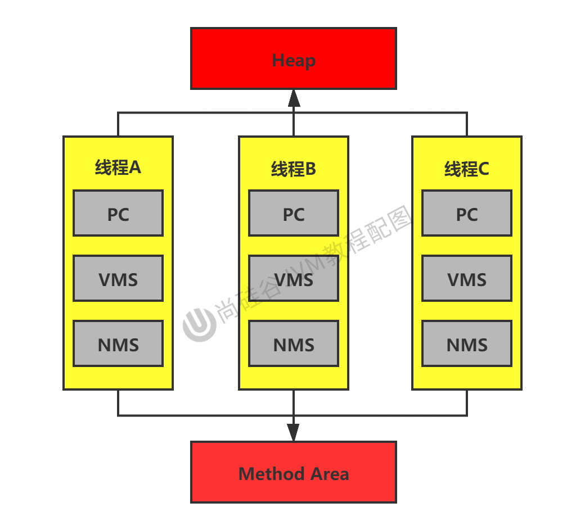

## 1、运行时数据区概述

内存是非常重要的资源，是硬盘和CPU的中间仓库及桥梁，承载着操作系统和应用程序的实时运行。JVM内存布局规定了Java在运行过程种内存申请、分配、管理的策略，保证了JVM的高效稳定运行。**不同的JVM对于内存的划分方式和管理机制存在部分差异**。

在Java8的时候，方法区变成了元空间。

Java虚拟机定义了若干种程序运行期间会使用到的运行时数据区，其中有一些会随着虚拟机启动而创建，随着虚拟机退出而销毁。另外一些则是与线程一一对应的，这些与线程对应的数据区域会随着线程开始和结束创建和销毁

灰色的为单独线程私有的，红色的为多个线程共享的。

- 每个线程：独立包括程序计数器（ProgramCounterRegister）、本地方法栈（NativeMethodStack）、虚拟机栈（VirtualMachineStack）
- 线程间共享：堆（Heap）、堆外内存（永久代或元空间、代码缓存）

每个JVM只有一个Runtime实例。即为运行时环境，相当于内存结构的中间的那个框框“运行时环境。

## 2、线程

- 线程是一个程序里的运行单元。JVM允许一个应用有多个线程并行的执行。
- 在Hotspot JVM里，每个线程都与操作系统的本地线程直接映射：当一个Java线程准备好执行以后，此时一个操作系统的本地线程也同时创建。Java线程执行终止后，本地线程也会回收。
- 操作系统负责所有线程的安排调度到任何一个可用的CPU上。一旦本地线程初始化成功，它就会调用Java线程种的run方法。
- 如果使用jconsole或者其他的调式工具，能看到后台有许多线程在运行，这些后台线程不包括调用psvm的main线程以及所有这个main线程自己创建的线程。
- 这些主要的后台线程在HotspotJVM里面主要是以下几个：
  - **虚拟机线程**：这种线程的操作是需要JVM达到安全点才会出现。这些操作必须在不同的线程中发生的原因是他们都需要JVM达到安全点，这样堆才不会变化。这种线程的执行类型包括”stop-the-world“的垃圾收集、线程栈收集、线程挂起以及偏向锁撤销
  - **周期任务线程**：这种线程是时间周期时间的体现（比如中断），他们一般用于周期性操作的调度执行
  - **GC线程**：这种线程对在JVM里不同种类的垃圾收集行为提供了支持
  - **编译线程**：在运行时将字节码编译成到本地代码
  - **信号调度线程**：这种线程接受信号并发送给JVM，它在内部通过调用适当的方法进行处理