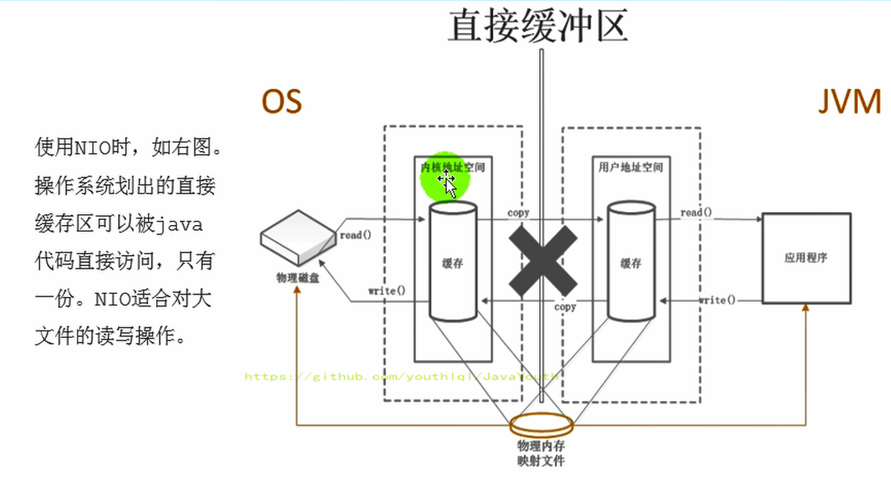

## 1、直接内存概述（了解）

1. 不是虚拟机运行时数据区的一部分，也不是《Java虚拟机规范》中定义的内存区域。
2. 直接内存是在Java堆外的、直接向系统申请的内存区间。
3. 来源于NIO，通过存在堆中的DirectByteBuffer操作Native内存
4. 通常，访问直接内存的速度会优于Java堆。即读写性能高。
5. 因此出于性能考虑，读写频繁的场合可能会考虑使用直接内存。
6. Java的NIO库允许Java程序使用直接内存，用于数据缓冲区

## 2、BIO与NIO

**非直接缓存区（BIO）**

原来采用BIO的架构，在读写本地文件时，我们需要从用户态切换成内核态

**直接缓冲区（NIO）**

NIO 直接操作物理磁盘，省去了中间过程

## 3、直接内存与 OOM

1. 直接内存也可能导致OutofMemoryError异常
2. 由于直接内存在Java堆外，因此它的大小不会直接受限于-Xmx指定的最大堆大小，但是系统内存是有限的，Java堆和直接内存的总和依然受限于操作系统能给出的最大内存。
3. 直接内存的缺点为：
   - 分配回收成本较高
   - 不受JVM内存回收管理
4. 直接内存大小可以通过MaxDirectMemorySize设置
5. 如果不指定，默认与堆的最大值-Xmx参数值一致