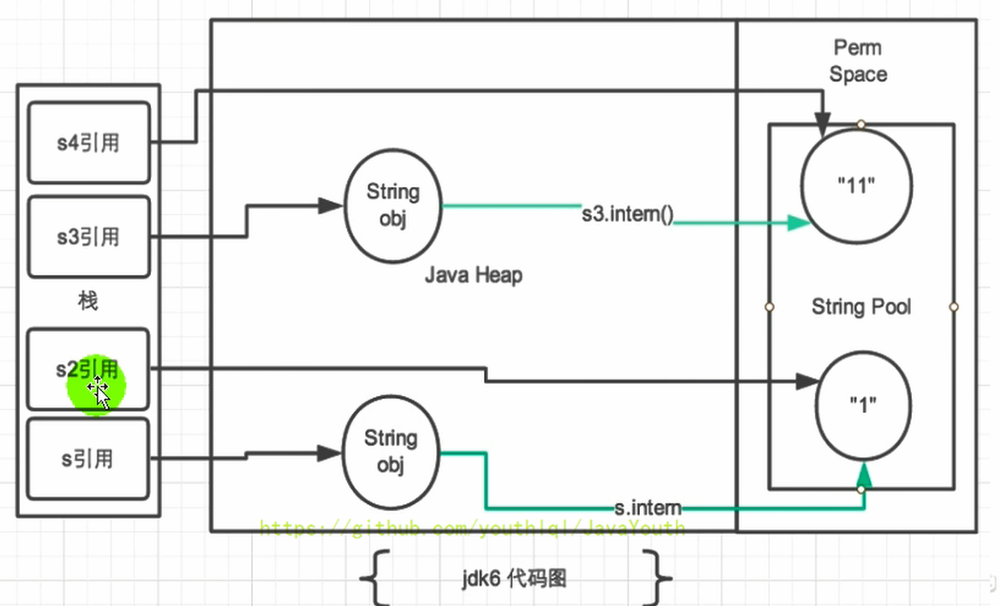
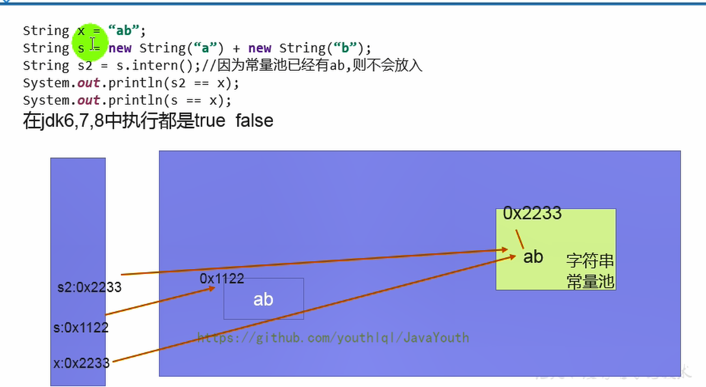

## String的基本特性

1. String被声明为final的，不可被继承

2. String实现了Serializable接口：表示字符串是支持序列化的。实现了Comparable接口：表示String可以比较大小

3. String在jdk8以及以前内部定义了`final char value[]` 用于存储字符串数据。JDK9时改为`byte[]`

   

## 为什么JDK9改变了String的结构

**为什么改为byte[]存储**

1. String类的当前实现将字符串存储在char数组中，每个字符使用两个字节（16位）
2. 从许多不同的应用程序收集的数据表明，字符串是堆使用的主要组成部分，而且大多数字符串对象只包含拉丁字符（Latin-1）。这些字符只需要一个字节的存储空间，因此这些字符串对象的内部char数组中有一半的空间将不会使用，产生了大量浪费
3. 之前String类使用UTF-16的char[] 数组存储，现在改为byte[]数组外加 一个编码标识存储。该编码表示如果你的字符是ISO-8859-1或者Latin-1，那么只需要一个字节存。如果你是使用其它字符集，比如UTF-8，你仍然用两个字节存。
4. 结论：**String再也不用char来存储，改为了byte加上编码标记**，节约了 一些空间
5. 同时基于String的数据结构，例如StringBuffer和StringBuilder也同样做了修改

### String的基本特性

- String：代表不可变的字符序列。简称：不可变性
  1. 当对字符串重新赋值时，需要重写指定内存区域赋值，不能使用原有的value进行赋值。
  2. 当对现有的字符串进行连接操作时，也需要重新指定内存区域赋值，不能使用原有的value进行赋值
  3. 当调用String的replace方法修改指定字符或字符串时，也需要重新指定内存区域赋值，不能使用原有的value进行赋值
- 通过字面量的方式（区别于new）给一个字符串赋值，此时的字符串值声明在字符串常量池中。

### String的底层结构

**字符串常量池是不会存储相同内容的字符串的**

1. String的StringPool是一个固定大小的HashTable，默认大小为1009。如果放进StringPool的String非常多，就会造成Hash冲突严重，从而导致链表会很长，而链表长了之后会造成当前调用String.intern()方法是性能会大幅度下降
2. 使用-XX:StringTablesize可以设置StringTable的长度
3. 在JDK6中StringTable是固定的，就是1009的长度，所以如果常量池中的字符串过多就会导致效率下降很快，StringTablesize设置没有要求
4. 在JDK7中，StringTable的长度默认值都是60013，StringTablesize设置没有要求
5. 在JDK8中，StringTable的长度默认值是60013，StringTable可以设置的最小值为1009

## String的内存分配

1. 在Java语言中有八种基本数据类型和一种比较特殊的类型String。这些类型为了使它们在运行过程中速度更快、更节省内存，都提供了一种常量池的概念
2. 常量池就类似一个Java系统级别提供的缓存。8种基本数据结构类型的常量池都是系统协调的，String类型的常量池比较特殊。他的主要使用方法有两种。
   1. 直接使用双引号声明出来的String对象会直接存储在常量池中
   2. 如果不是用双引号声明的String对象，可以使用String提供的intern方法。
3. Java6以及之前，字符串常量池存放在永久代
4. Java7中Oracle的工程师对字符串池的逻辑做了很大的改变，即将字符串常量池的位置调整到Java堆内
   - 所有的字符串都保存在堆中，和其他普通对象一样，这样可以让你在进行调优应用时仅需要调整堆大小就可以了。
   - 字符串常量池概念原本使用得比较多，但是这个改动使得我们有足够的理由让我们重新考虑在Java7中使用String.intern()
5. Java8元空间，字符串常量在堆

### StringTable为什么要调整？

> In JDK 7, interned strings are no longer allocated in the permanent generation of the Java heap, but are instead allocated in the main part of the Java heap (known as the young and old generations), along with the other objects created by the application. This change will result in more data residing in the main Java heap, and less data in the permanent generation, and thus may require heap sizes to be adjusted. Most applications will see only relatively small differences in heap usage due to this change, but larger applications that load many classes or make heavy use of the method will see more significant differences.`String.intern()`

1. 为什么要调整位置？
   - 永久代的默认空间大小比较小
   - 永久代垃圾回收频率低，大量的字符串无法及时回收，容易进行Full GC产生STW或者容易产生OOM：PermGen Space
2. 在JDK7中，interned字符串不再在Java堆的永久代中分配，而是在Java堆的主要部分（称为年轻代和老年代）中分配，与应用程序创建的其他对象一起分配
3. 此更改导致驻留在主Java堆中的数据更多，驻留在永久代中的数据更少，因此可能需要调整堆大小。

## 字符串拼接操作

1. 常量与常量的拼接结果在常量池中，原理是编译期优化
2. 常量池中不会存在相同内容的变量
3. 拼接前后，只要其中有一个是变量，结果就在堆中。变量拼接的原理是StringBuilder
4. 如果拼接的结果调用intern方法，根据该字符串是否在常量池中存在，分为：
   1. 如果存在，则返回字符串在常量池中的地址
   2. 如果字符串常量池中不存在该字符串，则在常量池中创建一份，并返回此对象的地址

```java

public void test2(){
    String s1 = "javaEE";
    String s2 = "hadoop";

    String s3 = "javaEEhadoop";
    String s4 = "javaEE" + "hadoop";//编译期优化
    //如果拼接符号的前后出现了变量，则相当于在堆空间中new String()，具体的内容为拼接的结果：javaEEhadoop
    String s5 = s1 + "hadoop";
    String s6 = "javaEE" + s2;
    String s7 = s1 + s2;

    System.out.println(s3 == s4);//true
    System.out.println(s3 == s5);//false
    System.out.println(s3 == s6);//false
    System.out.println(s3 == s7);//false
    System.out.println(s5 == s6);//false
    System.out.println(s5 == s7);//false
    System.out.println(s6 == s7);//false
    //intern():判断字符串常量池中是否存在javaEEhadoop值，如果存在，则返回常量池中javaEEhadoop的地址；
    //如果字符串常量池中不存在javaEEhadoop，则在常量池中加载一份javaEEhadoop，并返回次对象的地址。
    String s8 = s6.intern();
    System.out.println(s3 == s8);//true
}
```

### 字符串拼接的底层细节

```java
@Test
public void test3(){
    String s1 = "a";
    String s2 = "b";
    String s3 = "ab";
    /*
        如下的s1 + s2 的执行细节：(变量s是我临时定义的）
        ① StringBuilder s = new StringBuilder();
        ② s.append("a")
        ③ s.append("b")
        ④ s.toString()  --> 约等于 new String("ab")，但不等价

        补充：在jdk5.0之后使用的是StringBuilder,在jdk5.0之前使用的是StringBuffer
         */
    String s4 = s1 + s2;//
    System.out.println(s3 == s4);//false
}
```

```java
/*
    1. 字符串拼接操作不一定使用的是StringBuilder!
       如果拼接符号左右两边都是字符串常量或常量引用，则仍然使用编译期优化，即非StringBuilder的方式。
    2. 针对于final修饰类、方法、基本数据类型、引用数据类型的量的结构时，能使用上final的时候建议使用上。
     */
@Test
public void test4(){
    final String s1 = "a";
    final String s2 = "b";
    String s3 = "ab";
    String s4 = s1 + s2;
    System.out.println(s3 == s4);//true
}
```

### 拼接操作与append操作的效率对比

```java

@Test
public void test6(){
    long start = System.currentTimeMillis();
    //        method1(100000);//4014
    method2(100000);//7
    long end = System.currentTimeMillis();
    System.out.println("花费的时间为：" + (end - start));
}

public void method1(int highLevel){
    String src = "";
    for(int i = 0;i < highLevel;i++){
        src = src + "a";//每次循环都会创建一个StringBuilder、String
    }
}

public void method2(int highLevel){
    //只需要创建一个StringBuilder
    StringBuilder src = new StringBuilder();
    for (int i = 0; i < highLevel; i++) {
        src.append("a");
    }
}
```

1. 通过StringBuilder的append()方式添加字符串的效率要远高于使用String的字符串拼接方式
2. 原因：
   1. StringBuilder的append方式自始自终只创建过一个StringBuilder的对象
   2. 使用String的字符串拼接方式创建过多个StringBuilder和String（调的toString方法）的对象，内存占用要更大；如果进行GC，需要花费额外的时间（在拼接的过程中产生的一些中间字符串可能永远也用不到，会产生大量垃圾字符串）
3. 改进的空间：
   1. 在实际开发中，如果基本确定要前前后后添加的字符串长度不高于某个限定值highLevel的情况下，建议使用构造器实例化：
   2. `StringBuilder s = new StringBuilder(highLevel); //new char[highLevel]`
   3. 这样可以避免频繁扩容

## intern的使用

### intern()方法的说明

```java
public native String intern();
```

1. intern是一个native方法，调用的是底层C的方法
2. 字符串常量池最初是空的，由String类私有地维护。在调用intern方法时，如果池中已经包含了由equals(object)方法确定的与该字符串内容相等的字符串，则返回池中的字符串地址。否则该字符串对象将被添加到常量池中，并返回对该字符串对象的地址。
3. 如果不是用双引号声明的String对象，可以使用String提供的intern方法：intern方法会从字符串常量池中查询当前字符串是否存在，若不存在就会将当前字符串放入常量池中。
4. 也就是说，如果在任意字符串上调用String.intern方法，那么其返回结果所指向的那个类实例，必须和直接以常量形式出现的字符串实例完全相同。
5. 通俗点讲，interned String就是确保字符串在内存中只有一份拷贝，这样就可以节约内存空间，加快字符串操作任务的执行速度。注意，这个值会被放到字符串内部池（Stirng intern Pool）

### new String()的说明

**new String("ab")会创建几个对象？**

```java
/**
两个：
	一个是new关键字在堆空间创建的
	另一个对象是：字符串常量池中的对象“ab”。字节码指令：ldc
**/
public class StringNewTest{
	public static void main(String[] args){
		String str = new String("ab");
	}
}
```

**new String("a") + new String("b") 会创建几个对象？**

```java
/**
 * 思考：
 * new String("a") + new String("b")呢？
 *  对象1：new StringBuilder()
 *  对象2： new String("a")
 *  对象3： 常量池中的"a"
 *  对象4： new String("b")
 *  对象5： 常量池中的"b"
 *
 *  深入剖析： StringBuilder的toString():
 *      对象6 ：new String("ab")
 *       强调一下，toString()的调用，在字符串常量池中，没有生成"ab"
 *
 */
public class StringNewTest {
    public static void main(String[] args) {

        String str = new String("a") + new String("b");
    }
}
```

### 有点难的面试题

**执行s3.intern()，而在JDK7的后续版本中，字符串常量池被移动到了堆中，此时堆里已经有new String（"11"）了，出于节省空间的目的，直接将堆中的字符串的引用地址储存在字符串常量池中。没错，字符串常量池中存的是new String（"11"）在堆中的地址**

```java
/**
 * 如何保证变量s指向的是字符串常量池中的数据呢？
 * 有两种方式：
 * 方式一： String s = "shkstart";//字面量定义的方式
 * 方式二： 调用intern()
 *         String s = new String("shkstart").intern();
 *         String s = new StringBuilder("shkstart").toString().intern();
 *
 */
public class StringIntern {
    public static void main(String[] args) {

        String s = new String("1");
        s.intern();//调用此方法之前，字符串常量池中已经存在了"1"
        String s2 = "1";
        System.out.println(s == s2);//jdk6：false   jdk7/8：false
        
        /*
         1、s3变量记录的地址为：new String("11")
         2、经过上面的分析，我们已经知道执行完pos_1的代码，
         	在堆中有了一个new String("11")
         	这样的String对象。但是在字符串常量池中没有"11"
         3、接着执行s3.intern()，在字符串常量池中生成"11"
           3-1、在JDK6的版本中，字符串常量池还在永久代，
           		所以直接在永久代生成"11",也就有了新的地址
           3-2、而在JDK7的后续版本中，字符串常量池被移动到了堆中，
           		此时堆里已经有new String（"11"）了
           		出于节省空间的目的，直接将堆中的字符串的引用地址储存在字符串常量池中。
           		没错，字符串常量池中存的是new String（"11"）在堆中的地址
         4、所以在JDK7后续版本中，s3和s4指向的完全是同一个地址。
         */
        String s3 = new String("1") + new String("1");//pos_1
        s3.intern();
        
        //s4变量记录的地址：使用的是上一行代码代码执行时，在常量池中生成的"11"的地址
        String s4 = "11";
        System.out.println(s3 == s4);//jdk6：false  jdk7/8：true
    }
}
```

**内存分析**

JDK6：



JDK7以及以后：


### 面试题的拓展

```java
public class StringIntern1 {
    public static void main(String[] args) {
        String s3 = new String("1") + new String("1");
        // 执行完上一行代码后，字符串常量池中并没有出现“11”
        String s4 = "11";
        String s5 = s3.intern();
        
        // s3是堆中的"11"，s4是字符串常量池中的"11"
        System.out.println(s3 == s4); //false
        
        System.out.println(s5 == s4);// true
    }
}
```

如果将s5和s4的语句交换位置，就会导致两个都输出true

### intern方法的练习题



### intern的效率测试（空间角度）

结论：

1、**对于程序中大量存在的字符串，尤其其中存在很多重复的字符串时，使用intern**

2、大的网站平台，需要内存中存储大量的字符串。比如社交网站，很多人都存储：北京市、海淀区等信息。这时候如果字符串都调用intern() 方法，就会很明显降低内存的大小。

## G1中的String去重操作

**String去重操作的背景**

> 注意不是字符串常量池的去重操作，字符串常量池本身就没有重复的

1. 背景：对许多Java应用（有大的也有小的）做的测试得出以下结果：
   - 堆存活数据集合里面String对象占了25%
   - 堆存活数据集合里面重复的String对象有13.5%
   - String对象的平均长度是45
2. 许多大规模的Java应用的瓶颈在于内存，测试表明，在这些类型的应用里面，Java堆中存活的数据集合差不多25%是String对象。更进一步，这里面差不多一半String对象是重复的，重复的意思是说：`str1.equals(str2)= true`。堆上存在重复的String对象必然是一种内存的浪费。这个项目将在G1垃圾收集器中实现自动持续对重复的String对象进行去重，这样就能避免浪费内存。

**String 去重的的实现**

1. 当垃圾收集器工作的时候，会访问堆上存活的对象。对每一个访问的对象都会检查是否是候选的要去重的String对象。
2. 如果是，把这个对象的一个引用插入到队列中等待后续的处理。一个去重的线程在后台运行，处理这个队列。处理队列的一个元素意味着从队列删除这个元素，然后尝试去重它引用的String对象。
3. 使用一个Hashtable来记录所有的被String对象使用的不重复的char数组。当去重的时候，会查这个Hashtable，来看堆上是否已经存在一个一模一样的char数组。
4. 如果存在，String对象会被调整引用那个数组，释放对原来的数组的引用，最终会被垃圾收集器回收掉。
5. 如果查找失败，char数组会被插入到Hashtable，这样以后的时候就可以共享这个数组了。

**命令行选项**

1. UseStringDeduplication(bool) ：开启String去重，默认是不开启的，需要手动开启。
2. PrintStringDeduplicationStatistics(bool) ：打印详细的去重统计信息
3. stringDeduplicationAgeThreshold(uintx) ：达到这个年龄的String对象被认为是去重的候选对象