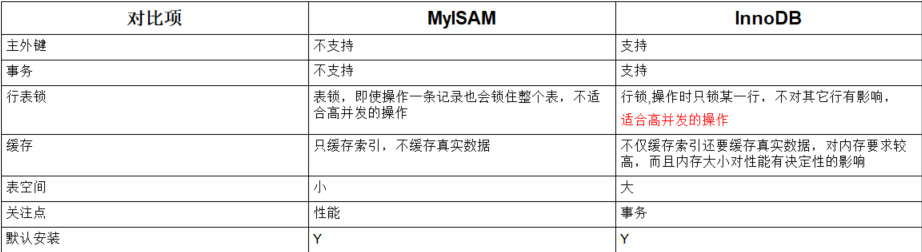
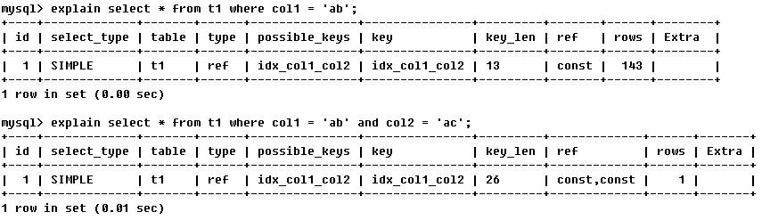
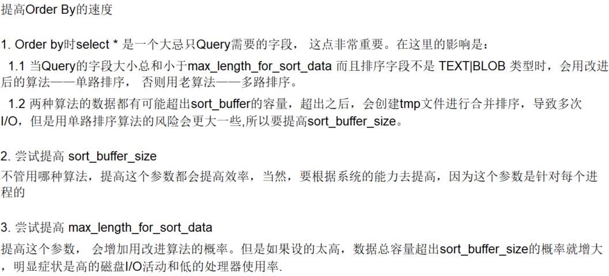

# 第一章 MySQL架构介绍

## 1.1 MySQL逻辑架构介绍

mysql查询流程大致就是：

1. mysql客户端通过协议与mysql服务器建立连接，发送查询语句，先检查查询缓存，如果命中直接返回结果，否则进行语句解析（mysql8已经废弃了缓存优化）
2. 有一系列预处理，比如检查语句是否写正确了，然后是查询优化（比如是否使用索引扫描，如果是一个不可能的条件则提前终止），生成查询计划，然后查询引擎启动，开始执行查询，从底层存储引擎调用API获取数据，最后返回给客户端。怎么存数据、取数据都与存储引擎有关
3. mysql默认使用BTREE索引，并且一个大方向是，无论怎么折腾sql，至少在目前来说，mysql最多只用到表中的一个索引

## 1.2 MySQL存储引擎

`show engines` 查看mysql已经提供了什么存储引擎

`show variables like '%storage_engine%'` 当前默认的存储引擎



# 第二章 查询与索引优化分析

## 2.1 SQL执行慢的原因

1. 查询语句写的烂
2. 索引失效：比如查询的字段很多很杂，建了索引的字段查询又不经常用
3. 关联查询太多，使用了太多的join（设计缺陷或者不得已的需求）
4. 服务器调优及各个参数设置（缓冲、线程数等）

## 2.2 常见的Join执行


其实总体来说就其中join查询

举例说明

```mysql
CREATE TABLE `tbl_dept` (
 `id` INT(11) NOT NULL AUTO_INCREMENT,
 `deptName` VARCHAR(30) DEFAULT NULL,
 `locAdd` VARCHAR(40) DEFAULT NULL,
 PRIMARY KEY (`id`)
) ENGINE=INNODB AUTO_INCREMENT=1 DEFAULT CHARSET=utf8;
 
CREATE TABLE `tbl_emp` (
 `id` INT(11) NOT NULL AUTO_INCREMENT,
 `name` VARCHAR(20) DEFAULT NULL,
 `deptId` INT(11) DEFAULT NULL,
 PRIMARY KEY (`id`),
 KEY `fk_dept_id` (`deptId`)
 #CONSTRAINT `fk_dept_id` FOREIGN KEY (`deptId`) REFERENCES `tbl_dept` (`id`)
) ENGINE=INNODB AUTO_INCREMENT=1 DEFAULT CHARSET=utf8;
 
 
 
INSERT INTO tbl_dept(deptName,locAdd) VALUES('RD',11);
INSERT INTO tbl_dept(deptName,locAdd) VALUES('HR',12);
INSERT INTO tbl_dept(deptName,locAdd) VALUES('MK',13);
INSERT INTO tbl_dept(deptName,locAdd) VALUES('MIS',14);
INSERT INTO tbl_dept(deptName,locAdd) VALUES('FD',15);
 
 
INSERT INTO tbl_emp(NAME,deptId) VALUES('z3',1);
INSERT INTO tbl_emp(NAME,deptId) VALUES('z4',1);
INSERT INTO tbl_emp(NAME,deptId) VALUES('z5',1);
 
INSERT INTO tbl_emp(NAME,deptId) VALUES('w5',2);
INSERT INTO tbl_emp(NAME,deptId) VALUES('w6',2);
 
INSERT INTO tbl_emp(NAME,deptId) VALUES('s7',3);
 
INSERT INTO tbl_emp(NAME,deptId) VALUES('s8',4);
 
INSERT INTO tbl_emp(NAME,deptId) VALUES('s9',51);
```

执行：

```mysql
 
#1 A、B两表共有
 select * from tbl_emp a inner join tbl_dept b on a.deptId = b.id;
 
#2 A、B两表共有+A的独有
 select * from tbl_emp a left join tbl_dept b on a.deptId = b.id;
 
#3 A、B两表共有+B的独有
 select * from tbl_emp a right join tbl_dept b on a.deptId = b.id;
 
#4 A的独有 
select * from tbl_emp a left join tbl_dept b on a.deptId = b.id where b.id is null; 
 
#5 B的独有
 select * from tbl_emp a right join tbl_dept b on a.deptId = b.id where a.deptId is null; #B的独有
 
#6 AB全有
#MySQL Full Join的实现 因为MySQL不支持FULL JOIN,下面是替代方法
#left join + union(可去除重复数据)+ right join
SELECT * FROM tbl_emp A LEFT JOIN tbl_dept B ON A.deptId = B.id
UNION
SELECT * FROM tbl_emp A RIGHT JOIN tbl_dept B ON A.deptId = B.id
 
#7 A的独有+B的独有
SELECT * FROM tbl_emp A LEFT JOIN tbl_dept B ON A.deptId = B.id WHERE B.`id` IS NULL
UNION
SELECT * FROM tbl_emp A RIGHT JOIN tbl_dept B ON A.deptId = B.id WHERE A.`deptId` IS NULL;
```

## 2.3 索引简介

### 2.3.1 什么是索引

MySQL官方对于索引的定义为：索引（Index）是帮助mysql高效获取数据的数据结构，可以得到索引的本质：索引是数据结构

**排好序的快速查找结构**

索引的目的在于提高查询效率，在数据之外，**数据库系统还维护着满足特定查找算法的数据结构**，这些数据结构以某种方式引用（指向）数据。这样就可以在这些数据结构上实现高级查找算法。这种数据结构就是索引。

一般来说索引本身也很大，不可能全部存储在内存中，因此索引往往以索引文件的形式存储在磁盘上面。**我们常说的索引没有特别指明的话都是指B+树结构组织的索引**。

### 2.3.2 索引的优势和劣势

**优势**：索引可以提高数据检索的效率，降低数据库的IO成本，通过索引对数据进行排序，降低数据排序的成本，降低了CPU的消耗

**劣势**：

1. 实际上索引也是一张表，该表保存了主键和索引字段，并指向实体表的记录，所以索引列也是要占用空间的。
2. 虽然索引大大提高了查询速度，同时却会降低更新表的速度，如对表进行插入、删除和更新。因为更新表时，还要保存一下索引文件每次更新添加了索引列的字段，都会调整因为更新带来的键值变化后的索引信息
3. 索引只是提高效率的一个因素，如果你的mysql有大数据量的表，就需要花时间研究建立最优秀的索引，或优化查询语句

### 2.3.3 索引分类

- 单值索引：一个索引只包含单个列，一个表可以有多个单值索引

- 唯一索引：索引列的值必须唯一，但允许有空值

- 复合索引：一个索引包含多个列

- 基本语法

  ```mysql
  #创建索引 如果是char、varchar类型，length可以小于字段实际长度，如果是blob和text，必须指定length
  create [unique] index indexName on mytable(columnname(length));
  alter mytable add [unique] index [indexName] on (columnname(length));
  
  #删除
  drop index [indexName] on mytable;
  
  #查看
  show index from table_name
  ```

- 使用alter命令

  ```mysql
  #添加主键
  alter table tbl_name add primary key (column_list);
  #唯一索引
  alter table tbl_name add unique index_name (column_list);
  #普通索引
  alter table tbl_name add index index_name (column_list);
  #全文索引
  alter table tbl_name add fulltext index_name (column_list);
  ```

  ### 2.3.4 索引结构

  1、BTree索引

  

【初始化介绍】

一颗b+树，淡蓝色的块是一个磁盘块，每个磁盘块包含几个数据项（深蓝色）和指针（黄色）。

对于磁盘块1，p1表示小于17的磁盘块，p2表示17到35之间，p3表示大于35

真实的数据存在叶子节点，及树的最后一排，**非叶子节点不存储真实的数据，只存储指引搜索方向的数据项

【查找过程】

如果要查询29，那么首先将磁盘1由磁盘加载到内存，此时发生一次IO，在内存中用二分查找确定29在17到35之间，锁定磁盘块1的P2指针，内存时间因为非常短可以忽略不计，通过p2将磁盘块3加载到内存，然后将磁盘块8加载到内存，发生第三次IO，查找后结束查询

真实的情况是3层的B+树可以表示上百万的数据，如果上百万的数据查找只需要三次IO，性能将大大提高。

2、Hash索引

3、full-text索引

4、R-Tree索引

### 2.3.4 创建索引的时机

**哪些情况需要创建索引**

1. 主键自动建议唯一索引
2. 频繁作为查询条件的字段应该创建索引
3. 查询中与其他表关联的字段，外键关系应该建立索引
4. 频繁更新的字段不适合建立索引
5. where条件里用不到的字段不创建索引
6. 单键、组合索引的选择问题？高并发下倾向于创建组合索引
7. 查询中排序的字段，排序字段若通过索引去访问将大大提高排序速度
8. 查询中统计或者分组字段

**哪些情况不需要创建索引**

1. 表记录太少
2. 经常增删改的表
3. 数据重复且分布平均的表字段，因此应该只为最经常查询和最经常排序的数据列建立索引（如果某个数据列包含许多重复的内容，为它建立索引就没有太大的实际效果

## 2.4 性能分析

### 2.4.1 MySQL Query Optimizer

Mysql中有专门负责优化select语句的优化器模块，主要功能：通过计算分析系统中收集到的统计信息，为客户端请求的query提供它认为最优的执行计划（它认为最优的数据检索方式，但不见得是DBA认为最优的，这部分最耗费时间）

当客户端向mysql请求一条query，命令解析器模块完成请求分类，区别出是select并转发给mysql query optimizer时，mqo首先会对整条query进行优化，处理掉一些常量表达式的预算，直接换算成常量池。并对query中的查询条件进行简化和转换，如去掉一些无用或显而易见的条件、结构调整等。然后分析query中的Hint信息（如果有），看显示Hint信息是否可以完全确定该Query的执行计划。如果没有Hint或者Hint信息还不足以完全确定执行计划，则会读取所涉及对象的统计信息，根据query进行写相应的计算分析，然后再得出最后的执行计划

### 2.4.2 Mysql常见瓶颈

CPU：CPU在饱和的时候一般发生在数据装入内存或从磁盘上读取数据时候

IO：磁盘I/O瓶颈发生在装入数据远大于内存容量的时候

服务器硬件的性能瓶颈：top、free、iostat和vmstat来查看系统的性能状态

### 2.4.3 Explain

1、使用Explain关键字可以模拟优化器执行SQL查询语句，从而直到MySQL是如何处理你的SQL语句的，分析你的查询语句或表结构的性能瓶颈

2、能干吗？

- 表的读取顺序
- 数据读取操作的操作类型
- 哪些索引可以使用
- 哪些索引被实际使用
- 表之间的引用
- 每张表有多少行被优化器查询

3、怎么玩？Explain+SQL语句

---

#### **1、id**

select查询的序列号，包含一组数字，表示查询中执行select字句或操作表的顺序

id相同，执行顺序由上至下；

id不同，如果是子查询，id的序号会递增，id值越大优先级越高越先被执行；


#### **2、select_type**

表示查询的类型，主要是用来区别普通查询、联合查询、子查询等复杂查询

1. SIMPLE：简单的select查询，查询中不包含子查询或者UNION
2. PRIMARY：查询中若包含任何复杂的子部分，最外层查询被标记为该类型
3. SUBQUERY：在select或者where列表中包含了子查询
4. DERIVED：在FROM列表中包含的子查询被标记为DERIVED（衍生），MYSQL会递归执行这些子查询，把结果放在临时表中
5. UNION：若第二个select出现在union之后，则被标记为union，若union包含在from子句的子查询中，外层select将被标记为：DERIVED
6. UNION RESULT：从UNION表获取结果的SELECT

#### **3、table**：显示这一行的数据是关于哪张表的

#### **4、type**

type显示的是访问类型，是较为重要的一个指标，结果值从最好到最坏依次是：


一般来说，得保证查询至少达到range级别，最好能达到ref

system>const>eq_ref>ref>range>index>ALL

1. system：表中只有一行记录（等于系统表），这是const类型的特例，平时不会出现，可忽略不计

2. const：表示通过索引一次就找到了，const用于比较primary key或者unique索引。因为只匹配一行数据，所以很快。如果将主键置于where列表中，mysql就能将该查询转换为一个常量

   

3. eq_ref：唯一性索引扫描，对于每个索引键，表中只有一条记录与之匹配。常见于主键或唯一索引扫描
   

4. ref：非唯一性索引扫描，返回匹配某个单独值的所有行，本质上也是一种索引访问，它返回所有匹配某个单独值的行，然而它可能会找到多个符合条件的行，所以它应该属于查找和扫描的混合体
   

5. range：只检索给定范围的行，使用一个索引来选择行。key列显示使用了哪个索引。一般就是在你的where语句中出现了between、<、>、in等的查询。这种范围扫描索引扫描比全表扫描要好，因为它只需要开始于索引的某一点，而结束于另一点，不用扫描全部索引
   

6. index：Full Index Scan，index与ALL区别为index类型只遍历索引树。这通常比ALL快，因为索引文件通常比数据文件小。（也就是说虽然**all和index都是读全表**，但是index是从索引中读取的，而all是从硬盘中读的）
   

7. all：Full Table Scan，将遍历全表以找到匹配的行
   

**一般来说，得保证查询至少达到range级别，最好能达到ref**

#### **5、possible_keys**

显示可能应用在这张表中的索引，一个或多个。查询涉及到的字段上若存在索引，则该索引将被列出，**但不一定被查询实际使用**

#### **6、key**

实际使用的索引。如果为NULL则表示没有使用索引，**查询中若使用了覆盖索引，则该索引仅出现在key列表中**


#### **7、key_len**

表示索引中使用的字节数，可通过该列计算查询中使用的索引的长度。在不损失精确性的情况下长度越短越好，key_len显示的值为索引字段的最大可能长度，**并非实际使用长度**。即key_len是根据表定义计算而得，不是通过表内检索出的


#### **8、ref**

显示索引的哪一列被使用了，如果可能的话是一个常数，哪些列或常量被用于查找索引列上的值


#### **9、rows**

根据表统计信息及索引选用情况，大致估算出找到所需的记录所需要读取的行数

#### **10、Extra**

包含不适合在其他列中显示但是十分重要的额外信息

1. **Using filesort**

   - 说明mysql会对数据使用一个外部的索引排序，而不是按照表内的索引顺序进行读取。MySQL中无法利用索引完成的排序操作称为“文件排序”；

2. **Using temporary**

   - 使用了临时表保存中间结果，MySQL在对查询结果排序时使用临时表。常见于排序order by和分组查询group by

3. **Using index**

   - 表示相应的select操作中使用了覆盖索引，避免访问了表的数据行，效果不错！如果同时出现using where，表明索引被用来执行索引键值的查找；如果没有同时出现using where，表明索引用来读取数据而非执行查找动作。

   - 覆盖索引：

     **查询列要被所建的索引覆盖**，如果要使用覆盖索引，一定要注意select列表中只取出需要的列，不可select *，因为如果将所有字段一起做索引会导致索引文件过大，查询性能下降。

4. Using where：表明使用了 where过滤

5. Using join buffer：使用了连接缓存

6. Impossible where：where子句的值总为false，不能用来获取任何元组

7. select tables optimized away：在没有group by子句的情况下，基于索引优化MIN/max操作或者对于MyISAM存储引擎优化COUNT(*)操作，不必等到执行阶段再进行计算，查询执行计划生成的阶段即完成优化

8. distinct：优化distinct操作，在找到第一匹配的元组后即停止找相同值的动作


## 2.5 索引优化

### 2.5.1 索引分析

1. 单表

   ```mysql
   #查询category_id为1且comments大于1的情况下，views最多的article_id.
   EXPLAIN SELECT id, author_id FROM article WHERE category_id = 1 AND comments > 1 ORDER BY views DESC LIMIT 1;
   # 结论：type是ALL，即最坏的情况。Extra还出现了Using filesort
   
   #1.1 新建索引 
   create index idx_article_ccv on article(category_id, comments, views);
   #1.2 第二次Explain type变成了range，但是还是有filesort
   #comments>1是一个范围值，mysql无法利用索引再对后面的views部分进行检索，即range类型查询字段后面的索引无效
   #1.3 删除索引
   DROP INDEX idx_article_ccv ON article;
   #1.4 第二次建立索引
   create index idx_article_cv on article(category_id, views);
   #1.5 第三次Explain type变成了ref，filesort也消失了，结果理想
   ```

2. 两表

   ```mysql
   EXPLAIN SELECT * FROM class LEFT JOIN book ON class.card = book.card;
   # 结论：type有ALL
   # 添加索引优化
   ALTER TABLE 'book' ADD INDEX Y ('card');
   
   # 第二次Explain
   # 可以看到type变成了ref，rows也变成了优化比较明显
   # 这是由于左连接特性决定的。LEFT JOIN 条件用于确定如何从右表搜索行，左边一定都有，所以右边是我们的关键点，一定要建立索引
   ```

3. 三表

   ```mysql
   ALTER TABLE 'phone' ADD INDEX Z ('card');
   ALTER TABLE 'book' ADD INDEX Y('card');
   
   EXPLAIN SELECT * FROM class LEFT JOIN book ON class.card = book.card LEFT JOIN phone ON book.card = phone.card;
   ```

4. 结论：JOIN语句的优化

   尽可能减少join语句中的NestedLoop的循环总次数，永**远用小结果集驱动大的结果集。**

   优先保证NestedLoop的内层循环

   **保证Join语句中被驱动表上Join条件字段已经被索引**

   当无法保证被驱动表的Join字段条件被索引且内存资源充足的情况下，不要太吝惜JoinBuffer的设置

### 2.5.2 索引失效

1、全值匹配我最爱，当where后面的字段和建立的索引相同或者被包含的时候，索引不失效

2、最佳左前缀法则：如果索引了多列，要遵守最左前缀法则。指的是查询从索引的最左前列开始并且**不跳过索引中的列**


3、不在索引列上做任何操作（计算、函数、（手动or自动）类型转换），会导致索引失效而转向全表扫描


索引列上使用了表达式，如where a = a + 1。表达式是一大忌讳，再简单mysql也认不出。有时候数据量不是大到严重影响速度时，一般可以先查出来，比如先查所有订单记录的数据，再在程序中进行筛选

4、存储引擎不能使用索引中范围条件右边的列


5、尽量使用覆盖索引（只访问索引的查询（索引列和查询列一致）），减少select *

6、mysql在使用不等于的时候无法使用索引会导致全表扫描

7、is null，is not null也无法使用索引

8、like以通配符开头('%abc....') mysql索引失效会变成全表扫描，用覆盖索引解决两边都是%的查询，（左边没有%，右边有%不会导致索引失效）

9、字符串不加单引号索引失效，对应第3条

10、少用or，用它来连接时会索引失效

### 2.5.3 Show Profile

ShowProfile是mysql提供可以用来分析当前会话中语句执行的资源消耗情况，可以用于sql的调优的测量

默认保存15次的运行结果

1、show variables like 'profiling' ：查看当前MySQL版本是否支持

2、set profiling = on ：开启该功能

3、运行SQL

4、查看结果 ：show profiles;

5、诊断SQL：show profile cpu, block io for query 上一步前面的问题SQL数字号码

6、日常开发需要注意的结论

- converting HEAP to MyISAM 查询结果太大，内存都不够用了往磁盘上搬了
- create tmp table 创建临时表，这个要注意
- Copying to tmp table on disk 把内存临时表复制到磁盘
- locked

### 2.5.4 一般性建议

- 对于单键索引，尽量选择针对当前query过滤性更好的索引
- 在选择组合索引时，当前query中过滤性最好的字段在索引字段排序中，位置越靠前越好
- 在选择组合索引时，尽量选择可以能够包含当前query中的where子句中更多字段的索引
- 尽可能通过分析统计信息和调整query的写法来达到选择合适索引的目的
- 少用Hint强制索引

## 2.6 查询优化

### 2.6.1 永远小表驱动大表

```mysql
#当B表的数据集小于A表的数据集的时候，用in优于用exists
select * from A where id in (select id from B);

#反过来，exists优于in
select * from A where exists (select 1 from B where B.id = A.id)

#注意 A和B的ID字段应建立索引
```

EXISTS

SELECT ... FROM table WHERE EXISTS (subquery)

该语法可以理解为：将主查询的数据放到子查询中做条件验证，根据验证结果（TRUE或FALSE）来决定主查询中的数据结果是否得以保留

1. EXISTS只返回true或false，因此子查询中的select * 也可以是select 1 或其他。官方说法是实际执行时会忽略select 清单，因此没有区别
2. exists子查询的实际执行过程可能经过了优化而不是我们理解上的逐条对比，如果担忧效率问题，可以进行实际检验以确定是否有效率问题
3. exists子查询往往也可以用条件表达式、其他子查询或者join来代替，何种最优需要具体问题具体分析

### 2.6.2 order by关键字优化

order by 子句，尽量使用Index方式排序，避免使用filesort方式排序

order by满足两种情况，会使用index排序：

1. order by 语句使用索引最左前列
2. 使用where 子句与order by子句条件列组合满足索引最左前列

尽可能在索引列上完成排序操作，遵照索引建的最佳左前缀

如果不在索引列上，filesort有两种算法，mysql久要启动双路排序和单路排序


单路问题：

在sort_buffer中，方法B比方法A要多占用很多空间，因为方法B是把所有字段都取出, 所以有可能取出的数据的总大小超出了sort_buffer的容量，导致每次只能取sort_buffer容量大小的数据，进行排序（创建tmp文件，多路合并），排完再取取sort_buffer容量大小，再排……从而多次I/O。

本来想省一次I/O操作，反而导致了大量的I/O操作，反而得不偿失。

优化策略：

- 增大max_length_for_sort_data参数的设置
- 增大sort_buffer_size参数的设置
- 

### 2.6.3 group by关键字优化

group by本质是先排序后进行分组，遵照索引建的最佳左前缀

当无法使用索引树，增大上述两个参数的值

where高于having，能写在where限定的条件就不要去having限定了

# 第三章 MySQL锁机制

锁是计算机协调多个进程或线程并发访问某一资源的机制

在数据库中，除传统的计算资源（如CPU、RAM、I/O等）的争用以外，数据也是一种供许多用户共享的资源。如何保证数据并发访问的一致性、有效性是所有数据库必须解决的一个问题，锁冲突也是影响数据库并发访问性能的一个重要因素。

## 3.1 锁的分类

对数据操作的类型分（读、写）

1. 读锁（共享锁）：针对同一份数据，多个读操作可以同时进行而不会互相影响
2. 写锁（排他锁）：当前写操作没有完成前，他会阻断其他写锁和读锁

从对数据操作的粒度分

1. 表锁
2. 行锁

为了尽可能提高数据库的并发度，每次锁定的数据范围越小越好，理论上每次只锁定当前操作的数据的方案会得到最大的并发度，但是管理锁是很耗资源的事情（涉及获取，检查，释放锁等动作），因此数据库系统需要在高并发响应和系统性能两方面进行平衡，这样就产生了“锁粒度（Lock granularity）”的概念。

一种提高共享资源并发发性的方式是让锁定对象更有选择性。尽量只锁定需要修改的部分数据，而不是所有的资源。更理想的方式是，只对会修改的数据片进行精确的锁定。任何时候，在给定的资源上，锁定的数据量越少，则系统的并发程度越高，只要相互之间不发生冲突即可。

## 3.2 表锁（偏读）

偏向MyISAM存储引擎，开销小，加锁快；无死锁；锁定粒度大，发生锁冲突的概率最高,并发度最低。

MyISAM在执行查询语句（SELECT）前，会自动给涉及的所有表加读锁，在执行增删改操作前，会自动给涉及的表加写锁。 

MySQL的表级锁有两种模式：

- 表共享读锁（Table Read Lock）
- 表独占写锁（Table Write Lock）			

| 锁类型 | 可否兼容 | 读锁 | 写锁 |
| :----: | :------: | :--: | :--: |
|  读锁  |    是    |  是  |  否  |
|  写锁  |    是    |  否  |  否  |

结论：

结合上表，所以对MyISAM表进行操作，会有以下情况： 

1、对MyISAM表的读操作（加读锁），不会阻塞其他进程对同一表的读请求，但会阻塞对同一表的写请求。只有当读锁释放后，才会执行其它进程的写操作。 

2、对MyISAM表的写操作（加写锁），会阻塞其他进程对同一表的读和写操作，只有当写锁释放后，才会执行其它进程的读写操作。

**简而言之，就是读锁会阻塞写，但是不会堵塞读。而写锁则会把读和写都堵塞。**

**MyISAM的读写锁调度是写优先，这也是myisam不适合做写为主表的引擎。因为写锁后，其他线程不能做任何操作，大量的更新会使查询很难得到锁，从而造成永远阻塞**

## 3.3 行锁（偏写）

偏向InnoDB存储引擎，开销大，加锁慢；会出现死锁；锁定粒度最小，发生锁冲突的概率最低,并发度也最高。

InnoDB与MyISAM的最大不同有两点：一是支持事务（TRANSACTION）；二是采用了行级锁

【什么是间隙锁】

当我们用范围条件而不是相等条件检索数据，并请求共享或排他锁时，InnoDB会给符合条件的已有数据记录的索引项加锁；对于键值在条件范围内但并不存在的记录，叫做“间隙（GAP)”，

InnoDB也会对这个“间隙”加锁，这种锁机制就是所谓的间隙锁（Next-Key锁）。

【危害】

因为Query执行过程中通过过范围查找的话，他会锁定整个范围内所有的索引键值，即使这个键值并不存在。

间隙锁有一个比较致命的弱点，就是当锁定一个范围键值之后，即使某些不存在的键值也会被无辜的锁定，而造成在锁定的时候无法插入锁定键值范围内的任何数据。在某些场景下这可能会对性能造成很大的危害

Innodb存储引擎由于实现了行级锁定，虽然在锁定机制的实现方面所带来的性能损耗可能比表级锁定会要更高一些，但是在整体并发处理能力方面要远远优于MyISAM的表级锁定的。当系统并发量较高的时候，Innodb的整体性能和MyISAM相比就会有比较明显的优势了。

  但是，Innodb的行级锁定同样也有其脆弱的一面，当我们使用不当的时候，可能会让Innodb的整体性能表现不仅不能比MyISAM高，甚至可能会更差。

【优化建议】

1. 尽可能让所有数据检索都通过索引来完成，避免无索引行锁升级为表锁。
2. 合理设计索引，尽量缩小锁的范围
3. 尽可能较少检索条件，避免间隙锁
4. 尽量控制事务大小，减少锁定资源量和时间长度
5. 尽可能低级别事务隔离

## 3.4 页锁

开销和加锁时间界于表锁和行锁之间；会出现死锁；锁定粒度界于表锁和行锁之间，并发度一般。

了解一下即可