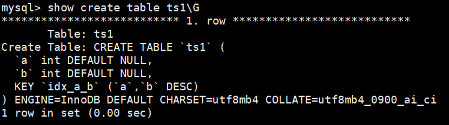

# 第08章_索引的创建与设计原则

## 1、索引的声明与使用

### 1.1 索引的分类

MySQL的索引包括普通索引、唯一性索引、全文索引、单列索引、多列索引和空间索引等。 

- 从**功能逻辑**上说，索引主要有 4 种，分别是普通索引、唯一索引、主键索引、全文索引。 
- 按照 **物理实现方式** ，索引可以分为 2 种：聚簇索引和非聚簇索引。 
- 按照 **作用字段个数** 进行划分，分成单列索引和联合索引。

**1、普通索引**

在创建普通索引时，不附加任何限制条件，只是用于提高查询效率。这类索引可以创建在`任何数据类型`中，其值是否唯一和非空，要由字段本身的完整性约束条件决定。建立索引之后，可以通过索引进行查询。例如，在表student的字段name上建立一个普通索引，查询记录时就可以根据该索引进行查询。

**2、唯一性索引**

使用**UNIQUE参数**可以设置为索引为唯一性索引，在创建唯一性索引时，限制该索引的值必须是唯一的，但允许有空值。在一张数据表中**可以有多个**唯一索引。通过唯一性索引，可以更快速的确定某条记录。

**3、主键索引**

主键索引就是一种特殊的唯一性索引，在唯一索引的基础上增加了不为空的约束，也就是NOTNULL + UNIQUE，一张表**最多只有一个**主键索引。这是由于主键索引的物理实现方式决定的，因为数据存储在文件中只能按照一种顺序进行存储。

**4、单列索引**

在表中的单个字段上创建索引。单列索引只根据该字段进行索引。单列索引可以是普通索引，也可以是唯一性索引，还可以是全文索引。只要保证该索引只对应一个字段即可。一个表可以有多个单列索引。

**5、多列（组合、联合）索引**

多列索引是在表的**多个字段组合上**创建一个索引。 该索引指向创建时对应的多个字段，可以通过这几个字段进行查询,但是只有查询条件中使用了这些字段中的第一个字段时才会被使用。例如，在表中的字段id、name和gender上建立一个多列索引`idx_id_name_gender`，只有在查询条件中使用了字段id时该索引才会被使用。使用组合索引时**遵循最左前缀集合**。

**6、全文索引**

全文索引(也称全文检索)是目前**搜索引擎**使用的一种关键技术。它能够利用**[分词技术]**等多种算法智能分析出文本文字中关键词的频率和重要性，然后按照一定的算法规则智能地筛选出我们想要的搜索结果。 全文索引非常适合大型数据集，对于小的数据集，它的用处比较小。

使用参数**FULLTEXT**可以设置索引为全文索引。在定义索引的列上支持值的全文查找，允许在这些索引列中插入重复值和空值。全文索引只能创建在**CHAR、VARCHAR 或TEXT类型及其系列类型的字段上**，查询数据量较大的字符串类型的字段时，使用全文索引可以提高查询速度。

例如，表student的字段information是TEXT类型,该字段包含了很多文字信息。在字段information上建立全文索引后，可以提高查询字段information的速度。

全文索引典型的有两种类型：自然语言的全文索引和布尔全文索引。

- 自然语言搜索引擎将计算每一个文档对象和查询的相关度。这里，相关度是基于匹配的关键词的个数，以及关键词在文档中出现的次数。**在整个索引中出现次数越少的词语，匹配时的相关度就越高**。相反，非常常见的单词将不会被搜索，如果一个词语的在超过50%的记录中都出现了，那么自然语言的搜索将不会搜索这类词语。

MySQL数据库从3.23.23版开始支持全文索引，但**MySQL5.6.4以前只有Myisam支持，5.6.4版本以后 innodb才支持**，但是官方版本不支持中文分词，需要第三方分词插件。在5.7.6版本, MySQL内置了**ngram**全文解析器，用来支持亚洲语种的分词。测试或使用全文索引时，要先看一下自己的MySQL版本、存储引擎和数据类型是否支持全文索引

随着大数据时代的到来，关系型数据库应对全文索引的需求已力不从心,逐渐被solr、ElasticSearch 等专门的搜索引擎所替代。

**7、补充：空间索引**

使用**参数SPATIAL可以设置索引为空间索引**。空间索引只能建立在空间数据类型上，这样可以提高系统获取空间数据的效率。MySQL中的空间数据类型包括**GEOMETRY、POINT、 LINESTRING 和POLYGON等**。目前只有MyISAM存储引擎支持空间检索，而且索引的字段不能为空值。对于初学者来说，这类索引很少会用到。

**小结：不同的存储引擎支持的索引类型也不一样**

- **InnoDB**：支持B-tree、Full-text等索引，不支持 Hash 索引； 
- **MyISAM** ： 支持 B-tree、Full-text 等索引，不支持 Hash 索引； 
- **Memory** ：支持 B-tree、Hash 等 索引，不支持 Full-text 索引； 
- **NDB** ：支持 Hash 索引，不支持 B-tree、Full-text 等索引； 
- **Archive** ：不支 持 B-tree、Hash、Full-text 等索引；

### 1.2 创建索引

MySQL支持多种方式在单个或多个列上创建索引：在创建表的定义语句CREATE TABLE中指定索引列，使用ALTER TABLE语句在存在的表上创建索引，或者使用CREATE INDEX语句在已存在的表上添加索引。

#### 1.创建表的时候创建索引

使用CREATE TABLE创建表时，除了可以定义列的数据类型外，还可以定义主键约束、外键约束或者唯一性约束，而无论创建哪种约束，在定义约束的同时相当于在指定列上创建了一个索引。

举例：

```mysql
CREATE TABLE dept(
	dept_id INT PRIMARY KEY AUTO_INCREMENT,
    dept_name VARCHAR(20)
);

CREATE TABLE emp(
	emp_id INT PRIMARY KEY AUTO_INCREMENT,
    emp_name VARCHAR(20) UNIQUE,
    dept_id INT,
    CONSTRAINT emp_dept_id_fk FOREIGN KEY (dept_id) REFERENCES dept(dept_id)
);
```

但是，如果显式创建表时创建索引的话，基本语法格式如下：

```mysql
CREATE TABLE table_name [col_name data_type]
[UNIQUE | FULLTEXT | SPATIAL] [INDEX | KEY] [index_name] (col_name [length]) [ASC | DESC]
```

- **UNIQUE 、 FULLTEXT 和 SPATIAL** 为可选参数，分别表示唯一索引、全文索引和空间索引；
- **INDEX 与 KEY** 为同义词，两者的作用相同，用来指定创建索引； 
- **index_name** 指定索引的名称，为可选参数，如果不指定，那么MySQL默认col_name为索引名； 
- **col_name** 为需要创建索引的字段列，该列必须从数据表中定义的多个列中选择； 
- **length** 为可选参数，表示索引的长度，只有字符串类型的字段才能指定索引长度； 
- **ASC 或 DESC** 指定升序或者降序的索引值存储。

**1、创建普通索引**

在book表中的year_publication字段上建立普通索引，SQL语句如下：

```mysql
CREATE TABLE book(
    book_id INT ,
    book_name VARCHAR(100),
    authors VARCHAR(100),
    info VARCHAR(100) ,
    comment VARCHAR(100),
    year_publication YEAR,
    INDEX(year_publication)
);
```

**2、创建唯一索引**

```mysql
CREATE TABLE test1(
    id INT NOT NULL,
    name varchar(30) NOT NULL,
    UNIQUE INDEX uk_idx_id(id)
);
```

该语句执行完毕之后，使用SHOW CREATE TABLE查看表结构：

```mysql
SHOW INDEX FROM test1 \G
```

**3、主键索引**

设定为主键后数据库会自动建立索引，innodb为聚簇索引，语法：

```mysql
CREATE TABLE student (
    id INT(10) UNSIGNED AUTO_INCREMENT ,
    student_no VARCHAR(200),
    student_name VARCHAR(200),
    PRIMARY KEY(id)
);

# 删除主键索引：
ALTER TABLE student DROP PRIMARY KEY;
# 修改主键索引必须先删除掉原索引，再新建索引
```

**4、创建单例索引**

```mysql
CREATE TABLE test2(
    id INT NOT NULL,
    name CHAR(50) NULL,
    INDEX single_idx_name(name(20))
);
```

**5、创建组合索引**

```mysql
CREATE TABLE test3(
    id INT(11) NOT NULL,
    name CHAR(30) NOT NULL,
    age INT(11) NOT NULL,
    info VARCHAR(255),
    INDEX multi_idx(id,name,age)
);
```

**6、创建全文索引**

```mysql
CREATE TABLE test4(
    id INT NOT NULL,
    name CHAR(30) NOT NULL,
    age INT NOT NULL,
    info VARCHAR(255),
    FULLTEXT INDEX futxt_idx_info(info)
) ENGINE=MyISAM;
```

> 在MySQL5.7及之后的版本中可以不指定最后的ENGINE了，因为在此版本中InnoDB支持全文索引。

```mysql
CREATE TABLE `papers` (
    `id` int(10) unsigned NOT NULL AUTO_INCREMENT,
    `title` varchar(200) DEFAULT NULL,
    `content` text,
    PRIMARY KEY (`id`),
    FULLTEXT KEY `title` (`title`,`content`)
) ENGINE=MyISAM DEFAULT CHARSET=utf8;
```

不同于like方式的查询：

```mysql
SELECT * FROM papers WHERE content LIKE '%查询字符串%';
```

全文索引用match + against方式查询：

```mysql
SELECT * FROM papers WHERE content LIKE '%查询字符串%';
```

> 注意点：
>
> 1. 使用全文索引前，搞清楚版本支持情况
> 2. 全文索引比like+% 快N倍，但是可能存在精度问题
> 3. 如果需要全文索引的是大量数据，建议先添加数据，再创建索引。

**7、创建空间索引**

空间索引创建中，要求空间类型的字段必须为**非空**

```mysql
CREATE TABLE test5(
    geo GEOMETRY NOT NULL,
    SPATIAL INDEX spa_idx_geo(geo)
) ENGINE=MyISAM;
```

#### 2.在已经存在的表上创建索引

**1、使用ALTER TABLE语句创建索引** ALTER TABLE语句创建索引的基本语法如下：

```mysql
ALTER TABLE table_name ADD [UNIQUE | FULLTEXT | SPATIAL] [INDEX | KEY]
[index_name] (col_name[length],...) [ASC | DESC]
```

**2、使用CREATE INDEX创建索引** CREATE INDEX语句可以在已经存在的表上添加索引，在MySQL中， CREATE INDEX被映射到一个ALTER TABLE语句上，基本语法结构为：

```mysql
CREATE [UNIQUE | FULLTEXT | SPATIAL] INDEX index_name
ON table_name (col_name[length],...) [ASC | DESC]
```

### 1.3 删除索引

**1、使用ALTER TABLE删除索引 ALTER TABLE删除索引的基本语法格式如下：**

```mysql
ALTER TABLE table_name DROP INDEX index_name;
```

**2、使用DROP INDEX语句删除索引 DROP INDEX删除索引的基本语法格式如下：**

```mysql
DROP INDEX index_name ON table_name;
```

> 提示 删除表中的列时，如果要删除的列为索引的组成部分，则该列也会从索引中删除。如果组成 索引的所有列都被删除，则整个索引将被删除。

## 2、MySQL8.0索引新特性

### 2.1 支持降序索引

举例：分别在MySQL5.7和MySQL8.0中创建数据表ts1，

MySQL5.7：


从结果看出，索引默认是升序

MySQL8.0：



从结果可以看出，索引已经是降序了。下面继续测试降序索引在执行计划中的表现

分别在MySQL 5.7版本和MySQL 8.0版本的数据表ts1中插入800条随机数据，执行语句如下：

```mysql
DELIMITER //
CREATE PROCEDURE ts_insert()
BEGIN
	DECLARE i INT DEFAULT 1;
	WHILE i < 800
	DO
		insert into ts1 select rand()*80000,rand()*80000;
		SET i = i + 1;
	END WHILE;
	commit;
END //
DELIMITER ;
# 调用
CALL ts_insert();
```

在MySQL5.7中查看数据表ts1的执行计划，结果如下：

```mysql
EXPLAIN SELECT * FROM ts1 ORDER BY a, b DESC LIMIT 5;
```

从结果可以看出，执行计划中扫描数为799，而且使用了Using filesort。

> 提示 Using filesort是MySQL中一种速度比较慢的外部排序，能避免是最好的。多数情况下，管理员 可以通过优化索引来尽量避免出现Using filesort，从而提高数据库执行速度。

在MySQL 8.0版本中查看数据表ts1的执行计划。从结果可以看出，执行计划中扫描数为5，而且没有使用 Using filesort。

> 注意 降序索引只对查询中特定的排序顺序有效，如果使用不当，反而查询效率更低。例如，上述 查询排序条件改为order by a desc, b desc，MySQL 5.7的执行计划要明显好于MySQL 8.0。

将排序条件修改为order by a desc, b desc后，下面来对比不同版本中执行计划的效果。 在MySQL 5.7版本 中查看数据表ts1的执行计划，结果如下：

```mysql
EXPLAIN SELECT * FROM ts1 ORDER BY a DESC,b DESC LIMIT 5;
```

在MySQL 8.0版本中查看数据表ts1的执行计划。

从结果可以看出，修改后MySQL 5.7的执行计划要明显好于MySQL 8.0。

### 2.2 隐藏索引

在MySQL 5.7版本及之前，只能通过显式的方式删除索引。此时，如果发现删除索引后出现错误，又只能 通过显式创建索引的方式将删除的索引创建回来。如果数据表中的数据量非常大，或者数据表本身比较 大，这种操作就会消耗系统过多的资源，操作成本非常高。

从MySQL 8.x开始支持 **隐藏索引（invisible indexes）** ，只需要将待删除的索引设置为隐藏索引，使 查询优化器不再使用这个索引（即使使用force index（强制使用索引），优化器也不会使用该索引）， 确认将索引设置为隐藏索引后系统不受任何响应，就可以彻底删除索引。 **这种通过先将索引设置为隐藏索引，再删除索引的方式就是软删除 。**

1. **创建表时直接创建**

   在MySQL中创建隐藏索引通过SQL语句INVISIBLE来实现，其语法形式如下：

   ```mysql
   CREATE TABLE tablename(
       propname1 type1[CONSTRAINT1],
       propname2 type2[CONSTRAINT2],
       ……
       propnamen typen,
       INDEX [indexname](propname1 [(length)]) INVISIBLE
   );
   ```

   上述语句比普通索引多了一个关键字INVISIBLE，用来标记索引为不可见索引。

2. **在已经存在的表上创建**

   ```mysql
   CREATE INDEX indexname
   ON tablename(propname[(length)]) INVISIBLE;
   ```

3. **通过ALTER TABLE语句创建**

   ```mysql
   ALTER TABLE tablename
   ADD INDEX indexname (propname [(length)]) INVISIBLE;
   ```

4. **切换索引可见状态**

   ```mySQL
   ALTER TABLE tablename ALTER INDEX index_name INVISIBLE; #切换成隐藏索引
   ALTER TABLE tablename ALTER INDEX index_name VISIBLE; #切换成非隐藏索引
   ```

   如果将index_cname索引切换成可见状态，通过explain查看执行计划，发现优化器选择了index_cname索引。

   > 注意 当索引被隐藏时，它的内容仍然是和正常索引一样实时更新的。如果一个索引需要长期被隐 藏，那么可以将其删除，因为索引的存在会影响插入、更新和删除的性能。

   通过设置隐藏索引的可见性可以查看索引对调优的帮助。

5. **使隐藏索引对查询优化器可见**

   在MySQL 8.x版本中，为索引提供了一种新的测试方式，可以通过查询优化器的一个开关 （use_invisible_indexes）来打开某个设置，使隐藏索引对查询优化器可见。如果 use_invisible_indexes 设置为off(默认)，优化器会忽略隐藏索引。如果设置为on，即使隐藏索引不可见，优化器在生成执行计 划时仍会考虑使用隐藏索引。

   （1）在MySQL命令行执行如下命令查看查询优化器的开关设置。

   ```mysql
   mysql> select @@optimizer_switch \G
   ```

   在输出结果信息中找到如下的属性配置：

   ```properties
   use_invisible_indexes=off
   ```

   此属性配置值为off，说明隐藏索引默认对查询优化器不可见。

   （2）使隐藏索引对查询优化器可见，需要在MySQL命令行执行如下命令：

   ```mysql
   mysql> set session optimizer_switch="use_invisible_indexes=on";
   Query OK, 0 rows affected (0.00 sec)
   ```

   （3）使用EXPLAIN查看以字段invisible_column作为查询条件时的索引使用情况。

   ```mysql
   explain select * from classes where cname = '高一2班';
   ```

   查询优化器会使用隐藏索引来查询数据。

   （4）如果需要使隐藏索引对查询优化器不可见，则只需要执行如下命令即可。

   ```mysql
   mysql> set session optimizer_switch="use_invisible_indexes=off";
   Query OK, 0 rows affected (0.00 sec)
   ```

## 3、索引的设计原则

为了使索引的使用效率更高，在创建索引的时候，必须考虑在哪些字段上创建索引和创建什么类型的索引。索引设计不合理或者缺少索引都会对数据库和应用程序的性能造成障碍。高效的索引对于获得良好的性能非常重要。设计索引时，应该考虑相应准则。

### 3.1 数据准备

**第1步：创建数据库、创建表**

```mysql
CREATE DATABASE atguigudb1;
USE atguigudb1;
#1.创建学生表和课程表
CREATE TABLE `student_info` (
    `id` INT(11) NOT NULL AUTO_INCREMENT,
    `student_id` INT NOT NULL ,
    `name` VARCHAR(20) DEFAULT NULL,
    `course_id` INT NOT NULL ,
    `class_id` INT(11) DEFAULT NULL,
    `create_time` DATETIME DEFAULT CURRENT_TIMESTAMP ON UPDATE CURRENT_TIMESTAMP,
    PRIMARY KEY (`id`)
) ENGINE=INNODB AUTO_INCREMENT=1 DEFAULT CHARSET=utf8;
CREATE TABLE `course` (
    `id` INT(11) NOT NULL AUTO_INCREMENT,
    `course_id` INT NOT NULL ,
    `course_name` VARCHAR(40) DEFAULT NULL,
    PRIMARY KEY (`id`)
) ENGINE=INNODB AUTO_INCREMENT=1 DEFAULT CHARSET=utf8;
```

**第2步：创建模拟数据必备的存储函数**

```mysql
#函数1：创建随机产生字符串函数
DELIMITER //
CREATE FUNCTION rand_string(n INT)
	RETURNS VARCHAR(255) #该函数会返回一个字符串
BEGIN
	DECLARE chars_str VARCHAR(100) DEFAULT
'abcdefghijklmnopqrstuvwxyzABCDEFJHIJKLMNOPQRSTUVWXYZ';
	DECLARE return_str VARCHAR(255) DEFAULT '';
	DECLARE i INT DEFAULT 0;
	WHILE i < n DO
		SET return_str =CONCAT(return_str,SUBSTRING(chars_str,FLOOR(1+RAND()*52),1));
		SET i = i + 1;
	END WHILE;
	RETURN return_str;
END //
DELIMITER ;

#函数2：创建随机数函数
DELIMITER //
CREATE FUNCTION rand_num (from_num INT ,to_num INT) RETURNS INT(11)
BEGIN
DECLARE i INT DEFAULT 0;
SET i = FLOOR(from_num +RAND()*(to_num - from_num+1)) ;
RETURN i;
END //
DELIMITER ;
```

创建函数，假如报错：

`This function has none of DETERMINISTIC......`

由于开启过慢查询日志bin-log, 我们就必须为我们的function指定一个参数。

主从复制，主机会将写操作记录在bin-log日志中。从机读取bin-log日志，执行语句来同步数据。如果使 用函数来操作数据，会导致从机和主键操作时间不一致。所以，默认情况下，mysql不开启创建函数设 置。

- 查看mysql是否允许创建函数：

  ```mysql
  show variables like 'log_bin_trust_function_creators';
  ```

- 命令开启：允许创建函数设置：

  ```mysql
  set global log_bin_trust_function_creators=1; # 不加global只是当前窗口有效。
  ```

- mysqld重启，上述参数又会消失。永久方法：

  windows下：my.ini[mysqld]加上；linux下，/etc/my.cnf下my.cnf[mysqld]加上：

  `log_bin_trust_function_creators=1`

**第3步：创建插入模拟数据的存储过程**

```mysql
# 存储过程1：创建插入课程表存储过程
DELIMITER //
CREATE PROCEDURE insert_course( max_num INT )
BEGIN
DECLARE i INT DEFAULT 0;
SET autocommit = 0; #设置手动提交事务
REPEAT #循环
SET i = i + 1; #赋值
INSERT INTO course (course_id, course_name ) VALUES
(rand_num(10000,10100),rand_string(6));
UNTIL i = max_num
END REPEAT;
COMMIT; #提交事务
END //
DELIMITER ;

# 存储过程2：创建插入学生信息表存储过程
DELIMITER //
CREATE PROCEDURE insert_stu( max_num INT )
BEGIN
DECLARE i INT DEFAULT 0;
SET autocommit = 0; #设置手动提交事务
REPEAT #循环
SET i = i + 1; #赋值
INSERT INTO student_info (course_id, class_id ,student_id ,NAME ) VALUES
(rand_num(10000,10100),rand_num(10000,10200),rand_num(1,200000),rand_string(6));
UNTIL i = max_num
END REPEAT;
COMMIT; #提交事务
END //
DELIMITER ;
```

**第4步：调用存储过程**

```mysql
CALL insert_course(100);
CALL insert_stu(1000000);
```

### 3.2 哪些情况适合创建索引

#### 1.字段的数值有唯一性的限制

索引本身可以起到约束的作用，比如唯一性索引、主键索引都是可以起到唯一性约束的，因此在我们的数据表中，如果**某个字段是唯一的**，就可以直接创建**唯一性索引**，或者**主键索引**。这样可以更快速地通过该索引来确定某条记录。例如学生的学号

> **业务上具有唯一特性的字段，即使是组合字段，也必须建成唯一索引。**（来源：Alibaba） 
>
> 说明：不要以为唯一索引影响了 insert 速度，这个速度损耗可以忽略，但提高查找速度是明显的。

#### 2.频繁作为WHERE查询条件的字段

某个字段在SELECT语句的 WHERE 条件中经常被使用到，那么就需要给这个字段创建索引了。尤其是在 数据量大的情况下，创建普通索引就可以大幅提升数据查询的效率。 

比如student_info数据表（含100万条数据），假设我们想要查询 student_id=123110 的用户信息，然后此时并没有对student_id创建索引：

```mysql
#student_id字段上没有索引的：
SELECT course_id, class_id, NAME, create_time, student_id 
FROM student_info
WHERE student_id = 123110; #234ms
```

然后我们给student_id添加索引：

```mysql
#给student_id字段添加索引
ALTER TABLE student_info ADD INDEX idx_sid(student_id);
# 注意这里其实添加索引都用了1.586s，说明我们添加索引的确会损失一部分性能。
```

再次查询上面相同的语句，发现只需要**29ms**，比之前的**234ms**提升了非常多。

#### 3.经常GROUP BY和ORDER BY的列

索引就是让数据按照某种顺序进行存储或检索，因此当我们使用 GROUP BY 对数据进行分组查询，或者 使用 ORDER BY 对数据进行排序的时候，就需要 **对分组或者排序的字段进行索引** 。如果待排序的列有多 个，那么可以在这些列上建立 **组合索引** 。

比如我们要按照student_id对学生选修的课程进行分组，显示不同的student_id和课程数量，显示100个即可。

```mysql
SELECT student_id, COUNT(*) AS num 
FROM student_info 
GROUP BY student_id LIMIT 100;
```

如果不添加索引，耗时**2363ms**；而对student_id添加了索引之后，耗时**31ms**

同样的对于ORDER BY来说，如果我们按照student_id进行分组，同时按照创建时间降序的方式进行排序，这时候就同时需要GROUP BY和ORDER BY，当我们分别对student_id和create_time**分别进行创建索引**：注意这条语句需要修改sql_mode。

```mysql
# 修改sql_mode，不然我们下面这条语句无法执行，
SET @@sql_mode = 'STRICT_TRANS_TABLES,NO_ZERO_IN_DATE,NO_ZERO_DATE,ERROR_FOR_DIVISION_BY_ZERO,NO_ENGINE_SUBSTITUTION';
# 修改的地方就去去掉了开头的ONLY_FULL_GROUP_BY


SELECT student_id, COUNT(*) AS num FROM student_info 
GROUP BY student_id 
ORDER BY create_time DESC 
LIMIT 100; #耗时2.807s
```

如果我们分别对他们添加索引：

```mysql
ALTER TABLE student_info
ADD INDEX idx_sid(student_id);

ALTER TABLE student_info
ADD INDEX idx_cre_time(create_time); 
#2.430，却发现居然没啥变化，然后执行explain才发现，它其实只是用到了索引student_id
```

接着我们就可以继续去添加索引，

```mysql
ALTER TABLE student_info
ADD INDEX idx_sid_cre_time(student_id,create_time DESC);
```

这次我们添加联合索引，再去执行的时候，发现只需要263ms，比之前的快了十倍。

但是如果我们变换了顺序，删除上面的idx_sid_cre_time索引，使用下面这个idx_cre_time_sid索引：

```mysql
#再进一步：
ALTER TABLE student_info
ADD INDEX idx_cre_time_sid(create_time DESC,student_id);
```

然后居然发现，此时我们的时间居然还是花了大概两秒，然后执行explain才发现，如果表中同时有idx_sid索引和这个idx_cre_time_sid索引，它其实并没有真正使用到我们的联合索引，而是使用到了idx_sid索引。并且如果我们删除idx_sid索引，再去执行我们的联合索引，发现执行计划中会使用到这个联合索引，但是并没有带来时间减少的好处，相当于索引不存在。

#### 4.UPDATE、DELETE的WHERE条件列

对数据按照某个条件进行查询后再进行 UPDATE 或 DELETE 的操作，如果对 WHERE 字段创建了索引，就 能大幅提升效率。原理是因为我们需要先根据 WHERE 条件列检索出来这条记录，然后再对它进行更新或 删除。**如果进行更新的时候，更新的字段是非索引字段，提升的效率会更明显，这是因为非索引字段更 新不需要对索引进行维护。**

#### 5.DISTINCT字段需要创建索引

有时候我们需要对某个字段进行去重，使用 DISTINCT，那么对这个字段创建索引，也会提升查询效率。 

比如，我们想要查询课程表中不同的 student_id 都有哪些，如果我们没有对 student_id 创建索引，执行 SQL 语句：

`SELECT DISTINCT(student_id) FROM student_info;`

运行结果（600637 条记录，运行时间 **0.683s** ）：

如果我们对 student_id 创建索引，再执行 SQL 语句：

运行结果（600637 条记录，运行时间 **0.010s** ）： 

你能看到 SQL 查询效率有了提升，同时显示出来的 student_id 还是按照 **递增的顺序** 进行展示的。这是因 为索引会对数据按照某种顺序进行排序，所以在去重的时候也会快很多。

#### 6.多表JOIN连接操作时，创建索引注意事项

首先， **连接表的数量尽量不要超过 3 张** ，因为每增加一张表就相当于增加了一次嵌套的循环，数量级增长会非常快，严重影响查询的效率。 

其次， **对 WHERE 条件创建索引**，因为 WHERE 才是对数据条件的过滤。如果在数据量非常大的情况下， 没有 WHERE 条件过滤是非常可怕的。 

最后， **对用于连接的字段创建索引** ，并且该字段在多张表中的 类型必须一致 。比如 course_id 在 student_info 表和 course 表中都为 int(11) 类型，而不能一个为 int 另一个为 varchar 类型。 

举个例子，如果我们只对 student_id 创建索引，执行 SQL 语句：

```mysql
SELECT course_id, name, student_info.student_id, course_name
FROM student_info JOIN course
ON student_info.course_id = course.course_id
WHERE name = '462eed7ac6e791292a79';
```

运行时间**0.189s**，但是对name创建索引，运行时间**0.002s**

#### 7.使用列的类型小的创建索引

我们这里所说的类型大小指的就是该类型表示的**数据范围的大小**。

我们在定义表结构的时候要显式的指定列的类型,以整数类型为例，有TINYINT、MEDIUMINT 、INT、BIGINT等,它们占用的存储空间依次递增，能表示的整数范围当然也是依次递增。如果我们想要对某个整数列建立索引的话，在表示的整数范围允许的情况下，尽量让索引|列使用较小的类型，比如我们能使用INT就不要使用BIGINT，能使用MEDIUMINT就不要使用INT。这是因为:

- 数据类型越小，在查询时进行的比较操作越快
- 数据类型越小，索引占用的存储空间就越少,在一个数据页内就可以**放下更多的记录**,从而减少磁盘I/0带来的性能损耗，也就意味着可以把更多的数据页缓存在内存中，从而加快读写效率。

这个建议对于表的主键来说更加适用，因为不仅是聚簇索引中会存储主键值,其他所有的二级索引的节点处都会存储一份记录的主键值，如果主键使用更小的数据类型，**也就意味着节省更多的存储空间和更高效的I/O。**

#### 8.使用字符串前缀创建索引

假设我们的字符串很长，那存储一个字符串就需要占用很大的存储空间。在我们需要为这个字符串列建立索引时，那就意味着在对应的B+树中有这么两个问题:

- B+树索引中的记录需要把该列的完整字符串存储起来，更费时。**而且字符串越长，在索引中占用的存储空间越大。**
- 如果B+树索引中索引列存储的字符串很长，那在做字符串**比较时会占用更多的时间。**

我们可以通过截取字段的前面一部分内容建立索引，这个就叫**前缀索引**。这样在查找记录时虽然不能精确的定位到记录的位置，但是能定位到相应前缀所在的位置，然后根据前缀相同的记录 的主键值回表查询完整的字符串值。既节约空间，又减少了字符串的比较时间，还大体能解决排序的问题。

例如，TEXT和BLOG类型的字段,进行全文检索会很浪费时间，如果只检索字段前面的若干字符,这样可以提高检索速度。

创建一张商户表，因为地址字段比较长，在地址字段上建立前缀索引

```mysql
create table shop(address varchar(120) not null);
alter table shop add index(address(12));
```

问题是，截取多少呢？截取的多了，达不到节省索引存储空间的目的；截取得少了，重复内容太多，字段的散列度（选择性）会降低。**怎么计算不同的长度的选择性呢？**

先看一下字段在全部数据中的选择度：

```mysql
select count(distinct address) / count(*) from shop;
```

通过不同长度去计算，与全表的选择性对比，**越接近于1，越好**：

```mysql
count(distinct left(列名, 索引长度))/count(*)
```

例如：

```mysql
select count(distinct left(address,10)) / count(*) as sub10, -- 截取前10个字符的选择度
count(distinct left(address,15)) / count(*) as sub11, -- 截取前15个字符的选择度
count(distinct left(address,20)) / count(*) as sub12, -- 截取前20个字符的选择度
count(distinct left(address,25)) / count(*) as sub13 -- 截取前25个字符的选择度
from shop;
```

**引申另一个问题：索引列前缀对排序的影响**

如果使用了索引列前缀，比方说前边只把address列的前12个字符放到了二级索引中，下面这个查询可能就尴尬了。

```mysql
SELECT * FROM shop ORDER BY address LIMIT 12;
```

因为二级索引中不包含完整的address列信息，所以无法对前12个字符相同，后边的字符不同的记录进行排序，也就是使用索引列前缀的方式**无法支持使用索引排序**，只能使用文件排序。

**拓展：Alibaba《Java开发手册》**

【 **强制** 】在 varchar 字段上建立索引时，必须指定索引长度，没必要对全字段建立索引，根据实际文本 区分度决定索引长度。 

【**说明**】：索引的长度与区分度是一对矛盾体，一般对字符串类型数据，长度为 20 的索引，**区分度会 高达 90% 以上** ，可以使用 count(distinct left(列名, 索引长度))/count(*)的区分度来确定。

#### 9.区分度高（散列性高）的列适合作为索引

列的基数指的是某一列中不重复数据的个数，比方说某个列包含值2，5，8，2，5，8，2，5，8，虽然有9条记录，但该列的基数却是3。也就是说，在记录行数一定的情况下，**列的基数越大，该列中的值越分散；列的基数越小，该列中的值越集中。**这个列的基数指标非常重要，直接影响我们是否能有效的利用索引。最好为列的基数大的列建立索引，为基数太小列的建立索引效果可能不好。

可以使用公式`select count(distinct a)/count(*) from t1` 计算区分度,越接近1越好，一般超过33%就算是比较高效的索引了。

**拓展：联合索引把区分度高(散列性高)的列放在前面。**

#### 10.使用最频繁的列放到联合索引的左侧

这样也可以较少的建立一些索引。同时，由于"最左前缀原则"，可以增加联合索引的使用率。

#### 11.在多个字段都要创建索引的情况下，联合索引优于单值索引

### 3.3 限制索引的数目

在实际工作中，我们也需要注意平衡，索引的数目不是越多越好。我们需要限制每张表上的索引数量，建议单张表索引数量不超过6个。原因：

- **每个索引都需要占用磁盘空间，索引越多，需要的磁盘空间就越大。**
- **索引会影响INSERT、DELETE、 UPDATE等语句的性能，因为表中的数据更改的同时,索弓|也会进行调整和更新，会造成负担。**
- **优化器在选择如何优化查询时，会根据统一信息， 对每一个可以用到的 索引来进行评估，以生成出一个最好的执行计划，如果同时有很多个索引都可以用于查询,会增加MySQL优化器生成执行计划时间，降低查询性能。**

### 3.4 哪些情况不适合创建索引

#### 1.在where中使用不到的字段，不要设置索引

WHERE条件（包括GROUP BY、ORDER BY）里面用到不的字段不需要创建索引，索引的价值是快速定位，如果起不到定位的字段通常是不需要创建索引的。

#### 2.数据量小的表最好不要使用索引

如果表记录太少，比如少于1000个，那么是不需要创建索引的。表记录太少，是否创建索引**对查询效率的影响并不大**。甚至说，查询花费的时间可能比遍历索引的时间还要短，索引可能不会产生优化效果。

> 结论：在数据表中的数据行数比较少的情况下，比如不到 1000 行，是不需要创建索引的。

#### 3.有大量重复数据的列上不要建立索引

在条件表达式中经常用到的不同值较多的列上建立索引，但字段中如果有大量重复数据，也不用创建索引。比如在学生表的”性别“字段上只有”男“与”女“两个不同值，因此无需建立索引。如果建立索引，不但不会提高查询效率，反而会**严重降低数据更新速度**。

举例1：要在 100 万行数据中查找其中的 50 万行（比如性别为男的数据），一旦创建了索引，你需要先 访问 50 万次索引，然后再访问 50 万次数据表，这样加起来的开销比不使用索引可能还要大。

> 结论：当数据重复度大，比如 **高于 10%** 的时候，也不需要对这个字段使用索引。

#### 4.避免对经常更新的表创建过多的索引

- 频繁更新的字段不一定要创建索引。因为更新数据的时候，也需要更新索引，如果索引太多，在更新索引的时候也会造成负担，从而影响效率。
- 避免对经常更新的表创建过多的索引，并且索引中的列尽可能少。此时，虽然提高了查询速度，同时却会降低更新表的速度。

#### 5.不建议用无序的值作为索引

例如身份证、UUID(在索引比较时需要转为ASCII，并且插入时可能造成页分裂)、MD5、HASH、无序长字 符串等。

#### 6.删除不再使用或者很少使用的索引

#### 7.不要定义冗余或重复的索引

**① 冗余索引**

```mysql
CREATE TABLE person_info(
    id INT UNSIGNED NOT NULL AUTO_INCREMENT,
    name VARCHAR(100) NOT NULL,
    birthday DATE NOT NULL,
    phone_number CHAR(11) NOT NULL,
    country varchar(100) NOT NULL,
    PRIMARY KEY (id),
    KEY idx_name_birthday_phone_number (name(10), birthday, phone_number),
    KEY idx_name (name(10))
);
```

我们知道，通过 **idx_name_birthday_phone_number** 索引就可以对 **name** 列进行快速搜索，再创建一 个专门针对 **name** 列的索引就算是一个 **冗余索引** ，维护这个索引只会增加维护的成本，并不会对搜索有 什么好处。

**②重复索引**

另一种情况，我们可能会对某个列 重复建立索引 ，比方说这样：

```mysql
CREATE TABLE repeat_index_demo (
    col1 INT PRIMARY KEY,
    col2 INT,
    UNIQUE uk_idx_c1 (col1),
    INDEX idx_c1 (col1)
);
```

我们看到，col1 既是主键、又给它定义为一个唯一索引，还给它定义了一个普通索引，可是主键本身就 会生成聚簇索引，所以定义的唯一索引和普通索引是重复的，这种情况要避免。