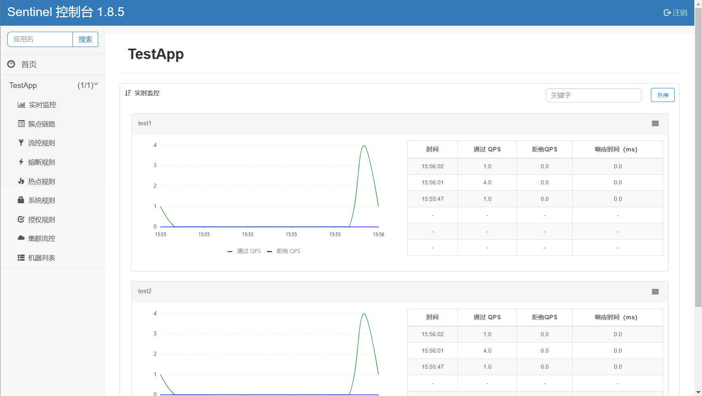

## Sentinel客户端如何和控制台进行交互

为了简化使用的操作过程，Sentinel 提供了开源版本的 Dashboard 供我们基本使用和二次开发，如果想要在我们的系统中接入 Dashboard，我们需要下载相应的 jar 包，并且在我们的项目中添加相关依赖，然后添加一些参数来进行启动。

```xml
<dependency>
    <groupId>com.alibaba.csp</groupId>
    <artifactId>sentinel-transport-simple-http</artifactId>
    <version>1.8.6</version>
</dependency>
```

在我们第一章中，或者说到现在为止的分析中，都还未接触到 Sentinel 的核心流程：

```java
entry = SphU.entry(resourceName, resourceType, entryType, pjp.getArgs());
```

点进去看，可以发现它使用的其实是 Env 中的 sph 进行相应的处理：

```java
return Env.sph.entryWithType(name, resourceType, trafficType, 1, args);
```

我们来看看 Env 类：

```java
public class Env {

    public static final Sph sph = new CtSph();

    static {
        // If init fails, the process will exit. 初始化工作
        // 值得注意的是，在项目启动的时候，似乎该类并没有被加载，
        // 因为打断点的时候，项目都启动完成了，该静态代码段一直没有执行
        // 直到 sentinel 第一次请求的时候，该 Env 类才真正的被加载进来。
        InitExecutor.doInit();
    }

}
```

可以看到，在静态代码块中，执行了 `InitExecutor.doInit` 方法，当我们的 Sentinel 客户端第一次执行请求的时候，该静态代码块被执行，然后这才是我们和控制台进行交互的开始。

## 第一章 从InitExecutor开始

```java
/**
 * If one {@link InitFunc} throws an exception, the init process
 * will immediately be interrupted and the application will exit.
 * 无论是 控制台，还是 sentinel 本身，都会调用这个方法
 * 对于 sentinel 来说，是在 Env 中自动初始化
 * 而对于控制台来说，则是在 DashboardApplication 中的 main 方法中主动调用
 * The initialization will be executed only once.
 */
public static void doInit() {
    if (!initialized.compareAndSet(false, true)) {
        return;
    }
    try {
        // 使用 SPI 机制加载 InitFunc 的实现类
        // 在包 sentinel-transport 下的 sentinel-transport-common 中，可以看到导入了
        //      com.alibaba.csp.sentinel.transport.init.CommandCenterInitFunc
        //      com.alibaba.csp.sentinel.transport.init.HeartbeatSenderInitFunc
        // 这两个类，前者用来给 dashboard 提供接口去调用；
        // 后者用来给 dashboard 发送心跳，将自己的 ip、port、sentinel 版本等信息告知 dashboard。
        //      对于 dashboard 来说，有了这些信息，就可以对应用进行规则设置、到应用拉取数据用于页面展示等
        // 除此之外，还通过 sentinel-core 中添加了 com.alibaba.csp.sentinel.metric.extension.MetricCallbackInit
        List<InitFunc> initFuncs = SpiLoader.of(InitFunc.class).loadInstanceListSorted();
        List<OrderWrapper> initList = new ArrayList<OrderWrapper>();
        // 以从小到达的顺序将加载的 InitFunc 包装成 OrderWrapper 并按 @InitOrder 从小到大的顺序进行排列
        for (InitFunc initFunc : initFuncs) {
            RecordLog.info("[InitExecutor] Found init func: {}", initFunc.getClass().getCanonicalName());
            insertSorted(initList, initFunc);
        }
        for (OrderWrapper w : initList) {
            w.func.init(); // 调用 InitFunc 的初始化方法
            RecordLog.info("[InitExecutor] Executing {} with order {}",
                           w.func.getClass().getCanonicalName(), w.order);
        }
    } catch (Exception ex) {
        RecordLog.warn("[InitExecutor] WARN: Initialization failed", ex);
        ex.printStackTrace();
    } catch (Error error) {
        RecordLog.warn("[InitExecutor] ERROR: Initialization failed with fatal error", error);
        error.printStackTrace();
    }
}
```

值得注意的是，在我们的 Sentinel 客户端中，会通过 Env 中的静态代码块来执行 `InitExecutor` 的 `doInit` 方法；然而，在 Sentinel Dashboard 中，同样也会执行该 doInit 方法：

```java
@SpringBootApplication
public class DashboardApplication {

    public static void main(String[] args) {
        triggerSentinelInit();
        SpringApplication.run(DashboardApplication.class, args);
    }

    private static void triggerSentinelInit() {
        new Thread(() -> InitExecutor.doInit()).start();
    }
}
```

当然，笔者现在暂时没搞明白为什么 DashBoard 也会调用该方法，不过这并不影响我们对两者之间如何交互进行分析，让我们将眼光重新放回 doInit 中：

1. 使用 SPI 机制加载 InitFunc 的实现类，并且按照以小到大的顺序将 InitFunc 的实现类包装成 OrderWrapper。
2. 挨个调用它们的 InitFunc 的初始化方法 init。

在这一步中，其实一共加载了三个 InitFunc 实现类：**CommandCenterInitFunc、HeartbeatSenderInitFunc 和 MetricCallbackInit**

- `CommandCenterInitFunc`：内部嵌入服务器，提供给 Dashboard去使用。Dashboard会发送相关的请求，然后给服务器接受，并进行相关处理。
- `HeartbeatSenterInitFunc`：给 Dashboard 发送心跳，并且将自己的 ip、port、sentinel 版本等信息告知 dashboard，**对于 dashboard 来说，有了这些信息，就可以对应用进行规则设置，到应用拉去数据用于页面展示等等**。
- `MetricCallbackInit`：内部添加了两个回调方法，留到后续章节进行分析。

## 第二章 分析CommandCenterInitFunc

注意，在我们本次的分析中，采用的是 HTTP 进行通信，因此我们引入的包是 `sentinel-transport-simple-http`。

```java
@InitOrder(-1)
public class CommandCenterInitFunc implements InitFunc {

    @Override
    public void init() throws Exception {
        // 本次源码分析中，导入的包是 sentinel-transport-simple-http，因此该 CommandCenter 是
        // SimpleHttpCommandCenter
        CommandCenter commandCenter = CommandCenterProvider.getCommandCenter();

        if (commandCenter == null) {
            RecordLog.warn("[CommandCenterInitFunc] Cannot resolve CommandCenter");
            return;
        }
        // 初始化工作：加载 CommandHandler 的相关实现类
        // CommandHandler 的实现类用来和控制台进行交互，负责处理。
        commandCenter.beforeStart();
        commandCenter.start();
        RecordLog.info("[CommandCenterInit] Starting command center: "
                       + commandCenter.getClass().getCanonicalName());
    }
}
```

在 `CommandCenterProvider` 类中，会执行静态代码块，而在该静态代码块中，会使用 SPI 加载 `CommandCenter` 的相关实现类，不过如果系统中存在多个该类的实现类，只会取优先级最高的那个。而在本次分析中，使用的就是 **SimpleHttpCommandCenter**。

有了 `CommandCenter` 之后，就可以执行它的 beforeStart 方法和 start 方法。

### 2.1 commandCenter.beforeStart 方法

顾名思义，该方法的作用就是在 `commandCenter` 真正开始工作之前做一些准备工作：

```java
public void beforeStart() throws Exception {
    // Register handlers
    // 通过 spi 机制将 CommandHandler 实现类加载进来
    Map<String, CommandHandler> handlers = CommandHandlerProvider.getInstance().namedHandlers();
    // 将 handlers 设置进 handlerMap 中
    registerCommands(handlers);
}
```

从总体上来说，在该方法中，会通过 SPI 机制将 CommandHandler 的实现类加载进来，不过也会通过 SPI 加载的 CommandHandlerInterceptor 去查看是否存在特殊的 CommandHandler 应该被拦截，然后将特殊的 Handler 封装成 InterceptingCommandHandler，并将其加入到 handlerMap 中（非特殊的 handler 也会被加入到该 map 中）。之后在执行 CommandHandler 的 handler 方法的时候，自然回去根据拦截器去处理特殊的逻辑。

在上面的代码中，`CommandHandlerProvider.getInstance()` 其实使用的就是单例模式，而它的 namedHandler 方法就是通过 SPI 机制去寻找我们配置好了的 CommandHandler。

```java
public class CommandHandlerProvider implements Iterable<CommandHandler> {

    private final SpiLoader<CommandHandler> spiLoader = SpiLoader.of(CommandHandler.class);

    /**
     * Get all command handlers annotated with {@link CommandMapping} with command name.
     *
     * @return list of all named command handlers
     */
    public Map<String, CommandHandler> namedHandlers() {
        Map<String, CommandHandler> map = new HashMap<String, CommandHandler>();
        List<CommandHandler> handlers = spiLoader.loadInstanceList();
        // 用来拦截一些 特殊的 CommandHandler，Sentinel 默认没有实现，不过用户可以根据 SPI 机制自行扩展来自定义
        List<CommandHandlerInterceptor> commandHandlerInterceptors = SpiLoader.of(CommandHandlerInterceptor.class).loadInstanceListSorted();
        for (CommandHandler handler : handlers) {
            String name = parseCommandName(handler);
            if (StringUtil.isEmpty(name)) {
                continue;
            }
            if (!commandHandlerInterceptors.isEmpty()) {
                List<CommandHandlerInterceptor> interceptors = new ArrayList<>();
                for (CommandHandlerInterceptor commandHandlerInterceptor : commandHandlerInterceptors) {
                    // 判断当前 handler 是否应该被拦截
                    if (commandHandlerInterceptor.shouldIntercept(name)) {
                        interceptors.add(commandHandlerInterceptor);
                    }
                }
                // 如果该 CommandHandler 被拦截了，就将其包装成 InterceptingCommandHandler，
                // 之后在执行 CommandHandler 的 handler 逻辑的时候，会进行特殊的处理
                if (!interceptors.isEmpty()) {
                    handler = new InterceptingCommandHandler(handler, interceptors);
                }
            }
            map.put(name, handler);
        }
        return map;
    }

    private String parseCommandName(CommandHandler handler) {
        CommandMapping commandMapping = handler.getClass().getAnnotation(CommandMapping.class);
        if (commandMapping != null) {
            return commandMapping.name();
        } else {
            return null;
        }
    }

    @Override
    public Iterator<CommandHandler> iterator() {
        return spiLoader.loadInstanceList().iterator();
    }

    private static final CommandHandlerProvider INSTANCE = new CommandHandlerProvider();

    public static CommandHandlerProvider getInstance() {
        return INSTANCE;
    }
}
```

这里的 `CommandHandlerInterceptor` 机制其实也是 Sentinel 留给我们的扩展点，但是在当前简单的使用 SpringAOP 适配 Sentinel 的过程中，似乎并没有发现该拦截器的具体作用，官方给的它的实现类，比如 `AllCommandHandlerInterceptor, EchoCommandHandlerInterceptor, GetRulesCommandHandlerInterceptor`，都仅仅只是做了简单的控制台输出功能，并没有进行什么实质的拦截或者增强。

在查看了 Sentinel 官方的 issue 之后，在 [csp.sentinel.api authentication | csp.sentinel.api 是否可以设置使用认证访问 · Issue #2677 · alibaba/Sentinel (github.com)](https://github.com/alibaba/Sentinel/issues/2677) 中，发现可以使用 `CommandHandlerInterceptor` 进行相应的授权校验，因为 Sentinel 开源版本提供给 dashboard 的这些 `CommandHandler` 一般都是裸露的，可以通过扩展该接口做授权认证。

### 2.2 commandCenter.start 方法

在引入相应的 CommandHandler，做好相应的准备之后，接下来我们继续分析 start 方法，这也是我们的核心方法之一。

```java
@Override
public void start() throws Exception {
    // 获取机器的线程数
    int nThreads = Runtime.getRuntime().availableProcessors();
    this.bizExecutor = new ThreadPoolExecutor(
        nThreads, nThreads, 0L, TimeUnit.MILLISECONDS,
        new ArrayBlockingQueue<Runnable>(10),
        new NamedThreadFactory("sentinel-command-center-service-executor", true),
        new RejectedExecutionHandler() {
            @Override
            public void rejectedExecution(Runnable r, ThreadPoolExecutor executor) {
                CommandCenterLog.info("EventTask rejected");
                throw new RejectedExecutionException();
            }
        });

    Runnable serverInitTask = new Runnable() {
        // 获取端口号，默认 8719
        int port;

        {
            try {
                port = Integer.parseInt(TransportConfig.getPort());
            } catch (Exception e) {
                port = DEFAULT_PORT;
            }
        }

        @Override
        public void run() {
            boolean success = false;
            // 创建 Server Socket
            ServerSocket serverSocket = getServerSocketFromBasePort(port);

            if (serverSocket != null) {
                CommandCenterLog.info("[CommandCenter] Begin listening at port " + serverSocket.getLocalPort());
                socketReference = serverSocket;
                // executor 为 SingleThreadExecutor
                executor.submit(new ServerThread(serverSocket));
                success = true;
                port = serverSocket.getLocalPort();
            } else {
                CommandCenterLog.info("[CommandCenter] chooses port fail, http command center will not work");
            }

            if (!success) {
                port = PORT_UNINITIALIZED;
            }

            TransportConfig.setRuntimePort(port);
            executor.shutdown();// 关闭线程池
        }

    };

    new Thread(serverInitTask).start();
}
```

1. 通过上面的源码可以看到，我们一上来就先创建了一个 bizExecutor 线程池，该线程池是用来执行那些从 dashboard 发来的请求的，章节后续会具体分析。
2. 创建一个 Runnable 接口的 `serverInitTask`，于是我们就可以观看该 Task 的 run 方法，在这里面，可以发现我们的默认端口就是 8719，然后创建 `ServerSocket`，并将其封装成 `ServerThread` 之后交给单线程线程池去执行它的 run 方法。
3. 也就是上述代码中的 `executor.submit(new ServerThread(serverSocket));`

作为 `SimpleHttpCommandCenter` 的内部类，ServerThread 的源代码如下：

```java
class ServerThread extends Thread {

    private ServerSocket serverSocket;

    ServerThread(ServerSocket s) {
        this.serverSocket = s;
        setName("sentinel-courier-server-accept-thread");
    }

    @Override
    public void run() {
        while (true) {
            Socket socket = null;
            try {
                // 接受来自 dashboard 的请求
                socket = this.serverSocket.accept();
                setSocketSoTimeout(socket); // 默认超时时间为 3s
                HttpEventTask eventTask = new HttpEventTask(socket);
                // 使用之前创建好的业务线程池进行异步处理 HttpEventTask
                bizExecutor.submit(eventTask);
            } catch (Exception e) {
                CommandCenterLog.info("Server error", e);
                if (socket != null) {
                    try {
                        socket.close();
                    } catch (Exception e1) {
                        CommandCenterLog.info("Error when closing an opened socket", e1);
                    }
                }
                try {
                    // In case of infinite log.
                    Thread.sleep(10);
                } catch (InterruptedException e1) {
                    // Indicates the task should stop.
                    break;
                }
            }
        }
    }
}
```

可以看到，它会接受来自 dashboard 的请求，并使用之前创建好的业务线程池 bizExecutor 异步处理 HttpEventTask。

具体来说，`HttpEventTask` 会根据请求解析出它的 CommandName，并根据 name 去找到对应的 CommandHandler 进行处理。**也就是通过这一步，在 dashboard 中设置好的一些流控规则啥的就可以实时的反应到 Sentinel 中了**。当然本次博客后面的章节还会从 dashboard 的角度去查看两者之间的交互。

## 第三章 Sentinel 中关于控制台的心跳检测

在经过上面两章节的分析中以及平时的使用过程中，难免发现一个问题：我们仅仅只在 Sentinel 客户端连接 dashboard 的时候，才会使用 JVM 参数来告知客户端 dashboard 的 ip 地址和端口号是什么，而 dashboard 却在表面层面上并不知道客户端的相关信息，那么这一切到底是怎么做的呢？这就需要我们的心跳检测了。

在 InitFunc 中，除了引入 CommandCenterInitFunc 之外，还引入了 HeartbeatSenterInitFunc，而它的作用就是周期性的向控制台发送心跳检测。

```java
@Override
public void init() {
    // 返回 SimpleHttpHeartbeatSender
    HeartbeatSender sender = HeartbeatSenderProvider.getHeartbeatSender();
    if (sender == null) {
        RecordLog.warn("[HeartbeatSenderInitFunc] WARN: No HeartbeatSender loaded");
        return;
    }
    // 初始化 定时线程池
    initSchedulerIfNeeded();
    // 获取间隔时间，默认是 10s
    long interval = retrieveInterval(sender);
    setIntervalIfNotExists(interval);
    // 周期性执行心跳检测
    scheduleHeartbeatTask(sender, interval);
}
```

同样的，Sentinel 会通过 SPI 机制加载系统中的 `HeartbeatSenter` 类的实现类，并选取优先级最高的那个，在我们本次分析中，也就是 `SimpleHttpHeartbeatSender`，接下来初始化定时线程池，然后获取我们配置好的间隔时间——如果没有配置则默认 10s，然后周期性的去执行心跳检测。

至于为什么线程池要定义成两个核心线程数，我才是因为这里面需要使用网络传输，可能遇到网络波动问题，如果只有一个线程数，那么就无法实现心跳检测的周期性，因此需要另一个线程进行缓冲。

```java
private ScheduledExecutorService pool = null;

private void initSchedulerIfNeeded() {
    if (pool == null) {
        pool = new ScheduledThreadPoolExecutor(
            2,                                
            new NamedThreadFactory("sentinel-heartbeat-send-task", true),                        
            new DiscardOldestPolicy());
    }
}

private void scheduleHeartbeatTask(/*@NonNull*/ final HeartbeatSender sender, /*@Valid*/ long interval) {
    pool.scheduleAtFixedRate(new Runnable() {
        @Override
        public void run() {
            try {
                // 核心逻辑
                sender.sendHeartbeat();
            } catch (Throwable e) {
                RecordLog.warn("[HeartbeatSender] Send heartbeat error", e);
            }
        }
    }, 5000, interval, TimeUnit.MILLISECONDS);
    RecordLog.info("[HeartbeatSenderInit] HeartbeatSender started: "
                   + sender.getClass().getCanonicalName());
}
```

而在 `SimpleHttpHeartbeatSender` 中：

1. 获取控制台的 ip 和 port 等信息
2. 设置 request，也就是控制台的 ip + 端口 + 请求路径，**在这一步，就将 Sentinel 客户端的相关信息通过心跳检测的方式告知给了控制台，然后控制台就可以发送指令给客户端了**
3. 使用 httpClient 向控制台发送相应的 post 请求，而请求路径则是 `/registry/machine`，最终会被控制台的 `MachineRegistryController` 进行处理。

代码如下：

```java
@Override
public boolean sendHeartbeat() throws Exception {
    if (TransportConfig.getRuntimePort() <= 0) {
        RecordLog.info("[SimpleHttpHeartbeatSender] Command server port not initialized, won't send heartbeat");
        return false;
    }
    // 获取控制台的 ip 和 port 等信息
    Endpoint addrInfo = getAvailableAddress();
    if (addrInfo == null) {
        return false;
    }
    // 设置 request，也就是控制台的 ip + 端口 + 请求路径
    // 在这一步，就将 sentinel 的相关信息通过心跳检测的方式告知给了 控制台，然后控制台就可以发送指令给 sentinel了
    // 将 控制台 和 sentinel 给联系了起来。
    // 在 dashboard 中，MachineRegistryController 会处理该 post 请求。
    SimpleHttpRequest request = new SimpleHttpRequest(addrInfo, TransportConfig.getHeartbeatApiPath());
    request.setParams(heartBeat.generateCurrentMessage());
    try {
        // 向服务端发送 post 请求
        SimpleHttpResponse response = httpClient.post(request);
        if (response.getStatusCode() == OK_STATUS) {
            return true;
        } else if (clientErrorCode(response.getStatusCode()) || serverErrorCode(response.getStatusCode())) {
            RecordLog.warn("[SimpleHttpHeartbeatSender] Failed to send heartbeat to " + addrInfo
                           + ", http status code: " + response.getStatusCode());
        }
    } catch (Exception e) {
        RecordLog.warn("[SimpleHttpHeartbeatSender] Failed to send heartbeat to " + addrInfo, e);
    }
    return false;
}
```

## 第四章 从控制台的角度看交互

在上一章节的最后我们说到，dashboard 中关于客户端的心跳的处理，是通过 `MachineRegistryController` 来实现的，而它的内部，其实就是将请求进行解析，然后将各种信息封装成 Machine 对象，并通过 `AppManagement` 进行相应的管理，具体流程就不细说了。

在控制台中，存在一个实时监控功能，它能实时的查看当前客户端资源的访问量，并且只能展示五分钟的数据：



该功能的实现需要关注 `MetricController`、`MetricFetcher` 类，其实总体的原理大致就是，控制台的前端不停的发送相应的请求给控制台后端，然后控制台后端就使用 http 请求和 Sentinel 客户端进行交互，使用对应的 `CommandHandler` 处理之后，得到相应的信息之后再交给前端进行展示。

至于其他的规则配置，比如新增流控规则等等，流程都大差不差，只不过其中的实现有区别而已。

当然，在了解了这些流程之后，就可以对控制台和客户端进行二次开发，一个是可以自定义请求协议，而不是使用 Sentinel 的 HTTP 请求；第二个就是扩展 CommandHandler 和 Controller，增强安全性和符合公司业务的功能。总体来说，Sentinel 的扩展性还是很强的。
