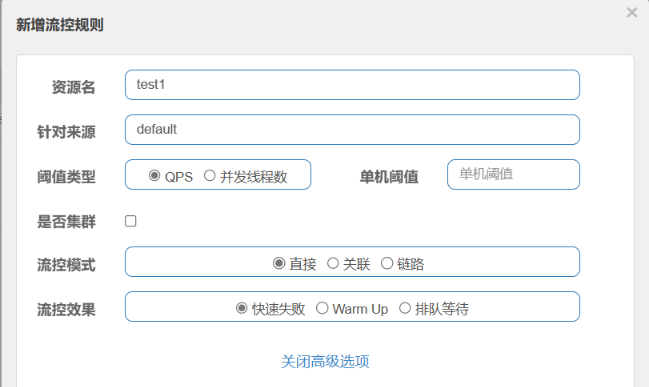

# Sentinel 中如何进行流量控制？

在 Sentinel 中，有关流量控制的实现在 `FlowSlot` 中进行体现。

如官网所说：`FlowSlot` 会根据预设的规则，结合前面 `NodeSelectorSlot`、`ClusterNodeBuilderSlot`、`StatistcSlot` 统计出来的实时信息进行流量控制。

限流的直接表现是在执行 `Entry nodeA = SphU.entry(资源名字)` 的时候抛出 `FlowException` 异常。`FlowException` 是 `BlockException` 的子类，您可以捕捉 `BlockException` 来自定义被限流之后的处理逻辑。

同一个资源可以对应多条限流规则。`FlowSlot` 会对该资源的所有限流规则依次遍历，直到有规则触发限流或者所有规则遍历完毕。

一条限流规则主要由下面几个因素组成，我们可以组合这些元素来实现不同的限流效果：

- `resource`：资源名，即限流规则的作用对象
- `count`: 限流阈值
- `grade`: 限流阈值类型，QPS 或线程数
- `strategy`: 根据调用关系选择策略

## 第一章 关于流量控制的基本概念

首先让我们来看看 Sentinel 提供的默认控制台中关于添加流控规则的界面：



可以发现，Sentinel 的流量控制主要有两种统计类型，由 `FlowRule.grade` 字段来进行定义：

- **统计线程数**：线程数限流用于保护业务线程数不被耗尽。例如，当应用所依赖的下游应用由于某种原因导致服务不稳定、响应延迟增加，对于调用者来说，意味着吞吐量下降和更多的线程数占用，极端情况下甚至导致线程池耗尽。为应对高线程占用的情况，业内有使用隔离的方案，比如通过不同业务逻辑使用不同线程池来隔离业务自身之间的资源争抢（线程池隔离），或者使用信号量来控制同时请求的个数（信号量隔离）。这种隔离方案虽然能够控制线程数量，但无法控制请求排队时间。当请求过多时排队也是无益的，直接拒绝能够迅速降低系统压力。Sentinel线程数限流不负责创建和管理线程池，而是简单统计当前请求上下文的线程个数，如果超出阈值，新的请求会被立即拒绝。
- **QPS 流量控制**：当 QPS 超过某个阈值的时候，就可以采取措施进行流量控制，对于流量控制来说，包含三种手段，通过 `FlowRule.controlBehavior` 字段进行定义：
  - **快速失败**：也叫直接拒绝，是默认的流控方式，也就是当 QPS 超过阈值的时候，对于新的请求而言就直接拒绝。这种情况适用于对系统处理能力确切已知的情况下，比如通过压测确定了系统的准确水位。
  - **冷启动 Warm Up**：该方式主要用于系统长期处于低水位的情况下，当流量突然增加时，直接把系统拉升到高水位可能瞬间把系统压垮。通过"冷启动"，让通过的流量缓慢增加，在一定时间内逐渐增加到阈值上限，给冷系统一个预热的时间，避免冷系统被压垮的情况。
  - **排队等待**：让请求以均匀的速度通过，对应的是**漏桶算法**。这种方式主要用于处理间隔性突发的流量，例如消息队列。想象一下这样的场景，在某一秒有大量的请求到来，而接下来的几秒则处于空闲状态，我们希望系统能够在接下来的空闲期间逐渐处理这些请求，而不是在第一秒直接拒绝多余的请求。

在**流控模式**方面，我们一般都使用默认的直接模式，也就是根据调用方 origin 进行限流，也就是上图中的针对来源，默认是 `default`，也就是不区分调用者，来自任何调用者的请求都将进行限流统计。如果这个资源名的调用总和超过了该规则定义的阈值，就触发限流，字面意思上也就是使用我们的 ClusterNode 进行统计分析。

- `default`：表示不区分调用者，来自任何调用者的请求都将进行限流统计。如果这个资源名的调用总和超过了这条规则定义的阈值，则触发限流。
- `{some_origin_name}`：表示针对特定的调用者，只有来自这个调用者的请求才会进行流量控制。例如 `NodeA` 配置了一条针对调用者`caller1`的规则，那么当且仅当来自 `caller1` 对 `NodeA` 的请求才会触发流量控制。
- `other`：表示针对除 `{some_origin_name}` 以外的其余调用方的流量进行流量控制。例如，资源`NodeA`配置了一条针对调用者 `caller1` 的限流规则，同时又配置了一条调用者为 `other` 的规则，那么任意来自非 `caller1` 对 `NodeA` 的调用，都不能超过 `other` 这条规则定义的阈值。

同一个资源名可以配置多条规则，规则的生效顺序为：**{some_origin_name} > other > default**。

至于剩下的根据调用链路入口限流，也就是链路限流，以及根据关联流量控制，这两种流控模式我们在这就不再细说，具体可以参考官方网站上给的介绍，我们只分析直接模式中的三种 QPS 流量控制方式的源代码。

## 第二章 对资源添加流控规则的过程

虽然我们可以使用纯代码的方式对流控规则进行添加，但是无论是从维护角度，还是使用便捷度来说，都推荐使用控制台进行规则的添加。

在分析 Sentinel 客户端如何和控制台进行交互的时候，我们知道，客户端会使用 `CommandHandler` 处理来自于控制台的请求，于是我们将目光放在 `ModifyRulesCommandHandler` 类上，在它的 `handle` 方法中，可以发现它先去解析请求中的数据，并将其解析成 `FlowRule` 的 List 集合，然后使用 `FlowRuleManager.loadRules(flowRules)` 去将流控规则给添加到客户端的内存当中。

```java
// FlowRuleManager#loadRules
public static void loadRules(List<FlowRule> rules) {
    currentProperty.updateValue(rules);
}
```

对于 currentProperty 而言，我们暂且知道它是 `DynamicSentinelProperty` 的实例对象，在它的 `updateValue` 方法中，其实就是将我们的流控规则保存在它的实例变量 `value` 中，并且调用它内部的 `listeners` 对 value 进行解析，然后将解析的结果给封装在 `FlowRuleManager` 的 `flowRules` 中（因为 FlowPropertyListener 是 FlowRuleManager 的内部类）

```java
// DynamicSentinelProperty#updateValue
@Override
public boolean updateValue(T newValue) {
    if (isEqual(value, newValue)) {
        return false;
    }
    RecordLog.info("[DynamicSentinelProperty] Config will be updated to: {}", newValue);

    value = newValue;
    for (PropertyListener<T> listener : listeners) {
        listener.configUpdate(newValue);
    }
    return true;
}
```

从上面的分析，我们不难得出，`FlowRuleManager` 在整个流控中占据非常重要的地位，因为真正的流控规则其实都保存在该类中。接下来我们就着重分析一下该类，首先从属性入手：

```java
// 规则集合
private static volatile Map<String, List<FlowRule>> flowRules = new HashMap<>();

// 监听器
private static final FlowPropertyListener LISTENER = new FlowPropertyListener();
// 用来监听配置是否发生变化
private static SentinelProperty<List<FlowRule>> currentProperty = new DynamicSentinelProperty<List<FlowRule>>();

/** the corePool size of SCHEDULER must be set at 1, so the two task ({@link #startMetricTimerListener()} can run orderly by the SCHEDULER **/
@SuppressWarnings("PMD.ThreadPoolCreationRule")
private static final ScheduledExecutorService SCHEDULER = Executors.newScheduledThreadPool(1,
                                                                                           new NamedThreadFactory("sentinel-metrics-record-task", true));

static {
    // 设置监听
    currentProperty.addListener(LISTENER);
    // 每一秒钟调用一次 MetricTimerListener 的 run 方法
    startMetricTimerListener();
}
```

首先是它内部定义了 `flowRules` 去存放真正的流控规则，其中 key 是资源的名字。同时它还定义了一个 `FlowPropertyListener` 监听器，并将其添加到 currentProperty 中，而这一步的作用，其实就是用来监听配置的变化。也就是在控制台中添加相应的流控规则的时候，就可以将控制台中的流控信息使用监听器的 configUpdate 方法去将其转换成真正的流控规则。

除此之外，它内部还定义了一个线程池，其实就是当 FlowManager 第一次被加载的时候，每一秒钟去调用一次 `MetricTimerListener` 的 run 方法，主要作用就是进行定时的数据采集，将系统中的 ClusterNodes 的数据进行收集，并写入到对应的 log 文件中。不过很疑惑的是，为什么要将数据采集到本地文件的步骤放到流控当中？我猜测可能是因为 Flow 是 slotChain 中进行规则判断的第一步，因此当系统中的第一个请求进来的时候，走到 Flow 的时候，就可以说明它应当开始收集了，虽然此时可能没有数据（因为对于数据的统计应该是走完所有的规则校验之后才在 StatisticSlot 中进行）。

好了，有了上面的基础，我们就可以从头开始梳理一遍基础的流程，以及 FlowSlot 中究竟做了什么了：

```java
@Override
public void entry(Context context, ResourceWrapper resourceWrapper, DefaultNode node, int count,
                  boolean prioritized, Object... args) throws Throwable {
    checkFlow(resourceWrapper, context, node, count, prioritized);

    fireEntry(context, resourceWrapper, node, count, prioritized, args);
}

void checkFlow(ResourceWrapper resource, Context context, DefaultNode node, int count, boolean prioritized)
    throws BlockException {
    checker.checkFlow(ruleProvider, resource, context, node, count, prioritized);
}

private final Function<String, Collection<FlowRule>> ruleProvider = new Function<String, Collection<FlowRule>>() {
    @Override
    public Collection<FlowRule> apply(String resource) {
        // Flow rule map should not be null.
        Map<String, List<FlowRule>> flowRules = FlowRuleManager.getFlowRuleMap();
        return flowRules.get(resource);
    }
};
```

在 `checkFlow` 方法中，我们可以发现有一个 `checker`，它其实是 `FlowRuleChecker` 类型的实例变量，不过我个人觉得在这里可以使用类变量，因为该类中并没有一些共享数据，而是一个个待调用的方法。

然后对于 `ruleProvider` 而言，是一个函数表达式，它的 `apply` 方法其实就是从 `FlowRuleManager` 中读取 `flowRules` 类变量的值，然后获取当前资源所属于的流控规则。前面也说了，对于 flowRules 类变量的修改，是通过监听器进行的。

在 `FlowRuleChecker` 类中的 `checkFlow` 方法中：

```java
public void checkFlow(Function<String, Collection<FlowRule>> ruleProvider, ResourceWrapper resource,
                      Context context, DefaultNode node, int count, boolean prioritized) throws BlockException {
    if (ruleProvider == null || resource == null) {
        return;
    }
    // 返回 FlowRuleManager 里面注册的对应于当前资源的规则
    Collection<FlowRule> rules = ruleProvider.apply(resource.getName());
    if (rules != null) {
        for (FlowRule rule : rules) {
            // 如果当前的请求不能通过，就抛出异常，该异常是 BlockException 的子类
            if (!canPassCheck(rule, context, node, count, prioritized)) {
                throw new FlowException(rule.getLimitApp(), rule);
            }
        }
    }
}
```

基本的流程就是先获得该资源所拥有的流控规则，然后挨个按照流控规则进行判断，如果一旦有一个不通过，就直接抛出对应的异常。

在 `canPassCheck` 方法中，我们也只会分析 `passLocalCheck` 方法：

```java
private static boolean passLocalCheck(FlowRule rule, Context context, DefaultNode node, int acquireCount,
                                      boolean prioritized) {
    // // 根据我们的配置选择我们应该对哪个 ClusterNode 中的统计数据进行分析
    Node selectedNode = selectNodeByRequesterAndStrategy(rule, context, node);
    if (selectedNode == null) {
        return true;
    }

    return rule.getRater().canPass(selectedNode, acquireCount, prioritized);
}
```

其中 `getRater` 其实就是我们的几种流量控制方式，比如快速失败、冷启动 Warm Up、排队等待。

不过说起来，关于这部分的监听器设计倒是有点意思，首先我们只需要从 flowRules 中拿到对应的流控规则就行，关于它如何改变的，就直接交给我们的监听器，由监听器负责修改，并且对于 flowRules 使用 volatile 进行修饰，以防止可见性问题。不过粗略想想，发现不用监听器设计，而是使用单纯的方法对 flowRules 变量进行修改，似乎也能行得通，但是采用监听器的设计，可以降低耦合度，并且还能增强扩展性，因为你可以添加你自己的监听器，而无需修改以前的代码。至于这里有没有用设计模式，用了什么设计模式，我就不得而知了，毕竟关于设计模式的内容我还是不太熟练，也没有主动的去设计过代码。

## 第三章 三种流控方式的分析

### 3.1 DefaultController

对应的是直接拒绝，快速失败：

```java
@Override
public boolean canPass(Node node, int acquireCount, boolean prioritized) {
    int curCount = avgUsedTokens(node);
    if (curCount + acquireCount > count) {
        // 只有 prioritized 为 true 才会进入
        // 即使超过限制，但是 prioritized 为 true，则认为是重要任务，可以尝试让业务线程 sleep 到下一个窗口，借用下一个窗口的计数
        if (prioritized && grade == RuleConstant.FLOW_GRADE_QPS) {
            long currentTime;
            long waitInMs;
            currentTime = TimeUtil.currentTimeMillis();
            waitInMs = node.tryOccupyNext(currentTime, acquireCount, count);
            if (waitInMs < OccupyTimeoutProperty.getOccupyTimeout()) {
                node.addWaitingRequest(currentTime + waitInMs, acquireCount);
                node.addOccupiedPass(acquireCount);
                sleep(waitInMs);

                // PriorityWaitException indicates that the request will pass after waiting for {@link @waitInMs}.
                throw new PriorityWaitException(waitInMs);
            }
        }
        return false;
    }
    return true;
}
```

获取当前分析的 ClusterNode 的 QPS 数据，然后判断当前的 QPS 是否超过了阈值，如果超过了就直接拒绝请求。

同时这里有个很有意思的设计，如果当前资源的优先级比较高，即使超过了限制，它仍然可以将其 sleep 到下一个窗口，然后借用下一个窗口的计数，而不是直接将其拒绝。

### 3.2 WarmUpController

该流控模式采用的是令牌桶算法，并且借鉴了 Google Guava 中的 RateLimiter。不过由于我水平有限，并且没有了解过 Guava 和它的预热模型，下面的源码分析其实我也看不太懂，但是参考文献中的几篇博客讲的都还不错，读者可以自行去扩展。

```java
public class WarmUpController implements TrafficShapingController {
    // 【100】
    protected double count;
    // 3
    private int coldFactor;
    // 转折点的令牌数【500】
    protected int warningToken = 0;
    // 最大的令牌数【1000】
    private int maxToken;
    // 斜线斜率【1 / 25000】
    protected double slope;

    // 令牌桶中剩余的令牌数
    protected AtomicLong storedTokens = new AtomicLong(0);
    // 最后更新令牌的时间
    protected AtomicLong lastFilledTime = new AtomicLong(0);

    public WarmUpController(double count, int warmUpPeriodInSec, int coldFactor) {
        construct(count, warmUpPeriodInSec, coldFactor);
    }

    private void construct(double count, int warmUpPeriodInSec, int coldFactor) {

        if (coldFactor <= 1) {
            throw new IllegalArgumentException("Cold factor should be larger than 1");
        }
        // 假设我们的 QPS 设置为 100，预热时间为 10s
        this.count = count;
        // 默认为 3
        this.coldFactor = coldFactor;
        // 10 * 100 / 2 = 500
        warningToken = (int)(warmUpPeriodInSec * count) / (coldFactor - 1);
        // maxToken = 500 + （2 * 10 * 100 / 4） = 1000
        maxToken = warningToken + (int)(2 * warmUpPeriodInSec * count / (1.0 + coldFactor));

        // slope = 2 / 100 / 500 = 1 / 25000
        slope = (coldFactor - 1.0) / count / (maxToken - warningToken);

    }

    public boolean canPass(Node node, int acquireCount) {
        return canPass(node, acquireCount, false);
    }

    public boolean canPass(Node node, int acquireCount, boolean prioritized) {
        // 获取当前时间窗口的 QPS
        long passQps = (long) node.passQps();
        // 获取上一个窗口的 QPS，跨度为 1s
        long previousQps = (long) node.previousPassQps();
        // 去设置 storedTokens 和 lastFilledTime 到正确的值
        syncToken(previousQps);

        // 开始计算它的斜率
        // 如果进入了警戒线，开始调整他的qps
        long restToken = storedTokens.get();
        if (restToken >= warningToken) {
            // 当前令牌数超过了 warningToken，说明当期系统需要进行预热，或者说预热未结束，当前系统的流量较小
            long aboveToken = restToken - warningToken;
            // current interval = restToken*slope+1/count
            // 计算出此时一秒内能够生成的 token 的数量
            // 然后就需要比较令牌的生成速率 和 令牌的消耗速率
            double warningQps = Math.nextUp(1.0 / (aboveToken * slope + 1.0 / count));
            if (passQps + acquireCount <= warningQps) {
                // 如果 token 的消费速度大于生成速度，就进行限流
                return true;
            }
        } else {
            // 当前令牌桶中剩余令牌数较小，说明预热结束，此时只需要判断是否超过设置的阈值就行
            if (passQps + acquireCount <= count) {
                return true;
            }
        }
        return false;
    }

    protected void syncToken(long passQps) {
        long currentTime = TimeUtil.currentTimeMillis();
        currentTime = currentTime - currentTime % 1000;
        long oldLastFillTime = lastFilledTime.get();
        if (currentTime <= oldLastFillTime) {
            // 如果两个时间相等，说明还处于同一秒内，不进行令牌的计算，避免重复
            return;
        }

        long oldValue = storedTokens.get();
        long newValue = coolDownTokens(currentTime, passQps);
        // 使用 CAS 重置令牌的数量
        if (storedTokens.compareAndSet(oldValue, newValue)) {
            // 减去上一个时间窗口的通过请求数
            long currentValue = storedTokens.addAndGet(0 - passQps);
            if (currentValue < 0) {
                storedTokens.set(0L);
            }// 更新 lastFilledTime
            lastFilledTime.set(currentTime);
        }
    }

    private long coolDownTokens(long currentTime, long passQps) {
        long oldValue = storedTokens.get();
        long newValue = oldValue;

        // 添加令牌的判断前提条件:
        // 当令牌的消耗程度远远低于警戒线的时候
        if (oldValue < warningToken) {
            // 此时说明当前没有处于预热阶段
            newValue = (long)(oldValue + (currentTime - lastFilledTime.get()) * count / 1000);
        } else if (oldValue > warningToken) {
            // 处于预热阶段，如果消费速度小于冷却速度，就添加令牌
            if (passQps < (int)count / coldFactor) {
                newValue = (long)(oldValue + (currentTime - lastFilledTime.get()) * count / 1000);
            }
        }
        return Math.min(newValue, maxToken);
    }

}
```

### 3.3 RateLimiterController

其实该策略非常简单，它的核心功能就是让请求以固定速率进行通过，也就是说如果我们要求请求每隔 100ms 通过一个，但是第二个请求离第一个请求只差了 50ms，就让其睡眠 50ms 再执行；如果同时有另一个请求，就需要睡眠 150ms。

```java
public class RateLimiterController implements TrafficShapingController {

    // 排队最大时常，默认 500ms
    private final int maxQueueingTimeMs;
    private final double count; // QPS 设置的值
    // 上一次请求通过的时间
    private final AtomicLong latestPassedTime = new AtomicLong(-1);

    public boolean canPass(Node node, int acquireCount, boolean prioritized) {
        // Pass when acquire count is less or equal than 0.
        // acquireCount 默认是是 1
        if (acquireCount <= 0) {
            return true;
        }
        // Reject when count is less or equal than 0.
        // Otherwise,the costTime will be max of long and waitTime will overflow in some cases.
        if (count <= 0) {
            return false;
        }

        long currentTime = TimeUtil.currentTimeMillis();
        // Calculate the interval between every two requests.
        // 计算两个请求之间的间隔，比如 QPS 设置为 10，那么间隔就是 100ms
        long costTime = Math.round(1.0 * (acquireCount) / count * 1000);

        // Expected pass time of this request. 我们期望该请求应该执行的时间
        long expectedTime = costTime + latestPassedTime.get();
        // 如果发现现在可以执行了，就直接执行
        if (expectedTime <= currentTime) {
            // Contention may exist here, but it's okay.
            latestPassedTime.set(currentTime);
            return true;
        } else {
            // 如果发现本次请求应该再等一会才能执行，就计算出等待时间，然后就 sleep 一段时间之后再执行。
            // Calculate the time to wait.
            long waitTime = costTime + latestPassedTime.get() - TimeUtil.currentTimeMillis();
            if (waitTime > maxQueueingTimeMs) {
                return false;
            } else {
                long oldTime = latestPassedTime.addAndGet(costTime);
                try {
                    waitTime = oldTime - TimeUtil.currentTimeMillis();
                    if (waitTime > maxQueueingTimeMs) {
                        latestPassedTime.addAndGet(-costTime);
                        return false;
                    }
                    // in race condition waitTime may <= 0
                    if (waitTime > 0) {
                        Thread.sleep(waitTime);
                    }
                    return true;
                } catch (InterruptedException e) {
                }
            }
        }
        return false;
    }

}
```

## 参考文献

[flow-control | Sentinel (sentinelguard.io)](https://sentinelguard.io/zh-cn/docs/flow-control.html)

[3. Sentinel源码分析— QPS流量控制是如何实现的？ - luozhiyun`s Blog](https://www.luozhiyun.com/archives/79)

[RateLimiter 源码分析(Guava 和 Sentinel 实现)_Javadoop](https://www.javadoop.com/post/rate-limiter)

[Sentinel中冷启动限流原理WarmUpController_@Kong的博客-CSDN博客_sentinel warm up](https://blog.csdn.net/qq_33811736/article/details/119453868)