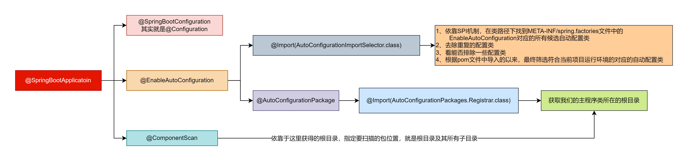

## 第一章 @SpringBootApplication

首先，为什么我们在使用SpringBoot的时候，只需要**@SpringBootApplication + SpringApplication.run，然后导入各种 spring-boot-starter-xxx**，就能将Spring + SpringMVC + Tomcat + 其他场景给整合进来，然后SpringBoot里面就会有很多的组件了呢？这个注解到底做了什么事情呢？

```java
@Target(ElementType.TYPE)
@Retention(RetentionPolicy.RUNTIME)
@Documented
@Inherited
@SpringBootConfiguration
@EnableAutoConfiguration
@ComponentScan(excludeFilters = { @Filter(type = FilterType.CUSTOM, classes = TypeExcludeFilter.class),
                                 @Filter(type = FilterType.CUSTOM, classes = AutoConfigurationExcludeFilter.class) })
public @interface SpringBootApplication {
```

上述代码的@SpringBootConfiguration其实就是一个@Configuration，然后就是一个@ComponentScan会导入SpringbootSourceApplication启动类所在的目录及其所有子目录中的组件。

**1、接下来分析@EnableAutoConfiguration注解：**

```java
@Target(ElementType.TYPE)
@Retention(RetentionPolicy.RUNTIME)
@Documented
@Inherited
@AutoConfigurationPackage
@Import(AutoConfigurationImportSelector.class)
public @interface EnableAutoConfiguration {
```

上述代码中的**@AutoConfigurationPackage**核心就是**@Import(AutoConfigurationPackages.Registrar.class)**，给我们导入了组件**AutoConfigurationPackages.Registrar.class**，然后它本身还会导入一个**AutoConfigurationImportSelector**组件。

**2、接下来分析@Import(AutoConfigurationPackages.Registrar.class)**

```java
static class Registrar implements ImportBeanDefinitionRegistrar, DeterminableImports {

    @Override
    public void registerBeanDefinitions(AnnotationMetadata metadata, BeanDefinitionRegistry registry) {
        register(registry, new PackageImports(metadata).getPackageNames().toArray(new String[0]));
    }
    // 上述register方法的第二个参数其实就是我们的主启动类所在的包的包名。

    @Override
    public Set<Object> determineImports(AnnotationMetadata metadata) {
        return Collections.singleton(new PackageImports(metadata));
    }

}
```

```java
public static void register(BeanDefinitionRegistry registry, String... packageNames) {
    if (registry.containsBeanDefinition(BEAN)) {
        BasePackagesBeanDefinition beanDefinition = (BasePackagesBeanDefinition) registry.getBeanDefinition(BEAN);
        beanDefinition.addBasePackages(packageNames); 
    }
    else {
        // // 将主程序的根目录添加到BeanDefinition中
        registry.registerBeanDefinition(BEAN, new BasePackagesBeanDefinition(packageNames));
    }
}
```

我们根据**@AutoConfigurationPackage**注解导入的Registrar类其实就是将我们的**主程序的根目录**添加到BeanDefinition中，从而指定后续**@ComponentScan注解要扫描的包位置**

**⭐即@ComponentScan注解具体扫描的包的根路径由SpringBoot项目主程序类所在的包位置决定，在扫描过程中，由@AutoConfigurationPackage注解进行解析，从而得到SpringBoot项目主程序启动类所在包的具体位置。**

**3、接下来分析@Import(AutoConfigurationImportSelector.class)注解：**

```java
rotected AutoConfigurationEntry getAutoConfigurationEntry(AnnotationMetadata annotationMetadata) {
    if (!isEnabled(annotationMetadata)) {
        return EMPTY_ENTRY;
    }
    AnnotationAttributes attributes = getAttributes(annotationMetadata);
    // 利用SPI机制，去类路径下找META-INF/spring.factories文件中的EnableAutoConfiguration对应的所有候选自动配置类
    List<String> configurations = getCandidateConfigurations(annotationMetadata, attributes);
    // 去除重复的候选配置类
    configurations = removeDuplicates(configurations);
    Set<String> exclusions = getExclusions(annotationMetadata, attributes);
    checkExcludedClasses(configurations, exclusions);
    configurations.removeAll(exclusions);
    // 根据导入的依赖，最终筛选符合当前项目运行环境的对应的自动配置类
    configurations = getConfigurationClassFilter().filter(configurations);
    fireAutoConfigurationImportEvents(configurations, exclusions);
    return new AutoConfigurationEntry(configurations, exclusions);
}
```



## 第二章 Tomcat和MVC组件的准备过程

1. SpringBoot.run会创建一个IOC容器：**AnnotationConfigServletWebServerApplicationContext**
2. IOC容器启动，onRefresh会启动Tomcat
3. Tomcat启动会加载所有的Servlet
4. DispatcherServlet初始化，会加载九大组件的整个初始化流程。