## 第一章 什么是SPI

SPI全称：Service Provider Interfact，是一种服务扩展机制，首先在配置文件中定义好接口的实现类，然后根据这个接口从配置文件中加载该接口的所有实现类，以供使用。

使用场景：

- JDBC驱动加载：根据不同的数据库厂商加载不同的JDBC驱动包。
- SpringBoot的SPI机制：在META-INF下的spring.factories中加上自定义的自动配置，事件监听或初始化器等。
- Dubbo的SPI机制：路由扩展、负载均衡扩展、集群扩展等。 

**为什么不用new呢？**

这和我们java的设计相关，系统设计的各种抽象，往往有多种不同的实现方案，而我们一般各模块之间基于接口编程，不对实现类进行硬编码。比如如果我们解析一串数据有两种方式，word和excel，如果一开始使用word来解析，发现不实用，想要替换成excel。如果使用的是new的方式，就得去修改源代码，而使用我们的SPI机制，就可以不用动用源代码，只需修改配置文件。

有点类似于IOC的思想，将装配的控制权转移到程序之外，在模块化设计中这个机制尤为重要，所以SPI的核心思想就是解耦。

**缺点**

- 使用的延迟加载，但是基本只能通过遍历全部获取，也就是接口的实现类全部加载并实例化一遍。如果不想用某些实现类，但是它也会被加载并实例化，这就造成了浪费。获取某个实现类的方式不够灵活，只能通过iterator形式获取。
- 多个并发多线程使用ServiceLoader类的实例是不安全的。 

**代码示例：**


```java
public interface DataServiceInterface {

    void say();
}
```

```java
public class MyService1 implements DataServiceInterface{
    @Override
    public void say() {
        System.out.println("I am Service1");
    }
}
```

```java
public class MyService2 implements DataServiceInterface{
    @Override
    public void say() {
        System.out.println("I am Service2");
    }
}
```

我们在META-INF.services中的top.noaharno.spi.DataServiceInterfact文件中配置如下内容：

```
top.noaharno.spi.MyService1
top.noaharno.spi.MyService2
```

然后进行测试，发现两个MyService中的say方法都被调用了：

```java
public static void main(String[] args) {
    ServiceLoader<DataServiceInterface> loader = ServiceLoader.load(DataServiceInterface.class);

    loader.forEach(DataServiceInterface::say);
}
```

## 第二章 MVC的启动原理

### 2.1 Servlet3.0规范

首先根据官网的关于SpringMVC注解版的注册并初始化DispatcherServlet，它由Servlet容器自动检测：

```java
public class MyWebApplicationInitializer implements WebApplicationInitializer {

    @Override
    public void onStartup(ServletContext servletContext) {

        // Load Spring web application configuration 创建IOC容器
        AnnotationConfigWebApplicationContext context = new AnnotationConfigWebApplicationContext();
        context.register(AppConfig.class); // 传入一个配置类
		// 以上，IOC容器都没有启动
        // Create and register the DispatcherServlet 配置了DispatcherServlet，利用Servlet的初始化机制
        DispatcherServlet servlet = new DispatcherServlet(context);
        ServletRegistration.Dynamic registration = servletContext.addServlet("app", servlet);
        registration.setLoadOnStartup(1);
        registration.addMapping("/"); // 映射路径
    }
}
```

只要写了这个，就相当于配置了SpringMVC的DispatcherServlet。Tomcat一旦启动，就会加载它，然后就会按照代码流程创建容器、指定配置类，至此所有IOC、AOP等spring的功能就准备好了。然后它会注册一个Servlet，也就是DispatcherServlet，以后所有的请求都会交给这个Servlet。

注意的是必须Servlet3.0以上才可以，Tomcat是Servlet3.0规范的一个实现。

**那么为什么我们配置好了tomcat，然后配置好上述的代码之后，整个Spring应用就能启动了呢？**

首先在Tomcat的源码中，它使用了SPI机制并遵循Servlet3.0规范，在启动的时候会去加载`javax.servlet.ServletContainerInitializer`接口的实现类，而我们的SpringMVC就实现了这个接口：**org.springframework.web.SpringServletContainerInitializer**


然后其实就是根据这个类，让我们上述的**MyWebApplicationInitializer中的onStartup**去进行执行的。让我们具体看这个类：

```java
@HandlesTypes(WebApplicationInitializer.class) // 说明我们只对实现了WebApplicationInitializer接口的类感兴趣
public class SpringServletContainerInitializer implements ServletContainerInitializer {

    @Override
    public void onStartup(@Nullable Set<Class<?>> webAppInitializerClasses, ServletContext servletContext)
        throws ServletException {

        List<WebApplicationInitializer> initializers = Collections.emptyList();

        if (webAppInitializerClasses != null) {
            initializers = new ArrayList<>(webAppInitializerClasses.size());
            for (Class<?> waiClass : webAppInitializerClasses) {
                // Be defensive: Some servlet containers provide us with invalid classes,
                // no matter what @HandlesTypes says... 所有的非接口非抽象的WebApplicationInitializer实现类
                if (!waiClass.isInterface() && !Modifier.isAbstract(waiClass.getModifiers()) &&
                    WebApplicationInitializer.class.isAssignableFrom(waiClass)) {
                    try {
                        initializers.add((WebApplicationInitializer) //集合负责保存满足上面条件的类
                                         ReflectionUtils.accessibleConstructor(waiClass).newInstance());
                    }
                    catch (Throwable ex) {
                        throw new ServletException("Failed to instantiate WebApplicationInitializer class", ex);
                    }
                }
            }
        }

        if (initializers.isEmpty()) {
            servletContext.log("No Spring WebApplicationInitializer types detected on classpath");
            return;
        }
        //下面会遍历所有满足要求的WebApplicationInitializer，调用他们的onStartup
        servletContext.log(initializers.size() + " Spring WebApplicationInitializers detected on classpath");
        AnnotationAwareOrderComparator.sort(initializers);
        for (WebApplicationInitializer initializer : initializers) {
            initializer.onStartup(servletContext); //所有的 WebApplicationInitializer 的 onStartup
        }
    }

}
```

上述代码总结来说：

1. 找到所有的WebApplicationInitializer接口的子类或其衍生类
2. 过滤掉所有的接口和抽象类
3. 排好序之后挨个执行他们自己实现的onStartup方法。

### 2.2 onStartup方法的执行

至此，我们配置好的启动类中的onStartup方法就可以被执行了，接下来我们细看onStartup方法干了些什么？

首先我们新建一个IOC容器，然后给这个容器传入我们的配置类，接着new一个DispatcherServlet，然后将我们的容器传进去，最后将DispatcherServlet给放进ServletContext中。

**可是我们并没有看到IOC容器的刷新步骤啊？**这就得说一说DispatcherServet的组成了：


**重点可以看到，DispatcherServlet其实是一个Servelt**

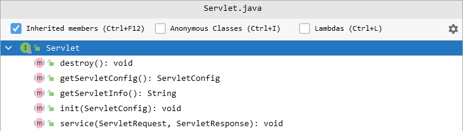

在Servelt的规范中：

1. Servelt创建对象
2. Servlet调用init初始化
3. 每次请求过来就会调用service进行处理
4. tomcat停止应用的时候就会调用destroy进行销毁。

于是我们来看一下DispatcherServlet的init方法中的实现细节，进行分析：

首先在**HttpServletBean**（实现了Servlet）中，它对init方法进行了实现，在经过一系列的工作后，它调用了一个方法：**initServletBean()**，而且它其实并没有对他进行实现，是一个空方法，这就是模板模式的体现，给子类留的方法，让子类自行去实现。

然后我们的**FrameworkServlet**就继承了**HttpServletBean**，它实现了initServletBean方法，在这个方法里面，重点就是下面的代码：

```java
this.webApplicationContext = initWebApplicationContext(); //初始化WebIOC容器
```

也就是说，在这一行代码中，就完成了我们web版本的IOC容器的初始化流程。

```java
protected WebApplicationContext initWebApplicationContext() {
    WebApplicationContext rootContext =
        WebApplicationContextUtils.getWebApplicationContext(getServletContext()); //父容器
    WebApplicationContext wac = null; //先会获取之前的 WebApplicationContext（构建父子容器）

    if (this.webApplicationContext != null) {
        // A context instance was injected at construction time -> use it
        wac = this.webApplicationContext; //当前的web-ioc容器
        if (wac instanceof ConfigurableWebApplicationContext) {
            ConfigurableWebApplicationContext cwac = (ConfigurableWebApplicationContext) wac;
            if (!cwac.isActive()) {
                // The context has not yet been refreshed -> provide services such as
                // setting the parent context, setting the application context id, etc
                if (cwac.getParent() == null) {
                    // The context instance was injected without an explicit parent -> set
                    // the root application context (if any; may be null) as the parent
                    cwac.setParent(rootContext); //父子容器的体现，
                }
                configureAndRefreshWebApplicationContext(cwac); //配置并且刷新容器
            }
        }
    }
	......
        
    if (!this.refreshEventReceived) {
        // Either the context is not a ConfigurableApplicationContext with refresh
        // support or the context injected at construction time had already been
        // refreshed -> trigger initial onRefresh manually here.
        synchronized (this.onRefreshMonitor) {
            onRefresh(wac);
        }
    }

    if (this.publishContext) {
        // Publish the context as a servlet context attribute.
        String attrName = getServletContextAttributeName();
        getServletContext().setAttribute(attrName, wac);
    }

    return wac;
}
```

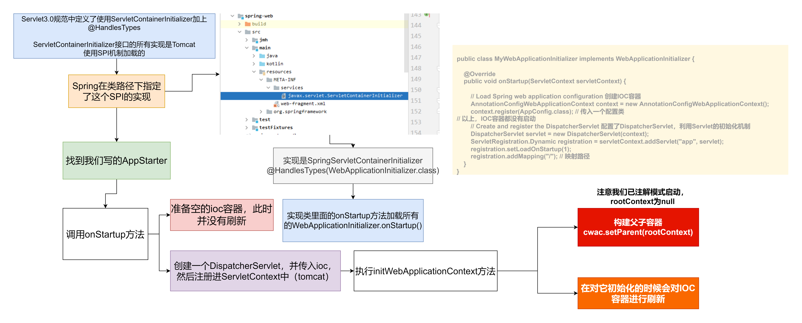

### 2.3 父子容器

我们以上述的代码启动我们的mvc项目，其中父容器为null。

而在我们以前的xml版本中：

1. 在web.xml中配置ContextLoaderListener，指定Spring配置文件的位置
2. 在web.xml中配置DispatcherServlet，指定SpringMVC配置文件位置。
3. 以上就会产生父子容器，其中父容器就是Spring配置文件进行包扫描并保存所有组件的容器；子容器就是SpringMVC配置文件进行包扫描并保存所有组件的容器。
4. 使用webloc.setParent(springIoc)。
4. 如果查找一个组件，先从子容器查找，找不到的话再去父容器查找，做到**容器隔离**


在Spring官方文档中，有以下描述：

1. **应用中可以包含多个IOC容器。**
2. **DispatcherServlet的创建的子容器主要包含Controller、view resolvers等和web相关的一些bean。**
3. **父容器root WebApplicationContex主要包含包含一些基础的bean，比如一些需要在多个servlet共享的dao、service等bean。**
4. **如果在子容器中找不到bean的时候可以去父容器查找bean。**

**作用：**一般而言，我们一个应用只需要一个DispatcherServlet，然后每个DispatcherServlet一般都会关联一个ApplicationContext。如果我们是商城业务，不同的模块如商品、订单、购物车等使用了不同的DispatcherServlet来处理请求，这就意味着一个应用里面有多个ApplicationContext，由于每个容器之间都是独立的，因此订单模块就无法直接使用商品模块和购物车模块中容器的服务来下单。虽然也可以将商品和购物车模块中的服务注册进我们的订单模块中，就可以解决这个问题，但是这样会导致多个容器中保存了多个相同类型的bean。于是就可以使用我们的父子容器，将这些公共的服务注册进相同的父容器中，这样每个子容器就都能使用到父容器中的公共bean。

在Spring官方文档中，使用非xml版方式指定父子容器代码如下所示：

```java
// 最快速的整合注解版SpringMVC和Spring的
public class QuickAppStarter extends AbstractAnnotationConfigDispatcherServletInitializer {
    @Override //根容器的配置（Spring的配置文件===Spring的配置类）
    protected Class<?>[] getRootConfigClasses() {
        return new Class<?>[]{SpringConfig.class}; // 父容器
    }

    @Override //web容器的配置（SpringMVC的配置文件===SpringMVC的配置类）
    protected Class<?>[] getServletConfigClasses() {
        return new Class<?>[]{SpringMVCConfig.class}; // 子容器
    }

    @Override //Servlet的映射，DispatcherServlet的映射路径
    protected String[] getServletMappings() {
        return new String[]{"/"};
    }

    @Override
    protected void customizeRegistration(ServletRegistration.Dynamic registration) {
        //		super.customizeRegistration(registration);
        //		registration.addMapping("");//
    }
}
```

注意重写customizeRegistration就可以对DispatcherServlet进行额外的配置，比如调用setLoadOnStartup来设置加载时的优先级，调用setInitParameter来初始化参数，调用setMultipartConfig来设置Servlet3.0的多路支持。

然后我们的SpringMVCConfig和SpringConfig如下代码所示：

```java
@ComponentScan(value = "top.noaharno.web",includeFilters = {
    @ComponentScan.Filter(type= FilterType.ANNOTATION,value = Controller.class)
},useDefaultFilters = false)
public class SpringMVCConfig {
    //子容器，扫描所有标注了@Controller的组件

}
```

```java
@ComponentScan(value = "top.noaharno.web",excludeFilters = {
    @ComponentScan.Filter(type= FilterType.ANNOTATION,value = Controller.class)
})
@Configuration
public class SpringConfig {
    //Spring的父容器，扫描除了@Controller标注之外的所有组件。

}
```

我们看**AbstractAnnotationConfigDispatcherServletInitializer**的继承树：

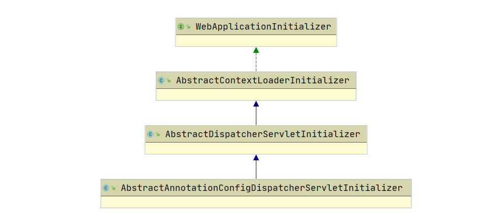

同样的，它也是实现了WebApplicationInitializer接口，因此在tomcat启动的时候，也会去调用它或者它的父类重写了的onStartup方法。由于AbstractAnnotationConfigDispatcherServletInitializer并没有去实现onStartup方法，而是它的父类AbstartDispatcherServletInitializer实现了该方法，因此会调用它：

```java
public void onStartup(ServletContext servletContext) throws ServletException {
    super.onStartup(servletContext); // 调用父类的startUp方法进行各种初始化
    registerDispatcherServlet(servletContext); // 注册DispatcherServlet
}
```

首先我们来看onStartup方法，它调用的是AbstractContextLoaderInitializer类中的onStartup方法，里面只有一条实现：

```java
@Override //注册ContextLoaderListener；contextInitialized
public void onStartup(ServletContext servletContext) throws ServletException {
    registerContextLoaderListener(servletContext);
}
```

看到这个名字就很熟悉了，就是我们在xml版的springmvc整合中配置的父容器，用来存放@Service之类的组件。

```java
protected void registerContextLoaderListener(ServletContext servletContext) {
    WebApplicationContext rootAppContext = createRootApplicationContext(); //创建一个根容器
    if (rootAppContext != null) {
        ContextLoaderListener listener = new ContextLoaderListener(rootAppContext);
        listener.setContextInitializers(getRootApplicationContextInitializers());
        servletContext.addListener(listener);
    }
    else {
        logger.debug("No ContextLoaderListener registered, as " +
                     "createRootApplicationContext() did not return an application context");
    }
}
```

我们会去创建一个根容器，然后将这个rootAppContext给放在一个ContextLoaderListener中，然后将其注册到ServletContext中。这个监听器的作用后续再说。

那么是怎么去创建我们的根容器的呢？

```java
@Override
@Nullable //重写了爷爷类的创建根容器方法
protected WebApplicationContext createRootApplicationContext() {
    Class<?>[] configClasses = getRootConfigClasses(); //获取根配置
    if (!ObjectUtils.isEmpty(configClasses)) {
        AnnotationConfigWebApplicationContext context = new AnnotationConfigWebApplicationContext();
        context.register(configClasses); //创建了一个IOC容器并把配置类注册进来
        return context;
    }
    else {
        return null;
    }
}
```

1. getRootConfigClasses方法是AbstractAnnotationConfigDispatcherServletInitializer留给子类的模板方法，然后我们的QuickAppStarter就实现了它， 也就是new Class<?>[]{SpringConfig.class};
2. 创建一个IOC容器，并且将我们第一步重写方法所返回的配置类给注册进去
3. 此时就完成了父容器的创建，但是还未初始化。

然后继续回到AbstartDispatcherServletInitializer类重写的onStartup方法，它调用了**registerDispatcherServlet(servletContext)**，该方法帮助我们注册了DispatcherServlet

```java
protected void registerDispatcherServlet(ServletContext servletContext) {
    String servletName = getServletName(); // 获取默认的名字，dispatcher
    Assert.hasLength(servletName, "getServletName() must not return null or empty");

    WebApplicationContext servletAppContext = createServletApplicationContext(); //创建Servlet容器
    Assert.notNull(servletAppContext, "createServletApplicationContext() must not return null");
	// 在这里创建我们的DispatcherServlet，并将上一步创建好的Servlet容器放进去，也就是我们的子容器
    FrameworkServlet dispatcherServlet = createDispatcherServlet(servletAppContext);
    Assert.notNull(dispatcherServlet, "createDispatcherServlet(WebApplicationContext) must not return null");
    dispatcherServlet.setContextInitializers(getServletApplicationContextInitializers());
    // 接下来的步骤和我们使用注解版的SpringMVC大差不差。
    ServletRegistration.Dynamic registration = servletContext.addServlet(servletName, dispatcherServlet);
    if (registration == null) {
        throw new IllegalStateException("Failed to register servlet with name '" + servletName + "'. " +
                                        "Check if there is another servlet registered under the same name.");
    }

    registration.setLoadOnStartup(1); // 设置加载优先级
    registration.addMapping(getServletMappings()); //根据我们指定的DispatcherServlet的路径进行注册
    registration.setAsyncSupported(isAsyncSupported());

    Filter[] filters = getServletFilters();
    if (!ObjectUtils.isEmpty(filters)) {
        for (Filter filter : filters) {
            registerServletFilter(servletContext, filter);
        }
    }
	// 同样是模板方法，留给我们在子类去实现这个，对DispatcherServlet进行额外的配置。
    customizeRegistration(registration);
}
```

1. 获取默认的名字
2. 创建我们的子容器
3. 创建DispatcherServlet，里面流程待会细说
4. 注册registerServletFilter
5. 模板方法customizeRegistration的执行。

首先我们来看我们的子容器的具体创建步骤：

```java
@Override
protected WebApplicationContext createServletApplicationContext() {
    AnnotationConfigWebApplicationContext context = new AnnotationConfigWebApplicationContext();
    Class<?>[] configClasses = getServletConfigClasses(); //获取web应用的配置
    if (!ObjectUtils.isEmpty(configClasses)) {
        context.register(configClasses);
    }
    return context;
}
```

和根容器的创建流程一致，创建好我们的IOC容器之后，然后执行子类重写的getServletConfigClasses获取配置类的Class数组，然后将其注册进我们的容器中。

⭐此时我们的两个容器都已经创建好了，然后当我们的web应用启动完成的时候，Tomcat出发监听器钩子启动根容器，这个时候就会去调用我们**ContextLoaderListener的contextInitialized方法**了。

```java
@Override
public void contextInitialized(ServletContextEvent event) { //根容器初始化
    initWebApplicationContext(event.getServletContext()); //初始化webioc容器,也就是我们的父容器
}
```

在**initWebApplicationContext()**方法中：

1. 调用**configureAndRefreshWebApplicationContext(cwac, servletContext);方法去初始化IOC容器，也就是我们的十二步刷新**
2. 调用**servletContext.setAttribute(WebApplicationContext.ROOT_WEB_APPLICATION_CONTEXT_ATTRIBUTE, this.context);**，将容器放到Servlet域中。

⭐**在Tomcat启动之后，tomcat会调用DispatcherServlet的初始化方法，**这个流程就是我们之前分析SpringMVC注解版的时候的具体流程了，也就是**设置父子容器，配置并刷新web容器**

至此，整个父子容器的形成过程源码部分分析完毕！两个容器已经准备和初始化完毕，并且形成了父子容器。

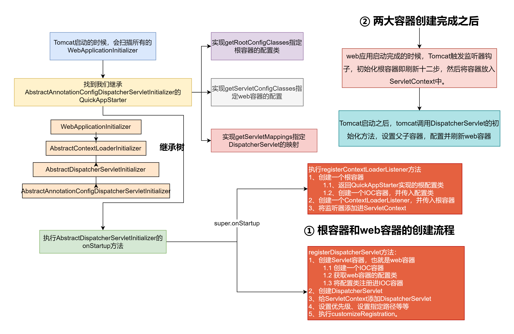

## 第三章 请求处理流程

### 3.1 DispatcherServlet中的九大组件

当Tomcat启动之后，会调用DispatcherServlet的init方法，在这个方法里面，它会去配置父子容器，并且去刷新子容器。然后就是常规的十二步，不过在十二大步中的最后一步：**finishRefresh中，它会去发布事件**

它首先会调用**publishEvent(new ContextRefreshedEvent(this))**，发布上下文环境刷新完成的时间，在这个方法里面：

1. 先将事件封装成PayloadApplicationEvent
2. 拿到多播器发送事件即可
3. 在发送过程中，利用观察者模式（for遍历），将符合event和type的所有ApplicationListener事件监听器拿来，然后挨个去执行他们的**onApplicationEvent**方法。
4. 我们处理DispatcherServlet的初始化完成事件，用到的是**SourceFIlteringListener**

在我们的SourceFIlteringListener的onApplicationEvent方法中，调用的是onApplicationEventInternal方法，最终重重调用，核心方法如下：

```java
// 来自FrameworkServlet类
public void onApplicationEvent(ContextRefreshedEvent event) {
    this.refreshEventReceived = true;
    synchronized (this.onRefreshMonitor) {
        onRefresh(event.getApplicationContext()); // 留给子类的模板方法
    }
}
```

在这里，它会调用DispatcherServlet的onRefresh方法：

```java
initStrategies(context); //初始化九大组件
```

正是这个方法，初始化了DispatcherServlet的九大组件。

总结来说：【九大组件何时初始化？】：**Tomcat启动，触发DispatcherServlet的初始化，当初始化全部结束的时候，容器会发送Spring的事件，然后SourceFilteringListener感知到了事件之后，将事件回调到DispatcherServlet的onRefresh方法，然后就去执行初始化九大组件的相关逻辑。**

```java
protected void initStrategies(ApplicationContext context) { //初始化所有策略，九大组件在这里进行了初始化
    initMultipartResolver(context); //容器中有就用，没有就是null
    initLocaleResolver(context); //从容器中获取，没有用默认
    initThemeResolver(context); //从容器中获取，没有用默认
    initHandlerMappings(context); //从容器中获取，没有用默认
    initHandlerAdapters(context); //从容器中获取，没有用默认
    initHandlerExceptionResolvers(context); //从容器中获取，没有用默认
    initRequestToViewNameTranslator(context); //Spring没有浓重说他，//从容器中获取，没有用默认
    initViewResolvers(context); //从容器中获取，没有用默认
    initFlashMapManager(context); //从容器中获取，没有用默认
}
```

这九大组件的初始化流程其实都差不多，除了**MultipartResolver是容器中有就用，没有就是null（需要我们自己导入相关包并进行配置），其余的八个都是从容器中获取，没有就用默认值**。我们以MultipartResolver和LocaleResolver为例子进行讲解：

**MultipartResolver：**

```java
private void initMultipartResolver(ApplicationContext context) {
    try {
        // 从容器中尝试去获得beanName为multipartResolver，类型为MultipartResolver的组件
        /*
        首先查找自己，发现自己没有multipartResolver，然后去父容器去查找，也就是我们的根容器
        查过过程中发现没有beanName为multipartResolver的beanDefinition
        抛出NoSuchBeanDefinitionException
        */
        this.multipartResolver = context.getBean(MULTIPART_RESOLVER_BEAN_NAME, MultipartResolver.class);
        if (logger.isTraceEnabled()) {
            logger.trace("Detected " + this.multipartResolver);
        }
        else if (logger.isDebugEnabled()) {
            logger.debug("Detected " + this.multipartResolver.getClass().getSimpleName());
        }
    }
    catch (NoSuchBeanDefinitionException ex) {
        // 捕获到异常，设置multipartResolver为null
        // Default is no multipart resolver.
        this.multipartResolver = null;
        if (logger.isTraceEnabled()) {
            logger.trace("No MultipartResolver '" + MULTIPART_RESOLVER_BEAN_NAME + "' declared");
        }
    }
}
```

**LocaleResolver：**

```java
private void initLocaleResolver(ApplicationContext context) {
    try { //容器中先来获取
        this.localeResolver = context.getBean(LOCALE_RESOLVER_BEAN_NAME, LocaleResolver.class);
        if (logger.isTraceEnabled()) {
            logger.trace("Detected " + this.localeResolver);
        }
        else if (logger.isDebugEnabled()) {
            logger.debug("Detected " + this.localeResolver.getClass().getSimpleName());
        }
    }
    catch (NoSuchBeanDefinitionException ex) {
        // We need to use the default. 容器中没有，读取默认配置文件进行加载
        this.localeResolver = getDefaultStrategy(context, LocaleResolver.class); //获取默认策略
        if (logger.isTraceEnabled()) {
            logger.trace("No LocaleResolver '" + LOCALE_RESOLVER_BEAN_NAME +
                         "': using default [" + this.localeResolver.getClass().getSimpleName() + "]");
        }
    }
}
```

大致流程也是先去容器中获取，如果找不到就会抛出异常。该方法捕获到异常之后，就去读取默认配置文件进行加载，它会去DispatcherServlet所在的类路径下去找一个**DispatcherServlet.properties**资源，里面定义了我们其余八大组件的初始化组件。

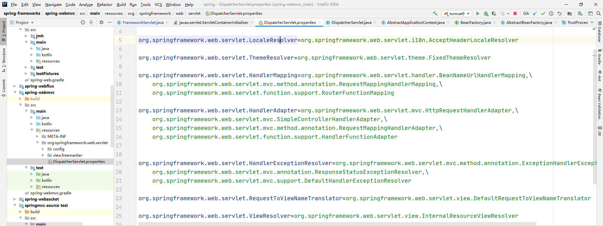

最终我们的所有的组件，然后挨个去执行createBean方法，将他们创建在容器中。

**如果实现了InitializingBean接口，还会在初始化完成之后，执行他们的afterPropertiesSet方法。**

⭐**RequestMappingHandlerAdapter实现了InitializingBean接口，因此我们在初始化对象完毕之后调用方法afterPropertiesSet()：**

```java
@Override
public void afterPropertiesSet() { //初始化以后
    // Do this first, it may add ResponseBody advice beans
    initControllerAdviceCache();  //初始化 ControllerAdvice 【异常处理相关的功能】

    if (this.argumentResolvers == null) {  //拿到底层所有的 argumentResolvers 参数解析器
        List<HandlerMethodArgumentResolver> resolvers = getDefaultArgumentResolvers();
        this.argumentResolvers = new HandlerMethodArgumentResolverComposite().addResolvers(resolvers); 
        //把这些resolver统一组合到一个对象里面，方便管控
    }
    if (this.initBinderArgumentResolvers == null) { // 
        List<HandlerMethodArgumentResolver> resolvers = getDefaultInitBinderArgumentResolvers();
        this.initBinderArgumentResolvers = new HandlerMethodArgumentResolverComposite().addResolvers(resolvers);
    }
    if (this.returnValueHandlers == null) { // 拿到所有的返回值处理器，并保存起来。
        List<HandlerMethodReturnValueHandler> handlers = getDefaultReturnValueHandlers();
        this.returnValueHandlers = new HandlerMethodReturnValueHandlerComposite().addHandlers(handlers);
    }
}
```

**它会先初始化了ControllerAdvice相关功能，然后准备所有的参数解析器和返回值处理器并放到各自的组合对象中保存起来。**

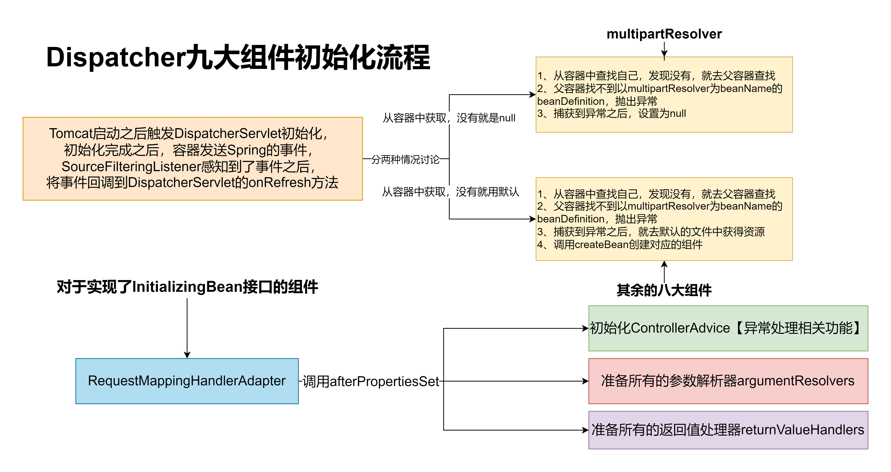

### 3.2 SpringMVC运行流程

我们明白了DispatcherServlet的九大组件之后，接下来开始解析浏览器发送一个请求，MVC是怎么处理它的？也就是SpringMVC的运行流程。

我们首先知道，所有的请求都会交给我们的DispatcherServlet，然后执行它的**doDispatch**方法，这是SpringMVC处理请求的核心功能。

当然，MVC是如何调用doDispatch方法的呢？首先根据Servlet规范，Servlet在执行的时候会去执行service方法，然后我们的FrameworkServlet重写了这个方法，它会执行`super.service(request, response)`，进而执行HttpServlet重写的service方法，在该方法中，它会去判断当前请求的类型，比如GET、POST、PUT、DELETE等等，然后根据该请求的类型去执行相应的方法，这里我们执行的是get请求，因此会去执行doGet方法，我们的FrameworkServlet又重写了这个Servlet，最终层层调用之后，来到了**DispatcheServlet.doService()方法上**。

在该方法中：

1. 首先判断该request是否是includeRequest，即判断该request是否包含属性javax.servlet.include.request_uri。如果包含，就会将request域中指定的属性给提前保存，也就是快照指定属性【暂不具体分析】
2. 然后它会将基本的属性保存到request域中，方便处理，比如我们的**web容器、国际化解析器、主题解析器**等等。
3. 如果我们的flashMapManager（闪存管理器，重定向携带数据）不为空，就给request设置一些属性。
4. **重点执行doDispatch方法，处理派发功能**

#### 1. 总览

先说一说该方法的大致流程：

```java
protected void doDispatch(HttpServletRequest request, HttpServletResponse response) throws Exception {
    HttpServletRequest processedRequest = request;
    HandlerExecutionChain mappedHandler = null; // handler（目标方法）的执行链
    boolean multipartRequestParsed = false; // 文件上传标志
    //对异步请求的支持（Servlet3.0以后才有的，Webflux）
    WebAsyncManager asyncManager = WebAsyncUtils.getAsyncManager(request);

    try {
        ModelAndView mv = null;
        Exception dispatchException = null;

        try {
            processedRequest = checkMultipart(request); //检查当前是否文件上传请求
            multipartRequestParsed = (processedRequest != request); // 该标志位方法末尾有用

            // 构造出了【目标方法+拦截器整个链路】决定使用哪个Handler处理当前请求 
            // Determine handler for the current request.
            mappedHandler = getHandler(processedRequest);
            if (mappedHandler == null) {  // 如果找不到人处理，就send 404
                noHandlerFound(processedRequest, response);
                return;
            }

            //适配器怎么找的、 Determine handler adapter for the current request.
            HandlerAdapter ha = getHandlerAdapter(mappedHandler.getHandler());

            // Process last-modified header, if supported by the handler.
            String method = request.getMethod();
            boolean isGet = "GET".equals(method);
            if (isGet || "HEAD".equals(method)) {
                long lastModified = ha.getLastModified(request, mappedHandler.getHandler());
                if (new ServletWebRequest(request, response).checkNotModified(lastModified) && isGet) {
                    return;
                }
            }
            //所有拦截器的 preHandle 执行
            if (!mappedHandler.applyPreHandle(processedRequest, response)) {
                return; //使用 mappedHandler整个链
            }

            //真正来执行目标方法 Actually invoke the handler.（反射执行目标方法、确定参数值，处理返回值【封装成ModelAndView】）
            mv = ha.handle(processedRequest, response, mappedHandler.getHandler());

            if (asyncManager.isConcurrentHandlingStarted()) {
                return;
            }
			// 如果mv中的view为null，就给它默认的视图名字
            applyDefaultViewName(processedRequest, mv);
            mappedHandler.applyPostHandle(processedRequest, response, mv); //所有拦截器的postHandle
        }
        catch (Exception ex) {
            dispatchException = ex;
        }
        catch (Throwable err) {
            // As of 4.3, we're processing Errors thrown from handler methods as well,
            // making them available for @ExceptionHandler methods and other scenarios.
            dispatchException = new NestedServletException("Handler dispatch failed", err);
        } //处理结果
        processDispatchResult(processedRequest, response, mappedHandler, mv, dispatchException);
    }
    catch (Exception ex) {  //下面的即使执行完，异常还是抛出去
        triggerAfterCompletion(processedRequest, response, mappedHandler, ex);
    }
    catch (Throwable err) {
        triggerAfterCompletion(processedRequest, response, mappedHandler,
                               new NestedServletException("Handler processing failed", err));
    }
    finally {
        if (asyncManager.isConcurrentHandlingStarted()) {
            // Instead of postHandle and afterCompletion
            if (mappedHandler != null) {
                mappedHandler.applyAfterConcurrentHandlingStarted(processedRequest, response);
            }
        }
        else {
            // Clean up any resources used by a multipart request.
            if (multipartRequestParsed) { // 如果是文件处理请求，就进行此操作
                cleanupMultipart(processedRequest);
            }
        }
    }
}
```

**大致流程：**

1. 检查当前请求是否是文件上传请求【使用multipartResolver.isMultipart来判断是否是文件上传请求】
2. 调用**getHandler(processedRequest)**构造出【目标方法+拦截器】的整个链路，在内部还会决定用哪个Handler处理当前请求
3. 如果构造不出链路，即找不到Handler处理该请求，就**sendError 404**
4. 然后找到哪个**HandlerAdapter**适配器能解析这个请求
5. 执行所有的拦截器的**preHandle**
6. 调用**ha.handle**真正来执行目标方法【反射执行目标方法、确定参数值、处理返回值【封装成ModelAndView】
7. 如果没有指定跳转的页面，就给一个默认的页面：**applyDefaultViewName**
8. 执行所有拦截器的**postHandle**
9. **processDispatchResult**处理结果，将我的MV转换成真正的View对象进行渲染
10. 进行完渲染之后，执行所有拦截器的**afterCompletion**方法
11. 最后如果是文件上传请求，就**cleanupMultipart(processedRequest);**

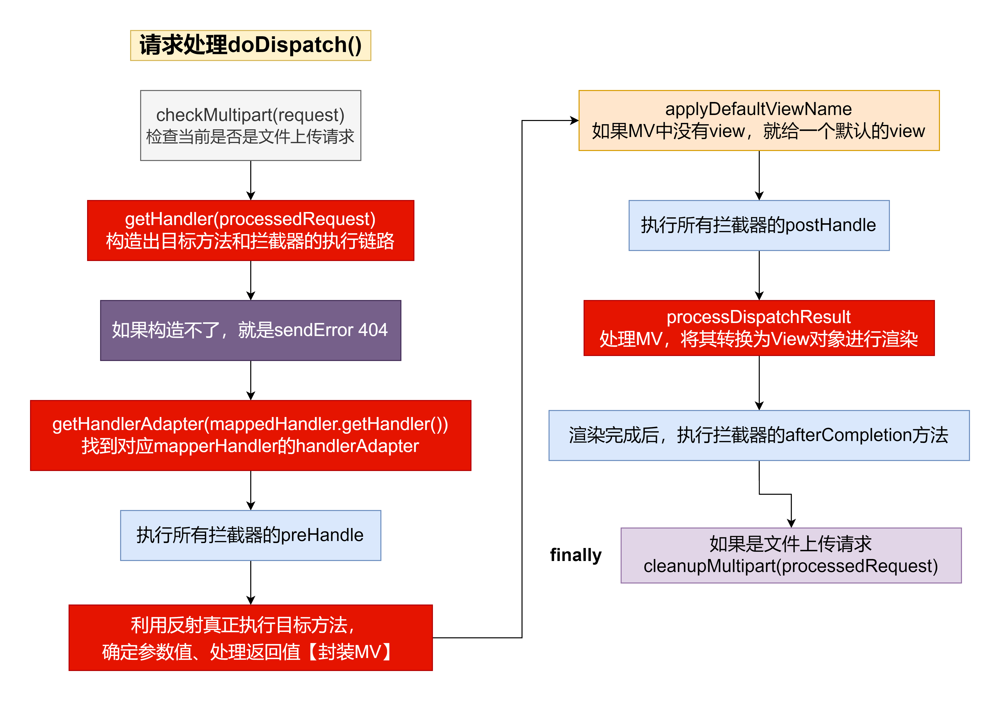

#### 2. 构造HandlerExecutionChain

我们会调用**getHandler**方法来构造目标方法+拦截器的整个链路，接下来来看具体流程：

1、**首先拿到容器中所有的HandlerMapping，然后挨个判断哪个HandlerMapping能处理当前请求，这里我们是使用的RequestMappingHandlerMapping。**

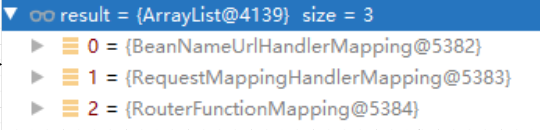

2、**利用HandlerMapping的registry去寻找映射，返回HandlerMethod，这是真正执行当前请求的方法**

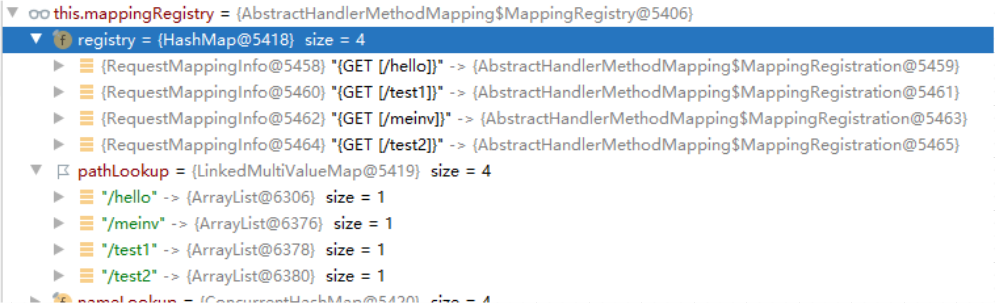

3、**将系统中所有的拦截器都拿来，然后和HandlerMethod一起封装成HandlerExecutionChain，并返回出去。**

**那么RequestMappingHandlerMapping中的registry是从哪里来的呢？**

和我们3.1章节说的一样，RequestMappingHandlerMapping在初始化的时候执行了afterPropertiesSet方法，而在这里面就进行了registry的设置，他会找到所有标注了@Controller注解的组件，然后探索组件内所有标注了@RequestMapping注解的方法，最后将其进行封装并添加进mappingRegistry的registry中。

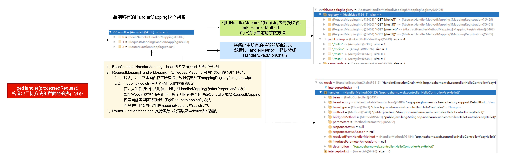

#### 3. 获取HandlerAdapter

拿到所有的HandlerAdapter，然后挨个遍历，看当前HandlerAdapter是否支持当前的HandlerMapping。

```java
protected HandlerAdapter getHandlerAdapter(Object handler) throws ServletException {
    if (this.handlerAdapters != null) { //拿到默认的所有适配器
        for (HandlerAdapter adapter : this.handlerAdapters) {
            if (adapter.supports(handler)) {
                return adapter;
            }
        }
    }
    throw new ServletException("No adapter for handler [" + handler +
                               "]: The DispatcherServlet configuration needs to include a HandlerAdapter that supports this handler");
}
```

#### 4. 利用反射真正执行目标方法

使用上述流程获得的HandlerAdapter去真正执行目标方法。

```java
@Nullable
protected ModelAndView invokeHandlerMethod(HttpServletRequest request,
                                           HttpServletResponse response, HandlerMethod handlerMethod) throws Exception {
    //把原生的request，response封装到一个对象中方便后续只用这一个参数就行【装饰器模式】
    ServletWebRequest webRequest = new ServletWebRequest(request, response);
    try { //数据绑定器，比如我们在注册的时候，需要将用户密码封装成一个Person类，
        //比如：  请求数据到自定义Object属性的映射需要用到
        WebDataBinderFactory binderFactory = getDataBinderFactory(handlerMethod);
        //获取到模型工厂 Model（要交给页面的数据） View（我们要去的 视图）
        ModelFactory modelFactory = getModelFactory(handlerMethod, binderFactory);
        // 封装handlerMethod，并进行了增强【装饰器模式】，提供handlerMethod里面信息的快速获取
        ServletInvocableHandlerMethod invocableMethod = createInvocableHandlerMethod(handlerMethod);
        if (this.argumentResolvers != null) { //【重要】参数解析器：未来用来反射解析目标方法中每一个参数的值
            invocableMethod.setHandlerMethodArgumentResolvers(this.argumentResolvers);
        }
        if (this.returnValueHandlers != null) { //【重要】返回值解析器：未来用来处理目标方法执行后的返回值，无论目标方法返回什么得想办法变成适配器能用的ModelAndView
            invocableMethod.setHandlerMethodReturnValueHandlers(this.returnValueHandlers);
        }
        invocableMethod.setDataBinderFactory(binderFactory);
        invocableMethod.setParameterNameDiscoverer(this.parameterNameDiscoverer);
        //以上的 几个核心组件都挺重要的  ModelAndViewContainer以后流程共享ModelAndView数据的临时存储容器
        ModelAndViewContainer mavContainer = new ModelAndViewContainer();
        mavContainer.addAllAttributes(RequestContextUtils.getInputFlashMap(request));
        modelFactory.initModel(webRequest, mavContainer, invocableMethod);
        mavContainer.setIgnoreDefaultModelOnRedirect(this.ignoreDefaultModelOnRedirect);
        //异步请求有关的
        AsyncWebRequest asyncWebRequest = WebAsyncUtils.createAsyncWebRequest(request, response);
        asyncWebRequest.setTimeout(this.asyncRequestTimeout);

        WebAsyncManager asyncManager = WebAsyncUtils.getAsyncManager(request);
        asyncManager.setTaskExecutor(this.taskExecutor);
        asyncManager.setAsyncWebRequest(asyncWebRequest);
        asyncManager.registerCallableInterceptors(this.callableInterceptors);
        asyncManager.registerDeferredResultInterceptors(this.deferredResultInterceptors);

        if (asyncManager.hasConcurrentResult()) {
            Object result = asyncManager.getConcurrentResult();
            mavContainer = (ModelAndViewContainer) asyncManager.getConcurrentResultContext()[0];
            asyncManager.clearConcurrentResult();
            LogFormatUtils.traceDebug(logger, traceOn -> {
                String formatted = LogFormatUtils.formatValue(result, !traceOn);
                return "Resume with async result [" + formatted + "]";
            });
            invocableMethod = invocableMethod.wrapConcurrentResult(result);
        }
        //真正开始执行目标方法
        invocableMethod.invokeAndHandle(webRequest, mavContainer);
        if (asyncManager.isConcurrentHandlingStarted()) {
            return null;
        }

        return getModelAndView(mavContainer, modelFactory, webRequest);
    }
    finally {
        webRequest.requestCompleted();
    }
}
```

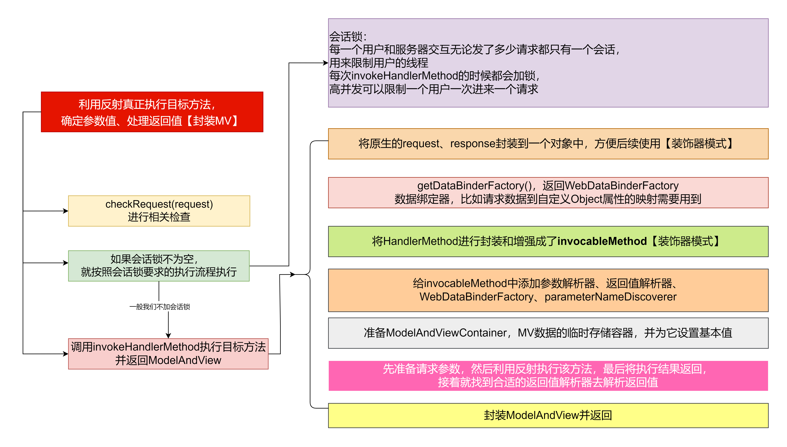

#### 5. 处理ModelAndView

首先如果有异常，就会去处理异常

```java
private void processDispatchResult(HttpServletRequest request, HttpServletResponse response,
                                   @Nullable HandlerExecutionChain mappedHandler, @Nullable ModelAndView mv,
                                   @Nullable Exception exception) throws Exception {

    boolean errorView = false;
    //如果有异常处理异常，以下if内全是异常处理环节
    if (exception != null) {
        if (exception instanceof ModelAndViewDefiningException) {
            logger.debug("ModelAndViewDefiningException encountered", exception);
            mv = ((ModelAndViewDefiningException) exception).getModelAndView();
        }
        else {  //定义无数种异常解析器就会得到不同的异常解析效果
            Object handler = (mappedHandler != null ? mappedHandler.getHandler() : null);
            mv = processHandlerException(request, response, handler, exception); //处理异常，所有的异常解析器都不能干活，这个异常就抛出去了
            errorView = (mv != null);
        }
    }
    //上面所有的异常解析器都没能处理这个异常，下面直接炸....
    // 动态策略。 Did the handler return a view to render?   为啥？@ResponseBody（提前在解析返回值的时候，就已经把数据写出去了，所以这一步就没有了）
    if (mv != null && !mv.wasCleared()) {
        render(mv, request, response); //渲染ModeAndView，来解析模型和视图；最终决定响应效果
        if (errorView) {
            WebUtils.clearErrorRequestAttributes(request);
        }
    } else
	......
}
```

**调用render方法渲染视图**

```java
protected void render(ModelAndView mv, HttpServletRequest request, HttpServletResponse response) throws Exception {
    // Determine locale for request and apply it to the response.
    Locale locale =
        (this.localeResolver != null ? this.localeResolver.resolveLocale(request) : request.getLocale());
    response.setLocale(locale);
    //默认AcceptHeaderLocaleResolver会根据请求头中的Accept-Language字段决定浏览器能接受哪种中文/英文 页面
    View view; //视图
    String viewName = mv.getViewName(); //适配器执行完目标方法以后返回的ModelAndView对象里面有  index.jsp
    // 但是此时只是知道了视图名称，还不是真正能用的View对象，这时候就需要下面的方法将其转为真正能够使用的View对象
    if (viewName != null) {
        //************ 把目标方法的返回值字符串index.jsp 真正转为能用的View对象； We need to resolve the view name.
        view = resolveViewName(viewName, mv.getModelInternal(), locale, request);
        ......
}
```

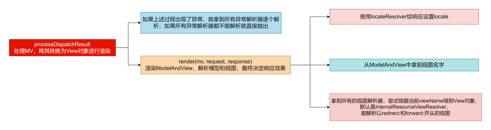

#### 6. 总结


## 第四章 @EnableMvc注解原理【存疑，待做】


