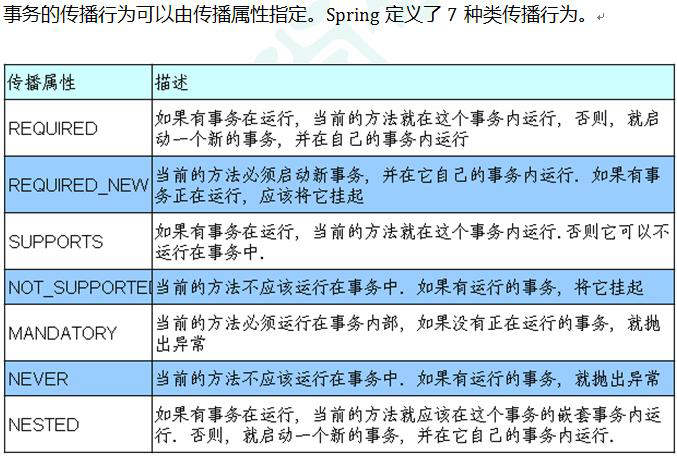

# 第一章 IOC容器

## 1.1 IOC概念和原理

1. 控制反转，把对象创建和对象之间的调用过程交给Spring进行管理
2. 降低耦合度
3. 底层原理：XML解析、工厂模式、反射

IOC过程：

```java
// 第一步 xml配置文件，配置创建的对象
<bean id="dao" class="com.dlf.UserDao"></bean>

// 第二步 有service类和dao类，创建工厂类
    class UserFactory {
        public static UserDao getDao() {
            String classValue = class属性值; // xml解析得到
            Class clazz = Class.forName(classValue); // 通过反射创建对象
            return (UserDao)clazz.newInstance();
        }
    }
```

IOC基于IOC容器完成，IOC容器底层就是对象工厂

Spring提供IOC容器实现两种方式：

1. BeanFactory：IOC容器基本实现，是Spring内部的使用接口，不提供开发人员进行使用，加载配置文件时候不会创建对象，再获取对象（使用）才会创建对象
2. ApplicationContext：BeanFactory接口得到子接口，提供更多更强大的功能，一般由开发人员进行使用，加载配置文件时候就会把再配置文件中的对象进行创建

## 1.2 bean管理（XML）

Spring创建对象、Spring注入属性

1. 在spring配置文件中，使用bean标签，标签里面添加对应属性，就可以实现对象的创建
2. 在bean标签有很多属性，常用的有id：唯一标识；class：类全路径
3. 创建对象的时候默认使用无参构造器进行创建

```java
public class Book {
    private String bname;
    private String bauthor;
    public void setBname(String bname) { this.bname = bname; }
    public void setBauthor(String bauthor) { this.bauthor = bauthor; }
}
```

1、使用set方法进行注入

```xml
<bean id="book" class="com.atguigu.spring5.Book"> 
    <!--使用property完成属性注入 name：类里面属性名称 value：向属性注入的值 --> 
    <property name="bname" value="易筋经"></property> 
    <property name="bauthor" value="达摩老祖"></property>
</bean>
```

2、使用有参构造函数进行注入，注意实体类必须有对应的构造方法

```xml
<bean id="orders" class="com.atguigu.spring5.Orders">
    <constructor-arg name="oname" value="电脑"></constructor-arg>
    <constructor-arg name="address" value="China"></constructor-arg> 
</bean>
```

3、注入null值或者属性值中包含特殊符号的属性

```xml
<!--null值--> 
<property name="address"> 
    <null/> 
</property>
<!--属性值包含特殊符号 1 把<>进行转义 &lt; &gt; 2 把带特殊符号内容写到CDATA -->
<property name="address"> 
    <value><![CDATA[<<南京>>]]></value> 
</property>
```

4、将外部bean注入到属性中

```xml
<!--1 service和dao对象创建-->
<bean id="userService" class="com.atguigu.spring5.service.UserService"> 
    <!--注入userDao对象 name属性：类里面属性名称 ref属性：创建userDao对象bean标签id值 --> 
    <property name="userDao" ref="userDaoImpl"></property>
</bean> 
<bean id="userDaoImpl" class="com.atguigu.spring5.dao.UserDaoImpl"></bean>
```

5、注入内部bean

```xml
<!--内部bean--> 
<bean id="emp" class="com.atguigu.spring5.bean.Emp"> 
    <!--设置两个普通属性--> 
    <property name="ename" value="lucy"></property> 
    <property name="gender" value="女"></property> 
    <!--设置对象类型属性--> 
    <property name="dept"> 
        <bean id="dept" class="com.atguigu.spring5.bean.Dept"> 
            <property name="dname" value="安保部"></property> 
        </bean> 
    </property> 
</bean>
```

6、修改外部bean的注入，但是需要开启dept的get方法

```xml
<!--级联赋值--> 
<bean id="emp" class="com.atguigu.spring5.bean.Emp">
    <!--设置两个普通属性--> 
    <property name="ename" value="lucy"></property>
    <property name="gender" value="女"></property> 
    <!--级联赋值--> 
    <property name="dept" ref="dept"></property>
    <property name="dept.dname" value="技术部"></property> 
</bean> 
<bean id="dept" class="com.atguigu.spring5.bean.Dept"> 
    <property name="dname" value="财务部"></property>
</bean>
```

7、注入集合

```xml
<!--1 集合类型属性注入-->
<bean id="stu" class="com.atguigu.spring5.collectiontype.Stu"> 
    <!--数组类型属性注入--> 
    <property name="courses"> 
        <array> 
            <value>java课程</value> 
            <value>数据库课程</value>
        </array> 
    </property> 
    <!--list类型属性注入--> 
    <property name="list"> 
        <list>
			<value>张三</value> 
            <value>小三</value> 
        </list> 
    </property> 
    <!--map类型属性注入--> 
    <property name="maps"> 
        <map> 
            <entry key="JAVA" value="java"></entry>
            <entry key="PHP" value="php"></entry>
        </map> 
    </property> 
    <!--set类型属性注入-->
    <property name="sets"> 
        <set> 
            <value>MySQL</value>
            <value>Redis</value>
        </set> 
    </property> 
</bean>
```

8、使用util标签完成list集合注入提取

```xml
<!--1 提取list集合类型属性注入--> 
<util:list id="bookList">
    <value>易筋经</value> 
    <value>九阴真经</value> 
    <value>九阳神功</value> 
</util:list> 
<!--2 提取list集合类型属性注入使用--> 
<bean id="book" class="com.atguigu.spring5.collectiontype.Book"> 
    <property name="list" ref="bookList"></property>
</bean>
```

## 1.3 FactoryBean

1. Spring有两种类型bean：普通bean和工厂bean（FactoryBean）
2. 普通bean：在配置文件中定义bean类型就是返回类型
3. 工厂bean：在配置文件定义bean类型可以和返回类型不一样

```java
public class MyBean implements FactoryBean<Course> { //定义返回bean 
    @Override 
    public Course getObject() throws Exception { 
        Course course = new Course(); 
        course.setCname("abc"); 
        return course; 
    } 
    @Override 
    public Class<?> getObjectType() { 
        return null; 
    } 
    @Override 
    public boolean isSingleton() { 
        return false; 
    } 
}
```

`<bean id="myBean" class="com.atguigu.spring5.factorybean.MyBean"> </bean>`

直接通过获取myBean就能获取Course对象

## 1.4 bean作用域和生命周期

默认是单实例对象，在bean标签里面有scope用于设置单实例还是多实例：prototype表示多实例对象

单实例的时候，加载spring配置文件时候就会创建单实例对象

多实例的时候，在调用getBean方法的时候创建多实例对象

bean的生命周期就是从对象创建到对象销毁的过程

```java
public class Orders {
    //无参数构造 
    public Orders() { 
        System.out.println("第一步 执行无参数构造创建 bean 实例");
    } 
    private String oname; 
    public void setOname(String oname) { 
        this.oname = oname; 
        System.out.println("第二步 调用 set 方法设置属性值"); 
    } 
    //创建执行的初始化的方法 
    public void initMethod() { 
        System.out.println("第三步 执行初始化的方法"); 
    } 
    //创建执行的销毁的方法 
    public void destroyMethod() { 
        System.out.println("第五步 执行销毁的方法"); 
    } 
}
```

```xml
<bean id="orders" class="com.atguigu.spring5.bean.Orders" init-
method="initMethod" destroy-method="destroyMethod">
    <property name="oname" value="手机"></property>
</bean>
```

Bean的后置处理器，bean生命周期有七步

1. 通过构造器创建bean实例（无参构造）
2. 为bean的属性设置值和对其他bean引用（set方法）
3. 把bean实例传递bean后置处理器的方法postProcessBeforeInitialization
4. 调用bean的初始化的方法（需要进行配置初始化的方法）
5. 把bean实例传递bean后置处理器的方法postProcessAfterInitialization
6. bean可以使用了
7. 当容器关闭的时候调用bean的销毁的方法（需要配置销毁的方法）

```java
public class MyBeanPost implements BeanPostProcessor {
    @Override 
    public Object postProcessBeforeInitialization(Object bean, String beanName) throws 
        BeansException { 
        System.out.println("在初始化之前执行的方法"); 
        return bean; 
    } 
    @Override 
    public Object postProcessAfterInitialization(Object bean, String beanName) throws 
        BeansException { 
        System.out.println("在初始化之后执行的方法"); 
        return bean; 
    } 
}
```

```xml
<!--配置后置处理器 应该是对该配置文件里的所有bean都适用--> 
<bean id="myBeanPost" class="com.atguigu.spring5.bean.MyBeanPost"></bean>
```

## 1.5 xml自动装配

概念：根据指定装配规则（属性名称或者属性类型），Spring自动将匹配的属性值进行注入

bean标签属性autowire，用来配置自动装配

byName：根据属性名称注入，注入值bean的id值和类属性名称一样

byType：根据属性类型注入

## 1.6 基于注解方式

```xml
<!--开启组件扫描 
 1 如果扫描多个包，多个包使用逗号隔开 
 2 扫描包上层目录 
--> 
<context:component-scan base-package="com.atguigu"></context:component-scan>
```

在注解里面value属性值可以省略不写，默认值是类名称，但是首字母得小写

```xml
<!--示例 1 
    use-default-filters="false" 表示现在不使用默认filter，自己配置 filter 
    context:include-filter ，设置扫描哪些内容 
--> 
<context:component-scan base-package="com.atguigu" use-default- filters="false"> 
    <context:include-filter type="annotation" 
                            expression="org.springframework.stereotype.Controller"/> 
</context:component-scan> 

<!--示例 2 
    下面配置扫描包所有内容 
    context:exclude-filter： 设置哪些内容不进行扫描 
--> 
<context:component-scan base-package="com.atguigu"> 
    <context:exclude-filter type="annotation" 
                            expression="org.springframework.stereotype.Controller"/> 
</context:component-scan> 
```

@Autowired：根据属性类型进行自动装配

@Qualifier：根据名称进行注入，要和@Autowired一起使用

@Resource：根据类型注入或名称注入

```java
// @Resource 根据类型进行注入
@Resource(name = "userDaoImpl1") // 根据名称进行注入
private UserDao userDao;
```

@Value：注入普通类型属性

# 第二章 AOP

## 2.1 概念

1、面向切面编程（方面），利用AOP可以对业务逻辑的各个部分进行隔离，从而使得业务逻辑各部分之间的耦合度降低，提高程序的可重用性，同时提高了开发的效率

2、通俗描述：不通过修改源代码的方法在主干功能里面添加新功能

## 2.2 底层原理

AOP底层使用动态代理，有接口的情况下使用JDK动态代理；没有接口的情况下，使用CGLIB动态代理

### 2.2.1 JDK动态代理

使用Proxy类里面的方法创建代理对象

```java
public interface UserDao {
    public int add(int a, int b);
}

public class UserDaoImpl implements UserDao {
    public int add(int a, int b) {
        return a + b;
    }
}

// 创建代理对象代码
class UserDaoProxy implements InvocationHandler {
    // 创建的是谁的代理对象，把谁传递过来
    // 有参构造传递
    private Object obj;
    public UserDaoProxy(Object obj) { this.obj = obj; }
    // 增强的逻辑
    public Object invoke(Object proxy, Method method, Object[] args) throws Throwable {
        System.out.println("方法之前执行.." + method.getName() + "传递的参数：" + Arrays.toString(args));
        Object res = method.invoke(obj, args);
        System.out.println("方法之后执行.." + obj);
        return res;
    }
}

public class JDKProxy {
    public static void main(String[] args) {
        UserDao dao = (UserDao)Proxy.newProxyInstance(JDKProxy.class.getClassLoader(),
                                                      {UserDao.class},
                                                     new UserDaoProxy(new UserDaoImpl()));
        int result = dao.add(1, 2);
        System.out.println("result : " + result);
    }
}
```

## 2.3 术语

1、连接点：类里面哪些方法可以被增强，这些方法被称为连接点

2、切入点：实际被真正增强的方法

3、通知（增强）：实际增强的逻辑部分称为通知，通知的类型：前置通知、后置通知、环绕通知、异常通知、最终通知

4、切面：把通知应用到切入点的过程

## 2.4 操作

Spring框架一般都是基于AspectJ实现AOP操作,AspectJ不是Spring组成部分，独立AOP框架，一般把AspectJ和Spring框架一起使用进行AOP操作

### 2.4.1 切入点表达式

作用：知道对哪个类里面的哪个方法进行增强

语法结构：`execution([权限修饰符][返回类型][类全路径][方法名称]([参数列表]))`

```
1、对com.dao.BookDao里面的add方法进行增强
execution(* com.dao.BookDao.add(..))

2、对com.dao.BookDao里面的所有方法进行增强
execution(* com.dao.BookDao.*(..))

3、对com.dao包里面的所有类的所有方法进行增强
execution(* com.dao.*.*(..))
```

### 2.4.2 AspectJ注解

1、创建类，在类里面定义方法

```java
public class User{
	public void add(){
		System.out.println("add....");
	}
}
```

2、创建增强类（编写增强逻辑）

```java
public class UserProxy{
	public void before(){
		System.out.println("before....");
	}
}
```

3、进行通知的配置

3.1、在spring配置文件中开启注解扫描

```xml
<context:component-scan base-package="com.atguigu.spring5.aopanno"></context:component-scan>
```

3.2、使用注解创建User和UserProxy对象

```java
@Component
public class User{

@Component
public class UserProxy{
```

3.3、在增强类上面添加注解@Aspect来生成代理对象

```java
@Component
@Aspect
public class UserProxy
```

3.4、在spring配置文件中开启生成代理对象

```xml
<aop:aspectj-autoproxy></aop:aspectj-autoproxy>
```

4、配置通知

```java
@Component
@Aspect
public class UserProxy{
	@Before(value="execution(* com.atguigu.spring5.aopanno.User.add(..))")
	public void before(){
		System.out.println("before.....");	
	}
}
```

5、相同切入点的抽取

```java
//相同切入点抽取 
@Pointcut(value = "execution(* com.atguigu.spring5.aopanno.User.add(..))")
public void pointdemo() {
} 
//前置通知 
//@Before 注解表示作为前置通知 
@Before(value = "pointdemo()") 
public void before() { 
    System.out.println("before.........");
} 
```

如果有多个增强类对同一个方法进行增强，设置增强类优先级：在增强类上面添加注解@Order(数字类型值)，数字类型值越小优先级越高

### 2.4.3 完全注解开发

```java
@Configuration
@ComponentScan(basePackages={"com.atguigu"})
@EnableAspectJAutoProxy(proxyTargetClass=true)
public class ConfigAop{

}
```

# 第三章 JdbcTemplate

不重要，省略

# 第四章 事务管理

Spring事务管理有两种：编程式事务管理和声明式事务管理（使用），而且选用注解方式，底层用的是AOP原理

开启事务注解：

```xml
<tx:annotation-driven transaction-manager="transactionManager"></tx:annotation-driven>
```

使用注解@Transactional进行事务管理，如果添加在类上，类里面所有的方法都添加事务；添加到方法上，只有该方法添加事务

七种事务传播行为



使用举例：`@Transactional(propagation = Propagation.REQUIRED)`

事务的隔离级别 ioslation 


`@Transactional(propagation = Propagation.REQUIRED, isolation = Isolation.REPEATABLE_READ)`

timeout：超时时间；事务需要在一定时间内进行提交，如果不提交进行回滚，默认值是-1，以秒为单位

readOnly：是否只读；默认为false，表示可以增删改查，设置为true后就只能查询

rollbackFor：回滚；设置出现哪些异常进行事务回滚

noRollbackFor：不回滚；设置出现哪些异常不进行事务回滚

# 第五章 响应式编程

