# 第一章 SpringBoot2入门

## 1.1 设置maven

```xml
<mirrors>
    <mirror>
        <id>nexus-aliyun</id>
        <mirrorOf>central</mirrorOf>
        <name>Nexus aliyun</name>
        <url>http://maven.aliyun.com/nexus/content/groups/public</url>
    </mirror>
</mirrors>

<profiles>
    <profile>
        <id>jdk-1.8</id>
        <activation>
            <activeByDefault>true</activeByDefault>
            <jdk>1.8</jdk>
        </activation>
        <properties>
            <maven.compiler.source>1.8</maven.compiler.source>
            <maven.compiler.target>1.8</maven.compiler.target>
            <maven.compiler.compilerVersion>1.8</maven.compiler.compilerVersion>
        </properties>
    </profile>
</profiles>
```

## 1.2 引入依赖

```xml
<parent>
    <groupId>org.springframework.boot</groupId>
    <artifactId>spring-boot-starter-parent</artifactId>
    <version>2.3.4.RELEASE</version>
</parent>


<dependencies>
    <dependency>
        <groupId>org.springframework.boot</groupId>
        <artifactId>spring-boot-starter-web</artifactId>
    </dependency>

</dependencies>
```

## 1.3 创建主程序

```java
/**
 * 主程序类
 * @SpringBootApplication：这是一个SpringBoot应用
 */
@SpringBootApplication
public class MainApplication {

    public static void main(String[] args) {
        SpringApplication.run(MainApplication.class,args);
    }
}
```

## 1.4 编写业务

```java
@RestController
public class HelloController {

    @RequestMapping("/hello")
    public String handle01(){
        return "Hello, Spring Boot 2!";
    }
}
```

## 1.5 简化部署

```xml
<build>
    <plugins>
        <plugin>
            <groupId>org.springframework.boot</groupId>
            <artifactId>spring-boot-maven-plugin</artifactId>
        </plugin>
    </plugins>
</build>
```

# 第二章 了解自动装配原理

## 2.1 SpringBoot特点

```xml
依赖管理    
<parent>
    <groupId>org.springframework.boot</groupId>
    <artifactId>spring-boot-starter-parent</artifactId>
    <version>2.3.4.RELEASE</version>
</parent>

他的父项目
<parent>
    <groupId>org.springframework.boot</groupId>
    <artifactId>spring-boot-dependencies</artifactId>
    <version>2.3.4.RELEASE</version>
</parent>

几乎声明了所有开发中常用的依赖的版本号,自动版本仲裁机制
```

父项目做依赖管理

开发导入starter场景启动器

无需关注版本号，自动版本仲裁

1. 引入依赖默认都可以不写版本，但是得引入spring-boot-starter-parent依赖

2. 引入非版本仲裁的jar，需要写版本号，原因是spring-boot-starter-parent依赖的父项目spring-boot-dependencies中帮助我们进行了依赖管理

3. 可以修改默认版本号，直接在当前项目重写配置

   ```xml
   <properties>
       <mysql.version>5.1.43</mysql.version>
   </properties>
   ```

SpringBoot自动帮我们配好了tomcat、SpringMVC、字符编码问题。并且主程序所在包及其下面的所有子包里面的组件都会被默认扫描出来，从而无需以前的包扫描配置。

想要改变扫描路径：`@SpringBootApplication(scanBasePackages="com.dlf")`或者使用@ComponentScan注解指定扫描路径

SpringBoot的各种配置拥有默认值，自动配置功能都在spring-boot-autoconfigure包里面

## 2.2 容器功能

### 2.2.1 组件添加

**@Configuration**

1. 配置类，在该类里面可以使用@Bean创建对象到容器里面，同时配置类本身也是组件

2. 在该注解里面有一个重要的属性：**proxyBeanMethods **，默认是true，表示代理bean的方法

3. Full--true：保证每个@Bean方法被调用多少次返回的组件都是单实例的

4. Lite--false：每个@Bean方法被调用多少次返回的组件都是新创建的

5. 对于组件依赖来说必须使用Full模式。

6. 配置类组件之间无依赖关系用Lite模式加速容器创建过程，减少判断

   配置类组件之间有依赖关系，方法会被调用得到之前单实例组件，用Full模式

**@Import**

```java
@Import({User.class, DBHelper.class})
@Configuration
public class MyConfig {
}
```

给容器中自动创建出这两个类型的组件，默认组件的名字就是全类名

**@Conditional**

1. 条件装配：满足Conditional指定的条件则进行组件注入
2. 该注解派生了很多其他的注解，比如说@ConditionOnBean(name = "tom")，当容器中有tom这个Bean才创建，放在配置类上表示当容器中满足条件时配置类中的组件才生效；放在配置方法上的时候，表示当满足条件的时候配置方法才生效

### 2.2.2 原生配置文件引入

**@ImportResource**

如果以前的开发是将Bean都在xml文件中进行注册，为了方便，可以用该注解将xml文件中的bean注册到容器中

@ImportResource("classpath:beans.xml")

### 2.2.3 配置绑定

Java读取到properties文件中的内容，并且将它封装到JavaBean中，以供随时使用

有两种方法

1. **@Component + @ConfigurationProperties**
2. **@EnableConfigurationProperties + @ConfigurationProperties**

```java
@EnableConfigurationProperties(Car.class)
//1、开启Car配置绑定功能
//2、把这个Car这个组件自动注册到容器中
public class MyConfig {
}

// @Component
@ConfigurationProperties(prefix = "mycar")
public class Car{
}
```


## 2.3 自动配置原理入门

### 2.3.1 引导加载自动配置类

对于@SpringApplication注解来说，它底层核心的注解就这下面三个

```java
@SpringBootConfiguration
@EnableAutoConfiguration
@ComponentScan(excludeFilters = { @Filter(type = FilterType.CUSTOM, classes = TypeExcludeFilter.class),
		@Filter(type = FilterType.CUSTOM, classes = AutoConfigurationExcludeFilter.class) })
public @interface SpringBootApplication {
```

@SpringBootConfiguration：代表当前是一个配置类

@ComponentScan：指定扫描哪些

因此重点就是@EnableAutoConfiguration注解

```java
@AutoConfigurationPackage
@Import(AutoConfigurationImportSelector.class)
public @interface EnableAutoConfiguration {
```

**@AutoConfigurationPackage**：指定了默认的包规则

```java
@Import(AutoConfigurationPackages.Registrar.class)  //给容器中导入一个组件
public @interface AutoConfigurationPackage {}

//利用Registrar给容器中导入一系列组件
//将指定的一个包下的所有组件导入进来？MainApplication 所在包下。
```

**@Import(AutoConfigurationImportSelector.class)**

```java
1、利用getAutoConfigurationEntry(annotationMetadata);给容器中批量导入一些组件
2、调用List<String> configurations = getCandidateConfigurations(annotationMetadata, attributes)获取到所有需要导入到容器中的配置类
3、利用工厂加载 Map<String, List<String>> loadSpringFactories(@Nullable ClassLoader classLoader)；得到所有的组件
4、从META-INF/spring.factories位置来加载一个文件。
	默认扫描我们当前系统里面所有META-INF/spring.factories位置的文件
    spring-boot-autoconfigure-2.3.4.RELEASE.jar包里面也有META-INF/spring.factories
```

文件里面写死了springboot一启动久要给容器中加载的所有配置类

### 2.3.2 按需开启自动配置项

虽然127个场景的所有自动配置启动的时候默认全部加载。xxxxAutoConfiguration，但是按照条件装配规则（@Conditional），最终会按需配置

源码解析：spring-boot-autoconfigure中的aop下的AopAutoConfiguration类

```java
@Configuration(proxyBeanMethods = false)
@ConditionalOnProperty(prefix = "spring.aop", name = "auto", havingValue = "true", matchIfMissing = true)
public class AopAutoConfiguration {

    @Configuration(proxyBeanMethods = false)
    @ConditionalOnClass(Advice.class)
    static class AspectJAutoProxyingConfiguration {

        @Configuration(proxyBeanMethods = false)
        @EnableAspectJAutoProxy(proxyTargetClass = false)
        @ConditionalOnProperty(prefix = "spring.aop", name = "proxy-target-class", havingValue = "false",
                               matchIfMissing = false)
        static class JdkDynamicAutoProxyConfiguration {

        }

        @Configuration(proxyBeanMethods = false)
        @EnableAspectJAutoProxy(proxyTargetClass = true)
        @ConditionalOnProperty(prefix = "spring.aop", name = "proxy-target-class", havingValue = "true",
                               matchIfMissing = true)
        static class CglibAutoProxyConfiguration {

        }

    }
```

首先看主类上的注解，@ConditionOnProperty：表示配置文件中的spring.aop.auto = true ，就算没有配置也默认配置，因此接下来就只能看子类上面的注解了

AspectJAutoProxyingConfiguration类上的@ConditionalOnClass(Advice.class)注解，但是在该文件中，Advice类其实是没有的

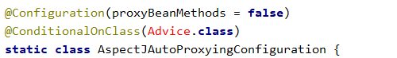

因此AspectJAutoProxyingConfiguration其实是无法加入到容器里面的

于是看JdkDynamicAutoProxyConfiguration类上的注解，符合条件，因此AOP的规则就使用JDK动态代理，不能使用AspectJ。

### 2.3.3 修改默认配置

SpringBoot默认会在底层配好所有的组件，但是如果用户自己配置了以用户的优先

```java
@Bean
@ConditionalOnMissingBean
public CharacterEncodingFilter characterEncodingFilter() {
}
```

1. SpringBoot先加载所有的自动配置类 xxxAutoConfiguration
2. 每个自动配置类按照条件进行生效，默认都会绑定配置文件指定的值。xxxxProperties里面拿。xxxProperties和配置文件进行了绑定

## 2.4 开发小技巧

**Lombok**

```xml
<dependency>
    <groupId>org.projectlombok</groupId>
    <artifactId>lombok</artifactId>
</dependency>
```

**dev-tools**

```xml
<dependency>
    <groupId>org.springframework.boot</groupId>
    <artifactId>spring-boot-devtools</artifactId>
    <optional>true</optional>
</dependency>
```

# 第三章 配置文件

自定义的类和配置文件绑定一般没有提示

```xml
<dependency>
    <groupId>org.springframework.boot</groupId>
    <artifactId>spring-boot-configuration-processor</artifactId>
    <optional>true</optional>
</dependency>


# 下面表示打包的时候不要包含这个依赖
<build>
    <plugins>
        <plugin>
            <groupId>org.springframework.boot</groupId>
            <artifactId>spring-boot-maven-plugin</artifactId>
            <configuration>
                <excludes>
                    <exclude>
                        <groupId>org.springframework.boot</groupId>
                        <artifactId>spring-boot-configuration-processor</artifactId>
                    </exclude>
                </excludes>
            </configuration>
        </plugin>
    </plugins>
</build>
```

# 第四章 Web开发

## 4.1 静态资源配置原理

在springboot中，一般静态资源放在类路径下：/static、/public、/resources、/META-INF/resources

直接访问当前项目根路径/ + 静态资源名就行

如果一个请求过来，就会先去controller看能不能处理，将不能处理的请求交给静态资源处理器。如果静态资源也找不到就响应404

改变默认的静态资源路径：

```yaml
spring:
  mvc:
    static-path-pattern: /res/**

  resources:
    static-locations: [classpath:/haha/]
```

第一个是虚拟的目录，比如之前localhost:8080/haha.jpg 变成了localhost:8080/res/haha.jpg，实际上是没有res这个文件夹的。

第二个就是将静态文件放在resources目录下的/haha目录下

**静态资源配置原理**

SpringMVC功能的自动配置类：WebMvcAutoConfiguration

```java
@Configuration(proxyBeanMethods = false)
@ConditionalOnWebApplication(type = Type.SERVLET)
@ConditionalOnClass({ Servlet.class, DispatcherServlet.class, WebMvcConfigurer.class })
@ConditionalOnMissingBean(WebMvcConfigurationSupport.class)
@AutoConfigureOrder(Ordered.HIGHEST_PRECEDENCE + 10)
@AutoConfigureAfter({ DispatcherServletAutoConfiguration.class, TaskExecutionAutoConfiguration.class,
                     ValidationAutoConfiguration.class })
public class WebMvcAutoConfiguration {
```

我们主要关心这个类里面的WebMvcAutoConfigurationAdapter

```java
@Configuration(proxyBeanMethods = false)
@Import(EnableWebMvcConfiguration.class)
@EnableConfigurationProperties({ WebMvcProperties.class, ResourceProperties.class })
@Order(0)
public static class WebMvcAutoConfigurationAdapter implements WebMvcConfigurer {

```

其中WebMvcProperties和spring.mvc进行了绑定；ResourceProperties和spring.resources进行绑定。

如果配置类只有一个有参构造器，那么有参构造器所有参数的值都会从容器中确定

**资源处理的默认规则**

```java
@Override
public void addResourceHandlers(ResourceHandlerRegistry registry) {
    // 配置spring.resources.add-mappings = false来禁用所有静态资源规则
    if (!this.resourceProperties.isAddMappings()) {
        logger.debug("Default resource handling disabled");
        return;
    }
    Duration cachePeriod = this.resourceProperties.getCache().getPeriod();
    CacheControl cacheControl = this.resourceProperties.getCache().getCachecontrol().toHttpCacheControl();
    //webjars的规则
    if (!registry.hasMappingForPattern("/webjars/**")) {
        customizeResourceHandlerRegistration(registry.addResourceHandler("/webjars/**")
                                             .addResourceLocations("classpath:/META-INF/resources/webjars/")
                                             .setCachePeriod(getSeconds(cachePeriod)).setCacheControl(cacheControl));
    }

    // 默认为/**
    String staticPathPattern = this.mvcProperties.getStaticPathPattern();
    if (!registry.hasMappingForPattern(staticPathPattern)) {
        customizeResourceHandlerRegistration(registry.addResourceHandler(staticPathPattern)
                                             .addResourceLocations(getResourceLocations(this.resourceProperties.getStaticLocations()))
                                             .setCachePeriod(getSeconds(cachePeriod)).setCacheControl(cacheControl));
    }
    // 21行这里的getStaticLocations就是前面提到了默认静态资源访问路径public、static、resources等等
}
```

**欢迎页的处理规则**

HandlerMapping：处理器映射。保存了每一个Handler能处理哪些请求

```java
WelcomePageHandlerMapping(TemplateAvailabilityProviders templateAvailabilityProviders,
                          ApplicationContext applicationContext, Optional<Resource> welcomePage, String staticPathPattern) {
    if (welcomePage.isPresent() && "/**".equals(staticPathPattern)) {
        logger.info("Adding welcome page: " + welcomePage.get());
        setRootViewName("forward:index.html");
    }
    else if (welcomeTemplateExists(templateAvailabilityProviders, applicationContext)) {
        logger.info("Adding welcome page template: index");
        setRootViewName("index");
    }
}
```

通过源码可知，对于欢迎页的处理，如果我们自定义了访问路径的前缀，就无法加载

## 4.2 请求参数处理

### 4.2.1 rest使用与原理

核心Filter：HiddenHttpMethodFilter

对于表单来说只支持get和post请求，put和delete在表单中都会被转换为post请求，因此要想支持这些请求，就得使用隐藏域

`<input type="hidden" _method="put" method="post">`

这个功能需要在配置文件中手动开启

`spring.mvc.hiddenmethod.filter.enabled=true`

对于一个表单请求来说，如果使用了rest风格，请求过来会先被HiddenHttpMethodFilter拦截，先判断请求是否正常，并且是post。然后获取_method的值，并且使用包装模式requesWrapper重写了getMethod方法，返回的是传入的值；过滤器链放行的时候用wrapper。以后的方法调用getMethod是调用requesWrapper的

在WebMvcAutoConfiguration.java中，有一个bean：OrderedHiddenHttpMethodFilter，它继承了HiddenHttpMethodFilter，在HiddenHttpMethodFilter有一个filter方法

```java
@Override
protected void doFilterInternal(HttpServletRequest request, HttpServletResponse response, FilterChain filterChain)
    throws ServletException, IOException {

    HttpServletRequest requestToUse = request;

    if ("POST".equals(request.getMethod()) && request.getAttribute(WebUtils.ERROR_EXCEPTION_ATTRIBUTE) == null) {
        // public static final String DEFAULT_METHOD_PARAM = "_method";
		// private String methodParam = DEFAULT_METHOD_PARAM;
        String paramValue = request.getParameter(this.methodParam);
        if (StringUtils.hasLength(paramValue)) {
            String method = paramValue.toUpperCase(Locale.ENGLISH);
            /*
            private static final List<String> ALLOWED_METHODS =
			Collections.unmodifiableList(Arrays.asList(HttpMethod.PUT.name(),
					HttpMethod.DELETE.name(), HttpMethod.PATCH.name()));
            */
            if (ALLOWED_METHODS.contains(method)) {
                requestToUse = new HttpMethodRequestWrapper(request, method);
            }
        }
    }

    filterChain.doFilter(requestToUse, response);
}
```

由源码可知，如果是post请求，就会查看_method的属性值，并且将其变成大写，看看是否为PUT、DELETE、PATCH请求，如果符合就可以发送相应的请求。

如果想自定义_method这个名字，可以自己重写OrderHiddenHttpMethodFilter这个bean，然后利用里面的setMethodParam方法来修改名字。

### 4.2.2 请求映射原理

对于SpringMVC来说，所有的请求都会经过org.springframework.web.servlet.DispatcherServlet类，它继承了FrameworkServlet类，FrameworkServlet又继承了HttpServletBean类，HttpServletBean类又继承了HttpServlet类。其中FrameworkServlet重写了doGet方法， 它内部核心的方法又是processRequest，processRequest内部核心方法为doService方法，由DispatcherServlet进行了重写，目光集中在它内部的doDispatch方法，这才是核心方法

```java
protected void doDispatch(HttpServletRequest request, HttpServletResponse response) throws Exception {
    HttpServletRequest processedRequest = request;
    HandlerExecutionChain mappedHandler = null;
    boolean multipartRequestParsed = false;

    WebAsyncManager asyncManager = WebAsyncUtils.getAsyncManager(request);

    try {
        ModelAndView mv = null;
        Exception dispatchException = null;

        try {
            processedRequest = checkMultipart(request);
            multipartRequestParsed = (processedRequest != request);

            // Determine handler for the current request.
            mappedHandler = getHandler(processedRequest);
            ......
```

我们可以关心getHandler方法，该方法找到当前请求使用哪个Handler（Controller的方法）处理

请求进来，挨个尝试所有的HandlerMapping是否有请求信息，如果没有找到就找下一个。

```java
@Nullable
protected HandlerExecutionChain getHandler(HttpServletRequest request) throws Exception {
    if (this.handlerMappings != null) {
        for (HandlerMapping mapping : this.handlerMappings) {
            HandlerExecutionChain handler = mapping.getHandler(request);
            if (handler != null) {
                return handler;
            }
        }
    }
    return null;
}
```

在spring中，this.handlerMappings一共有五种，

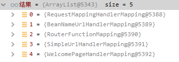

其中WelcomePageHandlerMapping就是有关于欢迎页的HandlerMapping，而RequestMappingHandlerMapping就是专门用来处理RequestMapping请求的，它内部保存了所有@RequestMapping和handler的映射规则，

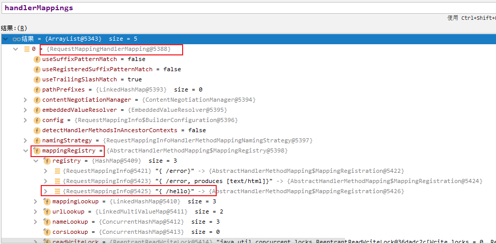

**所有的请求映射都在HandlerMapping中**

我们有时需要一些自定义的映射处理，我们也可以自己给容器中放HandlerMapping

有的时候比如说同一组api有不同的版本，比如v1，v2我们可以在controller中写两组mapping（比如v1/user，v2/user），但同时我们也可以放在两个包下，都是/user，这个时候我们就可以自定义handlermapping，把v1/user映射到一个包下的/user，把v2/user映射到另外一个包下的/user。

### 4.2.3 基本注解

@PathVariable：路径变量，支持用一个@PathVariable Map<String, String> pv 来存储该请求下所有的路径变量值，下列其他的基本注解可以参照源码注释来判断

> ```
> If the method parameter is {@link java.util.Map Map&lt;String, String&gt;}
> then the map is populated with all path variable names and values.
> ```

@RequestHeader：获取请求头

@RequestParam：获取请求参数

@CookieValue：获取cookie值

@RequestBody：获取请求体[post]

@RequestAttribute：获取request域属性

- 既可以使用 原生的HttpServletRequest request来获取：`request.getAttribute("msg")`，还可以通过`@RequestAttribute("msg") String msg `来获取

@MatrixVariable：获取矩阵变量的值

- 语法：请求路径：/cars/sell;low=34;brand=byd,audi,yd
- SpringBoot默认是禁用了矩阵变量的功能，需要手动开启。原理：对于路径的处理，需要UrlPathHelper进行解析，在UrlPathHelper中有一个属性removeSemicolonContent（移出分号内容）支持矩阵变量的
- 矩阵变量必须有url路径变量才能被解析

```java
// 在WebMvcAutoConfiguration的WebMvcAutoConfigurationAdapter类注册了一个bean：configurePathMatch，用于管理路径
// 它通过UrlPathHelper进行功能实现
// 因此我们可以使用@Configuration + WebMvcConfigurer自定义规则

@Bean
public WebMvcConfigurer webMvcConfigurer() {
    return new WebMvcConfigurer() {
        public void configurePathMatch(PathMatchConfigurer configurer) {
            UrlPathHelper urlPathHelper = new UrlPathHelper();
            // 不移除分号后面的内容，矩阵变量功能就可以生效
            urlPathHelper.setRemoveSemicolonContent(false);
            configurer.setUrlPathHelper(urlPathHelper);
        }
    }
}
```

### 4.2.4 参数处理原理

对于controller中的方法里面的参数而言，SpringMVC是怎么处理的呢？

1. HandlerMapping中找到能处理请求的Handler
2. 为当前Handler找到一个适配器HandlerAdapter；一般注都是靠RequestMappingHandlerAdapter
3. 适配器执行目标方法并确定方法参数的每一个值

```java
@GetMapping("/car/{id}/owner/{username}")
public Map<String,Object> getCar(@PathVariable("id") Integer id,
                                 @PathVariable("username") String name,
                                 @PathVariable Map<String,String> pv,
                                 @RequestHeader("User-Agent") String userAgent,
                                 @RequestHeader Map<String,String> header,
                                 @RequestParam("age") Integer age,
                                 @RequestParam("inters") List<String> inters,
                                 @RequestParam Map<String,String> params,
                                 @CookieValue("_ga") String _ga,
                                 @CookieValue("_ga") Cookie cookie){


    Map<String,Object> map = new HashMap<>();
    map.put("age",age);
    map.put("inters",inters);
    map.put("params",params);
    map.put("_ga",_ga);
    System.out.println(cookie.getName()+"===>"+cookie.getValue());
    return map;
}
```

分析请求处理过程一般从DispatcherServlet类中的doDispatch方法开始分析

```java
mappedHandler = getHandler(processedRequest); 
```

```java
@Nullable
protected HandlerExecutionChain getHandler(HttpServletRequest request) throws Exception {
    if (this.handlerMappings != null) {
        for (HandlerMapping mapping : this.handlerMappings) {
            HandlerExecutionChain handler = mapping.getHandler(request);
            if (handler != null) {
                return handler;
            }
        }
    }
    return null;
}
```

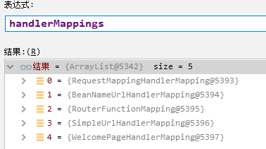

可以看到，对于getHandler方法来说，是遍历所有的handlerMappings，看看请求是哪个handler来处理的

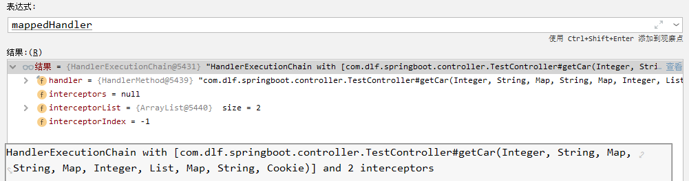

继续doDispatch方法中的源码`HandlerAdapter ha = getHandlerAdapter(mappedHandler.getHandler());`，给当前handler配置一个hander适配器

```java
protected HandlerAdapter getHandlerAdapter(Object handler) throws ServletException {
    if (this.handlerAdapters != null) {
        for (HandlerAdapter adapter : this.handlerAdapters) {
            if (adapter.supports(handler)) {
                return adapter;
            }
        }
    }
    throw new ServletException("No adapter for handler [" + handler +
                               "]: The DispatcherServlet configuration needs to include a HandlerAdapter that supports this handler");
}
```

可以看到，同样是遍历所有的handlerAdapter，然后找到对应的那个，本次测试的请求是找到了RequestMappingHandlerAdapter

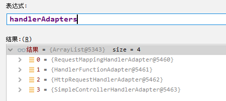

重点是下面这个方法，要开始处理本次的请求了

```java
// Actually invoke the handler.
mv = ha.handle(processedRequest, response, mappedHandler.getHandler());
```

点进去后来到RequestMappingHandlerAdapter类中的handlerInternal方法，重点看方法`mav = invokeHandlerMethod(request, response, handlerMethod);`，

重点看方法中的这两句

```java
if (this.argumentResolvers != null) {
    invocableMethod.setHandlerMethodArgumentResolvers(this.argumentResolvers);
}
if (this.returnValueHandlers != null) {
    invocableMethod.setHandlerMethodReturnValueHandlers(this.returnValueHandlers);
}
```

前者是参数解析器，用于确定将要执行的目标方法的每一个参数的值是什么，SpringMVC目标方法能写多少种参数类型取决于参数解析器。后者就是返回值处理器

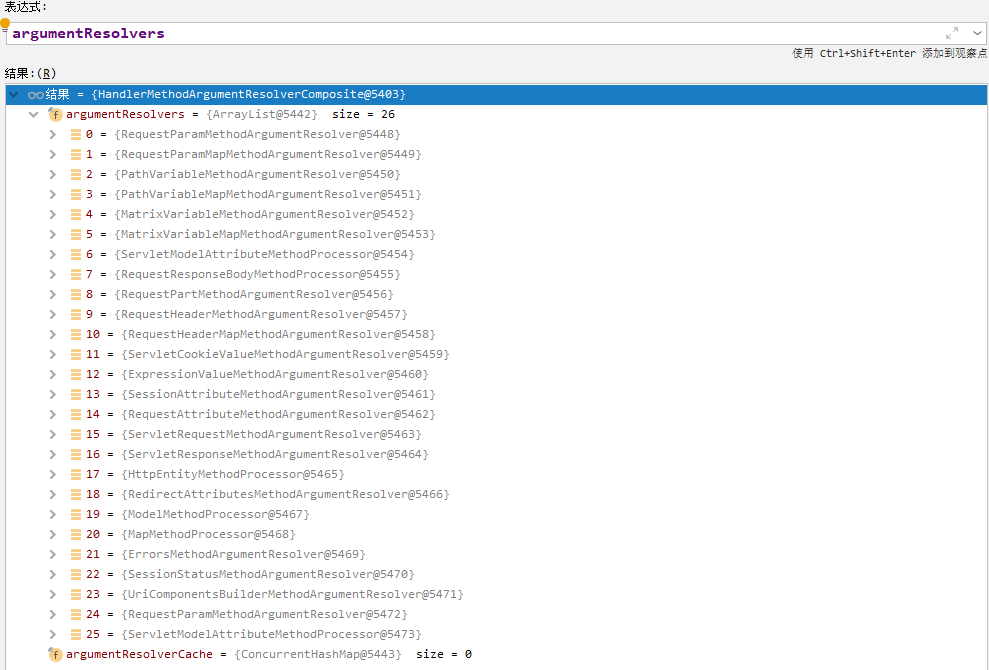

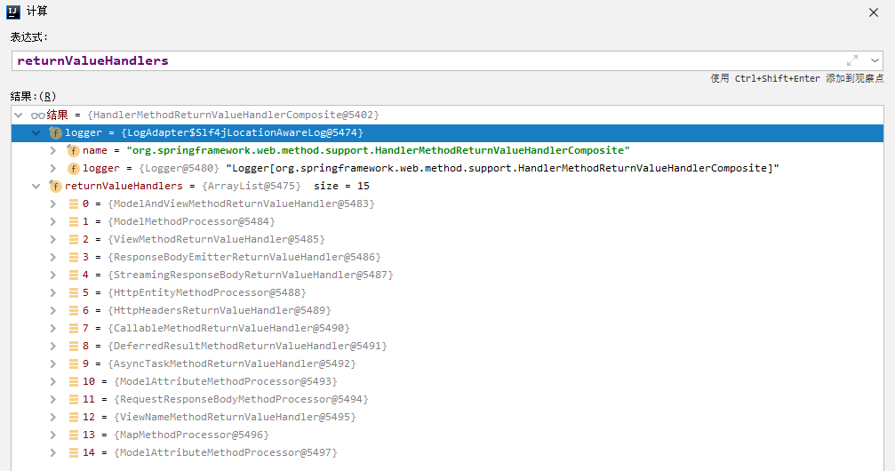

接着继续放行，重点看下面的`invocableMethod.invokeAndHandle(webRequest, mavContainer);`

```java
public void invokeAndHandle(ServletWebRequest webRequest, ModelAndViewContainer mavContainer,
                            Object... providedArgs) throws Exception {

    Object returnValue = invokeForRequest(webRequest, mavContainer, providedArgs);
    setResponseStatus(webRequest);
```

映入眼帘的是这个这两个方法，前者是真正执行目标方法的方法

```java
@Nullable
public Object invokeForRequest(NativeWebRequest request, @Nullable ModelAndViewContainer mavContainer,
                               Object... providedArgs) throws Exception {

    // 获取方法的所有参数的值
    Object[] args = getMethodArgumentValues(request, mavContainer, providedArgs);
    if (logger.isTraceEnabled()) {
        logger.trace("Arguments: " + Arrays.toString(args));
    }
    // 用反射调用目标方法
    return doInvoke(args);
}
```

核心就是下面这个方法

```java
protected Object[] getMethodArgumentValues(NativeWebRequest request, @Nullable ModelAndViewContainer mavContainer,
                                           Object... providedArgs) throws Exception {

    // 获取到所有的方法参数的详细信息
    MethodParameter[] parameters = getMethodParameters();
    if (ObjectUtils.isEmpty(parameters)) {
        return EMPTY_ARGS;
    }

    // 依次遍历所有参数
    Object[] args = new Object[parameters.length];
    for (int i = 0; i < parameters.length; i++) {
        MethodParameter parameter = parameters[i];
        parameter.initParameterNameDiscovery(this.parameterNameDiscoverer);
        args[i] = findProvidedArgument(parameter, providedArgs);
        if (args[i] != null) {
            continue;
        }
        // 判断当前解析器是否支持该参数类型，详情见下一部分源码
        if (!this.resolvers.supportsParameter(parameter)) {
            throw new IllegalStateException(formatArgumentError(parameter, "No suitable resolver"));
        }
        try {
            // 解析这个参数的值
            args[i] = this.resolvers.resolveArgument(parameter, mavContainer, request, this.dataBinderFactory);
        }
        catch (Exception ex) {
            // Leave stack trace for later, exception may actually be resolved and handled...
            if (logger.isDebugEnabled()) {
                String exMsg = ex.getMessage();
                if (exMsg != null && !exMsg.contains(parameter.getExecutable().toGenericString())) {
                    logger.debug(formatArgumentError(parameter, exMsg));
                }
            }
            throw ex;
        }
    }
    return args;
}
```

`this.resolvers.supportsParameter内部调用的方法：`

```java
@Nullable
private HandlerMethodArgumentResolver getArgumentResolver(MethodParameter parameter) {
    HandlerMethodArgumentResolver result = this.argumentResolverCache.get(parameter);
    if (result == null) {
        // 挨个确定这26个解析器谁能支持这个参数
        for (HandlerMethodArgumentResolver resolver : this.argumentResolvers) {
            if (resolver.supportsParameter(parameter)) {
                result = resolver;
                this.argumentResolverCache.put(parameter, result);
                break;
            }
        }
    }
    return result;
}
```

`this.resolvers.resolveArgument`：解析指定参数的值

```java
@Override
@Nullable
public Object resolveArgument(MethodParameter parameter, @Nullable ModelAndViewContainer mavContainer,
                              NativeWebRequest webRequest, @Nullable WebDataBinderFactory binderFactory) throws Exception {

    // 获取当前参数的参数解析器
    HandlerMethodArgumentResolver resolver = getArgumentResolver(parameter);
    if (resolver == null) {
        throw new IllegalArgumentException("Unsupported parameter type [" +
                                           parameter.getParameterType().getName() + "]. supportsParameter should be called first.");
    }
    // 解析当前参数
    return resolver.resolveArgument(parameter, mavContainer, webRequest, binderFactory);
}
```

当整个方法执行完之后，所有的数据将会放在ModelAndViewContainer中，包含要去的页面地址。还包含Model数据。

整体的流程大概就是这样子

### 4.2.5 Servlet API

对于WebRequest、ServletRequest、MultipartRequest、HttpSession等API，在对这种参数进行处理的时候，所用到的参数解析器是`ServletRequestMethodArgumentResolver `

```java
@Override
public boolean supportsParameter(MethodParameter parameter) {
    Class<?> paramType = parameter.getParameterType();
    return (WebRequest.class.isAssignableFrom(paramType) ||
            ServletRequest.class.isAssignableFrom(paramType) ||
            MultipartRequest.class.isAssignableFrom(paramType) ||
            HttpSession.class.isAssignableFrom(paramType) ||
            (pushBuilder != null && pushBuilder.isAssignableFrom(paramType)) ||
            Principal.class.isAssignableFrom(paramType) ||
            InputStream.class.isAssignableFrom(paramType) ||
            Reader.class.isAssignableFrom(paramType) ||
            HttpMethod.class == paramType ||
            Locale.class == paramType ||
            TimeZone.class == paramType ||
            ZoneId.class == paramType);
}
```

它所支持的参数配置如上所示

### 4.2.6 复杂参数

**Map**、**Model（map、model里面的数据会被放在request的请求域中，通过request.setAttribute进行设置）**、Errors/BindingResult、**RedirectAttributes（重定向携带数据）**、**ServletResponse（response）**、SessionStatus、UriComponentsBuilder、ServletUriComponentsBuilder

### 4.2.7 自定义对象参数、POJO封住过程

本小节源码解析以自定义的对象参数**以Person为例**

通过ServletModelAttributeMethodProcessor参数解析器进行处理，在看这个参数解析器支不支持自定义对象参数的时候，是通过判断它是不是简单类型来选择的。如果不是简单类型就支持

代码如下：

```java
// 位于ModelAtributeMethodProcessor类中的方法
@Override
public boolean supportsParameter(MethodParameter parameter) {
    return (parameter.hasParameterAnnotation(ModelAttribute.class) ||
            (this.annotationNotRequired && !BeanUtils.isSimpleProperty(parameter.getParameterType())));
}

// 位于BeanUtils中的方法
public static boolean isSimpleValueType(Class<?> type) {
    return (Void.class != type && void.class != type &&
            (ClassUtils.isPrimitiveOrWrapper(type) ||
             Enum.class.isAssignableFrom(type) ||
             CharSequence.class.isAssignableFrom(type) ||
             Number.class.isAssignableFrom(type) ||
             Date.class.isAssignableFrom(type) ||
             Temporal.class.isAssignableFrom(type) ||
             URI.class == type ||
             URL.class == type ||
             Locale.class == type ||
             Class.class == type));
}
```

ServletModelAttributeMethodProcessor参数解析器处理参数的方法：

```java
@Override
@Nullable
public final Object resolveArgument(MethodParameter parameter, @Nullable ModelAndViewContainer mavContainer,
                                    NativeWebRequest webRequest, @Nullable WebDataBinderFactory binderFactory) throws Exception {

    Assert.state(mavContainer != null, "ModelAttributeMethodProcessor requires ModelAndViewContainer");
    Assert.state(binderFactory != null, "ModelAttributeMethodProcessor requires WebDataBinderFactory");

    String name = ModelFactory.getNameForParameter(parameter);
    ModelAttribute ann = parameter.getParameterAnnotation(ModelAttribute.class);
    if (ann != null) {
        mavContainer.setBinding(name, ann.binding());
    }

    Object attribute = null;
    BindingResult bindingResult = null;

    if (mavContainer.containsAttribute(name)) {
        attribute = mavContainer.getModel().get(name);
    }
    else {
        // Create attribute instance
        try {
            // 一上来就创建一个空的Person对象，用来封装我们传来的数据
            attribute = createAttribute(name, parameter, binderFactory, webRequest);
        }
        catch (BindException ex) {
            if (isBindExceptionRequired(parameter)) {
                // No BindingResult parameter -> fail with BindException
                throw ex;
            }
            // Otherwise, expose null/empty value and associated BindingResult
            if (parameter.getParameterType() == Optional.class) {
                attribute = Optional.empty();
            }
            bindingResult = ex.getBindingResult();
        }
    }

    // 核心在这
    if (bindingResult == null) {
        
        // web数据绑定器，将请求参数的值绑定到指定的JavaBean里面
        // 它利用它里面的Converters（类型转换器）将请求数据转成指定的数据类型。再次封装到JavaBean中
        WebDataBinder binder = binderFactory.createBinder(webRequest, attribute, name);
        if (binder.getTarget() != null) {
            if (!mavContainer.isBindingDisabled(name)) {
                // 最关键的一步，利用反射将请求的数据绑定成自定义对象参数Person
                bindRequestParameters(binder, webRequest);
            }
            validateIfApplicable(binder, parameter);
            if (binder.getBindingResult().hasErrors() && isBindExceptionRequired(binder, parameter)) {
                throw new BindException(binder.getBindingResult());
            }
        }
        // Value type adaptation, also covering java.util.Optional
        if (!parameter.getParameterType().isInstance(attribute)) {
            attribute = binder.convertIfNecessary(binder.getTarget(), parameter.getParameterType(), parameter);
        }
        bindingResult = binder.getBindingResult();
    }

    // Add resolved attribute and BindingResult at the end of the model
    Map<String, Object> bindingResultModel = bindingResult.getModel();
    mavContainer.removeAttributes(bindingResultModel);
    mavContainer.addAllAttributes(bindingResultModel);

    return attribute;
}
```

GenericConversionService：在设置每一个值的时候，找它里面的所有converter那个可以将这个数据类型（request带来参数的字符串）转换到指定的类型

我们可以给WebDataBinder里面放自己的converter

自定义Converter：

`<input name="pet" value="阿猫,3"/>`，将value里面的值转换为我们的pet对象，可以自定义Converter来进行转化

```java
//1、WebMvcConfigurer定制化SpringMVC的功能

@Bean
public WebMvcConfigurer webMvcConfigurer(){
    return new WebMvcConfigurer() {
        @Override
        public void addFormatters(FormatterRegistry registry) {
            registry.addConverter(new Converter<String, Pet>() {

                @Override
                public Pet convert(String source) {
                    // 啊猫,3
                    if(!StringUtils.isEmpty(source)){
                        Pet pet = new Pet();
                        String[] split = source.split(",");
                        pet.setName(split[0]);
                        pet.setAge(Integer.parseInt(split[1]));
                        return pet;
                    }
                    return null;
                }
            });
        }
    };
}
```

## 4.3 数据响应与内容协商

在Springboot中进行Json数据的响应传输中，已经通过org.springframework.boot依赖引入了相关的依赖。

### 4.3.1 返回值解析器原理

本次源码测试用例：

```java
@ResponseBody
@GetMapping("/test/person")
public Person getPerson() {
    Person person = new Person();
    person.setAge(18);
    person.setUsername("DLF");
    return person;
}
```

重点来到ServletInvocableHandlerMethod类中的invokeAndHandle方法中

```java
try {
    this.returnValueHandlers.handleReturnValue(
        returnValue, getReturnValueType(returnValue), mavContainer, webRequest);
}
```

该方法进行返回值的处理

```java
@Override
public void handleReturnValue(@Nullable Object returnValue, MethodParameter returnType,
                              ModelAndViewContainer mavContainer, NativeWebRequest webRequest) throws Exception {

    // 内部其实也是通过遍历所有的返回值解析器，找到支持本次返回值类型的解析器
    HandlerMethodReturnValueHandler handler = selectHandler(returnValue, returnType);
    if (handler == null) {
        throw new IllegalArgumentException("Unknown return value type: " + returnType.getParameterType().getName());
    }
    // 进行处理
    handler.handleReturnValue(returnValue, returnType, mavContainer, webRequest);
}
```

在处理该案例下返回值的处理器RequestResponseBodyMethodProcessor中的处理返回值的方法如下

```java
@Override
public void handleReturnValue(@Nullable Object returnValue, MethodParameter returnType,
                              ModelAndViewContainer mavContainer, NativeWebRequest webRequest)
    throws IOException, HttpMediaTypeNotAcceptableException, HttpMessageNotWritableException {

    mavContainer.setRequestHandled(true);
    ServletServerHttpRequest inputMessage = createInputMessage(webRequest);
    ServletServerHttpResponse outputMessage = createOutputMessage(webRequest);

    // 使用消息转换器进行写出操作
    writeWithMessageConverters(returnValue, returnType, inputMessage, outputMessage);
}
```

**返回值解析器原理**

1. 返回值处理器判断是否支持这种返回类型 supportsReturnType
2. 返回值处理器调用handleReturnValue进行处理
3. RequestResponseBodyMethodProcessor可以处理返回值标了@ResponseBody注解的
   1. 利用MessageConverters进行处理，将数据写为json
      1. 内容协商（浏览器默认会以请求头的方式告诉服务器他能接受什么样的内容类型）
      2. 服务器最终根据自己自身的能力，决定服务器能生产出什么样内容类型的数据
      3. SpringMVC会挨个遍历所有容器底层的HttpMessageConverter，看谁能处理
         1. 得到MappingJackson2HttpMessageConverter可以将对象写为json
         2. 利用它将对象转为json再写出去

### 4.3.2 HTTPMessageConverter原理

MessageConverter规范

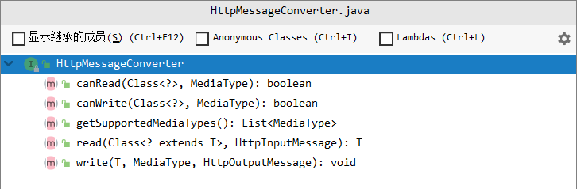

HttpMessgaeConverter：看是否支持将此Class类型的对象，转为MediaType类型的数据。

例子：Person对象转为JSON，或者JSON转为Person

默认的MessageConverter


最终MappingJackson2HttpMessageConverter把对象转为JSON（利用底层的jackson的objectMapper转换的）

### 4.3.3 内容协商

浏览器默认会以请求头的方式告诉服务器它能接受什么样的内容类型

根据客户端接受能力不同，返回不同媒体类型的数据

例如：我们想让浏览器不接受json，而是接受xml

导入xml依赖

```xml
<dependency>
    <groupId>com.fasterxml.jackson.dataformat</groupId>
    <artifactId>jackson-dataformat-xml</artifactId>
</dependency>
```

**内容协商原理**

在AbstractMessageConverterMethodProcessor中的writeWithMessageConverters方法中，有内容协商相关内容

1. 判断当前响应头中是否已经有确定的媒体类型。MediaType

   ```java
   MediaType contentType = outputMessage.getHeaders().getContentType();
   ```

2. 获取客户端（PostMan、浏览器等）支持接受的内容类型。（获取客户端Accept请求头字段）

   ```java
   List<MediaType> acceptableTypes = getAcceptableMediaTypes(request);
   ```

   - contentNegotiationManager 内容协商管理器，默认使用基于请求头策略
   - HeaderContentNegotiationStrategy，确定客户端可以接受的内容类型

3. 遍历循环所有当前系统的MessageConverter，看谁支持操作这个对象（Person）

4. 找到支持操作Person的converter，把converter支持的媒体类型统计出来

5. 客户端需要【application/xml】。服务端能力【10种、json、xml】

6. 进行内容协商的最佳匹配媒体模式

7. 用支持将对象转化为最佳匹配媒体类型的converter。调用它进行转化

### 4.3.4 开启浏览器参数方式内容

为了方便内容协商，开启基于请求参数的内容协商功能

```yaml
spring: 
	contentneggotiation:
		favor-parameter: true
```

发送请求示例：http://localhost:8080/test/person?format=xml

开启基于请求参数的内容协商功能后，在contentNegotiationManager中的strategies就有两种了，一种是基于参数的，一种是基于请求头的

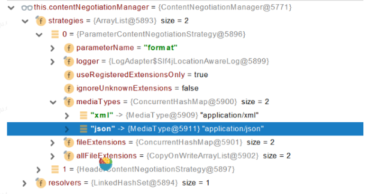

确定客户端接受什么样的内容类型：

1. Parameter策略优先确定要返回json数据（获取请求头中的format的值）
2. 最终进行内容协商返回给客户端json即可

### 4.3.5 自定义MessageConverter

如果需要一个方法同时实现三种方式的请求，就需要自定义MessageConverter

1. 浏览器发请求直接返回xml [ application/xml]  jacksonXmlConverter

2. 如果是ajax请求，返回json [ application/json]   jacksonJsonConverter

3. 如果是app发请求，返回自定义协议数据 [application/x-atguigu]  xxxConverter

   传输的时候属性值1；属性值2

步骤：

1. 添加自定义的MessageConverter进系统底层
2. 系统底层就会统计出所有MessageConvverter能操作哪些类型
3. 客户端内容协商

基于PostMan发送自定义请求：

```java
public class GuiguMessageConverter implements HttpMessageConverter<Person> {
	// 根据需求重写里面的方法
}

// 然后将自定义的MessageConverter放入MessgaeConterters中
@Bean
public WebMvcConfigurer webMvcConfigurer(){
    return new WebMvcConfigurer() {
        @Override
        public void extendMessgaeConverters(List<HttpMessageConverter<?>> converters) {
            converters.add(new GuiguMessageConverter());
        }
    };
}
```

基于浏览器format发送自定义请求：

```java
// 自定义内容协商策略
@Override
public void configureContentNegotiation(ContentNegotiationConfigurer configurer) {
    Map<String, MediaType> mediaTypes = new HashMap<>();
    mediaTypes.put("json", MediaType.APPLICATION_JSON);
    madiaTypes.put("xml", MediaType.APPLICATION_XML);
    mediaTypes.put("gg", MediaType.parseMediaType("application/x-guigu"));
    // 指定支持解析哪些参数对应的哪些媒体类型
    ParameterContentNegotiationStrategy parametersStrategy = new ParameterContentNegotiationStrategy();
    
    // 请求头
    HeaderContentNegotiationStrategy headStrategy = new HeaderContentNegotiationStrategy();
    
    configurer.strategies(Arrays.asList(parametersStrategy, headStrategy));
}
```

**有可能我们添加的自定义的功能会覆盖很多的默认功能，导致一些默认的功能失效**

## 4.4 视图解析与模板引擎

### 4.4.1 基本知识

引入starter

```xml
<dependency>
    <groupId>org.springframework.boot</groupId>
    <artifactId>spring-boot-starter-thymeleaf</artifactId>
</dependency>
```

在引入starter之后，springboot就自动帮我们配置好了thymeleaf

```java
@Configuration(proxyBeanMethods = false)
@EnableConfigurationProperties(ThymeleafProperties.class)
@ConditionalOnClass({ TemplateMode.class, SpringTemplateEngine.class })
@AutoConfigureAfter({ WebMvcAutoConfiguration.class, WebFluxAutoConfiguration.class })
public class ThymeleafAutoConfiguration { }
```

1. 所有thymeleaf的配置值都在ThymeleafProperties
2. 配置好了SpringTemplateEngine
3. 配好了ThymeleafViewResolver
4. 我们只需要直接开发页面

注意所有的有关thymeleaf的html文件都应该放在指定目录下

```java
public static final String DEFAULT_PREFIX = "classpath:/templates/";

public static final String DEFAULT_SUFFIX = ".html";  //xxx.html
```

对于基本的语法来说，我们不进行记录。重点是理解它的原理

### 4.4.2 视图解析原理分析

本次我们以`return "redirect:/main.html"`为例

1. 目标方法处理过程中，所有的数据都会被放在ModelAndViewContainer里面，包括数据和视图地址

2. 方法的参数如果是一个自定义类型对象（从请求参数中确定的），把他重新放在ModelAndViewContainer

3. 任何目标方法执行完成以后都会返回ModelAndView（数据和视图地址）

   ```java
   // Actually invoke the handler.
   mv = ha.handle(processedRequest, response, mappedHandler.getHandler());
   ```

4. ```
   // 执行完上面的handler方法之后执行该方法，在DispatcherServlet类中
   processDispatchResult(processedRequest, response, mappedHandler, mv, dispatchException);
   ```

   处理派发结果，页面该如何响应都在这个方法里面。

   4.1、`render(mv, request, response);`，进行页面渲染逻辑

   4.1.1、`view = resolveViewName(viewName, mv.getModelInternal(), locale, request);`，根据方法的String返回值得到View对象【定义了页面的渲染逻辑】

   那么怎么才能得到这个view对象呢？首先视图解析器尝试是否能根据当前返回值得到View对象；

   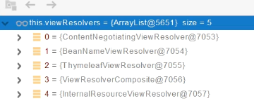

   其次根据返回值得到了 redirect:/main.html，然后 Thymeleaf帮我们 new RedirectView()并进行返回；

   其实对于ContentNegotiatingViewResolver来说，他里面已经包含了上图所有的视图解析器，内部还是利用上图所有视图解析器得到视图对象

   4.1.2、得到view后，`view.render(mv.getModelInternal(), request, response);`，视图对象调用自定义的render进行页面渲染工作

   那么RedirectView如何渲染？

   ```java
   @Override
   protected void renderMergedOutputModel(Map<String, Object> model, HttpServletRequest request,
                                          HttpServletResponse response) throws IOException {
   
       // 获取目标url地址
       String targetUrl = createTargetUrl(model, request);
       targetUrl = updateTargetUrl(targetUrl, model, request, response);
   
       // Save flash attributes
       RequestContextUtils.saveOutputFlashMap(targetUrl, request, response);
   
       // Redirect 重定向，调用 servlet中的response.sendRedirect(encodeURL)
       sendRedirect(request, response, targetUrl, this.http10Compatible);
   }
   ```

整个重定向的源码解析就此结束

总结：

1. 返回值以forward开始：new InternalResourceView(forwardUrl) -- 转发，request.getRequestDispatcher(path).forward(request,response):
2. 返回值以redirect开始： new RedirectView()  重定向
3. 返回值是普通字符串： new ThymeleafView（）

## 4.5 拦截器

1、实现HandlerInterceptor接口（以登录检查为例）

```java
/**
 * 登录检查
 * 1、配置好拦截器要拦截哪些请求
 * 2、把这些配置放在容器中
 */
@Slf4j
public class LoginInterceptor implements HandlerInterceptor {

    /**
     * 目标方法执行之前
     */
    @Override
    public boolean preHandle(HttpServletRequest request, HttpServletResponse response, Object handler) throws Exception {

        String requestURI = request.getRequestURI();
        log.info("preHandle拦截的请求路径是{}",requestURI);
        //登录检查逻辑
        HttpSession session = request.getSession();
        Object loginUser = session.getAttribute("loginUser");
        if(loginUser != null){
            //放行
            return true;
        }
        //拦截住。未登录。跳转到登录页
        request.setAttribute("msg","请先登录");
        request.getRequestDispatcher("/").forward(request,response);
        return false;
    }

    /**
     * 目标方法执行完成以后
     */
    @Override
    public void postHandle(HttpServletRequest request, HttpServletResponse response, Object handler, ModelAndView modelAndView) throws Exception {
        log.info("postHandle执行{}",modelAndView);
    }

    /**
     * 页面渲染以后
     */
    @Override
    public void afterCompletion(HttpServletRequest request, HttpServletResponse response, Object handler, Exception ex) throws Exception {
        log.info("afterCompletion执行异常{}",ex);
    }
}
```

2、配置拦截器

```java
/**
 * 1、编写一个拦截器实现HandlerInterceptor接口
 * 2、拦截器注册到容器中（实现WebMvcConfigurer的addInterceptors）
 * 3、指定拦截规则【如果是拦截所有，静态资源也会被拦截】
 */
@Configuration
public class AdminWebConfig implements WebMvcConfigurer {

    @Override
    public void addInterceptors(InterceptorRegistry registry) {
        registry.addInterceptor(new LoginInterceptor())
            .addPathPatterns("/**")  //所有请求都被拦截包括静态资源
            .excludePathPatterns("/","/login","/css/**","/fonts/**","/images/**","/js/**"); //放行的请求
    }
}
```

3、拦截器原理解析：

1. 根据当前请求，找到可以处理请求的handler以及handler的所有拦截器【HandlerExecutionChain】

2. 接着顺序执行所有拦截器的preHandler方法（一个mapperHandler可以有多个拦截器）

   ```java
   if (!mappedHandler.applyPreHandle(processedRequest, response)) {
       return;
   }
   ```

   ```java
   boolean applyPreHandle(HttpServletRequest request, HttpServletResponse response) throws Exception {
       HandlerInterceptor[] interceptors = getInterceptors();
       if (!ObjectUtils.isEmpty(interceptors)) {
           for (int i = 0; i < interceptors.length; i++) {
               HandlerInterceptor interceptor = interceptors[i];
               if (!interceptor.preHandle(request, response, this.handler)) {
                   triggerAfterCompletion(request, response, null);
                   return false;
               }
               this.interceptorIndex = i;
           }
       }
       return true;
   }
   ```

   如果当前拦截器prehandler返回true，则执行下一个拦截器的preHandler；如果当前拦截器返回false，直接倒序执行所有已经执行了的拦截器的afterCompletion；

3. 如果任何一个拦截器返回false，直接跳出不执行目标方法；所有拦截器都返回true，执行目标方法

4. `mappedHandler.applyPostHandle(processedRequest, response, mv);`倒序执行所有拦截器的postHandler方法

5. 前面的步骤有任何异常都会直接倒序触发afterCompletion

6. 页面成功渲染后也会倒序触发afterCompletion

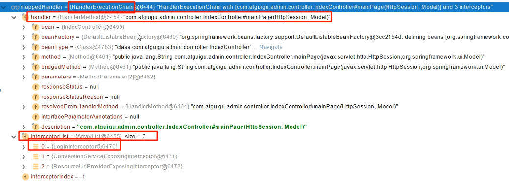

## 4.6 文件上传

```html
<form method="post" action="/upload" enctype="multipart/form-data">
    <input type="file" name="file"><br>
    <input type="submit" value="提交">
</form>
```

```java
/**
     * MultipartFile 自动封装上传过来的文件
     支持批量上传
     */
@PostMapping("/upload")
public String upload(@RequestParam("email") String email,
                     @RequestParam("username") String username,
                     @RequestPart("headerImg") MultipartFile headerImg,
                     @RequestPart("photos") MultipartFile[] photos) throws IOException {

    log.info("上传的信息：email={}，username={}，headerImg={}，photos={}",
             email,username,headerImg.getSize(),photos.length);

    if(!headerImg.isEmpty()){
        //保存到文件服务器，OSS服务器
        String originalFilename = headerImg.getOriginalFilename();
        headerImg.transferTo(new File("H:\\cache\\"+originalFilename));
    }

    if(photos.length > 0){
        for (MultipartFile photo : photos) {
            if(!photo.isEmpty()){
                String originalFilename = photo.getOriginalFilename();
                photo.transferTo(new File("H:\\cache\\"+originalFilename));
            }
        }
    }


    return "main";
}
```

**自动配置原理**

文件上传自动配置类：**MultipartAutoConfiguration和MultipartProperties**

- 自动配置好了**StandardServletMultipartResolver**【文件上传解析器】

  ```java
  @Bean(name = DispatcherServlet.MULTIPART_RESOLVER_BEAN_NAME)
  @ConditionalOnMissingBean(MultipartResolver.class)
  public StandardServletMultipartResolver multipartResolver() {
      StandardServletMultipartResolver multipartResolver = new StandardServletMultipartResolver();
      multipartResolver.setResolveLazily(this.multipartProperties.isResolveLazily());
      return multipartResolver;
  }
  ```

- 请求进来的时候先利用文件上传解析器判断该请求是不是一个文件上传请求（processedRequest = checkMultipart(request);）

  ```java
  if (this.multipartResolver != null && this.multipartResolver.isMultipart(request)) {
  ```

  如果是一个文件上传请求，就封装该请求（返回MultipartHttpServletRequest）

  ```java
  return this.multipartResolver.resolveMultipart(request);
  ```

  ```java
  @Override
  public MultipartHttpServletRequest resolveMultipart(HttpServletRequest request) throws MultipartException {
      return new StandardMultipartHttpServletRequest(request, this.resolveLazily);
  }
  ```

- 利用RequestPartMethodArgumentResolver这个参数解析器来解析请求中的文件内容封装成MultipartFile

- 将request中文件信息封装成一个Map；MultiValueMap< String, MultipartFile> FileCopyUtils。实现文件流的拷贝

## 4.7 异常处理

### 4.7.1 默认规则

- 默认情况下，SpringBoot提供/error处理所有错误的映射
- 对于机器客户端，它将生成JSON响应，其中包含错误、HTTP状态和异常信息的详细信息。对于浏览器客户端，响应一个“whitelabel”错误视图，以HTML格式呈现相同的数据
- 要对其进行自定义，添加View解析为error
- 要完全替换默认行为，可以实现ErrorController并注册该类型的Bean定义，或添加ErrorAttributes类型的组件以使用现有机制单替换其内容
- error/下的4xx.html，5xx页面会被自动解析

### 4.7.2 异常处理的自动配置原理

SpringBoot自动配置了异常处理规则：**ErrorMvcAutoConfiguration**，它里面主要有三个组件

**1、DefaultErrorAttributes**：定义错误页面中可以包含哪些数据

```java
@Override
public Map<String, Object> getErrorAttributes(WebRequest webRequest, ErrorAttributeOptions options) {
    Map<String, Object> errorAttributes = getErrorAttributes(webRequest, options.isIncluded(Include.STACK_TRACE));
    if (Boolean.TRUE.equals(this.includeException)) {
        options = options.including(Include.EXCEPTION);
    }
    if (!options.isIncluded(Include.EXCEPTION)) {
        errorAttributes.remove("exception");
    }
    if (!options.isIncluded(Include.STACK_TRACE)) {
        errorAttributes.remove("trace");
    }
    if (!options.isIncluded(Include.MESSAGE) && errorAttributes.get("message") != null) {
        errorAttributes.put("message", "");
    }
    if (!options.isIncluded(Include.BINDING_ERRORS)) {
        errorAttributes.remove("errors");
    }
    return errorAttributes;
}
```

```java
@Override
@Deprecated
public Map<String, Object> getErrorAttributes(WebRequest webRequest, boolean includeStackTrace) {
    Map<String, Object> errorAttributes = new LinkedHashMap<>();
    errorAttributes.put("timestamp", new Date());
    addStatus(errorAttributes, webRequest);
    addErrorDetails(errorAttributes, webRequest, includeStackTrace);
    addPath(errorAttributes, webRequest);
    return errorAttributes;
}

private void addStatus(Map<String, Object> errorAttributes, RequestAttributes requestAttributes) {
    Integer status = getAttribute(requestAttributes, RequestDispatcher.ERROR_STATUS_CODE);
    if (status == null) {
        errorAttributes.put("status", 999);
        errorAttributes.put("error", "None");
        return;
    }
    errorAttributes.put("status", status);
    try {
        errorAttributes.put("error", HttpStatus.valueOf(status).getReasonPhrase());
    }
    catch (Exception ex) {
        // Unable to obtain a reason
        errorAttributes.put("error", "Http Status " + status);
    }
}
```

**2、BasicErrorController**：

```java
@Controller
@RequestMapping("${server.error.path:${error.path:/error}}")
public class BasicErrorController extends AbstractErrorController {
```

默认处理**/error**路径的请求，如果通过server.error.path指定了自己的路径，就用自定义的。**json+白页**，适配响应（用postman等发送的请求出现异常就返回json数据，通过浏览器客户端发送的请求出现异常就返回new ModelAndView("error", model);

如果浏览器发送的请求发送了异常，就会返回一个**new ModelAndView("error", model);**，那么值得注意的是，在ErrorMvcAutoConfiguration中还放了组件**View**（id是error，响应默认错误页）和组件**BeanNameViewResolver**（视图解析器，按照返回的视图名作为组件的id去容器中找View对象）

```java
@Bean(name = "error")
@ConditionalOnMissingBean(name = "error")
public View defaultErrorView() {
    return this.defaultErrorView;
}

// If the user adds @EnableWebMvc then the bean name view resolver from
// WebMvcAutoConfiguration disappears, so add it back in to avoid disappointment.
@Bean
@ConditionalOnMissingBean
public BeanNameViewResolver beanNameViewResolver() {
    BeanNameViewResolver resolver = new BeanNameViewResolver();
    resolver.setOrder(Ordered.LOWEST_PRECEDENCE - 10);
    return resolver;
}
```

**3、DefaultErrorViewResolver**

```java
@Override
public ModelAndView resolveErrorView(HttpServletRequest request, HttpStatus status, Map<String, Object> model) {
    ModelAndView modelAndView = resolve(String.valueOf(status.value()), model);
    if (modelAndView == null && SERIES_VIEWS.containsKey(status.series())) {
        modelAndView = resolve(SERIES_VIEWS.get(status.series()), model);
    }
    return modelAndView;
}

private ModelAndView resolve(String viewName, Map<String, Object> model) {
    String errorViewName = "error/" + viewName;
    TemplateAvailabilityProvider provider = this.templateAvailabilityProviders.getProvider(errorViewName,
                                                                                           this.applicationContext);
    if (provider != null) {
        return new ModelAndView(errorViewName, model);
    }
    return resolveResource(errorViewName, model);
}
```

如果发生错误，就会以HTTP的状态码作为视图页地址（viewName），找到真正的页面，也就是error/404、5xx.html

这也就是在4.7.1小节中声明的error/下的4xx.html，5xx页面会被自动解析

### 4.7.3 异常处理步骤流程

1. 执行目标方法，目标方法在运行期间有任何异常都会被catch、而且标志当前请求结束；并且用DispatchException来保存出现的异常。

2. 进入视图解析流程来处理抛出的异常，也就是processDispatchResult(processedRequest, response, mappedHandler, mv, **dispatchException**);

3. `mv = processHandlerException(request, response, handler, exception);`处理handler发生的异常，处理完成后返回ModelAndView

4. 在processHandlerException方法内部，循环遍历所有的handlerExceptionoResolvers，看谁能处理当前异常

   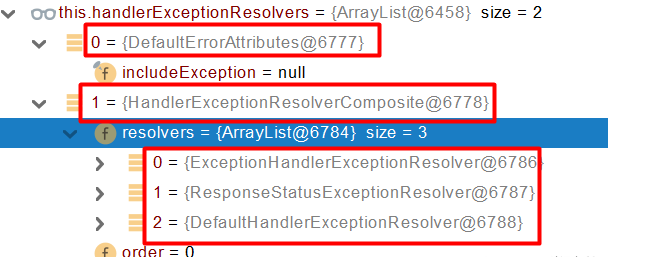

   ```java
   ModelAndView exMv = null;
   if (this.handlerExceptionResolvers != null) {
       for (HandlerExceptionResolver resolver : this.handlerExceptionResolvers) {
           exMv = resolver.resolveException(request, response, handler, ex);
           if (exMv != null) {
               break;
           }
       }
   }
   ```

   

5. 首先用DefaultErrorAttributes来处理异常，将异常信息保存到request域，并且返回null

   ```java
   @Override
   public ModelAndView resolveException(HttpServletRequest request, HttpServletResponse response, Object handler,
                                        Exception ex) {
       storeErrorAttributes(request, ex);
       return null;
   }
   ```

6. 默认没有任何人能处理异常（DefaultErrorAttributes处理之后返回了null），所以异常会被抛出，接着继续后面的循环

7. 如果没有任何人能够处理，最终底层就会发送/error请求，会被底层的BasicErrorController处理

8. 解析错误视图：遍历所有的ErrorViewResolver，看谁能解析（默认只有一个DefaultErrorViewResolver）

9. 默认的DefaultErrorViewResolver，会把响应码作为错误页的地址，比如error/500.html（如果有的话）

10. 模板引擎最终响应这个页面error/500.html

### 4.7.4 定制异常处理逻辑

- 自定义错误页：error/404.html等。出现异常后如果有精确的错误状态码就匹配精确，没有就找4xx.html；如果都没有就触发白页

- @ControllerAdvice + @ExceptionHandler处理全局异常，底层是用**ExceptionHandlerExceptionResolveer**支持的

  ```java
  @Slf4j
  @ControllerAdvice
  public class GlobalExceptionHandler {
      @ExceptionHandler({ArithmeticException.class, NullPointerException.class}) 
      public String handleArithException(Exception e) {
          log.error("异常是：{}",e);
          return "login";// 视图地址
      }
  }
  ```

- @ResponseStatus + 自定义异常；底层是**ResponseStatusExceptionResolver，将responststatus注解的信息底层调用response.sendError(statusCode, resolvedReason) ；tomcat发送的/error**

  ```java
  @ResponseStatus(value = HttpStatus.FORBIDDEN, reason = "用户数量太多")
  public class UserTooManyException extends RuntimeException {
      public UserTooManyException() {
          
      }
      public UserTooManyException(String message) {
          super(meesage);
      }
  }
  ```

- Spring的底层，如参数类型转换异常，**DefaultHandlerExceptionResolver处理框架底层的异常**

- 自定义实现HandlerExceptionResolver处理异常；可以作为默认的全局处理规则

  ```java
  @Order(value = Ordered.HIGNEST_PRECEDENCE) // 给我们自定义的异常解析器优先工作
  @Component
  public class CustomerHandlerExceptionResolver implemnets HandlerExceptionResolver {
      @Override
      public ModelAndView resolveException(HttpServletRequest request,
                                          HttpServletResponse response,
                                          Object handler, Exception ex) {
          try {
              response.sendError(511, "我喜欢的错误");
          } catch(IOException e) {
              e.printStackTrace();
          }
          return new ModelAndView();
      }
  }
  ```

  

## 4.8 Web原生组件注入（Servlet、Filter、Listener）

SpringBoot将我们自己定义的Servlet、Filter、Listener注册到容器中有两种办法

**1、使用Servlet API**

@ServletComponentScan(basePackages = "com.atguigu")：指定原生Servlet组件都放在哪里

接着使用@WebServlet(urlPatterns = "/my")、@WebFIlter(urlPatterns={"/css/*"})、@WebListener分别让我们自己定义的原生组件注入到容器中，推荐使用

**2、使用RegistrationBean**

ServletRegistrationBean`, `FilterRegistrationBean, and ServletListenerRegistrationBean

```java
@Configuration
public class MyRegistConfig {

    @Bean
    public ServletRegistrationBean myServlet(){
        MyServlet myServlet = new MyServlet();

        return new ServletRegistrationBean(myServlet,"/my","/my02");
    }


    @Bean
    public FilterRegistrationBean myFilter(){

        MyFilter myFilter = new MyFilter();
        //        return new FilterRegistrationBean(myFilter,myServlet());
        FilterRegistrationBean filterRegistrationBean = new FilterRegistrationBean(myFilter);
        filterRegistrationBean.setUrlPatterns(Arrays.asList("/my","/css/*"));
        return filterRegistrationBean;
    }

    @Bean
    public ServletListenerRegistrationBean myListener(){
        MySwervletContextListener mySwervletContextListener = new MySwervletContextListener();
        return new ServletListenerRegistrationBean(mySwervletContextListener);
    }
}
```

**3、问题：我们注册的ServletAPI并没有经过Spring的拦截器拦截**

DispatchServlet被注册过程

1. 容器中自动配置了DispatchServlet，并且将属性绑定到了WebMvcProperties；对应的配置文件是spring.mvc
2. 通过ServletRegistrationBean< DispatcherServlet>把DispatcherServlet配置进来
3. 默认映射的是/路径

Tomcat-Servlet：

- 采用精确优先原则

也就是说Spring中有两套路径，Spring流程和Tomcat处理，如下图所示，因此如果请求路径是/my，就会优先交由tomcat处理，不会经过spring的DispatcherServlet


## 4.9 嵌入式Servlet容器

SpringBoot中默认支持的webServer：Tomcat、Jetty、Undertow

ServletWebServerApplicationContext容器启动寻找ServletWebServerFactory并引导创建服务器

切换服务器：

```xml
<dependency>
    <groupId>org.springframework.boot</groupId>
    <artifactId>spring-boot-starter-web</artifactId>
    <exclusions>
        <exclusion>
            <groupId>org.springframework.boot</groupId>
            <artifactId>spring-boot-starter-tomcat</artifactId>
        </exclusion>
    </exclusions>
</dependency>
```

原理：

- SpringBoot应用启动发现当前是Web应用。web场景包-导入tomcat
- web应用会创建一个web版的ioc容器 ServletWebServerApplicationContext 
- ServletWebServerApplicationContext  启动的时候寻找 ServletWebServerFactory（Servlet 的web服务器工厂---> Servlet 的web服务器）  
- SpringBoot底层默认有很多的WebServer工厂；TomcatServletWebServerFactory, JettyServletWebServerFactory, or UndertowServletWebServerFactory
- 底层直接会有一个自动配置类。ServletWebServerFactoryAutoConfiguration
- ServletWebServerFactoryAutoConfiguration导入了ServletWebServerFactoryConfiguration（配置类）
- ServletWebServerFactoryConfiguration 配置类 根据动态判断系统中到底导入了那个Web服务器的包。（默认是web-starter导入tomcat包），容器中就有 TomcatServletWebServerFactory
- TomcatServletWebServerFactory 创建出Tomcat服务器并启动；TomcatWebServer 的构造器拥有初始化方法initialize---this.tomcat.start();
- 内嵌服务器，就是手动把启动服务器的代码调用（tomcat核心jar包存在）

**定制Servlet容器**

- 实现  WebServerFactoryCustomizer<ConfigurableServletWebServerFactory> 
  - 把配置文件的值和ServletWebServerFactory 进行绑定
- 修改配置文件 server.xxx
- 直接自定义 ConfigurableServletWebServerFactory 

**xxxxxCustomizer**：定制化器，可以改变xxxx的默认规则

```JAVA
import org.springframework.boot.web.server.WebServerFactoryCustomizer;
import org.springframework.boot.web.servlet.server.ConfigurableServletWebServerFactory;
import org.springframework.stereotype.Component;

@Component
public class CustomizationBean implements WebServerFactoryCustomizer<ConfigurableServletWebServerFactory> {

    @Override
    public void customize(ConfigurableServletWebServerFactory server) {
        server.setPort(9000);
    }

}
```

## 4.10 定制化原理

**1、定制化的常见方式**

- 修改配置文件；

- xxxxxCustomizer；

-  编写自定义的配置类   xxxConfiguration；+ @Bean替换、增加容器中默认组件；视图解析器 

- Web应用 编写一个配置类实现 WebMvcConfigurer 即可定制化web功能；+ @Bean给容器中再扩展一些组件

  ```JAVA
  @Configuration
  public class AdminWebConfig implements WebMvcConfigurer
  ```

- @EnableWebMvc + WebMvcConfigurer —— @Bean  可以全面接管SpringMVC，所有规则全部自己重新配置； 实现定制和扩展功能

  - 1、WebMvcAutoConfiguration  默认的SpringMVC的自动配置功能类。静态资源、欢迎页.....
  -  2、一旦使用 @EnableWebMvc 、。会 @Import(DelegatingWebMvcConfiguration.class)
  - 3、DelegatingWebMvcConfiguration 的 作用，只保证SpringMVC最基本的使用
    - 把所有系统中的 WebMvcConfigurer 拿过来。所有功能的定制都是这些 WebMvcConfigurer  合起来一起生效
    - 自动配置了一些非常底层的组件。RequestMappingHandlerMapping、这些组件依赖的组件都是从容器中获取
    - public class DelegatingWebMvcConfiguration extends WebMvcConfigurationSupport
  -  4、WebMvcAutoConfiguration 里面的配置要能生效 必须  @ConditionalOnMissingBean(WebMvcConfigurationSupport.class)
  - 5、@EnableWebMvc  导致了 WebMvcAutoConfiguration  没有生效。

**2、原理分析套路**

**场景starter** - xxxxAutoConfiguration - 导入xxx组件 - 绑定xxxProperties -- **绑定配置文件项** 

# 第五章 数据访问

## 5.1 数据源的自动配置

导入JDBC场景

```xml
<dependency>
    <groupId>org.springframework.boot</groupId>
    <artifactId>spring-boot-starter-data-jdbc</artifactId>
</dependency>
```

引入数据库驱动

```xml
<dependency>
    <groupId>org.springframework.boot</groupId>
    <artifactId>spring-boot-starter-data-jdbc</artifactId>
</dependency>
```

**DataSourceAutoConfiguration：数据源的自动配置**

- 修改数据源相关的配置：spring.datasource
- 数据库连接池的配置，是自己容器中没有DataSource才自动配置的
- 底层配置好的连接池是**HikariDataSource**

```java
@Configuration(proxyBeanMethods = false)
@Conditional(PooledDataSourceCondition.class)
@ConditionalOnMissingBean({ DataSource.class, XADataSource.class })
@Import({ DataSourceConfiguration.Hikari.class, DataSourceConfiguration.Tomcat.class,
         DataSourceConfiguration.Dbcp2.class, DataSourceConfiguration.OracleUcp.class,
         DataSourceConfiguration.Generic.class, DataSourceJmxConfiguration.class })
protected static class PooledDataSourceConfiguration
```

- DataSourceTransactionManagerAutoConfiguration：事务管理器的自动配置
- JdbcTemplateAutoConfiguration：**JdbcTemplate的自动配置，可以来对数据库进行curd**
  - 可以修改这个配置项@ConfigurationProperties(prefix = "spring.jdbc")来修改JdbcTemplate
  - @Bean @Primary JdbcTemplate；容器中有这个组件
- JndiDataSourceAutoConfiguration：jndi的自动配置
- XADataSourceAutoConfiguration：分布式事务相关的

修改配置项

```yaml
spring:
  datasource:
    url: jdbc:mysql://localhost:3306/db_account
    username: root
    password: 123456
    driver-class-name: com.mysql.jdbc.Driver
```

## 5.2 使用Druid数据源

https://github.com/alibaba/druid

1、引入druid-starter

```xml
<dependency>
    <groupId>com.alibaba</groupId>
    <artifactId>druid-spring-boot-starter</artifactId>
    <version>1.1.17</version>
</dependency>
```

2、分析自动配置

- DruidStatProperties，扩展配置项：spring.datasource.druid
- DruidSpringAopCOnfiguration.class，监控Springboot的，配置项：spring.datasource.druid.aop-patterns
- DruidStatViewServletConfiguration.class，监控页的配置：spring.datasource.druid.stat-view-servlet；默认开启
- DruidWebStatFilterCOnfiguration.class，web监控配置；spring.datasource.druid.web-stat-filter；默认开启
- DruidFilterConfiguration.class，所有Druid自己filter的配置

```java
private static final String FILTER_STAT_PREFIX = "spring.datasource.druid.filter.stat";
private static final String FILTER_CONFIG_PREFIX = "spring.datasource.druid.filter.config";
private static final String FILTER_ENCODING_PREFIX = "spring.datasource.druid.filter.encoding";
private static final String FILTER_SLF4J_PREFIX = "spring.datasource.druid.filter.slf4j";
private static final String FILTER_LOG4J_PREFIX = "spring.datasource.druid.filter.log4j";
private static final String FILTER_LOG4J2_PREFIX = "spring.datasource.druid.filter.log4j2";
private static final String FILTER_COMMONS_LOG_PREFIX = "spring.datasource.druid.filter.commons-log";
private static final String FILTER_WALL_PREFIX = "spring.datasource.druid.filter.wall";
```
3、配置示例

```yaml
spring:
  datasource:
    url: jdbc:mysql://localhost:3306/db_account
    username: root
    password: 123456
    driver-class-name: com.mysql.jdbc.Driver

    druid:
      aop-patterns: com.atguigu.admin.*  #监控SpringBean
      filters: stat,wall     # 底层开启功能，stat（sql监控），wall（防火墙）

      stat-view-servlet:   # 配置监控页功能
        enabled: true
        login-username: admin
        login-password: admin
        resetEnable: false

      web-stat-filter:  # 监控web
        enabled: true
        urlPattern: /*
        exclusions: '*.js,*.gif,*.jpg,*.png,*.css,*.ico,/druid/*'


      filter:
        stat:    # 对上面filters里面的stat的详细配置
          slow-sql-millis: 1000
          logSlowSql: true
          enabled: true
        wall:
          enabled: true
          config:
            drop-table-allow: false
```

SpringBoot配置示例

https://github.com/alibaba/druid/tree/master/druid-spring-boot-starter

配置项列表[https://github.com/alibaba/druid/wiki/DruidDataSource%E9%85%8D%E7%BD%AE%E5%B1%9E%E6%80%A7%E5%88%97%E8%A1%A8](https://github.com/alibaba/druid/wiki/DruidDataSource配置属性列表)

## 5.3 整合MyBatis

```xml
<dependency>
    <groupId>org.mybatis.spring.boot</groupId>
    <artifactId>mybatis-spring-boot-starter</artifactId>
    <version>2.1.4</version>
</dependency>
```
**配置模式**

- 全局配置文件
- SqlSessionFactory：自动配置好了
- SqlSession：自动配置了SqlSessionoTemplate组合了SqlSession
- @Import（AutoConfiguredMapperScannerRegistrar.class）；
- Mapper：只要我们写的操作MyBatis的接口标注了@Mapper就会被自动扫描进来

```java
@EnableConfigurationProperties(MybatisProperties.class) ： MyBatis配置项绑定类。
@AutoConfigureAfter({ DataSourceAutoConfiguration.class, MybatisLanguageDriverAutoConfiguration.class })
public class MybatisAutoConfiguration{}

@ConfigurationProperties(prefix = "mybatis")
public class MybatisProperties
```

修改配置文件中的配置

```yaml
# 配置mybatis规则
mybatis:
  # config-location: classpath:mybatis/mybatis-config.xml  #全局配置文件位置
  mapper-locations: classpath:mybatis/mapper/*.xml  #sql映射文件位置
```

```xml
Mapper接口--->绑定Xml
<?xml version="1.0" encoding="UTF-8" ?>
<!DOCTYPE mapper
        PUBLIC "-//mybatis.org//DTD Mapper 3.0//EN"
        "http://mybatis.org/dtd/mybatis-3-mapper.dtd">
<mapper namespace="com.atguigu.admin.mapper.AccountMapper">
<!--    public Account getAcct(Long id); -->
    <select id="getAcct" resultType="com.atguigu.admin.bean.Account">
        select * from  account_tbl where  id=#{id}
    </select>
</mapper>
```

**最佳实战：**

- 引入mybatis-starter
- **配置application.yaml中，指定mapper-location位置即可**

- 编写Mapper接口并标注@Mapper注解
- 简单方法直接注解方式

- 复杂方法编写mapper.xml进行绑定映射
- *@MapperScan("com.atguigu.admin.mapper") 简化，其他的接口就可以不用标注@Mapper注解*

## 5.4 整合Redis

```xml
<dependency>
    <groupId>org.springframework.boot</groupId>
    <artifactId>spring-boot-starter-data-redis</artifactId>
</dependency>
```

切换至jedis

```xml
<dependency>
    <groupId>org.springframework.boot</groupId>
    <artifactId>spring-boot-starter-data-redis</artifactId>
</dependency>

<!--        导入jedis-->
<dependency>
    <groupId>redis.clients</groupId>
    <artifactId>jedis</artifactId>
</dependency>
```

```yaml
spring:
  redis:
      host: r-bp1nc7reqesxisgxpipd.redis.rds.aliyuncs.com
      port: 6379
      password: lfy:Lfy123456
      client-type: jedis
      jedis:
        pool:
          max-active: 10
```

# 第六章 单元测试

## 6.1 Junit5的变化

**SpringBoot2.2.0 版本引入JUnit5作为单元测试默认库**

> Junit5 = Junit Platform + JUnit Jupiter + JUnit Vintage

**JUnit Platform**: Junit Platform是在JVM上启动测试框架的基础，不仅支持Junit自制的测试引擎，其他测试引擎也都可以接入。

**JUnit Jupiter**: JUnit Jupiter提供了JUnit5的新的编程模型，是JUnit5新特性的核心。内部 包含了一个**测试引擎**，用于在Junit Platform上运行。

**JUnit Vintage**: 由于JUint已经发展多年，为了照顾老的项目，JUnit Vintage提供了兼容JUnit4.x,Junit3.x的测试引擎。

注意：

**SpringBoot2.4以上版本移出了默认对Vintage的依赖**。如果需要兼容junit4需要自行引入（不能使用junit4的功能@Test）

```xml
<dependency>
    <groupId>org.junit.vintage</groupId>
    <artifactId>junit-vintage-engine</artifactId>
    <scope>test</scope>
    <exclusions>
        <exclusion>
            <groupId>org.hamcrest</groupId>
            <artifactId>hamcrest-core</artifactId>
        </exclusion>
    </exclusions>
</dependency>
```

引入start

```xml
<dependency>
  <groupId>org.springframework.boot</groupId>
  <artifactId>spring-boot-starter-test</artifactId>
  <scope>test</scope>
</dependency>
```

现在的版本

```java
@SpringBootTest
class Boot05WebAdminApplicationTests {
    @Test
    void contextLoads() {

    }
}
```

以前：@SpringBootTest + @RunWith(SpringTest.class)

SpringBoot整合Junit以后。

- 编写测试方法：@Test标注（注意需要使用junit5版本的注解）
- Junit类具有Spring的功能，@Autowired、比如 @Transactional 标注测试方法，测试完成后自动回滚

## 6.2 Junit5常用注解

https://junit.org/junit5/docs/current/user-guide/#writing-tests-annotations

- **@Test :**表示方法是测试方法。但是与JUnit4的@Test不同，他的职责非常单一不能声明任何属性，拓展的测试将会由Jupiter提供额外测试
- **@ParameterizedTest :**表示方法是参数化测试，下方会有详细介绍

- **@RepeatedTest :**表示方法可重复执行，下方会有详细介绍
- **@DisplayName :**为测试类或者测试方法设置展示名称

- **@BeforeEach :**表示在每个单元测试之前执行
- **@AfterEach :**表示在每个单元测试之后执行

- **@BeforeAll :**表示在所有单元测试之前执行
- **@AfterAll :**表示在所有单元测试之后执行

- **@Tag :**表示单元测试类别，类似于JUnit4中的@Categories
- **@Disabled :**表示测试类或测试方法不执行，类似于JUnit4中的@Ignore

- **@Timeout :**表示测试方法运行如果超过了指定时间将会返回错误
- **@ExtendWith :**为测试类或测试方法提供扩展类引用

## 6.3 断言（assertions）

junit5内置了许多断言，这些断言方法都是org.junit.jupiter.api.Assertions的静态方法。

**1、简单断言**

| 方法            | 说明                                 |
| --------------- | ------------------------------------ |
| assertEquals    | 判断两个对象或两个原始类型是否相等   |
| assertNotEquals | 判断两个对象或两个原始类型是否不相等 |
| assertSame      | 判断两个对象引用是否指向同一个对象   |
| assertNotSame   | 判断两个对象引用是否指向不同的对象   |
| assertTrue      | 判断给定的布尔值是否为 true          |
| assertFalse     | 判断给定的布尔值是否为 false         |
| assertNull      | 判断给定的对象引用是否为 null        |
| assertNotNull   | 判断给定的对象引用是否不为 null      |

**2、数组断言**

通过assertArrayEquals方法判断两个数组或原始类型的数组是否相等

**3、组合断言**

assertAll方法接受多个org.junit.jupiter.api.Executable函数式接口的实例作为要验证的断言，可以通过lambda表达式很容易的提供这些断言；只有所有断言都成功才返回成功

```java
@Test
@DisplayName("assert all")
public void all() {
    assertAll("Math",
              () -> assertEquals(2, 1 + 1),
              () -> assertTrue(1 > 0)
             );
}
```

**4、异常断言**

在JUnit4时期，想要测试方法的异常情况时，需要用**@Rule**注解的ExpectedException变量还是比较麻烦的。而JUnit5提供了一种新的断言方式**Assertions.assertThrows()** ,配合函数式编程就可以进行使用。

```java
@Test
@DisplayName("异常测试")
public void exceptionTest() {
    ArithmeticException exception = Assertions.assertThrows(
           //扔出断言异常
            ArithmeticException.class, () -> System.out.println(1 % 0));

}
```

**5、超时断言**

Junit5还提供了**Assertions.assertTimeout()** 为测试方法设置了超时时间

```java
@Test
@DisplayName("超时测试")
public void timeoutTest() {
    //如果测试方法时间超过1s将会异常
    Assertions.assertTimeout(Duration.ofMillis(1000), () -> Thread.sleep(500));
}
```

**6、快速失败**

通过fail方法直接使得测试失败

```java
@Test
@DisplayName("fail")
public void shouldFail() {
 fail("This should fail");
}
```

## 6.4 前置条件（assumptions）

JUnit 5 中的前置条件（**assumptions【假设】**）类似于断言，不同之处在于**不满足的断言会使得测试方法失败**，而不满足的**前置条件只会使得测试方法的执行终止**。前置条件可以看成是测试方法执行的前提，当该前提不满足时，就没有继续执行的必要。

## 6.5 嵌套测试

JUnit 5 中的前置条件（**assumptions【假设】**）类似于断言，不同之处在于**不满足的断言会使得测试方法失败**，而不满足的**前置条件只会使得测试方法的执行终止**。前置条件可以看成是测试方法执行的前提，当该前提不满足时，就没有继续执行的必要。

```java
@DisplayName("A stack")
class TestingAStackDemo {

    Stack<Object> stack;

    @Test
    @DisplayName("is instantiated with new Stack()")
    void isInstantiatedWithNew() {
        new Stack<>();
    }

    @Nested
    @DisplayName("when new")
    class WhenNew {

        @BeforeEach
        void createNewStack() {
            stack = new Stack<>();
        }

        @Test
        @DisplayName("is empty")
        void isEmpty() {
            assertTrue(stack.isEmpty());
        }

        @Test
        @DisplayName("throws EmptyStackException when popped")
        void throwsExceptionWhenPopped() {
            assertThrows(EmptyStackException.class, stack::pop);
        }

        @Test
        @DisplayName("throws EmptyStackException when peeked")
        void throwsExceptionWhenPeeked() {
            assertThrows(EmptyStackException.class, stack::peek);
        }

        @Nested
        @DisplayName("after pushing an element")
        class AfterPushing {

            String anElement = "an element";

            @BeforeEach
            void pushAnElement() {
                stack.push(anElement);
            }

            @Test
            @DisplayName("it is no longer empty")
            void isNotEmpty() {
                assertFalse(stack.isEmpty());
            }

            @Test
            @DisplayName("returns the element when popped and is empty")
            void returnElementWhenPopped() {
                assertEquals(anElement, stack.pop());
                assertTrue(stack.isEmpty());
            }

            @Test
            @DisplayName("returns the element when peeked but remains not empty")
            void returnElementWhenPeeked() {
                assertEquals(anElement, stack.peek());
                assertFalse(stack.isEmpty());
            }
        }
    }
}
```

## 6.6 参数化测试

参数化测试是JUnit5很重要的一个新特性，它使得用不同的参数多次运行测试成为了可能，也为我们的单元测试带来许多便利。

利用**@ValueSource**等注解，指定入参，我们将可以使用不同的参数进行多次单元测试，而不需要每新增一个参数就新增一个单元测试，省去了很多冗余代码。

**@ValueSource**: 为参数化测试指定入参来源，支持八大基础类以及String类型,Class类型

**@NullSource**: 表示为参数化测试提供一个null的入参

**@EnumSource**: 表示为参数化测试提供一个枚举入参

**@CsvFileSource**：表示读取指定CSV文件内容作为参数化测试入参

**@MethodSource**：表示读取指定方法的返回值作为参数化测试入参(注意方法返回需要是一个流)

> 当然如果参数化测试仅仅只能做到指定普通的入参还达不到让我觉得惊艳的地步。让我真正感到他的强大之处的地方在于他可以支持外部的各类入参。如:CSV,YML,JSON 文件甚至方法的返回值也可以作为入参。只需要去实现**ArgumentsProvider**接口，任何外部文件都可以作为它的入参。

```java
@ParameterizedTest
@ValueSource(strings = {"one", "two", "three"})
@DisplayName("参数化测试1")
public void parameterizedTest1(String string) {
    System.out.println(string);
    Assertions.assertTrue(StringUtils.isNotBlank(string));
}


@ParameterizedTest
@MethodSource("method")    //指定方法名
@DisplayName("方法来源参数")
public void testWithExplicitLocalMethodSource(String name) {
    System.out.println(name);
    Assertions.assertNotNull(name);
}

static Stream<String> method() {
    return Stream.of("apple", "banana");
}
```

## 6.7 迁移指南

在进行迁移的时候需要注意如下的变化：

- 注解在 org.junit.jupiter.api 包中，断言在 org.junit.jupiter.api.Assertions 类中，前置条件在 org.junit.jupiter.api.Assumptions 类中。
- 把@Before 和@After 替换成@BeforeEach 和@AfterEach。

- 把@BeforeClass 和@AfterClass 替换成@BeforeAll 和@AfterAll。
- 把@Ignore 替换成@Disabled。

- 把@Category 替换成@Tag。
- 把@RunWith、@Rule 和@ClassRule 替换成@ExtendWith。

# 第七章 指标监控

## 7.1 SpringBoot Actuator

未来每一个微服务在云上部署以后，我们都需要对其进行监控、追踪、审计、控制等。SpringBoot就抽取了Actuator场景，使得我们每个微服务快速引用即可获得生产级别的应用监控、审计等功能。

```xml
<dependency>
    <groupId>org.springframework.boot</groupId>
    <artifactId>spring-boot-starter-actuator</artifactId>
</dependency>
```
引入场景依赖后访问localhost:8080/actuator/**，其中的代表所暴露出来的监控端点。值得注意的是，指标监控默认下不是以web方式暴露的，因此需要修改配置让其暴露所有监控信息为HTTP

```yaml
management:
  endpoints:
    enabled-by-default: true #暴露所有端点信息
    web:
      exposure:
        include: '*'  #以web方式暴露
```

## 7.2 Actuator Endpoint

### 7.2.1 最常用的端点

最常用的Endpoint:

- Health：健康状况
- Metrics：运行时指标
- Loggers：日志记录

| ID                 | 描述                                                         |
| ------------------ | ------------------------------------------------------------ |
| `auditevents`      | 暴露当前应用程序的审核事件信息。需要一个`AuditEventRepository组件`。 |
| `beans`            | 显示应用程序中所有Spring Bean的完整列表。                    |
| `caches`           | 暴露可用的缓存。                                             |
| `conditions`       | 显示自动配置的所有条件信息，包括匹配或不匹配的原因。         |
| `configprops`      | 显示所有`@ConfigurationProperties`。                         |
| `env`              | 暴露Spring的属性`ConfigurableEnvironment`                    |
| `flyway`           | 显示已应用的所有Flyway数据库迁移。 需要一个或多个`Flyway`组件。 |
| `health`           | 显示应用程序运行状况信息。                                   |
| `httptrace`        | 显示HTTP跟踪信息（默认情况下，最近100个HTTP请求-响应）。需要一个`HttpTraceRepository`组件。 |
| `info`             | 显示应用程序信息。                                           |
| `integrationgraph` | 显示Spring `integrationgraph` 。需要依赖`spring-integration-core`。 |
| `loggers`          | 显示和修改应用程序中日志的配置。                             |
| `liquibase`        | 显示已应用的所有Liquibase数据库迁移。需要一个或多个`Liquibase`组件。 |
| `metrics`          | 显示当前应用程序的“指标”信息。                               |
| `mappings`         | 显示所有`@RequestMapping`路径列表。                          |
| `scheduledtasks`   | 显示应用程序中的计划任务。                                   |
| `sessions`         | 允许从Spring Session支持的会话存储中检索和删除用户会话。需要使用Spring Session的基于Servlet的Web应用程序。 |
| `shutdown`         | 使应用程序正常关闭。默认禁用。                               |
| `startup`          | 显示由`ApplicationStartup`收集的启动步骤数据。需要使用`SpringApplication`进行配置`BufferingApplicationStartup`。 |
| `threaddump`       | 执行线程转储。                                               |

如果您的应用程序是Web应用程序（Spring MVC，Spring WebFlux或Jersey），则可以使用以下附加端点：

| ID           | 描述                                                         |
| ------------ | ------------------------------------------------------------ |
| `heapdump`   | 返回`hprof`堆转储文件。                                      |
| `jolokia`    | 通过HTTP暴露JMX bean（需要引入Jolokia，不适用于WebFlux）。需要引入依赖`jolokia-core`。 |
| `logfile`    | 返回日志文件的内容（如果已设置`logging.file.name`或`logging.file.path`属性）。支持使用HTTP`Range`标头来检索部分日志文件的内容。 |
| `prometheus` | 以Prometheus服务器可以抓取的格式公开指标。需要依赖`micrometer-registry-prometheus`。 |

### 7.2.2 Health Endpoint

健康检查端点，我们一般用于云平台，平台会定时的检查应用的健康状况，我们就需要HealthEndpoint可以为平台返回当前应用的一系列组件健康状况的集合（需要开启health的显示详细：endpoint.health.show-details=always）

- health endpoint返回的结果应该是一系列健康检查后的一个汇总报告
- 很多的健康检查默认已经自动配置好了，比如：数据库、redis等
- 可以很容易的添加自定义的健康检查机制

### 7.2.3 Metrics Endpoint

提供详细的、层级的、空间指标信息，这些信息可以被pull（主动推送）或者push（被动获取）方式得到；

- 通过Metrics对接多种监控系统
- 简化核心Metrics开发

- 添加自定义Metrics或者扩展已有Metrics

### 7.2.4 管理Endpoints

禁用掉所有的Endpoint然后手动开启指定的Endpoint

```yaml
management:
  endpoints:
    enabled-by-default: false # 默认是true
  endpoint:
    beans:
      enabled: true
    health:
      enabled: true
```

然后需要暴露Endpoints，有两种方式：

- HTTP：默认只暴露health和info Endpoint
- JMX（例如jconsole）：默认暴露所有Endpoint，
- 除了health和info，剩下的Endpoint都应该进行保护访问。如果引入SpringSecurity，则会默认配置安全访问规则。

# 第八章 原理解析

## 8.1 Profile功能

为了方便多环境适配，springboot简化了profile功能，例如生产环境和开发环境的配置文件不一样。

**application-profile功能**

- 默认配置文件application.yaml；任何时候都会被加载
- 指定配置文件application-{env}.yaml，
- 激活指定环境
  - 可以在application.yaml里面通过spring.profiles.active=配置环境名来指定加载哪一个配置文件。
  - 命令行激活：java -jar xxx.jar --spring.profiles.active=prod --person.name=haha；不仅可以修改指定配置文件，还可以修改配置文件中的内容。修改配置文件的任意值，命令行优先
- 默认配置与环境配置同时生效
- 同名配置项，profile配置优先

**profile分组**

```
spring.profiles.group.production[0]=proddb
spring.profiles.group.production[1]=prodmq

使用：--spring.profiles.active=production  激活
```

## 8.2 外部化配置

**1、外部配置源**

常用：Java属性文件、YAML文件、环境变量、命令行参数

例如：

```java
ConfigurableEnvironment environment = run.getEnvironment();
Map<String, Object> systemEnvironment = environment.getSystemEnvironment();
Map<String, Object> systemProperties = environment.getSystemProperties();
```

**2、配置文件查找位置**

优先级逐渐增大

1. classpath 根路径
2. classpath 根路径下config目录
3. jar包当前目录
4. jar包当前目录的子目录
5. jar包/config子目录的直接子目录

**3、配置文件加载顺序**

1. 当前jar包内部的application.properties和application.yml
2. 当前jar包内部的application-{profile}.properties 和 application-{profile}.yml

1. 引用的外部jar包的application.properties和application.yml
2. 引用的外部jar包的application-{profile}.properties 和 application-{profile}.yml

**4、指定环境优先，外部优先，后面的可以覆盖前面的同名配置项**

## 8.3 自定义starter

1、创建一个自定义starter：atguigu-hello-spring-boot-starter，并创建一个自动配置包：atguigu-hello-spring-boot-starter-autoconfigure。自定义starter里面只需要一个pom文件，

```xml
<?xml version="1.0" encoding="UTF-8"?>
<project xmlns="http://maven.apache.org/POM/4.0.0"
         xmlns:xsi="http://www.w3.org/2001/XMLSchema-instance"
         xsi:schemaLocation="http://maven.apache.org/POM/4.0.0 http://maven.apache.org/xsd/maven-4.0.0.xsd">
    <modelVersion>4.0.0</modelVersion>

    <groupId>com.atguigu</groupId>
    <artifactId>atguigu-hello-spring-boot-starter</artifactId>
    <version>1.0-SNAPSHOT</version>

    <dependencies>
        <dependency>
            <groupId>com.atguigu</groupId>
            <artifactId>atguigu-hello-spring-boot-starter-autoconfigure</artifactId>
            <version>0.0.1-SNAPSHOT</version>
        </dependency>
    </dependencies>


</project>
```

2、在自定义自动配置包中引入spring-boot-starter依赖

```xml
<dependencies>
    <dependency>
        <groupId>org.springframework.boot</groupId>
        <artifactId>spring-boot-starter</artifactId>
    </dependency>

</dependencies>
```

3、例如我们需要在自定义自动配置包里面写入我们自己的属性

```java
@ConfigurationProperties("atguigu.hello")
public class HelloProperties {

    private String prefix;
    private String suffix;

    public String getPrefix() {
        return prefix;
    }

    public void setPrefix(String prefix) {
        this.prefix = prefix;
    }

    public String getSuffix() {
        return suffix;
    }

    public void setSuffix(String suffix) {
        this.suffix = suffix;
    }
}
```

然后还需要一个service：HelloService.java

```java
/**
 * 默认不要放在容器中
 */
public class HelloService {

    @Autowired
    HelloProperties helloProperties;

    public String sayHello(String userName){
        return helloProperties.getPrefix() + "："+userName+"》"+helloProperties.getSuffix();
    }
}
```

接着需要将自定义的service注入到容器中

```java
@Configuration
@EnableConfigurationProperties(HelloProperties.class)  //默认HelloProperties放在容器中
public class HelloServiceAutoConfiguration{

    @ConditionalOnMissingBean(HelloService.class)
    @Bean
    public HelloService helloService(){
        HelloService helloService = new HelloService();
        return helloService;
    }

}
```

当然也可以自定义更多的组件，根据具体业务需求。

4、值得注意的是，需要在自动配置包里面配置使用META-INF/spring.factories中EnableAutoConfiguration的值，使得项目启动加载指定的自动配置类，例如：

```properties
# Auto Configure
org.springframework.boot.autoconfigure.EnableAutoConfiguration=\
com.atguigu.hello.auto.HelloServiceAutoConfiguration
```

5、接着将其install至maven仓库后就可以在别的项目引入自定义starter依赖然后使用@Autowire来从容器中获取HelloService组件了（同时需要配置自定义的HelloProperties）

## 8.4 SpringBoot启动过程源码分析

以springboot2.4.0为例

```java
@SpringBootApplication
public class BootTestApplication {
    public static void main(String[] args) {
        SpringApplication.run(BootTestApplication.class, args);
    }
}
```

- 创建SpringApplication

  ```java
  // 保存一些信息
  public SpringApplication(ResourceLoader resourceLoader, Class<?>... primarySources) {
      this.resourceLoader = resourceLoader;
      Assert.notNull(primarySources, "PrimarySources must not be null");
      // 保存主配置类信息。核心@SpringBootApplication
      this.primarySources = new LinkedHashSet<>(Arrays.asList(primarySources));
      // 内部判断当前应用的类型。使用ClassUtils判断其为一个Servlet应用
      this.webApplicationType = WebApplicationType.deduceFromClasspath();
      // 初始启动引导器：去spring.factories文件中找
      this.bootstrappers = new ArrayList<>(getSpringFactoriesInstances(Bootstrapper.class));
      // 去spring.factories找ApplicationContextInitializer
      setInitializers((Collection) getSpringFactoriesInstances(ApplicationContextInitializer.class));
      // 应用监听器。去spring.factories找ApplicationListener
      setListeners((Collection) getSpringFactoriesInstances(ApplicationListener.class));
      this.mainApplicationClass = deduceMainApplicationClass();
  }
  ```

- 运行SpringApplication

  ```java
  public ConfigurableApplicationContext run(String... args) {
      StopWatch stopWatch = new StopWatch();
      // 记录应用的启动时间
      stopWatch.start();
      // 创建引导上下文，内部：获取到所有之前的bootstrappers挨个执行intitialize（）来完成对引导器上下文环境设置
      DefaultBootstrapContext bootstrapContext = createBootstrapContext();
      ConfigurableApplicationContext context = null;
      // 让应用进入headless模式。自立更生模式
      configureHeadlessProperty();
      // 获取所有RunListener（运行监听器）【为了方便所有Listener进行事件感知】
      // 内部调用getSpringFactoriesInstances(SpringApplicationRunListener.class, types, this, args),
      // 去spring.factories找SpringApplicationRunListener
      SpringApplicationRunListeners listeners = getRunListeners(args);
      // 内部调用doWithListeners方法，遍历所有listeners调用starting方法
      // 相当于通知所有感兴趣系统正在启动过程中的人，项目正在starting
      listeners.starting(bootstrapContext, this.mainApplicationClass);
      try {
          // 保存命令行参数
          ApplicationArguments applicationArguments = new DefaultApplicationArguments(args);
          /*
          	准备环境信息，内部：
          	1、返回或者创建基础环境信息对象。StandardServletEnviornment
          	2、配置环境信息对象：读取所有的配置源的配置属性值
          	3、绑定环境信息
          	4、监听器调用listener.environmentPrepared()，通知所有监听器当前环境准备完成
          */
          ConfigurableEnvironment environment = prepareEnvironment(listeners, bootstrapContext, applicationArguments);
          configureIgnoreBeanInfo(environment);
          Banner printedBanner = printBanner(environment);
          /*
          	创建IOC容器
          	根据项目类型创建（Servlet）
          	当前会创建AnnotationConfigServletWebServerApplicationContext
          */
          context = createApplicationContext();
          context.setApplicationStartup(this.applicationStartup);
          /* 
          准备IOC（ApplicationContext）容器的基本信息，内部：
          1、context.setEnvironment(environment);保存环境信息
          2、postProcessApplicationContext(context);IOC容器的后置处理流程
          3、applyInitializers(context);应用初始化器，
          	内部遍历所有的ApplicationContextInitializer，
          	调用initialize方法，来对IOC容器进行初始化扩展功能
      	4、listeners.contextPrepared(context);遍历所有的listener调用contextPrepared方法，通知所有的监听器contextPrepared
      	5、listeners.contextLoaded(context);所有的监听器调用contextLoaded，通知所有的监听器contextLoaded
          */
          prepareContext(bootstrapContext, context, environment, listeners, applicationArguments, printedBanner);
          // 刷新IOC容器，创建容器中的所有组件（Spring注解）
          refreshContext(context);
          // 容器刷新完成后的工作
          afterRefresh(context, applicationArguments);
          // 容器启动完成过计时结束
          stopWatch.stop();
          if (this.logStartupInfo) {
              new StartupInfoLogger(this.mainApplicationClass).logStarted(getApplicationLog(), stopWatch);
          }
          // 所有监听器调用started方法，通知所有监听器started
          listeners.started(context);
          // 调用所有runners
        /*
          获取容器中的ApplicationRunner、CommandLineRunner
          合并所有runner并且按照@Order排序
          遍历所有runner，调用他们的run方法
          */
          callRunners(context, applicationArguments);
      }
      // 如果以上有异常就调用listener的failed方法
      catch (Throwable ex) {
          handleRunFailure(context, ex, listeners);
          throw new IllegalStateException(ex);
      }
  
      try {
          // 通知所有监听器running
          listeners.running(context);
      }
      // running如果有问题继续通知failed
      catch (Throwable ex) {
          handleRunFailure(context, ex, null);
          throw new IllegalStateException(ex);
      }
      return context;
  }
  ```
  
  

