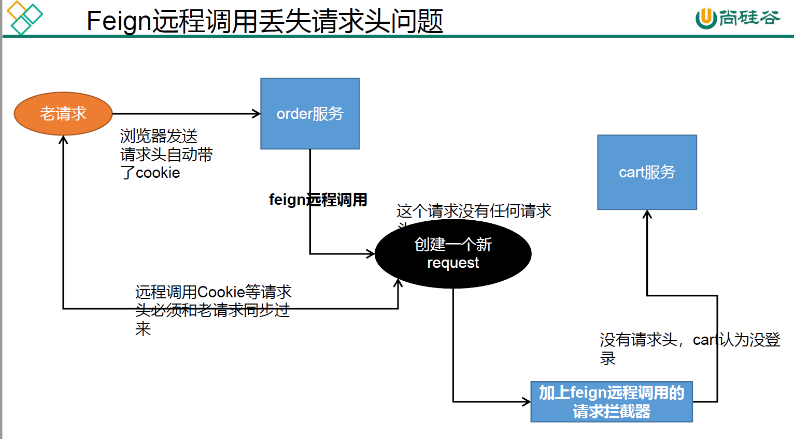

# 1、Feign远程调用丢失请求头问题

浏览器发送一个请求，会自动带上cookie中的数据给order服务，然后order服务远程调用cart服务的方法的时候，会创建一个新的请求，但是这个请求中没有请求头（**feign在远程调用的时候，会重新包装请求（请求路径，请求参数），但是不会携带请求头**），因此cart服务会自动认为没有登录

因此我们需要配置一个远程调用的拦截器，在远程调用的时候，通过调用feign远程调用的拦截器，将请求的cookie等请求头进行同步，放入创建的新请求中，这样就能防止feign远程掉用丢失请求头问题

**注意：**

feign远程调用拦截器里面用的**RequestContextHolder**，这个是spring提供获取请求上下文的包装类，**对ThreadLocal进行了封装**，在同一线程里面能共享数据，因此就引入了一个新的问题，那就是如果order服务的方法使用了异步编排的方式进行编码，也就是使用了多线程，这个拦截器就不起作用了。

```java
public Object invoke(Object proxy, Method method, Object[] args) throws Throwable {
    if (!"equals".equals(method.getName())) {
        if ("hashCode".equals(method.getName())) {
            return this.hashCode();
        } else {
            return "toString".equals(method.getName()) ? this.toString() : ((MethodHandler)this.dispatch.get(method)).invoke(args);
        }
    } else {
        try {
            Object otherHandler = args.length > 0 && args[0] != null ? Proxy.getInvocationHandler(args[0]) : null;
            return this.equals(otherHandler);
        } catch (IllegalArgumentException var5) {
            return false;
        }
    }
}
```

首先判断该方法名是不是equals、hashCode、toString方法，如果是，就不参与远程调用；否则就参与远程调用，使用this.dispatch.ge().invoke方法，进入invoke方法：

```java
@Override
public Object invoke(Object[] argv) throws Throwable {
  RequestTemplate template = buildTemplateFromArgs.create(argv);
  Options options = findOptions(argv);
  Retryer retryer = this.retryer.clone();
  while (true) {
    try {
      return executeAndDecode(template, options);
    } catch (RetryableException e) {
```

重点看这个executeAndDecode方法

```java
Object executeAndDecode(RequestTemplate template, Options options) throws Throwable {
    //feign在调用之前要构造请求，调用很多的拦截器
    //但是传给我们的template中的headers为空，就导致帮我们构造好的request根本就没有请求头
    Request request = targetRequest(template);
    ........
}
```



```java
@Configuration
public class GuliFeignConfig {

    /** 解决Feign远程调用丢失请求体问题*/
    @Bean("requestInterceptor")
    public RequestInterceptor requestInterceptor() {
        return new RequestInterceptor() {
            /** @param template feign里面的新请求 */
            @Override
            public void apply(RequestTemplate template) {
                //RequestContextHolder可以拿到刚进来的这个请求数据，也即调用我们controller下的请求方法当时的一些请求头信息
                ServletRequestAttributes attributes = (ServletRequestAttributes) RequestContextHolder.getRequestAttributes();
                if (attributes != null) {
                    HttpServletRequest request = attributes.getRequest();//获取到当前请求的对象，也即老请求
                    if (request != null) {
                        //把获取到的请求对象的头信息都同步进来,主要同步cookie，
                        String cookie = request.getHeader("Cookie");
                        ////给新请求同步了老请求的头信息，这样最终远程调用的时候，
                        template.header("Cookie", cookie);
                        System.out.println("feign远程之前先进行RequestInterceptor.apply()");
                    }
                }
            }
        };
    }
}
```

