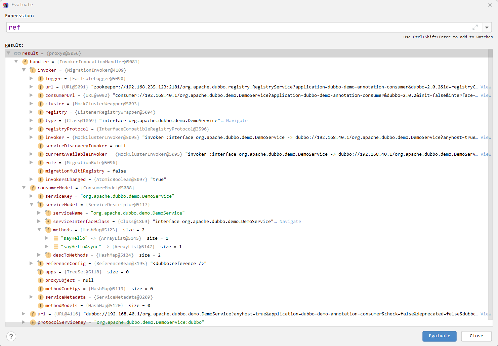

# 待做事项

- [ ] 自适应SPI
- [ ] 消费者MockClusterInvoker，服务降级、集群管理、多个invoker合并成一个的过程
- [ ] 服务端的ServerNetty、
- [ ] 客户端的ClientNetty
- [ ] 同步转异步
- [ ] 服务降级
- [ ] 服务路由
- [ ] 负载均衡
- [ ] 集群容错

# 第一章 基本使用

**版本：2.7.7**

对于dubbo，一般采用zookeeper作为注册中心

```xml
<!-- dubbo起步依赖 -->
<dependency>
    <groupId>org.apache.dubbo</groupId>
    <artifactId>dubbo</artifactId>
    <version>2.7.16</version>
</dependency>
<!-- zookeeper客户端实现-->
<dependency>
    <groupId>org.apache.curator</groupId>
    <artifactId>curator-framework</artifactId>
    <version>4.3.0</version>
</dependency>
<!--zookeeper客户端实现-->
<dependency>
    <groupId>org.apache.curator</groupId>
    <artifactId>curator-recipes</artifactId>
    <version>4.3.0</version>
</dependency>
```


> 什么是RPC

> 有了HTTP为什么还需要RPC

# 第二章 Dubbo SPI

SPI全称`Service Provider Interface`，是一种服务发现机制。它的本质是将接口的实现类的全限定名称配置在文件中，并且由服务加载器读取配置文件，加载实现类。这样在运行的时候就可以动态的为接口替换实现类。比如我们实现RPC的时候需要序列化机制，不同的数据需要不同的序列化机制，就可以通过SPI机制来更换，从而不需要修改源代码，有点类似于IOC思想，目的是为了解耦。

但是如果一个接口配置了多个实现类，SPI机制会将这些实现类统一进行加载，使用遍历的方式。对于不想用的类，也会被加载并实例化，造成浪费。

Dubbo的SPI对Java的SPI进行了加强，详情见后续分析。

- 解决了JavaSPI初始化时加载全部扩展类的缺陷，采取按需加载机制。
- 增加对扩展点的IOC和AOP支持。
- 增加缓存存储实例，提高读取性能

## 2.1 测试样例

项目结构如图所示：


代码如下：

```java
package top.noaharno.dubbo.spi;

import org.apache.dubbo.common.extension.SPI;

@SPI
public interface Animal {
    void sayHello();
}

public class Chicken implements Animal {
    public void sayHello() {
        System.out.println("Hello, I am Chicken");
    }
}

public class Duck implements Animal {
    public void sayHello() {
        System.out.println("Hello, I am Duck");
    }
}
```

SPI配置文件：

```
chicken = top.noaharno.dubbo.spi.Chicken
duck = top.noaharno.dubbo.spi.Duck
```

测试代码：

```java
public static void main(String[] args) {
    ExtensionLoader<Animal> extensionLoader = ExtensionLoader.getExtensionLoader(Animal.class);
    Animal chicken = extensionLoader.getExtension("chicken");
    chicken.sayHello();
    Animal duck = extensionLoader.getExtension("duck");
    duck.sayHello();
}
```

运行结果：


## 2.2 源码分析

### getExtensionLoader

首先是`ExtensionLoader.getExtensionLoader(Animal.class)`，这个总体来说就是从一个ConcurrentHashMap缓存中找到Animal类对应的ExtensionLoader，如果不存在，就创建一个并返回。

```java
// 用于存放ExtensionLoader和Class的联系
private static final ConcurrentMap<Class<?>, ExtensionLoader<?>> EXTENSION_LOADERS = new ConcurrentHashMap<>(64);

public static <T> ExtensionLoader<T> getExtensionLoader(Class<T> type) {
    if (type == null) {
        throw new IllegalArgumentException("Extension type == null");
    }
    if (!type.isInterface()) {
        throw new IllegalArgumentException("Extension type (" + type + ") is not an interface!");
    }
    if (!withExtensionAnnotation(type)) {
        throw new IllegalArgumentException("Extension type (" + type +
                                           ") is not an extension, because it is NOT annotated with @" + SPI.class.getSimpleName() + "!");
    }

    ExtensionLoader<T> loader = (ExtensionLoader<T>) EXTENSION_LOADERS.get(type);
    if (loader == null) {
        EXTENSION_LOADERS.putIfAbsent(type, new ExtensionLoader<T>(type));
        loader = (ExtensionLoader<T>) EXTENSION_LOADERS.get(type);
    }
    return loader;
}
```

### getExtension

那如何使用指定类对应的ExtensionLoader获取到指定的实例呢？我们深入分析代码`extensionLoader.getExtension("chicken")`

ExtensionLoader.class：

```java
public T getExtension(String name) {
    return getExtension(name, true);
}

public T getExtension(String name, boolean wrap) {
    if (StringUtils.isEmpty(name)) {
        throw new IllegalArgumentException("Extension name == null");
    }
    if ("true".equals(name)) {
        // 用于获取默认的拓展实现类
        return getDefaultExtension();
    }
    // Holder：用于持有目标对象
    // 所有的Holder实际上使用一个map存取
    // private final ConcurrentMap<String, Holder<Object>> cachedInstances = 
       //                          new ConcurrentHashMap<>();
    // 如果不存在相关的holder，就创建并返回
    // dubbo实际上将扩展类封装在Holder类中。
    final Holder<Object> holder = getOrCreateHolder(name);
    Object instance = holder.get();
    // 双端检锁机制确保线程安全
    if (instance == null) {
        synchronized (holder) {
            instance = holder.get();
            if (instance == null) {
                // 创建扩展，核心逻辑
                instance = createExtension(name, wrap);
                holder.set(instance);
            }
        }
    }
    return (T) instance;
}
```

### getDefaultExtension

核心代码：

```java
private void cacheDefaultExtensionName() {
    // 拿到Aminal接口上的SPI注解
    final SPI defaultAnnotation = type.getAnnotation(SPI.class);
    if (defaultAnnotation == null) {
        return;
    }
    // 看SPI注解有没有使用value值来标注默认扩展点
    String value = defaultAnnotation.value();
    // 只能允许value值配置一个，超过一个则报错
    if ((value = value.trim()).length() > 0) {
        String[] names = NAME_SEPARATOR.split(value);
        if (names.length > 1) {
            throw new IllegalStateException("More than 1 default extension name on extension " + type.getName()
                    + ": " + Arrays.toString(names));
        }
        if (names.length == 1) {
            cachedDefaultName = names[0];
        }
    }
}
```

总结：如果我们使用`extensionLoader.getExtension`的时候，传入的参数是true，则会使用默认的扩展，但是需要在@SPI注解中指明默认的扩展是哪个。

### createExtension

创建扩展：

```java
private T createExtension(String name, boolean wrap) {
    // 从配置文件中加载所有的扩展类，得到配置项名称和配置类的映射关系
    Class<?> clazz = getExtensionClasses().get(name);
    if (clazz == null || unacceptableExceptions.contains(name)) {
        throw findException(name);
    }
    try {
        // 从缓存中查看有没有对应的实例
        // private static final ConcurrentMap<Class<?>, Object> EXTENSION_INSTANCES = new ConcurrentHashMap<>(64);
        T instance = (T) EXTENSION_INSTANCES.get(clazz);
        if (instance == null) {
            // 使用反射创建实例
            EXTENSION_INSTANCES.putIfAbsent(clazz, clazz.getDeclaredConstructor().newInstance());
            instance = (T) EXTENSION_INSTANCES.get(clazz);
        }
        // 向实例中注入依赖  Dubbo的IOC容器部分
        injectExtension(instance);


        if (wrap) {

            // 包装类修饰
            List<Class<?>> wrapperClassesList = new ArrayList<>();
            // cachedWrapperClasses 用来存放包装类扩展类的实例缓存
            if (cachedWrapperClasses != null) {
                wrapperClassesList.addAll(cachedWrapperClasses);
                wrapperClassesList.sort(WrapperComparator.COMPARATOR);
                Collections.reverse(wrapperClassesList);
            }
            // 如果是包装类，那么该list就不会为null
            if (CollectionUtils.isNotEmpty(wrapperClassesList)) {
                // 循环创建Wrapper实例
                for (Class<?> wrapperClass : wrapperClassesList) {
                    Wrapper wrapper = wrapperClass.getAnnotation(Wrapper.class);
                    if (wrapper == null
                        || (ArrayUtils.contains(wrapper.matches(), name) && !ArrayUtils.contains(wrapper.mismatches(), name))) {
                        // 这里是包装逻辑
                        // 将当前 instance 作为参数传给 Wrapper 的构造方法，并通过反射创建 Wrapper 实例。
                        // 然后向 Wrapper 实例中注入依赖，最后将 Wrapper 实例再次赋值给 instance 变量
                        // 理解为装饰器模式，在原有的普通扩展点上进行增强，在RPC服务发现与调用的时候可以体现
                        // 有点类似于AOP思想
                        instance = injectExtension((T) wrapperClass.getConstructor(type).newInstance(instance));
                    }
                }
            }
        }

        initExtension(instance);
        return instance;
    } catch (Throwable t) {
        throw new IllegalStateException("Extension instance (name: " + name + ", class: " +
                                        type + ") couldn't be instantiated: " + t.getMessage(), t);
    }
}
```

1. 通过getExtensionClasses获取该接口所有的扩展类，并获取name对应的扩展类clazz
2. 通过反射创建clazz的实例对象
3. 向拓展对象中注入依赖（IOC）
4. 将拓展对象包裹在相应的Wrapper对象中（AOP）

### getExtensionClasses

获取所有的扩展类

```java
private Map<String, Class<?>> getExtensionClasses() {
    Map<String, Class<?>> classes = cachedClasses.get();
    if (classes == null) {
        synchronized (cachedClasses) {
            classes = cachedClasses.get();
            if (classes == null) {
                classes = loadExtensionClasses();
                cachedClasses.set(classes);
            }
        }
    }
    return classes;
}
```

从缓存中查找，如果没有就进行创建

### loadExtensionClasses

```java
private Map<String, Class<?>> loadExtensionClasses() {
    // 这个就是getDefaultExtension的核心逻辑，查看SPI注解上的value值
    cacheDefaultExtensionName();

    Map<String, Class<?>> extensionClasses = new HashMap<>();

    // 策略模式
    // DubboInternalLoadingStrategy => META-INF/dubbo/internal/
    //DubboLoadingStrategy => META-INF/dubbo/
    //ServicesLoadingStrategy => META-INF/services/
    for (LoadingStrategy strategy : strategies) {
        loadDirectory(extensionClasses, strategy.directory(), type.getName(), strategy.preferExtensionClassLoader(),
                      strategy.overridden(), strategy.excludedPackages());
        loadDirectory(extensionClasses, strategy.directory(), type.getName().replace("org.apache", "com.alibaba"),
                      strategy.preferExtensionClassLoader(), strategy.overridden(), strategy.excludedPackages());
    }

    return extensionClasses;
}
```


每种加载策略都指定了不同的加载路径

### loadDirectory

```java
private void loadDirectory(Map<String, Class<?>> extensionClasses, String dir, String type,
                           boolean extensionLoaderClassLoaderFirst, boolean overridden, String... excludedPackages) {
    // 将相对路径和全限定类名作为文件路径
    // META-INF\dubbo\ + top.noaharno.dubbo.spi.Animal
    String fileName = dir + type;
    try {
        Enumeration<java.net.URL> urls = null;
        ClassLoader classLoader = findClassLoader();

        // try to load from ExtensionLoader's ClassLoader first
        // 尝试从ExtensionLoader的类加载器加载，默认为false
        if (extensionLoaderClassLoaderFirst) {
            ClassLoader extensionLoaderClassLoader = ExtensionLoader.class.getClassLoader();
            if (ClassLoader.getSystemClassLoader() != extensionLoaderClassLoader) {
                urls = extensionLoaderClassLoader.getResources(fileName);
            }
        }

        if (urls == null || !urls.hasMoreElements()) {
            if (classLoader != null) {
                // 根据文件路径获取文件
                urls = classLoader.getResources(fileName);
            } else {
                urls = ClassLoader.getSystemResources(fileName);
            }
        }

        if (urls != null) {
            while (urls.hasMoreElements()) {
                // 对文件中的内容进行逐条加载资源
                java.net.URL resourceURL = urls.nextElement();
                loadResource(extensionClasses, classLoader, resourceURL, overridden, excludedPackages);
            }
        }
    } catch (Throwable t) {
        logger.error("Exception occurred when loading extension class (interface: " +
                type + ", description file: " + fileName + ").", t);
    }
}
```

总结：该方法主要是拼接好需要加载的文件的文件路径，然后根据文件路径获取到文件之后，调用loadResource进行逐条加载

### loadResource

```java
private void loadResource(Map<String, Class<?>> extensionClasses, ClassLoader classLoader,
                          java.net.URL resourceURL, boolean overridden, String... excludedPackages) {
    try {
        // 创建流，读取文件中的内容
        try (BufferedReader reader = new BufferedReader(new InputStreamReader(resourceURL.openStream(), StandardCharsets.UTF_8))) {
            String line;
            String clazz = null;
            while ((line = reader.readLine()) != null) {
                final int ci = line.indexOf('#');
                if (ci >= 0) {
                    line = line.substring(0, ci);
                }
                line = line.trim();
                if (line.length() > 0) {
                    try {
                        String name = null;
                        // 以 = 进行分割
                        int i = line.indexOf('=');
                        if (i > 0) {
                            name = line.substring(0, i).trim();
                            clazz = line.substring(i + 1).trim();
                        } else {
                            clazz = line;
                        }
                        if (StringUtils.isNotEmpty(clazz) && !isExcluded(clazz, excludedPackages)) {
                            // 加载类，利用反射预加载上面读取到的全限定类名
                            loadClass(extensionClasses, resourceURL, Class.forName(clazz, true, classLoader), name, overridden);
                        }
                    } catch (Throwable t) {
                        IllegalStateException e = new IllegalStateException(
                            "Failed to load extension class (interface: " + type + ", class line: " + line + ") in " + resourceURL +
                            ", cause: " + t.getMessage(), t);
                        exceptions.put(line, e);
                    }
                }
            }
        }
    } catch (Throwable t) {
        logger.error("Exception occurred when loading extension class (interface: " +
                     type + ", class file: " + resourceURL + ") in " + resourceURL, t);
    }
}
```

### loadClass

```java
private void loadClass(Map<String, Class<?>> extensionClasses, java.net.URL resourceURL, Class<?> clazz, String name,
                       boolean overridden) throws NoSuchMethodException {
    // 扩展类对象必须是扩展点接口的子类
    if (!type.isAssignableFrom(clazz)) {
        throw new IllegalStateException("Error occurred when loading extension class (interface: " +
                type + ", class line: " + clazz.getName() + "), class "
                + clazz.getName() + " is not subtype of interface.");
    }
    // 如果是自适应扩展点
    if (clazz.isAnnotationPresent(Adaptive.class)) {
        cacheAdaptiveClass(clazz, overridden);
    } else if (isWrapperClass(clazz)) {
           // 判断扩展点构造函数中是否有参数是当前扩展接口类型
        // 如果有，则为包装装饰类，将cachedWrapperClasses变量添加到当前clazz
        cacheWrapperClass(clazz);
    } else {
        // 普通的扩展点逻辑
        // 使用默认的构造函数
        clazz.getConstructor();
        // 如果写配置文件的时候name为空，就判断类上是否有@Extension注解
        // 并且解析注解的value属性
        // 如果没有该注解就用类的小写名称作为name
        if (StringUtils.isEmpty(name)) {
            name = findAnnotationName(clazz);
            if (name.length() == 0) {
                throw new IllegalStateException(
                        "No such extension name for the class " + clazz.getName() + " in the config " + resourceURL);
            }
        }

        String[] names = NAME_SEPARATOR.split(name);
        if (ArrayUtils.isNotEmpty(names)) {
            // 如果类中有@Activate注解
            // 将name和注解对象缓存在cacheActivateClass变量中
            cacheActivateClass(clazz, names[0]);
            for (String n : names) {
                // 缓存
                cacheName(clazz, n);
                // 将最后拿到得到扩展类放入map中
                saveInExtensionClass(extensionClasses, clazz, n, overridden);
            }
        }
    }
}
```

- 如果类中有`@Adaptive`注解，则将clazz放入`cachedAdaptiveClass`变量中，表示此类为自适应扩展类
- 如果类的函数参数是扩展点接口类型的，将其将入`cachedWrapperClasses`变量，表示此类为包装装饰类
- 如果上述两点都不满足，代表此类为普通扩展类，将其放入`extensionClasses`中，后续从该Map中获取

一般而言，扩展点都是普通的扩展点，可以从extensionClasses中获取，最终放入cachedClasses中。

### injectExtension（Dubbo IOC）

```java
private T injectExtension(T instance) {

    // ExtensionFactory，
    // 实现的有SpiExtensionFactory、SpringExtensionFactory、AdaptiveExtensionFactory
    if (objectFactory == null) {
        return instance;
    }

    try {
        // 反射获得该类的所有的方法，并进行遍历
        // 以chicken为例
        for (Method method : instance.getClass().getMethods()) {
            if (!isSetter(method)) {
                continue;
            }
            // 比如时setter方法才能往下走
            // 判断逻辑：
            // - startWith("set")
            // - 方法参数只有一个 getParameterTypes.length() == 1
            // - Modifier.isPublic 必须是public方法

            /*
             * Check {@link DisableInject} to see if we need autowire injection for this property
             */

            /// 如果该方法不需要自动注入就跳过
            if (method.getAnnotation(DisableInject.class) != null) {
                continue;
            }

            // 获得该方法参数的clazz
            Class<?> pt = method.getParameterTypes()[0];
            if (ReflectUtils.isPrimitives(pt)) {
                continue;
            }

            /*
             * Check {@link Inject} to see if we need auto-injection for this property
             * {@link Inject#enable} == false will skip inject property phase
             * {@link Inject#InjectType#ByName} default inject by name
             */
            // 获取需要注入的属性
            // 比如setVersion，获取属性version
            String property = getSetterProperty(method);
            Inject inject = method.getAnnotation(Inject.class);
            if (inject == null) {
                injectValue(instance, method, pt, property);
            } else {
                if (!inject.enable()) {
                    continue;
                }

                if (inject.type() == Inject.InjectType.ByType) {
                    injectValue(instance, method, pt, null);
                } else {
                    injectValue(instance, method, pt, property);
                }
            }
        }
    } catch (Exception e) {
        logger.error(e.getMessage(), e);
    }
    return instance;
}
```

如果需要IOC，也就是需要setter，就会使用`objectFactory.getExtension(pt, property)`来获取对象并进行注入。

- 如果该类/接口上有@SPI注解，就通过SpiExtensionFactory来获取对象
- 如果没有，就通过SpringExtensionFactory来获得该类的实例。

AdaptiveExtensionFactory中维护了一个list，里面就含有上述两个ExtensionFactory，当调用objectFactory.getExtension方法获取某个类的实例的时候，就会挨个尝试使用这两个类来获取指定的实例。

## 2.3 小总结

> Dubbo SPI的具体流程

- 使用`ExtensionLoader.getExtensionLoader(Animal.class)`获取指定接口的extensionLoader
- 通过上一步获得的extensionLoader，调用getExtension方法去实例化自己想要的类。
- 在实例化之前，它会先逐行解析指定文件路径，获取并保存该文件所有的name和class映射关系
- 我们拿到我们想要的name和它的clazz，使用反射进行实例化
- 在实例完成之后会进行依赖注入（只能通过setter方式，如果有的话），这里就是Dubbo IOC
- 而且如果该类是包装类，还可以进行类的增强，也就是AOP部分

> Dubbo IOC

在Dubbo中，无论是通过name获取指定扩展类，还是自适应扩展，都会在创建完实例之后，进行一次依赖注入，这个过程就是IOC机制。

# （TODO）第三章 自适应扩展SPI

# 第四章 服务导出（暴露）

## 4.1 初始说明

一般而言，我们使用Dubbo和Spring进行整合。

在2.7.16的Dubbo中，有一个类`DubboBootstrapApplicationListener`用来监听容器刷新和关闭的事件。当它监听到`ContextRefreshedEvent`的时候，就会调用`DubboBootstrap`的start方法，这个方法里面就实现了服务暴露的核心逻辑。

注：在Dubbo2.6x的版本的时候，使用的是ServiceBean类来监听相关的事件，而且只是监听容器刷新事件来暴露服务，而不负责服务的关闭清理。

注：如果是和SpringBoot整合，就会通过`DubboAutoConfiguration`向springboot上下文中注入该类，从而进行监听

```java
public class DubboBootstrapApplicationListener extends OnceApplicationContextEventListener implements Ordered {

    /**
     * The bean name of {@link DubboBootstrapApplicationListener}
     *
     * @since 2.7.6
     */
    public static final String BEAN_NAME = "dubboBootstrapApplicationListener";

    private final DubboBootstrap dubboBootstrap;

    // 在构造器里面就已经初始化了DubboBootstrap
    public DubboBootstrapApplicationListener() {
        this.dubboBootstrap = DubboBootstrap.getInstance();
    }

    public DubboBootstrapApplicationListener(ApplicationContext applicationContext) {
        super(applicationContext);
        this.dubboBootstrap = DubboBootstrap.getInstance();
        DubboBootstrapStartStopListenerSpringAdapter.applicationContext = applicationContext;
    }

    @Override
    public void onApplicationContextEvent(ApplicationContextEvent event) {
        if (DubboBootstrapStartStopListenerSpringAdapter.applicationContext == null) {
            DubboBootstrapStartStopListenerSpringAdapter.applicationContext = event.getApplicationContext();
        }
        // 监听容器刷新事件
        if (event instanceof ContextRefreshedEvent) {
            onContextRefreshedEvent((ContextRefreshedEvent) event);
        } else if (event instanceof ContextClosedEvent) {
            // 监听容器关闭事件
            onContextClosedEvent((ContextClosedEvent) event);
        }
    }

    private void onContextRefreshedEvent(ContextRefreshedEvent event) {
        // 调用start方法，接下来正是开始服务暴露过程
        dubboBootstrap.start();
    }

    private void onContextClosedEvent(ContextClosedEvent event) {
        DubboShutdownHook.getDubboShutdownHook().run();
    }

    @Override
    public int getOrder() {
        return LOWEST_PRECEDENCE;
    }
}
```

## 4.2 源码分析

### start

对于Dubbo服务的启动，大体分为两个步骤：**Dubbo的初始化以及服务暴露**

```java
public DubboBootstrap start() {
    // 这个started是一个标志位，表示服务启动
    if (started.compareAndSet(false, true)) {
        destroyed.set(false);
        ready.set(false);
        // 核心逻辑 --- 初始化
        initialize();
        if (logger.isInfoEnabled()) {
            logger.info(NAME + " is starting...");
        }
        // 1. export Dubbo Services
        // 核心逻辑 --- 暴露服务
        exportServices();

        // Not only provider register
        if (!isOnlyRegisterProvider() || hasExportedServices()) {
            // 2. export MetadataService
            exportMetadataService();
            //3. Register the local ServiceInstance if required
            registerServiceInstance();
        }

        // 处理Consumer的ReferenceConfig
        referServices();
        if (asyncExportingFutures.size() > 0) {
            new Thread(() -> {
                try {
                    this.awaitFinish();
                } catch (Exception e) {
                    logger.warn(NAME + " exportAsync occurred an exception.");
                }
                ready.set(true);
                if (logger.isInfoEnabled()) {
                    logger.info(NAME + " is ready.");
                }
                ExtensionLoader<DubboBootstrapStartStopListener> exts = getExtensionLoader(DubboBootstrapStartStopListener.class);
                exts.getSupportedExtensionInstances().forEach(ext -> ext.onStart(this));
            }).start();
        } else {
            ready.set(true);
            if (logger.isInfoEnabled()) {
                logger.info(NAME + " is ready.");
            }
            ExtensionLoader<DubboBootstrapStartStopListener> exts = getExtensionLoader(DubboBootstrapStartStopListener.class);
            exts.getSupportedExtensionInstances().forEach(ext -> ext.onStart(this));
        }
        if (logger.isInfoEnabled()) {
            logger.info(NAME + " has started.");
        }
    }
    return this;
}
```

### DubboBootstrap#initialize()

```java
public void initialize() {
    if (!initialized.compareAndSet(false, true)) {
        return;
    }
    // 初始化框架的扩展
    ApplicationModel.initFrameworkExts();
    // 初始化配置中心，使用ConfigManager，它管理着Dubbo应用的所有配置类
    // 刷新配置，设置一些系统的环境变量
    startConfigCenter();
    // 加载远程的配置
    loadRemoteConfigs();
    // 加载全局的配置
    checkGlobalConfigs();
    // 初始化元数据中心
    // @since 2.7.8
    startMetadataCenter();
    // 初始化元数据操作接口
    initMetadataService();

    if (logger.isInfoEnabled()) {
        logger.info(NAME + " has been initialized!");
    }
}
```

### DubboBootstrap#exportServices()

```java
private void exportServices() {
    // 从configManager中获取所有的ServiceConfig实例，挨个遍历暴露
    // 获取到的其实是ServiceBean，它继承了ServiceConfig
    // 也就是说，其实我们想要暴露的服务，会先封装成ServiceConfig进行后续的处理
    configManager.getServices().forEach(sc -> {
        // TODO, compatible with ServiceConfig.export()
        ServiceConfig serviceConfig = (ServiceConfig) sc;
        serviceConfig.setBootstrap(this);

        // 如果是异步暴露
        if (exportAsync) {
            // 使用线程池来异步执行暴露逻辑
            ExecutorService executor = executorRepository.getServiceExporterExecutor();
            Future<?> future = executor.submit(() -> {
                try {
                    exportService(serviceConfig);
                } catch (Throwable t) {
                    logger.error("export async catch error : " + t.getMessage(), t);
                }
            });
            asyncExportingFutures.add(future);
        } else {
            // 同步的暴露服务
            exportService(serviceConfig);
        }
    });
}
```

### DubboBootstrap#exportService

这个方法会执行ServiceConfig实现的暴露方法，结束后将暴露后的方法添加到`exportedServices`中。

```java
private void exportService(ServiceConfig sc) {
    if (exportedServices.containsKey(sc.getServiceName())) {
        throw new IllegalStateException("There are multiple ServiceBean instances with the same service name: [" +
                                        sc.getServiceName() + "], instances: [" +
                                        exportedServices.get(sc.getServiceName()).toString() + ", " +
                                        sc.toString() + "]. Only one service can be exported for the same triple (group, interface, version), " +
                                        "please modify the group or version if you really need to export multiple services of the same interface.");
    }
    sc.export();
    exportedServices.put(sc.getServiceName(), sc);
}
```

### ServiceConfig#export

```java
@Override
public synchronized void export() {
    if (bootstrap == null) {
        bootstrap = DubboBootstrap.getInstance();
        // compatible with api call.
        if (null != this.getRegistry()) {
            bootstrap.registries(this.getRegistries());
        }
        bootstrap.initialize();
    }

    checkAndUpdateSubConfigs();

    // 初始化服务的元数据信息
    /*
        serviceMetadata.setVersion(getVersion(interfaceConfig));
        serviceMetadata.setGroup(getGroup(interfaceConfig));
        serviceMetadata.setDefaultGroup(getGroup(interfaceConfig));
        serviceMetadata.setServiceInterfaceName(getInterface());
    */
    initServiceMetadata(provider);
    serviceMetadata.setServiceType(getInterfaceClass());
    serviceMetadata.setTarget(getRef());
    serviceMetadata.generateServiceKey();

    if (!shouldExport()) {
        return;
    }

    // 判断是否是延时export
    if (shouldDelay()) {
        // 如果是延时，就使用时间调度器延迟执行服务暴露逻辑
        DELAY_EXPORT_EXECUTOR.schedule(() -> {
            try {
                // Delay export server should print stack trace 
                // if there are exception occur.
                this.doExport();
            } catch (Exception e) {
                logger.error("delay export server occur exception, please check it.", e);
            }
        }, getDelay(), TimeUnit.MILLISECONDS);
    } else {
        // 直接暴露服务
        doExport();
    }
    // 发布ServiceConfigExportedEvent事件
    exported();
}
```

### ServiceConfig#doExport

```java
protected synchronized void doExport() {
    if (unexported) {
        throw new IllegalStateException("The service " + interfaceClass.getName() + " has already unexported!");
    }
    if (exported) {
        return;
    }
    exported = true;

    // path为接口的全限定名
    // org.apache.dubbo.demo.DemoService
    if (StringUtils.isEmpty(path)) {
        path = interfaceName;
    }
    // 核心逻辑
    doExportUrls();
    bootstrap.setReady(true);
}
```

### ServiceConfig#doExportUrls()

暴露核心逻辑的开始

```java
// 一个ServiceConfig可能同时以多个协议暴露
private void doExportUrls() {
    // ApplicationModel是整个Dubbo容器
    ServiceRepository repository = ApplicationModel.getServiceRepository();
    ServiceDescriptor serviceDescriptor = repository.registerService(getInterfaceClass());
    // 将服务提供者的信息存放到服务仓库中
    repository.registerProvider(
        getUniqueServiceName(),
        ref,
        serviceDescriptor,
        this,
        serviceMetadata
    );

    // 获取服务注册中心的URL地址信息，
    // 一个服务可以同时在多个注册中心中注册，因此是List
    // 我们这里以zookeeper作为注册中心
    // registry://192.168.235.123:2181/org.apache.dubbo.registry.RegistryService?application=dubbo-demo-annotation-provider&dubbo=2.0.2&id=registryConfig&pid=30512&registry=zookeeper&release=2.7.16&timestamp=1658286276739
    List<URL> registryURLs = ConfigValidationUtils.loadRegistries(this, true);
    // 遍历服务要暴露的协议集合，一个服务可能同时以不同协议暴露，比如dubbo协议、http协议等
    // 一般默认dubbo
    int protocolConfigNum = protocols.size();
    for (ProtocolConfig protocolConfig : protocols) {
        String pathKey = URL.buildKey(getContextPath(protocolConfig)
                                      .map(p -> p + "/" + path)
                                      .orElse(path), group, version);
        // In case user specified path, register service one more time to map it to path.
        repository.registerService(pathKey, interfaceClass);
        // 针对一个协议，在一个或多个注册中心暴露这个服务
        doExportUrlsFor1Protocol(protocolConfig, registryURLs, protocolConfigNum);
    }
}
```

如图所示：服务仓库ServiceRepository中存放了我们需要暴露的服务


### ServiceConfig#doExportUrlsFor1Protocol()

```java
private void doExportUrlsFor1Protocol(ProtocolConfig protocolConfig, List<URL> registryURLs, int protocolConfigNum) {
    // 获取协议名称 dubbo
    String name = protocolConfig.getName();
    if (StringUtils.isEmpty(name)) {
        name = DUBBO;
    }
    // 进行参数的组装
    Map<String, String> map = new HashMap<String, String>();
    map.put(SIDE_KEY, PROVIDER_SIDE);

    // 这里省略所有的参数组装过程

    //init serviceMetadata attachments
    serviceMetadata.getAttachments().putAll(map);

    // export service 构建URL实例
    String host = findConfigedHosts(protocolConfig, registryURLs, map);
    Integer port = findConfigedPorts(protocolConfig, name, map, protocolConfigNum);
    URL url = new URL(name, host, port, getContextPath(protocolConfig).map(p -> p + "/" + path).orElse(path), map);
    // url：
    // dubbo://192.168.40.1:20880/org.apache.dubbo.demo.DemoService?anyhost=true&application=dubbo-demo-annotation-provider&bind.ip=192.168.40.1&bind.port=20880&deprecated=false&dubbo=2.0.2&dynamic=true&generic=false&interface=org.apache.dubbo.demo.DemoService&metadata-type=remote&methods=sayHello,sayHelloAsync&pid=10772&release=2.7.16&service.name=ServiceBean:/org.apache.dubbo.demo.DemoService&side=provider&timestamp=1658291601742

    // You can customize Configurator to append extra parameters
    if (ExtensionLoader.getExtensionLoader(ConfiguratorFactory.class)
        .hasExtension(url.getProtocol())) {
        url = ExtensionLoader.getExtensionLoader(ConfiguratorFactory.class)
            .getExtension(url.getProtocol()).getConfigurator(url).configure(url);
    }
    // 获取scope，如果配置的scope是none或者没有配置就不暴露服务
    String scope = url.getParameter(SCOPE_KEY);
    // don't export when none is configured
    if (!SCOPE_NONE.equalsIgnoreCase(scope)) {

        // 本地暴露
        if (!SCOPE_REMOTE.equalsIgnoreCase(scope)) {
            exportLocal(url);
        }
        // 远程暴露
        if (!SCOPE_LOCAL.equalsIgnoreCase(scope)) {
            if (CollectionUtils.isNotEmpty(registryURLs)) {
                // 挨个遍历已经配置了的注册中心的地址
                // 一个一个暴露
                // 一个协议（默认是dubbo）可以暴露到多个注册中心
                for (URL registryURL : registryURLs) {

                    if (SERVICE_REGISTRY_PROTOCOL.equals(registryURL.getProtocol())) {
                        url = url.addParameterIfAbsent(SERVICE_NAME_MAPPING_KEY, "true");
                    }
                    // 如果协议是injvm，就不需要暴露，在同一个jvm内的服务
                    if (LOCAL_PROTOCOL.equalsIgnoreCase(url.getProtocol())) {
                        continue;
                    }// 添加dynamic参数配置
                    url = url.addParameterIfAbsent(DYNAMIC_KEY, registryURL.getParameter(DYNAMIC_KEY));
                    // 添加监控中心url配置，可选
                    URL monitorUrl = ConfigValidationUtils.loadMonitor(this, registryURL);
                    if (monitorUrl != null) {
                        url = url.addParameterAndEncoded(MONITOR_KEY, monitorUrl.toFullString());
                    }
                    // 省略

                    // For providers, this is used to enable custom proxy
                    //         to generate invoker
                    String proxy = url.getParameter(PROXY_KEY);
                    if (StringUtils.isNotEmpty(proxy)) {
                        registryURL = registryURL.addParameter(PROXY_KEY, proxy);
                    }
                    // 使用ProxyFactory来生成接口的代理
                    Invoker<?> invoker = PROXY_FACTORY.getInvoker(ref, (Class) interfaceClass,
                                                                  registryURL.addParameterAndEncoded(EXPORT_KEY, url.toFullString()));
                    // 生成Invoker的包装类，实现了Invoker接口，其本身也是一个Invoker
                    // 只是在Inovker的基础上扩展了ServiceConfig
                    DelegateProviderMetaDataInvoker wrapperInvoker = new DelegateProviderMetaDataInvoker(invoker, this);
                    // 使用Protocol来暴露服务接口到对应的注册中心
                    Exporter<?> exporter = PROTOCOL.export(wrapperInvoker);
                    // 将这个Exporter实例存入ServiceConfig中的exporters属性中
                    exporters.add(exporter);
                }
            } else {
                // 不存在注册中心，仅到处服务
                // 省略
            }

            MetadataUtils.publishServiceDefinition(url);
        }
    }
    this.urls.add(url);
}
```

这个方法注意如下重点：

- 方法的作用是将想要暴露的服务用一个协议（默认是dubbo协议）暴露给一个或多个注册中心
- 当然一个服务也可以使用多个协议，挨个遍历所有协议，每个协议执行一下这个方法
- 暴露分为本地暴露和远程暴露，重点分析远程暴露
- 使用ProxyFactory来生成接口的代理，即将ServiceConfig包装成Invoker
- 将Invoker再包装成wrapperInvoker，即DelegateProviderMetaDataInvoker，它持有Invoker和ServiceConfig
- 使用Protocol来暴露服务接口到对应的注册中心，并生成Exporter

## 4.3 小总结

> 说一说服务暴露的流程

再Dubbo中，有一个类DubboBootstrapApplicationListener，它用来监听Spring容器的刷新和关闭事件。当他监听到容器刷新事件（ContextRefreshedEvent）的时候，就会调用DubboBootstrap的start方法，也就是开启服务暴露流程

首先它会进行一些初始化操作，包括ConfigManager。

然后它就从ConfigManager中拿到所有的想要暴露的服务进行挨个遍历暴露。注意，我们再ConfigManager中存取的服务其实已经被包装成了ServiceBean，它继承了ServiceConfig，也就是说，我们会将我们想要暴露的服务包装成ServiceConfig。

我们拿到所有的配置好了的协议（一般我们只有dubbo）和所有的服务注册中心的URL地址信息。然后挨个遍历服务要暴露的协议集合，然后注入到所有的注册中心中。

- 暴露分为本地暴露和远程暴露，重点分析远程暴露
- 使用ProxyFactory来生成接口的代理，即将ServiceConfig包装成Invoker
- 将Invoker再包装成wrapperInvoker，即DelegateProviderMetaDataInvoker，它持有Invoker和ServiceConfig
- 使用Protocol来暴露服务接口到对应的注册中心，并生成Exporter

**总的来说，服务发布分为两部分：服务注册和服务暴露**

**服务注册就是将提供者主机的服务信息写入到注册中心中；服务暴露就是将服务暴露于外部以让消费者可以直接调用，主要分为四部：形成服务暴露URL、生成服务暴露实例Exporter、通过Netty暴露服务、同步转异步**


> 为什么需要本地暴露？

可能存在同一个JVM内部引用自身服务的情况，就可以避免网络间的通信

## 4.4 Invoker

Invoker是一个非常重要的模型，在提供者和消费者都会出现Invoker。

> Invoker 是实体域，它是 Dubbo 的核心模型，其它模型都向它靠扰，或转换成它，它代表一个可执行体，可向它发起 invoke 调用，它有可能是一个本地的实现，也可能是一个远程的实现，也可能一个集群实现。

Invoker是由ProxyFactory创建而来，Dubbo默认的ProxyFactory实现类是`JavassistProxyFactory`。

封装成invoker其实是想要屏蔽调用的细节，统一暴露出一个可执行体。

### JavassistProxyFactory#getInvoker

```java
@Override
public <T> Invoker<T> getInvoker(T proxy, Class<T> type, URL url) {
    // TODO Wrapper cannot handle this scenario correctly: the classname contains '$'
    // 为目标类创建Wrapper
    final Wrapper wrapper = Wrapper.getWrapper(proxy.getClass().getName().indexOf('$') < 0 ? proxy.getClass() : type);
    // 创建匿名Invoker对象，并实现doInvoke方法
    return new AbstractProxyInvoker<T>(proxy, type, url) {
        @Override
        protected Object doInvoke(T proxy, String methodName,
                                  Class<?>[] parameterTypes,
                                  Object[] arguments) throws Throwable {
            // 调用Wrapper的invokeMethod方法
            // invokeMethod最终会调用目标方法
            return wrapper.invokeMethod(proxy, methodName, parameterTypes, arguments);
        }
    }
```

**也就是说，JavassistProxyFactory创建了一个继承自AbstractProxyInvoker类的匿名对象，并且重写了doInvoke方法。重写后的逻辑只是将调用请求转发给了Wrapper类的invokeMethod方法。**

**Wrapper是一个抽象类，在创建Wrapper子类的时候，子类代码生成逻辑会对getWrapper方法传入的Class对象进行解析，拿到类方法、类成员变量等信息，以及生成invokeMethod方法代码和其他一些方法代码。代码生成完毕之后，通过Javassist生成Class对象，最后通过反射创建Wrapper实例。**

```java
public static Wrapper getWrapper(Class<?> c) {
    while (ClassGenerator.isDynamicClass(c)) 
        // can not wrapper on dynamic class.
    {
        c = c.getSuperclass();
    }

    if (c == Object.class) {
        return OBJECT_WRAPPER;
    }

    return WRAPPER_MAP.computeIfAbsent(c, Wrapper::makeWrapper);
}
```

### Wrapper#makeWrapper

```java
private static Wrapper makeWrapper(Class<?> c) {
    if (c.isPrimitive()) { // 判断是否是基本类型
        throw new IllegalArgumentException("Can not create wrapper for primitive type: " + c);
    }

    String name = c.getName();
    ClassLoader cl = ClassUtils.getClassLoader(c);
    // c1用于存储setPropertyValue方法代码
     // c2用于存储getPropertyValue方法代码
    // c3用于存储invokeMethod方法代码
    StringBuilder c1 = new StringBuilder("public void setPropertyValue(Object o, String n, Object v){ ");
    StringBuilder c2 = new StringBuilder("public Object getPropertyValue(Object o, String n){ ");
    StringBuilder c3 = new StringBuilder("public Object invokeMethod(Object o, String n, Class[] p, Object[] v) throws " + InvocationTargetException.class.getName() + "{ ");
    // 生成类型转换代码以及异常捕获代码
    c1.append(name).append(" w; try{ w = ((").append(name).append(")$1); }catch(Throwable e){ throw new IllegalArgumentException(e); }");
    c2.append(name).append(" w; try{ w = ((").append(name).append(")$1); }catch(Throwable e){ throw new IllegalArgumentException(e); }");
    c3.append(name).append(" w; try{ w = ((").append(name).append(")$1); }catch(Throwable e){ throw new IllegalArgumentException(e); }");
    // pts用于存储成员变量名和类型
    Map<String, Class<?>> pts = new HashMap<>(); // <property name, property types>
    // ms用于存储方法描述信息以及Method实例    
    Map<String, Method> ms = new LinkedHashMap<>(); // <method desc, Method instance>
    // mns为方法名列表
    List<String> mns = new ArrayList<>(); // method names.
    // dmns用于存储定义在当前类中的方法的名称
    List<String> dmns = new ArrayList<>(); // declaring method names.

    // 获取public访问级别的字段，并为所有字段生成条件判断语句
    for (Field f : c.getFields()) {
        String fn = f.getName();
        Class<?> ft = f.getType();
        if (Modifier.isStatic(f.getModifiers()) || Modifier.isTransient(f.getModifiers())) {
            continue;
        }
		// 生成条件判断及赋值语句
        // if( $2.equals("name") ) { w.name = (java.lang.String) $3; return;}
        c1.append(" if( $2.equals(\"").append(fn).append("\") ){ w.").append(fn).append("=").append(arg(ft, "$3")).append("; return; }");
        
        // 生成条件判断及返回语句
        // if( $2.equals("name") ) { return ($w)w.name; }
        c2.append(" if( $2.equals(\"").append(fn).append("\") ){ return ($w)w.").append(fn).append("; }");
        // 存储<字段名，字段类型> 键值对到pts中
        pts.put(fn, ft);
    }
    
    
	// 后续逻辑就不分析了
```

## 4.5 Protocol

通过上面的分析，我们通过PROTOCOL.export(wrapperInvoker);将服务暴露给注册中心，然后返回Exporter。

而我们默认使用的Protocol就是**RegistryProtocol**

### RegistryProtocol#export

```java
@Override
public <T> Exporter<T> export(final Invoker<T> originInvoker) throws RpcException {
    // 获取注册中心URL，以zookeeper为例
	//zookeeper://192.168.235.123:2181/org.apache.dubbo.registry.RegistryService?application=dubbo-demo-annotation-provider&dubbo=2.0.2&export=dubbo%3A%2F%2F192.168.40.1%3A20880%2Forg.apache.dubbo.demo.DemoService%3Fanyhost%3Dtrue%26application%3Ddubbo-demo-annotation-provider%26bind.ip%3D192.168.40.1%26bind.port%3D20880%26deprecated%3Dfalse%26dubbo%3D2.0.2%26dynamic%3Dtrue%26generic%3Dfalse%26interface%3Dorg.apache.dubbo.demo.DemoService%26metadata-type%3Dremote%26methods%3DsayHello%2CsayHelloAsync%26pid%3D4832%26release%3D2.7.16%26service.name%3DServiceBean%3A%2Forg.apache.dubbo.demo.DemoService%26side%3Dprovider%26timestamp%3D1658305421214&id=registryConfig&pid=4832&release=2.7.16&timeout=20000&timestamp=1658305421209
    URL registryUrl = getRegistryUrl(originInvoker);
    // url to export locally
    // 获取服务提供者的URL
    // dubbo://192.168.40.1:20880/org.apache.dubbo.demo.DemoService?anyhost=true&application=dubbo-demo-annotation-provider&bind.ip=192.168.40.1&bind.port=20880&deprecated=false&dubbo=2.0.2&dynamic=true&generic=false&interface=org.apache.dubbo.demo.DemoService&metadata-type=remote&methods=sayHello,sayHelloAsync&pid=4832&release=2.7.16&service.name=ServiceBean:/org.apache.dubbo.demo.DemoService&side=provider&timestamp=1658305421214
    URL providerUrl = getProviderUrl(originInvoker);

    // Subscribe the override data
    // FIXME When the provider subscribes, it will affect the scene : a certain JVM exposes the service and call
    //  the same service. Because the subscribed is cached key with the name of the service, it causes the
    //  subscription information to cover.
    final URL overrideSubscribeUrl = getSubscribedOverrideUrl(providerUrl);
    final OverrideListener overrideSubscribeListener = new OverrideListener(overrideSubscribeUrl, originInvoker);
    overrideListeners.put(overrideSubscribeUrl, overrideSubscribeListener);

    providerUrl = overrideUrlWithConfig(providerUrl, overrideSubscribeListener);
    // 导出服务，重点
    final ExporterChangeableWrapper<T> exporter = doLocalExport(originInvoker, providerUrl);

    // url to registry
    final Registry registry = getRegistry(originInvoker);
    final URL registeredProviderUrl = getUrlToRegistry(providerUrl, registryUrl);

    // decide if we need to delay publish
    boolean register = providerUrl.getParameter(REGISTER_KEY, true);
    if (register) {
        // 向注册中心注册服务，重点
        registry.register(registeredProviderUrl);
    }

    // register stated url on provider model
    registerStatedUrl(registryUrl, registeredProviderUrl, register);


    exporter.setRegisterUrl(registeredProviderUrl);
    exporter.setSubscribeUrl(overrideSubscribeUrl);

    // Deprecated! Subscribe to override rules in 2.6.x or before.
    registry.subscribe(overrideSubscribeUrl, overrideSubscribeListener);

    notifyExport(exporter);
    //Ensure that a new exporter instance is returned every time export
    return new DestroyableExporter<>(exporter);
}
```

总体而言分为四部：

1. 调用 doLocalExport 导出服务（重点）
2. 向注册中心注册服务（重点）
3. 向注册中心进行订阅 override 数据
4. 创建并返回 DestroyableExporter

### RegistryProtocol#doLocalExport

```java
private <T> ExporterChangeableWrapper<T> doLocalExport(final Invoker<T> originInvoker, URL providerUrl) {
    // 访问缓存
    String key = getCacheKey(originInvoker);

    return (ExporterChangeableWrapper<T>) bounds.computeIfAbsent(key, s -> {
        // 创建Invoker为委托类对象
        Invoker<?> invokerDelegate = new InvokerDelegate<>(originInvoker, providerUrl);
        // 调用protocol的export方法导出服务
        return new ExporterChangeableWrapper<>((Exporter<T>) protocol.export(invokerDelegate), originInvoker);
    });
}
```

这里调用了protocol.export方法，如果我们的运行时协议是dubbo，那么此处的protocol变量就会在运行时加载DubboProtocol，并调用其export方法

### DubboProtocol#export

```java
@Override
public <T> Exporter<T> export(Invoker<T> invoker) throws RpcException {
    URL url = invoker.getUrl();

    // export service.
    // 获取服务标识，由服务组名（如果有）、服务名、服务版本号（如果有）、端口组成
    // org.apache.dubbo.demo.DemoService:20880
    String key = serviceKey(url);
    // 创建 DubboExporter
    DubboExporter<T> exporter = new DubboExporter<T>(invoker, key, exporterMap);
    exporterMap.addExportMap(key, exporter);

    //export an stub service for dispatching event
    // 本地存根相关代码
    Boolean isStubSupportEvent = url.getParameter(STUB_EVENT_KEY, DEFAULT_STUB_EVENT);
    Boolean isCallbackservice = url.getParameter(IS_CALLBACK_SERVICE, false);
    if (isStubSupportEvent && !isCallbackservice) {
        String stubServiceMethods = url.getParameter(STUB_EVENT_METHODS_KEY);
        if (stubServiceMethods == null || stubServiceMethods.length() == 0) {
            if (logger.isWarnEnabled()) {
                logger.warn(new IllegalStateException("consumer [" + url.getParameter(INTERFACE_KEY) +
                                                      "], has set stubproxy support event ,but no stub methods founded."));
            }

        }
    }

    // 启动服务器
    openServer(url);
    optimizeSerialization(url);

    return exporter;
}
```

### DubboProtocol#openServer

## 4.6 注册到zookeeper细节流程

### 创建注册中心实例

让我们将眼光重新看向RegistryProtocol的export方法中，在里面有如下代码段

```java
// url to registry
// 获得注册中心
final Registry registry = getRegistry(originInvoker);
final URL registeredProviderUrl = getUrlToRegistry(providerUrl, registryUrl);

// decide if we need to delay publish
boolean register = providerUrl.getParameter(REGISTER_KEY, true);
if (register) {
    // 进行注册
    registry.register(registeredProviderUrl);
}
```

这就是将url注册到注册中心的代码。

在获取注册中心实例的方法，即getRegistry中，会利用zookeeper://192.168.235.123:2181/org.apache.dubbo.registry.RegistryService?application=dubbo-demo-annotation-provider&dubbo=2.0.2&export=dubbo%3A%2F%2F192.168.40.1%3A20880%2Forg.apache.dubbo.demo.DemoService这个地址获取实例。

在getRegistry中，会使用**registryFactory.getRegistry(url)**，其中url就是上面这个url，而这里的registryFactory则代表的是**ZookeeperRegistryFactory**

```java
public class ZookeeperRegistryFactory extends AbstractRegistryFactory {

    private ZookeeperTransporter zookeeperTransporter;

    public ZookeeperRegistryFactory() {
        this.zookeeperTransporter = ZookeeperTransporter.getExtension();
    }

    /**
     * Invisible injection of zookeeper client via IOC/SPI
     *
     * @param zookeeperTransporter
     */
    @Inject(enable = false)
    public void setZookeeperTransporter(ZookeeperTransporter zookeeperTransporter) {
        this.zookeeperTransporter = zookeeperTransporter;
    }

    // 这个方法的调用其实相当于模板方法的具体实现
   	// 因为在他的父类AbstractRegistryFactory#getRegistry中
    // 就调用了该方法
    @Override
    public Registry createRegistry(URL url) {
        return new ZookeeperRegistry(url, zookeeperTransporter);
    }

}
```


继续查看**ZookeeperRegistry**：

```java
public ZookeeperRegistry(URL url, ZookeeperTransporter zookeeperTransporter) {
    super(url);
    if (url.isAnyHost()) {
        throw new IllegalStateException("registry address == null");
    }
    String group = url.getParameter(GROUP_KEY, DEFAULT_ROOT);
    if (!group.startsWith(PATH_SEPARATOR)) {
        group = PATH_SEPARATOR + group;
    }
    this.root = group;
    zkClient = zookeeperTransporter.connect(url);
    zkClient.addStateListener((state) -> {
        if (state == StateListener.RECONNECTED) {
            logger.warn("Trying to fetch the latest urls, in case there're provider changes during connection loss.\n" +
                        " Since ephemeral ZNode will not get deleted for a connection lose, " +
                        "there's no need to re-register url of this instance.");
            ZookeeperRegistry.this.fetchLatestAddresses();
        } else if (state == StateListener.NEW_SESSION_CREATED) {
            logger.warn("Trying to re-register urls and re-subscribe listeners of this instance to registry...");
            try {
                ZookeeperRegistry.this.recover();
            } catch (Exception e) {
                logger.error(e.getMessage(), e);
            }
        } else if (state == StateListener.SESSION_LOST) {
            logger.warn("Url of this instance will be deleted from registry soon. " +
                        "Dubbo client will try to re-register once a new session is created.");
        } else if (state == StateListener.SUSPENDED) {

        } else if (state == StateListener.CONNECTED) {

        }
    });
}
```

上述的代码就是Zookeeper注册中心实例的创建，接下来要分析的就是向注册中心注册服务：

### 进行注册

注册的最终逻辑会来到ZookeeperRegistry的doRegistry方法中：

```java
@Override
public void doRegister(URL url) {
    try {
        zkClient.create(toUrlPath(url), url.getParameter(DYNAMIC_KEY, true));
    } catch (Throwable e) {
        throw new RpcException("Failed to register " + url + " to zookeeper " + getUrl() + ", cause: " + e.getMessage(), e);
    }
}
```

即通过Zookeeper客户端创建节点，节点路径由toUrlPath生成，格式比如：

```
/${group}/${serviceInterface}/providers/${url}
比如
/dubbo/org.apache.dubbo.DemoService/providers/dubbo%3A%2F%2F127.0.0.1......
```

# 第五章 服务引用（引入）

## 5.1 初始说明

对于Dubbo的服务引用时机，默认有两种：懒汉式和饿汉式

- 饿汉式：在Spring容器加载的时候调用ReferenceBean的afterPropertiesSet方法进行服务引用
- 懒汉式：只有当这个服务被注入到其他类中时启动引入流程，默认的。

会先根据配置参数组装成 URL ，一般而言我们都会配置的注册中心，所以会构建 RegistryDirectory 向注册中心注册消费者的信息，并且订阅提供者、配置、路由等节点。

得知提供者的信息之后会进入 Dubbo 协议的引入，会创建 Invoker ，期间会包含 NettyClient，来进行远程通信，最后通过 Cluster 来包装 Invoker，默认是 FailoverCluster，最终返回代理类。

**服务引用的目的就是创建我们需要的被@DubboReference标注的Bean，将其注入到容器中，并且去构建一下服务真正调用时候的一些必要东西，比如调用哪个IP哪个端口哪个服务实例，这些东西其实就是服务目录**

**服务目录需要提前构建到本地，这样调用的时候不用再去注册中心获取，总的来说，服务引用就是为了构建服务目录**

**每一个服务提供者的结构都有一个服务目录**

**前置提醒：**在Dubbo和Spring的整合中，有这么一个类：**ReferenceAnnotationBeanPostProcessor**，它在我们对Spring中的Bean进行populate的时候会发挥作用，也就是说，它会检查我们想要实例化的Bean中有没有属性或方法标注了**@DubboReference**注解，如果有，就将其给注入进去，这其实和@Autowried注解的解析原理差不多。


它的核心方法是**doGetInjectedBean**

```java
@Override
protected Object doGetInjectedBean(AnnotationAttributes attributes, Object bean, String beanName, Class<?> injectedType,
                                   InjectionMetadata.InjectedElement injectedElement) throws Exception {
    /**
     * The name of bean that annotated Dubbo's {@link Service @Service} in local Spring {@link ApplicationContext}
     */
    String referencedBeanName = buildReferencedBeanName(attributes, injectedType);

    /**
     * The name of bean that is declared by {@link Reference @Reference} annotation injection
     */
    String referenceBeanName = getReferenceBeanName(attributes, injectedType);

    referencedBeanNameIdx.computeIfAbsent(referencedBeanName, k -> new TreeSet<String>()).add(referenceBeanName);

    // 创建ReferenceBean
    // 其中懒汉式就在创建的时候调用afterPropertiesSet方法中执行
    ReferenceBean referenceBean = buildReferenceBeanIfAbsent(referenceBeanName, attributes, injectedType);

    boolean localServiceBean = isLocalServiceBean(referencedBeanName, referenceBean, attributes);

    prepareReferenceBean(referencedBeanName, referenceBean, localServiceBean);

    registerReferenceBean(referencedBeanName, referenceBean, localServiceBean, referenceBeanName);

    cacheInjectedReferenceBean(referenceBean, injectedElement);

    // 方法中的referenceBean.get就是饿汉式
    return getBeanFactory().applyBeanPostProcessorsAfterInitialization(referenceBean.get(), referenceBeanName);
}
```

但其实，无论是懒汉式还是饿汉式，最终的逻辑都会来到ReferenceBean或者ReferenceConfig的get方法

```java
public synchronized T get() {
    if (destroyed) {
        throw new IllegalStateException("The invoker of ReferenceConfig(" + url + ") has already destroyed!");
    }
    // 如果是饿汉式，这个get方法其实已经通过getObject执行过一次了，ref不为null
    // 如果是懒汉式，就去执行init逻辑，
    if (ref == null) {
        init();
    }
    return ref;
}
```


## 5.2 源码分析

### ReferenceConfig#init

```java
public synchronized void init() {
        if (initialized) { // 避免重复初始化
            return;
        }

        if (bootstrap == null) {
            bootstrap = DubboBootstrap.getInstance();
            // compatible with api call.
            if (null != this.getRegistries()) {
                bootstrap.registries(this.getRegistries());
            }
            bootstrap.initialize();
        }
		//////////////-----分割线1-------------------
        checkAndUpdateSubConfigs();

        checkStubAndLocal(interfaceClass);
        ConfigValidationUtils.checkMock(interfaceClass, this);

        Map<String, String> map = new HashMap<String, String>();
        map.put(SIDE_KEY, CONSUMER_SIDE);

        // 这段代码省略
    	// 在分割线1和分割线2之间的所有代码，主要目的就是检查并更新一些配置，
    	// 以及对于要引入的服务的一些配置信息都存放在map中，
    	// 到时候会根据这些信息来创建代理对象
    	// 比如配置某个方法重试几次，超时时间等
		
    	////////////-------分割线2--------------------
    	// 创建代理对象，真正的核心逻辑
        ref = createProxy(map);

        serviceMetadata.setTarget(ref);
        serviceMetadata.addAttribute(PROXY_CLASS_REF, ref);
        ConsumerModel consumerModel = repository.lookupReferredService(serviceMetadata.getServiceKey());
        consumerModel.setProxyObject(ref);
        consumerModel.init(attributes);

        initialized = true;

        checkInvokerAvailable();

        // dispatch a ReferenceConfigInitializedEvent since 2.7.4
        dispatch(new ReferenceConfigInitializedEvent(this, invoker));
    }
```

构建好的map对象如下图所示：


### ReferenceConfig#createProxy

对于代理的创建，其实分为三种情况：

- 引用本地JVM服务
- 通过直连的方式引用远程服务，不走注册中心
- 通过注册中心引用远程服务

不管是哪种引用方式，最后都会得到一个Invoker实例，如果有多个注册中心，多个服务提供者，就会得到一组Invoker实例。

此时就需要通过集群管理类Cluster将多个Invoker合并成一个实例。合并后的实例具备调用本地或远程服务的能力了，但并不能将此实例暴露给用户使用，因为会对用户业务代码造成侵入。

无论是三种情况种的哪一种，最后都需要通过ProxyFactory为服务接口生成代理类，让代理类去调用Invoker逻辑。

```java
private T createProxy(Map<String, String> map) {
    // 引用本地服务，JVM 本地暴露
    if (shouldJvmRefer(map)) {
        // 生成本地引用URL，协议为injvm
        // 调用refer方法创建InjvmInvoker实例
        URL url = new URL(LOCAL_PROTOCOL, LOCALHOST_VALUE, 0, interfaceClass.getName()).addParameters(map);
        invoker = REF_PROTOCOL.refer(interfaceClass, url);
        // 省略日志
    } else {
        // 这个else主要目的是，读取直连配置项或注册中心url，
        // 并将读取到的url存储到urls中
        // 后续会对urls的size进行判断，如果是一个，则直接通过Protocol构建Invoker
        // 否则对urls挨个构建他们自己的Invoker，并放入invokers中，
        // 使用Cluster合并invokers
        urls.clear();
        // URL不为空，就是点对点调用，不走注册中心的RPC调用
        if (url != null && url.length() > 0) { 
            // 当需要配置多个url的时候，可用分号进行分割
            String[] us = SEMICOLON_SPLIT_PATTERN.split(url);
            if (us != null && us.length > 0) {
                for (String u : us) {
                    URL url = URL.valueOf(u);
                    if (StringUtils.isEmpty(url.getPath())) {
                        url = url.setPath(interfaceName); 
                        // 设置接口全限定名为url路径
                    }// 检测url协议是否为registry，如果是，表明用户想使用指定的注册中心
                    if (UrlUtils.isRegistry(url)) {
                        // 将map转换为查询字符串，并作为refer参数的值添加到url种
                        urls.add(url.addParameterAndEncoded(REFER_KEY, StringUtils.toQueryString(map)));
                    } else {
        // 合并 url，移除服务提供者的一些配置（这些配置来源于用户配置的 url 属性），
        // 比如线程池相关配置。并保留服务提供者的部分配置，比如版本，group，时间戳等
        // 最后将合并后的配置设置为 url 查询字符串中
                        urls.add(ClusterUtils.mergeUrl(url, map));
                    }
                }
            }
            // URL为空，从注册中心的配置中组装URL
        } else { 
            // 确保协议不是inJvm
            if (!LOCAL_PROTOCOL.equalsIgnoreCase(getProtocol())) {
                // 检查注册表配置是否存在，然后将其转换为RegistryConfig
                checkRegistry();
                // 通过注册中心的配置，生成us
                //registry://192.168.235.123:2181/org.apache.dubbo.registry.RegistryService?application=dubbo-demo-annotation-consumer&dubbo=2.0.2&id=registryConfig&pid=20440&registry=zookeeper&release=2.7.16&timeout=20000&timestamp=1658381745331
                List<URL> us = ConfigValidationUtils.loadRegistries(this, false);
                // 遍历集合
                if (CollectionUtils.isNotEmpty(us)) {
                    for (URL u : us) {
                        // 尝试获取monitorURL，如果存在就添加到map种
                        URL monitorUrl = ConfigValidationUtils.loadMonitor(this, u);
                        if (monitorUrl != null) {
                            map.put(MONITOR_KEY, URL.encode(monitorUrl.toFullString()));
                        } // 将map转换为参数字符串格式，并拼接到url上
                        urls.add(u.addParameterAndEncoded(REFER_KEY, StringUtils.toQueryString(map)));
                    }
                }
                if (urls.isEmpty()) {
                    // 未配置注册中心，抛出异常
                }
            }
        }
        
		// 只有一个注册中心或服务的提供者
        if (urls.size() == 1) { // 调用RegistryProtocol的refer构建Invoker实例
            invoker = REF_PROTOCOL.refer(interfaceClass, urls.get(0));
        } else { // 根据每一个URL构建invoker实例，添加到List集合
            List<Invoker<?>> invokers = new ArrayList<Invoker<?>>();
            URL registryURL = null;
            for (URL url : urls) {
                // refprotocol会在运行时根据url协议投加载指定的Protocol实例
                // 并调用实例的refer方法
                invokers.add(REF_PROTOCOL.refer(interfaceClass, url));
                if (UrlUtils.isRegistry(url)) {
                    registryURL = url; // use last registry url
                }
            }

            if (registryURL != null) { //如果注册中心链接不为空
                String cluster = registryURL.getParameter(CLUSTER_KEY, ZoneAwareCluster.NAME);
                // The invoker wrap sequence would be: ZoneAwareClusterInvoker(StaticDirectory) -> FailoverClusterInvoker(RegistryDirectory, routing happens here) -> Invoker
                // 由Cluster对多个Invoker进行合并
                invoker = Cluster.getCluster(cluster, false).join(new StaticDirectory(registryURL, invokers));
            } else { // not a registry url, must be direct invoke.
                String cluster = CollectionUtils.isNotEmpty(invokers)
                    ?
                    (invokers.get(0).getUrl() != null ? invokers.get(0).getUrl().getParameter(CLUSTER_KEY, ZoneAwareCluster.NAME) :
                     Cluster.DEFAULT)
                    : Cluster.DEFAULT;
                invoker = Cluster.getCluster(cluster).join(new StaticDirectory(invokers));
            }
        }
    }
	// 省略部分代码
    URL consumerURL = new URL(CONSUMER_PROTOCOL, map.remove(REGISTER_IP_KEY), 0, map.get(INTERFACE_KEY), map);
    MetadataUtils.publishServiceDefinition(consumerURL);

    // create service proxy 生成代理类
    return (T) PROXY_FACTORY.getProxy(invoker, ProtocolUtils.isGeneric(generic));
}
```


最后生成的Invoker（以我们的调试代码为例）如下图所示：


在上面的分析中，我们已经创建好了Invoker，创建过程中实现的服务引用、生成服务者消费者链接，并向注册中心进行注册，订阅providers、configurators等节点下的数据。这些详细过程放到下一小节。

接下来就是为服务接口生成代理对象。也就是ReferenceConfig#createProxy方法的最后一句：PROXY_FACTORY.getProxy

createProxy方法执行完毕之后的代理为：它里面就包含了我们之间创建好的Invoker



## 5.3 Invoker创建

注意的是，我们通过REF_PROTOCOL.refer进行Invoker的创建，同时它又是ExtensionLoader.getExtensionLoader(Protocol.class).getAdaptiveExtension()，通过Dubbo的自适应SPI机制，会经过层层包装


最终调用到**RegistryProtocol的refer方法**

```java
    public <T> Invoker<T> refer(Class<T> type, URL url) throws RpcException {
        url = getRegistryUrl(url); // 取 registry 参数值，并将其设置为协议头
        // 获取注册中心实例
        Registry registry = registryFactory.getRegistry(url); 
        if (RegistryService.class.equals(type)) {
            return proxyFactory.getInvoker((T) registry, type, url);
        }

        // group="a,b" or group="*"
        Map<String, String> qs = StringUtils.parseQueryString(url.getParameterAndDecoded(REFER_KEY));
        String group = qs.get(GROUP_KEY);
        if (group != null && group.length() > 0) {
            if ((COMMA_SPLIT_PATTERN.split(group)).length > 1 || "*".equals(group)) {// 通过 SPI 加载 MergeableCluster 实例，并调用 doRefer 继续执行服务引用逻辑
                return doRefer(getMergeableCluster(), registry, type, url);
            }
        } // 我们的逻辑
        return doRefer(cluster, registry, type, url);
    }
```

### RegistryProtocol#doRefer

```java
private <T> Invoker<T> doRefer(Cluster cluster, Registry registry, Class<T> type, URL url) {
    // 创建 RegistryDirectory 实例
    RegistryDirectory<T> directory = new RegistryDirectory<T>(type, url);
    // 设置注册中心和协议
    directory.setRegistry(registry);
    directory.setProtocol(protocol);
    // all attributes of REFER_KEY
    Map<String, String> parameters = new HashMap<String, String>(directory.getConsumerUrl().getParameters());
     // 生成服务消费者链接
    URL subscribeUrl = new URL(CONSUMER_PROTOCOL, parameters.remove(REGISTER_IP_KEY), 0, type.getName(), parameters);
    if (directory.isShouldRegister()) {
       // 注册服务消费者，在 consumers 目录下新节点 directory.setRegisteredConsumerUrl(subscribeUrl);
        registry.register(directory.getRegisteredConsumerUrl());
    }
    directory.buildRouterChain(subscribeUrl);
   // 订阅 providers、configurators、routers 等节点数据 directory.subscribe(toSubscribeUrl(subscribeUrl));
 // 一个注册中心可能有多个服务提供者，因此这里需要将多个服务提供者合并为一个
    Invoker<T> invoker = cluster.join(directory);
    List<RegistryProtocolListener> listeners = findRegistryProtocolListeners(url);
    if (CollectionUtils.isEmpty(listeners)) {
        return invoker;
    }

    RegistryInvokerWrapper<T> registryInvokerWrapper = new RegistryInvokerWrapper<>(directory, cluster, invoker, subscribeUrl);
    for (RegistryProtocolListener listener : listeners) {
        listener.onRefer(this, registryInvokerWrapper);
    }
    return registryInvokerWrapper;
}
```

可以看到，我们的doRefer方法的核心逻辑的处理都交给了RegistryDirectory来完成了。

它能够生成服务消费者链接，并注册到注册中心的consumers节点中，还会订阅providers等节点下的数据，如果一个注册中心有多个服务提供者的节点，就会将多个合并成一个，提供容错机制的包装

Dicrectory也是SPI接口，内部维护者一个List，这个List会动态变化

**后续还有DubboProtocol的流程以后再分析**

## 5.4 代理对象生成

代理对象生成的代码是**PROXY_FACTORY.getProxy**，而PROXY_FACTORY同样也是Dubbo自适应SPI引入的，经过了StubProxyFactoryWrapper之后，来到了AbstractProxyFactory

其实后续的代理对象生成逻辑都是Javassist的逻辑，也没必要详细分析，只需要知道通过JavassistProxyFactory将对象代理生成

### AbstractProxyFactory

```java
@Override
public <T> T getProxy(Invoker<T> invoker, boolean generic) throws RpcException {
    Set<Class<?>> interfaces = new HashSet<>();

    String config = invoker.getUrl().getParameter(INTERFACES);
    if (config != null && config.length() > 0) {
        String[] types = COMMA_SPLIT_PATTERN.split(config);
        for (String type : types) {
            // TODO can we load successfully for a different classloader?.
            interfaces.add(ReflectUtils.forName(type));
        }
    }

    if (generic) {
        if (!GenericService.class.isAssignableFrom(invoker.getInterface())) {
            interfaces.add(com.alibaba.dubbo.rpc.service.GenericService.class);
        }

        try {
            // find the real interface from url
            String realInterface = invoker.getUrl().getParameter(Constants.INTERFACE);
            interfaces.add(ReflectUtils.forName(realInterface));
        } catch (Throwable e) {
            // ignore
        }
    }
	// 添加我们的接口DemoService
    interfaces.add(invoker.getInterface());
    // 添加内部的接口 
    /*
private static final Class<?>[] INTERNAL_INTERFACES = new Class<?>[]{
            EchoService.class, Destroyable.class
    };
    */
    interfaces.addAll(Arrays.asList(INTERNAL_INTERFACES));
	// 抽象方法，最后交给子类实现
    return getProxy(invoker, interfaces.toArray(new Class<?>[0]));
}

public abstract <T> T getProxy(Invoker<T> invoker, Class<?>[] types);
```

### JavassistProxyFactory

AbstractProxyFactory的实现类是JavassistProxyFactory：

```java
@Override
@SuppressWarnings("unchecked")
public <T> T getProxy(Invoker<T> invoker, Class<?>[] interfaces) {
    return (T) Proxy.getProxy(interfaces).newInstance(new InvokerInvocationHandler(invoker));
}
```

生成Proxy子类（Proxy是抽象类），并效用Proxy子类的newInstance方法创建Proxy实例。

InvokerInvocationHandler实现JDK的InvocationHandler接口，具体的用途是拦截接口类调用

### Proxy#getProxy

```java
public static Proxy getProxy(Class<?>... ics) {
    return getProxy(ClassUtils.getClassLoader(Proxy.class), ics);
}

public static Proxy getProxy(ClassLoader cl, Class<?>... ics) {
    if (ics.length > MAX_PROXY_COUNT) {
        throw new IllegalArgumentException("interface limit exceeded");
    }
	// 遍历接口列表
    StringBuilder sb = new StringBuilder();
    for (int i = 0; i < ics.length; i++) {
        String itf = ics[i].getName();
        if (!ics[i].isInterface()) {
            throw new RuntimeException(itf + " is not a interface.");
        }

        Class<?> tmp = null;
        try {// 重新加载接口类
            tmp = Class.forName(itf, false, cl);
        } catch (ClassNotFoundException e) {
        }

        if (tmp != ics[i]) {
            throw new IllegalArgumentException(ics[i] + " is not visible from class loader");
        }
		// 拼接接口全限定名，
        sb.append(itf).append(';');
    }
    // org.apache.dubbo.rpc.service.Destroyable;org.apache.dubbo.demo.DemoService;com.alibaba.dubbo.rpc.service.EchoService;
    String key = sb.toString();

    // get cache by class loader.
    final Map<String, Object> cache;
    synchronized (PROXY_CACHE_MAP) {
        cache = PROXY_CACHE_MAP.computeIfAbsent(cl, k -> new HashMap<>());
    }

    Proxy proxy = null;
    synchronized (cache) {
        do { // 从缓存中获取Reference<Proxy>实例
            Object value = cache.get(key);
            if (value instanceof Reference<?>) {
                proxy = (Proxy) ((Reference<?>) value).get();
                if (proxy != null) {
                    return proxy;
                }
            }
// 并发控制，保证只有一个线程可以进行后续操作
            if (value == PENDING_GENERATION_MARKER) {
                try {
                    cache.wait();
                } catch (InterruptedException e) {
                }
            } else {
                cache.put(key, PENDING_GENERATION_MARKER);
                break;
            }
        }
        while (true);
    }

    long id = PROXY_CLASS_COUNTER.getAndIncrement();
    String pkg = null;
    ClassGenerator ccp = null, ccm = null;
    try { // 创建ClassGenerator对象
        ccp = ClassGenerator.newInstance(cl);

        Set<String> worked = new HashSet<>();
        List<Method> methods = new ArrayList<>();

        for (int i = 0; i < ics.length; i++) {
            // 检测接口访问类型是否是Public
            if (!Modifier.isPublic(ics[i].getModifiers())) {
                String npkg = ics[i].getPackage().getName();
                if (pkg == null) {
                    pkg = npkg;
                } else {
                    if (!pkg.equals(npkg)) {
                        throw new IllegalArgumentException("non-public interfaces from different packages");
                    }
                }
            } // 添加接口到 ClassGenerator 中
            ccp.addInterface(ics[i]);
			// 遍历接口方法
            for (Method method : ics[i].getMethods()) {
                // 获取方法描述信息，理解为方法签名
                String desc = ReflectUtils.getDesc(method);
                if (worked.contains(desc) || Modifier.isStatic(method.getModifiers())) {
                    continue;
                }
                if (ics[i].isInterface() && Modifier.isStatic(method.getModifiers())) {
                    continue;
                }
                worked.add(desc);

                int ix = methods.size();
                Class<?> rt = method.getReturnType();
                Class<?>[] pts = method.getParameterTypes();

                StringBuilder code = new StringBuilder("Object[] args = new Object[").append(pts.length).append("];");
                for (int j = 0; j < pts.length; j++) {
                    code.append(" args[").append(j).append("] = ($w)$").append(j + 1).append(";");
                }
                code.append(" Object ret = handler.invoke(this, methods[").append(ix).append("], args);");
                if (!Void.TYPE.equals(rt)) {
                    code.append(" return ").append(asArgument(rt, "ret")).append(";");
                }

                methods.add(method);
                // 添加方法名、访问控制符、参数列表、方法代码等信息
                ccp.addMethod(method.getName(), method.getModifiers(), rt, pts, method.getExceptionTypes(), code.toString());
            }
        }

        if (pkg == null) {
            pkg = PACKAGE_NAME;
        }
	// 构建接口代理类名称，
        // org.apache.dubbo.common.bytecode.proxy0
        String pcn = pkg + ".proxy" + id;
        ccp.setClassName(pcn);
        ccp.addField("public static java.lang.reflect.Method[] methods;");
        // 生成 private java.lang.reflect.InvocationHandler handler;
        ccp.addField("private " + InvocationHandler.class.getName() + " handler;");
        // 为接口代理类添加带有 InvocationHandler 参数的构造方法，比如：
        // porxy0(java.lang.reflect.InvocationHandler arg0) {
        //     handler=$1;
    	// }
        ccp.addConstructor(Modifier.PUBLIC, new Class<?>[]{InvocationHandler.class}, new Class<?>[0], "handler=$1;");
        // 为接口代理类添加默认构造方法
        ccp.addDefaultConstructor();
        
        // 生成接口代理类
        Class<?> clazz = ccp.toClass();
        clazz.getField("methods").set(null, methods.toArray(new Method[0]));

        // create Proxy class. // 构建 Proxy 子类名称，比如 Proxy1，Proxy2 等
        String fcn = Proxy.class.getName() + id;
        ccm = ClassGenerator.newInstance(cl);
        ccm.setClassName(fcn);
        ccm.addDefaultConstructor();
        ccm.setSuperClass(Proxy.class);
        
        // 为 Proxy 的抽象方法 newInstance 生成实现代码，形如：
        // public Object newInstance(java.lang.reflect.InvocationHandler h) { 
        //     return new org.apache.dubbo.proxy0($1);
        // }
        ccm.addMethod("public Object newInstance(" + InvocationHandler.class.getName() + " h){ return new " + pcn + "($1); }");
        Class<?> pc = ccm.toClass(); // 生成 Proxy 实现类
        proxy = (Proxy) pc.newInstance(); // 通过反射创建 Proxy 实例
    } catch (RuntimeException e) {
        throw e;
    } catch (Exception e) {
        throw new RuntimeException(e.getMessage(), e);
    } finally {
        // release ClassGenerator
        if (ccp != null) {
            ccp.release();
        }
        if (ccm != null) {
            ccm.release();
        }
        synchronized (cache) {
            if (proxy == null) {
                cache.remove(key);
            } else {
                cache.put(key, new WeakReference<Proxy>(proxy));
            }
            cache.notifyAll();
        }
    }
    return proxy;
}
```

注意上述的ccp和ccm：

ccp即ClassGenerator，它用于为服务接口生成代理类，比如我们有一个DemoService接口，这个接口代理类就是由ccp生成的。

而ccm则是用于为org.apache.dubbo.common.bytecode.Proxy 抽象类生成子类，主要是实现 Proxy 类的抽象方法。

最后生成的代码如下所示：

```java
package org.apache.dubbo.common.bytecode;

public class proxy0 implements org.apache.dubbo.demo.DemoService {

    public static java.lang.reflect.Method[] methods;

    private java.lang.reflect.InvocationHandler handler;

    public proxy0() {
    }

    public proxy0(java.lang.reflect.InvocationHandler arg0) {
        handler = $1;
    }

    public java.lang.String sayHello(java.lang.String arg0) {
        Object[] args = new Object[1];
        args[0] = ($w) $1;
        Object ret = handler.invoke(this, methods[0], args);
        return (java.lang.String) ret;
    }
}
```

## 5.5 小总结

> 面试怎么回答？

- 首先我们知道，在服务消费者那边，它将想要暴露的服务暴露出来，并将信息注册到注册中心，而我们消费者想要做的服务引入，其实就是从注册中心拉取消费者的providers节点信息，并将自己的信息也注册到注册中心，同时生成服务接口的代理类，它能执行真正的请求。
- 而服务的引用时机有两种，分为懒汉式和饿汉式。饿汉式就是在Spring容器加载的时候调用ReferenceBean的afterPropertiesSet进行服务引用，还有一种就是只有当这个服务被注入到其他类的时候启动引入流程，默认的。
- 比如DemoController中引入了DemoService，懒汉式的实现方式是通过在给Controller进行populateBean的时候，使用ReferenceAnnotationBeanPostProcessor的postProcessPropertyValues方法进行的，它会解析标注了@DubboReference注解的属性，和@Autowired差不多。
- 对于代理的创建，总体而言有三种情况：引用本地JVM服务、直连方式，不需要注册中心、通过注册中心的方式。
- 无论是哪种方式，都需要创建Invoker，它使用REF_PROTOCOL的ref方法进行创建，需要RegistryProtocol和DubboProtocol；在创建的过程中，并构建RegistryDirectory，核心逻辑交给这个注册目录进行，它会根据配置参数组装成consumerURL，并且将consumers节点注册找注册中心，并且订阅providers、configurators、routers等节点的数据。而且如果一个注册中心中有多个服务提供者的节点，还会将多个合并成一个，并提供容错机制，包括负载均衡等。
- 创建好了Invoker之后，其实就已经具备了相关功能，但是为了不造成侵入，对用户无感知，就得创建代理类，创建使用JavassistProxyFactory。
- 生成的代理类被注入到Controller中，以后调用的时候，就直接走的是代理逻辑。

> 在消费者获取 Invoker 过程中大量出现了将多个 invoker 伪装为一个 Invoker 的情况， 为什么要这样设计呢？

这样设计主要是为了应用服务路由、负载均衡、集群容错机制。即可以根据需求选择需要的 若干 Invoker，然后在对路由结果的 Invoker 进行负载均衡，选择出一个 Invoker。若选择出的 这个 Invoker 存在问题，则再根据不同的容错机制进行处理。

# 第六章 服务调用过程

调用某个接口的方法会调用之前生成的代理类，然后会先根据设置的**服务降级策略**进行判断，如果没有指定，就直接进行远程调用；如果指定的是强制降级就直接进行降级处理，不再发送远程请求；如果是其他的，首先会发送远程调用，然后发现没有可用的invoker后才会触发降级处理。

然后经过**路由的过滤**、**负载均衡机制**选择一个 invoker 发起远程调用，此时会记录此请求和请求的 ID 等待服务端的响应。

服务端接受请求之后会通过参数找到之前暴露存储的 map，得到相应的 exporter ，然后最终调用真正的实现类，再组装好结果返回，这个响应会带上之前请求的 ID。

消费者收到这个响应之后会通过 ID 去找之前记录的请求，然后找到请求之后将响应塞到对应的 Future 中，唤醒等待的线程，最后消费者得到响应，一个流程完毕。

如果处理过程发生异常，会按照**集群容错策略**进行容错处理。

关键的就是 cluster、路由、负载均衡，然后 Dubbo 默认是异步的，所以请求和响应是如何对应上的。

两者的通信采用Netty作为底层，调用过程会进行序列化和反序列化

> 简述提供者处理消费者远程调用请求的整个过程。

当 NettyClient 发送来消息后，NettyServer 的服务端处理器的 channelRead()方法就会 被触发，而该方法的 msg 参数就是 NettyClient 发送来的 RpcInvocation。这里的整个执行流 程是这样的：

- NettyServerHandler 的 channelRead()方法接收到客户端请求。 
- Dispatcher 线程派发器线程池执行器从线程池中派发一个线程对客户端请求进行处理。
- 执行线程根据接收到的 msg 从 exporterMap 中获取到相应的服务暴露对象 exporter，然 后从 exporter 中获取到相应的 invoker。
- invoker 调用其 invoke()完成远程调用的 Server 运算，并形成结果响应对象。
- 将结果响应对象发送给消费者端。

**我们知道，服务发布过程主要完成了三大任务：将服务提供者注册到注册中心，将 服务暴露实例缓存到 exporterMap，启动 Netty Server。也就是说，在服务发布过程中就已经 将服务暴露实例缓存到了 exporterMap，以备后续真正远程调用的处理。 **

**当提供者通过 Netty Server 接收到消费者通过 Netty Client 发送的远程调用请求时，提供 者最终会从 exporterMap 中查找到其真正需要的 exporter，然后从中获取到相应的 invoker， 然后再调用 invoker 的 invoke()方法完成远程调用在服务端的本地执行。当然，提供者会将这 个执行结果再通过 Netty Server 发送给消费者。**

## 6.1 服务调用方式

如果我们将DemoService的代理类进行反编译，就会发现sayHello方法如下所示：

```java
public String sayHello(String string) {
    // 将参数存储到 Object 数组中
    Object[] arrobject = new Object[]{string};
    // 调用 InvocationHandler 实现类的 invoke 方法得到调用结果
    Object object = this.handler.invoke(this, methods[0], arrobject);
    // 返回调用结果
    return (String)object;
}
```

它其实是调用了InvocationHandler实现类的invoker方法，并将调用结果进行返回。

### InvokerInvocationHandler#invoke

```java
public class InvokerInvocationHandler implements InvocationHandler {
    private static final Logger logger = LoggerFactory.getLogger(InvokerInvocationHandler.class);
    private final Invoker<?> invoker;
    private ConsumerModel consumerModel;

    public InvokerInvocationHandler(Invoker<?> handler) {
        this.invoker = handler;
        String serviceKey = invoker.getUrl().getServiceKey();
        if (serviceKey != null) {
            this.consumerModel = ApplicationModel.getConsumerModel(serviceKey);
        }
    }

    @Override
    public Object invoke(Object proxy, Method method, Object[] args) throws Throwable {
        // 拦截定义在Object类中未被重写的方法，比如wait/notify
        if (method.getDeclaringClass() == Object.class) {
            return method.invoke(invoker, args);
        }
        // 如果是toString、hashCode、equals等方法被子类重写了，也直接调用
        String methodName = method.getName();
        Class<?>[] parameterTypes = method.getParameterTypes();
        if (parameterTypes.length == 0) {
            if ("toString".equals(methodName)) {
                return invoker.toString();
            } else if ("$destroy".equals(methodName)) {
                invoker.destroy();
                return null;
            } else if ("hashCode".equals(methodName)) {
                return invoker.hashCode();
            }
        } else if (parameterTypes.length == 1 && "equals".equals(methodName)) {
            return invoker.equals(args[0]);
        }
        // RpcInvocation [methodName=sayHello, parameterTypes=[class java.lang.String], arguments=[world], attachments={}]
        RpcInvocation rpcInvocation = new RpcInvocation(method, invoker.getInterface().getName(), args);
        // serviceKey： org.apache.dubbo.demo.DemoService
        String serviceKey = invoker.getUrl().getServiceKey();
        // this.targetServiceUniqueName = targetServiceUniqueName;
        rpcInvocation.setTargetServiceUniqueName(serviceKey);

        if (consumerModel != null) {
            rpcInvocation.put(Constants.CONSUMER_MODEL, consumerModel);
            rpcInvocation.put(Constants.METHOD_MODEL, consumerModel.getMethodModel(method));
        }

        return invoker.invoke(rpcInvocation).recreate();
    }
}
```

对于InvokerInvokeHandler的invoke成员变量invoker，它的类型其实是**MockClusterInvoker**，通过之前的分析，我们知道它内部封装了服务降级的逻辑

```java
public class MockClusterInvoker<T> implements Invoker<T> {

    private static final Logger logger = LoggerFactory.getLogger(MockClusterInvoker.class);

    private final Directory<T> directory;

    private final Invoker<T> invoker;

    @Override
    public Result invoke(Invocation invocation) throws RpcException {
        Result result = null;
		// 获取服务降级的配置
        String value = getUrl().getMethodParameter(invocation.getMethodName(), MOCK_KEY, Boolean.FALSE.toString()).trim();
        // 我们的示例中，value值是false，直接走no mock逻辑
        if (value.length() == 0 || "false".equalsIgnoreCase(value)) {
            //no mock
            result = this.invoker.invoke(invocation);
        } else if (value.startsWith("force")) {
            // 强制降级，不发起远程调用
            if (logger.isWarnEnabled()) {
                logger.warn("force-mock: " + invocation.getMethodName() + " force-mock enabled , url : " + getUrl());
            }
            //force:direct mock
            result = doMockInvoke(invocation, null);
        } else { // 表示消费者调用服务失败后，再执行mock逻辑，
            //fail-mock
            try {
                result = this.invoker.invoke(invocation);

                //fix:#4585
                if(result.getException() != null && result.getException() instanceof RpcException){
                    RpcException rpcException= (RpcException)result.getException();
                    if(rpcException.isBiz()){
                        throw  rpcException;
                    }else {
                        result = doMockInvoke(invocation, rpcException);
                    }
                }

            } catch (RpcException e) {
                if (e.isBiz()) {
                    throw e;
                }

                if (logger.isWarnEnabled()) {
                    logger.warn("fail-mock: " + invocation.getMethodName() + " fail-mock enabled , url : " + getUrl(), e);
                }
                result = doMockInvoke(invocation, e);
            }
        }
        return result;
    }
}
```

关于服务降级的具体逻辑以及它来由来我们之后单独放到一个章节中进行分析，这里只是说明了一下它的基本逻辑。

### DubboInvoker


可以看到，在MockClusterInvoker调用它的invoker的invoke方法的时候，会来到FailoverClusterInvoker，这个类之后再分析，如上图所示，经过一系列调用之后，会来到AbstractInvoker类，而这个类就是DubboInvoker的抽象父类。该抽象类实现了invoke方法：

```java
@Override
public Result invoke(Invocation inv) throws RpcException {

    if (destroyed.get()) {
        logger.warn("Invoker for service " + this + " on consumer " + NetUtils.getLocalHost() + " is destroyed, "
                    + ", dubbo version is " + Version.getVersion() + ", this invoker should not be used any longer");
    }
    RpcInvocation invocation = (RpcInvocation) inv;
    invocation.setInvoker(this); // 设置Invoker
    if (CollectionUtils.isNotEmptyMap(attachment)) {
        // 设置attachment
        invocation.addObjectAttachmentsIfAbsent(attachment);
    }

    Map<String, Object> contextAttachments = RpcContext.getContext().getObjectAttachments();
    if (CollectionUtils.isNotEmptyMap(contextAttachments)) {
		// 添加 contextAttachments 到 RpcInvocation#attachment 变量中
        invocation.addObjectAttachments(contextAttachments);
    }

    invocation.setInvokeMode(RpcUtils.getInvokeMode(url, invocation));
    RpcUtils.attachInvocationIdIfAsync(getUrl(), invocation);

    AsyncRpcResult asyncResult;
    try { // doInvoke方法由子类去实现，结果就是最终调用之后返回的结果（之后会解析）
        asyncResult = (AsyncRpcResult) doInvoke(invocation);
    } catch (InvocationTargetException e) { // biz exception
        Throwable te = e.getTargetException();
        if (te == null) {
            asyncResult = AsyncRpcResult.newDefaultAsyncResult(null, e, invocation);
        } else {
            if (te instanceof RpcException) {
                ((RpcException) te).setCode(RpcException.BIZ_EXCEPTION);
            }
            asyncResult = AsyncRpcResult.newDefaultAsyncResult(null, te, invocation);
        }
    } catch (RpcException e) {
        if (e.isBiz()) {
            asyncResult = AsyncRpcResult.newDefaultAsyncResult(null, e, invocation);
        } else {
            throw e;
        }
    } catch (Throwable e) {
        asyncResult = AsyncRpcResult.newDefaultAsyncResult(null, e, invocation);
    }
    RpcContext.getContext().setFuture(new FutureAdapter(asyncResult.getResponseFuture()));
    return asyncResult;
}

protected abstract Result doInvoke(Invocation invocation) throws Throwable;
```

该抽象类的invoke方法，主要是添加信息到RpcInvocation#attachment变量中，添加完毕之后就会进行doInvoke执行后续的调用，并返回AsyncResult。

设置完后的RpcInvocation如下图所示：


我们来看**DubboInvoker的doInvoke方法**

**注：其实每一个接口都会有自己的DubboInvoker，自己的MockClusterInvoker**

```java
@Override
protected Result doInvoke(final Invocation invocation) throws Throwable {
    RpcInvocation inv = (RpcInvocation) invocation;
    final String methodName = RpcUtils.getMethodName(invocation);
    // 设置path和version到attachment中
    inv.setAttachment(PATH_KEY, getUrl().getPath());
    inv.setAttachment(VERSION_KEY, version);

    ExchangeClient currentClient;
    if (clients.length == 1) { // 获取ExchangeClient
        currentClient = clients[0];
    } else {
        currentClient = clients[index.getAndIncrement() % clients.length];
    }
    try {// isOneway为true，表示单向通信
        // 也就是不关心你的请求是否发送成功
        boolean isOneway = RpcUtils.isOneway(getUrl(), invocation);
        int timeout = calculateTimeout(invocation, methodName);
        if (isOneway) {
            boolean isSent = getUrl().getMethodParameter(methodName, Constants.SENT_KEY, false);
            currentClient.send(inv, isSent);
            return AsyncRpcResult.newDefaultAsyncResult(invocation);
        } else {
            ExecutorService executor = getCallbackExecutor(getUrl(), inv);
            // 向服务端发送请求，调取接口
            CompletableFuture<AppResponse> appResponseFuture =
                currentClient.request(inv, timeout, executor).thenApply(obj -> (AppResponse) obj);
            // save for 2.6.x compatibility, for example, TraceFilter in Zipkin uses com.alibaba.xxx.FutureAdapter
            // 放到上下文中，这样用户就可以从上下文中拿到这个future
            FutureContext.getContext().setCompatibleFuture(appResponseFuture);
            AsyncRpcResult result = new AsyncRpcResult(appResponseFuture, inv);
            result.setExecutor(executor);
            return result;
        }
    } catch (TimeoutException e) {
        throw new RpcException(RpcException.TIMEOUT_EXCEPTION, "Invoke remote method timeout. method: " + invocation.getMethodName() + ", provider: " + getUrl() + ", cause: " + e.getMessage(), e);
    } catch (RemotingException e) {
        throw new RpcException(RpcException.NETWORK_EXCEPTION, "Failed to invoke remote method: " + invocation.getMethodName() + ", provider: " + getUrl() + ", cause: " + e.getMessage(), e);
    }
}
```

## 6.2 发送请求

在Dubbo.doInvoke方法中，调用了currentClient.request方法，该方法是来自**ReferenceCountExchangeClient**，我们接着分析：

### ReferenceCountExchangeClient

```java
final class ReferenceCountExchangeClient implements ExchangeClient {

    private final URL url;
    private final AtomicInteger referenceCount = new AtomicInteger(0);

    private ExchangeClient client;

    public ReferenceCountExchangeClient(ExchangeClient client) {
        this.client = client;
        referenceCount.incrementAndGet();
        this.url = client.getUrl();
    }

    @Override
    public CompletableFuture<Object> request(Object request) throws RemotingException {
        return client.request(request);
    }

    @Override
    public CompletableFuture<Object> request(Object request, int timeout) throws RemotingException {
        return client.request(request, timeout);
    }

    @Override
    public CompletableFuture<Object> request(Object request, ExecutorService executor) throws RemotingException {
        return client.request(request, executor);
    }

    @Override
    public CompletableFuture<Object> request(Object request, int timeout, ExecutorService executor) throws RemotingException {
        return client.request(request, timeout, executor);
    }

    @Override
    public void close(int timeout) {
        // 自减
        if (referenceCount.decrementAndGet() <= 0) {
            if (timeout == 0) {
                client.close();

            } else {
                client.close(timeout);
            }

            replaceWithLazyClient();
        }
    }
}
```

该类的内部定义了一个引用计数变量referenceCount，每当该对象被引用一次就会自增一次；每次close方法被调用就会自减一次。

其余的话也没做啥事情。

接下来来到了**HeaderExchangeClient**，它内部封装了一些关于心跳检测的逻辑，但是并非本次关注的重点，因此继续往下调用：

### HeaderExchangeChannel#request

```java
@Override
public CompletableFuture<Object> request(Object request, int timeout, ExecutorService executor) throws RemotingException {
    if (closed) {
        throw new RemotingException(this.getLocalAddress(), null, "Failed to send request " + request + ", cause: The channel " + this + " is closed!");
    }
    // create request.
    Request req = new Request();
    req.setVersion(Version.getProtocolVersion());
    req.setTwoWay(true); // 设置双向通信标志
    req.setData(request); // request为RpcInvocation
    DefaultFuture future = DefaultFuture.newFuture(channel, req, timeout, executor); // 创建DefaultFutrue
    try {// channel是该类得到属性，由构造器赋值得到
        // 即为NettyClient
        channel.send(req);
    } catch (RemotingException e) {
        future.cancel();
        throw e;
    } // 返回对象
    return future;
}
```

该方法创建了一个Request对象，然后将该对象设置了一些属性后就交给NettyClient去调用send方法。而NettyClient其实并未实现该方法，而是继承自父类AbstractPeer。

### send

```java
public abstract class AbstractPeer implements Endpoint, ChannelHandler {

    @Override
    public void send(Object message) throws RemotingException {
        send(message, url.getParameter(Constants.SENT_KEY, false));
    }
}

// public abstract class AbstractEndpoint extends AbstractPeer implements Resetable {
public abstract class AbstractClient extends AbstractEndpoint implements Client {
    @Override
    public void send(Object message, boolean sent) throws RemotingException {
        if (needReconnect && !isConnected()) {
            connect();
        } // 得到的NettyChannel，由NettyClient得到
        Channel channel = getChannel();
        if (channel == null || !channel.isConnected()) {
            throw new RemotingException(this, "message can not send, because channel is closed . url:" + getUrl());
        } // 继续往下调用
        channel.send(message, sent);
    }
}
```

### NettyChannel#send

```java
@Override
public void send(Object message, boolean sent) throws RemotingException {
    // whether the channel is closed
    super.send(message, sent);

    boolean success = true;
    int timeout = 0;
    try { // 发送消息
        ChannelFuture future = channel.writeAndFlush(message);
        // send的值来自<dubbo:method sent = "true/false"/>中
        // true：等待消息发出，消息发送失败则抛出异常
        // false：不等待消息发出，将消息放入IO队列，即刻返回
        if (sent) {
            // wait timeout ms
            timeout = getUrl().getPositiveParameter(TIMEOUT_KEY, DEFAULT_TIMEOUT);
            // 等待消息发出，如果没能在规定时间内发出
            // 则被置为false
            success = future.await(timeout);
        }
        Throwable cause = future.cause();
        if (cause != null) {
            throw cause;
        }
    } catch (Throwable e) {
        removeChannelIfDisconnected(channel);
        throw new RemotingException(this, "Failed to send message " + PayloadDropper.getRequestWithoutData(message) + " to " + getRemoteAddress() + ", cause: " + e.getMessage(), e);
    }
    if (!success) {
        throw new RemotingException(this, "Failed to send message " + PayloadDropper.getRequestWithoutData(message) + " to " + getRemoteAddress()
                                    + "in timeout(" + timeout + "ms) limit");
    }
}
```

消息终于要发出去了，整个调用链路如下所示：

```fallback
proxy0#sayHello(String)
  —> InvokerInvocationHandler#invoke(Object, Method, Object[])
    —> MockClusterInvoker#invoke(Invocation)
      —> AbstractClusterInvoker#invoke(Invocation)
        —> FailoverClusterInvoker#doInvoke(Invocation, List<Invoker<T>>, LoadBalance)
          —> Filter#invoke(Invoker, Invocation)  // 包含多个 Filter 调用
            —> ListenerInvokerWrapper#invoke(Invocation) 
              —> AbstractInvoker#invoke(Invocation) 
                —> DubboInvoker#doInvoke(Invocation)
                  —> ReferenceCountExchangeClient#request(Object, int)
                    —> HeaderExchangeClient#request(Object, int)
                      —> HeaderExchangeChannel#request(Object, int)
                        —> AbstractPeer#send(Object)
                          —> AbstractClient#send(Object, boolean)
                            —> NettyChannel#send(Object, boolean)
                              —> NioClientSocketChannel#write(Object)
```

消息肯定就不能这么发送出去，在发送之前，还得将请求的数据进行编码操作，


具体编码过程参考**ExchangeCodec#encode**，包括序列化等，而序列化的操作参考**DubboCodec#encodeRequestData**

## 6.3 接受请求

同样是参考**ExchangeCodec#decode**，将客户端发来的数据进行解码，包括检查魔数等等，解码之后，将解码得到的字段封装到Request中，随后还会调用**DecodeableRpcInvocation的decode**方法进行后续的解码工作，也就是将方法名、attachement、调用参数等解析出来，并存放在DecodeableRpcInvocation中，最终得到一个具有完整调用信息的 DecodeableRpcInvocation 对象。

而后将DecodeableRpcInvocation对象设置到Request的data属性中，得到了一个Request对象。

解码器将数据包解析成Request对象之后，NettyServerHandler会将消息发送出去，

```java
@Override
public void channelRead(ChannelHandlerContext ctx, Object msg) throws Exception {
    NettyChannel channel = NettyChannel.getOrAddChannel(ctx.channel(), url, handler);
    handler.received(channel, msg);
}
```

最终整个调用链如下所示：

```fallback
NettyServerHandler#channelRead(ChannelHandlerContext, MessageEvent)
  —> AbstractPeer#received(Channel, Object)
    —> MultiMessageHandler#received(Channel, Object)
      —> HeartbeatHandler#received(Channel, Object)
        —> AllChannelHandler#received(Channel, Object)
          —> ExecutorService#execute(Runnable)    // 由线程池执行后续的调用逻辑
```

后续的流程不再分析

# 第七章 服务降级


# 第八章 路由


# 第九章 负载均衡


# 第十章 集群容错

- Failover Cluster失败自动切换：dubbo的默认容错方案，当调用失败时自动切换到其他可用的节点，具 体的重试次数和间隔时间可通过引用服务的时候配置，默认重试次数为1也就是只调用一次。
- Failback Cluster失败自动恢复：在调用失败，记录日志和调用信息，然后返回空结果给consumer，并 且通过定时任务每隔5秒对失败的调用进行重试 
- Failfast Cluster快速失败：只会调用一次，失败后立刻抛出异常 
- Failsafe Cluster失败安全：调用出现异常，记录日志不抛出，返回空结果
- Forking Cluster并行调用多个服务提供者：通过线程池创建多个线程，并发调用多个provider，结果保 存到阻塞队列，只要有一个provider成功返回了结果，就会立刻返回结果
- Broadcast Cluster广播模式：逐个调用每个provider，如果其中一台报错，在循环调用结束后，抛出异
  常。

# 终章 常见面试题

> Dubbo和SpringCloud的区别

1. Dubbo的传输是二进制的，占用宽带更少；而后者是HTTP传输，占用宽带更多，而且传输格式是JSON，消耗更大
2. 前者是后者的一个子集，前者解决的是分布式中的服务之间的调用问题，而后者是提供了全套的解决方案。

> Dubbo3.0

- 拥抱云原生，多语言，java-go社区互通，部分治理能力交给service mesh去搞，进行打通。
- 定制新的tri协议
- 服务发现从接口粒度改为服务粒度
