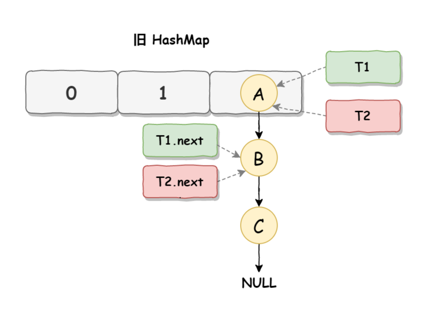
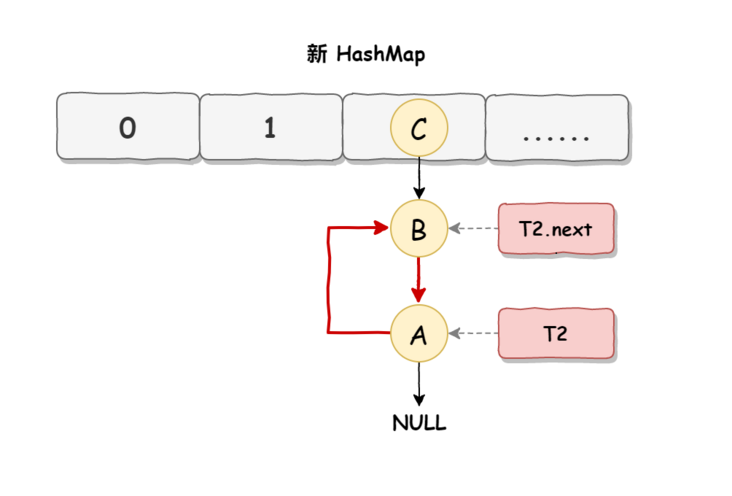
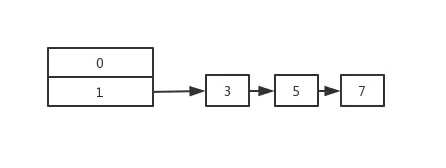
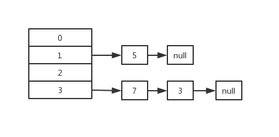

# HashMap源码解析

## 基本概念

> 介绍一下HashMap

**基本概念**：HashMap基于哈希表的Map接口实现，以key-value形式存储，主要用来存放键值对。它的key和value都可以为null，但是只能存在一个为null的key，它的存放位置在Node<K,V>[] table的第0号位置上。同时HashMap是线程不安全的。

**底层结构**：对于HashMap来说，它在1.8之前底层是由Node数组加上链表组成，链表主要是为了解决哈希冲突而是用的拉链法。而在1.8的时候，HashMap的底层由Node数组 + 链表 + 红黑树，当链表长度大于阈值（默认为8）并且当前数组的长度大于64的时候，将该索引位置上的所有数据都由链表改为红黑树存储。如果此时阈值大于8，但是数组长度不大于64，会选择进行数组扩容。这样做的目的就是因为数组较小的时候更容易出现红黑树结构，而红黑树的转换和保持平衡需要很大的消耗。

**扩容机制**：默认大小是16，每次扩容都是两倍。当数组的长度大于threshold的时候（threshold = capacity * loadFactor）就会进行resize，即扩容。

## 三种构造器

> new HashMap()时做了什么？

在1.8之前，创建HashMap对象之后，会在底层创建长度为16的一维数组Entry[ ] table。而在1.8之后，并没有在创建对象的时候将数组给创建出来，而是在首次调用put方法的时候，才会在底层创建默认长度为16的Node数组。

```java
/**
 * Constructs an empty <tt>HashMap</tt> with the default initial capacity
 * (16) and the default load factor (0.75). JDK1.8
 */
public HashMap() {
    this.loadFactor = DEFAULT_LOAD_FACTOR; // all other fields defaulted
}
```

> new HashMap(int initialCapacity)

一般而言，我们使用该构造器进行容量初始化的时候，如果我们传入的初始容量不是2的n次幂，那么HashMap会自动帮我们计算成一个相对合理值。但是这里还是会有一个小问题。

如果我们的HashMap只需要存放7个键值对，那么如果我们的initialCapacity设置为7，HashMap就会帮我们计算成8，可是注意的是，8 * 0.75 = 6，它要大于7，因此其实HashMap就会有一次rehash的过程，而这个rehash其实是很损耗性能的。

因此一般我们的初始化容量应该设置为**initialCapacity/0.75 + 1**，这样虽然可能牺牲一定的内容，但是能够最大程度的避免扩容带来的性能损耗。

> new HashMap(map)底层分析

```java
public HashMap(Map<? extends K, ? extends V> m) {
    this.loadFactor = DEFAULT_LOAD_FACTOR;
    putMapEntries(m, false);
}
```

调用了putMapEntries方法：该方法可以被putAll调用，也可以被构造器调用，区别在于evict参数的不同

```java
// evict false when initially constructing this map, else true (relayed to method afterNodeInsertion).
final void putMapEntries(Map<? extends K, ? extends V> m, boolean evict) {
    int s = m.size();
    if (s > 0) {
        if (table == null) { // pre-size 如果当前table还未初始化
            float ft = ((float)s / loadFactor) + 1.0F;
            int t = ((ft < (float)MAXIMUM_CAPACITY) ?
                     (int)ft : MAXIMUM_CAPACITY);
            if (t > threshold) // 如果计算得到的t要比原map的threshold大
                // 重新计算threshold为2的幂次方   比如 5 -> 8. 15 -> 16
                threshold = tableSizeFor(t);
        }
        else if (s > threshold)
            resize(); // 扩容
        // 挨个将参数中的m中的键值对给添加到集合中
        for (Map.Entry<? extends K, ? extends V> e : m.entrySet()) {
            K key = e.getKey();
            V value = e.getValue();
            putVal(hash(key), key, value, false, evict);
        }
    }
}
```

> 为什么HashMap的初始化容量必须是2的n次幂？如果不是会怎么样？

一般而言在对key计算它的存储位置的时候，是让它的hash值%length，即进行取余操作。而在取余操作中，如果除数是2的幂次方的话，就会：**hash%length = hash &(length - 1)**。使用二进制与的效率要比取余操作高。

同时，除了效率问题，这样还可以**有利于均匀分布，减少碰撞**。

**因为hash值始终在和一个大部分数字都为1的值做与运算**，而在与运算中，如果一个数全为1，那么结果就会完全取决于另外一个数（这里指的是hash值），而一个良好的hash函数会导致不同对象的hash值几乎不相等。

如果不是会怎么样？

**当initialCapacity > 2^30的时候，就让其等于2^30。如果大于0并且小于2^30，就扩充为2的n次幂。**

```java
public HashMap(int initialCapacity, float loadFactor) {
    // 进行一些范围检查
    if (initialCapacity < 0)
        throw new IllegalArgumentException("Illegal initial capacity: " +
                                           initialCapacity);
    if (initialCapacity > MAXIMUM_CAPACITY)
        initialCapacity = MAXIMUM_CAPACITY;
    if (loadFactor <= 0 || Float.isNaN(loadFactor))
        throw new IllegalArgumentException("Illegal load factor: " +
                                           loadFactor);
    this.loadFactor = loadFactor;
    this.threshold = tableSizeFor(initialCapacity);
}
```

规范初始容量的核心方法：

```java
/**
  * Returns a power of two size for the given target capacity.
  返回临界值threshold
 */
static final int tableSizeFor(int cap) {
    int n = cap - 1;
    // 这里cap要-1的原因：
    // 如果此时cap本来就是2的幂次方，同时还未-1，经过下面的计算之后，返回的值会是该cap的两倍。
    // 而按照我们的本意来说，如果是cap本来就是2的幂次方了，就不应该改变。
    n |= n >>> 1; // >>> 无符号右移
    n |= n >>> 2;
    n |= n >>> 4;
    n |= n >>> 8;
    n |= n >>> 16;
    return (n < 0) ? 1 : (n >= MAXIMUM_CAPACITY) ? MAXIMUM_CAPACITY : n + 1;
}
```

- 如果cap为1，则n为0，经过一系列计算之后得到的结果仍然是0，则最后的threshold为1。

上述tableSizeFor方法的位运算过程其实可以这么理解：我们只需要关注n的最高位的1。然后将其无符号右移一位之后，再与原值进行或操作，就会让其最高位拥有两个1。然后无符号右移两位，再与上一步的n进行或操作，最高位就拥有了4个1（当然不一定是4个，只是笼统的概括）

加入一开始cap是10，于是n为9，即1001。

n = n | n >>> 1；==》 n = 1001 | 0100 = 1100；

n = n | n >>> 2；==》 n = 1100 | 0011 = 1111; 

**最后的结果是n + 1，而这个值赋给了threshold而不是初始容量！**

> 为什么要引入红黑树？阈值为什么是8？

JDK1.8之前HashMap底层是使用链表进行存储，但是即使哈希函数取得再好，也很难让key百分百均匀分布。当HashMap中有大量的元素都存放在同一个桶中，就会让链表变得很长，极端情况下，就可能导致HashMap的查找效率变成O(N)。因此引入红黑树来提升查找效率，O(logn)。

TreeNode占用的空间是普通Node的两倍，为了权衡空间和时间的消耗，**只有当链表的值大于等于8的时候才会转换为红黑树。而当链表的值小于6的时候又会转换为链表。**

阈值是8的考虑就是源码注释中的，作者参考了泊松分布，在哈希函数良好的情况下，出现链表长度超过8的概率其实是极低的，几乎是不可能事件。因此很难会出现红黑树的转换，同时一旦转换了也容易提升效率。

> 为什么加载因子设置为0.75？

加载因子表示HashMap的疏密程度，影响hash操作到同一个数组位置的概率。

**loadFactor太大导致查找元素效率低，太小导致数组的利用率低，存放的数据会很分散。loadFactor的默认值为0.75f是官方给出的一个比较好的临界值**。

**当HashMap里面容纳的元素已经达到HashMap数组长度的75%时，表示HashMap太挤了，需要扩容，而扩容这个过程涉及到 rehash、复制数据等操作，非常消耗性能。，所以开发中尽量减少扩容的次数，可以通过创建HashMap集合对象时指定初始容量来尽量避免。**

loadFactor越趋近于1，那么 数组中存放的数据(entry)也就越多，也就越密，也就是会让链表的长度增加，loadFactor越小，也就是趋近于0，数组中存放的数据(entry)也就越少，也就越稀疏。

> hash值的计算

对于HashMap1.8之前来说，它的hash计算方法如下：

```java
static int hash(int h) {
    // This function ensures that hashCodes that differ only by
    // constant multiples at each bit position have a bounded
    // number of collisions (approximately 8 at default load factor).

    h ^= (h >>> 20) ^ (h >>> 12);
    return h ^ (h >>> 7) ^ (h >>> 4);
}
```

可以看到，经过了四次运算，效率比较低

而对于1.8来说，有了如下优化：

```java
static final int hash(Object key) {
    int h;
    return (key == null) ? 0 : (h = key.hashCode()) ^ (h >>> 16);
    // key.hashCode方法调用的是本地native方法
}
```

只经过了一次扰动。如果key为null，它的hash值应该为0。如果key不为null，将其hash值计算出来之后，让其和它的哈希值无符号右移16位之后的值进行一个异或操作。

**为什么要异或？**

如果数组的长度比较小，比如是16，那么n - 1就是 1111，这样的值和hash值做与操作，就只有第四位才会参与运算。而如果当哈希值计算的时候高位变化较大而低位变化较小的时候，就很容易造成哈希冲突。

而使用上述的异或操作，可以让计算出来的哈希值的高16位也能够参与运算，降低产生哈希冲突的概率。

## put方法

大致流程：

1. 计算key的hash值，然后根据hash值来判断该key应该映射到哪个桶。
2. 如果该桶没有碰撞冲突，就直接插入
3. 如果有冲突，看该冲突解决办法是红黑树还是链表。而且如果链表到达临界值，还会进行一个树化操作。
4. 如果存在重复的键，就替换为新的value
5. 如果size + 1之后大于threshold，就进行扩容

```java
public V put(K key, V value) {
    return putVal(hash(key), key, value, false, true);
}

/**
     * Implements Map.put and related methods.
     *
     * @param hash hash for key
     * @param key the key
     * @param value the value to put
     * @param onlyIfAbsent if true, don't change existing value
     * @param evict if false, the table is in creation mode.
     * @return previous value, or null if none
     */
final V putVal(int hash, K key, V value, boolean onlyIfAbsent,
               boolean evict) {
    // transient Node<K,V>[] table：表示存储Map集合中元素的数组
    Node<K,V>[] tab; Node<K,V> p; int n, i;
    
    if ((tab = table) == null || (n = tab.length) == 0)
        /*
    	(tab = table) == null：将table赋值为tab，判断tab是否为null，如果是第一次调用put肯定为null
    	或者如果tab的长度为0
    	满足上述两个条件中的其中一个就可以进行数组的初始化。
    	执行完resize之后，数组tab每个空间都是null
        */
        n = (tab = resize()).length;
    
    if ((p = tab[i = (n - 1) & hash]) == null)
        // 如果该key应该存放的位置所在的桶为null，就调用newNode方法
        // 创建一个新节点放入桶中
        tab[i] = newNode(hash, key, value, null);
    else {
        // 如果桶不为null
        Node<K,V> e; K k;
        // 如果该桶中的第一个元素的哈希值和参数相等，并且key也相等（地址或者equals）
        // 就将旧的元素整体对象赋值为e，用e来记录
        if (p.hash == hash &&
            ((k = p.key) == key || (key != null && key.equals(k))))
            e = p;
        else if (p instanceof TreeNode)
            // 如果是红黑树
            e = ((TreeNode<K,V>)p).putTreeVal(this, tab, hash, key, value);
        else {
            // 链表的形式存在 使用尾插法
            // 采用循环遍历的方式，判断链表中是否有重复的key
            for (int binCount = 0; ; ++binCount) {
                if ((e = p.next) == null) { // 为null表示没有下一个元素了，到达了链表尾部
                    // 说明链表中没有重复的key，就插入到链表尾部
                    p.next = newNode(hash, key, value, null);
                    // binCount为0，其实该链表已经存在一个节点了，就直接位于数组上。
                    // 如果binCount为7，就表示链表长度为8，就转换为红黑树。
                    if (binCount >= TREEIFY_THRESHOLD - 1) // -1 for 1st
                        treeifyBin(tab, hash);
                    break;
                }
                if (e.hash == hash &&
                    ((k = e.key) == key || (key != null && key.equals(k))))
                    break;
                p = e;
            }
        }
        // 说明在桶中找到了key值、hash值和插入元素相等的节点
        // 将旧值变为新值
        if (e != null) { // existing mapping for key
            V oldValue = e.value;
            if (!onlyIfAbsent || oldValue == null)
                e.value = value;
            afterNodeAccess(e);
            return oldValue; // 返回旧值
        }
    }
    ++modCount;
    // 如果插入后的大小大于阈值，就进行扩容操作
    if (++size > threshold)
        resize();
    afterNodeInsertion(evict);
    return null;
}
```

**总结**：

对于put方法，如果是第一次调用，会进行一次resize操作，去初始化table。

之后的流程大概就是看key对应位置的桶有没有与其相等的key，如果有就替换旧值；如果没有：

- 如果table[i] == null，就直接new一个节点放进入
- 该桶是红黑树，就调用红黑树相应方法
- 如果是链表，遍历完整个链表之后都没有找到相等的key，就将key插入到链表的尾部，此时如果链表长度大于等于8，就进行树化。

## resize方法

当HashMap中的元素个数超过threshold的时候，就会进行数组扩容；或者是第一次使用put方法的时候，也会调用一次resize方法

当HashMap中的其中一个链表的对象个数如果达到了8个，此时如果数组长度没有达到64，那么HashMap会先扩容解决，如果已经达到了64，那么这个链表会变成红黑树，节点类型由Node变成TreeNode类型。当然，如果映射关系被移除后，下次执行resize方法时判断树的节点个数低于6，也会再把树转换为链表。

而每次调用resize方法之后，都会进行rehash过程：

在JDK1.8之前，HashMap的resize方法比较笨重，它会对Map中的每个键值对都进行rehash计算。效率很低。

在JDK1.8之后，HashMap的resize方法进行了优化。因为每次扩容都是翻倍，与原来计算的(n - 1) & hash的结果相比只是多了一个bit位，所以**节点要么在原来的位置，要么被分配到原位置 + 旧容量这个位置。**

因此我们在进行rehash的时候，不需要重新计算key的hash，只需要看原来的hash值新增的那个bit位是1还是0就可以了。如果是0表示索引不变，如果是1就表示索引变化。

源码如下：

```java
final Node<K,V>[] resize() {
    Node<K,V>[] oldTab = table;
    int oldCap = (oldTab == null) ? 0 : oldTab.length; // 第一次进来的时候oldCap为0
    int oldThr = threshold; // 第一次进来的时候threshold为0
    int newCap, newThr = 0;
    if (oldCap > 0) {
        // 如果扩容之前的map容量大小超过了最大值就不管了，只好继续碰撞
        if (oldCap >= MAXIMUM_CAPACITY) {
            threshold = Integer.MAX_VALUE;
            return oldTab;
        }
        // 如果没有超过最大值，就扩充为原来的两倍
        else if ((newCap = oldCap << 1) < MAXIMUM_CAPACITY &&
                 oldCap >= DEFAULT_INITIAL_CAPACITY)
            newThr = oldThr << 1; // double threshold
    }
    // 将老的阈值赋值给新的容量
    else if (oldThr > 0) // initial capacity was placed in threshold
        newCap = oldThr;
    else {               // zero initial threshold signifies using defaults
        // 使用默认值---当第一次调用resize方法，会给默认值
        // newCap为16，newThr为12
        newCap = DEFAULT_INITIAL_CAPACITY;
        newThr = (int)(DEFAULT_LOAD_FACTOR * DEFAULT_INITIAL_CAPACITY);
    }
    if (newThr == 0) {
        float ft = (float)newCap * loadFactor;
        newThr = (newCap < MAXIMUM_CAPACITY && ft < (float)MAXIMUM_CAPACITY ?
                  (int)ft : Integer.MAX_VALUE);
    }
    threshold = newThr;
    @SuppressWarnings({"rawtypes","unchecked"})
    Node<K,V>[] newTab = (Node<K,V>[])new Node[newCap]; // 第一次进来的时候初始化一个16大小的Node数组
    table = newTab;
    // 进行元素的rehash过程
    if (oldTab != null) {
        for (int j = 0; j < oldCap; ++j) {
            Node<K,V> e;
            if ((e = oldTab[j]) != null) {
                oldTab[j] = null;
                if (e.next == null)
                    // 说明该桶中只有一个键值对
                    newTab[e.hash & (newCap - 1)] = e;
                else if (e instanceof TreeNode)
                    // 如果是红黑树，就使用红黑树相关的rehash过程
                    ((TreeNode<K,V>)e).split(this, newTab, j, oldCap);
                else { // preserve order
                    // 链表来处理rehash过程
                    Node<K,V> loHead = null, loTail = null;
                    Node<K,V> hiHead = null, hiTail = null;
                    Node<K,V> next;
                    do {
                        next = e.next;
                        // 如果为true表示位置不变
                        if ((e.hash & oldCap) == 0) {
                            if (loTail == null)
                                loHead = e;
                            else
                                loTail.next = e;
                            loTail = e;
                        }
                        // 否则位置要变化 + oldCap
                        else {
                            if (hiTail == null)
                                hiHead = e;
                            else
                                hiTail.next = e;
                            hiTail = e;
                        }
                    } while ((e = next) != null);
                    // 该链表解决完毕，将处理后的两条链表分别插入到不同的地方
                    if (loTail != null) {
                        loTail.next = null;
                        newTab[j] = loHead;
                    }
                    if (hiTail != null) {
                        hiTail.next = null;
                        newTab[j + oldCap] = hiHead;
                    }
                }
            }
        }
    }
    return newTab;
}
```

**总结**：

在第一次进入resize的时候，首先初始化threshold为默认值12，初始化容量为默认值16，然后创建一个大小为16的Node数组并直接返回，此时Node数组table中每个桶都是null。

后续每一次resize，都会将容量扩充为原来的两倍，并且也会重新计算新的threshold。之后创建一个是原来两倍大的新table数组。然后就会进行rehash操作。

在rehash的时候会依次遍历原table的每个桶，分为三种情况：

- 如果桶中只有一个键值对，即它的next为null，就newTab[e.hash & (newCap - 1)] = e;
- 如果桶是红黑树，就会调用其对应的rehash过程
- 如果桶是链表，就遍历整个链表，按照它rehash之后的位置分别插入到两条临时链表中，最后遍历完整个链表之后，就分别将两条临时链表插入到新数组对应的槽位中。

## 线程不安全

> JDK7扩容造成死循环

在JDK7的时候HashMap采用头插法，而它就可能在多线程并发情况下导致死循环。

**死循环发生在resize方法中的transfer方法中**

```java
void resize(int newCapacity) {
    Entry[] oldTable = table;
    int oldCapacity = oldTable.length;
    if (oldCapacity == MAXIMUM_CAPACITY) {
        threshold = Integer.MAX_VALUE;
        return;
    }
	// 创建新的table
    Entry[] newTable = new Entry[newCapacity];
    transfer(newTable, initHashSeedAsNeeded(newCapacity));
    table = newTable;
    threshold = (int)Math.min(newCapacity * loadFactor, MAXIMUM_CAPACITY + 1);
}

void transfer(Entry[] newTable, boolean rehash) {
    int newCapacity = newTable.length;
    for (Entry<K,V> e : table) {
        while(null != e) {
            // 获取e指向的Entry
            Entry<K,V> next = e.next;
            if (rehash) {
                e.hash = null == e.key ? 0 : hash(e.key);
            }
            int i = indexFor(e.hash, newCapacity);
            // e指向扩容后的下标对应的newTable
            e.next = newTable[i];
            // 将e放入数组中，头插法
            newTable[i] = e;
            // 将next赋给e
            e = next;
        }
    }
}
```

transfer方法作用：在对table进行扩容到newTable之后，需要将原来数据转移到newTable中，而转移过程中采用的是头插法，也就是链表的顺序会翻转，而这里就是形成死循环的关键点。

假如有两个线程AB同时进行并发扩容：



此时T1和T2都指向A，T1.next和T2.next都指向B节点。

线程T2的时间片用完了从而挂起，此时T1开始执行扩容操作，并顺利完成，则此时的状态如下图所示：


线程T2被唤醒，并开始执行后续的扩容操作，注意由于transfer中e最后要指向next，即A要指向B，因此就会发生死循环，A指向B，而B又指向A。



> 同时JDK7时候的HashMap还可能造成数据丢失问题

假如一开始节点如下图所示：



线程A被挂起，此时e指向3，next指向5。线程B完成扩容：



线程A继续扩容， 它会先将e指向的3放到newTable的正确的位置上，然后让e=next，即e指向5。然后完成节点5的存放之后，发现e为null了，就结束本次扩容。此时就发现节点7丢失了。

> JDK8数据覆盖

假如AB两个线程都在执行put操作，注意，在put操作中，如果table不为null，会先检查存入的key对应位置上的桶table[i]是否为null，假设AB两线程插入的两条不同的数据hash值一样，并且对应位置上的桶为null：

线程A进入后还未进行数据插入时挂起，而线程B正常执行，从而正常插入数据，然后线程A获取时间片，此时线程A不用再进行hash判断了，此时线程A就会将线程B插入的数据给覆盖，线程不安全。
