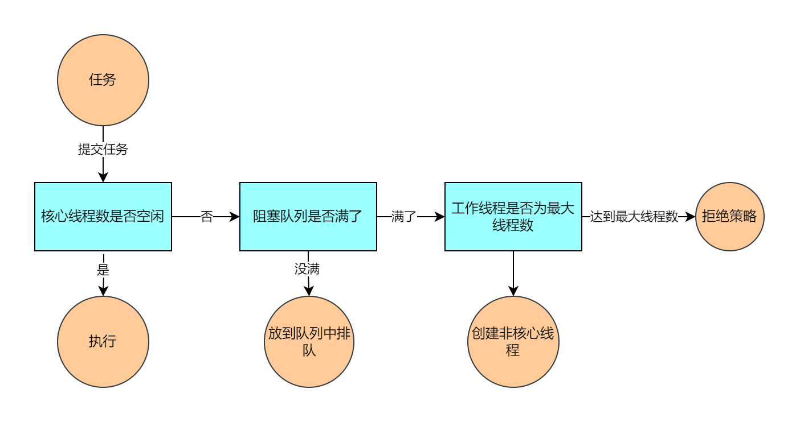

## 第一章 线程池执行流程



线程池在内部其实构建了一个生产者消费者模型，将线程和任务两者解耦，并不直接关联，从而良好的缓冲任务，复用线程。线程池的运行主要分为两部分：任务管理、状态管理。其中任务管理就是充当生产者的角色，当任务提交之后，线程池会判断该任务后续的流转：

1. 直接申请线程执行该任务
2. 缓冲到阻塞队列中等待线程执行
3. 拒绝该任务。

线程管理部分是消费者，它们被统一维护在线程池内，根据任务请求进行

## 第二章 线程池属性标识

```java
// 两个作用：声明当前线程池状态；声明线程池中的线程数
private final AtomicInteger ctl = new AtomicInteger(ctlOf(RUNNING, 0));
// 高3位是线程池装填，低29位是线程池中的线程个数
// SIZE：32，COUNT_BITS就是29，方便后面做位运算
private static final int COUNT_BITS = Integer.SIZE - 3;
// 通过位运算得出最大容量
// 因为后29位是表示线程池中的线程数，因此就是1111111111111，29位1，2的29次方
private static final int CAPACITY   = (1 << COUNT_BITS) - 1;

// runState is stored in the high-order bits
// 线程池的五种状态
private static final int RUNNING    = -1 << COUNT_BITS; // 高三位为111 代表正常接受任务
// 000 不接受任务，但是内部还会处理阻塞队列中的任务，正在进行中的任务也正常执行 执行shutdown方法
private static final int SHUTDOWN   =  0 << COUNT_BITS;
// 001 不接受新任务，也不去处理阻塞队列中的任务，同时会中断正在执行的任务 执行shutdownNow方法
private static final int STOP       =  1 << COUNT_BITS;
private static final int TIDYING    =  2 << COUNT_BITS; // 010 过渡状态，代表线程池即将OVER
private static final int TERMINATED =  3 << COUNT_BITS; // 011 执行terminated（），真的凉凉了。

// Packing and unpacking ctl
// 得到线程池的状态
private static int runStateOf(int c)     { return c & ~CAPACITY; }
// 得到当前线程池的线程数量，不区分核心和非核心
private static int workerCountOf(int c)  { return c & CAPACITY; }
// 通过状态和线程数生成ctl
private static int ctlOf(int rs, int wc) { return rs | wc; }
```

| 线程状态   | 状态释义                                                     |
| ---------- | ------------------------------------------------------------ |
| RUNNING    | 线程池被创建后的初始状态，能接受新提交的任务，也能处理阻塞队列中的任务 |
| SHUTDOWM   | 关闭状态，不接受新任务，但是仍然可以处理已经进入阻塞队列中的任务 |
| STOP       | 会中断正在处理任务的线程，不能再接受新的任务，也不能继续处理阻塞队列中的任务 |
| TIDYING    | 所有的任务都已经终止，workerCount（有效工作线程数）为0       |
| TERMINATED | 线程池彻底终止运行                                           |


## 第三章 源码分析

### execute

```java
public void execute(Runnable command) {
   
    if (command == null)
        throw new NullPointerException();
    //拿到32位的int
    int c = ctl.get();
    // 获取工作线程数，是否小于核心线程数，说明可以创建核心线程数，一个线程池刚创建的时候内部没有线程
    if (workerCountOf(c) < corePoolSize) {
        if (addWorker(command, true)) // true表示核心线程
            return;
        // 如果创建失败，重新获取ctl值（没加锁）
        c = ctl.get();
    }
    // 判读线程池是否在运行，将任务添加到阻塞队列中,
    /// 工作线程数大于核心线程数，且阻塞队列没有满
    if (isRunning(c) && workQueue.offer(command)) {
        int recheck = ctl.get();
        // 如果不是running，移除任务
        // 相当于两次检查, remove方法源码如下：
 /*		public boolean remove(Runnable task) {
        	boolean removed = workQueue.remove(task);
        	tryTerminate(); // In case SHUTDOWN and now empty
        	return removed;
    	}  */
        // 当线程池的状态发生变化的时候，就需要将刚刚提交的任务从阻塞队列中进行删除
        // 如果删除失败，可能是该任务已经被别的线程所处理了
        if (! isRunning(recheck) && remove(command))
            reject(command); // 拒绝策略
        else if (workerCountOf(recheck) == 0) // 工作线程为0
            // 担保机制，得保证线程池在running状态下至少得有一个线程在工作。
            // 不然队列中的任务可能就一直无法被消耗
            addWorker(null, false); // 阻塞队列有任务，但是没有工作线程，添加一个任务为空的工作线程处理阻塞队列中的任务
    } // 创建非核心线程
    else if (!addWorker(command, false))
        // 创建非核心线程失败，拒绝策略
        reject(command);
}
```

### addWorker

主要作用是创建一个线程，也就是一个Worker，来处理新提交的任务firstTask，如果firstTask为null，该Worker就会从任务队列中获取任务来执行。core参数表示本次添加的线程是否是核心线程。

在线程池中，其实并没有对核心线程和非核心线程采取不同的实现方式，都统一封装成Worker。

查看execute方法中的**addWorker源码**

- **处于shutdown状态下的线程池是允许添加新的线程来处理队列中剩余的任务的，只是不能添加新的任务**
- **处于STOP、TIDYING、TERMINATED状态下的线程池都会中断正在处理任务的线程，并且不再接受新的任务和处理队列中的任务，也无法创建新的线程。**

```java
private boolean addWorker(Runnable firstTask, boolean core) {
    retry: // 标记，内部for循环跳出外部for循环
    for (;;) {
        int c = ctl.get();
        int rs = runStateOf(c); // 获取线程池状态

        // 如果当前线程池不是Running
        if (rs >= SHUTDOWN && // 除了RUNNING都有可能
            ! (rs == SHUTDOWN &&
               firstTask == null && // 任务为空
               ! workQueue.isEmpty())) // 阻塞队列不为null
            // 总的来说，返回false的情况
            // - 当前线程池的状态不是Running
            // - 如果是Shutdown就必须得保证队列中没有任务，或者firstTask不为null
            // 因为如果是shutdown，可以新增线程处理队列中未完成的任务，但是不允许添加新的任务
            return false;

        for (;;) {
            int wc = workerCountOf(c);
            if (wc >= CAPACITY || // 如果当前线程已经大于线程池最大容量就不去创建
                wc >= (core ? corePoolSize : maximumPoolSize)) // wc是否超过核心线程或者最大线程
                return false;
            if (compareAndIncrementWorkerCount(c)) // 使用CAS将工作线程数+1
                // 如果添加成功了就可以去执行真正的添加逻辑了
                break retry;
            c = ctl.get();  // Re-read ctl CAS失败
            if (runStateOf(c) != rs) // 如果此时线程池的状态发生了改变，就重新执行外层的for循环
                // 如果状态没有发生变化，就再次执行内部的for循环，也就是重新CAS
                continue retry;
            // else CAS failed due to workerCount change; retry inner loop
        }
    }	
    /// 上述经过大量判断将工作线程数标识+1
	// 开始执行真正的的添加线程逻辑
    boolean workerStarted = false;
    boolean workerAdded = false;
    Worker w = null;
    try { // 内部调用线程工厂创建线程
        // this.thread = getThreadFactory().newThread(this);
        w = new Worker(firstTask);
        final Thread t = w.thread;
        if (t != null) { // 使用全局锁
            // private final ReentrantLock mainLock = new ReentrantLock();
            final ReentrantLock mainLock = this.mainLock;
            mainLock.lock();
            // 避免我添加任务时，其他线程干掉线程池，因为干掉线程池需要先获取这个锁。
            try {
                // Recheck while holding lock.
                // Back out on ThreadFactory failure or if
                // shut down before lock acquired.
                int rs = runStateOf(ctl.get());
				// 如果线程池状态是Running或者
                // 是shutdown并且当前任务为null，相当于shutdown状态下去处理队列中剩余的任务
                // 只是没有判断队列是否为空了
                if (rs < SHUTDOWN ||
                    (rs == SHUTDOWN && firstTask == null)) {
                    if (t.isAlive()) // precheck that t is startable
                        // 当线程start之后，线程的isAlive才会为true
                        // 防止某些程序员在使用线程工厂创建线程返回之前就将线程给启动了
                        throw new IllegalThreadStateException();
                    workers.add(w); // 使用HashSet来保存所有的Worker
                    int s = workers.size();
                    if (s > largestPoolSize)
                        largestPoolSize = s;
                    workerAdded = true;
                }
            } finally {
                mainLock.unlock();
            }
            if (workerAdded) {
                t.start(); // 启动线程
                workerStarted = true;
            }
        }
    } finally {
        if (! workerStarted)
            addWorkerFailed(w); // 添加线程失败逻辑
    }
    return workerStarted;
}
```

### addWorkerFailed

```java
private void addWorkerFailed(Worker w) {
    final ReentrantLock mainLock = this.mainLock;
    mainLock.lock();
    try {
        if (w != null)
            workers.remove(w); // 将当前线程从set中移除，因为线程启动失败了
        decrementWorkerCount(); // 内部使用CAS + 自旋来保证成功
        tryTerminate(); // 尝试将线程池的状态变为terminate
    } finally {
        mainLock.unlock();
    }
}
```

### tryTerminate

如果遇见了添加线程失败的时候，就尝试一下，看看是否需要终止掉线程池

```java
final void tryTerminate() {
    for (;;) {
        int c = ctl.get();
        // 1. 当前线程池状态为Running
        // 2. 在TIDYING及以上，说明有其他的线程正在执行从
        // 3. 或者处于SHUTDOWN且工作队列不为null 特殊情况，得等到等待队列中的任务处理完
        if (isRunning(c) ||
            runStateAtLeast(c, TIDYING) ||
            (runStateOf(c) == SHUTDOWN && ! workQueue.isEmpty()))
            return;
        // 当前正在工作的线程不为0
        if (workerCountOf(c) != 0) { // Eligible to terminate
            // 只中断一个？？？？
            interruptIdleWorkers(ONLY_ONE);
            return;
        }
		// 来到这里的，workCount为0，但是这个是提前减了的数量，
        // 因此这个线程是最后一个线程
        final ReentrantLock mainLock = this.mainLock;
        mainLock.lock();
        try { // 通过CAS来设置当前线程池运行状态为TIDYING并且活跃线程数为0
            if (ctl.compareAndSet(c, ctlOf(TIDYING, 0))) {
                try {
                    terminated();
                } finally {
                    ctl.set(ctlOf(TERMINATED, 0)); // 将状态设置为TERMINATED，工作线程为0
                    termination.signalAll();
                }
                return;
            }
        } finally {
            mainLock.unlock();
        }
        // else retry on failed CAS
    }
}
```

### Worker的封装

线程池中，将线程都封装成一个个的Worker，而调用thread.start的时候，其实会调用Worker中重写好的run方法；

**同时，Worker还继承了AQS，自己实现相关AQS的相关接口**

```java
private final class Worker
    extends AbstractQueuedSynchronizer
    implements Runnable {

    private static final long serialVersionUID = 6138294804551838833L;

    final Thread thread;
    Runnable firstTask; // 当前线程的第一个任务
    // 每个线程的任务计数器
    volatile long completedTasks;

    Worker(Runnable firstTask) {
        setState(-1); // inhibit interrupts until runWorker
        this.firstTask = firstTask;
        this.thread = getThreadFactory().newThread(this); // 利用线程工厂创建线程
    }

    /** Delegates main run loop to outer runWorker  */
    public void run() {
        runWorker(this);
    }

    // Lock methods
    //
    // The value 0 represents the unlocked state.
    // The value 1 represents the locked state.

    protected boolean isHeldExclusively() {
        return getState() != 0;
    }

    protected boolean tryAcquire(int unused) {
        if (compareAndSetState(0, 1)) {
            setExclusiveOwnerThread(Thread.currentThread());
            return true;
        }
        return false;
    }

    protected boolean tryRelease(int unused) {
        setExclusiveOwnerThread(null);
        setState(0);
        return true;
    }

    public void lock()        { acquire(1); }
    public boolean tryLock()  { return tryAcquire(1); }
    public void unlock()      { release(1); }
    public boolean isLocked() { return isHeldExclusively(); }

    void interruptIfStarted() {
        Thread t;
        if (getState() >= 0 && (t = thread) != null && !t.isInterrupted()) {
            try {
                t.interrupt();
            } catch (SecurityException ignore) {
            }
        }
    }
}
```

### runWorker

```java
final void runWorker(Worker w) {
    Thread wt = Thread.currentThread();
    Runnable task = w.firstTask;
    w.firstTask = null;
    // 初始化当前worker的state为0（AQS中的state），并且设置exclusiveOwnerThread为null
    // 因为在创建worker的时候，通过它的构造方法会将state设置为-1
    w.unlock(); // allow interrupts 允许中断
    // true表示发生异常退出，需要做一些处理，false是正常退出
    boolean completedAbruptly = true;
    try {
        // getTask可能会阻塞线程
        while (task != null || (task = getTask()) != null) {
            w.lock();
            // shutdown的时候会判断当前worker的状态，根据锁是否空闲来判断当前worker是否正在工作
            // If pool is stopping, ensure thread is interrupted;
            // if not, ensure thread is not interrupted.  This
            // requires a recheck in second case to deal with
            // shutdownNow race while clearing interrupt
            // 1. 如果状态处于STOP、TIDYING、TERMINATION，给他中断信号
            // 2. 
            if ((runStateAtLeast(ctl.get(), STOP) ||
                 (Thread.interrupted() &&
                  runStateAtLeast(ctl.get(), STOP))) &&
                !wt.isInterrupted())
                wt.interrupt();
            
            try {
                beforeExecute(wt, task); // 留给子类实现
                Throwable thrown = null;
                try { // task可能是FutureTask也可能是Runnable实现类
                    task.run(); // 执行任务
                } catch (RuntimeException x) {
                    thrown = x; throw x;
                } catch (Error x) {
                    thrown = x; throw x;
                } catch (Throwable x) {
                    thrown = x; throw new Error(x);
                } finally {
                    afterExecute(task, thrown); // 留给子类实现
                }
            } finally {
                task = null;
                w.completedTasks++;
                w.unlock();
            }
        }
        completedAbruptly = false;
    } finally { // 回收线程
        processWorkerExit(w, completedAbruptly);
    }
}
```

### getTask

什么时候会返回null？

1. 线程池状态最低也是STOP状态
2. 状态是shutdown，等待队列为空
3. 线程池中的线程数量超过最大限制，会有一部分线程返回null
4. 线程池中的线程数超过核心线程数，可能会有一部分线程超时，返回null

```java
private Runnable getTask() {
    boolean timedOut = false; // Did the last poll() time out?

    for (;;) {
        int c = ctl.get();
        int rs = runStateOf(c);

        // Check if queue empty only if necessary.
        if (rs >= SHUTDOWN && (rs >= STOP || workQueue.isEmpty())) {
            decrementWorkerCount();
            return null;
        }
		// 到这里的时候，线程池的状态要么是running，要么是shutdown，但是队列不为空
        int wc = workerCountOf(c);
		// allowCoreThreadTimeOut表示核心线程数内的线程也可以被回收
        // 否则只能是超过核心线程数的那些线程才会被回收
        // Are workers subject to culling?
        boolean timed = allowCoreThreadTimeOut || wc > corePoolSize;

       	// 如果timedOut为true表示上一次循环的时候，线程获取任务超时了
        if ((wc > maximumPoolSize || (timed && timedOut))
            && (wc > 1 || workQueue.isEmpty())) {
            if (compareAndDecrementWorkerCount(c))
                return null;
            // cas失败，可能是有别的线程先于它成功退出了，而可能再一次循环的时候，上面if的timed可能为false
            // 于是该线程也可能不需要被回收了
            continue;
        }

        try {
            // 如果该线程有超时回收机制，就使用poll（有超时限制），否则使用使用take（拿不到就一直阻塞）
            Runnable r = timed ?
                workQueue.poll(keepAliveTime, TimeUnit.NANOSECONDS) :
                workQueue.take();
            // 如果为null，就只能表示超时了，在下一次循环的时候应该退出，然后进行后续的回收
            if (r != null)
                return r;
            timedOut = true;
        } catch (InterruptedException retry) {
            timedOut = false;
        }
    }
}
```

### processWorkerExit

在runWorker中获取任务如果失败了，就会走这个逻辑：

```java
private void processWorkerExit(Worker w, boolean completedAbruptly) {
    if (completedAbruptly) // If abrupt, then workerCount wasn't adjusted
        // 如果是异常的退出
        decrementWorkerCount();

    final ReentrantLock mainLock = this.mainLock;
    mainLock.lock();
    try {
        completedTaskCount += w.completedTasks;
        workers.remove(w); // 移除该worker
    } finally {
        mainLock.unlock();
    }

    tryTerminate(); // 根据线程池的状态判断是否结束线程池

    // 担保机制，如果队列中还有任务，最起码还得留一个线程
    int c = ctl.get();
    // 如果 running或者shutdown
    if (runStateLessThan(c, STOP)) {
        if (!completedAbruptly) { // 如果是正常退出
            int min = allowCoreThreadTimeOut ? 0 : corePoolSize;
            if (min == 0 && ! workQueue.isEmpty())
                min = 1;
            if (workerCountOf(c) >= min)
                return; // replacement not needed
        }
        // 重新创建一个线程代替被销毁的线程
        addWorker(null, false);
    }
}
```

## 第四章 四种拒绝策略

**拒绝策略需要实现RejectedExecutionHandler接口，并实现rejectedExecution方法**

### AbortPolicy

默认的拒绝策略，其实内部啥也没做，只是抛出一个异常

```java
public static class AbortPolicy implements RejectedExecutionHandler {
    /**
     * Creates an {@code AbortPolicy}.
     */
    public AbortPolicy() { }

    /**
     * Always throws RejectedExecutionException.
     *
     * @param r the runnable task requested to be executed
     * @param e the executor attempting to execute this task
     * @throws RejectedExecutionException always
     */
    public void rejectedExecution(Runnable r, ThreadPoolExecutor e) {
        throw new RejectedExecutionException("Task " + r.toString() +
                                             " rejected from " +
                                             e.toString());
    }
}
```

### DiscardPolicy

内部甚至连异常都懒得抛了

```java
public static class DiscardPolicy implements RejectedExecutionHandler {
    /**
     * Creates a {@code DiscardPolicy}.
     */
    public DiscardPolicy() { }

    /**
     * Does nothing, which has the effect of discarding task r.
     *
     * @param r the runnable task requested to be executed
     * @param e the executor attempting to execute this task
     */
    public void rejectedExecution(Runnable r, ThreadPoolExecutor e) {
    }
}
```

### DiscardOldestPolicy

从队列中抛出最开始的任务，然后执行当前的任务

```java
public static class DiscardOldestPolicy implements RejectedExecutionHandler {
    /**
     * Creates a {@code DiscardOldestPolicy} for the given executor.
     */
    public DiscardOldestPolicy() { }

    /**
     * Obtains and ignores the next task that the executor
     * would otherwise execute, if one is immediately available,
     * and then retries execution of task r, unless the executor
     * is shut down, in which case task r is instead discarded.
     *
     * @param r the runnable task requested to be executed
     * @param e the executor attempting to execute this task
     */
    public void rejectedExecution(Runnable r, ThreadPoolExecutor e) {
        if (!e.isShutdown()) {
            e.getQueue().poll();
            e.execute(r);
        }
    }
}
```

### CallerRunsPolicy

直接使用当前线程去执行该任务

```java
public static class CallerRunsPolicy implements RejectedExecutionHandler {
    /**
     * Creates a {@code CallerRunsPolicy}.
     */
    public CallerRunsPolicy() { }

    /**
     * Executes task r in the caller's thread, unless the executor
     * has been shut down, in which case the task is discarded.
     *
     * @param r the runnable task requested to be executed
     * @param e the executor attempting to execute this task
     */
    @Override
    public void rejectedExecution(Runnable r, ThreadPoolExecutor e) {
        if (!e.isShutdown()) {
            r.run();
        }
    }
}
```

## 第五章 阻塞队列

### DelayQueue

#### 基本概念及其使用

DelayQueue是一个实现了BlockingQueue的无界阻塞队列，它**存放的元素必须实现Delayed接口**，同时也只能在它到期的时候才能够被取走。不支持null的存储。

作用：

- 缓存的对象如果超过了空闲时间就从缓存中移除
- 对于超时任务的处理，比如网络编程中可以处理超时未响应的请求。

```java
public class MyDelay implements Delayed {

    private final long delayedTime;
    private final String taskName;

    // 毫秒单位
    MyDelay(String taskName, long delayedTime) {
        this.taskName = taskName;
        this.delayedTime = System.currentTimeMillis() + delayedTime;
    }
    // 当前任务离过期时间还有多久
    // 如果返回值小于等于0，表示该任务可以被取出了
    @Override
    public long getDelay(TimeUnit unit) {
        return unit.convert(delayedTime - System.currentTimeMillis(), TimeUnit.MILLISECONDS);
    }
	// 比较，在添加任务的时候会进行比较
    @Override
    public int compareTo(Delayed o) {
        MyDelay myDelay = (MyDelay)o;
        return (int)(this.delayedTime - myDelay.delayedTime);
    }

    @Override
    public String toString() {
        return "MyDelay{" +
            "delayedTime=" + delayedTime +
            ", taskName='" + taskName + '\'' +
            '}';
    }

}
```

接着我们来看DelayQueue的内部实现：

```java
public class DelayQueue<E extends Delayed> extends AbstractQueue<E>
    implements BlockingQueue<E> {

    private final transient ReentrantLock lock = new ReentrantLock();
    private final PriorityQueue<E> q = new PriorityQueue<E>();

    // leader线程会去PriorityQueue堆的头部取任务
    private Thread leader = null;

    /**
     * Condition signalled when a newer element becomes available
     * at the head of the queue or a new thread may need to
     * become leader.
     */
    private final Condition available = lock.newCondition();
}
```

#### add/put/offer

向队列中添加元素，无论调用哪个方法，其实内部都是调用的offer方法：

```java
public boolean offer(E e) {
    final ReentrantLock lock = this.lock;
    lock.lock();
    try {
        q.offer(e); // 向堆里面添加元素
        if (q.peek() == e) { // 如果是第一次添加或者直接添加到头部
            leader = null; // 将leader设置为null，然后唤醒其中一个等待的线程
            available.signal();
        }
        return true;
    } finally {
        lock.unlock();
    }
}
```

#### take

```java
public E take() throws InterruptedException {
    final ReentrantLock lock = this.lock;
    lock.lockInterruptibly();
    try {
        for (;;) {
            E first = q.peek(); // 如果堆里面没有元素可以取，就直接阻塞
            if (first == null)
                available.await();
            else {
                // 取出它的过期时间，就是我们重写的getDelay方法
                long delay = first.getDelay(NANOSECONDS);
                if (delay <= 0) // 说明该任务已经过期了，可以被消费
                    return q.poll();
                // 当前还无法被消费
                // 防止长时间的等待导致内存泄漏
                // 从这里开始就是leader-follower模式
                first = null; // don't retain ref while waiting 
                if (leader != null) // 只能让leader等待了
                    available.await();
                else {
                    // 让当前线程成为leader
                    Thread thisThread = Thread.currentThread();
                    leader = thisThread;
                    try { // 阻塞堆头任务的过期时间
                        available.awaitNanos(delay);
                    } finally { // 最终释放掉
                        if (leader == thisThread)
                            leader = null;
                    }
                }
            }
        }
    } finally {
        if (leader == null && q.peek() != null)
            available.signal(); // 唤醒其他的线程去堆的头部拿任务
        lock.unlock();
    }
}
```

[(53条消息) DelayQueue（JDK1.8）------ take的源码分析_狂奔的蜗牛已被占用的博客-CSDN博客_delayqueue源码](https://blog.csdn.net/m0_37550986/article/details/126882839)

## 常见面试题

### 0. 线程池优点

1. **线程复用**：降低资源消耗，通过重复利用自己创建的线程降低线程创建和销毁造成的损耗
2. **提高响应速度：**因为线程池中的线程数没有超过线程池的最大上限时，有的线程处于正在等待分配任务的状态，当任务到达时，任务可以不需要等到线程创建就能立即执行。
3. **管理线程：**提高线程的可管理性。使用线程池可以对线程进行统一分配、调优和监控。
4. **控制最大并发数**

### 1. 线程池种类

- **newCachedThreadPool**：线程池的大小不固定，可灵活回收空闲线程，若无可回收，则新建线程。****
- **newFixedThreadPool**：固定大小的线程池，当有新的任务提交，线程池中如果有空闲线程，则立即执行，否则新的任务会被缓存在一个任务队列中，等待线程池释放空闲线程。
- **newScheduledThreadPool**：定时线程池，支持定时及周期性任务执行。
- **newSingleThreadExecutor**：只创建一个线程，它只会用唯一的工作线程来执行任务，保证所有任务按顺序指定执行。

### 2. 线程池的拒绝策略

1. **ThreadPoolExecutor.AbortPolicy**：默认的策略。即丢弃并抛出RejectedExecutionException异常。
2. **ThreadPoolExecutor.DiscardPolicy**：丢弃任务，但是不抛出异常。
3. **DiscardOldestPolicy**：丢弃队列最前面的任务，然后重新提交被拒绝的任务，不抛出异常。
4. **CallerRunsPolicy**：由调用线程处理该任务，不会丢弃任务，也不抛出异常。

### 3. 线程池常见的阻塞队列

- **ArrayBlockingQueue**：是一个我们常用的典型的有界队列，其内部的实现是基于数组来实现的。
- **LinkedBlockingQueue**：由链表实现的队列，队列的长度是Integer.MAX_VALUE，基本上是可以任务是无界队列
- **SynchronousQueue**：是一个不存储任何元素的阻塞队列，每一个put操作都必须等待take操作，否则不能添加元素，同时它也支持公平锁和非公平锁。
- **PriorityBlockingQueue**：支持优先级排序的无界阻塞队列，插入的对象必须是可比较大小的，否则会报错
- **DelayQueue**：一个实现PriorityBlockingQueue的延迟获取的无界队列。具有延迟的功能。

### 4. 线程池的运行原理

1. 在创建了线程池后，等待提交过来的任务请求
2. 当调用execute方法添加一个请求任务时，线程池会做如下判断：
   1. 如果正在运行的线程数小于corePoolSize，那么马上创建线程运行这个任务
   2. 如果正在运行的线程数大于或等于corePoolSize，那么将这个任务放入队列
   3. 如果这时候队列满了且正在运行的线程数还小于maximumPoolSize，那么还是要创建非核心线程立即运行这个任务
   4. 如果队列满了且正在运行的线程数量大于或等于maximumPoolSize，那么线程池会启动饱和拒绝策略来执行
3. 当一个线程完成任务时，他会从队列中取下一个任务执行
4. 当一个线程无事可做超过一定的时间（keepAliveTime）时，线程池会判断：如果当前运行的线程数大于corePoolSize，那么这个线程就会被停掉

### 5. 如何合理设置线程池的核心参数

当线程池中核心线程数过大时，线程和线程之间会争夺CPU资源，会导致频繁上下文切换，过多的上下文切换会消耗CPU，增加线程的执行时间，影响了整体的执行效率。

当线程池中核心线程数过小时，如果同一时间有大量任务需要处理，可能会导致大量任务在任务队列中排队等待执行，甚至可能会执行拒绝策略，或者大量任务堆积在任务队列导致内存溢出OOM。

对于IO密集型（MySQL数据库、文件的读写、网络通信等任务）：**线程数 = CPU核数 * （1  + IO耗时 / CPU耗时）**或者**CPU核数 * 2**。可以理解为当线程A正在执行IO操作的时候，另外的IO/CPU的线程数就可以执行完自己的CPU计算。因为这种情况任务最大线程数一般都会大于CPU核心数很多倍，因为IO读写速度相比于CPU的读写速度而言是比较慢的，如果我们设置过少的线程数就可能导致CPU资源的浪费，而如果我们设置更多的线程数，那么当一部分线程正在等待IO的时候，他们此时并不需要CPU来计算，那么另外的线程便可以利用CPU去执行其他的任务，互不影响，这样的话在任务队列中等待的任务就会减少，可以更好的利用资源。

对于CPU密集型（加解密、压缩、计算）：**CPU核数**，这样可以充分利用所有CPU的核心。如果线程数远远超出了CPU核心数量，反而会使任务效率下降，因为频繁的切换线程也是需要消耗时间的（因为此时CPU每个核心几乎都是满负荷运行）。不过在工程上，**线程数的数量一般会设置为CPU核数 + 1**，这样的化，当线程因为偶尔的内存页失效或其它原因导致阻塞时，这个额外的线程可以顶上，从而保证CPU利用率。

**当然过少的线程会使整体性能降低，过多的线程也会消耗内存等其他资源，所以想要准确的话，可以进行压测，监控JVM的线程情况以及CPU的负载情况，根据实际情况衡量应该创建的线程数，合理并充分利用资源。**

**极端情况下当任务队列满了之后，继续增加非核心线程，直到达到最大线程数，那么效率其实会逐渐降低**

把握住一条原则：**将硬件的性能发挥到极致**，在实际场景中，IO耗时和CPU耗时的比值是一个关键参数，但这个参数其实是动态的，如果要估算这个参数，需要在各种不同的场景下压测来验证我们的估计。需要重点关注CPU、IO设备的利用率和性能指标（响应时间、吞吐量）之间的关系。

### 6. 为什么阿里不建议使用Executors创建线程池？

- 对于**newFixedThreadPool和newSingleThreadExector**来说，它们底层都是用的**LinkedBlockingQueue**，**当添加任务的速度大于线程池处理任务的速度，可能会在队列堆积大量的请求，消耗很大的内存，甚至导致OOM。**
- 对于**newCachedThreadPool和newScheduledThreadPool**来说，它们的**最大线程数都是Integer.MAX_VALUE**；当添加任务的速度大于线程池处理任务的速度，可能会创建大量的线程，消耗资源，甚至导致OOM。

### 7. execute & submit

两个都是属于线程池中的方法。

- execute只能提交Runnable类型的任务；submit可以提交Runnable或Callable类型的任务
- execute会直接抛出任务执行时的异常，submit不会，它可以通过Future的get方法将任务执行时的异常重新抛出
- execute所属顶层接口是Executor，而submit是ExecutorService。实现类ThreadPoolExecutor重写了execute方法,抽象类AbstractExecutorService重写了submit方法。

### 8. 能不能先创建非核心线程，再引入阻塞队列？

按照正常流程， 当我们的核心线程数达到了之后，再有新的任务进来就会先放到阻塞队列中，直到阻塞队列满了创建非核心线程，那么能不能反过来呢？

不能，因为创建线程的代价其实是很大的，需要获取mainlock，因此能不创建线程就不创建线程，引入阻塞队列，等到核心线程数处理不过来的时候，才去考虑创建非核心线程。

### 9. 线程池复用原理

线程池将线程和任务进行解耦，在线程池中，同一个线程可以从阻塞队列中不断获取新的任务来执行，因为线程池中的线程是去执行一个循环任务，在循环里面不停检查阻塞队列中是否有任务需要被执行，如果有就直接执行，也就是调用任务中的run方法，将方法当成一个普通的方法执行。

### 10. 为什么使用阻塞队列？

阻塞队列可以保证在任务队列中没有任务的时候阻塞获取任务的线程，线程进入wait状态，释放CPU资源。如果队列中有新的任务进来，就会唤醒线程来获取任务。

### 11. 线程执行中出现异常，线程池如何处理

- **如果使用的是execute，出现了未处理的异常，会直接打印堆栈异常的输出**

源码中，其实就是在执行runWorker方法的时候，会调用task的run方法，如果出现了异常，就会将异常给抛出去，而线程池中其实并没有相关的处理这个抛出的异常的机制。

那么异常是如何被处理的？其实是在**Java.lang.ThreadGroup的uncaughtException**中处理的

当一个线程因为未捕获异常而即将终止的时候，JVM将使用Thread.getUncaughtExceptionHandler方法获取已经设置的Handler实例，并通过调用它的uncaughtException方法来处理相关的异常信息。如果线程并没有设置相关的handler，就将ThreadGroup作为它的handler，它会将异常进行打印。

```java
Thread t = new Thread();
t.setUncaughtExceptionHandler(newThread.UncaughtExceptionHandler() {
	public void uncaughtException(Thread t, Throwable e) {}
})
```

- **如果使用的是submit，不会显示的输出，而是将异常结果放到Future中，直到你去调用future.get方法**

在底层，submit其实还是会调用execute方法，只不过它将传入的task给封装成FutureTask，并最终将该ft对象给返回。

而FutureTask对run方法也进行了重写，它内部最终会调用它的call方法，然后对于它抛出来的异常，会使用setException方法，将异常给保存下来。如果使用future.get方法，就会取得保存的异常，并最终打印出来。

- **对于出现了异常的线程，将会被回收，然后创建一个新的线程，不影响其他的线程任务。**

在源码中，其实就是在执行runWorker方法的时候，finally最终会执行processWorkerExit方法，将当前出现异常的线程从workers中移除，然后创建一个新的线程，去队列中获取任务执行。

### 12. 线程是如何被销毁的？

我们都知道，线程池中的线程复用逻辑是通过一个for(;;)来做的，如果当前线程超过了最大线程数或者超过了核心线程数，并且它在超时时间之后其实都没有能够拿到任务，就会退出这个循环，然后会将当前的worker从HashSet中移除，然后真正的销毁逻辑其实是交给GC来做的。 

