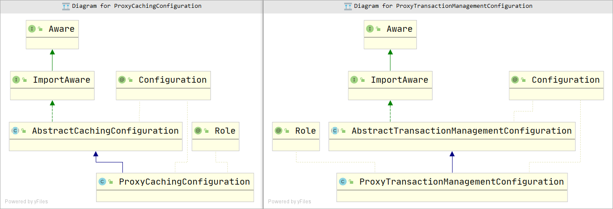

# 第一章 搭建测试环境

- 引入相关依赖 

```xml
<dependency>
    <groupId>org.springframework.boot</groupId>
    <artifactId>spring-boot-starter-cache</artifactId>
</dependency>
<dependency>
    <groupId>org.springframework.boot</groupId>
    <artifactId>spring-boot-starter-data-redis</artifactId>
</dependency>
<dependency>
    <groupId>org.springframework.boot</groupId>
    <artifactId>spring-boot-starter-web</artifactId>
</dependency>
```

- 配置属性文件

```yaml
server:
  port: 8080
spring:
  redis:
    host: 192.168.235.123
  cache:
    type: redis
    redis:
      time-to-live: 30000s
```

- 添加@EnableCaching注解
- 解决SpringRedis自带的RedisTemplate序列化问题：

```java
@Configuration
public class MyRedisConfig {

    @Bean
    public RedisCacheConfiguration redisCacheConfiguration(CacheProperties cacheProperties) {
        CacheProperties.Redis redisProperties = cacheProperties.getRedis();
        RedisCacheConfiguration config = RedisCacheConfiguration
                .defaultCacheConfig();
        config = config.serializeKeysWith(RedisSerializationContext.SerializationPair.fromSerializer(new StringRedisSerializer()));
        config = config.serializeValuesWith(RedisSerializationContext.SerializationPair.fromSerializer(new GenericJackson2JsonRedisSerializer()));

        if (redisProperties.getTimeToLive() != null) {
            config = config.entryTtl(redisProperties.getTimeToLive());
        }
        if (redisProperties.getKeyPrefix() != null) {
            config = config.prefixCacheNameWith(redisProperties.getKeyPrefix());
        }
        if (!redisProperties.isCacheNullValues()) {
            config = config.disableCachingNullValues();
        }
        if (!redisProperties.isUseKeyPrefix()) {
            config = config.disableKeyPrefix();
        }
        return config;
    }
}
```

- 编写测试样例

```java
@RestController
public class CacheController {
    @Autowired
    private OrderService orderService;

    @GetMapping("/get/{id}")
    public Order getOrderById(@PathVariable("id") Integer id) {
        return orderService.getOrderById(id);
    }
}

@Service
@Slf4j
public class OrderServiceImpl implements OrderService {
    // 最终结果是第一次访问的时候访问数据库，之后就直接访问redis
    @Cacheable(value = {"study:cache:order"},key = "#id")
    @Override
    public Order getOrderById(Integer id) {
        Order order = new Order(id, "订单", 20);
        log.info("from db {} ========", order);
        return order;

    }
}
```

# 第二章 SpringCache源码分析

## 2.1 @EnableCaching

```java
@Target(ElementType.TYPE)
@Retention(RetentionPolicy.RUNTIME)
@Documented
@Import(CachingConfigurationSelector.class)
public @interface EnableCaching {

    boolean proxyTargetClass() default false;

    AdviceMode mode() default AdviceMode.PROXY;
	// int LOWEST_PRECEDENCE = Integer.MAX_VALUE;
    int order() default Ordered.LOWEST_PRECEDENCE;

}
```

其中最重要的就是通过Import注解引入了**CachingConfigurationSelector**，这个类通过**ConfigurationClassParser**类执行它的selectImports方法：

```java
@Override
public String[] selectImports(AdviceMode adviceMode) {
    switch (adviceMode) {
        case PROXY:
            return getProxyImports();
        case ASPECTJ:
            return getAspectJImports();
        default:
            return null;
    }
}

/**
	 * Return the imports to use if the {@link AdviceMode} is set to {@link AdviceMode#PROXY}.
	 * <p>Take care of adding the necessary JSR-107 import if it is available.
	 */
private String[] getProxyImports() {
    List<String> result = new ArrayList<>(3);
    result.add(AutoProxyRegistrar.class.getName());
    result.add(ProxyCachingConfiguration.class.getName());
    if (jsr107Present && jcacheImplPresent) {
        result.add(PROXY_JCACHE_CONFIGURATION_CLASS);
    }
    return StringUtils.toStringArray(result);
}
```

### AutoProxyRegistrar

由于我们默认采用PROXY，因此它会向容器中引入两个类：**AutoProxyRegistrar和ProxyCachingConfiguration**，对于第一个类，其实在Spring的事务源码中也同样会引入该类，它是一个ImportBeanDefinitionRegistrar，在它的内部的registerBeanDefinitions方法中，会获取到@EnableCaching注解中的属性，然后通过这些属性判断是否注入一些BeanDefinition，比如**InfrastructureAdvisorAutoProxyCreator**。

AutoProxyRegistrar在容器刷新过程中的invokeBeanFactoryPostProcessors步骤中执行

```java
@Override
public void registerBeanDefinitions(AnnotationMetadata importingClassMetadata, BeanDefinitionRegistry registry) {
    boolean candidateFound = false;
    // 注意这里可能会拿到多个注解，
    Set<String> annTypes = importingClassMetadata.getAnnotationTypes();
    for (String annType : annTypes) {
        // 如果项目中引入了事务，在Spring事务注解中，同样也会通过@EnableTransactionalManager注解
        // 来执行这一步骤，但是对于InfrastructureAdvisorAutoProxyCreator的beanDefinition只能有一个
        // 因此两个注解之间，他们的属性只会有一个生效，这就是在@EnableCaching注解中的proxyTargetClass（）
        // 它的官方注释上写着：
        // Note that setting this attribute to {@code true} will affect <em>all</em>
       	// Spring-managed beans requiring proxying, not just those marked with {@code @Cacheable}.
        AnnotationAttributes candidate = AnnotationConfigUtils.attributesFor(importingClassMetadata, annType);
        if (candidate == null) {
            continue;
        }
        Object mode = candidate.get("mode");
        Object proxyTargetClass = candidate.get("proxyTargetClass");
        if (mode != null && proxyTargetClass != null && AdviceMode.class == mode.getClass() &&
            Boolean.class == proxyTargetClass.getClass()) {
            candidateFound = true;
            if (mode == AdviceMode.PROXY) {
                // 内部注入InfrastructureAdvisorAutoProxyCreator
                AopConfigUtils.registerAutoProxyCreatorIfNecessary(registry);
                if ((Boolean) proxyTargetClass) {
                    AopConfigUtils.forceAutoProxyCreatorToUseClassProxying(registry);
                    return;
                }
            }
        }
    }
    ///////// 。。。。
}
```

### ProxyCachingConfiguration

看完了AutoProxyRegistrar，接下来看CachingConfigurationSelector引入的另一个类：**ProxyCachingConfiguration**

它主要向容器中注入三个类：

```java
@Configuration(proxyBeanMethods = false)
@Role(BeanDefinition.ROLE_INFRASTRUCTURE)
public class ProxyCachingConfiguration extends AbstractCachingConfiguration {

    @Bean(name = CacheManagementConfigUtils.CACHE_ADVISOR_BEAN_NAME)
    @Role(BeanDefinition.ROLE_INFRASTRUCTURE)
    public BeanFactoryCacheOperationSourceAdvisor cacheAdvisor(
        CacheOperationSource cacheOperationSource, CacheInterceptor cacheInterceptor) {

        BeanFactoryCacheOperationSourceAdvisor advisor = new BeanFactoryCacheOperationSourceAdvisor();
        advisor.setCacheOperationSource(cacheOperationSource);
        advisor.setAdvice(cacheInterceptor);
        if (this.enableCaching != null) {
            advisor.setOrder(this.enableCaching.<Integer>getNumber("order"));
        }
        return advisor;
    }

    @Bean
    @Role(BeanDefinition.ROLE_INFRASTRUCTURE)
    public CacheOperationSource cacheOperationSource() {
        return new AnnotationCacheOperationSource();
    }

    @Bean
    @Role(BeanDefinition.ROLE_INFRASTRUCTURE)
    public CacheInterceptor cacheInterceptor(CacheOperationSource cacheOperationSource) {
        CacheInterceptor interceptor = new CacheInterceptor();
        interceptor.configure(this.errorHandler, this.keyGenerator, this.cacheResolver, this.cacheManager);
        interceptor.setCacheOperationSource(cacheOperationSource);
        return interceptor;
    }

}
```

其实可以发现，SpringCache和SpringTransactional非常相似，甚至它们引入的类实现的都是同一种接口。



其中最重要的类肯定就是BeanFactoryCacheOperationSourceAdvisor，它是一个Advisor，而我们容器中已经存在了一个AopProxyCreator，也就是InfrastructureAdvisorAutoProxyCreator。这样AOP功能其实就可以实现了。


# 第三章 Caffeine源码分析


# 第四章 两者的结合
