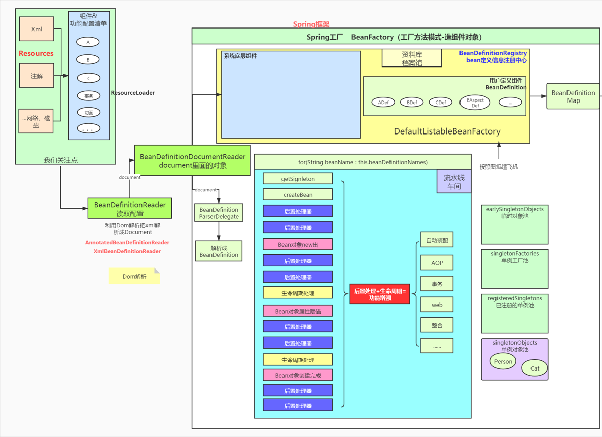
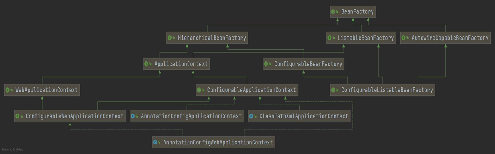
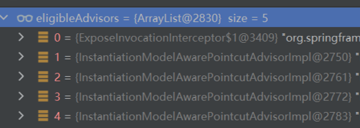

## 前置

导入spring源码需要gradle，但是问题就是gradle导入源码太慢了，因此也可以退而求其次，选择用maven来搭建，只不过用maven的话，无法修改源码，无法在源码上写注释，但是其实问题不大。

```xml
<dependencies>
    <dependency>
        <groupId>org.springframework</groupId>
        <artifactId>spring-core</artifactId>
        <version>5.3.5</version>
    </dependency>
    <dependency>
        <groupId>org.springframework</groupId>
        <artifactId>spring-context</artifactId>
        <version>5.3.5</version>
    </dependency>
    <dependency>
        <groupId>org.springframework</groupId>
        <artifactId>spring-test</artifactId>
        <version>5.3.5</version>
        <scope>test</scope>
    </dependency>
    <dependency>
        <groupId>org.springframework</groupId>
        <artifactId>spring-web</artifactId>
        <version>5.3.5</version>
    </dependency>
    <dependency>
        <groupId>org.springframework</groupId>
        <artifactId>spring-webflux</artifactId>
        <version>5.3.5</version>
    </dependency>
    <dependency>
        <groupId>org.springframework</groupId>
        <artifactId>spring-beans</artifactId>
        <version>5.3.5</version>
    </dependency>
    <dependency>
        <groupId>org.springframework</groupId>
        <artifactId>spring-tx</artifactId>
        <version>5.3.5</version>
    </dependency>
    <dependency>
        <groupId>org.springframework</groupId>
        <artifactId>spring-aop</artifactId>
        <version>5.3.5</version>
    </dependency>
    <dependency>
        <groupId>org.springframework</groupId>
        <artifactId>spring-expression</artifactId>
        <version>5.3.5</version>
    </dependency>
    <dependency>
        <groupId>org.springframework</groupId>
        <artifactId>spring-jms</artifactId>
        <version>5.3.5</version>
    </dependency>
    <dependency>
        <groupId>commons-logging</groupId>
        <artifactId>commons-logging</artifactId>
        <version>1.2</version>
    </dependency>
    <dependency>
        <groupId>org.springframework</groupId>
        <artifactId>spring-websocket</artifactId>
        <version>5.3.5</version>
    </dependency>
    <dependency>
        <groupId>org.springframework</groupId>
        <artifactId>spring-webmvc</artifactId>
        <version>5.3.5</version>
    </dependency> 
    <dependency>
        <groupId>org.springframework</groupId>
        <artifactId>spring-r2dbc</artifactId>
        <version>5.3.5</version>
    </dependency> 
    <dependency>
        <groupId>org.springframework</groupId>
        <artifactId>spring-oxm</artifactId>
        <version>5.3.5</version>
    </dependency>
    <dependency>
        <groupId>org.springframework</groupId>
        <artifactId>spring-orm</artifactId>
        <version>5.3.5</version>
    </dependency>
    <dependency>
        <groupId>org.springframework</groupId>
        <artifactId>spring-messaging</artifactId>
        <version>5.3.5</version>
    </dependency>
    <dependency>
        <groupId>org.springframework</groupId>
        <artifactId>spring-jdbc</artifactId>
        <version>5.3.5</version>
    </dependency>
    <dependency>
        <groupId>org.springframework</groupId>
        <artifactId>spring-jcl</artifactId>
        <version>5.3.5</version>
    </dependency>
    <dependency>
        <groupId>org.springframework</groupId>
        <artifactId>spring-instrument</artifactId>
        <version>5.3.5</version>
    </dependency>
    <dependency>
        <groupId>org.springframework</groupId>
        <artifactId>spring-context-support</artifactId>
        <version>5.3.5</version>
    </dependency>
    <dependency>
        <groupId>org.springframework</groupId>
        <artifactId>spring-context-indexer</artifactId>
        <version>5.3.5</version>
        <scope>optional</scope>
    </dependency>
    <dependency>
        <groupId>org.springframework</groupId>
        <artifactId>spring-aspects</artifactId>
        <version>5.3.5</version>
    </dependency>
    <dependency>
        <groupId>org.springframework</groupId>
        <artifactId>spring-framework-bom</artifactId>
        <version>5.3.5</version>
        <type>pom</type>
    </dependency>
</dependencies>
```

## 第一章 核心注解

| **注解**         | **功能**                                                     |
| :--------------- | ------------------------------------------------------------ |
| @Bean            | 容器中注册组件                                               |
| @Primary         | 同类组件如果有多个，标注主组件                               |
| @DependsOn       | 组件之间声明依赖关系                                         |
| @Lazy            | 组件懒加载（最后使用的时候才创建）                           |
| @Scope           | 声明组件的作用范围(SCOPE_PROTOTYPE,SCOPE_SINGLETON)          |
| @Configuration   | 声明这是一个配置类，替换以前配置文件                         |
| @Component       | @Controller、@Service、@Repository                           |
| @Indexed         | 加速注解，所有标注了  @Indexed 的组件，直接会启动快速加载    |
| @Order           | 数字越小优先级越高，越先工作                                 |
| @ComponentScan   | 包扫描                                                       |
| @Conditional     | 条件注入                                                     |
| @Import          | 导入第三方jar包中的组件，或定制批量导入组件逻辑              |
| @ImportResource  | 导入以前的xml配置文件，让其生效                              |
| @Profile         | 基于多环境激活                                               |
| @PropertySource  | 外部properties配置文件和JavaBean进行绑定.结合ConfigurationProperties |
| @PropertySources | @PropertySource组合注解                                      |
| @Autowired       | 自动装配                                                     |
| @Qualifier       | 精确指定                                                     |
| @Value           | 取值、计算机环境变量、JVM系统。xxxx。@Value(“${xx}”)         |
| @Lookup          | 单例组件依赖非单例组件，非单例组件获取需要使用方法           |

注：**@Indexed需要引入依赖**

```xml
<dependency>
	<groupId>org.springframework</groupId>
	<artifactId>spring-context-indexer</artifactId>
	<optional>true</optional>
</dependency>
```

### 1.1 使用xml文件创建bean

```java
<?xml version="1.0" encoding="UTF-8"?>
<beans xmlns="http://www.springframework.org/schema/beans"
       xmlns:xsi="http://www.w3.org/2001/XMLSchema-instance"
       xsi:schemaLocation="http://www.springframework.org/schema/beans http://www.springframework.org/schema/beans/spring-beans.xsd">

    <bean class="top.noaharno.bean.Person" id="person">
        <property name="name" value="张三"/>
    </bean>
</beans>
```

```java
public static void main(String[] args) {
    ClassPathXmlApplicationContext context = new ClassPathXmlApplicationContext("beans.xml");
    Person bean = context.getBean(Person.class);
    System.out.println(bean);
}
```

### 1.2 使用注解的方式创建bean

```java
@Configuration
public class MainConfig {

    // 通过注解的方式导入bean
    @Bean
    public Person person() {
        Person person = new Person();
        person.setName("李四");
        return person;
    }
}
```

```java
public static void main(String[] args) {
    ApplicationContext context = new AnnotationConfigApplicationContext(MainConfig.class);
    Person bean = context.getBean(Person.class);
    System.out.println(bean);
}
```

### 1.3 @Import注解

除了使用@Bean来导入bean，还可以在MainConfig类上使用@Import(Person.class)来导入bean，但是这种方式是利用无参构造器来创建bean到容器中的。

@Import的部分源码如下：

```java
/**
 * {@link Configuration @Configuration}, {@link ImportSelector},
 * {@link ImportBeanDefinitionRegistrar}, or regular component classes to import.
 */
Class<?>[] value();
```

可以看到，它一共有四种方式导入，我们先关注ImportDefinitionRegistrar方式导入bean定义信息

```java
// BeanDefinitionRegistry Bean定义信息注册中心，图纸中心，档案馆，它里面都是BeanDefinition
// 所有的bean定义信息都在这里面存着
class MyImportRegistrar implements ImportBeanDefinitionRegistrar {

    @Override
    public void registerBeanDefinitions(AnnotationMetadata importingClassMetadata,
                                        BeanDefinitionRegistry registry) {

        // BeanDefinition
        RootBeanDefinition catDefinition = new RootBeanDefinition();
        catDefinition.setBeanClass(Cat.class);
        // 可以声明定义信息，包括我需要自动装配什么
        // Spring 这个实例的类型、名字
        registry.registerBeanDefinition("tomCat", catDefinition);
    }
}
```

我们的重点是了解一下BeanDefinitionRegistry，这是spring中非常重要的一个类。

可以使用`@Import(MyInportRegistrar.class)`的方式向容器中导入tomcat这个名字的bean

### 1.4 @Lookup注解

如果我们让Person里面组合一个Cat类，然后让Cat的类型为`@Scope(scopeName = ConfigurableBeanFactory.SCOPE_PROTOTYPE)`，原型模式，这样如果通过注解方式的容器来获取Cat实例，就会得到不一样的Cat实例对象

```java
class Person {
    private String name;
    @Autowired
    private Cat cat;
}
```

但是如果我们同时创建两个Person，并且比较两个Person中的cat对象是否想的，得到的答案确是相等的。

```java
public static void main(String[] args) {
    ApplicationContext context = new AnnotationConfigApplicationContext(MainConfig.class);
    Person bean1 = context.getBean(Person.class);
    Person bean2 = context.getBean(Person.class);
    System.out.println(bean2.getCat() == bean1.getCat());
}
```

原因就是person是单实例的，在我们创建了第一个person的时候，给person赋值，就会根据原型模式创建出一个cat。导致获取到的cat就是第一次创建person对象的时候，容器初始化的cat。

要想每次创建person，都会创建一个新的cat，就需要注解@Lookup了。

```java
@Component
public class Person {
    String name;
    //    @Autowired
    private Cat cat;
    // 去容器中找。不过注意的是@Bean的这种方式注册的Person，@Lookup不生效。
    @Lookup  // 标注在get方法上面。
    public Cat getCat() {
        return cat;
    }
}
```

## 第二章 Spring整体架构

### 2.1 Spring整体流程



Spring暴露给程序员的，通过XML、注解、网络、磁盘等方式，将功能定义出来，最终生成一个组件或者功能 的配置清单。**比如我们在xml中写的bean配置都会在spring底层中对应一个BeanDefinition**，然后通过ResourceLoader（资源加载器）帮我们把这些Resources加载来，并交给BeanDefinitionReader（Bean定义信息的读取器），然后放在spring中的档案馆里面（也就是BeanDefinitionRegistry），其实就是一个BeanDefinitionMap，保存组件是咋定义的。接着就是将这些BeanDefinition创建成对象（车间流水线的工作）。创建完之后就可以从容器中拿取了。在对象创建过程中，有很多池，所有创建好的实例分类放到池中。

### 2.2 Resource 和 ResourceLoader

在spring中，resource可以有很多种，可以来自于xml、注解，也可以来自于磁盘、网络


而ResourceLoader中，使用了策略模式，资源加载器

```java
public interface Resource {
    // 资源加载策略接口
    Resource getResource(String location);
}
```

### 2.3 BeanFactory

The root interface for accessing a Spring bean container。BeanFactory是根接口，整个访问容器的入口。这个接口可以保存很多的BeanDefinition信息，每一个信息都有一个唯一的名字。



- **HierarchicalBeanFactory**：定义工厂父子关系的工厂（父子容器）
- **ListableBeanFactory**：它的实现是DefaultListableBeanFactory，保存了ioc容器中的核心信息
- **AutowireCapaableBeanFactory**：提供自动装配能力

AnnotationApplicationContext组合了档案馆，而档案馆有自动装配能力。

在ListableBeanFactory的实现类`AbstractApplicationContext`中，有一个`ResourcePatternResolver`，并且在`AbstractApplicationContext`对象创建的时候就拿到了，它是一个ResourceLoader。而AbstractApplicationContext就是**策略模式环境类**。

在`DefaultListableBeanFactory`中有一个属性，这里面所有BeanDefinition信息按照名字对应BeanDefinition关系都保存好了，这个就是**总档案馆**。

```java
/** Map of bean definition objects, keyed by bean name. */
private final Map<String, BeanDefinition> beanDefinitionMap = new ConcurrentHashMap<>(256);
```

### 2.4 BeanDefinition信息的注册流程

根据前置分析，我们的总档案馆就存放在DefaultListableBeanFactory中的beanDefinitionMap中，就可以通过查看啥时候调用了beanDefinitionMap的put方法，就知道了生成的BeanDefinition是什么时候被存放在总档案馆里面了。

因此就可以将断点打在DefaultListableBeanFactory中的registerBeanDefinition方法的首句上。

```java
public static void main(String[] args) {
    ClassPathXmlApplicationContext context = new ClassPathXmlApplicationContext("beans.xml");
    Cat cat = context.getBean("cat", Cat.class);
}
```

```xml
<bean class="top.noaharno.bean.Cat" id="cat">
    <property name="name" value="张三的猫"/>
</bean>
```

以Debugger方式运行测试类，然后分析整个执行堆栈。

首先我们通过`new ClassPathXmlApplicationContext`来创建IOC容器的时候，需要在构造器里面执行**refresh**方法刷新容器。

```java
public ClassPathXmlApplicationContext(
      String[] configLocations, boolean refresh, @Nullable ApplicationContext parent)
      throws BeansException {

   super(parent);
   setConfigLocations(configLocations);
   if (refresh) {
      refresh(); // 刷新容器，即创建整个容器的过程，这是最重要的地方
   }
}
```

在refresh方法中，我们这次就分析下面的一句话，其余的后续再分析

```java
// Tell the subclass to refresh the internal bean factory.
ConfigurableListableBeanFactory beanFactory = obtainFreshBeanFactory();
```

也就是说，我们先告诉子类去刷新它们内部的beanFactory，并且将刷新好的beanFactory进行返回，

```java
protected ConfigurableListableBeanFactory obtainFreshBeanFactory() {
   refreshBeanFactory(); // 刷新工厂
   return getBeanFactory();
}
```

```java
@Override
protected final void refreshBeanFactory() throws BeansException {
    // 如果有beanFacory了就销毁它
    if (hasBeanFactory()) {
        destroyBeans();
        closeBeanFactory();
    }
    try {
        // 在这里创建我们的BeanFactory，档案馆，也就是存放图纸的地方
        DefaultListableBeanFactory beanFactory = createBeanFactory();
        // 给工厂一个序列化id
        beanFactory.setSerializationId(getId());
        customizeBeanFactory(beanFactory);
        // 这里就是准备给创建好的beanFactory加载所有的BeanDefinitions
        loadBeanDefinitions(beanFactory);
        this.beanFactory = beanFactory;
    }
    catch (IOException ex) {
        throw new ApplicationContextException("I/O error parsing bean definition source for " + getDisplayName(), ex);
    }
}
```

在如上的loadBeanDefinitions方法实现如下：

```java
@Override
protected void loadBeanDefinitions(DefaultListableBeanFactory beanFactory) throws BeansException, IOException {
    // Create a new XmlBeanDefinitionReader for the given BeanFactory.
    XmlBeanDefinitionReader beanDefinitionReader = new XmlBeanDefinitionReader(beanFactory);

    // Configure the bean definition reader with this context's
    // resource loading environment.
    beanDefinitionReader.setEnvironment(this.getEnvironment());
    // 给读取器组合一个资源加载器
    beanDefinitionReader.setResourceLoader(this);
    beanDefinitionReader.setEntityResolver(new ResourceEntityResolver(this));

    // Allow a subclass to provide custom initialization of the reader,
    // then proceed with actually loading the bean definitions.
    initBeanDefinitionReader(beanDefinitionReader);
    // 加载所有的Bean定义信息。
    loadBeanDefinitions(beanDefinitionReader);
}
```

可以看到，我们想要加载所有的BeanDefinition信息的时候，需要创建一个**XMLBeanDefinitionReader**，一个读取器，为的就是**利用Dom解析把xml解析成Document。**

然后就继续调用**loadBeanDefinitions**方法，只不过这次是将我们准备好的beanDefinitionReader传进去了。

```java
protected void loadBeanDefinitions(XmlBeanDefinitionReader reader) throws BeansException, IOException {
    /**
	 * Return an array of Resource objects, referring to the XML bean definition
	 * files that this context should be built with.
	 * <p>The default implementation returns {@code null}. Subclasses can override
	 * this to provide pre-built Resource objects rather than location Strings.
	 * @return an array of Resource objects, or {@code null} if none
	 * @see #getConfigLocations()
	 */
    // 默认返回为null。子类可以重写该方法
    Resource[] configResources = getConfigResources();
    if (configResources != null) {
        reader.loadBeanDefinitions(configResources);
    }
    // 允许多个配置文件
    String[] configLocations = getConfigLocations();
    if (configLocations != null) {
        reader.loadBeanDefinitions(configLocations);
    }
}
```


此时通过方法**reader.loadBeanDefinitions(configLocations)**，读取器终于要开始读取配置文件中的bean了。

```java
@Override
public int loadBeanDefinitions(String... locations) throws BeanDefinitionStoreException {
   Assert.notNull(locations, "Location array must not be null");
   int count = 0;
    // 在这个方法里面，是对每一个配置文件都逐个进行加载
   for (String location : locations) {
      count += loadBeanDefinitions(location);
   }
   return count;
}
```

```java
public int loadBeanDefinitions(String location, @Nullable Set<Resource> actualResources) throws BeanDefinitionStoreException {
    // 首先判断有没有资源加载器
    ResourceLoader resourceLoader = getResourceLoader();
    if (resourceLoader == null) {
        throw new BeanDefinitionStoreException(
            "Cannot load bean definitions from location [" + location + "]: no ResourceLoader available");
    }

    if (resourceLoader instanceof ResourcePatternResolver) {
        // Resource pattern matching available.
        try {
            // 策略模式，获取资源
            Resource[] resources = ((ResourcePatternResolver) resourceLoader).getResources(location);
            // 依次遍历所有的Resources，逐个进行加载。
            int count = loadBeanDefinitions(resources);
            ............
}
```

以下方法就是解析单个Resource的方法

```java
/**
 * Load bean definitions from the specified XML file.
 * @param encodedResource the resource descriptor for the XML file,
 * allowing to specify an encoding to use for parsing the file
 * @return the number of bean definitions found
 * @throws BeanDefinitionStoreException in case of loading or parsing errors
 */
public int loadBeanDefinitions(EncodedResource encodedResource) throws BeanDefinitionStoreException {
	.........
    try (InputStream inputStream = encodedResource.getResource().getInputStream()) {
        InputSource inputSource = new InputSource(inputStream);
        if (encodedResource.getEncoding() != null) {
            inputSource.setEncoding(encodedResource.getEncoding());
        }
        // 利用DOM解析配置文件中的Bean为BeanDefinition了
        return doLoadBeanDefinitions(inputSource, encodedResource.getResource());
    }
	.........
}
```

```java
protected int doLoadBeanDefinitions(InputSource inputSource, Resource resource)
    throws BeanDefinitionStoreException {

    try {
		// 这里的doc其实就是package org.w3c.dom; dom解析
        // 利用dom解析工具把xml变成dom解析文档（Document）
        Document doc = doLoadDocument(inputSource, resource);
        int count = registerBeanDefinitions(doc, resource);
        if (logger.isDebugEnabled()) {
            logger.debug("Loaded " + count + " bean definitions from " + resource);
        }
        return count;
    }
    .........
}
```

```java
public int registerBeanDefinitions(Document doc, Resource resource) throws BeanDefinitionStoreException {
    /*
    	在前面，我们通过BeanDefinitionReader利用DOM解析把xml解析成Document
    	而在这里，我们利用BeanDefinitionDocumentReader将Document里面的对象解析成BeanDefinition
    */
    BeanDefinitionDocumentReader documentReader = createBeanDefinitionDocumentReader();
    // 记录统计前BeanDefinition的加载个数
    int countBefore = getRegistry().getBeanDefinitionCount();
    // 利用BeanDefinitionDocumentReader将document解析成BeanDefinition
    // 这里使用到了单一职责原理，将逻辑处理委托给的单一的类进行处理，这个逻辑处理类就是BeanDefinitionDocumentReader对象
    documentReader.registerBeanDefinitions(doc, createReaderContext(resource));
    // 统计本次加载BeanDefinition的个数
    return getRegistry().getBeanDefinitionCount() - countBefore;
}
```

接着就是看registerBeanDefinitions中的doRegisterBeanDefinitions方法，该方法的核心就是以下语句

```java
BeanDefinitionParserDelegate parent = this.delegate;
this.delegate = createDelegate(getReaderContext(), root, parent);
......
parseBeanDefinitions(root, this.delegate);
......
```

也就是说，Spring准备一个BeanDefinitionParserDelegate，这里面其实利用了解释器模式，用于将Document对象解析成BeanDefinition。


```java
protected void parseBeanDefinitions(Element root, BeanDefinitionParserDelegate delegate) {
    if (delegate.isDefaultNamespace(root)) {
        NodeList nl = root.getChildNodes();
        for (int i = 0; i < nl.getLength(); i++) {
            // 遍历文档中的所有的节点
            Node node = nl.item(i);
            if (node instanceof Element) {
                Element ele = (Element) node;
                if (delegate.isDefaultNamespace(ele)) {
                    // 解析节点
                    parseDefaultElement(ele, delegate);
                }
                else {
                    delegate.parseCustomElement(ele);
                }
            }
        }
    }
    else {
        delegate.parseCustomElement(root);
    }
}
```

解析节点的方法如下，其实底层也就是通过if else来判断当前解析的节点是以什么开头的，然后分别调用不同的方法来解析。

```java
private void parseDefaultElement(Element ele, BeanDefinitionParserDelegate delegate) {
    if (delegate.nodeNameEquals(ele, IMPORT_ELEMENT)) {
        importBeanDefinitionResource(ele);
    }
    else if (delegate.nodeNameEquals(ele, ALIAS_ELEMENT)) {
        processAliasRegistration(ele);
    }
    else if (delegate.nodeNameEquals(ele, BEAN_ELEMENT)) {
        // 由于我们的测试条件，是在配置文件中通过bean来创建对象，就调用这个解析方法
        processBeanDefinition(ele, delegate);
    }
    else if (delegate.nodeNameEquals(ele, NESTED_BEANS_ELEMENT)) {
        // recurse
        doRegisterBeanDefinitions(ele);
    }
}
```

processBeanDefinition方法如下：

```java
protected void processBeanDefinition(Element ele, BeanDefinitionParserDelegate delegate) {
    // 把当前标签解析完了，并将BeanDefinition和beanName给封装成bdHolder
    BeanDefinitionHolder bdHolder = delegate.parseBeanDefinitionElement(ele);
    if (bdHolder != null) {
        bdHolder = delegate.decorateBeanDefinitionIfRequired(ele, bdHolder);
        try {
            // Register the final decorated instance.
            // 利用工具类进行注册，
            /*
            	它里面的核心其实就是利用BeanDefinitionRegistry注册中心进行注册
            */
            BeanDefinitionReaderUtils.registerBeanDefinition(bdHolder, getReaderContext().getRegistry());
        }
        catch (BeanDefinitionStoreException ex) {
            getReaderContext().error("Failed to register bean definition with name '" +
                                     bdHolder.getBeanName() + "'", ele, ex);
        }
        // Send registration event.
        getReaderContext().fireComponentRegistered(new BeanComponentDefinition(bdHolder));
    }
}
```

我们看开头的**BeanDefinitionHolder**，这个类其实就是封装了BeanDefinition和beanName这两个属性。Holder还可以用于注册bean的别名信息。

而在最后的**registerBeanDefinition**方法中，也就是最终的将我们之前生成好的BeanDefinition注册进DefaultListableBeanFactory（总档案馆）中：

```java
@Override
public void registerBeanDefinition(String beanName, BeanDefinition beanDefinition)
    throws BeanDefinitionStoreException {
    
	.........

    BeanDefinition existingDefinition = this.beanDefinitionMap.get(beanName);
    // 首先判断我们该BeanDefinition是否已经被注册进去了。
    if (existingDefinition != null) {
        .........
    }
    else {
        if (hasBeanCreationStarted()) {
            // Cannot modify startup-time collection elements anymore (for stable iteration)
            synchronized (this.beanDefinitionMap) {
                this.beanDefinitionMap.put(beanName, beanDefinition);
                List<String> updatedDefinitions = new ArrayList<>(this.beanDefinitionNames.size() + 1);
                // 同时还会保存所有的BeanDefinition名字
                updatedDefinitions.addAll(this.beanDefinitionNames);
                updatedDefinitions.add(beanName);
                this.beanDefinitionNames = updatedDefinitions;
                removeManualSingletonName(beanName);
            }
        }
        else {
            // Still in startup registration phase
            this.beanDefinitionMap.put(beanName, beanDefinition);
            this.beanDefinitionNames.add(beanName);
            removeManualSingletonName(beanName);
        }
        this.frozenBeanDefinitionNames = null;
    }
    
    .........
}
```

最后创建好的BeanDefinition如下图所示：


**总结：**


最后总结来说，其实就是以XML方式注册BeanDefinition信息的时候，首先得刷新容器，在刷新容器的过程中将档案馆DefaultListableBeanFactory给创建出来，然后遍历所有的配置文件，再遍历所有配置文件中的资源，逐个节点进行解析。最后利用BeanDefinitionParserDelegate将节点解析成相应的BeanDefinition之后，就将该BeanDefinition给注册进总档案管中。

### 2.5 BeanDefinition创建过程

经过上一节疏通的BeanDefinition信息注册流程，我们已经明白了BeanDefinition是怎么注册的了。本小节我们详细追踪一下BeanDefinition的创建过程。

由上一节可知，spring利用**BeanDefinitionParserDelegate**来生成BeanDefinitionHolder：BeanDefinitionHolder bdHolder = delegate.parseBeanDefinitionElement(ele);

```java
@Nullable
public BeanDefinitionHolder parseBeanDefinitionElement(Element ele, @Nullable BeanDefinition containingBean) {
    // 根据Element获取id和nameAttr
    String id = ele.getAttribute(ID_ATTRIBUTE);
    String nameAttr = ele.getAttribute(NAME_ATTRIBUTE);

    List<String> aliases = new ArrayList<>();
    if (StringUtils.hasLength(nameAttr)) {
        String[] nameArr = StringUtils.tokenizeToStringArray(nameAttr, MULTI_VALUE_ATTRIBUTE_DELIMITERS);
        aliases.addAll(Arrays.asList(nameArr));
    }

    String beanName = id; // 这就是为什么xml中配置的bean的id就是它的名字的底层

    .........
        
	// 这就是创建BeanDefinition的过程
    AbstractBeanDefinition beanDefinition = parseBeanDefinitionElement(ele, beanName, containingBean);
    
    .........
}
```

在parseBeanDefinitionElement方法中，核心语句是

```java
AbstractBeanDefinition bd = createBeanDefinition(className, parent);
```

createBeanDefinition使用了BeanDefinitionReaderUtils.createBeanDefinition方法来创建对应的Bean Definition。

```java
public static AbstractBeanDefinition createBeanDefinition(
    @Nullable String parentName, @Nullable String className, @Nullable ClassLoader classLoader) throws ClassNotFoundException {

    // 创建了一个BeanDefinition准备封装标签中的内容
    GenericBeanDefinition bd = new GenericBeanDefinition();
    bd.setParentName(parentName);
    if (className != null) {
        if (classLoader != null) {
            bd.setBeanClass(ClassUtils.forName(className, classLoader));
        }
        else {
            bd.setBeanClassName(className);
        }
    }
    return bd;
}
```

在拿到了该BeanDefinition的基本信息后，又给该BeanDefinition添加了许多其余的信息

```java
try {
    // 刚刚解析过
    AbstractBeanDefinition bd = createBeanDefinition(className, parent);
	// 下面就是解析bean标签里面的元数据填充完BeanDefinition
    parseBeanDefinitionAttributes(ele, beanName, containingBean, bd);
    bd.setDescription(DomUtils.getChildElementValueByTagName(ele, DESCRIPTION_ELEMENT));

    parseMetaElements(ele, bd);
    parseLookupOverrideSubElements(ele, bd.getMethodOverrides());
    parseReplacedMethodSubElements(ele, bd.getMethodOverrides());

    parseConstructorArgElements(ele, bd);
    parsePropertyElements(ele, bd);
    parseQualifierElements(ele, bd);

    bd.setResource(this.readerContext.getResource());
    bd.setSource(extractSource(ele));

    return bd;
}
```

### 2.6 xxxAware

比如我们如果想要在Person类中有一个方法， 那就是能获取到Spring的IOC容器，可以通过@Autowired将IOC容器自动注入进来，也可以使用Aware。

```java
@Component
public class Person implements ApplicationContextAware, MessageSourceAware {
    // 利用回调机制，把ioc容器传入 xxxAware
    // Aware：帮我们装配spring底层的组件
    ApplicationContext context;
    MessageSource messageSource;
    String name;

    public Person() {
        System.out.println("person创建。。。"); // TODO  打断点
    }

    public ApplicationContext getContext() {
        return context;
    }

    public void setContext(ApplicationContext context) {
        this.context = context;
    }

    public String getName() {
        return name;
    }

    public void setName(String name) {
        this.name = name;
    }

    @Override
    public void setApplicationContext(ApplicationContext applicationContext) throws BeansException {
        this.context = applicationContext; // TODO 打断点
    }

    @Override
    public void setMessageSource(MessageSource messageSource) {
        this.messageSource = messageSource;
    }

    @Override
    public String toString() {
        return "Person{" +
            "name='" + name + '\'' +
            '}';
    }

    public static void main(String[] args) {
        ApplicationContext context = new AnnotationConfigApplicationContext(MainConfig.class);
        Person bean = context.getBean(Person.class);
        System.out.println(context == bean.getContext()); // true
    }
}
```

首先我们需要创建BeanFactory（细节上几节说了），接着就得完成BeanFactory的初始化

```java
// Instantiate all remaining (non-lazy-init) singletons.
finishBeanFactoryInitialization(beanFactory);
```

而我们创建Person的过程其实就是在这里面进行的。在这个方法里面，我们关注它最后一行的方法：**beanFactory.preInstantiateSingletons();**，这个方法的作用就是初始化所有的非懒加载的单实例Bean

接下来我们看这个方法是怎么实现的：在这个方法里面， 先拿到DefaultListableBeanFactory中的beanDefinitionNames，然后就依次遍历每一个beanName，进行大量判断之后，就调用**getBean(beanName)**，通过beanName来创建出对应的Bean。

在getBean里面，核心调用了doGetBean方法：

```java
protected <T> T doGetBean(
    String name, @Nullable Class<T> requiredType, @Nullable Object[] args, boolean typeCheckOnly)
    throws BeansException {

    String beanName = transformedBeanName(name);
    Object beanInstance;

    // Eagerly check singleton cache for manually registered singletons.
    Object sharedInstance = getSingleton(beanName); // 检查缓存有没有
    if (sharedInstance != null && args == null) {
        .........
    } else {
        .........
            try {
                .........
                    // Guarantee initialization of beans that the current bean depends on.
                    // 看当前bean有没有依赖其余的bean，如果有就先获取它依赖的bean
                    String[] dependsOn = mbd.getDependsOn();
                if (dependsOn != null) {
                    for (String dep : dependsOn) {
                        ......
                            registerDependentBean(dep, beanName);
                        try {
                            getBean(dep);
                        }
                        ......
                    }
                }

                // Create bean instance.
                if (mbd.isSingleton()) {
                    // getSingleton方法
                    sharedInstance = getSingleton(beanName, () -> {
                        try {
                            /// 创建Bean对象的实例
                            return createBean(beanName, mbd, args);
                        }
                        ......
                    }
```

注意的是doGetBean方法执行的时候，首先就看看缓存中有没有该Bean，即**getSingleton(beanName)方法**，这个方法其实是看**DefaultSingletonBeanRegistry中的singletonObjects缓存**中有没有该Bean。

**IOC容器-单例池就是DefaultSingletonBeanRegistry中的singletonObjects，缓存所有的单实例对象，单例对象池**

**在执行getSingleton方法的时候，用ObjectFactory方法体提供Bean实例**

在createBean方法内部，执行了doCreateBean方法，我们重点分析这个

```java
protected Object doCreateBean(String beanName, RootBeanDefinition mbd, @Nullable Object[] args)
    throws BeanCreationException {

    // Instantiate the bean.
    BeanWrapper instanceWrapper = null;
    if (mbd.isSingleton()) {
        instanceWrapper = this.factoryBeanInstanceCache.remove(beanName);
    }
    // 创建bena的实例对象，在这里面使用策略模式来创建
    if (instanceWrapper == null) {
        instanceWrapper = createBeanInstance(beanName, mbd, args);
    }
    .........

        // Initialize the bean instance.
        Object exposedObject = bean;
    try {
        populateBean(beanName, mbd, instanceWrapper);
        // 初始化bean实例
        exposedObject = initializeBean(beanName, exposedObject, mbd);
        ......
```

注：createBeanInstance(beanName, mbd, args);，利用策略模式来创建Bean。可以用jdk的反射，也可以用cglib

**现在我们知道了Person对象通过注解方式创建Bean的时机了，也就是AbstractAutowireCapableBeanFactory中的doCreateBean方法中的createBeanInstance方法。那么spring是什么时候通过Aware将ApplicationContext给放进去的呢？**

这时候就得继续分析。

在我们创建好Person对象的实例之后，就得调用initializeBean方法来对Person对象进行初始化。

在初始化的时候，**重点用了一个ApplicationContextAwareProcessor后置处理器**：

```java
@Override
public Object applyBeanPostProcessorsBeforeInitialization(Object existingBean, String beanName)
    throws BeansException {

    Object result = existingBean;
    for (BeanPostProcessor processor : getBeanPostProcessors()) {
        // 后置处理器
        Object current = processor.postProcessBeforeInitialization(result, beanName);
        if (current == null) {
            return result;
        }
        result = current;
    }
    return result;
}
```

我们查看这个postProcessBeforeInitialization方法来看：

```java
@Nullable
public Object postProcessBeforeInitialization(Object bean, String beanName) throws BeansException {
    if (!(bean instanceof EnvironmentAware || bean instanceof EmbeddedValueResolverAware ||
          bean instanceof ResourceLoaderAware || bean instanceof ApplicationEventPublisherAware ||
          bean instanceof MessageSourceAware || bean instanceof ApplicationContextAware ||
          bean instanceof ApplicationStartupAware)) {
        return bean;
    }

    AccessControlContext acc = null;

    if (System.getSecurityManager() != null) {
        acc = this.applicationContext.getBeanFactory().getAccessControlContext();
    }

    if (acc != null) {
        AccessController.doPrivileged((PrivilegedAction<Object>) () -> {
            invokeAwareInterfaces(bean);
            return null;
        }, acc);
    }
    else {
        // 重点！！执行Aware规定的方法
        invokeAwareInterfaces(bean);
    }

    return bean;
}
```

**发现这个位于ApplicationContextAwareProcessor类中的方法首先判断该bean是否属于对应Aware类型，如果是，就得执行invokeAwareInterfaces方法将对应的Aware放到对应的Bean中。**

```java
private void invokeAwareInterfaces(Object bean) {
    if (bean instanceof EnvironmentAware) {
        ((EnvironmentAware) bean).setEnvironment(this.applicationContext.getEnvironment());
    }
    if (bean instanceof EmbeddedValueResolverAware) {
        ((EmbeddedValueResolverAware) bean).setEmbeddedValueResolver(this.embeddedValueResolver);
    }
    if (bean instanceof ResourceLoaderAware) {
        ((ResourceLoaderAware) bean).setResourceLoader(this.applicationContext);
    }
    if (bean instanceof ApplicationEventPublisherAware) {
        ((ApplicationEventPublisherAware) bean).setApplicationEventPublisher(this.applicationContext);
    }
    if (bean instanceof MessageSourceAware) {
        ((MessageSourceAware) bean).setMessageSource(this.applicationContext);
    }
    if (bean instanceof ApplicationStartupAware) {
        ((ApplicationStartupAware) bean).setApplicationStartup(this.applicationContext.getApplicationStartup());
    }
    if (bean instanceof ApplicationContextAware) {
        ((ApplicationContextAware) bean).setApplicationContext(this.applicationContext);
    }
}
```

**在Spring的底层，判断该bean到底是实现了哪个Aware接口，并执行对应的方法将对应的容器放到该Bean中。**


总结：

- Bean的功能增强全都是由BeanPostProcessor + InitializingBean 
- Person为什么能把ApplicationContext、MessageSource当作自己的参数传进来：通过接口的方式自动注入，由BeanPostProcessor + InitializingBean实现。

### 2.7 BeanPostProcessor（后置处理器）

**spring底层通过后置增强机制，增强很多功能**。就比如上述的给Person中注入ApplicationContext，其实是通过实现ApplicationContextAware接口来实现的，而这个接口会使用到ApplicationContextAwareProcessor类，注意的是这个Processer类其实就是实现了BeanPostProcessor接口，也就是后置处理器。

### 2.8 @Autowire将Cat装配的具体流程再次体验BeanPostProcessor的作用

那么自动装配是怎么完成的呢？

```java
class Person {
    private Cat cat;

    @Autowired
    public void setCat(Cat cat) {
        this.cat = cat; // TODO 2.8的断点
    }
}
```

在2.6 xxxAware章节中，只是简单的介绍了beanFactory.preInstantiateSingletons()中的getBean方法，对于它之前的一些判断直接略过了，因此这里再看该方法中的判断过程的详细流程：

在`DefaultListableBeanFactory类中的beanFactory.preInstantiateSingletons()//Instantiate all remaining (non-lazy-init) singletons`方法中：

```java
@Override
public void preInstantiateSingletons() throws BeansException {
	......
    List<String> beanNames = new ArrayList<>(this.beanDefinitionNames);

    // Trigger initialization of all non-lazy singleton beans...
    // 
    for (String beanName : beanNames) {
        RootBeanDefinition bd = getMergedLocalBeanDefinition(beanName);
        if (!bd.isAbstract() && bd.isSingleton() && !bd.isLazyInit()) {
            if (isFactoryBean(beanName)) {
                Object bean = getBean(FACTORY_BEAN_PREFIX + beanName);
                if (bean instanceof FactoryBean) {
                    ...
                }
            }
            else {
                // 核心方法，获取Bean
                getBean(beanName);
            }
        }
    }
	......
}
```

在这个方法中，它会去遍历beanDefinitionNames中的每一个beanName，然后判断该beanName所属的RootBeanDefinition是否是抽象的，是否是单例的，是否懒加载的，如果这个beanName不是抽象的，是单例的，不是懒加载的，就再判断该beanName是不是一个FactoryBean，**如果都不是的话，就会去执行核心的getBean方法。**

通过这个方法，可以再次进行扩展：**我们其实有两种bean，一个是普通bean，一个是工厂bean。**

对于普通bean来说，比如Person，注册的组件对象就是Person对象，类型就是Person。而对于FactoryBean来说，就是实现了FactoryBean接口的组件，比如**class HelloFactory implement FactoryBean**，而FactoryBean注册的不是HelloFactory，而是HelloFactory这个工厂调用了getObject（）返回的对象，类型就是getObjectType方法返回的类型。**MyBatis和Spring的整合就是利用了这个FactoryBean**。

接下来我们就针对于非抽象、单例、非懒加载的普通bean的实例化再去详细看看：

和以前的流程大致一样，调用getBean方法，然后调用doGet方法，接着就通过getSingleton中传入一个lambda表达式，去执行createBean方法。createBean方法中其实真正执行的是方法doCreateBean(beanName, mbdToUse, args)，传入beanName，RootBeanDefinition，和一些args。

在doCreateBean方法中：

```java
// Initialize the bean instance.
// 实例化bean之后，要给它的属性进行赋值，即进行初始化
Object exposedObject = bean;
try {
    populateBean(beanName, mbd, instanceWrapper); // 重点：给创建好的对象赋值
    exposedObject = initializeBean(beanName, exposedObject, mbd);
}
```


然后在populateBean方法中，它回拿到BeanPostProcessorCache中的instantiationAware，然后在这之前其实该bean已经实例化完成， 但是在初始化该bean之前，后置处理器会拦截那些加了注解的属性，进行自动注入，至于哪些注解，就看下面的解释：

```java
for (InstantiationAwareBeanPostProcessor bp : getBeanPostProcessorCache().instantiationAware) {
    // 这里的bp其实是AutowiredAnnotationBeanPostProcessor，它也是个后置处理器
    /*
    pvs：封装好的PropertyValues，这次的测试中，它的processedProperties就是“cat”
    bw.getWrappedInstance()：也就是Person对象
    beanName：person
    */
    PropertyValues pvsToUse = bp.postProcessProperties(pvs, bw.getWrappedInstance(), beanName);
    if (pvsToUse == null) {
        if (filteredPds == null) {
            filteredPds = filterPropertyDescriptorsForDependencyCheck(bw, mbd.allowCaching);
        }
        pvsToUse = bp.postProcessPropertyValues(pvs, filteredPds, bw.getWrappedInstance(), beanName);
        if (pvsToUse == null) {
            return;
        }
    }
    pvs = pvsToUse;
}
```

注：可以看到，使用@Autowired、@Value、或者如果引入了包JSR-330，包括@Inject注解，就可以进行自动装配

```java
public AutowiredAnnotationBeanPostProcessor() {
    this.autowiredAnnotationTypes.add(Autowired.class);
    this.autowiredAnnotationTypes.add(Value.class);
    try {
        this.autowiredAnnotationTypes.add((Class<? extends Annotation>)
                                          ClassUtils.forName("javax.inject.Inject", AutowiredAnnotationBeanPostProcessor.class.getClassLoader()));
        logger.trace("JSR-330 'javax.inject.Inject' annotation found and supported for autowiring");
    }
    catch (ClassNotFoundException ex) {
        // JSR-330 API not available - simply skip.
    }
}
```

接着就会去处理bp.postProcessProperties方法：

```java
@Override
public PropertyValues postProcessProperties(PropertyValues pvs, Object bean, String beanName) {
    // 找到所有的自动装配的元数据信息
    /*
    至于怎么寻找，它会通过反射的方式先找所有属性中标注了@Autowired、@Value、@Inject的注解，
    然后找到所有方法，看有没有相应的注解。
    然后它会将所有找到的东西进行封装成一个List<InjectionMetadata.InjectedElement> elements，
    接着将这个elements给返回：return InjectionMetadata.forElements(elements, clazz);
    */
    InjectionMetadata metadata = findAutowiringMetadata(beanName, bean.getClass(), pvs);
    try {
        // 这个方法重点！
        metadata.inject(bean, beanName, pvs);
    }
    catch (BeanCreationException ex) {
        throw ex;
    }
    catch (Throwable ex) {
        throw new BeanCreationException(beanName, "Injection of autowired dependencies failed", ex);
    }
    return pvs;
}
```

注意看这个inject方法：

```java
public void inject(Object target, @Nullable String beanName, @Nullable PropertyValues pvs) throws Throwable {
    Collection<InjectedElement> checkedElements = this.checkedElements;
    Collection<InjectedElement> elementsToIterate =
        (checkedElements != null ? checkedElements : this.injectedElements);
    if (!elementsToIterate.isEmpty()) {
        for (InjectedElement element : elementsToIterate) {
            element.inject(target, beanName, pvs);
        }
    }
}
```


InjectedElement，装饰模式，通过分析所有方法或者属性找到标注@Autowired等注解的，然后封装为InjectedElement。

上述方法会将找到的标注了@Autowired等注解的属性和方法包装成的InjectedElement，执行该element的inject方法，来到AutowiredAnnotationBeanPostProcessor，然后利用反射进行赋值。`method.invoke(bean, arguments);`这里的arguments其实就是Cat对象。

### 2.9 Spring中各种后置增强器的执行顺序和流程（即Bean的生命周期）

#### 0. 调试环境的搭建

首先值得注意的是，在Spring中有三种增强器：

- **BeanPostProcessor：**后置增强普通的Bean组件，每一个子接口的增强器在何时运行，在于改变，比如@Autowired就能改变Bean的属性的赋值
- **BeanFactoryPostProcessor：**后置增强BeanFactory。它只提供了一个接口：`void postProcessBeanFactory(ConfigurableListableBeanFactory beanFactory) throws BeansException;`试想一下，它将整个factory都传过来了，这不就想怎么增强就怎么增强
- **InitializingBean：**Bean组件初始化以后对组件进行后续设置。它也只提供一个接口`void afterPropertiesSet() throws Exception;`在于额外处理，因为它的接口中并没有传入相关的参数。


接下来我们就来分析这三种接口的执行流程以及在哪执行，首先得准备测试环境，**我们给每个构造器、重写的各种方法都打上断点，进行分析**：


```java
// 让其为原型模式 每次获取的都是复制品，如果不搞的话，就是默认为单例模式
//@Scope(scopeName = ConfigurableBeanFactory.SCOPE_PROTOTYPE)
//@Component
public class Cat implements InitializingBean {

    Cat() {
        System.out.println("cat被创建了");
    }
    private String name;

    public String getName() {
        return name;
    }

    @Value("${JAVA_HOME}") // 自动赋值功能
    public void setName(String name) {
        System.out.println("cat ... setName正在调用：" + name);
        this.name = name;
    }

    @Override
    public String toString() {
        return "Cat{" +
            "name='" + name + '\'' +
            '}';
    }

    @Override
    public void afterPropertiesSet() throws Exception {
        System.out.println("MyInitializingBean...afterPropertiesSet");
    }
}
```

```java
/**
 * Bean组件的 PostProcessor；
 */
@Component
public class MyBeanPostProcessor implements BeanPostProcessor {
    public MyBeanPostProcessor(){
        System.out.println("MyBeanPostProcessor...");
    }
    public Object postProcessAfterInitialization(Object bean, String beanName) throws BeansException {
        System.out.println("MyBeanPostProcessor...postProcessAfterInitialization..."+bean+"==>"+beanName);
        return bean;
    }
    // 下面的方法还可以对该bean进行干预
    public Object postProcessBeforeInitialization(Object bean, String beanName) throws BeansException {
        System.out.println("MyBeanPostProcessor...postProcessBeforeInitialization..."+bean+"==>"+beanName);
        return bean; // new Object();
    }
}
```

```java
@Component
public class MyInstantiationAwareBeanPostProcessor implements InstantiationAwareBeanPostProcessor {
   public MyInstantiationAwareBeanPostProcessor(){
      System.out.println("MyInstantiationAwareBeanPostProcessor...");
   } //初始化之前进行后置处理，Spring留给我们给这个组件创建对象的回调。
   public Object postProcessBeforeInstantiation(Class<?> beanClass, String beanName) throws BeansException {
      System.out.println("MyInstantiationAwareBeanPostProcessor...postProcessBeforeInstantiation=>"+beanClass+"--"+beanName); //if(class.isAssFrom(Cat.class)){return new Dog()}
      return null; //如果我们自己创建了对象返回。Spring则不会帮我们创建对象，用我们自己创建的对象？ 我们创建的这个对象，Spring会保存单实例？还是每次getBean都调到我们这里创建一个新的？
   }
   public boolean postProcessAfterInstantiation(Object bean, String beanName) throws BeansException {
      System.out.println("MyInstantiationAwareBeanPostProcessor...postProcessAfterInstantiation=>"+bean+"--"+beanName); //提前改变一些Spring不管的bean里面的属性
      return true; //返回false则bean的赋值全部结束
   }  //下面的方法作用？比如：解析自定义注解进行属性值注入；pvs 封装了所有的属性信息。
   public PropertyValues postProcessProperties(PropertyValues pvs, Object bean, String beanName)
         throws BeansException { //@GuiguValue();redis
      System.out.println("MyInstantiationAwareBeanPostProcessor...postProcessProperties=>"+bean+"--"+beanName);
      return null;
   }
}
```

```java
@Component
public class MyMergedBeanDefinitionPostProcessor implements MergedBeanDefinitionPostProcessor {
    public MyMergedBeanDefinitionPostProcessor(){
        System.out.println("MyMergedBeanDefinitionPostProcessor...");
    }

    @Override
    public Object postProcessBeforeInitialization(Object bean, String beanName) throws BeansException {
        System.out.println("MyMergedBeanDefinitionPostProcessor...postProcessBeforeInitialization...=>"+bean+"--"+beanName);
        return bean; //null
    }

    @Override
    public Object postProcessAfterInitialization(Object bean, String beanName) throws BeansException {
        System.out.println("MyMergedBeanDefinitionPostProcessor...postProcessAfterInitialization..=>"+bean+"--"+beanName);
        return null;
    }

    @Override
    public void postProcessMergedBeanDefinition(RootBeanDefinition beanDefinition, Class<?> beanType, String beanName) {
        System.out.println("MyMergedBeanDefinitionPostProcessor...postProcessMergedBeanDefinition..=>"+beanName+"--"+beanType+"---"+beanDefinition);
    }

    @Override
    public void resetBeanDefinition(String beanName) {
        System.out.println("MyMergedBeanDefinitionPostProcessor...resetBeanDefinition.."+beanName);
    }
}

```

```java
@Component   //bean进行代理增强期间进行使用
public class MySmartInstantiationAwareBeanPostProcessor implements SmartInstantiationAwareBeanPostProcessor {

    public MySmartInstantiationAwareBeanPostProcessor(){
        System.out.println("MySmartInstantiationAwareBeanPostProcessor...");
    }  //预测bean的类型，最后一次改变组件类型。
    public Class<?> predictBeanType(Class<?> beanClass, String beanName) throws BeansException {
        System.out.println("MySmartInstantiationAwareBeanPostProcessor...predictBeanType=>"+beanClass+"--"+beanName);
        return null;
    } // TODO 看看下面这个方法，如果多个SmartBP类同时执行了这个方法，会咋样
    //返回我们要使用的构造器候选列表
    public Constructor<?>[] determineCandidateConstructors(Class<?> beanClass, String beanName)

        throws BeansException {
        System.out.println("MySmartInstantiationAwareBeanPostProcessor...determineCandidateConstructors=>"+beanClass+"--"+beanName);
        //返回一个我们指定的构造器
        return null;
    }
    //返回早期的bean引用，定义三级缓存中的bean信息
    public Object getEarlyBeanReference(Object bean, String beanName) throws BeansException {
        System.out.println("MySmartInstantiationAwareBeanPostProcessor...getEarlyBeanReference=>"+bean+"--"+beanName);

        return bean; //
    }
}
```

```java
// 如果想要指定后置处理器的顺序，需要实现接口PriorityOrdered，然后数字越小，优先级越高
@Component
public class MyBeanDefinitionRegistryPostProcessor implements BeanDefinitionRegistryPostProcessor {

    public MyBeanDefinitionRegistryPostProcessor(){
        System.out.println("MyBeanDefinitionRegistryPostProcessor");
    }
    @Override  //紧接着执行
    public void postProcessBeanFactory(ConfigurableListableBeanFactory beanFactory) throws BeansException {
        System.out.println("MyBeanDefinitionRegistryPostProcessor....postProcessBeanFactory...");
    }

    @Override  //先执行的
    public void postProcessBeanDefinitionRegistry(BeanDefinitionRegistry registry) throws BeansException {
        System.out.println("MyBeanDefinitionRegistryPostProcessor...postProcessBeanDefinitionRegistry...");
        //增强bean定义信息的注册中心，比如自己注册组件

    }
}
```

```java
@Component
public class MyBeanFactoryPostProcessor implements BeanFactoryPostProcessor {
    MyBeanFactoryPostProcessor() {
        System.out.println("MyBeanFactoryPostProcessor...");
    }
    @Override
    public void postProcessBeanFactory(ConfigurableListableBeanFactory beanFactory) throws BeansException {
        System.out.println("BeanFactoryPostProcessor....postProcessBeanFactory");
    }
}
```

```xml
<?xml version="1.0" encoding="UTF-8"?>
<beans xmlns="http://www.springframework.org/schema/beans"
       xmlns:xsi="http://www.w3.org/2001/XMLSchema-instance"
       xmlns:context="http://www.springframework.org/schema/context"
       xsi:schemaLocation="http://www.springframework.org/schema/beans http://www.springframework.org/schema/beans/spring-beans.xsd http://www.springframework.org/schema/context https://www.springframework.org/schema/context/spring-context.xsd">

    <context:component-scan base-package="top.noaharno.processor"/>
    <bean class="top.noaharno.bean.Cat" id="cat"/>
</beans>
```

测试环境已经搭建好，接下来就是一步步调试，查看源码：

#### 1. invokeBeanFactoryPostProcessors

上述标题的方法其实就是容器刷新十二大步中的一步，在准备好BeanFactory之后，就得去调用这个方法对所有的BeanFactory进行后置增强。**配置类会在这里进行解析**

在这个方法中，它会去执行所有的工厂增强器：`PostProcessorRegistrationDelegate.invokeBeanFactoryPostProcessors(beanFactory, getBeanFactoryPostProcessors());`。

**注意这个PostProcessorRegistrationDeledate，也就是后置处理器的注册代理，它代理执行所有后置增强器的功能。**


在invokeBeanFactoryPostProcessors方法中：

```java
//执行工厂的后置处理器
public static void invokeBeanFactoryPostProcessors(
    ConfigurableListableBeanFactory beanFactory, List<BeanFactoryPostProcessor> beanFactoryPostProcessors) {

    // 标记已经被处理过的bean
    Set<String> processedBeans = new HashSet<>();

    if (beanFactory instanceof BeanDefinitionRegistry) {
        BeanDefinitionRegistry registry = (BeanDefinitionRegistry) beanFactory;
        List<BeanFactoryPostProcessor> regularPostProcessors = new ArrayList<>();
        List<BeanDefinitionRegistryPostProcessor> registryProcessors = new ArrayList<>();
        //先拿到底层默认有的BeanFactoryPostProcessor，这里暂时是没有
        for (BeanFactoryPostProcessor postProcessor : beanFactoryPostProcessors) {
            if (postProcessor instanceof BeanDefinitionRegistryPostProcessor) {
                BeanDefinitionRegistryPostProcessor registryProcessor =
                    (BeanDefinitionRegistryPostProcessor) postProcessor;
                registryProcessor.postProcessBeanDefinitionRegistry(registry);
                registryProcessors.add(registryProcessor);
            }
            else {
                regularPostProcessors.add(postProcessor);
            }
        }

        // 不要在这里初始化FactoryBeans：我们需要让所有常规bean保持未初始化状态，以便让bean factory后处理器应用于它们！在实现PriorityOrdered、Ordered和其他功能的BeanDefinitionRegistryPostProcessor之间进行分离。
        List<BeanDefinitionRegistryPostProcessor> currentRegistryProcessors = new ArrayList<>();

        // 首先：从工厂中获取所有的实现了 PriorityOrdered 接口的 BeanDefinitionRegistryPostProcessor； 
        String[] postProcessorNames =
            beanFactory.getBeanNamesForType(BeanDefinitionRegistryPostProcessor.class, true, false); //拿到系统中每一个组件的BD信息，进行类型对比，是否匹配指定的类型
        for (String ppName : postProcessorNames) {
            if (beanFactory.isTypeMatch(ppName, PriorityOrdered.class)) {
                currentRegistryProcessors.add(beanFactory.getBean(ppName, BeanDefinitionRegistryPostProcessor.class));//从工厂中获取这个组件【getBean整个组件创建的流程】并放到这个集合
                processedBeans.add(ppName);
            }
        } //下面利用优先级排序
        sortPostProcessors(currentRegistryProcessors, beanFactory);
        registryProcessors.addAll(currentRegistryProcessors);
        invokeBeanDefinitionRegistryPostProcessors(currentRegistryProcessors, registry, beanFactory.getApplicationStartup()); //执行这些BeanDefinitionRegistryPostProcessor的
        currentRegistryProcessors.clear();

        // 接下来，获取所有实现了Ordered接口的 BeanDefinitionRegistryPostProcessor
        postProcessorNames = beanFactory.getBeanNamesForType(BeanDefinitionRegistryPostProcessor.class, true, false);
        for (String ppName : postProcessorNames) {
            if (!processedBeans.contains(ppName) && beanFactory.isTypeMatch(ppName, Ordered.class)) {
                currentRegistryProcessors.add(beanFactory.getBean(ppName, BeanDefinitionRegistryPostProcessor.class));
                processedBeans.add(ppName);
            }
        }//排序
        sortPostProcessors(currentRegistryProcessors, beanFactory);
        registryProcessors.addAll(currentRegistryProcessors);
        invokeBeanDefinitionRegistryPostProcessors(currentRegistryProcessors, registry, beanFactory.getApplicationStartup()); //执行
        currentRegistryProcessors.clear();

        // 最后，我们自定义的一般没有任何优先级和排序接口   Finally, invoke all other BeanDefinitionRegistryPostProcessors until no further ones appear.
        boolean reiterate = true;
        while (reiterate) {
            reiterate = false;
            postProcessorNames = beanFactory.getBeanNamesForType(BeanDefinitionRegistryPostProcessor.class, true, false);//拿到所有的BeanDefinitionRegistryPostProcessor
            for (String ppName : postProcessorNames) {
                if (!processedBeans.contains(ppName)) {
                    currentRegistryProcessors.add(beanFactory.getBean(ppName, BeanDefinitionRegistryPostProcessor.class));
                    processedBeans.add(ppName);
                    reiterate = true;
                }
            }//排序，根据类名大小写进行排序
            sortPostProcessors(currentRegistryProcessors, beanFactory);
            registryProcessors.addAll(currentRegistryProcessors);
            invokeBeanDefinitionRegistryPostProcessors(currentRegistryProcessors, registry, beanFactory.getApplicationStartup());
            currentRegistryProcessors.clear(); //防止重复执行
        }

        // 接下来，再来执行postProcessBeanFactory的回调
        invokeBeanFactoryPostProcessors(registryProcessors, beanFactory);
        invokeBeanFactoryPostProcessors(regularPostProcessors, beanFactory);
    }

    else {
        // Invoke factory processors registered with the context instance.
        invokeBeanFactoryPostProcessors(beanFactoryPostProcessors, beanFactory);
    }
    //以前在执行 BeanDefinitionRegistryPostProcessor ,以后来执行 BeanFactoryPostProcessor
    // Do not initialize FactoryBeans here: We need to leave all regular beans
    // uninitialized to let the bean factory post-processors apply to them!
    String[] postProcessorNames =
        beanFactory.getBeanNamesForType(BeanFactoryPostProcessor.class, true, false);

    // Separate between BeanFactoryPostProcessors that implement PriorityOrdered,
    // Ordered, and the rest.
    List<BeanFactoryPostProcessor> priorityOrderedPostProcessors = new ArrayList<>();
    List<String> orderedPostProcessorNames = new ArrayList<>();
    List<String> nonOrderedPostProcessorNames = new ArrayList<>();
    for (String ppName : postProcessorNames) {
        if (processedBeans.contains(ppName)) {
            // skip - already processed in first phase above
        }
        else if (beanFactory.isTypeMatch(ppName, PriorityOrdered.class)) {
            priorityOrderedPostProcessors.add(beanFactory.getBean(ppName, BeanFactoryPostProcessor.class));
        }
        else if (beanFactory.isTypeMatch(ppName, Ordered.class)) {
            orderedPostProcessorNames.add(ppName);
        }
        else {
            nonOrderedPostProcessorNames.add(ppName);
        }
    }

    // 首先执行所有实现了 PriorityOrdered 的 BeanFactoryPostProcessor；First, invoke the BeanFactoryPostProcessors that implement PriorityOrdered.
    sortPostProcessors(priorityOrderedPostProcessors, beanFactory);
    invokeBeanFactoryPostProcessors(priorityOrderedPostProcessors, beanFactory);

    // 接下来执行，实现了 Ordered 接口的 BeanFactoryPostProcessor  Next, invoke the BeanFactoryPostProcessors that implement Ordered.
    List<BeanFactoryPostProcessor> orderedPostProcessors = new ArrayList<>(orderedPostProcessorNames.size());
    for (String postProcessorName : orderedPostProcessorNames) {
        orderedPostProcessors.add(beanFactory.getBean(postProcessorName, BeanFactoryPostProcessor.class));
    }
    sortPostProcessors(orderedPostProcessors, beanFactory);
    invokeBeanFactoryPostProcessors(orderedPostProcessors, beanFactory);

    // 最后执行没有任何优先级和排序接口的 BeanFactoryPostProcessor Finally, invoke all other BeanFactoryPostProcessors.
    List<BeanFactoryPostProcessor> nonOrderedPostProcessors = new ArrayList<>(nonOrderedPostProcessorNames.size());
    for (String postProcessorName : nonOrderedPostProcessorNames) {
        nonOrderedPostProcessors.add(beanFactory.getBean(postProcessorName, BeanFactoryPostProcessor.class));
    }
    invokeBeanFactoryPostProcessors(nonOrderedPostProcessors, beanFactory); //执行所有的 BeanFactoryPostProcessor

    // Clear cached merged bean definitions since the post-processors might have
    // modified the original metadata, e.g. replacing placeholders in values...
    beanFactory.clearMetadataCache();
}
```

那么它是如何执行BeanDefinitionRegistryPostProcessor中的postProcessBeanDefinitionRegistry方法的呢？其实也就是方法：`invokeBeanDefinitionRegistryPostProcessors(currentRegistryProcessors, registry, beanFactory.getApplicationStartup());`它会将当前需要进行处理的BeanDefinitionRegistryPostProcessor和DefaultListableBeanFactory传进去，然后遍历所有的传进去的Processor进行执行：

```java
private static void invokeBeanDefinitionRegistryPostProcessors(
    Collection<? extends BeanDefinitionRegistryPostProcessor> postProcessors, BeanDefinitionRegistry registry, ApplicationStartup applicationStartup) {

    for (BeanDefinitionRegistryPostProcessor postProcessor : postProcessors) {
        StartupStep postProcessBeanDefRegistry = applicationStartup.start("spring.context.beandef-registry.post-process")
            .tag("postProcessor", postProcessor::toString);
        postProcessor.postProcessBeanDefinitionRegistry(registry); //核心，配置类的后置处理器会在此解析配置类
        postProcessBeanDefRegistry.end();
    }
}
```

在处理完所有的BeanDefinitionRegistryPostProcessor的postProcessBeanDefitionRegistry回调之后，它会紧接着去执行该类的postProcessBeanFactory回调，和前面类似，也是进行一个遍历执行。

这时候就已经处理完所有的BeanDefinitionRegistryPostProcessor了，然后就会立马去按照上述的流程执行BeanFactoryPostProcessor的postProcessBeanFactory回调。注意的是，这一步他会先去获取到的所有BeanFactoryPostProcessor类型的BeanName，然后去判读这个BeanName有没有被上述流程处理过，因为BeanDefinitionRegistryPostProcessor其实就是继承了BeanFactoryPostProcessor的。

**总结：**

1. 在容器刷新十二大步中的第五步，即工厂创建好了之后就会进行增强， 执行bean工厂的后置增强功能。
2. 它使用PostProcessorRegistrationDelegate代理执行所有后置增强器的功能。
3. 具体流程就是它首先会执行容器中默认有的BeaDefinitionRegistryPostProcessor，执行它们的postProcessorBeanDefinitionRegistry后置增强方法，注意只执行了这个方法，剩下的postProcessorBeanFactory方法留到后续流程一起执行。
4. 然后它会依照方法后置增强器类是否实现PriorityOrdered、Order、没有实现任何排序接口这三中情况进行分类，然后分别排序，接着就是分别执行bean工厂的增强。
5. **在获取所有的BeanDefinitionRegistryPostProcessor的时候，它会去调用getBean方法走后续的流程，将该Processor给创建出来**
6. 在分类执行完所有的postProcessorBeanDefinitionRegistry增强方法之后，他会去统一去执行所有方法后置增强器的postProcessorBeanFactory，至此，所有BeaDefinitionRegistryPostProcessor的实现类都已经执行完了它们的增强。
7. 下一步就是执行所有BeanFactoryPostProcessor的bean工厂增强方法，流程和BeaDefinitionRegistryPostProcessor大致一样。


至此：所有的工厂增强逻辑已经讲解完毕。

**那么Spring中到哪哪里用到了这个BeanFactory的后置增强器呢？思考下面的问题：**

1. Configuration注解的作用是什么，Spring是如何解析加了@Configuration注解的类？
2. Spring在什么时候对@ComponentScan、@ComponentScans注解进行了解析？
3. Spring什么时候解析了@Import注解，如何解析的？
4. Spring什么时候解析了@Bean注解？

我们可以以注解版方式进行调试启动，可以发现Spring底层有一个Processor：ConfigurationClassPostProcessor，配置类的后置处理器。


```java
@Override // 把配置类中所有的bean的定义信息导入进来。
public void postProcessBeanFactory(ConfigurableListableBeanFactory beanFactory) {
    int factoryId = System.identityHashCode(beanFactory);
    if (this.factoriesPostProcessed.contains(factoryId)) {
        throw new IllegalStateException(
            "postProcessBeanFactory already called on this post-processor against " + beanFactory);
    }
    this.factoriesPostProcessed.add(factoryId);
    if (!this.registriesPostProcessed.contains(factoryId)) {
        // BeanDefinitionRegistryPostProcessor hook apparently not supported...
        // Simply call processConfigurationClasses lazily at this point then.
        // 核心方法
        processConfigBeanDefinitions((BeanDefinitionRegistry) beanFactory);
    }

    enhanceConfigurationClasses(beanFactory);
    beanFactory.addBeanPostProcessor(new ImportAwareBeanPostProcessor(beanFactory));
}
```

在方法processConfigBeanDefinitions中，它会去从给定的BeanDefinitionRegistry中拿到所有的BeanDefinitionNames，然后依次去遍历这些name，如果这个name所对应的BeanDefinition是一中包含属性configurationClass，就将该配置类加到候选集合里面，后来就将这个集合configCandidates转换为一个Set，然后依次遍历set中的每个对象。


在后续的处理中，它会通过读取这个类的注解、成员和方法，去构建一个完整的ConfigurationClass。

- 首先他会去处理任何递归的成员类。
- 然后他会去看该类有没有使用@PropertySources，有的话就进行处理。
- 接着它看该类有没有使用@ComponentScans或者@ComponentScan。
- 然后就是处理任何标注了@Import注解的
- 处理标注了@ImportResource
- 接着去处理单个的@Bean方法
- 处理接口上的默认方法
- 处理父类（如果有）

#### 2. 将所有的BeanPostProcessor给注册进容器

至于怎么去将所有的BeanPostProcessor给注册进容器，主要看容器刷新十二大步中的**registerBeanPostProcessors(beanFactory);**

```java
protected void registerBeanPostProcessors(ConfigurableListableBeanFactory beanFactory) {
    PostProcessorRegistrationDelegate.registerBeanPostProcessors(beanFactory, this);
}
```

可以看到，它其实也是调用我们的PostProcessorRegistrationDelegate来代理执行。

在这个方法里面，它的整体流程其实和BeanFactoryPostProcessor的注册流程有相同之处。只不过在registerBeanPostProcessor方法中，它只会去将所有的BeanPostProcessor保存在容器中，并不会去执行它们的回调方法。

**步骤：**

1. 获取到容器中所有的 BeanPostProcessorName； Bean的后置处理器的名字。

2. 将这些BeanPostProcessor进行分类，同样是PriorityOrdered、Order、未实现任何排序接口这三个大类。

3. 将这些后置处理器根据名字从容器中获取，如果容器中没有，就进行创建，并将其注册到容器中。

4. 所谓的注册流程，其实就是添加到**beanPostProcessors**中。

5. 同时，**如果当前的后置处理器实现了MergedBeanDefinitionPostProcessor接口，还会额外添加到internalPostProcessors中，它是一个List。**

6. 在注册完所有的BeanPostProcessor之后，他会将所有的**internalPostProcessors**进行一个排序，然后重新注入到容器中。

7. 至此所有我们的BeanPostProcessor已经注册完毕，但是还剩下一步：那就是new一个后置增强器，将其添加到beanPostProcessors中的末尾位置。

   ```java
   //Re-register post-processor for detecting inner beans as ApplicationListeners,
   //moving it to the end of the processor chain (for picking up proxies etc).
   beanFactory.addBeanPostProcessor(new ApplicationListenerDetector(applicationContext));
   ```


至此该小节分析结束，它的主要流程其实就是**工厂提前保存所有Bean的增强器，方便在后面创建bean的时候直接使用**。


#### 3. predictBeanType的执行时机

当我们看到registerListeners方法的时候，首先肯定想到它是用来注册监听器的，Spring事件监听机制在这里开始初始化，那么它和我们的SmartInstantiationAwareBeanPostProcessor.predictBeanType( )，决定当前初始化的组件类型，有什么关系呢？

在这个方法中，它会根据类型获取ApplicationListener在IOC容器中注册的所有bean的名字：

```java
String[] listenerBeanNames = getBeanNamesForType(ApplicationListener.class, true, false);
```

而就是在这个方法中，就会有机会执行predictBeanType方法。

在经过一系列的判断之后，它执行的核心方法其实是：`doGetBeanNamesForType`。在这个方法中，它会遍历所有的beanDefinitionNames，然后挨个判断该beanName所对应的类型是否是ApplicationListener。

在这里先说一下**Spring如何在容器中按照类型找组件**。它其实是非常笨的，具体如下图所示：


明明容器中有很多的bean的定义信息，为什么执行的时候只有Cat和Dog会调用SmartInstantiationAwareBeanPostProcessor.predictBeanType( )？：


一种简单的语义理解就是：**这些beanDefinitionNames中，前面的这些Processor其实早就创建好实例了，也就是说它们的类型其实早就被决定好了，而Cat和Dog它们还并没有创建实例，因此还可以通过predictBeanType方法来修改它们的BeanType。这就导致了在容器想要获取所有的ApplicationListen所属于的bean的时候，在遍历过程中，它会去看看容器中的那些还未创建好实例的beanName它们的类型在经过predictBeanType改变之后，是否为它所想要的类型**/

也就是说：**在组件对象创建之前还有机会改变一下它的类型。基本上之后每一次如果调用getBeanNamesForType方法的时候，都会去判断一下。**

而对于这次的调试来说，我们接着往下执行，来到容器刷新十二大步中的最重要的一步：**finishBeanFactoryInitialization**，即BeanFactory初始化，它会完成容器中所有的bean创建。而在这个方法中，

```java
protected void finishBeanFactoryInitialization(ConfigurableListableBeanFactory beanFactory) {
    // 给工厂设置好 ConversionService【负责类型转换的组件服务】，
    if (beanFactory.containsBean(CONVERSION_SERVICE_BEAN_NAME) &&
        beanFactory.isTypeMatch(CONVERSION_SERVICE_BEAN_NAME, ConversionService.class)) {
        beanFactory.setConversionService(
            beanFactory.getBean(CONVERSION_SERVICE_BEAN_NAME, ConversionService.class));
    }

    // 注册一个默认的值解析器（"${}"）
    if (!beanFactory.hasEmbeddedValueResolver()) {
        beanFactory.addEmbeddedValueResolver(strVal -> getEnvironment().resolvePlaceholders(strVal));
    }

    // LoadTimeWeaverAware；aspectj：加载时织入功能【aop】。 Initialize LoadTimeWeaverAware beans early to allow for registering their transformers early.
    String[] weaverAwareNames = beanFactory.getBeanNamesForType(LoadTimeWeaverAware.class, false, false);
    for (String weaverAwareName : weaverAwareNames) {
        getBean(weaverAwareName); //从容器中获取组件，有则直接获取，没则进行创建
    }
    ....
}
```

它会有一些前置操作，而其中就有一个，获取beanFactory中所有的**LoadTimeWeaverAware**类型的名字，然后依次进行创建。在这个步骤的执行过程中，同样也会去调用`doGetBeanNamesForType`，然后里面会再次对Cat和Dog进行一个类型检查。

#### 4. 其它的后置处理器对bean的生命周期的干预过程

在**finishBeanFactoryInitialization**中，执行完上述的一些基本流程之后，它会执行它里面的核心方法：

```java
//初始化所有的非懒加载的单实例Bean
beanFactory.preInstantiateSingletons();
```

它会拿到beanDefinitionNames中的所有的bean的名字，然后依次遍历这些beanName，根据名字获取到它的RootBeanDefinition，并且判断它不是抽象的，是单实例的，不是懒加载的，然后就可以对这个RootBeanDefinition分类讨论，FactoryBean和普通的Bean分为两种方式进行创建。

如果不是FactoryBean，并且是普通的单实例非懒加载bean的创建，就会执行方法：**getBean(beanName);**，它里面会调用doGetBean方法。

在doCreateBean方法中，

1. 它会先去检查容器中有有没有单实例bean的缓存，第一次获取肯定是没有的
2. 然后它就会拿到当前beanFactory的父工厂，看看有没有父工厂，会尝试去父工厂中获取组件。
3. 如果没有父工厂，就会先标记当前的beanName它的bean已经被创建了，接下来就走创建流程
4. 它会去获取当前beanName的RootBeanDefinition，然后看当前的mdb有没有依赖其它的Bean，如果依赖了就会去挨个递归获取，如果没有就继续。
5. 后续的大致流程就是判断bean的类型，如果是单例的，就执行单例的流程；如果是多例的，就走原型模式创建；如果都不是，就走其它的流程创建。

```java
// 创建bean的实例；Create bean instance.
if (mbd.isSingleton()) {
    sharedInstance = getSingleton(beanName, () -> {
        try {
            return createBean(beanName, mbd, args);  //创建bean对象的实例
        }
        catch (BeansException ex) {
            // Explicitly remove instance from singleton cache: It might have been put there
            // eagerly by the creation process, to allow for circular reference resolution.
            // Also remove any beans that received a temporary reference to the bean.
            destroySingleton(beanName);
            throw ex;
        }
    }); //看当前bean是否是FactoryBean
    beanInstance = getObjectForBeanInstance(sharedInstance, name, beanName, mbd);
}
```

在开始创建该Bean之前，他会将该beanName添加到singletonsCurrentlyInCreation中。创建Bean之后，会将该beanName从singletonsCurrentlyInCreation池中移除。

```java
protected void beforeSingletonCreation(String beanName) {
    if (!this.inCreationCheckExclusions.contains(beanName) && !this.singletonsCurrentlyInCreation.add(beanName)) {
        throw new BeanCurrentlyInCreationException(beanName);
    }
}
```

接下来我们重点看调用的lamda表达式中的内容，它会真正的创建对象。即**createBean(beanName, mbd, args)**

```java
@Override
protected Object createBean(String beanName, RootBeanDefinition mbd, @Nullable Object[] args)
    throws BeanCreationException {
    .......
    try {
        //提前给我们一个机会，去返回组件的代理对象。
        Object bean = resolveBeforeInstantiation(beanName, mbdToUse);
        if (bean != null) {
            return bean;
        }
    }
    ......
    try { //Spring真正自己创建对象
        Object beanInstance = doCreateBean(beanName, mbdToUse, args);
        if (logger.isTraceEnabled()) {
            logger.trace("Finished creating instance of bean '" + beanName + "'");
        }
        return beanInstance;
    }
	......
}
```

就在这个方法中，它会先去给我们一个机会，看看我们会不会自己返回对象。而这个方法的内部实现，其实就是调用`InstantiationAwareBeanPostProcessor#postProcessBeforeInstantiation`方法，**如果我们自己创建了对象返回。Spring则不会帮我们创建对象，用我们自己创建的对象，而且这个对象同样是单实例的，并且如果当前方法的确返回了对象， 还会立马去执行它的postProcessAfterInstantiation方法，接着当前beanName的bean创建过程就结束了。**

但是其实我们很少去干预bean的创建，因此一般都是直接返回null，然后交由Spring自动帮我们创建对象。

在Spring帮我们创建对象的过程中，它会给我们一个机会，让我们去决定当前bean使用哪个构造器，即调用`SmartInstantiationAwareBeanPostProcessor.determineCandidateConstructors()`方法，**返回我们要使用的构造器候选列表。如果返回的不是null，就使用构造器方式的自动装配创建bean。否则就默认使用无参构造器**

此时Cat算是被创建出来了，与此同时，Spring还允许后置处理器再来修改下beanDefinition，这里用的是：`MergedBeanDefinitionPostProcessor.postProcessMergedBeanDefinition`。


接下来Spring就会给创建好的对象的每个属性进行赋值，**@Autowired就发生在这里面，即populateBean方法**

在populateBean方法中，在属性真正的赋值之前，它可以调用`InstantiationAwareBeanPostProcessor.postProcessAfterInstantiation()`来初始化之前进行处理，如果该方法返回false，就直接中断初始化行为。一个典型的例子就是**Spring的自动装配后置处理器在这里工作，但是它并没有做什么其余的操作，只是返回了true。**

它还可以使用`InstantiationAwareBeanPostProcessor中的postProcessProperties`方法，对pvs进行处理。**比如Spring的自动装配后置处理器AutowiredAnnotationBeanPostProcessor就会在这里工作，它会找到自动装配的元数据信息，然后执行自动装配工作。**

在处理完这些后置处理器的方法之后，Spring就会为当前bean设置属性，把以前处理好的PropertyValues给bean里面设置一下。主要是上面步骤没有给bean里面设置的属性，通过反射的方式进行赋值。


接下来就执行bean的初始化流程：`initializeBean(beanName, exposedObject, mbd)`


注意上图没有MergedBeanDefinitionPostProcessor的postProcessBeforeInitialization和postProcessAfterInitialization流程，因为这两个方法其实是MergedBeanDefinitionPostProcessor实现了BeanPostProcessor接口之后，BeanPostProcessor接口中的两个方法， 它们的执行流程就和BeanPostProcessor的执行流程完全一致。

#### 5. 小结

在Spring中有很多的后置增强器，其中有工厂增强器和bean增强器。在Spring的启动过程中， 在他的工厂创建好了之后，就可以调用工厂增强器对创建好的工厂进行增强。接着Spring会在工厂中提前保存所有的Bean增强器，方便在后续的bean创建过程中直接使用。之后其实就是在bean的创建前后，各种PostProcessor发挥作用。

具体流程如下图所示：


### 2.10 Bean的初始化流程（GetBean的详细逻辑）

我们以**finishBeanFactoryInitialization刷新步骤中的beanFactory.preInstantiateSingletons()，初始化所有的非懒加载的单实例Bean;**为起点，进行初始化流程分析：

```java
@Override
public void preInstantiateSingletons() throws BeansException {
    if (logger.isTraceEnabled()) {
        logger.trace("Pre-instantiating singletons in " + this);
    }

    // Iterate over a copy to allow for init methods which in turn register new bean definitions.
    // While this may not be part of the regular factory bootstrap, it does otherwise work fine.
    List<String> beanNames = new ArrayList<>(this.beanDefinitionNames);

    // 创建出所有的单实例Bean；Trigger initialization of all non-lazy singleton beans...
    for (String beanName : beanNames) {
        RootBeanDefinition bd = getMergedLocalBeanDefinition(beanName); //开始解析文件的时候每一个bean标签被解析封装成一个BeanDefinition
        if (!bd.isAbstract() && bd.isSingleton() && !bd.isLazyInit()) {
            if (isFactoryBean(beanName)) { //如果是FactoryBean则执行下面逻辑
                Object bean = getBean(FACTORY_BEAN_PREFIX + beanName); //得到HelloFactory
                if (bean instanceof FactoryBean) {
                    FactoryBean<?> factory = (FactoryBean<?>) bean;
                    boolean isEagerInit;
                    if (System.getSecurityManager() != null && factory instanceof SmartFactoryBean) {
                        isEagerInit = AccessController.doPrivileged(
                            (PrivilegedAction<Boolean>) ((SmartFactoryBean<?>) factory)::isEagerInit,
                            getAccessControlContext());
                    }
                    else {
                        isEagerInit = (factory instanceof SmartFactoryBean &&
                                       ((SmartFactoryBean<?>) factory).isEagerInit());
                    }
                    if (isEagerInit) {
                        getBean(beanName);
                    }
                }
            }
            else { //不是FactoryBean则执行这个,普通的单实例非懒加载bean的创建
                getBean(beanName); //
            }
        }
    }

    // 触发 post-initialization 逻辑；
    for (String beanName : beanNames) {
        Object singletonInstance = getSingleton(beanName);
        // 如果当前的bean实现了SmartInitializingSingleton接口，就执行下面步骤
        if (singletonInstance instanceof SmartInitializingSingleton) {
            StartupStep smartInitialize = this.getApplicationStartup().start("spring.beans.smart-initialize")
                .tag("beanName", beanName);
            SmartInitializingSingleton smartSingleton = (SmartInitializingSingleton) singletonInstance;
            if (System.getSecurityManager() != null) {
                AccessController.doPrivileged((PrivilegedAction<Object>) () -> {
                    smartSingleton.afterSingletonsInstantiated();
                    return null;
                }, getAccessControlContext());
            }
            else {
                smartSingleton.afterSingletonsInstantiated();
            }
            smartInitialize.end();
        }
    }
```

还是之前熟悉的流程，Spring会遍历所有容器中所有的BeanName进行创建获取，**在所有的bean创建完成之后，Spring会再次遍历所有的beanName，然后取出它们已经创建好的实例，如果该实例实现了SmartInitializingSingleton接口，就执行它们的afterSingletonsInstantiated( )方法。**

让我们将目光重新聚焦到一开始，也就是Spring遍历所有容器中所有的BeanName进行挨个创建，如上述代码所示，Spring会在获取到该beanName对应的RootBeanDefinition之后，会去判断当前Bean满不满足：单实例、非抽象、非懒加载，如果满足就会判断当前bean是否是工厂Bean。

**如果是工厂bean：**

1. 工厂Bean在Spring容器中一开始保存的是工厂本身。
2. 第一次获取Hello组件（HelloFactory能产生的对象）的时候，即getBean方法会在底层所有组件挨个遍历找到哪个组件的类型是Hello
3. 找到HelloFactory发现它是工厂，类型就被决定为Hello
4. 调用工厂方法（getObject）创建Hello对象
5. 如果是普通的单实例，就会保存在singletonObject里面。
6. 如果是工厂产生的bean则缓存在factoryBeanCache，下一次直接从这里拿，所有工厂Bean默认还是单实例。

**如果是普通bean，就会调用getBean(beanName)方法，它实际上调用的是doGetBean方法：**

```java
protected <T> T doGetBean(
    String name, @Nullable Class<T> requiredType, @Nullable Object[] args, boolean typeCheckOnly)
    throws BeansException {

    String beanName = transformedBeanName(name); //转换Bean名字
    Object beanInstance;

    // 先检查单实例bean的缓存 第一次查找的时候都是没有的
    Object sharedInstance = getSingleton(beanName); 
    if (sharedInstance != null && args == null) {
        ......
        beanInstance = getObjectForBeanInstance(sharedInstance, name, beanName, null);
    }
    else { //默认第一次获取组件都会进入else环节
		......
        // 拿到整个beanFactory的父工厂；看父工厂有没有，从父工厂先尝试获取组件； 
        BeanFactory parentBeanFactory = getParentBeanFactory();
        if (parentBeanFactory != null && !containsBeanDefinition(beanName)) { //以下开始从父工厂获取组件
            ......
        }
        if (!typeCheckOnly) {
            markBeanAsCreated(beanName); //标记当前beanName的bean已经被创建
        }
        StartupStep beanCreation = this.applicationStartup.start("spring.beans.instantiate")
            .tag("beanName", name);
        try {
            if (requiredType != null) {
                beanCreation.tag("beanType", requiredType::toString);
            }
            RootBeanDefinition mbd = getMergedLocalBeanDefinition(beanName);
            checkMergedBeanDefinition(mbd, beanName, args);

            //看当前Bean有没有依赖其他Bean Guarantee initialization of beans that the current bean depends on.
            String[] dependsOn = mbd.getDependsOn();
            if (dependsOn != null) {
                for (String dep : dependsOn) {
                    if (isDependent(beanName, dep)) {
                        throw new BeanCreationException(mbd.getResourceDescription(), beanName,
                                                        "Circular depends-on relationship between '" + beanName + "' and '" + dep + "'");
                    }
                    registerDependentBean(dep, beanName);
                    try {
                        getBean(dep); //依赖了其他bean，就先获取其他的哪些bean
                    }
                    ......
                }
            }

            // 创建bean的实例；Create bean instance.
            if (mbd.isSingleton()) {
                // ⭐真正的核心方法
                sharedInstance = getSingleton(beanName, () -> {
                    try {
                        return createBean(beanName, mbd, args);  //创建bean对象的实例
                    }
                    catch (BeansException ex) {
                        destroySingleton(beanName);
                        throw ex;
                    }
                }); //看当前bean是否是FactoryBean
                beanInstance = getObjectForBeanInstance(sharedInstance, name, beanName, mbd);
            }
            // 该bean是多实例的
            else if (mbd.isPrototype()) {
                ......
            } else {
                ......
            }
        }
        ......
    }
    //转Object为Bean的T类型
    return adaptBeanInstance(name, beanInstance, requiredType);
}
```

如上述代码所示，它会先看有没有父工厂，并且父工厂有没有这个组件，然后看当前bean有没有依赖于其它的bean，如果有了就去依次创建它所依赖的组件，否则就进入接下来的创建过程，即**执行getSingleton方法**。

在这个方法中，它会先锁住整个单例池，然后会再次从一级缓存singletonObjects中尝试获取到该beanName所属于的Bean，如果拿到了就直接返回该对象，如果没拿到就继续去创建。

在创建之前，Spring会将该beanName添加到**singletonsCurrentlyInCreation**中，即会把当前正在创建的beanName给保存起来。在创建之后，会将beanName从该容器中删除。**并且如果当前beanName是第一次创建，还会将该bean添加到singletonObjects中，然后将其从singletonFactories和earlySingletonObjects中移除**

```java
protected void addSingleton(String beanName, Object singletonObject) {
    synchronized (this.singletonObjects) {
        this.singletonObjects.put(beanName, singletonObject);
        this.singletonFactories.remove(beanName);
        this.earlySingletonObjects.remove(beanName);
        this.registeredSingletons.add(beanName);
    }
}
```

而在bean创建过程中，它会调用lambda表达式，`singletonObject = singletonFactory.getObject();`去真正的创建对象。

接下来的流程其实就是参考上一个小节：Spring中各种后置增强器的执行顺序和流程（即Bean的生命周期）。在这个过程中，会有各种各样的Bean的后置增强器在bean的创建过程中进行干预和增强。


### 2.11 注解版容器刷新12大步

#### 0. 容器刷新的前置操作

考虑到以后用SpringBoot，都是使用注解用的多，因此本次分析流程主要分析注解版容器的刷新流程。

我们的启动类如下：

```java
public static void main(String[] args) {
    ApplicationContext applicationContext =
        new AnnotationConfigApplicationContext(MainConfig.class);
}
```

它调用的其实是：

```java
public AnnotationConfigApplicationContext(Class<?>... componentClasses) {
    this();
    register(componentClasses);
    refresh(); //容器完整刷新（创建出所有组件，组织好所有功能）
}
```

然后我们在分析容器的刷新流程之前，先看看它前面的两个步骤是干嘛的，首先来看this()：

```java
public AnnotationConfigApplicationContext() {
    StartupStep createAnnotatedBeanDefReader = this.getApplicationStartup().start("spring.context.annotated-bean-reader.create");
    this.reader = new AnnotatedBeanDefinitionReader(this);
    createAnnotatedBeanDefReader.end();
    this.scanner = new ClassPathBeanDefinitionScanner(this);
}
```

- reader用来读取beanDefinition，而创建的AnnotatedBeanDefinitionReader，后续就是为了加载底层功能组件的后置处理器。
- scanner用来扫描需要导入的所有bean信息，该方法里面其实就是准备了环境变量等一些信息。

其中在创建reader的过程内部，它先是注册一个注解配置的处理器，即`AnnotationConfigApplicationContext`。然后创建一个`ConditionEvaluator`，它在@Conditional执行过程中起到作用。接着就会**给工厂中注册一些核心组件，比如：**ConfigurationClassPostProcessor【处理配置类】、**AutowiredAnnotationBeanPostProcessor【自动装配功能后置处理器】**、CommonAnnotationBeanPostProcessor【普通JSR250注解处理，支持@PostConstruct、@PreDestroy、@Resource相关注解】、EventListenerMethodProcessor【事件方法的后置处理器】、DefaultEventListenerFactory【事件工厂】

**注意的是，当前仅仅只是将这些组件添加到DefaultListableBeanFactory的beanDefinitionNames和beanDefinitionMap中，并没有进行初始化**


**在执行完this之后，接下来就得执行register(mainConfig)。**

在这个方法中，我们之前在this里面注册好的reader就排上用场了，它会遍历注册当前所有的主配置类，即new AnnotationConfigApplicationContext中传入的参数。它会先创建当前主配置类的BeanDefinitioni信息，然后调用`AnnotationConfigUtils.processCommonDefinitionAnnotations(abd);`来完善主配置类的BeanDefinition，即解析@Lazy、@Primary、@DependsOn、@Description等相关注解。紧接着就是将主配置类的定义信息给注册进容器中去。


#### 1. prepareRefresh：准备上下文环境

它其实并没有做什么，它里面先执行了一个`initPropertySources();`但是这个方法里面其实什么都没有实现，这是模板模式的体现，它会交给其它的子容器自行实现，自行在此处加载一些自己感兴趣的信息。

然后就是执行`getEnvironment().validateRequiredProperties();`，准备一些环境变量信息。

后续就是存储子容器早期运行的一些监听器，比如earlyApplicationListeners，然后还会初始化earlyApplicationEvents。

#### 2. obtainFreshBeanFactory()：创建工厂

```java
protected ConfigurableListableBeanFactory obtainFreshBeanFactory() {
    refreshBeanFactory(); //刷新整个BeanFactory,注解模式下就是准备工厂，创建工厂，设置工厂id；xml模式下会解析xml
    return getBeanFactory(); // 调用this.beanFactory获取
}
```

#### 3. prepareBeanFactory(beanFactory)：给工厂里面设置好必要的工具

该方法给容器中注册了环境信息作为单实例Bean方便后续自动装配；放了一些后置处理器处理（监听、xxAware功能）

比如给容器中添加一个后置处理器：`ApplicationContextAwareProcessor`，这个就是2.6章节中，用来处理Aware接口的后置处理器。


#### 4. postProcessBeanFactory(beanFactory);

同样也是留给子类的模板方法，允许子类继续对工厂执行一些处理。

#### 5. 【大核心】invokeBeanFactoryPostProcessors(beanFactory);

执行所有的BeanFactory后置增强器，利用后置增强器对工厂进行修改或增强，**配置类会在这里进行解析**

上述章节对该方法以及进行过解析了，这里不再赘述。


#### 6. 【核心】registerBeanPostProcessors：注册所有的Bean的后置处理器

它会将所有的BeanPostProcessor给保存到容器中，上述有章节也讲过，这里再说一句的是：

```java
// 重新注册一下这个后置处理器 Re-register post-processor for detecting inner beans as ApplicationListeners,
// 把他放到后置处理器的最后一位； moving it to the end of the processor chain (for picking up proxies etc).
beanFactory.addBeanPostProcessor(new ApplicationListenerDetector(applicationContext));
```

#### 7. initMessageSource()：初始化国际化功能

1. 看容器中是否有MessageSource的定义信息
2. 如果没有就注册一个默认的
3. 把国际化组件（MessageSource）放到单例池中

#### 8. initApplicationEventMulticaster：初始化事件多播功能（事件派发）

1. 看容器中是否有applicationEventMulticaster的定义信息，按照id去找
2. 如果没有就注册一个默认的
3. 把事件多播器组件（ApplicationEventMulticaster）放到单例池中

#### 9. onRefresh（）

留给子类继续增强处理逻辑

#### 10. registerListeners：注册监听器

1. 获取容器中定义的所有ApplicationListener
2. 把这些ApplicationListener保存起来

#### 11. 【大核心】finishBeanFactoryInitialization：完成工厂初始化

参考Bean的初始化流程，所有的BeanPostProcessor开始工作，进行单个组件的功能增强，也会去执行所有后初始化操作。

#### 12. finishRefresh：最后的一些清理、事件发送等

#### 13. 完整流程图展示


## 第三章 循环依赖

### 3.1 具体流程

首先得知道的是，在Spring中，解决循环依赖问题，需要三级缓存。分别为：

```java
// 第一级缓存，也叫单例池，存放已经经历了完整生命周期的Bean对象
private final Map<String, Object> singletonObjects = new ConcurrentHashMap<>(256);

// 第三级缓存，存放可以生成Bean的工厂
private final Map<String, ObjectFactory<?>> singletonFactories = new HashMap<>(16);

// 第二级缓存，存放早期暴露出来的Bean对象，Bean的生命周期未结束（属性还未填充完成）
private final Map<String, Object> earlySingletonObjects = new HashMap<>(16);
```

1. 先想要对A进行实例化，调用getSingleton(beanName)依次从一级、二级、三级缓存中进行查询，但是都没有，返回null
2. 调用getSingleton(beanName)的重载方法，该方法将该A的beanName添加到singletonsCurrentlyInCreation集合中之后，调用createBean方法中的doCreateBean方法， 先利用默认的无参构造器创建出A的实例，但是此时A并没有被初始化。**然后将其先添加到【三级缓存】中（addSingletonFactory(beanName, () -> getEarlyBeanReference(beanName, mbd, bean))）。注意的是，这里其实不是将A给放到三级缓存中，而是将一个工厂方法给传进去，到时候获取对象的时候，可以直接通过工厂方法返回早期暴露出来的Bean引用**。
3. 接着调用populateBean，想对A进行属性填充，此时`AutowiredAnnotationBeanPostProcessor`感知到A需要自动装配B，于是开始调用getBean来获取B。
4. 和上述流程一样，一开始getSingleton(beanName)依次查找之后发现容器中并没有B，然后就将B的beanName添加到singletonsCurrentlyInCreation集合中，接着就会创建B，将其添加到【三级缓存】中。此时又发现B依赖于A，就又调用getBean方法来获取A。
5. 它同样会去容器中查找A，从一级到二级到三级，发现三级中存在A的工厂方法，并且调用这个工厂来获取到A早期暴露出来的引用，然后将A给添加到二级缓存中，并且从三级缓存中删除A。
6. 这样B就获取到了A的依赖，于是B就顺利的完成了赋值和初始化，然后会将B从singletonsCurrentlyInCreation集合中删除。并且将B给添加到【一级缓存】中，并且删掉二级和三级缓存中的B（如果存在的话）。
7. 随后继续完成A的属性填充工作，将B给填充进去之后，A也完成了创建，随后继续执行，将A放到【一级缓存】中，并且删掉二级和三级缓存中的B（如果存在的话）。


### 3.2 为什么需要二级缓存earlySingletonObjects

> 如果只有一级缓存其实也能解决循环依赖问题

```java
//			addSingletonFactory(beanName, () -> getEarlyBeanReference(beanName, mbd, bean)); //三级缓存中的Bean也会被后置处理来增强，
addSingleton(beanName, getEarlyBeanReference(beanName, mbd, bean));
```

我们修改源代码，让早期暴露出来的bean直接放入一级缓存中，然后最终发现其实也可以解决A和B的循环依赖问题。

**没有代理的情况下（getEarlyBeanReference返回原对象）去创建A**：

1. 创建A的实例，放入一级缓存。
2. 初始化A的时候发现需要依赖注入B，就去获取B的实例
3. 创建B的实例并放入一级缓存。
4. 初始化B的时候发现需要A，就去一级缓存中拿。
5. 完成B的初始化，放入一级缓存中（此时A还只是实例化，未完成属性赋值和初始化）
6. 回到第2步，A初始化完成，放入一级缓存。

**那为什么还需要三级缓存呢？**

首先我们从单一职责的角度来说，如果我们将完整的和不完整的Bean都放入同一个集合中，就可能会引发未知的错误。因此就需要将他们给分离开来。

我们都知道，针对于A实例化之后，会将他放入到三级缓存singletonFactories中，保存的是以A的beanName为key，以一个执行getEarlyBeanReference方法的lambda表达式为value的map中。如果我们的A中的方法使用到了AOP，那么实际上单例池中保存的其实就是A的代理对象。 于是我们重新以AOP代理A的视角来看循环依赖。

还是一样的流程，一开始我们去容器中找A，发现找不到，就会去创建A，然后给三级缓存中添加了数据。在赋值过程中，发现依赖于B，于是去创建B，同样给三级缓存中放入B。然后在B创建过程中，发现需要A，就去容器中找，发现三级缓存中有，就会调用之前存入的lambda表达式，由该表达式创建A，然后将A放入到二级缓存，删除三级缓存中的A。但是如果没有二级缓存，也就是说我们每次获取A的时候都会从那个三级缓存中去执行getEarlyBeanReference方法。**而这个方法在执行过程中，其实是调用了所有的SmartInstantiationAwareBeanPostProcessor的getEarlyBenaReference方法，正好AOP相关增强器就重写了这个方法，它会返回一个A的代理类对象，然后交给B。但问题就出现在这里，其实每次调用这个三级缓存中的方法的时候，都会去创建一个新的代理类对象，这就导致了A不是单例的。**因此二级缓存尤为重要。

也可以看看这一篇博客：[(34条消息) 面试题：Spring 为何需要三级缓存解决循环依赖，而不是二级缓存？_公众号:肉眼品世界的博客-CSDN博客](https://blog.csdn.net/weixin_45727359/article/details/114696668)

## 第四章 AOP源码分析

### 4.0 动态代理原理

#### JDKProxy

测试源代码：

```java
public class JDKProxyTest {

    interface ActionService {
        int getOrderCount();
    }

    static class ActionServiceImpl implements ActionService {

        @Override
        public int getOrderCount() {
            System.out.println("get order count...");
            return 10;
        }
    }


    public static void main(String[] args) throws IOException {
        ActionServiceImpl actionService = new ActionServiceImpl();

        ActionService proxyInstance = (ActionService)Proxy.newProxyInstance(JDKProxyTest.class.getClassLoader(), new Class[]{ActionService.class}, (p, method, param) -> {
            System.out.println("before....");
            Object result = method.invoke(actionService, param);
            System.out.println("after....");
            return result;
        });

        System.out.println(proxyInstance.getOrderCount());
        System.in.read();
    }
}
```

通过Arthas反编译代理类得到：

```java
final class $Proxy0
    extends Proxy
    implements JDKProxyTest.ActionService {
    private static Method m1;
    private static Method m2;
    private static Method m3;
    private static Method m0;

    public $Proxy0(InvocationHandler invocationHandler) {
        super(invocationHandler);
    }

    static {
        try {
            m1 = Class.forName("java.lang.Object").getMethod("equals", Class.forName("java.lang.Object"));
            m2 = Class.forName("java.lang.Object").getMethod("toString", new Class[0]);
            m3 = Class.forName("top.noaharno.springcache.JDKProxyTest$ActionService").getMethod("getOrderCount", new Class[0]);
            m0 = Class.forName("java.lang.Object").getMethod("hashCode", new Class[0]);
            return;
        }
        catch (NoSuchMethodException noSuchMethodException) {
            throw new NoSuchMethodError(noSuchMethodException.getMessage());
        }
        catch (ClassNotFoundException classNotFoundException) {
            throw new NoClassDefFoundError(classNotFoundException.getMessage());
        }
    }

    public final boolean equals(Object object) {
        try {
            return (Boolean)this.h.invoke(this, m1, new Object[]{object});
        }
        catch (Error | RuntimeException throwable) {
            throw throwable;
        }
        catch (Throwable throwable) {
            throw new UndeclaredThrowableException(throwable);
        }
    }

    public final String toString() {
        try {
            return (String)this.h.invoke(this, m2, null);
        }
        catch (Error | RuntimeException throwable) {
            throw throwable;
        }
        catch (Throwable throwable) {
            throw new UndeclaredThrowableException(throwable);
        }
    }

    public final int hashCode() {
        try {
            return (Integer)this.h.invoke(this, m0, null);
        }
        catch (Error | RuntimeException throwable) {
            throw throwable;
        }
        catch (Throwable throwable) {
            throw new UndeclaredThrowableException(throwable);
        }
    }

    public final int getOrderCount() {
        try {
            return (Integer)this.h.invoke(this, m3, null);
        }
        catch (Error | RuntimeException throwable) {
            throw throwable;
        }
        catch (Throwable throwable) {
            throw new UndeclaredThrowableException(throwable);
        }
    }
}
```

但其实对于JDK自带的动态代理来说，它其实并没有在运行期间生成这些代码，而是直接通过asm来生成字节码，上述代码是我们将字节码反编译得到的。

### 4.1 配置调试环境

```java
@EnableAspectJAutoProxy //开启自动代理
@Configuration
public class AopOpenConfig {
}
```

```java
@Component  //切面存在的化就会返回代理对象
public class HelloService {

	public HelloService(){
		System.out.println("HelloService....");
	}

	public String sayHello(String name){
		String result = "你好："+name;
		System.out.println(result);
		int length = name.length();
		return result + "---" + length;
	}
}
```

```java
@Component  //切面也是容器中的组件
@Aspect //说明这是切面
public class LogAspect {

    public LogAspect(){
        System.out.println("LogAspect...");
    }

    //前置通知  增强方法/增强器
    @Before("execution(* com.atguigu.spring.aop.HelloService.sayHello(..))")
    public void logStart(JoinPoint joinPoint){
        String name = joinPoint.getSignature().getName();
        System.out.println("logStart()==>"+name+"....【args: "+ Arrays.asList(joinPoint.getArgs()) +"】");
    }

    //返回通知
    @AfterReturning(value = "execution(* com.atguigu.spring.aop.HelloService.sayHello(..))",returning = "result")
    public void logReturn(JoinPoint joinPoint,Object result){
        String name = joinPoint.getSignature().getName();
        System.out.println("logReturn()==>"+name+"....【args: "+ Arrays.asList(joinPoint.getArgs()) +"】【result: "+result+"】");
    }


    //后置通知
    @After("execution(* com.atguigu.spring.aop.HelloService.sayHello(..))")
    public void logEnd(JoinPoint joinPoint){
        String name = joinPoint.getSignature().getName();
        System.out.println("logEnd()==>"+name+"....【args: "+ Arrays.asList(joinPoint.getArgs()) +"】");
    }


    //异常
    @AfterThrowing(value = "execution(* com.atguigu.spring.aop.HelloService.sayHello(..))",throwing = "e")
    public void logError(JoinPoint joinPoint,Exception e){
        String name = joinPoint.getSignature().getName();
        System.out.println("logError()==>"+name+"....【args: "+ Arrays.asList(joinPoint.getArgs()) +"】【exception: "+e+"】");
    }
}

```

```java
public static void main(String[] args) {
    ApplicationContext applicationContext =
        new AnnotationConfigApplicationContext(MainConfig.class);
    //AOP,原理测试
    HelloService helloService = applicationContext.getBean(HelloService.class);
    helloService.sayHello("zhangsan");
}
```

### 4.2 系统中如何添加AOP功能？

我们先点开@EnableAspectJAutoProxy，可以看到它其实导入了一个类：`@Import(AspectJAutoProxyRegistrar.class)`。在容器刷新十二大流程中的工厂增强环境，**ConfigurationClassPostProcessor**会进行工作，它解析所有的配置类，比如这里它开始解析AopOpenConfig，然后发现它上面有一个@Import注解，就会调用loadBeanDefinitionsFromRegistrars方法来处理@Import注解。**最终就会调用Import上的AspectJAutoProxyRegistrar中的registerBeanDefinitions方法**。因为AspectJAutoProxyRegistrar其实是实现了ImportBeanDefinitionRegistrar接口。

在AspectJAutoProxyRegistrar中的registerBeanDefinitions方法中，它的核心方法其实就是`AopConfigUtils.registerAspectJAnnotationAutoProxyCreatorIfNecessary(registry);`注册切面的基于注解的自动代理的创建器。它的内部其实就是注册了一个类：**AnnotationAwareAspectJAutoProxyCreator。**它的类图如下图所示：


从这个图就可以看到，AnnotationAwareAspectJAutoProxyCreator其实就i是一个BeanPostProcessor，它会干预到 Bean的创建流程中。


### 4.3 AnnotationAwareAspectJAutoProxyCreator运行流程

首先AnnotationAwareAspectJAutoProxyCreator是一个BeanPostProcessor，它会在容器刷新十二步中的registerBeaenPostProcessor中被创建出来。然后调用**initialBean**方法进行初始化的时候，正好这个后置处理器**实现了BeanClassLoaderAware、BeanFactoryAware接口，就会进行一个Aware执行：**

```java
private void invokeAwareMethods(String beanName, Object bean) {
    if (bean instanceof Aware) {
        if (bean instanceof BeanNameAware) {
            ((BeanNameAware) bean).setBeanName(beanName);
        }
        if (bean instanceof BeanClassLoaderAware) {
            ClassLoader bcl = getBeanClassLoader();
            if (bcl != null) {
                ((BeanClassLoaderAware) bean).setBeanClassLoader(bcl);
            }
        }
        if (bean instanceof BeanFactoryAware) {
            ((BeanFactoryAware) bean).setBeanFactory(AbstractAutowireCapableBeanFactory.this);
        }
    }
}
```

然后它就会执行BeanFactoryAware的setBeanFactory方法，而且值得注意的是，**BeanFactoryAware的实现类AbstractAdvisorAutoProxyCreator它重写了该方法，并且在里面调用了initBeanFactory方法，同时，它的子类也会继续重写该方法，最终就是执行了我们的AnnotationAwareAspectJAutoProxyCreator的initBeanFactory方法。**

```java
@Override   // BeanFactoryAware 来的。 当前后置处理器初始化创建对象的时候回调的
protected void initBeanFactory(ConfigurableListableBeanFactory beanFactory) {
    super.initBeanFactory(beanFactory);
    if (this.aspectJAdvisorFactory == null) {
        this.aspectJAdvisorFactory = new ReflectiveAspectJAdvisorFactory(beanFactory); //准备一个ReflectiveAspectJAdvisorFactory
    }
    this.aspectJAdvisorsBuilder =
        new BeanFactoryAspectJAdvisorsBuilderAdapter(beanFactory, this.aspectJAdvisorFactory);
}
```

可以看到它会给这个后置增强器添加aspectJAdvisorFactory和aspectJAdvisorsBuilder。

至此，我们的这个AnnotationAwareAspectJAutoProxyCreator就创建完成并放入容器中了。

然后就会接着走后续的初始化整个beanFactory流程。我们之前的章节在分析bean的创建过程的时候，即调用createBean方法的时候，Spring会给我们一个机会去返回该组件的代理对象，也就是`Object bean = resolveBeforeInstantiation(beanName, mbdToUse);`它执行的就是**InstantiationAwareBeanPostProcessor**后置处理器中的postProcessBeforeInstantiation方法，如果这个方法返回的结果不是null，Spring就不会帮我们去创建组件，而是去使用这个方法返回的组件。

同时我们又知道，我们的AnnotationAwareAspectJAutoProxyCreator实现了AbstractAutoProxyCreator接口，而该接口又实现了InstantiationAwareBeanPostProcessor接口，并且对postProcessorBeforeInstantiation方法进行了重写。

```java
@Override
public Object postProcessBeforeInstantiation(Class<?> beanClass, String beanName) {
    Object cacheKey = getCacheKey(beanClass, beanName);

    if (!StringUtils.hasLength(beanName) || !this.targetSourcedBeans.contains(beanName)) {
        if (this.advisedBeans.containsKey(cacheKey)) { //已经分析过的组件内
            return null;
        } //所有增强了的组件会被缓存在advisedBeans，如果我们需要增强的bean，我们就放在缓存中
        // ⭐重点是下面这两个方法，放到接下来去分析
        if (isInfrastructureClass(beanClass) || shouldSkip(beanClass, beanName)) {
            this.advisedBeans.put(cacheKey, Boolean.FALSE);
            return null;
        }
    }

    //创建个代理 Create proxy here if we have a custom TargetSource.
    // Suppresses unnecessary default instantiation of the target bean:
    // The TargetSource will handle target instances in a custom fashion.
    TargetSource targetSource = getCustomTargetSource(beanClass, beanName);
    if (targetSource != null) {
        if (StringUtils.hasLength(beanName)) {
            this.targetSourcedBeans.add(beanName);
        }
        Object[] specificInterceptors = getAdvicesAndAdvisorsForBean(beanClass, beanName, targetSource);
        Object proxy = createProxy(beanClass, beanName, specificInterceptors, targetSource);
        this.proxyTypes.put(cacheKey, proxy.getClass());
        return proxy;
    }

    return null;
}
```

这个postProcessBeforeInstantiation方法内部调用了`isInfrastructureClass(beanClass)`方法，这个方法它由AnnotationAwareAspectJAutoProxyCreator进行了重写，**主要作用是判断当前的bean是否是一个切面，即判断当前类它是否被@Aspect注解所标注**：

```java
@Override
protected boolean isInfrastructureClass(Class<?> beanClass) {
    // 判断是否切面
    return (super.isInfrastructureClass(beanClass) ||
            (this.aspectJAdvisorFactory != null && this.aspectJAdvisorFactory.isAspect(beanClass)));
}
```

除了当前bean标注了Aspect注解用以表明它是一个切面，如果它不是一个切面，就继续**判断是否需要跳过当前类**

```java
@Override  //判断是否需要跳过当前类
protected boolean shouldSkip(Class<?> beanClass, String beanName) {
    // TODO: Consider optimization by caching the list of the aspect names
    List<Advisor> candidateAdvisors = findCandidateAdvisors();  //找到候选的增强器
    for (Advisor advisor : candidateAdvisors) {
        if (advisor instanceof AspectJPointcutAdvisor &&
            ((AspectJPointcutAdvisor) advisor).getAspectName().equals(beanName)) {
            return true;
        }
    }
    return super.shouldSkip(beanClass, beanName);
}
```

在判断该类是否需要跳过的时候，它会先去找到所有的候选的增强器，也就是执行`findCandidateAdvisors`方法，在这个方法里面，它会去调用父类的findCandidateAdvisors方法，一般而言，我们在对bean挨个创建的时候，第一次进来的时候它返回的都是null。接着如果此时aspectJAdvisorsBuilder不为null（注意，这个aspectJAdvisorsBuilder在执行BeanFactoryAware的时候就已经被设置进去了），他就会往advisors中进行添加。具体如下面方法所示：

```java
@Override  //找到候选的增强器。
protected List<Advisor> findCandidateAdvisors() {
    // Add all the Spring advisors found according to superclass rules. 判断这个bean是否需要增强只需要找到他的所有增强器
    List<Advisor> advisors = super.findCandidateAdvisors();
    // 构建增强器？？？？ Build Advisors for all AspectJ aspects in the bean factory.
    if (this.aspectJAdvisorsBuilder != null) { //增强器的构建器只要有
        advisors.addAll(this.aspectJAdvisorsBuilder.buildAspectJAdvisors());
    }
    return advisors;
}
```

在进行构建的时候，即执行`this.aspectJAdvisorsBuilder.buildAspectJAdvisors()`的时候，如果它是第一次进来，Spring就会获取容器中所有的Object类型的组件，然后挨个判断它是否是切面，即是否有@Aspect，然后将是切面的组件放到一个集合中，紧接着就会遍历所有的切面， 将它们内部的增强器都添加到一个集合中。

也就是说，在初始化完AnnotationAwareAspectJAutoProxyCreator后置处理器之后，进入到beanFactory的初始化流程中，然后在第一个bean初始化过程中，我们就已经将所有的切面都添加到了容器中，并且进行了增强器（advisor）的构建，即哪些切面中有哪些方法什么时候运行。在advisorsCache（Map<String, List< Advisor>>）中保存了增强器（通知方法）。

**⭐至于如何在第一次bean初始化过程中构建增强器，再来详细讲述：**

1. 拿到容器中所有的beanNames，然后依次遍历
2. 获取当前beanName所属于的类型，然后判断该类是否标注了@Aspect注解，如果没有就continue，判断下一个beanName。
3. 如果当前beanName的beanType有@Aspect注解的话，首先将其添加到this.aspectBeanNames中，即该容器中保存了所有的切面的类的beanName。
4. 然后就利用当前类中的beanFactory和切面的beanName构建一个BeanFactoryAspectInstanceFactory，利用这个factory来获取到这个切面中的所有的增强器。
5. 然后将获取到的所有的增强器都添加到advisorsCache中进行保存，方便后续使用。

**⭐再来详细讲述如何从一个切面中获取到它里面的所有的增强器：**

1. 利用反射获取当前切面中的所有的方法
2. 看当前方法是否是通知方法：`Pointcut.class, Around.class, Before.class, After.class, AfterReturning.class, AfterThrowing.class。`
3. 将每个通知方法都封装成Advisor即增强器。
4. 每个增强器都是InstantiationModelAwarePointcutAdvisorImpl。

### 4.4 如何创建需要被增强的方法所属的类？

在我们本次案例中，针对HelloService类中的sayHello进行了代理增强。那么在Spring的容器中，HelloService是以什么样的形式存在的呢？

对于HelloService的创建，在它创建之前，它会去执行`AbstractAutoProxyCreator(实现了InstantiationAwareBeanPostProcessor接口).postProcessBeforeInstantiation`后置处理器的处理方法，在这个方法中，它会去判断HelloService是否是切面（false）、判断是否可以跳过，在判断跳过的逻辑中，它先去获取到所有切面的所有增强器（这个在我们第一次创建bean的时候就已经将所有的增强器给放入到advisorsCache中了），然后看这个类是否属于特殊类。结果HelloService都不满足，因此返回null，也就是什么都没做。

后续的流程其实顺风顺水，AnnotationAwareAspectJAutoProxyCreator其实并没有过多的干预，但是等到HelloService初始化完之后，执行**BeanPostProcessor.postProcessAfterInitialization。**即在initializeBean方法的末尾执行该后置增强器，然后就会返回代理对象。当然，当这个方法执行完毕之后，singletonFactories中的lambda表达式还是没有执行，还得看后续流程。当整体创建完成之后，Spring会去判断当前的组件是否是新建的，显而易见是的，因此就会将上述使用initialBean创建好的代理对象给放入一级缓存单例池中，然后删掉三级缓存中的数据。

```java
@Override
public Object postProcessAfterInitialization(@Nullable Object bean, String beanName) {
    if (bean != null) {
        Object cacheKey = getCacheKey(bean.getClass(), beanName);
        if (this.earlyProxyReferences.remove(cacheKey) != bean) {
            return wrapIfNecessary(bean, beanName, cacheKey);
        }
    }
    return bean;
}
```

它内部的所有实现细节其实就是挨个判断所有的增强器的正则是否能够切入这个helloService对象，然后将结果添加到eligibleAdvisors（合适的增强器）集合中。紧接着它就会想要创建一个`ExposeInvocationINterceptor拦截器`，并将其添加到eligibleAdvisors中的最开始的位置，添加完之后对整个集合进行排序，最终eligibleAdvisors中保存的元素如下图所示：



这时候所有的增强器就返回了，也就是eligibleAdvisors，但是postProcessAfterInitialization还未结束。然后就会拿着能适用于HelloService的增强器，创建HelloService的代理对象。由于HelloService并没有实现什么接口，因此使用CGlib来创建代理对象。最终代理对象如下图所示：


最终我们的Spring容器中的单例池中就保存了helloService，只不过它所对于的value是一个代理对象。

### 4.5 AOP链式执行流程

对于我们创建好的helloService，它保存的是代理对象，于是我们在执行helloService.sayHello("zhangsan");方法的时候，整体流程和平时不太一样。

在我们执行sayHello方法的时候，其实调用的是CglibAopProxy中的DynamicAdvisedInterceptor类中的intercept方法，至于为什么调用这个方法，是因为在我们使用cglib进行增强的时候，设置了CallBack，而CallBack其实传入的是一个MethodInterceptor，正好我们的DynamicAdvisedInterceptor就实现了MethodInterceptor。

这个interccept方法首先利用目标方法和目标类将上一步在创建需要被增强的方法所属的类中创建出的helloService的五个增强器给转换为拦截器，即把所有的增强器再转换为真正的拦截器，这是因为增强器中只是保存了信息，而拦截器是能够真正执行目标方法。最终构建好的五个拦截器如下图所示：


创建好拦截器之后，首先将所有的信息封装成一个CglibMethodInvocation类，`new CglibMethodInvocation(proxy, target, method, args, targetClass, chain, methodProxy)`，包括helloService的代理、真实对象、增强器链、当前方法、使用的参数等等，这就是**FilterChain类**

当创建好这个类之后，就调用它的proceed方法进行执行。后续的流程如下图所示：


## 第五章 监听器（事件原理）

### 5.1 环境准备

监听器使用：

1. 自定义组件装配ApplicationContext或者ApplicationEventMulticaster可以派发事件。
2. 自定义组件实现ApplicationListener或者使用@EventListener标注在方法上可以接受事件。
3. publish的Object对象会被认为是自定义事件，也可以定义事件（通过实现ApplicationEvent）

```java
/**
 * 事件监听器；为什么一个注解就能监听来事件。。。。。
 */
@Component
public class AppEventListener {

    public AppEventListener(){
        System.out.println("AppEventListener...");
    }

    @EventListener(MessageEvent.class) //监听事件
    public void listenMessage(MessageEvent event){
        System.out.println("Message事件到达..."+event+"；已发送邮件....");
    }

    @EventListener(ChangeEvent.class)
    public void listenChange(ChangeEvent event){
        System.out.println("Change事件到达..."+event+"；已同步状态....");
    }

    @EventListener(PayloadApplicationEvent.class) //感知任意对象事件的
    public void listenPayload(PayloadApplicationEvent<A> event){
        System.out.println("Payload事件到达..."+event.getPayload()+"；已进行处理....");
    }

}
```

```java
// 事件发布器
@Component
public class AppEventPublisher implements ApplicationEventPublisherAware {

    ApplicationEventPublisher eventPublisher;
    public AppEventPublisher(){
        System.out.println("AppEventPublisher....");
    }

    @Override
    public void setApplicationEventPublisher(ApplicationEventPublisher applicationEventPublisher) {
        this.eventPublisher = applicationEventPublisher;
    }

    public void publish(ApplicationEvent applicationEvent){
        eventPublisher.publishEvent(applicationEvent);
    }
}
```

```java
// 事件需要实现序列化接口
public class ChangeEvent extends ApplicationEvent implements Serializable {
    private static final long serialVersionUID = 0L;
    private String state;
    private ChangeEvent(Object source) {
        super(source);
    }

    public ChangeEvent(Object source,String state){
        super(source);
        this.state = state;
    }

    public String getState() {
        return state;
    }

    @Override
    public String toString() {
        return "ChangeEvent{" +
            "state='" + state + '\'' +
            ", source=" + source +
            '}';
    }
}
```

```java
// 事件需要实现序列化接口
public class MessageEvent extends ApplicationEvent implements Serializable {
    private static final long serialVersionUID = 0L;

    public MessageEvent(String source) {
        super(source);
    }

    @Override
    public String toString() {
        return "MessageEvent{" +
            ", source=" + source +
            '}';
    }
}
```

测试类中：

```java
public static void main(String[] args) {
    ApplicationContext applicationContext =
        new AnnotationConfigApplicationContext(MainConfig.class);

    //测试事件
    AppEventPublisher eventPublisher = applicationContext.getBean(AppEventPublisher.class);
    //    eventPublisher.publish(new A());
    eventPublisher.publish(new MessageEvent("hello，你好"));
    eventPublisher.publish(new ChangeEvent(eventPublisher,"sending..."));
}
```

### 5.2 源码分析

首先IOC容器在this()阶段， 其实往容器的beanDefinitionMap中添加了一些原生的定义信息，这里面就包含了两个事件有关的后置处理器：**EventListenerMethodProcessor和DefaultEventListenerFactory**


可以看到，我们的EventListenerMethodProcessor其实是实现了两种接口：**SmartInitializingSingleton和BeanFactoryPostProcessor**，这就表明了**它会在工厂后置处理环节执行，用来执行工厂增强；还会在所有的Bean都创建完之后，循环挨个判断这些bean是否实现了SmartInitializingSingleton接口，如果实现了就调用该接口的afterSingletonsInstantiated方法。**

在工厂后置增强环节，它会把容器中所有的DefaultEventListenerFactory拿来排个序并保存。

在最后的初始化环节：

1. 拿到容器中所有组件
2. 处理这个组件
   1. 找到组件中所有@EventListener标注的方法
   2. 遍历每个方法，先拿到所有的DefaultEventListenerFactory，然后把当前方法，beanName等封装到**适配器**中，即`ApplicationListenerMethodAdapter(beanName,beanType,method)`。为每个方法都创建一个适配器（ApplicationListenerMethodApdater）。
   3. 把这个适配器（它也是监听器）放到了容器（applicationListeners）中和事件多播器（applicationEventMulticaster）中。
3. 事件派发给的是适配器，适配器利用反射调用自己组件的事件监听方法。


**在事件的派发过程中，即eventPublisher.publish(new MessageEvent("hello，你好"))方法，它会按照发送的事件的类型，如果它是实现了ApplicationEvent接口，就将该事件转换为ApplicationEvent。如果该对象没有实现该接口，就将其用PayloadApplicationEvent进行封装，最后执行的时候，它会拿到事件多播器，用它来发送事件。至于怎么发送事件，它会利用观察者模式（for遍历），将符合event和type的ApplicationListenerMethodAdapter拿来，然后依次调用它们的invokeListener方法即可。**


## 第六章 事务

### 6.1 环境准备

引入依赖：

```xml
<dependency>
    <groupId>mysql</groupId>
    <artifactId>mysql-connector-java</artifactId>
</dependency>
<dependency>
    <groupId>com.baomidou</groupId>
    <artifactId>mybatis-plus-boot-starter</artifactId>
    <version>3.4.1</version>
</dependency>
```

并且配置文件中进行配置：

```properties
spring.datasource.username=root
spring.datasource.password=123456
spring.datasource.url=jdbc:mysql://192.168.235.123:3306/enjoy_applet?serverTimezone=GMT%2B8&characterEncoding=utf-8
spring.datasource.driver-class-name=com.mysql.cj.jdbc.Driver
```

### 6.2 EnableTransactionManagement

使用该注解，就相当于引入了spring事务相关的功能，它内部其实是通过Import注解引入了**TransactionManagementConfigurationSelector**

```java
@Target({ElementType.TYPE})
@Retention(RetentionPolicy.RUNTIME)
@Documented
@Import({TransactionManagementConfigurationSelector.class})
public @interface EnableTransactionManagement {
    boolean proxyTargetClass() default false;
	// 默认是代理模式，当然也可以选择ASPECTJ
    AdviceMode mode() default AdviceMode.PROXY;
	// 代表它在初始化的时候的顺序
    int order() default 2147483647;
}
```


而在我们引入的Selector类中，核心看下面的逻辑：

```java
@Override
protected String[] selectImports(AdviceMode adviceMode) {
    switch (adviceMode) {
        case PROXY:
            return new String[] {AutoProxyRegistrar.class.getName(),
                                 ProxyTransactionManagementConfiguration.class.getName()};
        case ASPECTJ:
            return new String[] {determineTransactionAspectClass()};
        default:
            return null;
    }
}
```

可以看到，其实它内部导入了**AutoProxyRegistrar和ProxyTransactionManagementConfiguration**两个类，当然，现在并不是说直接引入了bean，而是将它们的名称返回，以待后续向容器中添加它们的beanDefinition，然后后续再实例化操作。

对于**AutoProxyRegistrar**来说，它其实是获取@EnableTransactionManagement注解中的mode属性和proxyTargetClass属性的值，然后**向容器中注入InfrastructureAdvisorAutoProxyCreator**，它其实实现了BeanPostProcessor接口，所有的bean后面在初始化的时候会执行相应的处理器。

这一步流程其实和AOP的实现差不多一致，同样是向容器中注入对应的后置处理器。 但是也只是暂时将其对应的beanDefinition注册到bean工厂中。

而对于**ProxyTransactionManagementConfiguration**来说，它其实也是向容器中注入了一些事务相关的bean，比如：

- 事务增强器：BeanFactoryTransactionAttributeSourceAdvisor，事务增强器，包含了切面组件和标签解析器
- 标签解析器：TransactionAttributeSource，@Transaction注解标签解析器
- 事务拦截器Bean：TransactionInterceptor，这个类是Spring事务拦截器的核心业务实现，AOP调用链最终也是触发它的invoke方法。保存了事务属性信息，事务管理器

```java
@Configuration(proxyBeanMethods = false)
@Role(BeanDefinition.ROLE_INFRASTRUCTURE)
public class ProxyTransactionManagementConfiguration extends AbstractTransactionManagementConfiguration {

    @Bean(name = TransactionManagementConfigUtils.TRANSACTION_ADVISOR_BEAN_NAME)
    @Role(BeanDefinition.ROLE_INFRASTRUCTURE)
    public BeanFactoryTransactionAttributeSourceAdvisor transactionAdvisor(
        TransactionAttributeSource transactionAttributeSource, TransactionInterceptor transactionInterceptor) {

        BeanFactoryTransactionAttributeSourceAdvisor advisor = new BeanFactoryTransactionAttributeSourceAdvisor();
        // 注入事务配置属性Bean
        advisor.setTransactionAttributeSource(transactionAttributeSource);
        advisor.setAdvice(transactionInterceptor); // 注入依赖的拦截器
        // 设置切面的顺序
        if (this.enableTx != null) {
            advisor.setOrder(this.enableTx.<Integer>getNumber("order"));
        }
        return advisor;
    }

    @Bean
    @Role(BeanDefinition.ROLE_INFRASTRUCTURE)
    public TransactionAttributeSource transactionAttributeSource() {
        return new AnnotationTransactionAttributeSource();
    }

    @Bean
    @Role(BeanDefinition.ROLE_INFRASTRUCTURE)
    public TransactionInterceptor transactionInterceptor(TransactionAttributeSource transactionAttributeSource) {
        TransactionInterceptor interceptor = new TransactionInterceptor();
        interceptor.setTransactionAttributeSource(transactionAttributeSource);
        if (this.txManager != null) {
            interceptor.setTransactionManager(this.txManager);
        }
        return interceptor;
    }

}
```
