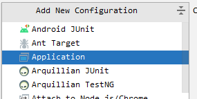
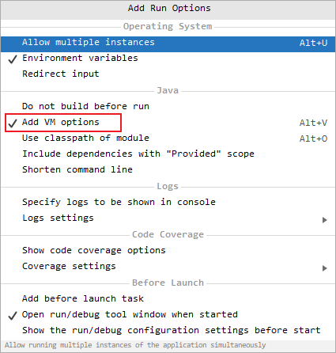

# 前置

搭建tomcat的源码环境，首先得去官网下载tomcat的源码包，我们这里使用的是tomcat9.0.44，然后将解压好的源码包添加一个pom文件，让其变成一个maven项目

```xml
<?xml version="1.0" encoding="UTF-8"?>
<project xmlns="http://maven.apache.org/POM/4.0.0"
         xmlns:xsi="http://www.w3.org/2001/XMLSchema-instance"
         xsi:schemaLocation="http://maven.apache.org/POM/4.0.0 http://maven.apache.org/xsd/maven-4.0.0.xsd">
    <modelVersion>4.0.0</modelVersion>
    <groupId>org.apache.tomcat</groupId>
    <artifactId>tomcat9</artifactId>
    <name>tomcat-9.0.44</name>
    <version>9.0.44</version>
    <build>
        <finalName>tomcat-9.0.44</finalName>
        <sourceDirectory>java</sourceDirectory>
        <!--<testSourceDirectory>test</testSourceDirectory>  test 下的有些文件报错，因此将test文件夹去掉了-->
        <resources>
            <resource>
                <directory>java</directory>
            </resource>
        </resources>
        <testResources>
            <testResource>
                <directory>test</directory>
            </testResource>
        </testResources>
        <plugins>
            <plugin>
                <groupId>org.apache.maven.plugins</groupId>
                <artifactId>maven-compiler-plugin</artifactId>
                <version>3.6.0</version>
                <configuration>
                    <encoding>UTF-8</encoding>
                    <source>1.8</source>
                    <target>1.8</target>
                </configuration>
            </plugin>
            <plugin>
                <groupId>org.apache.maven.plugins</groupId>
                <artifactId>maven-jar-plugin</artifactId>
                <version>3.0.2</version>
            </plugin>
        </plugins>
    </build>
    <dependencies>
        <dependency>
            <groupId>org.apache.ant</groupId>
            <artifactId>ant</artifactId>
            <version>1.9.5</version>
        </dependency>
        <!-- https://mvnrepository.com/artifact/biz.aQute.bnd/annotation -->
        <!-- https://mvnrepository.com/artifact/biz.aQute.bnd/biz.aQute.bndlib -->
        <dependency>
            <groupId>biz.aQute.bnd</groupId>
            <artifactId>biz.aQute.bndlib</artifactId>
            <version>5.2.0</version>
            <scope>provided</scope>
        </dependency>

        <!-- https://mvnrepository.com/artifact/org.apache.jasper/org.apache.jasper -->
        <!-- https://mvnrepository.com/artifact/org.apache.tomcat/tomcat-jasper -->
        <dependency>
            <groupId>org.apache.tomcat</groupId>
            <artifactId>tomcat-jasper</artifactId>
            <version>9.0.41</version>
        </dependency>
        <dependency>
            <groupId>org.apache.ant</groupId>
            <artifactId>ant-apache-log4j</artifactId>
            <version>1.9.5</version>
        </dependency>
        <dependency>
            <groupId>org.apache.ant</groupId>
            <artifactId>ant-commons-logging</artifactId>
            <version>1.9.5</version>
        </dependency>
        <dependency>
            <groupId>javax.xml.rpc</groupId>
            <artifactId>javax.xml.rpc-api</artifactId>
            <version>1.1</version>
        </dependency>
        <dependency>
            <groupId>wsdl4j</groupId>
            <artifactId>wsdl4j</artifactId>
            <version>1.6.2</version>
        </dependency>
        <dependency>
            <groupId>org.eclipse.jdt.core.compiler</groupId>
            <artifactId>ecj</artifactId>
            <version>4.6.1</version>
        </dependency>
    </dependencies>
</project>
```

对于我们以前启动tomcat来说，都是执行startup命令，但是这次我们以源码分析，可以查看startup命令，然后它其实执行的是catalina.bat命令，它里面规定了`MAINCLASS=org.apache.catalina.startup.Bootstrap`。

因此我们重点就可以开始分析源码中的Bootstrap类了。

我们先将项目启动起来，先配置一个Application：



然后给这个Application配置一个主类，就是我们上面说的Bootstrap类，同时可能项目启动的时候会报错，这时候就可以去根据提示修改源码，把VERSON_15等给修改成VERSON_8。然后为了解决乱码问题，可以添加一些VM。



```properties
-Duser.language=en
-Duser.region=US
-Dfile.encoding=UTF-8
-Dsun.jnu.encoding=UTF-8
```


如果一个请求http://localhost:8080/noaharno/hello，首先根据localhost解析到我们本机域名，而我们本机启动了一个tomcat，它监听了8080端口，因此这个请求就会交给我们的server服务器，服务器交给Catalina Service进行处理，然后它里面的Connector接受到了请求，然后交给引擎进行处理，然后此时我们的请求是localhost，然后引擎就会交给localhost所在的host，然后从webapps进行寻找。

