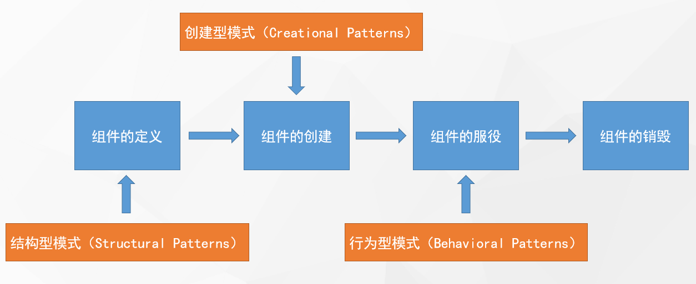

## 第零章 总览



**设计模式的七大原则**

1. 开闭原则（Open Closed Principle）：软件实体应当对扩展开放，对修改关闭（Software entities should be open for extension, but closed for modification）；合成复用原则、里氏替换原则相辅相成，都是开闭原则的具体实现规范；**扩展新类而不是修改旧类**
2. 里氏替换原则（Liskov Substitution Principle）：继承必须确保超类所拥有的性质在子类中仍然成立（Inheritance should ensure that any property proved about supertype objects also holds for subtype objects）；**继承父类而不去改变父类**
3. 合成复用原则（Composite Reuse Principle）：又叫组合/聚合复用原则（Composition/Aggregate Reuse Principle）；软件复用时，要尽量先使用组合或者聚合等关联关系来实现，其次才考虑使用继承关系来实现；**优先组合，其次继承**
4. 迪米特法则（Law of Demeter）：最少知识原则（Least Knowledge Principle）；只跟你的直接朋友交谈，不跟陌生人说话（Talk only to your immediate friends and not to strangers）；**无需直接交互的两个类，如果需要交互，使用中间者**；过度使用迪米特法则会使系统产生大量的中介类，从而增加系统的复杂性，使模块之间的通信效率降低
5. 接口隔离原则（Interface Segregation Principle）：一个类对另一个类的依赖应该建立在最小的接口上（The dependency of one class to another one should depend on the smallest possible interface）；**各个类建立自己的专用接口，而不是建立万能接口**
6. 依赖倒置原则（Dependence Inversion Principle）：高层模块不应该依赖底层模块，两者都应该依赖其抽象；抽象不应该依赖细节，细节应该依赖抽象（High level modules shouldnot depend upon low level modules. Both should depend upon abstractions. Abstractions should not depend upon details. Details should depend upon abstractions）；**面向接口编程，而不是面向实现类**
7. 单一职责原则（Single Responsibility Principle）：一个类应该有且仅有一个引起它变化的原因，否则类应该被拆分（There should never be more than one reason for a class to change）；**每个类只负责自己的事情，而不是变成万能**

## 第一章 创建型模式

**为什么用创建型模式？**

- 创建型模式关注点**怎样创建出对象**
- **将对象的创建与使用分离**
- 降低系统的耦合度
- 使用者无需关注对象的创建细节
  - 对象的创建由相关的工厂来完成：工厂模式
  - 对象的创建由一个建造者来完成：建造者模式
  - 对象的创建由原来对象克隆完成：原型模式
  - 对象始终在系统中只有一个实例：单例模式

### 1.1 单例（Singleton）模式

一个单一的类，负责创建自己的对象，同时确保系统中只有单个对象被创建。

单例特点：

- 某个类只能有一个实例：构造器私有
- 它必须自行创建这个实例：自己编写实例化逻辑
- 它必须自行向整个系统提供这个实例：对外提供实例化方法

应用场景：

- 多线程中的线程池
- 数据库中的连接池
- 系统环境信息
- 上下文（ServletContext）
- ...

面试问题：

- 系统环境信息（System.getProperties()）？
- Spring中怎么保持组件单例的
- ServletContext是什么？是单例吗？怎么保证的？
- ApplicationContext是什么？
- 数据库连接池一般是怎么创建出来的，怎么保证单例？

代码示例：

```java
private volatile static Person instance;

private Personn() {
    // 构造器私有化u
}

// 提供给外部的方法
// 1、锁加载方法上，但是锁太大，效率低
// 2、双重检查锁 + 内存可见性
public static Person getInstance() {
    if (instance == null) {
		synchronized (Person.class) {
            if (instance == null) {
                instance = new Person();
            }
        }
    }
    return instance;
}
```

### 1.2 原型（Prototype）模式

1. 原型模式是用于创建重复的对象，同时又能保证性能
2. 本体给外部提供一个克隆体进行使用
3. 使用场景：
   - 资源优化
   - 性能和安全要求
   - 一个对象多个修改者的场景
   - 一个对象需要提供给其他对象访问，而且各个调用者可能都需要修改其值时可以考虑使用原型模式拷贝多个对象供调用者使用
   - 深拷贝和浅拷贝

使用场景模拟：如果我们要自己写一个自己的mybatis框架，考虑到在进行查询的时候，在大多数情况下，我们查询到的数据应该是不怎么改变的。例如，如果我们查询一种商品信息：new Product("...")，然后需要查询一千次的话，系统里面就会有一千个内容相同的product对象，浪费内存；

因此就可以使用原型模式来解决，也就是可以使用缓存，将查过的数据进行保存，如果再查相同的数据，就拿到原来的原型对象的克隆对象。

```java
public class User {
    private String username;
    private Integer age;
    
    // 也可以使用其余的更加高效的方式实现克隆
    @Override
    protected Object clone() throws CloneNotSupportedException {
        User user = new User();
        user.setUsername(username);
        user.setAge(age);
        return user;
    }
}

public class DLFMybatis {
    // 缓存user
    private Map<String, User> userCache = new HashMap<>();
    
    public User getUser(String username) throws CloneNotSupportedException {
        User user = null;
        if (!userCache.containsKey(username)) {
            // 查询数据库
            user = getUserFromDb(username);
        } else {
            // 从缓存种直接拿数据的话会造成脏缓存问题
            // 拿到原型，但是不能直接给，应该给克隆体
            user = userCache.get(username);
            user = (User) userr.clone();
        }
        return user;
    }
    
    private User getUserFromDb(String username) throws CloneNotSupportedException {
        User user = new User();
        user.setUsername(username);
        // 给缓存中放一个clone，不然第一次查询数据库的时候返回的对象是原型
        userCache.put(username, (User) user.clone());
        return user;
    }
}
```

### 1.3 工厂（Factory）模式

工厂模式提供了一种创建对象的最佳方式。我们不必关系对象的创建细节，只需要根据不同情况获取不同产品即可。

应用场景：

- NumberFormat、SimpleDateFormat
- LoggerFactory
- SqlSessionFactory
- BeanFactory：Spring中的，就是为了造出bean

#### 1.3.1 简单工厂（Simple Factory）

比如我们有一个能生产van和mini两种车的工厂，就可以通过这个工厂来创建对应的类。

```java
/**
     *
     * @param type  如果使用Class进行反射: 好像具有扩展性，但是没有解决实际问题
     * @return
     */
public AbstractCar newCar(String type){

    //核心方法：一切从简
    if("van".equals(type)){
        // 如果后续还得用钣金、喷漆、放发动机、申请环保，因此class也不太好使
        return new VanCar();
    }else if("mini".equals(type)){
        return new MiniCar();
    }

    //.....

    //更多的产品，违反开闭原则。应该直接扩展出一个类来造
    return null;
}
```


缺点：违背开闭，扩展不易；如果想要该工厂创建更多的类，就得不停的使用if和else

#### 1.3.2 工厂方法（Factory Method）


如图所示，我们可以将工厂给抽象出来，然后给每种类都分别创建一个单独的工厂，这样扩展性增加。

缺点：系统复杂度增加，产品单一。每想要增加一个类，就得多一个工厂。

#### 1.3.3 抽象工厂（Abstract Factory）

如果我们想要生产手机、汽车、口罩等等，而且手机有小米手机、华为手机等，汽车有货车、私家车等。


其实还可以进行抽象，WuLinFactory下面有WulinMaskFactory和WulinCarFactory，然后每种工厂都生产各自的东西。


**工厂模式的退化**

当抽象工厂模式中的**每一个具体工厂类只创建一个产品对象**，也就是只存在一个产品等级结构时，**抽象工厂模式退化成工厂方法模式**；当工厂方法模式中抽象工厂与具体工厂合并，提供一个统一的工厂来创建产品对象，并将创建对象的工厂方法设计为静态方法时，**工厂方法模式退化成简单工厂模式**。

### 1.4 建造者（Builder）模式

每一个建造小细节都可以传入，但是都不是必须；**如果是必须，就构造器强制。**

创建的东西细节复杂，还必须暴露给使用者。**屏蔽过程而不屏蔽细节**


如果我们想要创建手机实例，就可以不通过new Phone的方式创建，而是通实现AbstractPhoneBuilder来创建实例。因为不同种类的手机有不同的实现细节。

```java
// 抽象构造者
public abstract class AbstractBuilder {
    Phone phone;
    abstract AbstractBuilder customCpu(String cpu);
    abstract AbstractBuilder customMem(String mem);
    abstract AbstractBuilder customDisk(String disk);
    abstract AbstractBuilder customCam(String cam);

    // 获取创建好的phone
    // 实际上返回的应该是不同的对象
    Phone getProduct() {
        return phone;
    }
}
```

```Java
// 具体构造者
public class XiaoMiBuilder extends AbstractBuilder {
    // 具体的细节暂不考虑，比如通过这个builder返回所有phone都将是同一对象，应该修改
    public XiaoMiBuilder() {
        phone = new Phone();
    }

    @Override
    AbstractBuilder customCpu(String cpu) {
        phone.cpu = cpu;
        return this;
    }

    @Override
    AbstractBuilder customMem(String mem) {
        phone.mem = mem;
        return this;
    }

    @Override
    AbstractBuilder customDisk(String disk) {
        phone.disk = disk;
        return this;
    }

    @Override
    AbstractBuilder customCam(String cam) {
        phone.cam = cam;
        return this;
    }
}
```

```java
public static void main(String[] args) {
    AbstractBuilder builder = new XiaoMiBuilder();
    Phone phone = builder.customCpu("骁龙8个8")
        .customCam("2亿")
        .customDisk("1T")
        .customMem("16G")
        .getProduct();
}
```

值得注意的是，LomBok提供了@Builder注解给我们使用，用的就是建造者模式

```java
// 加了注解之后就可以直接使用该类.builder()
Phone build = Phone.builder()
    .cpu("1")
    .mem("2")
    .cam("3")
    .disk("4")
    .build();
```

**使用场景**：

- StringBuilder中的append
- Swagger-ApiBuilder
- 快速实现。LomBok - Builder模式

## 第二章 结构型模式

**为什么使用结构型模式？**

- 结构型模式关注点“怎样组合对象/类？”，所以我们关注下类的组合关系
- 类结构型模式关系类的组合，由多个类可以组合成一个更大的（继承）
- 对象结构模式关系类与对象的组合，通过关联关系在一个类中定义另一个类的实例对象（组合）
- 根据合成复用原则，在系统中尽量使用关联关系来替代继承关系，因此大部分结构型模式都是对象结构型模式。

**结构型模式分类**

- 适配器模式：两个不兼容接口之间适配的桥梁
- 桥接模式：相同功能抽象化与实现化解耦，抽象与实现可以独立升级
- 过滤器模式：使用不同的标准来过滤一组对象
- 组合模式：相似对象进行组合，形成树形结构
- 装饰器模式：向一个现有的对象添加新的功能，同时又不改变其结构
- 外观模式：向现有的系统添加一个接口，客户端访问此接口来隐藏系统的复杂性
- 享元模式：尝试重用现有的同类对象，如果未找到匹配的对象，则创建新对象
- 代理模式：一个类代表另一个类的功能

### 2.1 适配器（Adapter）模式

将一个接口转换成客户希望的另一个接口，适配器模式使接口不兼容的那些类可以一起工作，适配器模式分为类结构型模式（继承）和对象结构型模式（组合）两种，前者（继承）类之间的耦合度比后者高，且要求程序员了解现有组件库中的相关组件的内部结构，所以应用相对较少些。

别名也可以是Wrapper，包装器。

适配器模式包含以下主要角色

- 目标接口：可以是抽象类或接口。客户希望直接用的接口
- 适配者：隐藏的转换接口
- 适配器：它是一个转换器，通过继承或引用适配者的对象，把适配者接口转换成目标接口。

通俗点就是说，比如我想看英文电影，然后还有一个翻译机。就可以通过通过一个适配器，让英文电影和翻译机联系起来，让我们能看懂英文电影


对象适配器模式：

```java
public class JPMoviePlayerAdapter implements Player {
    // 组合的方式
    private Translator translator = new Zh_JPTranslator();
    private Player target; // 被适配的对象
    public JPMoviePlayerAdapter(Player target) {
        this.target = target;
    }

    @Override
    public String play() {
        String play = target.play();
        // 转换字母，增强逻辑
        String translate = translator.translate(play);
        System.out.println("日文：" + translate);
        return play;
    }

    // 测试
    public static void main(String[] args) {
        // 使用适配器增强player
        JPMoviePlayerAdapter adapter = new JPMoviePlayerAdapter(new MoviePlayer());
        adapter.play();
    }
}
```

类适配：Adapter进行实现或者继承

```java
public class JPMoviePlayerAdapter extends Zh_JPTranslator implements Player {

    private Player target;//被适配对象
    public JPMoviePlayerAdapter(Player target){
        this.target = target;
    }

    @Override
    public String play() {
        String play = target.play();
        //转换字幕
        String translate = translate(play);
        System.out.println("日文："+translate);
        return play;
    }
}
```

**使用场景**

- Tomcat如何将Request流转为标准Request？
  - tomcat === CopyteAdapte == ServletRequest
- SpringAOP中的AdvisorAdapter是什么：增强的适配器
- SpringMVC中经典的HandlerAdapter是什么？
  - HelloController.hello()方法，通过HandlerAdapter来调用底层的Servlet.doGet()
- SpringBoot中的WebMvcConfigurerAdapter为什么存在又取消？

### 2.2 桥接（Bridge）模式

- 将抽象与实现解耦，使两者都可以独立变化。
- 在现实生活中，某些类具有两个或多个维度的变化，如图形即可按形状分，又可按颜色分。如何设计类似于Photoshop这样的软件，能画不同形状和不同颜色的图形呢？如果用继承方式的话，m种形状和n种颜色的图形就有m * n种，不但对应子类很多，而且扩展困难。
- **桥接将继承转换为关联，降低类之间的耦合度，减少代码量。**
- **真正会引起此类变化的一个维度直接抽取出来，通过组合的方式接起来**

桥接模式包含以下主要角色：

- 系统设计期间，如果这个类里面的一些东西，会扩展很多，这个东西就应该分离出来
- 抽象化（Abstraction）角色：定义抽象类，并包含一个对实现化对象的引用。
- 扩展抽象化（Refined Abstraction）角色：是抽象化角色的子类，实现父类中的业务方法，并通过组合关系调用实现化角色中的业务方法。
- 实现化（Implementor）角色：定义实现化角色的接口，供扩展抽象化角色调用。


**应用场景**

- 当一个类存在两个独立变化的维度，且这两个维度都需要进行扩展时。
- 当一个系统不希望使用继承或因为多层次继承导致系统类的个数急剧增加时
- 当一个系统需要在构件的抽象化角色和具体化角色之间增加更多的灵活性时
- InputStreamReader桥接模式。An InputStreamReader is a bridge from byte streams to character streams;
- InputStreamReader 桥接+ 适配器

```java
// 比如我们的重点是手机，然后手机有小米手机和苹果手机等等
// 而每种手机又有线上和线下两种销售模式
// 如果不使用桥接模式的话，就需要创建2 * 2个类
// 使用了桥接模式 只需要2 + 2个类了。
public abstract class AbstractPhone {
    // 将会引起变化的销售模式给抽取出来
    AbstractSale sale; // 【桥接的关注点】
    
    public void setSale(AbstractSale sale) {
        this.sale = sale;
    }
}

public abstract class AbstractSale {
    private String type;
    private Integer price;
}
```

测试如下：

```java
public static void main(String[] args) {

    // AbstractPhone的实现类
    IPhone iPhone = new IPhone();
    // 销售模式
    iPhone.setSale(new StudentSale("学生",1));


    String phone = iPhone.getPhone();
    System.out.println(phone);

}
```

### 2.3 装饰器（Decorator/Wrapper（包装））模式

- 适配器是连接两个类，可以增强一个类；而装饰器是增强一个类
- 向一个现有的对象添加新的功能，同时又不改变其结构，属于对象结构型模式
- 创建了一个装饰类，用来包装原有的类，并在保持类方法签名完整性的前提下，提供了额外的功能。


- 抽象构件（Component）角色：定义一个抽象接口以规范准备接收附加责任的对象
- 具体构建（ConcreteComponent）角色：实现抽象构件，通过装饰角色为其添加一些职责
- 抽象装饰（Decorator）角色：继承抽象构件，并包含具体构件的实例，可以通过其子类扩展具体构件的功能。
- 具体装饰（ConcreteDecorator）角色：实现抽象装饰的相关方法，并给具体构件对象添加附加的责任。

**使用场景**

- SpringSession中如何进行session与redis关联？HttpRequestWrapper
- MybatisPlus提取了Querywrapper，这是为什么
- Spring中的BeanWrapper是做什么的？包装了Bean，bean的功能增强？
- SpringWebflux中的WebHandlerDecorator
- 已存在的类，某一天在某个功能使用的时候发现不够，就可以使用装饰类。

```java
// 抽象构建
public  interface ManTikTok {
   void tiktok();
}

// 具体构件角色
public class ZhangTikTok implements ManTikTok{
    @Override
    public void tiktok() {
        System.out.println("张三，tiktok.... ");
    }
}

// 抽象装饰角色
// 给抖音直播增加新的功能
public interface TiktokDecorator extends ManTikTok{
    void enable();
}


/**
 * 美颜装饰器
 *      装饰谁？
 *  装饰器只关系增强这个类的方法。
 */
public class MeiYanDecorator implements TiktokDecorator{

    private ManTikTok manTikTok;
    public MeiYanDecorator(ManTikTok manTikTok){
        this.manTikTok = manTikTok;
    }

    @Override
    public void tiktok() {
        //开启美颜，新增的功能
        enable();
        //我开始直播
        manTikTok.tiktok();
    }


	// 定义的增强功能
    @Override
    public void enable() {
        System.out.println("看这个美女.....");
        System.out.println("花花花花花花花花花花花");
    }
}
```

测试类如下：

```java
/**
 * 核心：想要不改变原来接口方法的情况下扩展新功能，或者增强方法.....
 */
public class MainTest {

    public static void main(String[] args) {
        //被装饰对象
        ManTikTok manTikTok = new LeiTikTok();
        // 适配器
        MeiYanDecorator decorator = new MeiYanDecorator(manTikTok);
        decorator.tiktok();
    }
}
```

### 2.4 代理（Proxy）模式

代理模式，给某一个对象提供一个代理，并由代理对象控制对原对象的引用。对象结构型模式。

- Subject：抽象主体角色（抽象类或接口）
- Proxy：代理主体角色（代理对象类）
- RealSubject：真实主体角色（被代理对象类）

**应用场景**

- Mybatis中的mapper到底是什么？怎么生成的？
  - 动态代理
  - UserMapper、CityMapper，mybatis帮我们写实现MapperProxy
- Seata的DataSourceProxy是什么
- DruidDataSource存在的Proxy模式：监控链...

**区别--装饰器、代理**

- 装饰器和代理之间的区别很细微，可以认为装饰器是代理的一个子集
- 静态代理就是装饰器的方式

#### 2.4.1 静态代理（static）

静态代理和装饰器模式差不多

```java
/* 抽象主体。被代理角色能干什么 */
public  interface ManTikTok {
    void tiktok();
}

/** Subject  主体 */
public class LeiTikTok implements ManTikTok {
    @Override
    public void tiktok() {
        System.out.println("雷丰阳，tiktok.... ");
    }
}

/**
 * 代理一般都是和被代理对象属于同一个接口
 */
public class LiMingTiktokProxy implements ManTikTok{

    private ManTikTok manTikTok; //被代理对象
    public LiMingTiktokProxy(ManTikTok manTikTok){
        this.manTikTok = manTikTok;
    }

    @Override
    public void tiktok() {
        //增强功能
        System.out.println("渲染直播间....");
        System.out.println("课程只要666，仅此一天....");
        manTikTok.tiktok();
    }
}
```

#### 2.4.2 动态代理（dynamic）

```java
// 还是选择抖音卖货
public interface ManTikTok {
    void tiktok();
}

// 
public class LeiTikTok implements ManTikTok {
    @Override
    public void tiktok() {
        System.out.println("直播卖课啦，快来买");
    }
    
    // 如果这里面有自己定义的方法，而不是实现接口的方法
    // JDK动态代理将不能代理该本类自己的方法
}
```

代理类如下：

```java
public class JDKTiktokProxy<T> implements InvocaationHandler {
    private T target;
    // 接受被代理的对象
    JDKTiktokProxy(T target) {
        this.target = target;
    }
    
    // 获取被代理的对象的代理对象
    public static<T> T getProxy(T t) {
        /*
        	ClassLoader loader：当前被代理对象的类加载器
        	Class<?>[] interfaces：当前被代理对象所实现的所有接口
        	InvocationHandler h
        		当前被代理对象执行目标方法的时候我们可以使用h可以定义拦截增强方法
        */
        return (T)Proxy.newProxyInstance(
        	t.getClass().getClassLoader(),
            t.getClass().getInterfaces(), //必须为接口
        	new JDKTiktokProxy(t));
    }
    
    // 定义目标方法的拦截逻辑；每个方法都会进来的
    @Override
    public Object invoke(Object proxy,
                        Method method,
                        Object[] args) throws Throwable {
        // 反射执行，可以给方法添加新的功能
        System.out.println("真正执行被代理对象的方法");
        Object invoke = method.invoke(target, args);
        System.out.println("我是增强逻辑");
        return invoke;
    }
}
```

测试方法如下：

```java
public static void main(String[] args) {
    ManTikTok leiTikTok = new LeiTikTok();
    ManTikTk proxy = JDKTiktokProxy.getProxy(leiTikTok);
    proxy.tiktok();
}
```

如果使用代理对象执行本类的接口，将会出现以下错误：

<div style="color :red">Exception in thread "main" java.lang.ClassCastException: com.sun.proxy.$Proxy0 cannot be cast to com.atguigu.design.structural.proxy.dynamic.LeiTikTok
	at com.atguigu.design.structural.proxy.dynamic.MainTest.main(MainTest.java:29)</div>


#### 2.4.3 Cglib代理

首先需要添加相关依赖

```xml
<!-- https://mvnrepository.com/artifact/cglib/cglib -->
<dependency>
    <groupId>cglib</groupId>
    <artifactId>cglib</artifactId>
    <version>3.3.0</version>
</dependency>
```

它和JDK动态代理的好处就是可以代理本类自己的方法

```java
// Subject  主体
public class LeiTikTok {
    public void tiktokHaha() {
        System.out.println("雷丰阳，tiktok.... haha....");
    }
}
```

使用cglib帮我们创建出代理对象

```java
public class CglibProxy {
    public static<T> T createProxy(T t) {
        // 1、创建一个增强器
        Enhancer enhancer = new Enhancer();
        // 2、设置要增强哪个类的功能，增强器为这个类动态创建一个子类
        enhancer.setSuperClass(t.getClass());
        // 3、设置回调
        // 为了能获取到原方法的一些元数据信息
        enhancer.setCallback((MethodInterceptor) (obj, method, args, proxy) -> {
            // 编写拦截的逻辑
            System.out.println("cglib上场了");
            // 也可以通过method参数获取到当前方法的相应信息
            return proxy.invokSuper(obj, args);
        });
        return (T)enhancer.create();
    }
}
```

测试如下：

```java
public static void man(String[] args) {
   	LeiTikTok proxy = CglibProxy.createProxy(new LeiTikTok());
    proxy.tiktokHaha();
}
```

### 2.5 组合（Composite）模式

组合模式就是把一组相似的对象当作一个单一的对象。如树形菜单


### 2.6 外观（Facade）模式

又叫做门面模式，是一种通过**为多个复杂的子系统提供一个一致的接口**，而使这些子系统更加容易被访问的模式。


**使用场景**

- 去医院看病，可能要去挂号、门诊、取药等等，让患者和家属觉得很复杂，如果有提供接待人员，只让接待人员来处理，就很方便
- JAVA的三层开发模式
- 分布式系统的网关
- Tomcat源码中的RequestFacade

### 2.7 享元（Flyweight）模式

- **运用共享技术有效地支持大量细粒度对象的复用**。系统只使用少量的对象，而这些对象都很相似，状态变化很小，可以实现对象的多次复用。对象结构型
- 在享元模式中**可以共享的相同内容称为内部状态（IntrinsicState）**，而那些需要外部环境来设置的**不能共享的内容称为外部状态（ExtrinsicState）**，由于区分了内部状态和外部状态，因此可以通过设置不同的外部状态使得相同的对象可以具有一些不同的特征，而相同的内部状态是可以共享的
- 在享元模式中通常会出现工厂模式，而创建一个**享元工厂来负责维护一个享元池**（Flyweight Pool）用于存储具有相同内部状态的对象
- 享元模式包含以下角色：
  - Flyweight：抽象享元类Connection
  - ConcreteFlyweight：具体享元类 ConnectionImpl（user, pwd, url）
  - UnsharedConcreteFlyweight：非共享具体享元类ConnectionImpl（state）
  - FlyweightFactory：享元工厂类；简单工厂，产品就一个Connection


**使用场景**

- 数据库连接池
- 所有的池化技术
- 享元和原型模式有什么区别？享元是预先准备好的对象进行复用，原型没法确定预先有哪些。

```java
// 可共享和不可共享状态
public abstract class AbstractWaitressFlyweight {
    boolean canService = true; // 能否服务
    // 正在服务。享元的不可共享属性留给外部进行改变的接口
    abstract void service();
    // 服务完成。
    abstract void end();

    public boolean isCanService() {
        return canService;
    }
}

// 具体享元类
@AllArgsConstructor
public class BeautifulWaitress extends AbstractWaitressFlyweight {
    String id;
    String name;
    int age;
    // 以上是不变的

    @Override
    void service() {
        System.out.println("工号："+id+"；"+name+" "+age+" 正在为您服务...");
        //改变外部状态
        this.canService = false;
    }

    @Override
    void end() {
        System.out.println("工号："+id+"；"+name+" "+age+" 服务结束...请给五星好评");
        this.canService = true;
    }
}

/**
 * 足道店：这相当于享元工厂
 *      店里面很多服务员。
 * 享元和原型
 * 1、享元返回的是这个本人。
 * 2、原型返回的是克隆人。
 */
public class ZuDao {
    private static Map<String,AbstractWaitressFlyweight> pool = new HashMap<>();
    //享元，池子中有对象
    static {
        BeautifulWaitress waitress =
            new BeautifulWaitress("1111","张三",18);
        BeautifulWaitress waitress2 =
            new BeautifulWaitress("9527","李四",20);
        pool.put(waitress.id,waitress);
        pool.put(waitress2.id,waitress2);
    }
    // 向池子中添加对象
    public void addWaitress(AbstractWaitressFlyweight waitressFlyweight){
        pool.put(UUID.randomUUID().toString(),waitressFlyweight);
    }

    public static AbstractWaitressFlyweight getWaitress(String name){
        AbstractWaitressFlyweight flyweight = pool.get(name);
        if(flyweight == null){
            for (AbstractWaitressFlyweight value : pool.values()) {
                //当前共享对象能否是否
                if(value.isCanService()){
                    return value;
                }
            };
            return null;
        }
        return flyweight;
    }
}
```

测试如下：

```java
public static void main(String[] args) {

    //1、我
    AbstractWaitressFlyweight waitress = ZuDao.getWaitress("");
    waitress.service();
    System.out.println(waitress);
    //2、佟老师
    AbstractWaitressFlyweight waitress1 = ZuDao.getWaitress("");
    waitress1.service();
    System.out.println(waitress1);

    waitress1.end();
    //3、刘佳林
    AbstractWaitressFlyweight waitress2 = ZuDao.getWaitress("");
    System.out.println(waitress2);

}
```

### 2.8 过滤器（Filter）模式

使用不同的标准来过滤一组对象，通过逻辑运算以解耦的方式把它们连接起来。结合多个标准来获得单一标准。

https://www.runoob.com/design-pattern/filter-pattern.html


## 第三章 行为型模式

- 行为型模式关注点**怎样运行对象/类**，所以我们关注下类/对象的运行时流程控制
- 行为型模式用于描述程序在运行时复杂的流程控制
- 描述多个类或对象之间怎样相互协作共同完成单个对象都无法单独完成的任务，它涉及算法与对象间职责的分配。
- 行为型模式分为类行为模式和对象行为模式，前者采用继承•机制来在类间分派行为，后者采用组合或聚合在对象间分配行为。由于组合关系或聚合关系比继承关系耦合度低，满足“**合成复用原则**”，所以对象行为模式比类行为模式具有更大的灵活性。

**行为型模式分类**

- 模板方法（Template Method）模式：父类定义算法骨架，某些实现放在子类
- 策略（Strategy）模式：每种算法独立封装，根据不同情况使用不同算法策略
- 状态（State）模式：每种状态独立封装，不同状态内部封装了不同行为
- 命令（Command）模式：将一个请求封装为一个对象，使发出请求的责任和执行请求的责任分割开
- 职责链（Chain of Responsibility）模式：所有处理者封装为链式结构，依次调用
- 备忘录（Memento）模式：把核心信息抽取出来，可以进行保存
- 解释器（Interpreter）模式：定义语法解析规则
- 观察者（Observer）模式：维护多个观察者依赖，状态变化通知所有观察者
- 中介者（Mediator）模式：取消类/对象的直接调用关系，使用中介者维护
- 迭代器（Iterator）模式：定义集合数据的遍历规则
- 访问者（Visitor）模式：分离对象结构，与元素的执行算法

除了模板方法模式和解释器模式是类行为模式，其他的都属于对象行为模式

### 3.1 模板方法（Template Method）模式

在该模式中，一个抽象类公开定义了执行它的方法的方式模板。它的子类可以按需要重写方法实现，但调用将以抽象类中定义的方法进行。


**使用场景**

- Spring的整个继承体系都基本用到模板方法：BeanFactory.getBean
- JdbcTemplate、RedisTemplate都允许我们再扩展
- 我们自己的系统也应该使用模板方法组织类结构

```java
/**
 * 1、定义模板
 */
public abstract class CookTemplate {

    /**
     * 定义算法：  定义好了模板
     * 父类可以实现某些步骤
     * 留关键给子类
     */
    public void cook(){
        //定义算法步骤
        heating();   //v
        addfood();
        addsalt();
        stirfry();   //v
        end();      //v
    }

    //加热方法
    public void heating(){
        System.out.println("开火...");
    };
    //添加食物
    public abstract void addfood();
    //加盐
    public abstract void addsalt();
    //翻炒
    public  void stirfry(){
        System.out.println("翻炒中...");
    };
    //出锅
    public  void end(){
        System.out.println("出锅....");
    };
}

// 实现父类留给子类自定义的方法
public class AutoCookMachine extends CookTemplate{

    @Override
    public void addfood() {
        System.out.println("放了三个小白菜");
    }

    @Override
    public void addsalt() {
        System.out.println("放了三勺盐");
    }

    public static void main(String[] args) {
        AutoCookMachine cookMachine = new AutoCookMachine();
        cookMachine.cook();
    }
}
```

### 3.2 策略（Strategy）模式

策略模式定义了一系列算法，并将每个算法封装起来，使它们可以相互替换，且算法的变化不会影响使用算法的客户。属于对象行为模式


**主要角色**

- 抽象策略类：公共接口，各种不同的算法以不同的方式实现这个接口，环境角色使用这个接口调用不同的算法，一般使用接口或抽象类实现。
- 具体策略类：实现了抽象策略定义的接口，提供具体的算法实现。
- 环境类：持有一个策略类的引用，最终给客户端调用。

**应用场景**

- 使用策略模式可以避免使用多重条件语句，如if else语句、switch
- 什么是Spring中的InstantiationStrategy
- 线程池拒绝策略

```java
/* 游戏策略 */
public interface GameStrategy {
    //战斗策略
    void warStrategy();
}

public class RandomStrategy implements GameStrategy{
    @Override
    public void warStrategy() {
        System.out.println("大乱斗...");
    }
}
/**
 * 稳健运营策略
 */
public class SteadyStrategy implements GameStrategy {
    @Override
    public void warStrategy() {
        System.out.println("各路小心...及时支援...");
    }
}

/**
 * 环境类，也可以通过构造函数强行让其指定策略
 */
public class TeamGNR {

    //抽取游戏策略算法，并进行引用
    private GameStrategy gameStrategy;

    public void setGameStrategy(GameStrategy gameStrategy) {
        this.gameStrategy = gameStrategy;
    }

    public void startGame(){
        System.out.println("游戏开始.....");
        //游戏策略
        gameStrategy.warStrategy();
        System.out.println("win......");
    }
}

public class MainTest {
    public static void main(String[] args) {
        TeamGNR gnr = new TeamGNR();
        gnr.setGameStrategy(new RandomStrategy());
        gnr.startGame();
    }
}
```

### 3.3 状态（State）模式

对有状态的对象，把复杂的”判断逻辑“提取到不同的状态对象中，允许状态对象在其内部状态发生改变时改变其行为


**重点是状态的流转**

**应用场景**

- 状态模式核心**需要具体状态类能在必要的时候切换状态**，和策略模式不一样
- 流程框架和状态机

```java
/** * 抽象状态*/
public interface TeamState {
    //玩游戏
    void playGame();
    //切换到下一个状态
    TeamState next();
}

/**
 * 竞赛状态
 */
public class MatchState implements TeamState{
    @Override
    public void playGame() {
        System.out.println("全力以赴打比赛....");
    }
    //状态模式的核心
    @Override
    public TeamState next() {
        return new VocationState();
    }
}

/**
 * 休假状态
 */
public class VocationState implements TeamState {
    @Override
    public void playGame() {
        System.out.println("三亚旅游真舒服....饿了...不玩游戏");
        //状态流转

    }
    @Override
    public TeamState next() {
        return new BeafNodleState();
    }
}

/**
 * 吃牛肉面状态
 */
public class BeafNodleState implements TeamState {
    @Override
    public void playGame() {
        System.out.println("饱饱的一顿牛肉面......中了诅咒，输了");
    }
    @Override
    public TeamState next() {
        return new MatchState();
    }
}
```

环境类：

```java
public class SKTTeam {
    private TeamState teamState;
    public void setTeamState(TeamState teamState) {
        this.teamState = teamState;
    }

    //开始游戏
    public void startGame(){
        //状态不同会导致不同的游戏结果
        teamState.playGame();
    }

    //下一个状态 可以通过环境类调，也可以直接使用抽象状态的next方法
    void nextState(){
        teamState = teamState.next();
    }
}
```

测试类：

```java
/**
 * 状态切换
 */
public class MainTest {

    public static void main(String[] args) {

        SKTTeam sktTeam = new SKTTeam();
        TeamState state = new VocationState();
        sktTeam.setTeamState(state);
        sktTeam.startGame();

        //        sktTeam.startGame();
        //
        //        sktTeam.nextState();
        //
        //
        //        sktTeam.startGame();
        //
        //        sktTeam.nextState();
        //        sktTeam.startGame();

        state = state.next();
        sktTeam.setTeamState(state);
        sktTeam.startGame();

        //状态需要维护自己的切换逻辑
        state = state.next();
        sktTeam.setTeamState(state);
        sktTeam.startGame();
    }
}
```

### 3.4 中介者（Mediator）模式


中介者模式：用一个中介对象来封装一系列的对象交互，中介者使各对象不需要显示地相互引用，减少对象间混乱的依赖关系，从而使其耦合松散，而且可以独立地改变它们之间的交互。对象行为模式

如上图所示，用一个塔台来管理所有的飞机，在飞机想要降落的时候，就看塔台允不允许降落；飞机想要起飞的时候，就看塔台允不允许起飞。


**应用场景**

- SpringMVC中的DispatcherServlet是一个中介者，他会提取Controller、Model、View来进行调用。而无需Controller直接调用view之类的渲染方法
- 分布式系统中的网关
- 迪米特发法则的一个典型应用
- 中介者和外观（门面）模式区别：中介者双向操作，门面偏向于封装某一方

### 3.5 观察者（Observer）模式

定义对象间的一种**一对多依赖关系**，使得每**当一个对象状态发生改变**时，其相关**依赖对象皆得到通知**并被**自动更新**。观察者模式又叫做**发布-订阅**（Publisher/Subscribe）模式、模型-视图模式、源-监听器模式或从属模式。对象行为模式


**应用场景**

- Spring事件机制如何实现
- Vue的双向绑定核心
- 响应式编程核心思想

### 3.6 备忘录（Memento）模式

在不破坏封装性的前提下，捕获一个对象的内部状态，并在该对象之外保存这个状态，以便以后当需要时能将该对象恢复到原先保存的状态。该模式又叫**快照模式**。对象行为型模式


- 发起人（Originator）角色：记录当前时刻的内部状态信息，提供创建备忘录和恢复备忘录数据的功能，实现其他业务功能，它可以访问备忘录里的所有信息
- 备忘录（Memento）角色：负责存储发起人的内部状态，在需要的时候提供这些内部状态给发起人
- 管理者（Caretaker）角色：对备忘录进行管理，提供保存与获取备忘录的功能，但其不能对备忘录的内容进行访问与修改。

**应用场景**

- 游戏存档
- 数据库保存点事务（savepoint）
- session活化钝化

```java
/**
 * 游戏记录。需要保存的内部状态信息，
 *      也叫备忘录信息
 */
@Data
public class GameRecord {
    Integer id; //代表生成记录的id
    Integer coin;//剩余金币
    Integer hp;//血量
    Integer mp;//蓝量
    Integer level;//等级

    //获取当前备忘录信息
    void getCurrent(){
        System.out.println("coin："+coin+"；\t"+"hp："+hp+"；\t mp："+mp);
    }

}
```

当前游戏信息

```java
/**
 * 游戏者： 游戏发起人
 * 当前游戏信息
 */
@Data
public class LeiGamer  {
    Integer coin;//剩余金币
    Integer hp;//血量
    Integer mp;//蓝量
    Integer level;//等级
    //以上的是内部状态，我们需要记录保存的信息

    GameServer gameServer = new GameServer();

    //保存游戏记录
    void saveGameRecord() throws Exception {
        System.out.println("正在保存当前记录....");
        GameRecord gameRecord = new GameRecord();
        //当前游戏信息保存到备忘录
        BeanUtils.copyProperties(gameRecord,this);
        //
        gameServer.add(gameRecord);
    }

    //从备忘录获取游戏历史存档
    LeiGamer getFromMemento(Integer id) throws Exception {
        System.out.println("获取历史存档信息....");
        LeiGamer record = gameServer.getRecord(id);
        return record;
    }

    //玩游戏
    void playGame(){
        int i = new Random().nextInt();
        System.out.println("......(〃'▽'〃)......"+i);
        coin = i;
        hp = i;
        mp = i;
        level = i;
    }

    //退出游戏
    void exitGame() throws Exception {
        System.out.println("退出&存档");
        saveGameRecord();
    }

}
```

游戏服务器，存储游戏信息

```java
/**
 * 游戏服务器
 * 管理者
 */
public class GameServer {

    //管理备忘录信息的
    Map<Integer,GameRecord> records = new HashMap<>();
    int i = 1;

    void add(GameRecord gameRecord){
        gameRecord.setId(i++);
        records.put(gameRecord.id,gameRecord);
    }

    LeiGamer getRecord(Integer id) throws Exception {
        GameRecord gameRecord = records.get(id);
        //获取到备忘录里面的内容以后还要逆转
        LeiGamer leiGamer = new LeiGamer();
//        leiGamer.setCoin(gameRecord.getCoin());
        //BeanUtils：工具类，属性对拷
        BeanUtils.copyProperties(leiGamer,gameRecord);
        return  leiGamer;
    }
}
```

### 3.7 解释器（Interpreter）模式

给**分析对象定义一个语言，并定义该语言的文法表示**，再**设计一个解释器**来**解释语言中的句子**。也就是说，用编译语言的方式来分析应用中的实例。这种模式实现了文法表达式处理的接口，该接口解释一个特定的上下文。类行为模式

**主要角色**：

- 抽象表达式（Abstract Expression）角色：定义解释器的接口，约定解释器的解释操作，主要包含解释方法interpret（）
- 终结符表达式（Terminal Expression）角色：是抽象表达式的子类，用来实现文法中与终结符相关的操作，文法中的每一个终结符都有一个具体终结表达式与之相对应
- 非终结符表达式（Nonterminal Expression）角色：也是抽象表达式的子类，用来实现文法中与非终结符相关的操作，文法中的每条规则都对应于一个非终结符表达式
- 环境（Context）角色：通常包含各个解释器需要的数据或是公共的功能，一般用来传递被所有解释器共享的数据，后面的解释器可以从这里获取这些值
- 客户端（Client）：主要任务是将需要分析的句子或表达式转换成使用解释器对象描述的抽象语法树，然后调用解释器的解释方法，当然也可以i通过环境角色间接访问解释器的解释方法


**应用场景**

- Spring的表达式解析：#{}
- Thymeleaf等模板引擎的语法解析
- 编译原理
- 编译器
- execution( * top.noaharno.. (int,..))

```java
/**
 * 身份信息表达式
 * 表达式的解析
 *
 */
public abstract class IDCardExpression {

    /**
     * 定义解析逻辑
     * 假设我们需要解析的信息格式为：
     *      上海市：张文宏-医生
     *      武汉市：雷丰阳-程序员
     *      北京市：宋宋-老人
     *  表达式中，“：”以前的是城市，“-”以后的是职业
     * @param expression
     * @return
     */
    abstract boolean interpret(String expression);

}
```

```java
/**
 * 终结符表达式
 *
 * 多少种解析规则就需要定义多少种规则类
 *
 */
public class TerminalExpression extends IDCardExpression {

    IDCardExpression childExp;

    Set<String> data;  //免费数据
    String symbol; //定义解析用的符号如  ： -

    public TerminalExpression( Set<String>  data,String symbol){
        this.data = data;
        this.symbol = symbol;
    }

    @Override
    boolean interpret(String expression) {
        //上海市：张文宏-医生
        //1、先按照指定符号分割
        String[] split = expression.split(symbol);

        // 冒号：  上海市              张文宏-医生
        // 短横线  上海市：张文宏       医生
        boolean result = false;
        for (String s : split) {
            if(data.contains(s)){
                return true;
            };//说明是免费的信息里面的
        }

        //可以继续子解析
//        childExp.interpret(expression);

        //不在免费行列
        return false;
    }
}
```

```java
/**
 * 非终结表达式
 */
public class OrExpression extends IDCardExpression {

    //组合两个终结表达式。最终的判断结果是终结表达式判断出来的，这个表达式只是一个桥梁
    private IDCardExpression cityExp;
    private IDCardExpression typeExp;

    public OrExpression(IDCardExpression cityExp, IDCardExpression typeExp) {
        this.cityExp = cityExp;
        this.typeExp = typeExp;
    }

    @Override
    boolean interpret(String expression) {

        //定义所有终结表达式的合并逻辑
        return cityExp.interpret(expression) || typeExp.interpret(expression);
    }
}
```

```java
/**
 * 环境类：
 * 风景区
 */
public class Area {
    Set<String> city = new HashSet<>();


    Set<String> type = new HashSet<>();
    IDCardExpression idCardReader;//读卡器，表达式解析器

    //环境类持有表达式

    public Area(){
//        {"武汉市","上海市"};//免费城市
//        {"医生","老人","儿童"};//免费人群
        city.add("武汉市");
        city.add("上海市");

        type.add("医生");
//        type.add("老人");
        type.add("儿童");
        //最小解析
        TerminalExpression city =
                new TerminalExpression(this.city, ":");
        //最小解析
        TerminalExpression type =
                new TerminalExpression(this.type, "-");


        //以上满足一个即可
        idCardReader = new OrExpression(city,type);

    }

    /**
     * 传入表达式，判断当前表达式是否指定为免费人群
     * @param expression
     */
    void getTicket(String expression){
        boolean interpret = idCardReader.interpret(expression);
        if(interpret){
            System.out.println("恭喜你，免票通过....");
        }else {
            System.out.println("对不起，请2元购票....");
        }
    }
}
```

```java
public class MainTest {

    public static void main(String[] args) {

        Area area = new Area();
        /**
         *  上海市：张文宏-医生
         *  武汉市:雷丰阳-程序员
         *  北京市：宋宋-老人
         */
        String sr = "武汉市:雷丰阳-程序员";

        area.getTicket(sr);

    }
}
```

### 3.8 命令（Command）模式

将一个请求封装为一个对象，使发出请求的责任和执行请求的责任分隔开。这样两者之间通过命令对象进行沟通，这样方便将命令对象进行存储、传递、调用、增加与管理

**其实我们使用的controller、service、dao就是典型的命令模式**

**主要角色**

- 抽象命令类角色：声明执行命令的接口，拥有执行命令的抽象方法execute
- 具体命令类角色：是抽象命令类的具体实现类，它拥有接收者对象，并通过调用接收者的功能来完成命令要执行的操作。
- 实现者/接收者角色：执行命令功能的相关操作，是具体命令对象业务的真正实现者
- 调用者/请求者角色：是请求的发送者，它通常拥有很多的命令对象，并通过访问命令对象来执行相关请求，它不直接访问接收者。


**应用场景**

- mvc就是典型的命令模式
- 当系统需要执行一组操作时，命令模式可以定义宏命令（一个命令组合了多个命令）来实现该功能
- 结合备忘录模式还可以实现命令的撤销和恢复

### 3.9 迭代器（Iterator）模式

提供一个对象（迭代器）来顺序访问聚合对象（迭代数据）中的一系列数据，而不暴露聚合对象的内部表示。对象行为型模式

- 抽象聚合（Aggregate）角色：定义存储、添加、删除聚合对象以及创建迭代器对象的接口。
- 具体聚合（ConcreteAggregate）角色：实现抽象聚合类，返回一个具体迭代器的实例。
- 抽象迭代器（Iterator）角色：定义访问和遍历聚合元素的接口，通常包含 hasNext()、first()、next() 等方法。
- 具体迭代器（Concretelterator）角色：实现抽象迭代器接口中所定义的方法，完成对聚合对象的遍历，记录遍历的当前位置。


**应用场景**

- jdk容器接口的Iterator定义
- 现实开发中，我们几乎无需编写迭代器，基本数据结构链表、树、图的迭代器已经都有了。除非要重写迭代逻辑

### 3.10 访问者（Visitor）模式

将作用于某种数据结构中的各元素的操作分离出来封装成独立的类，使其在不改变数据结构的前提下可以添加作用于这些元素的新的操作，为数据结构中的每个元素提供多种访问方式。它将对数据的操作与数据结构进行分离，是类行为模式中最复杂的一种模式

**主要角色**

- 抽象访问者（Visitor）角色：定义一个访问具体元素的接口，为每个具体元素类对应一个访问操作 visit() ，该操作中的参数类型标识了被访问的具体元素。
- 具体访问者（ConcreteVisitor）角色：实现抽象访问者角色中声明的各个访问操作，确定访问者访问一个元素时该做什么。
- 抽象元素（Element）角色：声明一个包含接受操作 accept() 的接口，被接受的访问者对象作为 accept() 方法的参数。
- 具体元素（ConcreteElement）角色：实现抽象元素角色提供的 accept() 操作，其方法体通常都是 visitor.visit(this) ，另外具体元素中可能还包含本身业务逻辑的相关操作。
- 对象结构（Object Structure）角色：是一个包含元素角色的容器，提供让访问者对象遍历容器中的所有元素的方法，通常由 List、Set、Map 等聚合类实现。


**应用场景**

- 在访问者模式中，每增加一个新的元素类，都要在每一个具体访问者类中增加相应的具体操作，这违背了开闭原则
- 违反**依赖倒置原则**。访问者模式依赖了具体类，而没有依赖抽象类
- 破坏封装。访问者模式中具体元素对访问者公开细节
- 应用于对象结构相对稳定，但其操作算法经常变化的程序
- Spring反射工具中的MethodVisitor是什么？

```java
/**
 * 硬件。      抽象元素类
 */
public  abstract class Hardware {
    String command;//封装硬件的处理指令

    public Hardware(String command){
        this.command = command;
    }

    //收到命令以后进行工作
    abstract public void work();
    //定义接受软件升级包的方法。这个方法应该具体硬件去实现
    abstract public void accept(Vistor vistor);
}

public class CPU  extends Hardware{
    public CPU(String command) {
        super(command);
    }

    @Override
    public void work() {
        System.out.println("CPU处理指令："+command);
    }

    @Override
    public void accept(Vistor vistor) {
        //给升级包提供一个改CPU指令等信息的办法
        vistor.visitCPU(this);
    }

}

public class Disk extends Hardware{
    public Disk(String command) {
        super(command);
    }

    @Override
    public void work() {
        System.out.println("Disk保存指令的历史记录："+command);
    }

    @Override
    public void accept(Vistor vistor) {
        vistor.visitDisk(this);
    }
}
```

升级包

```java
/**
 * 升级包的接口
 */
public interface Vistor {
    //访问者能访问元素。
    void visitDisk(Disk disk);
    void visitCPU(CPU cpu);
}

/**
 * 升级包可以更改指令
 */
public class UpdatePackage implements Vistor{

    private String ext;
    public  UpdatePackage(String ext){
        this.ext = ext;
    }

    @Override
    public void visitDisk(Disk disk) {
        disk.command += " >>> "+ext;
    }
    @Override
    public void visitCPU(CPU cpu) {
        //改属性为例
        cpu.command += ">>>> "+ext;
        //装饰模式。改方法
    }
}
```

可以理解为小爱机器人相对稳定，但是需要经常升级指令

```java
/**
 * 小爱机器人
 */
public class XiaoAi {

    private CPU cpu = new CPU("武汉天气");
    private Disk disk = new Disk("武汉天气");

    void answerQuestion(){
        cpu.work();
        disk.work();
    }

    //接受升级包
    public void acceptUpdate(Vistor aPackage) {
        //访问模式
        aPackage.visitCPU(cpu);
        aPackage.visitDisk(disk);
    }
}

```

测试

```java
public class MainTest {

    public static void main(String[] args) {

        XiaoAi xiaoAi = new XiaoAi();
        xiaoAi.answerQuestion();
        //升级。cpu联网处理指令
        //升级。disk保存到云存储
        UpdatePackage aPackage = new UpdatePackage("联网增强功能");
        xiaoAi.acceptUpdate(aPackage);
        //访问者
        xiaoAi.answerQuestion();
    }
}
```

### 3.11 责任链（Chain of Responsibility）模式

为了避免请求发送者与多个请求处理者耦合在一起，于是将所有请求的处理者通过前一对象记住其下一个对象的引用而连城一条链；当有请求发生时，可以将请求沿着这条链传递，直到有对象处理它为止

**主要角色**

- 抽象处理者（Handler）角色：定义一个处理请求的接口，包含抽象处理方法和一个后继连接。
- 具体处理者（Concrete Handler）角色：实现抽象处理者的处理方法，判断能否处理本次请求，如果可以处理请求则处理，否则将该请求转给它的后继者。
- 客户类（Client）角色：创建处理链，并向链头的具体处理者对象提交请求，它不关心处理细节和请求的传递过程。


**应用场景**

- Tomcat的Pipeline、Value
- Filter链
- Aop责任链

自定义request和response

```java
@Data
public class Request {
    String msg; //请求内容
    public Request(String msg){
        this.msg = msg;
    }
}

@Data
public class Response {
    String content;
    public Response(String content){
        this.content = content;
    }
}
```

自定义过滤器

```java
public interface Filter {

    void doFilter(Request request,Response response,FilterChain chain);
}

public class CharacterFilter implements Filter{
    @Override
    public void doFilter(Request request, Response response, FilterChain chain) {
        //功能
        request.msg +=" ====";
        System.out.println("CharacterFilter...doFilter之前");
        //放行
        chain.doFilter(request,response,chain);
        System.out.println("CharacterFilter...doFilter之后");
    }
}

public class EncodingFilter  implements Filter{
    @Override
    public void doFilter(Request request, Response response, FilterChain chain) {
        request.msg+=" oooo";
        System.out.println("EncodingFilter...doFilter之前");
        //放行
        chain.doFilter(request,response,chain);
        System.out.println("EncodingFilter...doFilter之后");
    }
}

public class HttpFilter implements Filter{
    @Override
    public void doFilter(Request request, Response response, FilterChain chain) {
        //第一个filter的功能
        request.msg+=">>>";
        System.out.println("HttpFilter...doFilter之前");
        //放行
        chain.doFilter(request,response,chain);
        System.out.println("HttpFilter...doFilter之后");
    }
}
```

自定义过滤链和目标执行方法

```java
// 目标执行方法
public class My {
    void hello(){
        System.out.println("调用my.hello()");
    }
}

/**
 * 靠他维护链条
 * HandlerExecutionChain
 */
public class FilterChain implements Filter {

    //记录当前执行的步骤
    int cursor = 0;
    //filter的链
    List<Filter> filtersChain = new ArrayList<>();

    //最终要执行的目标方法
    My target;

    public void setTarget(My target) {
        this.target = target;
    }

    public My getTarget() {
        return target;
    }

    //添加filter
    void addFilter(Filter filter){
        filtersChain.add(filter);
    }

    @Override
    public void doFilter(Request request, Response response, FilterChain chain) {
        //第一次执行第一个filter，一次往下
        //游标小于总数量filter一直往下获取执行
        if(cursor < filtersChain.size()){
            Filter filter = filtersChain.get(cursor);
            cursor++;
            //执行filter
            filter.doFilter(request,response,chain);
        }else {
            //filter完了，该执行目标方法了
            target.hello();
        }
    }
}
```

测试方法

```java
// 1---2---3--my---3---2---1
public class MainTest {

    public static void main(String[] args) {
        FilterChain chain = new FilterChain();

        //web.xml =- filter
        HttpFilter filter = new HttpFilter();
        CharacterFilter characterFilter = new CharacterFilter();
        EncodingFilter encodingFilter = new EncodingFilter();
        chain.addFilter(filter);
        chain.addFilter(characterFilter);
        chain.addFilter(encodingFilter);

        chain.setTarget(new My());

        //filter如何链式执行。

        chain.doFilter(new Request("hello world"),
                       new Response("adhkjasdhak"),chain);
    }
}
```
