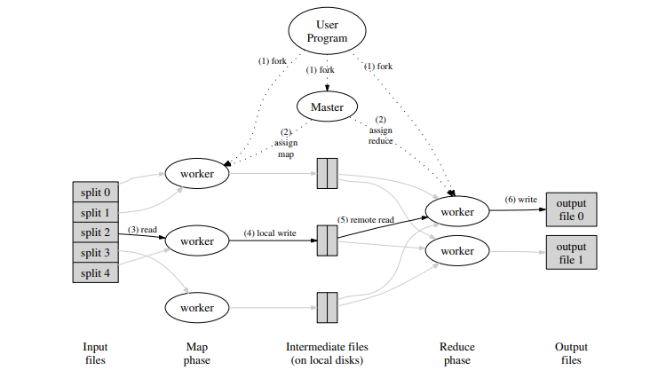

## 1. The Byzantine Generals Problem

拜占庭将军问题。

## 2. CAP

- **Consistency**，严格的一致

一致性指的是客户端的每次操作，不管访问哪个节点，要么读到的都是同一份最新写入的数据，要么读取失败。也就是说**如果对某一个节点更新成功，其他节点必定也会更新成功。**

一致性强调的是数据正确。就比如有两个节点AB，然后客户端将A中的数据从1改为2，然后接着从节点B中读取数据，发现还是1，这就是数据不一致。但是如果A更新了数据之后，通过节点间的通讯，同时将AB两个节点的值都更新为2，这时候就是满足数据一致性了。

- **Availability**

可用性说的是任何来自客户端的请求，不管是访问哪个非故障节点都能够得到响应数据（不是错误或者超时的响应），但**不保证是同一份最新数据，强调的只是服务可用。**

举例来说，客户端分别向节点AB发起请求，此时节点A中的数据是2，节点B中的数据还未被同步，仍然是1，但是在可用性条件下，不管此时节点之间的数据是否一致，只要节点服务器收到请求就会响应。因此客户端的两次请求会返回不一样的数据。

- **Partition Tolerance**

分区容错性表示当分布式系统出现网络分区的时候，仍然能够对外提供服务。或者说当节点之间出现任意数量的消息丢失或者高延迟的时候，系统仍然在继续工作。分布式系统告诉客户端，无论我内部出现了什么样的数据同步问题，我都会一直运行。**强调的是集群对分区故障的容错能力**

对于分布式系统来说，它涉及到多节点之间的通讯和交互，因此节点之间的分区故障是必然的，所以**在分布式系统中Partition Tolerance是必须要考虑的**

网络分区？指的是在分布式系统中，多个节点之前的网络本来是连通的，但是由于某些故障导致某些节点之间不连通了，整个网络就被分成了几个区域，这就叫网络分区。

对于分布式系统中CAP的选择，其实并不是简单的三选二。因为只要有网络交互，就一定会有网络延迟和数据丢失，因此这种情况是我们必须要去接受的，也就是我们节点之间的分区故障是必然发生的，**Partition Tolerance是前提，必须要保证。**因此我们只能从剩下的CA中二选一。也就是要么保证数据正确，要么保证服务可用。

- 当选择了Consistency的时候，就一定会读取到最新的数据，但是如果因为消息丢失、延迟过高发生了网络分区，这个时候集群节点为了不破坏一致性，可能会因为无法响应最新的数据而返回出错信息。
- 如果选择avaliability的时候，系统将始终处理客户端的请求，返回特定信息。如果发生了网络分区，一些节点无法返回最新的特定信息，为了不破坏avaliability，只能返回自己当前对应的旧的特定信息。舍弃了一致性，达到了高可用。

其实如果分布式系统中不存在网络分区，也就是正常运行的情况下，从逻辑上来看CA是可以共存的。

对于CP模型的KV存储来说，适合用于提供基础服务，保存少量数据，但是需要一致性。就比如zookeeper，任何时刻对zookeeper的读请求都能得到一致性的结果，但是zookeeper不保证每次请求的可用性，比如在Leader选举过程中或者半数以上的机器不可用的时候服务就是不可用的。

对于AP模型的KV存储来说，适合查询量大，不要求数据的一致性，但是重点在于性能和吞吐量。即能够容忍可能的短暂的一致性延迟，广泛应用于分布式缓存系统。

nacos的配置中心就是使用的CP保证各节点配置强一致，注册中心使用的是AP

## 3. Transaction

其实对于单机的事务来说，满足ACID还是比较简单的，像我们的MySQL数据库其实就满足了ACID，支持事务。但是在分布式系统中，涉及到各个节点之间的操作，还是比较困难。

### 3.1 2PC

分为两个阶段：**准备阶段和提交阶段**。

举个例子：假如我们要提交一个订单，需要订单服务、库存服务、用户服务等。

**准备阶段**：

事务协调者发送消息询问各个服务，看他们能否执行相关的操作，事务参与者收到消息之后，就在本地各自执行自己的事务预操作，比如redo log、undo log等，但是注意**此时并未提交事务**。当事务参与者执行完相关的事务预操作之后，发送执行成功的消息给事务协调者，表示自己能够执行该事务。

事务协调者收到所有的事务参与者的消息，发现都是成功消息，就说明该事务是可以被提交的，就进入下一阶段。

**提交阶段**:

事务协调者发送commit消息给事务参与者，表示该事务可以被提交了。事务参与者收到消息之后，就会将本地的事务进行提交，然后释放整个事务执行期间占用的所有的资源，并发送ACK消息给事务协调者。

事务协调者收到所有的ACK之后，就表示该分布式事务已经全部执行成功。

如果在准备阶段，订单服务发现执行自己的本地事务失败了，就会回复FAIL消息给事务协调者。于是事务协调者就会发送rollback消息给所有的事务参与者，告诉他们需要回滚自己在本地执行的事务操作，然后宣告本次分布式事务执行失败。

**故障分析**

在第二个阶段，如果执行的是回滚事务操作，事务协调者并没有收到库存服务回滚成功的消息，就会不断重试，直到所有参与者都回滚；如果执行的是提交事务操作，同样也是会不断重试，直到所有的事务参与者都提交成功。 

最后如果真的不行，那么就记录相应的日志，进行相应的补偿或者定时任务补偿，或者人工介入处理。

**缺点**

- 2PC是一个**同步阻塞协议**，比如准备阶段中，事务协调者会等待所有的事务参与者都回复相应的消息之后，才会进入下一阶段，如果其中有某个事务参与者出现了网络阻塞导致消息到达时间较长，事务协调者就会等待较长时间。而且就算有超时机制，超时之后可以触发重试，如果重试次数多了之后就会判定事务失败，然后向所有的参与者发送回滚消息。
- **容易造成数据不一致**：如果由于网络原因，导致部分事务参与者收不到commit/rollback消息的话，就会导致数据不一致。
- **单点问题**：如果事务协调者在第二阶段刚开始的时候突然宕机了，事务参与者就收不到commit/rollback消息，就会一直卡在准备阶段。
- **整个执行的流程时间耗时较长，就会造成资源被占用时间较长**

### 3.2 TCC（Try-Confirm-Cancel）

TCC分为三个阶段：

- **Try阶段（尝试）**：完成业务检查，预留好必需的业务资源。
- **Confirm阶段（确认）**：确认执行，当所有事务参与者的Try阶段都执行成功之后就会执行Confirm。该阶段会处理Try阶段预留的业务资源。否则会执行Cancel。
- **Cancel（取消）**：取消执行，释放Try阶段预留的业务资源。

[分布式事务之解决方案（TCC） - 云+社区 - 腾讯云 (tencent.com)](https://cloud.tencent.com/developer/article/1547147)

### 3.3 3PC

3PC分为三个阶段，相对于2PC来说，在事务协调者和事务参与者中都引入了**超时机制**（2PC中只有协调者拥有超时机制）；同时增加了一个阶段，用来保证在最后提交阶段之前各参与节点的状态是一致的，也就是说：**将2PC的准备阶段拆分成两个阶段，询问，然后再锁资源，最后真正提交**。

**CanCommit**：

事务协调者向所有的参与者发送CanCommit请求，询问他们是否可以执行事务提交请求；

事务参与者收到CanCommit请求之后，在正常情况下，如果自身认为可以顺利执行事务，则返回Yes响应，并进入预备状态，否则返回No。

**PreCommit**

事务协调者根据参与者的反应情况来决定是否可以继续事务的PreCommit操作。

- 如果协调者收到所有的参与者的反馈都是Yes，那么就会继续往下执行，也就是发送预提交请求，参与者收到PreCommit请求之后，就会进行事务操作。如果参与者成功执行了事务操作，就返回ACK响应，同时等待最终指令。
- 如果有任何一个参与者发送了No响应，或者等待超时之后，那么就进入中断事务流程：事务协调者向所有参与者发送abort请求，参与者收到之后，就执行事务的中断。

**DoCommit**

执行事务的真正提交。

如果事务协调者收到了来自所有参与者的ACK响应之后，就会进入提交状态，向所有参与则会发送doCommit请求。参与者收到之后就会执行真正的事务提交，完成事务并且释放所有事务资源。事务提交完成之后，参与者向协调者发送ACK响应。事务协调者收到所有的ACK之后，表明本次事务执行成功。

如果事务协调者没有收到来自参与者发送的ACK响应，或者收到的不是ACK响应，就会执行中断事务。

**缺点：在第三阶段中，参与者如果没有收到协调者的通知，超时之后就会执行Commit操作，这里就会出现数据不一致的情况**

**优点**：相对于2PC来说，3PC主要解决单点故障问题，并减少了阻塞时间。一旦参与者无法及时收到来自协调者的信息之后，就会默认执行Commit操作，而不是一直持有事务资源并处于阻塞状态。

## 4. BASE Theory

BASE理论的内容：**基本可用**（Basically Available）、**软状态**（Soft State，是实现服务可用性的时候系统数据的一种过渡状态，也可以说是不同节点间，数据副本存在短暂的不一致）、**最终一致性**（Eventually Consistent），它可以理解为AP的延伸，是对互联网大规模分布式系统的实践总结，强调可用性。因为AP其实是一个动态模型，目前没有现成的库或方案，它是基于业务场景特点妥协折中后设计实现的。不过可以借助BASE理论帮助你达成目的。

**什么是基本可用？如何实现基本可用？**

首先基本可用大概就是说当系统在出现不可预知的故障的时候，可以允许部分功能的可用性，保障核心功能的可用性，去适应外界的压力，防止强行要求强可用性最终导致系统崩溃。比如响应时间上的损失、系统功能上的损失。

假设系统出现了不可预知的故障，但是还是能用，相对于正常的系统而言：

1. 响应时间上的损失：正常情况下只需0.5秒便可返回结果给用户，而基本可用则可以在两秒作用返回结果。
2. 功能上的损失：在大流量下，为了保护购物模块的稳定性，牺牲部分消费者，从而降级。

实现基本可用可以有四种方案：

1. **流量削峰：**就拿12306来说，如果所有的抢票请求都集中在九点钟，服务器肯定就无法承受这么大的压力，于是我们就可以让不同地方的火车票在不同的时候售票。比如深圳发车的八点开抢，北京发车的九点开抢。
2. **延迟响应：**还是购票，我们可以发现当我们提交了请求之后，12306并不是立刻给我们响应，而是等待几分钟或者几十分钟之后系统才进行处理。当系统在出现超出系统处理能力的突发流量的情况下，会通过牺牲响应时间的可用性来保证核心功能的运行。
3. **体验降级：**比如突然系统中有大量的用户涌进来，系统过载导致大量图片因为网络超时无法显示，就可以进行体验降级，比如降低图片的清晰度和大小来提升系统的处理能力。
4. **过载保护：**将接收到的请求放在指定的队列中进行处理，如果请求等待时间超时了，就可以直接拒绝超时请求。再比如如果队列直接满了就可以清除队列中的一定数量的排队请求或者直接拒绝后续的请求来让系统不过载，实现系统的基本可用。
5. **故障隔离：**出现故障的时候要做到故障隔离，避免影响其他的服务。
6. **弹性扩容：**基于Metric和Monitor实现系统态势感知，做到弹性伸缩。

**什么是最终一致性？**

他强调的是在系统中的所有的数据副本，在经过一段时间的同步之后，最终能够达到一个一致的状态。本质是需要系统保证最终数据能够达到一致性而不是需要实时保证系统数据的强一致。

如何实现最终一致性？

1. **读时修复：**在写数据的时候不关心失败还是成功，在读取数据的时候，我们可以同时读取多个节点的同一份数据，然后按照一定的规则检测数据的不一致，比如以超过半数的数据为准，进行修复。极端情况下，如果所有节点的数据都不一样，应该听谁的呢？通过多次执行异步修复来实现一致性，待做。
2. **写时修复：**在写入数据的时候，如果其中一个写失败了就会缓存起来，然后系统自动通过重试的手段进行修复。这种写时修复不需要进行数据对比，**性能最好，推荐优先实现**。本质是“失败-缓存-重传”的重试机制，不涉及到一致性对比
3. **异步修复：**通过定时不同节点比对的方式，来对照数据是否需要修复，如果需要修复就进行同步。这种修复方式涉及到数据的对比，性能不是很好。定时对账检测副本数据的一致性。

**总结：**

BASE理论其实是对CAP中一致性和可用性权衡的结果，它来源于对大规模互联网分布式系统实践的总结，是基于CAP定理逐步演化而来的。核心思想就是如果不是必须的话，不推荐事先事务或者强一致性，鼓励可用性和性能优先，根据业务的场景特点来实现非常弹性的基本可用，以及实现数据的最终一致性。

BASE理论在很大程度上解决了事务型系统在性能、容错、可用性等方面的痛点。

## 5. Distributed ID

### 5.1 雪花算法

正常来说，Snowflake由64bit的二进制数字组成。

- 第0位：符号位，表示正负。但是默认我们都是正数，因此默认是0
- 第1~41位：这41bit用来表示时间戳，但是并不推荐直接使用当前时间的时间戳，而是使用当前时间戳 - 固定的开始时间戳。这样就可以让其开始的值较小，然后最多可支撑2^41毫秒，大约69年。
- 第42~52位：一共10bit，一般前5位用来表示机房ID，后5位表示机器ID，当然可以灵活调整
- 第53~64位：共12bit，用来表示序列号，自增，代表单台机器每毫秒能够产生的最大ID数，也就是4096个。

实际中，我们也会对Snowflake进行改造，比如将业务类型信息给加进去。

## 6. Algorithm

### 6.1 Paxos

Paxos算法是基于消息传递且具有高度容错特性的**共识性算法**。

在我们常见的分布式系统中，总会发生通信异常、节点故障、网络分区等情况。Paxos算法需要解决的问题在于**如何在一个可能发生上述异常的分布式系统中，快速且正确地在集群内部对某个数据的值（可以是一条日志，也可以是一条命令）达成共识性，并且保证不论发生以上任何异常，都不会破坏整个系统决议的共识机制**

在Paxos算法中，并不会去考虑拜占庭将军问题，即虽然有可能一个消息被传递了两次，但是绝对不会出现错误的消息。只要等待足够的时间，消息就会被传到。

但是需要考虑的是各种角色的计算速度可能不同，甚至可能因为宕机而终止运行，随后又被重启。在没有记录之前已选择的value的情况下，之前选择的value会丢失，因此需要记录之前已选择的value。

消息可以延时，可以重复，可以丢失，但是其内容无法被篡改。

Basic Paxos

对于Basic Paxos来说，它描述的是多节点之间如何就某个值（提案 value）达成共识。

在Basic Paxos中，一共有三种角色，每个节点都可以允许身兼数职。

- proposers提出提案，提案信息包括提案编号和提议的vlaue
- acceptor收到提案之后可以接受（accept）提案，如果提案获得多数派的acceptors的接受，则该提案被批准（chosen）
- learners只能学习被批准的提案，相当于一个存储备份

划分角色之后就可以拥有更加精确的定义：

1. 决议（value）只能在被proposers提出之后才能被批准（未经批准的决议称为“提案proposal”）；、
2. 在一次Paxos算法的执行实例中，只能chosen一个value；
3. learners只能获得被chosen的value。

如果只有一个acceptor，有很多个proposer


对于这种情况，要想保证共识其实很简答，我们只需要让整个acceptor只接受第一个proposer提出的value就可以了，后续的一概不接受。这种方案简单易懂，但是如果当前acceptor挂掉之后且无法恢复了，被选择的value也跟着丢失了，显然是符合要求的。

接下来只需考虑多个Proposer和多个Acceptor的情况。

> **P1：接受者必须接受它收到的第一个提案。**

怎么去理解P1呢？加入不考虑系统故障或者消息丢失的情况，如果我们只有一个proposer和一个acceptor，并且当proposer发送提案给acceptor的时候，如果acceptor不接受这个提案，那么就永远无法选出多数派，因此acceptor就必须接受它收到的第一个提案，至于是否要更换，这得看后续的推导过程。

但是P1同样也引入了新的问题，因为多个proposer可能会提出不同的提案，然后多个acceptor都接受了不同的提案，这就导致没有任何一个值被接受者中的大多数所接受。因此结合P1来说，那么得到隐藏的条件：**必须允许接受者接受不止一个提案**。我们可以让每个提案由一个唯一的递增的提案编号和提案所对应的值组成。当一个带有某个值的提案被大多数的acceptor接受了之后，这个值就算被选定了。

> **P2：如果

**上面是算法的推导过程，下面是算法的总结：**

通过一个决议分为两个阶段：

1. prepare阶段：
   1. proposer选择一个提案编号n并将prepare请求发送给acceptors中的一个多数派
   2. acceptor收到prepare消息之后，如果提案的编号大于它已经回复的所有prepare消息（回复消息表示accept），则acceptor将自己上次接受的提案回复给proposer，并承诺不再回复小于n的提案。
2. 批准阶段：
   1. 当一个proposer收到了多数acceptors对prepare的回复之后，就进入批准阶段。它要向prepare的请求的acceptors发送acceptor请求，包括编号n和

[Paxos算法 - 维基百科，自由的百科全书 (wikipedia.org)](https://zh.wikipedia.org/wiki/Paxos算法)

[一致性算法Paxos解决了什么问题 - 大数据 - 亿速云 (yisu.com)](https://www.yisu.com/zixun/500499.html)

[Paxos原理（一）：Basic Paxos - 掘金 (juejin.cn)](https://juejin.cn/post/6844903450585595912#heading-3)

### 6.2 MapReduce

**概述：**MapReduce是一个编程模型，用于处理和生成超大数据集的算法模型的相关实现。用户创建一个Map函数处理一个具有key/value对的数据集合，并输出中间值，创建一个Reduce函数将具有相同中间key值的中间value值。

使用MapReduce就只需要关注如何分割大数据进行处理；如果管理大量计算机集群之间的调度和错误处理，以及消息通信。



**执行步骤：**

1. 用户程序首先调用的MapReduce库将输入文件分成M个数据片度，每个数据片段的大小一般从 16MB到64MB(可以通过可选的参数来控制每个数据片段的大小)。然后用户程序在机群中创建大量的程序副本。（ It then starts up many copies of the program on a cluster of machines）
2. 这些程序副本中的有一个特殊的程序–master。副本中其它的程序都是worker程序，由master分配任务。有M个Map任务和R个Reduce任务将被分配，master将一个Map任务或Reduce任务分配给一个空闲的worker。
3. 被分配了map任务的worker程序读取相关的输入数据片段，从输入的数据片段中解析出key/value pair，然后把key/value pair传递给用户自定义的Map函数，由Map函数生成并输出的中间key/value pair，并缓存在内存中。
4. 缓存中的key/value pair通过分区函数分成R个区域，之后周期性的写入到本地磁盘上。缓存的key/value pair在本地磁盘上的存储位置将被回传给master，由master负责把这些存储位置再传送给Reduce worker。
5. 当Reduce worker程序接收到master程序发来的数据存储位置信息后，使用RPC从Map worker所在主机的磁盘上读取这些缓存数据。当Reduce worker读取了所有的中间数据后，通过对key进行排序后使得具有相同key值的数据聚合在一起。由于许多不同的key值会映射到相同的Reduce任务上，因此必须进行排序。如果中间数据太大无法在内存中完成排序，那么就要在外部进行排序。
6. Reduce worker程序遍历排序后的中间数据，对于每一个唯一的中间key值，Reduce worker程序将这个key值和它相关的中间value值的集合传递给用户自定义的Reduce函数。Reduce函数的输出被追加到所属分区的输出文件。
7. 当所有的Map和Reduce任务都完成之后，master唤醒用户程序。在这个时候，在用户程序里的对MapReduce调用才返回。

**容错**

- master会周期性的ping每个worker，如果约定的时间内没有收到worker返回的信息，就会认为这个worker失效。所有由这个worker执行完成的Map任务，或者正在执行的Map/Reduce任务都会被重新设置为空闲，然后会将这些空闲任务交给其余的worker执行。

  因为对于Map任务来说，它的中间结果存储在该Map所在的机器上面，而对于Reduce任务，它的输出结果存储在全局文件系统上，因此它的宕机并不影响已经完成了的Reduce任务。

- 如果master宕机了，为了避免全部重算，就可以使用checkpoint机制，也就是master周期性的将它的数据结构（里面存储了每一个Map和Reduce任务的状态和其他信息）写入磁盘。 就算master宕机了，就可以启动另一个master进程，然后从checkpoint开始重新执行MapReduce操作。

**备用任务**

如果一台机器花费了很长时间才完成最后几个Map或Reduce任务，就会拖累整个MapReduce的操作效率。于是引入备用任务机制，当一个MapReduce操作接近完成的时候，master就会调度备用任务进程来执行剩下的处于处理中状态的任务。只要任何一个进程完成了任务，就会将这个任务标记为已完成。

参考资料：

- [MapReduce论文中文翻译-阿里云开发者社区 (aliyun.com)](https://developer.aliyun.com/article/31829)
- [rfeet.qrk (mit.edu)](https://pdos.csail.mit.edu/6.824/papers/mapreduce.pdf)
- 

### 6.3 Raft

#### 概述

paper地址：[Raft-Extend](http://nil.csail.mit.edu/6.824/2020/papers/raft-extended.pdf)

Raft是用来管理复制日志（replicated log）的共识算法。他将共识算法的关键性因素切分成三个部分：

- leader election 领导者选举，当现存的leader发生故障时，一个新的领导人需要被选举出来。
- log replication 日志复制，领导人必须从客户端接受log entries然后复制到集群中的其他的节点，并强制要求其他节点的日志和自己保持一致。
- safety 安全性，如果在任何的服务器节点已经应用了一个确定的log entires到它的状态机中，那么其他服务器节点不能在同一个索引位置应用一个不同的指令。

同时，Raft还拥有几个新特性：

- **强领导人**：相对于其他的算法，Raft使用了更强的领导形式。log entries只能从领导人发送给其他的服务器。
- **领导选举**：使用一个随机计时器来选举领导人。这种机制相对于其他共识算法的心跳机制来说，在解决冲突的时候会更加简单快捷。
- **成员关系调整**：Raft使用一种共同一致的方法来处理集群成员变换的问题，在这种方法下，处于调整过程中的两种不同的配置集群中大多数机器会有重叠，这就使集群在成员变换的时候依然可以继续工作。


上图的翻译如下所示：

**State**

所有服务器上的持久性状态（在响应RPC请求之前，已经更新到了稳定的存储设备）

| 参数        | 解释                                                         |
| ----------- | ------------------------------------------------------------ |
| currentTerm | 服务器已知最新的任期（在服务器首次启动时初始化为0，单调递增） |
| votedFor    | 当前任期内收到选票的candidateId，如果没有投给任何候选人则为空 |
| log[]       | log entries，每个条目包含了用于状态机的命令，以及领导人接收到该条目时的任期（初始索引为1） |

所有服务器上的易失性状态

| 参数        | 解释                                                         |
| ----------- | ------------------------------------------------------------ |
| commitIndex | 已知已提交的最高的日志条目的索引（初始值为0，单调递增）      |
| lastApplied | 已经被应用到状态机的最高的日志条目的索引（初始值为0，单调递增） |

领导人（服务器）上的易失性状态（选举后已经重新初始化）

| 参数         | 解释                                                         |
| ------------ | ------------------------------------------------------------ |
| nextIndex[ ] | 对于每一台服务器，发送到该服务器的下一个日志条目的索引（初始值为领导人最后的日志条目的索引+1） |
| matchIndex[] | 对于每一台服务器，已知的已经复制到该服务器的最高日志条目的索引（初始值为0，单调递增） |

#### Raft基础

集群刚开始的时候，所有的节点都是Follower，然后就会立马开始选举。如果一个候选者赢得选举（大多数），他就会在接下来的任期中成为Leader。如果这一任任期中没有Leader出现，就会立马下一轮选举。

如果一个服务器发现自己的当前任期号比其他人小，就会更新自己的编号到较大的那一方的任期编号。如果一个候选者或者Leader发现自己的任期号过期了，那么就会立马变成跟随者。如果一个节点接收到了一个包含过期的任期号的请求，就会直接拒绝该请求。

服务器节点之间通过RPC通信：

- RequestVoteRPC在候选人选举期间发起
- AppendEntriesRPC由领导人发起，用来复制日志和提供一种心跳机制。

#### 领导人选举

领导人周期性的向所有跟随者发送心跳包，也就是不包含日志项内容的AppendEntriesRPC，来告诉其余的跟随者，自己是领导人，维护自己的权威。如果**选举超时**（一个跟随者在一段时间内没有接收到任何消息），那么该跟随者就会认为系统中没有可用的领导人，然后发起选举以选出新的领导人。

要开始一次选举过程，跟随者需要增加自己的任期然后将自己变成候选人，它向集群中的其他节点发送RequestVoteRPC。

- 如果它获得了大部分票数，则自己成为领导者，然后向其他服务器发送心跳消息来阻止发起新的选举。
- 如果在投票期间候选人从其他服务器接收到声明它是领导人的AppendEntriesRPC。如果这个领导人的任期号（包含在此次的RPC中）不小于候选人当前的任期号，那么候选人就会承认该领导人合法并让自己变成跟随者。如果此时RPC中的任期号比自己小，就会拒绝这次RPC并继续保持自己的候选者状态
- 如果多个候选者既没有赢也没有输，就会导致每一个候选者都会超时，然后通过增加当前任期号来开始下一轮选举。Raft通过随机选举超时时间的方式来确保很少会发生选票瓜分的情况，就算发生也能很快解决。**选举超时时间是从一个固定的区间随机选择（150-300ms）**。这样就可以把服务器都分散开以至于在大多数情况下只有一个服务器会选举超时。然后它赢得选举并在其他服务器超时之前发送心跳包。同样这种随机机制还会被用在选票瓜分的情况下。每一个候选人在开始一次选举的时候会重置一个随机的选举超时时间，然后在超时时间内等待投票的结果；这样减少了在新的选举中另外的选票瓜分的可能性

**在 Raft 算法中，随机超时时间是有 2 种含义的**：

1. 跟随者等待领导者心跳信息超时的时间间隔，是随机的；
2. 如果候选人在一个随机时间间隔内，没有赢得过半票数，那么选举无效了，然后候选人发起新一轮的选举，也就是说，等待选举超时的时间间隔，是随机的。

#### 日志复制

领导者被选出来之后，就开始为客户端提供服务。客户端每一个请求都包含一条被复制状态机执行的指令。领导人会将该指令作为新的log entry附加到日志中，然后并行发起AppendEntriesRPC给其他服务器，让他们复制这条日志条目。如果该条目被安全复制，领导人会应用这条日志条目到它的状态机中然后将执行的结果返回给客户端。如果跟随者崩溃或者运行缓慢，又或者网络丢包，领导人会不断重复尝试AppendEntriesRPC直到所有跟随者最终存储了所有日志条目。


当领导人将创建的日志条目复制到大多数服务器上的时候，日志条目就会被提交。同时领导人的日志中之前的所有日志条目也都会被提交，包括由其他领导人创建的条目。

领导人会强制跟随者直接复制自己的日志来处理不一致的问题。**领导人必须找到最后两者达成一致的地方，然后删除跟随者从那个点之后的所有日志条目，并发送自己在那个点之后的日志给跟随者。**这些操作在进行AppendEntiresRPC的一致性检查的时候完成。

领导人针对每一个跟随者维护了一个nextIndex，表示下一个需要发送给跟随者的日志条目的索引地址。初始值为Leader的最后一条日志的index + 1。如果Follower的日志和Leader不一样，在下一次RPC的一致性检查的时候就会失败。被Follower拒绝之后Leader会减小nextIndex并进行重试。最终nextIndex会在某个位置检查成功。成功之后RPC就会成功，这时候就会将跟随者冲突的日志条目全部删除并加上Leader的日志。

- 如果有Follower因为某些原因没有给Leader响应，那么Leader会不断重复发送AppendEntriesRPC，哪怕Leader已经回复了客户端
- 如果有Follower崩溃后恢复，这时候Raft追加条目的一致性检查生效，保证Follower能按顺序恢复崩溃后的缺失的日志。
- Raft的一致性检查：Leader在每一个发往Follower的追加条目RPC中，会放入**前一个日志条目的索引位置和任期号**，如果Follower在它的日志中找不到前一个日志，那么它就会拒绝此日志，Leader收到Follower的拒绝之后会发送前一个日志条目，从而逐渐向前定位到Follower前一个缺失的日志。

#### 安全性

**选举限制**：如果候选人的日志至少和大多数服务器节点一样新，那么它一定持有了所有已经提交的日志条目。RequestVoteRPC有如下限制：RPC中包含了候选人的日志信息，然后投票人会拒绝掉那些日志没有自己新的投票请求。Raft通过比较两份日志中最后一条日志条目的索引值和任期号定义谁的日志比较新。如果两份日志最后的条目的任期不同，那么任期号大的日志更加新。如果两份日志最后的条目任期号相同，那么日志比较长的那个就更加新。

**提交之前任期内的日志条目**

当Leader复制之前任期里的日志时，Raft会为所有日志保留原始的任期号。

## 7. LoadBalance

### 7.1 升级版随机算法

对于普通的随机算法，实现其实是非常简单的，但是在实际情况中，其实每台服务器的性能都不太一样，因此每台服务器所能承受的压力就会不一样。**而加权随机算法就是为了解决这个问题**

比如我们有A、B、C三台服务器，然后它们的权重分别是5、3、2。

**加权随机算法一：**可以新建一个List，然后将每台服务器权重数量的值加到这个List里面，比如上述例子中List里面有5个A，3个B，2个C，然后根据List的长度做一个随机，看看最终落到哪个服务器上，因为权重越高的，随机概率也就越大。

但是实际上一个服务器的权重肯定不会是这么小的数，而且万一服务器很多，维护一个这么长的List对性能影响其实是比较大的。

**加权随机算法二：**这个就比较巧妙了，我们只需要维护一个这几台服务器所有权重的大小和，比如上述例子中就是5+2+3=10。然后对10进行一个随机，取出的值一个个去比较。比如随机值是7，发现7比5要大，所以肯定不是落在服务器A上，然后下一步就将7-5=2，发现2小于3，就可以判断这次的请求是落在服务器B上的。

```java
public static getServer() {
    int totalWeight = (int)WEIGHT_LIST.values().stream().mapToInt(s -> s).summaryStatistics().getSum();
    int pos = new Random().nextInt(totalWeight);
    for (String ip : WEIGHT_LIST.keySet()) {
        Integer weight = WEIGHT_LIST.get(ip);
        if (pos < weight) {
            return ip;
        }
        pos -= weight;
    }
    return "";
}
public static final Map<String, Integer> WEIGHT_LIST = new LinkedHashMap<>();
static {
    WEIGHT_LIST.put("A", 5);
    WEIGHT_LIST.put("B", 3);
    WEIGHT_LIST.put("C", 2);
}
```

### 7.2 优秀的平滑加权轮询算法

对于没有加权要求的轮询算法，实现简单，就是维护一个指针，然后每遍历一次就让这个指针加一，注意这里肯定要有个同步机制。

但是针对于加权轮询算法，依照上述的负载均衡算法，可以维护一个大List，也可以改造一下加权随机算法二，让pos的值从随机变成每次加一。

注意真实环境中，肯定不会去维护这么一个指针，而是利用请求的一个RequestId，进行取余后选择。

但是对于这种加权轮询方式，其实是有问题的，比如ABC权重分别是511，那么加权轮询的结果是AAAAABC，可以看到一开始会有大量的请求都打在服务器A上，明显是有问题的，如果结果变成AABACAA之类的，就会优化很多。

因此就有了**平滑加权轮询算法**

一开始的时候A、B、C的currentWeight都是0，然后第一轮，让它们的currentWeight加上原来的权重，也就是currentWeight分别为5、1、1，从中选出最大的那个，也就是A，接着让5减去总和7变成-2，此时currentWeight分别为-2、1、1。然后第二轮接着循环，先加上原来的权重，变成3、2、2，再选出最大值中的那个服务器，以此类推。最终发现7次以后currentWeight又重新变成了000，开启下一个循环。

```java
private static Map<String, Weight> weightMap = new HashMap<>();
public static String getServer () {

    int totalWeight = ServerIps.WEIGHT_LIST.values().stream().reduce(0, Integer::sum);
    // 初始化weightMap
    if (weightMap.isEmpty()) {
        ServerIps.WEIGHT_LIST.forEach((ip, weight) -> {
            weightMap.put(ip, new Weight(ip, weight, weight));
        });
    }
    // 找到currentWeight中的最大值
    Weight maxCurrentWeight = null;
    for (Weight weight : weightMap.values()) {
        if (maxCurrentWeight == null || weight.getCurrentWeight() > maxCurrentWeight.getCurrentWeight()) {
            maxCurrentWeight = weight;
        }
    }
    // 最大值减去总权重
    maxCurrentWeight.setCurrentWeight(maxCurrentWeight.getCurrentWeight() - totalWeight);
    // 所有的IP的currentWeight都加上原始权重
    for (Weight weight : weightMap.values()) {
        weight.setCurrentWeight(weight.getCurrentWeight() + weight.getWeight());
    }
    // 返回之前的最大值所对应的IP
    return maxCurrentWeight.getIp();
}

public static void main(String[] args) {
    for (int i = 0; i < 7; i++) {
        System.out.println(getServer());
    }
    // 输出结果为AABACAA
}
```

### 7.3 基于哈希环的一致性哈希算法

其实就是将每台服务器都映射到一个哈希环上的一个位置上，然后同时在环上还建立很多的虚拟节点，让服务器的分布尽量散列化。虚拟节点越多流量越均衡，哈希算法越散列流量也将越均衡。

```java
public class ConsistentHash {
    private static SortedMap<Integer, String> virtualNodes = new TreeMap<>();
    private static final int VIRTUAL_NODES = 160;
    static {
        // 对每个真实的节点都添加虚拟节点，虚拟节点会根据哈希算法进行散列。
        for (String ip : ServerIps.LIST) {
            for (int i = 0; i < VIRTUAL_NODES; i++) {
                int hash = getHash(ip + "VN" + i);
                virtualNodes.put(hash, ip);
            }
        }
    }

    private static String getServer(String client) {
        // 获得客户端请求来的IP地址的哈希值
        int hash = getHash(client);
        // 得到大于该Hash值的排好序的Map
        SortedMap<Integer, String> sortedMap = virtualNodes.tailMap(hash);
        // 如果Map为null，就相当于环一样，找到第一个，否则找到sortedMap中的第一个
        Integer nodeIndex = sortedMap.firstKey();
        if (nodeIndex == null) {
            nodeIndex = virtualNodes.firstKey();
        }
        return sortedMap.get(nodeIndex);
    }

    private static int getHash(String str) {
        // 自定义哈希算法
        return 0;
    }
}
```

### 7.4 最小活跃数算法

上述算法都是以客户端的眼光来看的，而最小活跃数是按照服务端的眼光来看，如果当前服务器的积压请求比较多，就少给它点请求；如果当前服务器积压请求比较少，就多给它点请求。

一开始所有服务器的活跃数都是0，然后每收到一个请求活跃数就加1，完成请求之后活跃数就减1。注意这里就不对服务器请求处理相关逻辑进行模拟。

```java
// 服务器当前的活跃数
public static final Map<String, Integer> ACTIVITY_LIST = new LinkedHashMap<String, Integer>();
static {
    ACTIVITY_LIST.put("192.168.0.1", 2);
    ACTIVITY_LIST.put("192.168.0.2", 0);
    ACTIVITY_LIST.put("192.168.0.3", 1);
    ACTIVITY_LIST.put("192.168.0.4", 3);
    ACTIVITY_LIST.put("192.168.0.5", 0);
    ACTIVITY_LIST.put("192.168.0.6", 1);
    ACTIVITY_LIST.put("192.168.0.7", 4);
    ACTIVITY_LIST.put("192.168.0.8", 2);
    ACTIVITY_LIST.put("192.168.0.9", 7);
    ACTIVITY_LIST.put("192.168.0.10", 3);
}
```

```java
public class LeastActive {
    private static String getServer() {
        // 找出当前活跃数最小的服务器
        Optional<Integer> minValue = ServerIps.ACTIVITY_LIST.values().stream().min(Comparator.naturalOrder());
        if (minValue.isPresent()) {
            List<String> minActivityIps = new ArrayList<>();
            ServerIps.ACTIVITY_LIST.forEach((ip, activity) -> {
                if (activity.equals(minValue.get())) {
                    minActivityIps.add(ip);
                }
            });
            // 最小活跃数的ip有多个，则根据权重来选，权重大的优先
            if (minActivityIps.size() > 1) {
                // 过滤出对应的ip和权重
                Map<String, Integer> weightList = new LinkedHashMap<String, Integer>();
                ServerIps.WEIGHT_LIST.forEach((ip, weight) -> {
                    if (minActivityIps.contains(ip)) {
                        weightList.put(ip, ServerIps.WEIGHT_LIST.get(ip));
                    }
                });
                int totalWeight = 0;
                boolean sameWeight = true; // 如果所有权重都相等，那么随机一个ip就好了
                Object[] weights = weightList.values().toArray();
                for (int i = 0; i < weights.length; i++) {
                    Integer weight = (Integer) weights[i];
                    totalWeight += weight;
                    if (sameWeight && i > 0 && !weight.equals(weights[i - 1])) {
                        sameWeight = false;
                    }
                }
                java.util.Random random = new java.util.Random();
                int randomPos = random.nextInt(totalWeight);
                if (!sameWeight) {
                    for (String ip : weightList.keySet()) {
                        Integer value = weightList.get(ip);
                        if (randomPos < value) {
                            return ip;
                        }
                        randomPos = randomPos - value;
                    }
                }
                return (String) weightList.keySet().toArray()[new java.util.Random().nextInt(weightList.size())];
            } else {
                return minActivityIps.get(0);
            }
        } else {
            // 如果不存在最小的值，就从活跃的List中随机选择一个
            return (String) ServerIps.ACTIVITY_LIST.keySet().toArray()[new java.util.Random().nextInt(ServerIps.ACTIVITY_LIST.size())];
        }
    }
}
```
