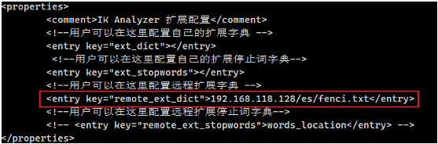

# 第一章 各种服务的docker安装

## 1.1 MySQL

docker run -d --restart=always --name mysql -v /mydata/mysql/data:/var/lib/mysql -v /mydata/mysql/conf:/etc/mysql -v /mydata/mysql/mysql-files:/var/lib/mysql-files/ -v /mydata/mysql/log:/var/log/mysql -p 3306:3306 -e TZ=Asia/Shanghai -e MYSQL_ROOT_PASSWORD=123456 mysql:5.7 --character-set-server=utf8mb4 --collation-server=utf8mb4_general_ci

## 1.2 nginx

1、先随便安装一个nginx

docker run -p 80:80 --name nginx -d nginx:1.10

2、将nginx中的文件复制下来

mkdir nginx

docker container cp nginx:/etc/nginx .（。的后面有空格）

这个要在mydata文件夹里面执行

3、在mydata下执行：

mv nginx conf

mkdir nginx

mv conf nginx

4、将之前的nginx删除

docker run -p 80:80 --name nginx \

\> -v /mydata/nginx/html:/usr/share/nginx/html \

\> -v /mydata/nginx/logs:/var/log/nginx \

\> -v /mydata/nginx/conf:/etc/nginx \

\> -d nginx:1.10

##  1.3 Redis

1、mkdir -p /mydata/redis/conf

2、touch /mydata/redis/conf/redis.conf

3、docker run -p 6379:6379 --name redis -v /mydata/redis/data:/data -v /mydata/redis/conf/redis.conf:/etc/redis/redis.conf -d redis redis-server /etc/redis/redis.conf

## 1.4 Rabbitmq

docker run -d --name rabbitmq -p 5671:5671 -p 5672:5672 -p 4369:4369 -p 25672:25672 -p 15671:15671 -p 15672:15672 rabbitmq:management

## 1.5 elastic

1、docker pull elasticsearch:7.4.2

2、docker pull kibana:7.4.2（可视化操作）

3、

 mkdir -p /mydata/elasticsearch/config

mkdir -p /mydata/elasticsearch/data

echo "http.host: 0.0.0.0">>/mydata/elasticsearch/config/elasticsearch.yml

chmod -R 777 /mydata/elasticsearch/

docker run --name elasticsearch -p 9200:9200 -p 9300:9300 \

-e "discovery.type=single-node" -e ES_JAVA_OPTS="-Xms64m -Xmx512m" \

-v /mydata/elasticsearch/config/elasticsearch.yml:/usr/share/elasticsearch/config/elasticsearch.yml \

-v /mydata/elasticsearch/data:/usr/share/elasticsearch/data \

-v /mydata/elasticsearch/plugins:/usr/share/elasticsearch/plugins \

-d elasticsearch:7.4.2

4、

mkdir -p /mydata/kibana/config/
 vi /mydata/kibana/config/kibana.yml

\#

\# ** THIS IS AN AUTO-GENERATED FILE **

\#

\# Default Kibana configuration for docker target

server.name: kibana

server.host: "0"

elasticsearch.hosts: [ "http://192.168.31.190:9200" ]

xpack.monitoring.ui.container.elasticsearch.enabled: true

 

docker run -d \

 --name=kibana \

 --restart=always \

 -p 5601:5601 \

 -v /mydata/kibana/config/kibana.yml:/usr/share/kibana/config/kibana.yml \

 kibana:7.4.2

5、安装ik分词器

github.com/medcl/elasticsearch-analysis-ik下载对应的ik分词器

将其解压到挂载的/mydata/elastiscearch/plugins/ik/目录下，


但是上述的分词器功能不够，还需要我们**自定义扩展词库**，因此以下步骤：

1、进入ik下的conf目录下

2、vi IKAnalyzer.cfg.xml 将远程连接打开



3、这里用的是nginx进行转发，将fenci.txt写在nginx的html文件夹下的es目录下

## 1.6 Zipkin

docker run -d -p 9411:9411 openzipkin/zipkin

## 1.7 rocketmq

1. 拉取镜像

   ```
   docker pull foxiswho/rocketmq:server-4.3.2 
   docker pull foxiswho/rocketmq:broker-4.3.2
   ```

2. 创建数据挂载目录

   ```
   mkdir -p /mydata/rocketmq/rmqserver/logs
   mkdir -p /mydata/rocketmq/rmqserver/store
   mkdir -p /mydata/rocketmq/rmqbroker/logs
   mkdir -p /mydata/rocketmq/rmqbroker/store
   mkdir -p /mydata/rocketmq/rmqbroker/conf
   ```

3. 编辑配置文件

   ```
   vi /mydata/rocketmq/rmqbroker/conf/broker.conf
   ```

   ```
   namesrvAddr=192.168.118.128:9876
   brokerClusterName = DefaultCluster
   brokerName = broker-a
   brokerId = 0
   deleteWhen = 04
   fileReservedTime = 48
   brokerRole = ASYNC_MASTER
   flushDiskType = ASYNC_FLUSH
   brokerIP1 = 192.168.118.128
   listenPort=10911
   ```

4. 创建容器，启动容器

   ```
   #创建nameserver容器 
   docker create -p 9876:9876 --name rmqserver -e "JAVA_OPT_EXT=-server -Xms128m -Xmx128m -Xmn128m" -e "JAVA_OPTS=-Duser.home=/opt" -v /mydata/rocketmq/rmqserver/logs:/opt/logs -v /mydata/rocketmq/rmqserver/store:/opt/store foxiswho/rocketmq:server-4.3.2
   
   docker run -it -d --net host --name rmqbroker01 -e "JAVA_OPT_EXT=-server -Xms128m -Xmx128m -Xmn128m" -e "JAVA_OPTS=-Duser.home=/opt" -v /mydata/rocketmq/rmqbroker/conf/broker.conf:/etc/rocketmq/broker.conf -v /mydata/rocketmq/rmqbroker/logs:/opt/logs -v /mydata/rocketmq/rmqbroker/store:/opt/store --privileged=true foxiswho/rocketmq:broker-4.3.2
   
   #启动容器 
   docker start rmqserver rmqbroker
   ```

5. 部署rocketmq的管理工具

   ```
   #拉取镜像 
   docker pull styletang/rocketmq-console-ng:1.0.0
    
   #创建并启动容器 
   docker run -e "JAVA_OPTS=-Drocketmq.namesrv.addr=192.168.118.128:9876;192.168.118.128:9877 -Dcom.rocketmq.sendMessageWithVIPChannel=false" -p 8082:8080 -t styletang/rocketmq-console-ng:1.0.0
   ```

   

## 1.8 Nacos

1、拉取镜像

```
docker pull nacos/nacos-server
```

2、挂载目录

```
mkdir -p /mydata/nacos/logs/                      #新建logs目录
mkdir -p /mydata/nacos/init.d/          
vim /mydata/nacos/init.d/custom.properties        #修改配置文件
```

3、mysql新建nacos的数据库，并执行脚本

可以在github中下载：

[nacos/nacos-db.sql at master · alibaba/nacos · GitHub](https://github.com/alibaba/nacos/blob/master/config/src/main/resources/META-INF/nacos-db.sql)

```mysql
/*
 * Copyright 1999-2018 Alibaba Group Holding Ltd.
 *
 * Licensed under the Apache License, Version 2.0 (the "License");
 * you may not use this file except in compliance with the License.
 * You may obtain a copy of the License at
 *
 *      http://www.apache.org/licenses/LICENSE-2.0
 *
 * Unless required by applicable law or agreed to in writing, software
 * distributed under the License is distributed on an "AS IS" BASIS,
 * WITHOUT WARRANTIES OR CONDITIONS OF ANY KIND, either express or implied.
 * See the License for the specific language governing permissions and
 * limitations under the License.
 */

/******************************************/
/*   数据库全名 = nacos_config   */
/*   表名称 = config_info   */
/******************************************/
CREATE TABLE `config_info` (
  `id` bigint(20) NOT NULL AUTO_INCREMENT COMMENT 'id',
  `data_id` varchar(255) NOT NULL COMMENT 'data_id',
  `group_id` varchar(255) DEFAULT NULL,
  `content` longtext NOT NULL COMMENT 'content',
  `md5` varchar(32) DEFAULT NULL COMMENT 'md5',
  `gmt_create` datetime NOT NULL DEFAULT '2010-05-05 00:00:00' COMMENT '创建时间',
  `gmt_modified` datetime NOT NULL DEFAULT '2010-05-05 00:00:00' COMMENT '修改时间',
  `src_user` text COMMENT 'source user',
  `src_ip` varchar(20) DEFAULT NULL COMMENT 'source ip',
  `app_name` varchar(128) DEFAULT NULL,
  `tenant_id` varchar(128) DEFAULT '' COMMENT '租户字段',
  `c_desc` varchar(256) DEFAULT NULL,
  `c_use` varchar(64) DEFAULT NULL,
  `effect` varchar(64) DEFAULT NULL,
  `type` varchar(64) DEFAULT NULL,
  `c_schema` text,
  PRIMARY KEY (`id`),
  UNIQUE KEY `uk_configinfo_datagrouptenant` (`data_id`,`group_id`,`tenant_id`)
) ENGINE=InnoDB DEFAULT CHARSET=utf8 COLLATE=utf8_bin COMMENT='config_info';

/******************************************/
/*   数据库全名 = nacos_config   */
/*   表名称 = config_info_aggr   */
/******************************************/
CREATE TABLE `config_info_aggr` (
  `id` bigint(20) NOT NULL AUTO_INCREMENT COMMENT 'id',
  `data_id` varchar(255) NOT NULL COMMENT 'data_id',
  `group_id` varchar(255) NOT NULL COMMENT 'group_id',
  `datum_id` varchar(255) NOT NULL COMMENT 'datum_id',
  `content` longtext NOT NULL COMMENT '内容',
  `gmt_modified` datetime NOT NULL COMMENT '修改时间',
  `app_name` varchar(128) DEFAULT NULL,
  `tenant_id` varchar(128) DEFAULT '' COMMENT '租户字段',
  PRIMARY KEY (`id`),
  UNIQUE KEY `uk_configinfoaggr_datagrouptenantdatum` (`data_id`,`group_id`,`tenant_id`,`datum_id`)
) ENGINE=InnoDB DEFAULT CHARSET=utf8 COLLATE=utf8_bin COMMENT='增加租户字段';


/******************************************/
/*   数据库全名 = nacos_config   */
/*   表名称 = config_info_beta   */
/******************************************/
CREATE TABLE `config_info_beta` (
  `id` bigint(20) NOT NULL AUTO_INCREMENT COMMENT 'id',
  `data_id` varchar(255) NOT NULL COMMENT 'data_id',
  `group_id` varchar(128) NOT NULL COMMENT 'group_id',
  `app_name` varchar(128) DEFAULT NULL COMMENT 'app_name',
  `content` longtext NOT NULL COMMENT 'content',
  `beta_ips` varchar(1024) DEFAULT NULL COMMENT 'betaIps',
  `md5` varchar(32) DEFAULT NULL COMMENT 'md5',
  `gmt_create` datetime NOT NULL DEFAULT '2010-05-05 00:00:00' COMMENT '创建时间',
  `gmt_modified` datetime NOT NULL DEFAULT '2010-05-05 00:00:00' COMMENT '修改时间',
  `src_user` text COMMENT 'source user',
  `src_ip` varchar(20) DEFAULT NULL COMMENT 'source ip',
  `tenant_id` varchar(128) DEFAULT '' COMMENT '租户字段',
  PRIMARY KEY (`id`),
  UNIQUE KEY `uk_configinfobeta_datagrouptenant` (`data_id`,`group_id`,`tenant_id`)
) ENGINE=InnoDB DEFAULT CHARSET=utf8 COLLATE=utf8_bin COMMENT='config_info_beta';

/******************************************/
/*   数据库全名 = nacos_config   */
/*   表名称 = config_info_tag   */
/******************************************/
CREATE TABLE `config_info_tag` (
  `id` bigint(20) NOT NULL AUTO_INCREMENT COMMENT 'id',
  `data_id` varchar(255) NOT NULL COMMENT 'data_id',
  `group_id` varchar(128) NOT NULL COMMENT 'group_id',
  `tenant_id` varchar(128) DEFAULT '' COMMENT 'tenant_id',
  `tag_id` varchar(128) NOT NULL COMMENT 'tag_id',
  `app_name` varchar(128) DEFAULT NULL COMMENT 'app_name',
  `content` longtext NOT NULL COMMENT 'content',
  `md5` varchar(32) DEFAULT NULL COMMENT 'md5',
  `gmt_create` datetime NOT NULL DEFAULT '2010-05-05 00:00:00' COMMENT '创建时间',
  `gmt_modified` datetime NOT NULL DEFAULT '2010-05-05 00:00:00' COMMENT '修改时间',
  `src_user` text COMMENT 'source user',
  `src_ip` varchar(20) DEFAULT NULL COMMENT 'source ip',
  PRIMARY KEY (`id`),
  UNIQUE KEY `uk_configinfotag_datagrouptenanttag` (`data_id`,`group_id`,`tenant_id`,`tag_id`)
) ENGINE=InnoDB DEFAULT CHARSET=utf8 COLLATE=utf8_bin COMMENT='config_info_tag';

/******************************************/
/*   数据库全名 = nacos_config   */
/*   表名称 = config_tags_relation   */
/******************************************/
CREATE TABLE `config_tags_relation` (
  `id` bigint(20) NOT NULL COMMENT 'id',
  `tag_name` varchar(128) NOT NULL COMMENT 'tag_name',
  `tag_type` varchar(64) DEFAULT NULL COMMENT 'tag_type',
  `data_id` varchar(255) NOT NULL COMMENT 'data_id',
  `group_id` varchar(128) NOT NULL COMMENT 'group_id',
  `tenant_id` varchar(128) DEFAULT '' COMMENT 'tenant_id',
  `nid` bigint(20) NOT NULL AUTO_INCREMENT,
  PRIMARY KEY (`nid`),
  UNIQUE KEY `uk_configtagrelation_configidtag` (`id`,`tag_name`,`tag_type`),
  KEY `idx_tenant_id` (`tenant_id`)
) ENGINE=InnoDB DEFAULT CHARSET=utf8 COLLATE=utf8_bin COMMENT='config_tag_relation';

/******************************************/
/*   数据库全名 = nacos_config   */
/*   表名称 = group_capacity   */
/******************************************/
CREATE TABLE `group_capacity` (
  `id` bigint(20) unsigned NOT NULL AUTO_INCREMENT COMMENT '主键ID',
  `group_id` varchar(128) NOT NULL DEFAULT '' COMMENT 'Group ID，空字符表示整个集群',
  `quota` int(10) unsigned NOT NULL DEFAULT '0' COMMENT '配额，0表示使用默认值',
  `usage` int(10) unsigned NOT NULL DEFAULT '0' COMMENT '使用量',
  `max_size` int(10) unsigned NOT NULL DEFAULT '0' COMMENT '单个配置大小上限，单位为字节，0表示使用默认值',
  `max_aggr_count` int(10) unsigned NOT NULL DEFAULT '0' COMMENT '聚合子配置最大个数，，0表示使用默认值',
  `max_aggr_size` int(10) unsigned NOT NULL DEFAULT '0' COMMENT '单个聚合数据的子配置大小上限，单位为字节，0表示使用默认值',
  `max_history_count` int(10) unsigned NOT NULL DEFAULT '0' COMMENT '最大变更历史数量',
  `gmt_create` datetime NOT NULL DEFAULT '2010-05-05 00:00:00' COMMENT '创建时间',
  `gmt_modified` datetime NOT NULL DEFAULT '2010-05-05 00:00:00' COMMENT '修改时间',
  PRIMARY KEY (`id`),
  UNIQUE KEY `uk_group_id` (`group_id`)
) ENGINE=InnoDB DEFAULT CHARSET=utf8 COLLATE=utf8_bin COMMENT='集群、各Group容量信息表';

/******************************************/
/*   数据库全名 = nacos_config   */
/*   表名称 = his_config_info   */
/******************************************/
CREATE TABLE `his_config_info` (
  `id` bigint(64) unsigned NOT NULL,
  `nid` bigint(20) unsigned NOT NULL AUTO_INCREMENT,
  `data_id` varchar(255) NOT NULL,
  `group_id` varchar(128) NOT NULL,
  `app_name` varchar(128) DEFAULT NULL COMMENT 'app_name',
  `content` longtext NOT NULL,
  `md5` varchar(32) DEFAULT NULL,
  `gmt_create` datetime NOT NULL DEFAULT '2010-05-05 00:00:00',
  `gmt_modified` datetime NOT NULL DEFAULT '2010-05-05 00:00:00',
  `src_user` text,
  `src_ip` varchar(20) DEFAULT NULL,
  `op_type` char(10) DEFAULT NULL,
  `tenant_id` varchar(128) DEFAULT '' COMMENT '租户字段',
  PRIMARY KEY (`nid`),
  KEY `idx_gmt_create` (`gmt_create`),
  KEY `idx_gmt_modified` (`gmt_modified`),
  KEY `idx_did` (`data_id`)
) ENGINE=InnoDB DEFAULT CHARSET=utf8 COLLATE=utf8_bin COMMENT='多租户改造';


/******************************************/
/*   数据库全名 = nacos_config   */
/*   表名称 = tenant_capacity   */
/******************************************/
CREATE TABLE `tenant_capacity` (
  `id` bigint(20) unsigned NOT NULL AUTO_INCREMENT COMMENT '主键ID',
  `tenant_id` varchar(128) NOT NULL DEFAULT '' COMMENT 'Tenant ID',
  `quota` int(10) unsigned NOT NULL DEFAULT '0' COMMENT '配额，0表示使用默认值',
  `usage` int(10) unsigned NOT NULL DEFAULT '0' COMMENT '使用量',
  `max_size` int(10) unsigned NOT NULL DEFAULT '0' COMMENT '单个配置大小上限，单位为字节，0表示使用默认值',
  `max_aggr_count` int(10) unsigned NOT NULL DEFAULT '0' COMMENT '聚合子配置最大个数',
  `max_aggr_size` int(10) unsigned NOT NULL DEFAULT '0' COMMENT '单个聚合数据的子配置大小上限，单位为字节，0表示使用默认值',
  `max_history_count` int(10) unsigned NOT NULL DEFAULT '0' COMMENT '最大变更历史数量',
  `gmt_create` datetime NOT NULL DEFAULT '2010-05-05 00:00:00' COMMENT '创建时间',
  `gmt_modified` datetime NOT NULL DEFAULT '2010-05-05 00:00:00' COMMENT '修改时间',
  PRIMARY KEY (`id`),
  UNIQUE KEY `uk_tenant_id` (`tenant_id`)
) ENGINE=InnoDB DEFAULT CHARSET=utf8 COLLATE=utf8_bin COMMENT='租户容量信息表';


CREATE TABLE `tenant_info` (
  `id` bigint(20) NOT NULL AUTO_INCREMENT COMMENT 'id',
  `kp` varchar(128) NOT NULL COMMENT 'kp',
  `tenant_id` varchar(128) default '' COMMENT 'tenant_id',
  `tenant_name` varchar(128) default '' COMMENT 'tenant_name',
  `tenant_desc` varchar(256) DEFAULT NULL COMMENT 'tenant_desc',
  `create_source` varchar(32) DEFAULT NULL COMMENT 'create_source',
  `gmt_create` bigint(20) NOT NULL COMMENT '创建时间',
  `gmt_modified` bigint(20) NOT NULL COMMENT '修改时间',
  PRIMARY KEY (`id`),
  UNIQUE KEY `uk_tenant_info_kptenantid` (`kp`,`tenant_id`),
  KEY `idx_tenant_id` (`tenant_id`)
) ENGINE=InnoDB DEFAULT CHARSET=utf8 COLLATE=utf8_bin COMMENT='tenant_info';

CREATE TABLE users (
	username varchar(50) NOT NULL PRIMARY KEY,
	password varchar(500) NOT NULL,
	enabled boolean NOT NULL
);

CREATE TABLE roles (
	username varchar(50) NOT NULL,
	role varchar(50) NOT NULL,
	constraint uk_username_role UNIQUE (username,role)
);

CREATE TABLE permissions (
    role varchar(50) NOT NULL,
    resource varchar(512) NOT NULL,
    action varchar(8) NOT NULL,
    constraint uk_role_permission UNIQUE (role,resource,action)
);

INSERT INTO users (username, password, enabled) VALUES ('nacos', '$2a$10$EuWPZHzz32dJN7jexM34MOeYirDdFAZm2kuWj7VEOJhhZkDrxfvUu', TRUE);

INSERT INTO roles (username, role) VALUES ('nacos', 'ROLE_ADMIN');
```

4、修改配置文件：

注意修改数据库的相关配置

```properties
server.contextPath=/nacos
server.servlet.contextPath=/nacos
server.port=8848

spring.datasource.platform=mysql
db.num=1
db.url.0=jdbc:mysql://xx.xx.xx.x:3306/nacos_devtest_prod?characterEncoding=utf8&connectTimeout=1000&socketTimeout=3000&autoReconnect=true
db.user=user
db.password=pass

nacos.cmdb.dumpTaskInterval=3600
nacos.cmdb.eventTaskInterval=10
nacos.cmdb.labelTaskInterval=300
nacos.cmdb.loadDataAtStart=false
management.metrics.export.elastic.enabled=false
management.metrics.export.influx.enabled=false
server.tomcat.accesslog.enabled=true
server.tomcat.accesslog.pattern=%h %l %u %t "%r" %s %b %D %{User-Agent}i
nacos.security.ignore.urls=/,/**/*.css,/**/*.js,/**/*.html,/**/*.map,/**/*.svg,/**/*.png,/**/*.ico,/console-fe/public/**,/v1/auth/login,/v1/console/health/**,/v1/cs/**,/v1/ns/**,/v1/cmdb/**,/actuator/**,/v1/console/server/**
nacos.naming.distro.taskDispatchThreadCount=1
nacos.naming.distro.taskDispatchPeriod=200
nacos.naming.distro.batchSyncKeyCount=1000
nacos.naming.distro.initDataRatio=0.9
nacos.naming.distro.syncRetryDelay=5000
nacos.naming.data.warmup=true
nacos.naming.expireInstance=true
```

5、启动容器：

```
docker  run \
--name nacos -d \
-p 8848:8848 \
--privileged=true \
--restart=always \
-e JVM_XMS=256m \
-e JVM_XMX=256m \
-e MODE=standalone \
-e PREFER_HOST_MODE=hostname \
-v /mydata/nacos/logs:/home/nacos/logs \
-v /mydata/nacos/init.d/custom.properties:/home/nacos/init.d/custom.properties \
nacos/nacos-server
```

6、进行访问：

```
192.168.118.128:8848/nacos/index.html
用户名密码默认nacos/nacos
```

