# 第一章 线程基础知识

## 1.1 基础知识

**1.1、为什么多线程及其重要？**

1. 硬件摩尔定律失效，在主频不再提高且核数在不断增加的情况下， 更想让程序更快就要用到并行或并发编程。
2. 高并发系统，异步+回调等生产需求

**1.2、从start一个线程说起**

1. 在java中，start一个线程，底层实际上是调用了c/c++方法，也就是openjdk的实现，可以在http://openjdk.java.net/网址上下载源码。**openjdk8\hotspot\src\share\vm\runtime**

**1.3、Java多线程相关概念**

**进程**：是程序的一次执行，是系统进行资源分配和调度的独立单位，每一个进程都有它自己的内存空间和系统资源。

**线程**：在同一个进程内又可以执行多个任务，而这每一个任务我们就可以看作是一个线程。一个进程会有1个或多个线程的。

**管程**：Monitor（监视器），也就是我们**平时所说的锁**。它其实是一种同步机制，它的义务就是保证同一时间只有一个线程可以访问被保护的数据和代码；JVM中同步是基于进入和退出监视器对象（Monitor，管程对象）来实现的，每个对象实例都会有一个Monitor对象。Monitor对象会和Java对象一同创建并销毁，它底层是C++语言来实现的。

**1.4、用户线程和守护线程**

Java线程分为用户线程和守护线程，**线程的daemon属性为true表示为守护线程，false表示是用户线程。**

守护线程：是一种特殊的线程，在后台默默地完成一些系统性的服务，比如垃圾回收线程。

用户线程：是系统的工作线程，它会完成这个程序需要完成的业务操作。

重点：当程序中所有用户线程执行完毕之后，不管守护线程是否结束，系统都会自动退出；如果用户线程全部结束了，意味着程序需要完成的业务操作已经结束了，系统可以退出了，所以当系统只剩下守护线程的时候，java虚拟机会自动退出；**设置守护线程，需要在start()方法之前进行。**

```java
// 当main线程结束之后，a线程立马结束。
public static void main(String[] args)
{
    Thread a = new Thread(() -> {
        System.out.println(Thread.currentThread().getName()+" come in：\t"
                           +(Thread.currentThread().isDaemon() ? "守护线程":"用户线程"));
        while (true)
        {

        }
    }, "a");
    a.setDaemon(true);
    a.start();

    //暂停几秒钟线程
    try {
        TimeUnit.SECONDS.sleep(2);
    } catch (InterruptedException e) {
        e.printStackTrace();
    }

    System.out.println(Thread.currentThread().getName()+"\t"+" ----task is over");
}
```

## 1.2 ArrayList

众所周知，ArrayList是线程不安全的，那么请举个例子表示它是线程不安全的？

```java
public static void main(String[] args) {
    List<String> list = new ArrayList<>();
    for (int i = 1; i <= 30; i++) {
        new Thread(() -> {
            list.add(UUID.randomUUID().toString().substring(0, 8));
            System.out.println(list);
        },String.valueOf(i)).start();
    }
}
```

出现故障**java.util.ConcurrentModificationException**，原因就是并发中各线程互相争抢修改导致。

解决方案：

1. new Vector<>( );

   矢量队列，能解决线程安全问题，源码中的add方法被synchronized同步修饰

   ```java
   public synchronized boolean add(E e) {
       ++this.modCount;
       this.add(e, this.elementData, this.elementCount);
       return true;
   }
   ```

   但是这个类已经过时了，同时效率较低

2. Collections工具类

   该集合工具类中提供了方法synchronizedList来保证list是同步安全的，同时set和map都可以用这个来确保安全

3. CopyOnWriteArrayList

   相当于线程安全的arraylist，是一个可变数组

   1、最适合于以下特征的应用程序：List大小通常很小，只读操作远多于可变操作，需要在遍历期间防止线程间的冲突

   2、线程是安全的

   3、通常需要复制整个基础数组，所以可变操作的开销很大

   4、迭代器支持hasNext、next等不可变操作，但是不支持remove等操作

   5、使用迭代器遍历的速度很快，并且不会与其他线程发生冲突

   当我们往一个容器添加元素的时候，不直接往当前容器里面添加，而是先将容器复制一份，然后再在新的容器里面添加元素，添加完之后再将原来的容器的引用指向新的容器

   也就是**读写分离和写时复制技术**，能保证线程安全，但是因为读和写不是对应的同一份数据，因此可能会读到脏数据

   JDK8源码如下（后序的JDK版本可能会稍有不同）：

   ```java
   public boolean add(E e) {
       final ReentrantLock lock = this.lock;
       lock.lock();
       try {
           Object[] elements = getArray();
           int len = elements.length;
           Object[] newElements = Arrays.copyOf(elements, len + 1);
           newElements[len] = e;
           setArray(newElements);
           return true;
       } finally {
           lock.unlock();
       }
   }
   
   final void setArray(Object[] a) {
       array = a;
   }
   ```

**Set**

HashSet也是不安全的，同样可以用Collections里的工具类，也可以用CopyOnWriteArraySet，但是注意的是，CopyOnWriteArraySet底层用的是CopyOnWriteArrayList

```java
/**
 * Creates an empty set.
 */
public CopyOnWriteArraySet() {
    al = new CopyOnWriteArrayList<E>();
}
```

而且HashSet的底层用的是HashMap，进行添加操作的时候，只关系map的key，也就是该添加的元素，至于value的话就是一个Object类常量

```java
public boolean add(E e) {
    return map.put(e, PRESENT)==null;
}

// Dummy value to associate with an Object in the backing Map
private static final Object PRESENT = new Object();
```

**Map**

HashMap没有CopyOnWriteArrayMap，而是用的ConcurrentHashMap

## 1.3 公平锁、非公平锁、可重入锁、递归锁、自旋锁谈谈你的理解？请手写一个自旋锁

**公平锁和非公平锁**

公平锁：多个线程按照申请锁的顺序来获取锁，类似于排队打饭；在并发环境中，每个线程在获取锁的时候会先查看此锁维护的等待队列，如果为空， 或者当前线程是等待队列的第一个公平锁，就占有锁，否则就会加入到等待队列中，以后会按照FIFO的规则从队列中取到自己。

非公平锁：是指在多个线程获取锁的顺序并不是按照申请锁的顺序，有可能后申请的线程比先申请的线程优先获取到锁，在高并发的情况下，有可能造成优先级反转或者饥饿现象（线程一直抢不到锁，一直等待）；非公平锁比较粗鲁，一上来就直接尝试占有锁，如果尝试失败，就再采用类似公平锁那种方式

并发包ReentrantLock的创建可以指定构造函数的boolean类型来得到公平锁或者非公平锁，默认是非公平锁；

对于synchronized而言，也是一种非公平锁

**可重入锁（递归锁）**

指的是同一线程外层函数获得锁之后，内存递归函数仍然能获取该锁的代码，在同一个线程在外层方法获取锁的时候，在进入内层方法会自动获取锁。**线程可以进入任何一个它已经拥有的锁所同步着的代码块**，可以用于**避免死锁问题**。就类似于获得了房子的总钥匙，再进其余的房间就不需要锁了

ReentrantLock和synchronized就是一个典型的可重入锁

```java
class Phone implements Runnable {
    private Lock lock = new ReentrantLock();

    @Override
    public void run() {
        get();
    }

    private void get() {
        lock.lock();
        try {
            System.out.println(Thread.currentThread().getName() + "\tget");
            set();
        } finally {
            lock.unlock();
        }
    }

    private void set() {
        lock.lock();
        try {
            System.out.println(Thread.currentThread().getName() + "\tset");
        } finally {
            lock.unlock();
        }
    }
}

/**
 * Description:
 * 可重入锁(也叫做递归锁)
 * 指的是同一先生外层函数获得锁后,内层敌对函数任然能获取该锁的代码
 * 在同一线程外外层方法获取锁的时候,在进入内层方法会自动获取锁
 * <p>
 * 也就是说,线程可以进入任何一个它已经标记的锁所同步的代码块
 *
 * @author veliger@163.com
 * @date 2019-04-12 23:36
 **/
public class ReenterLockDemo {
    /**
     * Thread-0 get
     * Thread-0 set
     * Thread-1 get
     * Thread-1 set
     *
     * @param args
     */
    public static void main(String[] args) {
        Phone phone = new Phone();
        Thread t3 = new Thread(phone);
        Thread t4 = new Thread(phone);
        t3.start();
        t4.start();

    }
}
```

**自旋锁**

是指尝试获取锁的线程不会立即阻塞，而是**采用循环的方式去尝试获取锁**，这样的好处是减少线程上下文切换的消耗，缺点是循环会消耗CPU，上面讲的CAS就是用到了自旋锁（spinlock）

手写自旋锁

```java
package com.dlf.test;

import java.util.concurrent.TimeUnit;
import java.util.concurrent.atomic.AtomicReference;

/**
 * 题目：实现一个自旋锁
 * 自旋锁的好处：循环比较获取直到成功为止，没有类似wait的阻塞
 *
 * 通过CAS操作完成自旋锁，A线程先进来调用myLock方法自己持有锁5秒钟，
 * B随后进来后发现当前有线程持有锁，不是null，
 * 所以只能通过自旋等待，直到A释放锁后B随后抢到
 * @author dlf
 * @Description
 * @create 2021-09-12-13:16
 */
public class SpinLockDemo {

    AtomicReference<Thread> atomicReference = new AtomicReference<>();

    public void myLock() {
        Thread thread = Thread.currentThread();

        System.out.println(Thread.currentThread().getName() + "\t come in");

        while (!atomicReference.compareAndSet(null, thread)) {
            System.out.println(Thread.currentThread().getName() + "\t 正在自旋");
            mySleep(1);
        }
    }

    public void myUnLock() {
        Thread thread = Thread.currentThread();
        atomicReference.compareAndSet(thread, null);
        System.out.println(Thread.currentThread().getName() + "\t invoked myUnLock()");
    }

    public static void main(String[] args) {
        SpinLockDemo spinLockDemo = new SpinLockDemo();

        new Thread(() -> {
            spinLockDemo.myLock();
            mySleep(5);
            spinLockDemo.myUnLock();
        },"AA").start();

        mySleep(1);

        new Thread(() -> {
            spinLockDemo.myLock();
            mySleep(1);
            spinLockDemo.myUnLock();
        },"BB").start();
    }

    public static void mySleep(long time) {
        try {
            TimeUnit.SECONDS.sleep(time);
        } catch (InterruptedException e) {
            e.printStackTrace();
        }
    }
}

/*
AA	 come in
BB	 come in
BB	 正在自旋
BB	 正在自旋
BB	 正在自旋
BB	 正在自旋
AA	 invoked myUnLock()
BB	 invoked myUnLock()
*/
```

**独占锁（写）、共享锁（读）、互斥锁**

独占锁：指该锁一次只能被一个线程所持有。对ReentrantLock和Synchronized而言都是独占锁

共享锁：指该锁可被多个线程所持有；对ReentrantReadWriteLock其读锁是共享锁，写锁是独占锁

读锁的共享锁可保证并发读是非常高效的， 读写、写读、写写的过程都是互斥的

```java
package com.dlf.test;

import java.util.HashMap;
import java.util.Map;
import java.util.concurrent.TimeUnit;
import java.util.concurrent.locks.ReentrantReadWriteLock;

/**
 * 资源类
 */
class MyCaChe {
    /**
     * 保证可见性
     */
    private volatile Map<String, Object> map = new HashMap<>();
    private ReentrantReadWriteLock reentrantReadWriteLock = new ReentrantReadWriteLock();

    /**
     * 写
     *
     * @param key
     * @param value
     */
    public void put(String key, Object value) {
        reentrantReadWriteLock.writeLock().lock();
        try {
            System.out.println(Thread.currentThread().getName() + "\t正在写入" + key);
            //模拟网络延时
            try {
                TimeUnit.MICROSECONDS.sleep(300);
            } catch (InterruptedException e) {
                e.printStackTrace();
            }
            map.put(key, value);
            System.out.println(Thread.currentThread().getName() + "\t正在完成");
        } finally {
            reentrantReadWriteLock.writeLock().unlock();
        }
    }

    /**
     * 读
     *
     * @param key
     */
    public void get(String key) {
        reentrantReadWriteLock.readLock().lock();
        try {
            System.out.println(Thread.currentThread().getName() + "\t正在读取");
            //模拟网络延时
            try {
                TimeUnit.MICROSECONDS.sleep(300);
            } catch (InterruptedException e) {
                e.printStackTrace();
            }
            Object result = map.get(key);
            System.out.println(Thread.currentThread().getName() + "\t正在完成" + result);
        } finally {
            reentrantReadWriteLock.readLock().unlock();
        }
    }

    public void clearCaChe() {
        map.clear();
    }

}

/**
 * Description:
 * 多个线程同时操作 一个资源类没有任何问题 所以为了满足并发量
 * 读取共享资源应该可以同时进行
 * 但是
 * 如果有一个线程想去写共享资源来  就不应该有其他线程可以对资源进行读或写
 * <p>
 * 小总结:
 * 读 读能共存
 * 读 写不能共存
 * 写 写不能共存
 * 写操作 原子+独占 整个过程必须是一个完成的统一整体 中间不允许被分割 被打断
 *
 * @author veliger@163.com
 * @date 2019-04-13 0:45
 **/
public class ReadWriteLockDemo {
    public static void main(String[] args) {
        MyCaChe myCaChe = new MyCaChe();
        for (int i = 1; i <= 5; i++) {
            final int temp = i;
            new Thread(() -> {
                myCaChe.put(temp + "", temp);
            }, String.valueOf(i)).start();
        }
        for (int i = 1; i <= 5; i++) {
            int finalI = i;
            new Thread(() -> {
                myCaChe.get(finalI + "");
            }, String.valueOf(i)).start();
        }
    }
}
```

## 1.4 CountDownLatch、Cyclic Barrier、Semaphore用过吗？

**1、CountDownLatch**

让一些线程阻塞直到另外一些完成后才被唤醒，CountDownLatch主要有两个方法，当一个或多个线程  调用await方法时，调用线程会被阻塞，其他线程调用countDown方法计数器减1(调用countDown方法时线程不会阻塞),当计数器的值变为0,因调用await方法被阻塞的线程会被唤醒,继续执行

```java
public class CountDownLatchDemo {
    public static void main(String[] args) throws Exception {
        closeDoor();
    }
    
    private static void closeDoor() throws InterruptedException {
        CountDownLatch countDownLatch = new CountDownLatch(6);
        
        for (int i = 1; i <= 6; i++) {
            new Thread(() -> {
                System.out.println(Thread.currentThread().getName() + "上完自习");
                countDownLatch.countDown();
            }, String.valueOf(i)).start();
        }
        countDownLatch.await();
        System.out.println(Thread.currentThread().getName() + "班长锁门离开教室");
    }
}
```

**2、CyclicBarrier**

CyclicBarrier的字面意思是可循环(Cyclic) 使用的屏障(barrier).它要做的事情是,让一组线程到达一个屏障(也可以叫做同步点)时被阻塞,知道最后一个线程到达屏障时,屏障才会开门,所有被屏障拦截的线程才会继续干活,线程进入屏障通过CyclicBarrier的await()方法.

及其七颗龙珠就能召唤神龙，和CountDownLatch恰好相反

```java
public class CyclicBarrierDemo {
    public static void main(String[] args) {
        CyclicBarrier cyclicBarrier=new CyclicBarrier(7,()->{
            System.out.println("召唤神龙");
        });

        for (int i = 1; i <=7; i++) {
            final int temp = i;
            new Thread(()->{
             System.out.println(Thread.currentThread().getName()+"\t 收集到第"+ temp +"颗龙珠");
                try {
                    cyclicBarrier.await();
                } catch (InterruptedException e) {
                    e.printStackTrace();
                } catch (BrokenBarrierException e) {
                    e.printStackTrace();
                }
            },String.valueOf(i)).start();
        }
    }
}
```

**3、Semaphore**

信号量的主要用户有两个目的，一个是用于多和共享资源的相互排斥使用，另一个用于并发资源数的控制

```java
/**
 * Description
 *
 * @author veliger@163.com
 * @version 1.0
 * @date 2019-04-13 11:08
 **/
public class SemaphoreDemo {
    public static void main(String[] args) {
        //模拟3个停车位
        Semaphore semaphore = new Semaphore(3);
        //模拟6部汽车
        for (int i = 1; i <= 6; i++) {
            new Thread(() -> {
                try {
                    //抢到资源
                    semaphore.acquire();
                    System.out.println(Thread.currentThread().getName() + "\t抢到车位");
                    try {
                        TimeUnit.SECONDS.sleep(3);
                    } catch (InterruptedException e) {
                        e.printStackTrace();
                    }
                    System.out.println(Thread.currentThread().getName() + "\t 停3秒离开车位");
                } catch (InterruptedException e) {
                    e.printStackTrace();
                } finally {
                    //释放资源
                    semaphore.release();
                }
            }, String.valueOf(i)).start();
        }
    }
}
```

## 1.5 阻塞队列


上图所示，线程1往阻塞队列中添加元素，线程二从队列中移除元素

当阻塞队列是空时，从队列中获取元素的操作将会被阻塞

当阻塞队列是满时，往队列中添加元素的操作将会被阻塞

**有什么好处？**

在多线程领域：所谓阻塞，在某些情况下会挂起线程（即线程阻塞），一旦条件满足，被挂起的线程会被自动唤醒。使用阻塞队列后我们不需要关心什么时候需要阻塞线程，什么时候需要唤醒线程，因为阻塞队列都给你一手包办好了。

**核心方法**


|   分类   |                             描述                             |
| :------: | :----------------------------------------------------------: |
| 抛出异常 | 当阻塞队列满时,再往队列里面add插入元素会抛IllegalStateException: Queue full<br/>当阻塞队列空时,再往队列Remove元素时候回抛出NoSuchElementException<br/>element()检查队列是否为空及队首元素是谁 NoSuchElementException |
|  特殊值  | 插入方法,成功返回true 失败返回false<br/>移除方法,成功返回元素,队列里面没有就返回null |
| 一直阻塞 | 当阻塞队列满时,生产者继续往队列里面put元素,队列会一直阻塞直到put数据or响应中断退出<br/>当阻塞队列空时,消费者试图从队列take元素,队列会一直阻塞消费者线程直到队列可用. |
| 超时退出 | 当阻塞队列满时,队列会阻塞生产者线程一定时间,超过后限时后生产者线程就会退出 |

​	**种类分析**

1. **ArrayBlockingQueue**: 由数组结构组成的有界阻塞队列.

2. **LinkedBlockingQueue**: 由链表结构组成的有界(但大小默认值Integer>MAX_VALUE)阻塞队列

3. PriorityBlockingQueue:支持优先级排序的无界阻塞队列.

4. DelayQueue: 使用优先级队列实现的延迟无界阻塞队列.

5. **SynchronousQueue**:不存储元素的阻塞队列,也即是单个元素的队列.

   与其他BlockingQueue不同，SynchronousQueue是一个不存储元素的BlockingQueue，每个put操作必须要等待一个take操作，否则不能继续添加元素，反之亦然

   ```java
   public class SynchronousQueueDemo {
       public static void main(String[] args) {
           BlockingQueue<String> blockingQueue = new SynchronousQueue<>();
           new Thread(() -> {
               try {
                   System.out.println(Thread.currentThread().getName() + "\t put 1");
                   blockingQueue.put("1");
                   System.out.println(Thread.currentThread().getName() + "\t put 2");
                   blockingQueue.put("2");
                   System.out.println(Thread.currentThread().getName() + "\t put 3");
                   blockingQueue.put("3");
               } catch (InterruptedException e) {
                   e.printStackTrace();
               }
           }, "AAA").start();
   
           new Thread(() -> {
               try {
                   try {
                       TimeUnit.SECONDS.sleep(5);
                   } catch (InterruptedException e) {
                       e.printStackTrace();
                   }
                   System.out.println(Thread.currentThread().getName() + "\t" + blockingQueue.take());
                   try {
                       TimeUnit.SECONDS.sleep(5);
                   } catch (InterruptedException e) {
                       e.printStackTrace();
                   }
                   System.out.println(Thread.currentThread().getName() + "\t" + blockingQueue.take());
                   try {
                       TimeUnit.SECONDS.sleep(5);
                   } catch (InterruptedException e) {
                       e.printStackTrace();
                   }
                   System.out.println(Thread.currentThread().getName() + "\t" + blockingQueue.take());
               } catch (InterruptedException e) {
                   e.printStackTrace();
               }
           }, "BBB").start();
       }
   }
   ```

6. LinkedTransferQueue:由链表结构组成的无界阻塞队列.

7. LinkedBlocking**Deque**:由了解结构组成的双向阻塞队列.

**用在哪里？**

生产者消费者模式、线程池、消息中间件

传统版生产者消费者模式

```java
class ShareData {
    private int number = 0;
    private Lock lock = new ReentrantLock();
    private Condition condition = lock.newCondition();

    //加
    public void increment()throws  Exception {
        lock.lock();
            try{
                //1.判断
                while (number != 0){
                    //等待，不能生产
                    condition.await();
                }
                //2.干活
                number++;
                System.out.println(Thread.currentThread().getName()+"\t"+number);
                //3.通知唤醒
                condition.signalAll();
            }catch (Exception e){
                e.printStackTrace();
            }finally {
                lock.unlock();
            }
    }

    //减
    public void decrement()throws  Exception {
        lock.lock();
        try{
            //1.判断
            while (number == 0){
                //等待，不能生产
                condition.await();
            }
            //2.干活
            number--;
            System.out.println(Thread.currentThread().getName()+"\t"+number);
            //3.通知唤醒
            condition.signalAll();
        }catch (Exception e){
            e.printStackTrace();
        }finally {
            lock.unlock();
        }
    }
}

/**
 *
 * 传统的消费者和生产者Demo
 * 题目：一个初始值为零的变量，两个线程对其交替操作，一个加一个减一，来五轮
 */
public class  ProdConsumer_TraditionDemo {
    public static void main(String[] args) {
        ShareData shareData = new ShareData();
        new Thread(() -> {
            for (int i = 1; i <=5 ; i++) {
                try {
                    shareData.increment();//增加
                } catch (Exception e) {
                    e.printStackTrace();
                }
            }
        },"AAA").start();

        new Thread(() -> {
            for (int i = 1; i <=5 ; i++) {
                try {
                    shareData.decrement();//减
                } catch (Exception e) {
                    e.printStackTrace();
                }
            }
        },"BBB").start();

    }
}
```

阻塞队列版生产者消费者模式

```java
class MyResource {
    private volatile boolean FLAG = true; //默认开启，进行生产+消费
    private AtomicInteger atomicInteger = new AtomicInteger();

    BlockingQueue<String> blockingQueue = null;

    public MyResource(BlockingQueue<String> blockingQueue) {
        this.blockingQueue = blockingQueue;
        System.out.println(blockingQueue.getClass().getName());
    }

    //生产者
    public void MyProd() throws Exception{
        String data = null;
        boolean retValue ; //默认是false

        while (FLAG) {
            //往阻塞队列填充数据
            data = atomicInteger.incrementAndGet()+"";//等于++i的意思
            retValue = blockingQueue.offer(data,2L, TimeUnit.SECONDS);
            if (retValue){ //如果是true，那么代表当前这个线程插入数据成功
                System.out.println(Thread.currentThread().getName()+"\t插入队列"+data+"成功");
            }else {  //那么就是插入失败
                System.out.println(Thread.currentThread().getName()+"\t插入队列"+data+"失败");
            }
            TimeUnit.SECONDS.sleep(1);
        }
        //如果FLAG是false了，马上打印
        System.out.println(Thread.currentThread().getName()+"\t大老板叫停了，表示FLAG=false,生产结束");
    }

    //消费者
    public void MyConsumer() throws Exception {
        String result = null;
        while (FLAG) { //开始消费
            //两秒钟等不到生产者生产出来的数据就不取了
            result = blockingQueue.poll(2L,TimeUnit.SECONDS);
            if (null == result || result.equalsIgnoreCase("")){ //如果取不到数据了
                FLAG = false;
                System.out.println(Thread.currentThread().getName()+"\t 超过两秒钟没有取到数据，消费退出");
                System.out.println();
                System.out.println();
                return;//退出
            }
            System.out.println(Thread.currentThread().getName()+"\t消费队列数据"+result+"成功");
        }
    }

    //叫停方法
    public void stop() throws Exception{
        this.FLAG = false;
    }

}

public class ProdConsumer_BlockQueueDemo {
    public static void main(String[] args)  throws Exception{
        MyResource myResource = new MyResource(new ArrayBlockingQueue<>(10));
        new Thread(() -> {
            System.out.println(Thread.currentThread().getName()+"\t 生产线程启动");
            try {
                myResource.MyProd();
            } catch (Exception e) {
                e.printStackTrace();
            }
        },"Prod").start();

        new Thread(() -> {
            System.out.println(Thread.currentThread().getName()+"\t 消费线程启动");
            System.out.println();
            System.out.println();
            try {
                myResource.MyConsumer();
                System.out.println();
                System.out.println();
            } catch (Exception e) {
                e.printStackTrace();
            }
        },"Consumer").start();

        try { TimeUnit.SECONDS.sleep(5); }catch (Exception e) {e.printStackTrace();}
        System.out.println();
        System.out.println();
        System.out.println();
        System.out.println("5秒钟时间到，大bossMain主线程叫停，活动结束");
        myResource.stop();
    }
}
```

## 1.6 synchronized和Lock的区别

**synchronized**

1. synchronized是JVM层面，它是JAVA的关键字
2. synchronized是不需要手动释放锁，当synchronized代码执行完以后，系统会自动让线程释放对锁的占用
3. synchronized不能中断，除非是抛出了异常或者是正常执行完成
4. synchronized是非公平锁
5. synchronized不支持精确唤醒，只能随机唤醒或者是唤醒全部线程

**lock**

1. Lock是API层面的具体类，它是java5以后新出的一个类
2. lock就需要手动去释放锁，若没有主动的去释放锁，就可能导致死锁的现象
3. lock是可以中断的，主要是设置超时的方法，
4. lock默认是非公平锁，但是也支持公平锁
5. lock可支持精确唤醒

**Lock可以支持绑定多个Condition，进行精确唤醒，并且还可中断Lock**

---

1、synchronized关键字

是java中的关键字，是一种同步锁，它可以修饰代码块和方法、静态方法、类。

虽然可以使用synchronized来定义方法，但是它并不属于方法定义的一部分，因此它不能被继承。如果父类中的某个方法使用了该关键字，而在子类中覆盖了该方法，在子类中的这个方法默认是不同步的，而必须显示地在子类的这个方法上添加该关键字。当然还可以在子类方法中调用父类相应的方法，这样虽然子类中的方法不是同步的，但是子类调用了父类的同步方法，因此子类的方法相当于同步了

但是对于synchronized关键字来说，获取锁的线程由于要等待IO或者其他原因被阻塞了，但是又没有释放锁，其他线程便只能等待，会影响程序的执行效率。这个时候就需要一种机制不让等待的线程一直无限期的等待下去，通过Lock可以办到

 2、Lock

Lock锁实现提供了比使用同步方法和语句可以获得的更广泛的锁操作。他们允许更灵活的结构，可能具有非常不同的属性，并且可能支持多个关联的条件对象

 3、区别

Lock不是java语言内置的，synchronized是java语言的关键字，因此是内置特性。Lock是一个类，通过这个类可以实现同步访问

 synchronized不需要用户去手动释放锁，而Lock必须要用户手动释放，不然可能会导致出现死锁的现象

 synchronized的锁可重入、不可中断、非公平，而Lock锁可重入、可中断、可公平（两种都可，在创建锁的时候设置）

 4、Lock接口

```java
public interface Lock {

 	void lock();
 	void lockInterruptibly() throws InterruptedException;
	boolean tryLock();
	boolean tryLock(long var1, TimeUnit var3) throws InterruptedException;
	void unlock();
	Condition newCondition();
}
```

1）lock（）

用来获取锁，如果锁已经被其它线程获取，则进行等待。一般来说，lock方法必须在try catch块中进行，并且将锁释放的操作放在finally中进行，以保证锁一定被释放，防止死锁的发生

```java
Lock lock-….;
lock.lock();
try{
	//处理任务
}catch(Exception ex){

}finally{
	lock.unlock(); //释放锁
}
```

2）newCondition

关键字synchronized与wait()/notify()这两个方法一起使用可以实现等待/通知模式，Lock锁的newContition方法返回Condition对象，也可以实现该模式

用notify通知时，JVM会随机唤醒某个等待的线程，使用Condition类可以进行选择性通知，常用的两个方法

- await（）：使当前线程等待，同时释放锁，当其他线程调用signal（）时，线程会重新获得锁并继续执行
- signal（）：用于唤醒一个等待的线程

在调用这两个方法前，需要线程持有相关的Lock锁，调用await后线程会释放这个锁，在singal调用后会从当前Condition对象的等待队列中，唤醒一个线程，唤醒的线程尝试获取锁，一旦获得锁成功就继续执行

---

## 1.7 线程间通信

**一般判断部分要使用循环，防止虚假唤醒（因为唤醒的时候从哪里wait就从哪里开始唤醒，如果是用if进行判断，就会绕过if判断，因此需要循环判断）**

1、线程间通信的模型有两种：共享内存和消息传递，以下方式都是基于这两种模型来实现的

```java
//第一步 创建资源类，定义属性和操作方法
class Share {
    private int number = 0;

    //创建Lock
    private Lock lock = new ReentrantLock();
    private Condition condition = lock.newCondition();

    //+1
    public void incr() throws InterruptedException {
        //上锁
        lock.lock();
        try {
            //判断
            while (number != 0) {
                condition.await();
            }
            //干活
            number++;
            System.out.println(Thread.currentThread().getName()+" :: "+number);
            //通知
            condition.signalAll();
        }finally {
            //解锁
            lock.unlock();
        }
    }

    //-1
    public void decr() throws InterruptedException {
        lock.lock();
        try {
            while(number != 1) {
                condition.await();
            }
            number--;
            System.out.println(Thread.currentThread().getName()+" :: "+number);
            condition.signalAll();
        }finally {
            lock.unlock();
        }
    }
}

public class ThreadDemo2 {

    public static void main(String[] args) {
        Share share = new Share();
        new Thread(()->{
            for (int i = 1; i <=10; i++) {
                try {
                    share.incr();
                } catch (InterruptedException e) {
                    e.printStackTrace();
                }
            }
        },"AA").start();
        new Thread(()->{
            for (int i = 1; i <=10; i++) {
                try {
                    share.decr();
                } catch (InterruptedException e) {
                    e.printStackTrace();
                }
            }
        },"BB").start();
        
    }
}
```

2、线程间定制化通信：A线程打印5次，B线程打印10次，C线程打印15次，按照顺序循环

```java
//第一步 创建资源类
class ShareResource {
    //定义标志位
    private int flag = 1;  // 1 AA     2 BB     3 CC

    //创建Lock锁
    private Lock lock = new ReentrantLock();

    //创建三个condition
    private Condition c1 = lock.newCondition();
    private Condition c2 = lock.newCondition();
    private Condition c3 = lock.newCondition();

    //打印5次，参数第几轮
    public void print5(int loop) throws InterruptedException {
        //上锁
        lock.lock();
        try {
            //判断
            while(flag != 1) {
                //等待
                c1.await();
            }
            //干活
            for (int i = 1; i <=5; i++) {
                System.out.println(Thread.currentThread().getName()+" :: "+i+" ：轮数："+loop);
            }
            //通知
            flag = 2; //修改标志位 2
            c2.signal(); //通知BB线程
        }finally {
            //释放锁
            lock.unlock();
        }
    }

    //打印10次，参数第几轮
    public void print10(int loop) throws InterruptedException {
        lock.lock();
        try {
            while(flag != 2) {
                c2.await();
            }
            for (int i = 1; i <=10; i++) {
                System.out.println(Thread.currentThread().getName()+" :: "+i+" ：轮数："+loop);
            }
            //修改标志位
            flag = 3;
            //通知CC线程
            c3.signal();
        }finally {
            lock.unlock();
        }
    }

    //打印15次，参数第几轮
    public void print15(int loop) throws InterruptedException {
        lock.lock();
        try {
            while(flag != 3) {
                c3.await();
            }
            for (int i = 1; i <=15; i++) {
                System.out.println(Thread.currentThread().getName()+" :: "+i+" ：轮数："+loop);
            }
            //修改标志位
            flag = 1;
            //通知AA线程
            c1.signal();
        }finally {
            lock.unlock();
        }
    }
}

public class ThreadDemo3 {
    public static void main(String[] args) {
        ShareResource shareResource = new ShareResource();
        new Thread(()->{
            for (int i = 1; i <=10; i++) {
                try {
                    shareResource.print5(i);
                } catch (InterruptedException e) {
                    e.printStackTrace();
                }
            }
        },"AA").start();

        new Thread(()->{
            for (int i = 1; i <=10; i++) {
                try {
                    shareResource.print10(i);
                } catch (InterruptedException e) {
                    e.printStackTrace();
                }
            }
        },"BB").start();

        new Thread(()->{
            for (int i = 1; i <=10; i++) {
                try {
                    shareResource.print15(i);
                } catch (InterruptedException e) {
                    e.printStackTrace();
                }
            }
        },"CC").start();
    }
}
```

## 1.8 Callable接口

1. 可以获取线程的返回结果

2. 为实现Callable接口，需要实现在完成时返回结果的call方法，而且call方法可以引发异常，run不能

3. Future接口：

   1. 当call方法完成时，结果必须存储在主线程已知的对象中，以便主线程可以知道该线程的返回结果，因此就需要Future对象，实现该接口需要重写五个方法
   2. `public boolean cancel(boolean mayInterrupt)`：用于停止任务，如果尚未启动任务它将停止任务。如果已经启动则仅在mayInterrupt为true时才会中断任务
   3. `public Object get()`：用于获取任务的结果，如果任务完成， 它将立即返回结果；否则等任务完成后再返回结果
   4. `public boolean isDone()`：如果任务完成返回true，否则返回false

4. FutureTask：可以通过为其构造函数提供Callable来创建FutureTask。然后将FutureTask对象提供给Thread的构造函数以创建Thread对象

5. 重点：

   1. 在主线程中需要执行比较耗时的操作时，但又不想阻塞主线程，可以把这些作业交给Future对象在后台完成
   2. 当主线程将来需要时，可以通过Future对象获得后台作业的计算结果或者执行状态
   3. 一般FutureTask多用于耗时的计算，主线程可以在完成自己的任务后，再去获取结果
   4. 仅在计算完成时才能检索结果，如果计算尚未完成，则阻塞get方法
   5. 一旦计算完成，就不能再重新开始或取消计算
   6. get方法而获取结果只有在计算完成时获取，否则会一直阻塞直到任务转入完成状态，然后回返回结果或抛出异常
   7. get只计算一次，因此get方法放到最后

   ```java
   //实现Callable接口
   class MyCallableImpl implements Callable {
   
       @Override
       public Integer call() throws Exception {
           System.out.println(Thread.currentThread().getName()+" come in callable");
           return 200;
       }
   }
   
   public class Demo1 {
       public static void main(String[] args) throws ExecutionException, InterruptedException {
   
           //FutureTask
           FutureTask<Integer> futureTask1 = new FutureTask<Integer>(new MyCallableImpl());
   
           //lam表达式
           FutureTask<Integer> futureTask2 = new FutureTask<>(()->{
               System.out.println(Thread.currentThread().getName()+" come in callable");
               return 1024;
           });
   
           //创建一个线程
           new Thread(futureTask1,"mary").start();
   
           //调用FutureTask的get方法
           System.out.println(futureTask1.get());
       }
   }
   ```

并发导致Callable接口的出现，主要是用Callable能够实现当多个任务执行当中，若有一个任务完成的耗时时间比较长，那么可以先将其他任务先完成然后等待这个耗时比较长的任务结束后一起进行总的计算。futureTask.get()操作应该放在最后，不然在计算完之前会导致阻塞强行等到计算完成。**如果同一个FutureTask创建了多个线程，只会执行一次**

## 1.9 线程池

### 1.9.1 为什么使用线程池？

线程池的工作主要是控制运行的线程的数量，处理过程中将任务加入队列，然后在线程创建后启动这些任务，如果线程超过了最大数量，超出的数量的线程排队等候，等其他线程执行完毕后再从队列中取出任务来执行

他的特点：**线程复用、控制最大并发数、管理线程**

1. 降低资源消耗，通过重复利用自己创建的线程降低线程创建和销毁造成的消耗
2. 提高响应速度，当任务到达时，任务可以不需要等到线程创建就能立即执行
3. 提高线程的可管理性。线程是稀缺资源，如果无限的创建，不仅会消耗资源，还会降低系统的稳定性，使用线程池可以进行同一分配、调优和监控。

### 1.9.2 编码实现

- `Executors.newScheduledThreadPool()`：了解

- `Executors.newWorkStealingPool(int)`：jdk8新出，了解

- `Executors.newFixedThreadPool(int)`：固定线程数的线程池，执行一个长期的任务，性能好很多

  ```java
  public static ExecutorService newFixedThreadPool(int nThreads) {
  	return new ThreadPoolExecutor(nThreads, nThreads,
                                   0L, TimeUnit.MILLISECONDS,
                                   new LinkedBlockingQueue<Runnable>());
  }
  ```

  主要特点：

  1. 创建一个**定长线程池**，可控制线程的最大并发数，超出的线程会在队列中等待
  2. newFixedThreadPool创建的线程池corePoolSize和MaxmumPoolSize是相等的，它使用的是**LinkedBlockingQueue**

- `Executors.newSingleThreadExecutor()`：一池一线程，一个任务一个线程执行的任务场景

  ```java
  public static ExecutorService newSingleThreadExecutor() {
      return new FinalizableDelegatedExecutorService
          (new ThreadPoolExecutor(1, 1,
                                  0L, TimeUnit.MILLISECONDS,
                                  new LinkedBlockingQueue<Runnable>()));
  }
  ```

  1. 创建一个**单线程化的线程池**，他只会用唯一的工作线程来执行任务，保证所有任务都按照指定顺序执行
  2. newSingleThreadExecutor将corePoolSize和MaxmumPoolSize都设置为1，它使用的**LinkedBlockingQueue**

- `Executors.newCachedThreadPool()`：一池多线程，可扩容，带缓冲缓存的，适用于执行很多短期异步的小程序或者负载较轻的服务器

  ```java
  public static ExecutorService newCachedThreadPool() {
      return new ThreadPoolExecutor(0, Integer.MAX_VALUE,
                                    60L, TimeUnit.SECONDS,
                                    new SynchronousQueue<Runnable>());
  }
  ```

  1. 创建一个**可缓存线程池**，如果线程池长度超过处理需要，可灵活回收空闲线程，若无可回收，则创建新线程
  2. 来了任务就创建线程运行， 如果线程空闲超过60秒就销毁线程

### 1.9.3 七大参数

```java
public ThreadPoolExecutor(int corePoolSize,
                          int maximumPoolSize,
                          long keepAliveTime,
                          TimeUnit unit,
                          BlockingQueue<Runnable> workQueue,
                          ThreadFactory threadFactory,
                          RejectedExecutionHandler handler) {
    if (corePoolSize < 0 ||
        maximumPoolSize <= 0 ||
        maximumPoolSize < corePoolSize ||
        keepAliveTime < 0)
        throw new IllegalArgumentException();
    if (workQueue == null || threadFactory == null || handler == null)
        throw new NullPointerException();
    this.corePoolSize = corePoolSize;
    this.maximumPoolSize = maximumPoolSize;
    this.workQueue = workQueue;
    this.keepAliveTime = unit.toNanos(keepAliveTime);
    this.threadFactory = threadFactory;
    this.handler = handler;
}
```

1. corePoolSize：线程池中的常驻核心线程数
   1. 在创建了线程池后，当有请求任务来之后，就会安排池中的线程去执行请求任务，近似理解为今日当值线程
   2. 当线程池中的线程数目达到corePoolSize后，就会把到达的任务放到缓存队列中
2. maimumPoolSize：线程池能够容纳同时执行的最大线程数，此值大于等于1
3. keepAliveTime：多余的空闲线程存活时间，当空间时间达到该值时，多余的线程会被销毁直到只剩下corePoolSize个线程为止
   默认情况下，只有当线程池数大于corePoolSize时keepAliveTime才会起作用，直到线程中的线程数不大于corePoolSize
4. unit：keepAliveTime的单位
5. workQueue：任务队列，被提交但尚未被执行的任务
6. threadFactory：表示生成线程池中工作线程的线程工厂，用户创建新线程，一般用默认即可
7. handler：拒绝策略，表示当线程队列满了并且工作线程大于等于线程池的最大显示数（maximumPoolSize）时如何来拒绝

### 1.9.4 底层工作原理

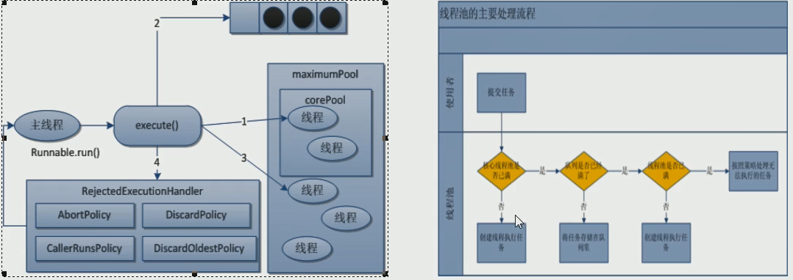

1. 在创建了线程池后，等待提交过来的任务请求
2. 当调用execute方法添加一个请求任务时，线程池会做如下判断：
   1. 如果正在运行的线程数小于corePoolSize，那么马上创建线程运行这个任务
   2. 如果正在运行的线程数大于或等于corePoolSize，那么将这个任务放入队列
   3. 如果这时候队列满了且正在运行的线程数还小于maximumPoolSize，那么还是要创建非核心线程立即运行这个任务
   4. 如果队列满了且正在运行的线程数量大于或等于maximumPoolSize，那么线程池会启动饱和拒绝策略来执行
3. 当一个线程完成任务时，他会从队列中取下一个任务执行
4. 当一个线程无事可做超过一定的时间（keepAliveTime）时，线程池会判断：如果当前运行的线程数大于corePoolSize，那么这个线程就会被停掉

### 1.9.5 拒绝策略

等待队列也已经排满了，再也塞不下新的任务了，同时线程池的max也到达了，无法继续为新任务服务，这个时候我们就需要拒绝策略机制合理的处理这个问题

1. AbortPolicy（默认）：直接抛出RejectedException异常阻止系统正常运行
2. CallerRunPolicy：“调用者运行”一种调节机制，该策略既不会抛弃任务也不会抛出异常，而是将某些任务回退到调用者，从而降低新任务的流量
3. DiscardOldestPolicy：抛弃队列中等待最久的任务，然后把当前任务加入队列中尝试再次提交当前任务
4. DiscardPolicy：直接丢弃任务，不予任何处理也不抛出异常，如果允许任务丢失，这是最好的一种拒绝策略方案

**以上内置策略均实现了RejectExecutionHandler接口**

### 1.9.6 自定义线程池

一般在工作中不使用JDK自带的线程池，只使用自定义的线程池

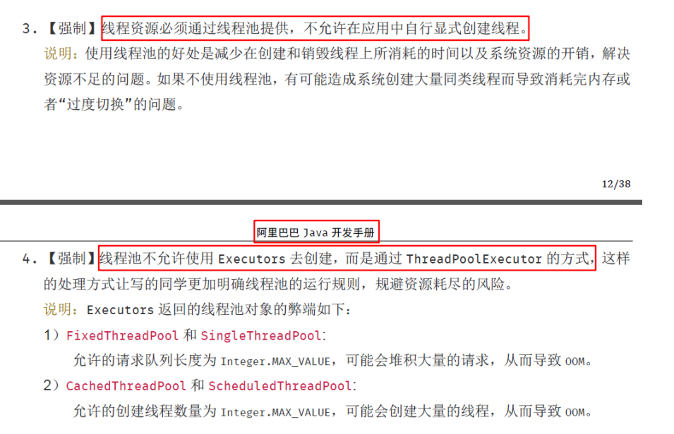

### 1.9.7 合理配置线程池

1. CPU密集型

   CPU密集型是该任务需要大量的运算，而没有阻塞，CPU一直全速运行。

   CPU密集任务只有在真正的多核CPU上才可能得到加速（通过多线程），而在单核CPU，无论你开几个模拟的多线程该任务都不可能得到加速，因为CPU总的运算力就那些

   CPU密集型任务配置尽可能少的线程数量：CPU核数+1个线程的线程池

   `Runtime.getRuntime().availableProcessors()`查看电脑的CPU核数

2. IO密集型

   由于IO密集型任务线程并不是一直在执行任务，则应配置尽可能多的线程，CPU核数*2。

   该任务需要大量的IO，大量的阻塞，在单线程上运行IO密集型任务会导致浪费大量的CPU运算能力在等待，所以在IO密集型任务中使用多线程可以大大的加速程序运行

   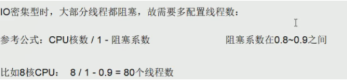

1、看公司业务是CPU密集型还是IO密集型的，这两种不一样，来决定线程池线程数的最佳合理配置数

2、先查看服务器是几核的，调用Runtime.getRuntime().availableProcessors()这个方法来查看核数。

# 第二章 CompletableFuture

## 2.1 Future和Callable接口

Future接口定义了操作异步任务执行一些方法，如获取异步任务的执行结果、取消任务的执行、判断任务是否被取消、判断任务执行是否完毕等。

Callable接口定义了需要有返回的任务需要实现的方法。

比如主线程让一个子线程去执行任务，子线程可能比较耗时，启动子线程开始执行任务后，主线程就去做其他事情了，过了一会才去获取子任务的执行结果。

## 2.2 FutureTask

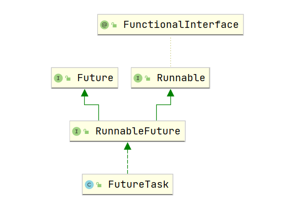

FutureTask实现了Future接口和Runnable接口。

```java
public static void main(String[] args) throws ExecutionException, InterruptedException, TimeoutException
{
    FutureTask<Integer> futureTask = new FutureTask<>(() -> {
        System.out.println(Thread.currentThread().getName() + "\t" + "---come in");
        try { TimeUnit.SECONDS.sleep(5); } catch (InterruptedException e) { e.printStackTrace(); }
        return 1024;
    });

    new Thread(futureTask,"t1").start();
    //System.out.println(futureTask.get());//不见不散，只要出现get方法，不管是否计算完成都阻塞等待结果出来再运行

    //System.out.println(futureTask.get(2L,TimeUnit.SECONDS));//过时不候
    //不要阻塞，尽量用轮询替代
    while(true)
    {
        if(futureTask.isDone())
        {
            System.out.println("----result: "+futureTask.get());
            break;
        }else{
            System.out.println("还在计算中，别催，越催越慢，再催熄火");
        }
    }
}
```

如上代码所示，使用FutureTask的时候，虽然也可以实现异步任务，但是使用get获取数据的时候，**一旦调用get方法，不管是否计算完成都会导致阻塞，所以一般都将get方法放在代码的最后**。这是FutureTask的缺点之一。

可以使用带时间限制的get方法，也就是**过时不候**

当然也可以用isDone()来轮询，**但是轮询的方式会消耗无谓的CPU资源，而且也不见得能及时地得到计算结果。**，**如果想要异步获取结果，通常都会以轮询的方式去获取结果，尽量不要阻塞**。

FutureTask如果想要完成一些复杂的任务就比较麻烦了。

## 2.3 CompletableFuture

```java
public class CompletableFuture<T> implements Future<T>, CompletionStage<T>
```

它同时实现了Future接口和CompletionStage接口，因此就拥有了FutureTask相关的功能，而且还增强了自己的功能。

**CompletionStage**

- CompletionStage代表异步计算过程中的某个阶段，一个阶段完成以后可能触发另外一个阶段
- 一个阶段的计算结果可以是一个Fuction、Consumer或者Runnable。
- 一个阶段的执行可能是被单个阶段的完成触发，也可能是由多个阶段一起触发。
- 代表异步计算过程中的某一个阶段，一个阶段完成以后可能触发另外一个阶段，有些类似Linux系统的管道分隔符传参数。

**CompletableFuture**

- 在Java8中，CompletableFuture提供了非常强大的Future的扩展功能，可以帮助我们简化异步编程的复杂性，并且提供了函数式编程的能力，可以通过回调的方式处理计算结果，也提供了转换和组合CompletableFuture的方法。
- 他可能代表一个明确完成的Future，也有可能代表一个完成阶段（CompletionStage），它支持在计算完成以后触发一些函数或执行某些动作。
- 它实现了Future和CompletionStage接口。

**=====================具体的笔记可以查看谷粒商城高级篇**

# 第三章 谈谈Java锁事

## 3.1 乐观锁和悲观锁

**悲观锁**：

1. 适合写操作多的场景，先加锁可以保证写操作时数据正确。
2. 显示的锁定之后再操作同步资源。
3. 认为自己在使用数据的时候一定有别的线程来修改数据，因此在获取的时候会先加锁，确保数据不会被别的线程修改
4. synchronized关键字和Lock的实现类都是悲观锁。

**乐观锁**

1. 乐观锁认为自己在使用数据的时候不会有别的线程修改数据，所以不会添加锁，只是在更新数据的时候去判断之前有没有别的线程更新了这个数据。
2. 如果这个数据没有被更新，当前线程将自己修改的数据成功写入。如果数据已经被其他线程更新，则根据不同的实现方式执行不同的操作。
3. 乐观锁在Java中是通过使用无锁编程来实现，最常采用的是CAS算法，Java原子类中的递增操作就是通过CAS自旋实现的。
4. 适合读操作多的场景，不加锁的特点能使读操作的性能大幅提升。
5. 也可以通过版本号的机制实现。

## 3.2 Java8锁事

```JAVA
class Phone {//资源类
    public static synchronized void sendEmail() {
        //暂停几秒钟线程
        try { TimeUnit.SECONDS.sleep(3); } catch (InterruptedException e) { e.printStackTrace(); }
        System.out.println("-------sendEmail");
    }

    public synchronized void sendSMS() {
        System.out.println("-------sendSMS");
    }

    public void hello() {
        System.out.println("-------hello");
    }

    public static void main(String[] args){ //一切程序的入口，主线程
        Phone phone = new Phone();//资源类1
        Phone phone2 = new Phone();//资源类2

        new Thread(() -> {
            phone.sendEmail();
        },"a").start();

        //暂停毫秒
        try { TimeUnit.MILLISECONDS.sleep(300); } catch (InterruptedException e) { e.printStackTrace(); }

        new Thread(() -> {
            //phone.sendSMS();
            //phone.hello();
            phone2.sendSMS();
        },"b").start();

    }
}
```


其实就是考的sync锁的是对象还是整个类，就会明白了这个。

- 作用于实例方法，当前实例加锁，进入同步代码前要获得当前实例的锁；
- 作用于代码块，对括号里配置的对象加锁。
- 作用于静态方法，当前类加锁，进去同步代码前要获得当前类对象的锁；

## 3.3 反编译查看synchronized实现

**1、反编译同步代码块**

```java
private final Object objectLock = new Object();
public void m1() {
    synchronized (objecctLock) {
        System.out.println("------hello synchronized");
    }
}
```

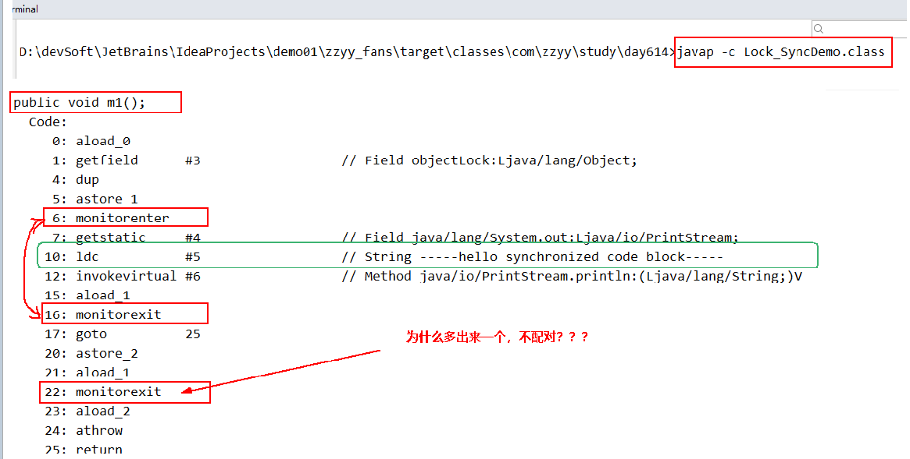

可以看到，synchronized实际上使用的是monitorenter和monitorexit两个指令，但是可以看到，上述的代码，两者居然不配对，这是因为得sync的底层会保证该锁最后一定会被释放。

可以手动给m1方法抛出异常

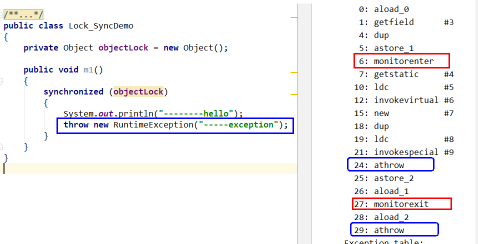

**2、反编译普通同步方法**

```java
public synchronized void m2() {
    System.out.println("------");
}
```

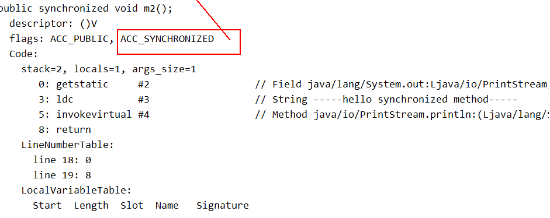

可以看到，调用指令将会检查方法的ACC_SYNCHRONIZED访问标志是否被设置。

如果设置了，执行线程会先持有monitor然后再执行方法，最后在方法完成（无论是正常完成还是非正常完成）时释放monitor。

**3、反编译静态同步方法**

```java
public static synchronized void m3() {
    
}
```


ACC_STATIC, ACC_SYNCHRONIZED访问标志区分该方法是否静态同步方法

**4、什么是管程monitor**

**面试题：**synchronized实现原理，monitor对象什么时候生产的？知道monitor的monitorenter和monitorexit吗？这两个是怎么保证同步的，或者说，这两个操作计算机底层是如何执行的？

**为什么任何一个对象都可以成为一个锁？**

管程（Monitors，也称为监视器）是一种程序结构，结构内的多个子程序（对象或模块）形成的多个工作线程互斥访问共享资源。这些共享资源一般是硬件设备或一群变量。对共享变量能够进行的所有操作集中在一个模块中。（把信号量及其操作原语“封装”在一个对象内部）管程实现了在一个时间点，最多只有一个线程在执行管程的某个子程序。管程提供了一种机制，管程可以看做一个软件模块，他是将共享的变量和对于这些共享变量的操作封装起来，形成一个具有一定接口的功能模块，进程可以调用管程来实现进程级别的并发控制。

方法级的同步是隐式的，无需通过字节码指令来控制，它实现在方法调用和返回操作之中。虚拟机可以从方法常量池中的方法表结构中的ACC_SYNCHRONIZED访问标志得知一个方法是否被声明为同步方法。当方法调用时，调用指令会检查方法的ACC_SYNCHRONIZED访问标志是否被设置，如果设置了，**执行线程就要求先成功持有管程，然后才能执行方法，最后当方法完成（无论是正常完成还是非正常完成）时释放管程。在方法执行期间，执行线程持有了管程，其他任何线程都无法再获取到同一个管程。**如果一个同步方法执行期间抛出了异常，并且在方法内部无法处理此异常，那么这个同步方法所持有的管程将在异常抛到同步方法边界之外时自动释放。

同步一段指令集序列通常是由Java语言中的synchronized语句块来表示的，Java虚拟机的指令集中有monitorenter和monitorexit两条指令来支持synchronized关键字的语义，正确实现synchronized关键字需要Javac编译器与Java虚拟机两者共同协作支持。

**5、C++源码解读**

在HotSpot虚拟机中，monitor采用ObjectMonitor实现。

objectMonitor.hpp文件中：


| 属性名称    | 作用                              |
| ----------- | --------------------------------- |
| _owner      | 指向持有ObjectMonitor对象的线程   |
| _WaitSet    | 存放处于wait状态的线程队列        |
| _EntryList  | 存放处于等待锁block状态的线程队列 |
| _recursions | 锁的重入次数                      |
| _count      | 用来记录该线程获取锁的次数        |

**也就是说，其实每个对象天生都带有一个对象监视器；**

**所有对象内部都维护了一个状态，而java同步机制就是使用了对象中的状态作为了锁的标识**

## 3.4 公平锁和非公平锁

> 可以参照尚硅谷面试题相关笔记

**面试题**

1. 为什么会有公平锁和非公平锁/为什么默认非公平锁？
   - 恢复挂起的线程到真正锁的获取还是有时间差的，从开发人员来看这个时间微乎其微，但是从CPU的角度来看，这个时间差存在的还是很明显的。所以非公平锁能更充分的利用CPU等待时间片，尽量减少CPU空闲时间。
   - 使用多线程很重要的考量点就是线程切换的开销，当采用非公平锁时，**当一个线程请求锁获取同步状态，然后释放同步状态，因为不需要考虑是否还有前驱节点，所以刚释放锁的线程在此刻再次获取同步状态的概率就变得非常大，所以就减少了线程的开销**
2. 使用非公平锁会有什么问题？
   - 公平锁保证了排队的公平性，非公平锁霸气的忽视了这个规则，所以就有可能导致排队的长时间在排队，也没有机会获取到锁
   - 也就是锁饥饿
3. 什么时候使用公平锁？什么时候使用非公平锁？
   - 如果为了更高的吞吐量，选择非公平锁，因为节省很多线程切换时间，吞吐量自然就上去了
   - 否则就使用公平锁，大家公平使用

## 3.5 可重入锁

是指在同一个线程在外层方法获取到锁的时候，再进入该线程的内层方法会自动获取锁（前提是锁对象是同一个对象），不会因为之前已经获取过还没释放而阻塞

可重入锁可以一定程度上避免死锁。

**synchronized的重入实现机理**

- **每个锁对象拥有一个锁计数器和一个指向持有该锁的线程的指针**
- 当执行monitorenter时，如果目标对象的计数器为零，那么说明它没有被其他线程所持有，Java虚拟机会将该锁对象的持有线程设置为当前线程，并且将其计数器加1.
- 在目标对象的计数器不为零的情况下，如果锁对象的持有线程是当前线程，那么Java虚拟机可以将其计数器加1，否则需要等待，直至持有线程释放该锁
- 当执行monitorexit时，Java虚拟机则需将锁对象的计数器减1，计数器为零代表锁已被释放。

## 3.6 死锁

死锁是指两个或两个以上的线程在执行过程中，因争夺资源而造成的一种互相等待的现象，若无外力干涉那它们都将无法推进下去，如果系统资源足够，进程的资源请求都能够得到满足，死锁出现的概率很低，否则就会因争夺有限的资源而陷入死锁。


原因：

1. 系统资源不足
2. 进程运行的推进顺序不合适
3. 资源分配不当

**死锁case**

```java
public class DeadLockCase {

    static final Object lockA = new Object();
    static final Object lockB = new Object();

    public static void main(String[] args) {
        Thread aa = new Thread(() -> {
            synchronized (lockA) {
                System.out.println(Thread.currentThread().getName() + " 持有锁A，想要锁B");

                try { TimeUnit.SECONDS.sleep(1);
                } catch (InterruptedException e) { e.printStackTrace(); }
                
                synchronized (lockB) {
                    System.out.println(Thread.currentThread().getName() + " 获取锁B成功");
                }
            }
        }, "aa");
        aa.start();

        Thread bb = new Thread(() -> {
            synchronized (lockB) {
                System.out.println(Thread.currentThread().getName() + " 持有锁B，想要锁A");

                try { TimeUnit.SECONDS.sleep(1);
                } catch (InterruptedException e) { e.printStackTrace(); }
                
                synchronized (lockA) {
                    System.out.println(Thread.currentThread().getName() + " 获取锁A成功");
                }
            }
        }, "bb");
        bb.start();
    }
}
```

**解决方案**

1. jps命令定位进程编号
2. jstack找到死锁查看

## 3.7 其他锁

写锁（独占锁）/读锁（共享锁）、自旋锁SpinLock

无锁 → 独占锁 → 读写锁 → 邮戳锁

无锁 → 偏向锁 → 轻量锁 → 重量锁

# 第四章 LockSupport与线程中断

## 4.1 线程中断机制

### **4.1.1、阿里蚂蚁金服面试题**

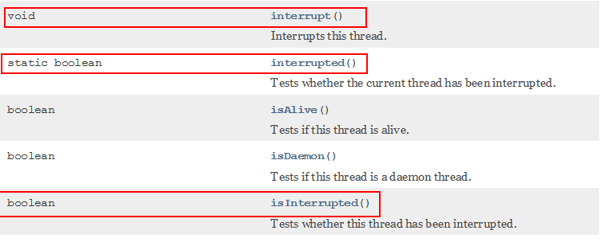

**如何停止、中断一个运行中的线程？**

### **4.1.2、什么是中断？**

- 首先一个线程不应该由其他线程赖强制中断或停止，而是应该由线程自己自行停止。所以Thread.stop, Thread.suspend, Thread.resume都已经被废弃了。
- 其次在Java中没有办法立即停止一条线程，然而停止线程却显得尤为重要，如取消一个耗时操作。因此，Java提供了一种用于停止线程的机制 --- 中断
- **中断只是一种协作机制，Java没有给中断增加任何语法，中断的过程完全需要程序员自己实现。**
- 若要中断一个线程，你需要手动调用该线程的interrupt方法，**该方法也仅仅是将线程对象的中断标识设置为true；**接着你需要自己写代码不断地检测当前线程的标识位，如果为true，表示别的线程要求这条线程中断，此时究竟该做什么需要你自己写代码实现。
- 每个线程对象都有一个标识，用于表示该线程是否被中断；该标识位为true为中断，false表示未中断；通过调用线程对象的interrupt方法将该线程的标识位设为true；可以在别的线程中调用，也可以在自己的线程中调用。

### **4.1.3、中断的相关API**

| API                              | 作用                                                         |
| -------------------------------- | ------------------------------------------------------------ |
| public void interrupt()          | 实例方法，仅仅是设置线程的中断状态true，不会停止线程。       |
| public static boolean interupted | 静态方法，Thread.interrupted()；<br />**判断线程是否被中断，并清除当前状态**<br />该方法做了两件事<br />1、**返回当前线程的中断状态**<br />2、将当前线程的中断状态设置为false |
| public boolean isInterrupted     | 判断当前线程是否被中断（通过检查中断标志位）                 |

#### 4.1.3.1 interrupt源码分析

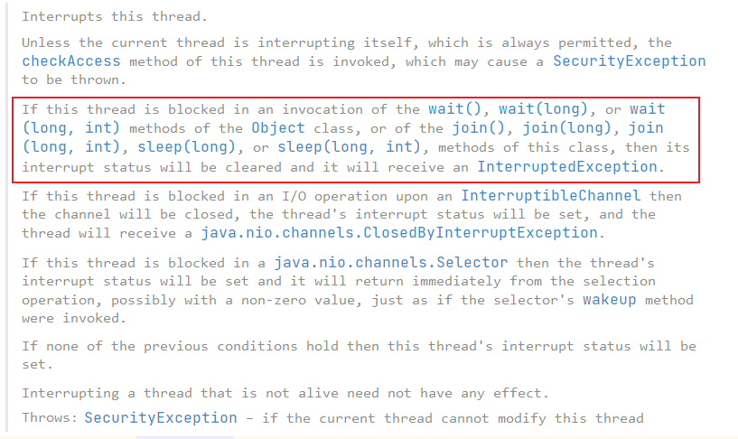

```java
public void interrupt() {
    if (this != Thread.currentThread())
        checkAccess();

    synchronized (blockerLock) {
        Interruptible b = blocker;
        if (b != null) {
            interrupt0();           // Just to set the interrupt flag
            b.interrupt(this);
            return;
        }
    }
    interrupt0();
}
```

如上图注释所示，如果该线程被wait、join、sleep方法给阻塞了，调用该方法就会爆出异常。

#### 4.1.3.2 isInterrupted源码分析

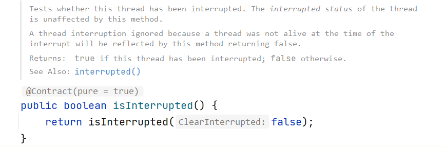

调用的是本地方法。

### 4.1.4、如何使用中断标识停止线程

在需要中断的线程中**不断监听中断状态**，一旦发生中断，就执行相应的中断处理业务逻辑。

#### 4.1.4.1 使用volatile来实现

```java
public class InterruptDemp {
    private static volatile boolean isStop = false;
    
    public static void main(String[] args) {
        new Thead(() -> {
            while (true) {
                if (isStop) {
                    System.out.println(Thread.currentThread().getName() + "线程自己退出了");
                    break;
                }
                System.out.println(" ------ Hello Interrupt");
            }
        }, "t1").start();
        
        try { TimeUnit.SECONDS.sleep(1); } catch (InterruptedException e) {
            e.printStackTrace();
        }
        
        isStop = true;
    }
}
```

#### **4.1.4.2 通过AtomicBoolean**

```java
static AtomicBoolean atomicBoolean = new AtomicBoolean(false);

public static void m2() {
    new Thread(() -> {
        while(true) {
            if(atomicBoolean.get()) {
                System.out.println("-----atomicBoolean.get() = true，程序结束。");
                break;
            }
            System.out.println("------hello atomicBoolean");
        }
    },"t1").start();

    //暂停几秒钟线程
    try { TimeUnit.SECONDS.sleep(1); } catch (InterruptedException e) { e.printStackTrace(); }

    new Thread(() -> {
        atomicBoolean.set(true);
    },"t2").start();
}
```

#### 4.1.4.3 使用Thread自带的api

```java
public static void m3() {
    Thread t1 = new Thread(() -> {
        while (true) {
            if (Thread.currentThread().isInterrupted()) {
                System.out.println("-----isInterrupted() = true，程序结束。");
                break;
            }
            System.out.println("------hello Interrupt");
        }
    }, "t1");
    t1.start();

    try { TimeUnit.SECONDS.sleep(1); } catch (InterruptedException e) { e.printStackTrace(); }

    new Thread(() -> {
        t1.interrupt();//修改t1线程的中断标志位为true
    },"t2").start();
}
```

### 4.1.5、当前线程的中断标识为true，是不是就立刻停止？

具体来说，当对一个线程，调用interrupt时

1. 如果线程处于正常活动状态，那么会将该线程的中断标志设为true，**仅此而已；被设置中断标志的线程将继续正常运行，不受影响。**所以interrupt并不能真正的中断线程，需要被调用的线程自己进行配合才行。
2. 如果线程处于被阻塞状态（例如处于sleep、wait、join等状态），在别的线程池中调用当前线程对象的interrupt方法，那么线程将立即退出被阻塞状态，并抛出一个InterruptedException异常。

```java
public static void m4() {
    //中断为true后，并不是立刻stop程序
    Thread t1 = new Thread(() -> {
        for (int i = 1; i <= 300; i++) {
            System.out.println("------i: " + i);
        }
        System.out.println("t1.interrupt()调用之后02： "+Thread.currentThread().isInterrupted());
    }, "t1");
    t1.start();

    System.out.println("t1.interrupt()调用之前,t1线程的中断标识默认值： "+t1.isInterrupted());
    try { TimeUnit.MILLISECONDS.sleep(3); } catch (InterruptedException e) { e.printStackTrace(); }
    //实例方法interrupt()仅仅是设置线程的中断状态位设置为true，不会停止线程
    t1.interrupt();
    //活动状态,t1线程还在执行中
    System.out.println("t1.interrupt()调用之后01： "+t1.isInterrupted());

    try { TimeUnit.MILLISECONDS.sleep(3000); } catch (InterruptedException e) { e.printStackTrace(); }
    //非活动状态,t1线程不在执行中，已经结束执行了。
    System.out.println("t1.interrupt()调用之后03： "+t1.isInterrupted());
}
```

运行结果如下：

```
t1.interrupt()调用之前,t1线程的中断标识默认值： false
------i: 1
------i: 2
------i: 3
------i: 4
......
t1.interrupt()调用之后01： true
------i: 209
------i: 210
......
------i: 300
t1.interrupt()调用之后02： true
t1.interrupt()调用之后03： false
```

**可以看到，该线程的标志位被设置为true，并没有立即退出线程**

再看下面一个案例：

```java
public static void m5()
{
    Thread t1 = new Thread(() -> {
        while (true) {
            if (Thread.currentThread().isInterrupted()) {
                System.out.println("-----isInterrupted() = true，程序结束。");
                break;
            }
            try {
                Thread.sleep(500);
            } catch (InterruptedException e) {
                Thread.currentThread().interrupt();
                //线程的中断标志位为false,无法停下，需要再次掉interrupt()设置true
                e.printStackTrace();
            }
            System.out.println("------hello Interrupt");
        }
    }, "t1");
    t1.start();

    try { TimeUnit.SECONDS.sleep(3); } catch (InterruptedException e) { e.printStackTrace(); }

    //修改t1线程的中断标志位为true
    new Thread(t1::interrupt,"t2").start();
}
```

需要注意的是**sleep方法抛出异常后，中断标识也会被清空重置为false**，我们在catch如果没有调用th.interrupt方法再次将中断标识设置为true，这就导致无限循环了。

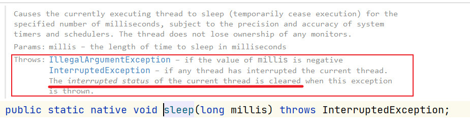

### 4.1.6、小总结

中断只是一种协同机制，修改中断标识位而已，不是立即stop打断该线程。

## 4.2 线程等待唤醒机制

JUC中有三种线程等待唤醒机制：

1. 使用Object中的wait方法让线程等待，使用Object中的notify方法唤醒线程
2. 使用JUC包中Condition的await方法让线程等待，使用signal方法唤醒线程
3. LockSupport类可以阻塞当前线程以及唤醒指定被阻塞的线程

### 4.2.1、Object和Condition限制条件

1. 线程必须先要获得并持有锁，必须在锁块（synchronized或lock）中
2. 必须要先等待后唤醒，线程才能够被唤醒。

### 4.2.2、LockSupport

- **LockSupport是用来创建锁和其他同步类的基本线程阻塞原语**
- **LockSupport中的park()和unpart（）的作用分别是阻塞线程和解除阻塞线程**
- 通过part()和unpark（thread）方法来实现阻塞和唤醒线程的操作
- LockSupport类使用了一种名为Permit（许可）的概念来做到阻塞和唤醒线程的功能，每个线程都有一个许可，permit只有两个值，1和0。可以把许可看成是一种（0，1）信号量（Semaphore），**但是许可的累加上限是1**

```java
// LockSupport.park()
public static void park() {
    UNSAFE.park(false, 0L);
}

public static void park(Object blocker) {
    Thread t = Thread.currentThread();
    setBlocker(t, blocker);
    UNSAFE.park(false, 0L);
    setBlocker(t, null);
}
```

permit默认为0，所以一开始调用park()方法，当前线程就会阻塞，直到别的线程将当前线程的permit设置为1时，park方法会被唤醒，然后将permit再次设置为0并返回

```java
public static void unpark(Thread thread) {
    if (thread != null)
        UNSAFE.unpark(thread);
}
```

调用unpark方法后，就会将thread线程的许可permit设置为1（注意多次调用unpark方法不会累加，permit值还是1）会自动唤醒thread线程，即之前阻塞中的LockSupport.part()方法会立即返回

如果先执行unpart，那么permit就会被设置为1，那么后面再执行park的时候，就相当于park方法不存在，形同虚设，因此不会产生阻塞。

```java
public static void loc() {
    Thread t1 = new Thread(() -> {
        try {
            TimeUnit.SECONDS.sleep(3);
        } catch (InterruptedException e) {
            e.printStackTrace();
        }
        System.out.println(Thread.currentThread().getName() + "\t" + "---come in");
        LockSupport.park();
        LockSupport.park();
        System.out.println(Thread.currentThread().getName() + "\t" + "---被唤醒");
    }, "t1");
    t1.start();

	// 这个示例会导致t1线程阻塞，原因如上面的话。
    new Thread(() -> {
        LockSupport.unpark(t1);
        System.out.println("发出第一条通知");
        LockSupport.unpark(t1);
        System.out.println("发出第二条通知");
    }, "t2").start();
}
```

**重点说明**

LockSupport是用来创建锁和其他同步类的基本线程阻塞原语

LockSupport是一个线程阻塞工具类，所有的方法都是静态方法，可以让线程在任意位置阻塞，阻塞之后也有对应的唤醒方法。归根结底，LockSupport调用的Unsafe中的native代码。

LockSupport提供park()和unpark()方法实现阻塞线程和解除线程阻塞的过程

LockSupport和每个使用它的线程都有一个许可(permit)关联。permit相当于1，0的开关，默认是0，调用一次unpark就加1变成1，调用一次park会消费permit，也就是将1变成0，同时park立即返回。

如再次调用park会变成阻塞(因为permit为零了会阻塞在这里，一直到permit变为1)，这时调用unpark会把permit置为1。

每个线程都有一个相关的permit, permit最多只有一个，重复调用unpark也不会积累凭证。

**形象的理解**

线程阻塞需要消耗凭证(permit)，这个凭证最多只有1个。

当调用park方法时

- 如果有凭证，则会直接消耗掉这个凭证然后正常退出;
- 如果无凭证，就必须阻塞等待凭证可用;

而unpark则相反，它会增加一个凭证，但凭证最多只能有1个，累加无效。

### 4.2.3、LockSupport相关面试题

**为什么可以先唤醒线程后阻塞线程**

因为unpark获得了一个凭证，之后再调用park方法，就可以名正言顺的凭证消费，故不会阻塞

**为什么唤醒两次后阻塞两次，但最终结果还会阻塞线程？**

因为凭证的数量最多为1，连续调用两次unpark和调用一个unpark效果一样，只会增加一个凭证；而调用两次park却需要消费两个凭证

# 第五章、JMM内存模型

## 5.1、相关面试题

- 你知道什么是Java内存模型JMM吗
- JMM与volatile它们两个之间的关系？
- JMM有哪些特性或者它的三大特性是什么？
- 为什么要有JMM，它为什么出现？作用和功能是什么
- **happens-before先行发生原则你有了解过吗？**

## 5.2 计算机硬件存储体系

计算机存储结构，从本地磁盘到主存到CPU缓存，也就是从硬盘到内存，到CPU。一般对应的程序的操作就是从数据库查数据到内存人后到CPU进行计算。

因为有这么多级的缓存（CPU和物理主内存的速度不一致的），**CPU的运行并不是直接操作内存，而是先把内存里边的数据读到缓存**，而内存的读和写操作的时候就会造成不一致的问题。

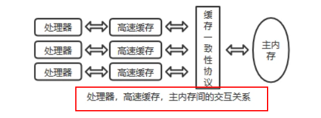

Java虚拟机规范中试图定义一种Java内存模型（Java Memory Model，简称JMM）来屏蔽掉各种硬件和操作系统的内存访问差异，以实现让Java程序在各种平台下都能达到一致的内存访问效果。

## 5.3 JMM相关基本概念

Java内存模型，Java Memory Model，简称JMM，本身是一种抽象的概念，并不真实存在，它描述的是一组规则或规范。通过规范定制了程序各个变量（包括实例字段、静态字段和构成数组对象的元素）的读写访问方式并决定一个线程对共享变量的写入何时以及如何变成对另一个线程可见，关键技术都是围绕多线程的**原子性、可见性和有序性**展开的。

**原则**：JMM的关键技术点都是围绕多线程的原子性、可见性和有序性展开的

**能干嘛**

1. 通过JMM来实现线程和主内存之间的抽象关系
2. 屏蔽各个硬件平台和操作系统的内存访问差异以实现让Java程序在各种平台下都能达到一致的内存访问效果。

## 5.4 三大特性

JMM关于同步规定：①、线程解锁前， 必须把共享变量​的值刷新回主内存；②、线程加锁前， 必须读取主内存的最新值到自己的工作内存；③、加锁解锁是同一把锁

由于JVM运行程序的实体是线程，而每个线程创建时JVM都会为其创建一个工作内存（有些地方称为栈空间），工作内存是每个线程的私有数据区域，而Java内存模型中规定所有变量都存储在**主内存**（电脑装的内存条，硬件）中，主内存是共享内存区域，所有线程都可以访问，**但是线程对变量的操作（读取赋值等）必须在工作内存中进行，首先要将变量从主内存拷贝到自己的工作空间，然后对变量进行操作，操作完成再将变量写回主内存中，不能直接操作主内存中的变量**，各个线程中的工作内存储着主内存中的变量副本拷贝，因此不同的线程无法访问对方的工作内存，此案成间的通讯（传值）必须通过主内存来完成


**1、JMM可见性**

通过前面对JMM的介绍，我们知道各个线程对主内存中共享变量的操作都是各个线程各自拷贝到自己的工作内存中，操作后再写回主内存中的。

这就可能存在一个线程AAA修改了共享变量X的值，还未写回主内存中时，另外一个线程BBB又对内存中的一个共享变量X进行操作，但此时AAA线程工作内存中的共享变量X对BBB来说并不可见，这种工作内存与主内存同步延迟现象就造成了可见性的问题

因此就必须要有一种机制，**只要有一个线程修改完自己的工作内存中的值，并写回给主内存以后要及时通知其他线程，这种即时通知就是JMM中的可见性。**

代码示例如下

```java
class MyData{

    //volatile就是增强了主线程和线程的可见性
    volatile  int number = 0;

    public void addTO60(){
        this.number = 60;
    }
}

/**
 * 1.验证volatile的可见性
 *  1.1 假如int number = 0; number变量之前没有添加volatile关键字修饰，没有可见性
 */
public class VolatileDemo {
    public static void main(String[] args) {

        MyData myData = new MyData();//线程操作资源类

        new Thread(() -> {
            System.out.println(Thread.currentThread().getName()+"\t come in");
            //线程暂停3秒钟
            try { TimeUnit.SECONDS.sleep(3); }catch (Exception e) {e.printStackTrace();}
            //3秒钟以后将把0改为60
            myData.addTO60();
            System.out.println(Thread.currentThread().getName()+"\t updated number value:"+myData.number);
        },"AAA").start();

        //第二个线程就是我们的main线程
        while (myData.number == 0){
            //main主线程就一直在这里等待循环，直到number不再等于零
        }
        //若这句话打印出来了，说明main主线程感知到了number的值发生了变化，那么此时可见性就会被触发
        System.out.println(Thread.currentThread().getName()+"\t mission is over,main get number value:"+myData.number);  //这个是main线程
    }
}
```

AAA线程拿到副本进行操作，几乎同时主线程也拿到了number的副本进行while循环，当AAA三秒之后将number修改为60，随后写入内存中，但是此时主线程还是使用自己的内存空间中的number副本，因此循环继续。

如果给while语句前面添加上延迟时间，保证while拿到数据的时候AAA线程已经完成了修改并写入主内存，那么while拿到的就是number修改之后的值

**2、JMM原子性**

什么是原子性？其实就是看最终一致性能不能保证。不可分割、完整性。即某个线程正在做某个业务的时候，中间不可以被加塞或者被分割，需要整体完整。

JMM要求保证原子性，但是volatile是不保证原子性的。

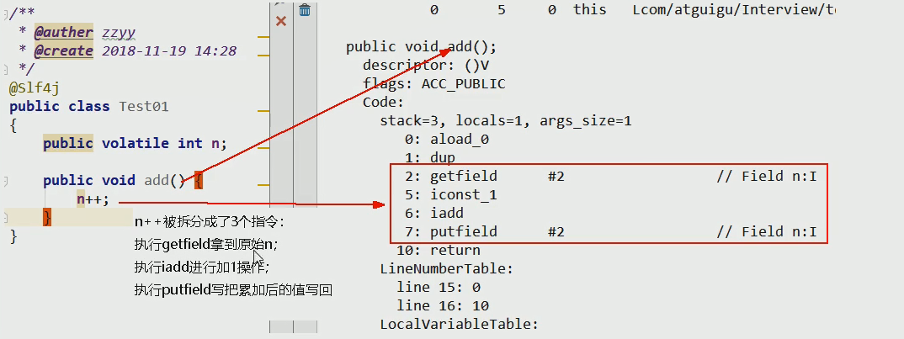

number++在多线程的情况下是非线程安全的，除了加synchronized以外，还能通过AtomicInteger来解决。

为什么number++无法保证线程安全？因为很多值在putfield这步写回主内存的时候可能线程的调度被挂起了，刚好也没有收到最新值的通知，有那么一个纳秒级的时间差，一写就出现了写覆盖，将之前的值给覆盖掉了。

```java
volatile int number = 0;
AtomicInteger atomicInteger = new AtomicInteger();

numeber++;
atomicInteger.getAndIncrement();
```

AtomicInteger（带原子性包装的整形类）的底层原理：CAS

**3、JMM有序性**

对于一个线程的执行代码而言，我们总是习惯性认为代码的执行总是从上到下，有序执行。

但是计算机在执行程序时，为了提高性能，编译器和处理器常常会做**指令重排**，一般分为一下3种


指令重排可以保证串行语义一致，但是没有义务保证多线程间的语义也一致，即可能产生“脏读“，简单说，两行以上不相干的代码在执行的时候有可能先执行的不是第一条，执行顺序会被优化。

- 单线程环境里面确保程序最终执行结果和代码顺序执行结果一致
- 处理器在进行重新排序时必须要考虑指令之间的**数据依赖性**
- 多线程环境中线程交替执行，由于编译器优化重排的存在，两个线程使用的变量能否保持一致性是无法确定的，结果无法预测

**4、小总结**

- 我们定义的所有共享变量都存储在物理主内存中。
- 每个线程都有自己独立的工作内存，里面保存该线程使用到的变量的副本（主内存中该变量的一份拷贝）
- 线程对共享变量所有的操作都必须在线程自己的工作内存中进行后写回主内存，不能直接从主内存中读写（不能越级）
- 不同线程之间也无法直接访问其他线程的工作内存中的变量，线程间变量值的传递需要通过主内存来进行（同级不能相互访问）

## 5.5 happens-before

在JMM中，如果一个操作执行的结果需要对另一个操作可见性或者代码重排序，那么这两个操作之间必须存在happens-before关系。

**案例**：如果线程A执行x = 5， 线程B执行y = x，那么 y是否等于5呢？

如果线程A的操作先行发生线程B的操作，那么可以确定线程B执行后y=5一定成立；如果它们不存在happens-before原则，那么不一定成立；这就是happens-before原则的威力→**包含可见性和有序性的约束**

**先行发生原则说明**

如果Java内存模型中所有的有序性都仅靠volatile和synchronized来完成，那么有很多操作都将会变得非常啰嗦。但是我们在编写Java并发代码的时候并没有察觉到这一点。

**我们没有时时刻刻添加volatile和synchronized来完成程序，这是因为Java语言中JMM原则下，有一个先行发生原则限制和规矩**

它是判断数据是否存在竞争，线程时候安全的非常有用的手段。依赖这个原则，我们可以通过几条简单规则一揽子解决**并发环境下两个操作之间是否可能存在冲突的所有问题**，而不需要陷入JMM苦涩难懂的底层编译原理中。

**总原则：**

- 如果一个操作happens-before另一个操作，那么第一个操作的执行结果将对第二个操作可见，而且第一个操作的执行顺序排在第二个操作之前。
- 两个操作之间存在先行发生原则，并不意味着一定要按照该原则制定的顺序来执行。如果重排序之后的执行结果与按照先行发生原则来执行的结果一致，那么这种重排序并不非法。

**8条原则**

1. 次序规则

   - **一个线程内**，按照代码顺序，写在前面的操作先行发生与写在后面的操作；
   - 前一个操作的结果可以被后续的操作获取。讲白点就是前面一个操作把变量x赋值为1，那么后面一个操作肯定能知道x已经变成了1.

2. 锁定规则：

   - 一个unLock操作先行发生于后面（这里的后面指的是时间上的先后）对同一个锁的lock操作。

   - ```java
     public class HappenBeforeDemo{
     
         static Object objectLock = new Object();
     
         public static void main(String[] args) throws InterruptedException {
             //对于同一把锁objectLock，threadA一定先unlock同一把锁后B才能获得该锁，   A 先行发生于B
             synchronized (objectLock){
     
             }
         }
     }
     ```

3. volatile变量规则：

   - 对一个volatile变量的写操作先行发生于后面对这个变量的读操作，**前面的写对后面的读是可见的**，这里的后面指的是时间上的先后。

4. 传递原则：

   - 如果操作A先行发生于操作B，而操作B又先行发生于操作C，则可以得出操作A先行发生于操作C

5. 线程启动规则（Thread Start Rule）：

   - Thread对象的start方法先行发生于此线程的每一个动作

6. 线程中断规则（Thread Interruption Rule）：

   - 对线程interrupt方法的调用先行发生于被中断线程的代码检测到中断事件的发生；
   - 可以通过Thread.interrupted检测到是否发生中断。

7. 线程终止规则（Thread Termination Rule）：

   - 线程中的的所有操作都可以先行发生于对此线程的终止检测，我们可以通过Thread::join方法是否结束、Thread::isAlive的返回值等手段检测线程是否已经终止执行。

8. 对象终结规则（Finalizer Rule）：

   - 一个对象的初始化完成（构造函数执行结束）先行发生于它的finalize方法的开始
   - 也就是对象没有完成初始化之前，是不能调用finalized方法的。

# 第六章 volatile

## 6.1 volatile是什么

volatile是Java虚拟机提供的轻量级的同步机制，基本上遵循了JMM的规范，它有三大特性：保证可见性、**不保证原子性**、禁止指令重排。

- 当写一个volatile变量时，JMM会把该线程对应的本地内存中的共享变量值**立即刷新回主内存中**。
- 当读一个volatile变量时，JMM会把该线程对应的本地内存设置为无效，直接从主内存中读取共享变量
- 所以volatile的写内存语义是直接刷新到主内存中，读的内存语义是直接从主内存中读取。

## 6.2 内存屏障

内存屏障（也称内存栅栏，内存栅障，屏障指令等，是一类同步屏障指令，是CPU或编译器在对内存随机访问的操作中的一个同步点，使得此点之前的所有读写操作都执行后才可以开始执行此点之后的操作），避免代码重排序。内存屏障其实就是一种JVM指令，Java内存模型的重排序规则会**要求Java编译器在生成JVM指令时插入特定的内存屏障指令**，通过这些指令，volatile实现了Java内存模型中的可见性和有序性，但是volatile无法保证原子性。

- 内存屏障之前的**写**操作都要**回写到主内存**。
- 内存屏障之后的所有读操作都能获得内存屏障之前的所有写操作的最新结果（实现了可见性）

因此重排序时，不允许把内存屏障之后的指令重排序到内存屏障之前。

一句话：对一个volatile域的写，先行发生于任意后续对这个volatile域的读，也叫写后读。

**也就是说，volatile凭什么保证可见性和有序性？就是因为内存屏障**

JMM提供了四类内存屏障指令：

查看Unsafe.class：

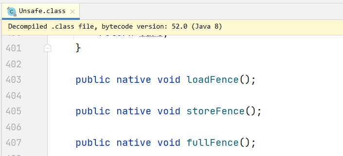

它的底层其实就是Unsafe.cpp类

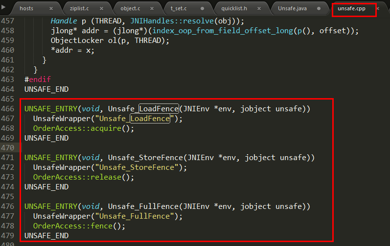

再看OrderAccess.hpp类：

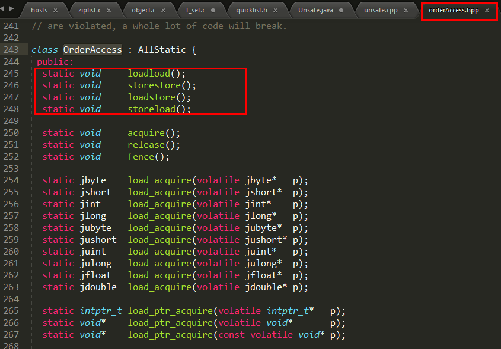

orderAccess_linux_x86.inline.hpp：


那么所谓的四大屏障分别是什么意思呢？

| 屏障类型   | 指令示例                   | 说明                                                         |
| ---------- | -------------------------- | ------------------------------------------------------------ |
| LoadLoad   | Load1；LoadLoad；Load2     | 保证Load1的读取操作在Load2及后续读取操作之前执行             |
| StoreStore | Store1；StoreStore；Store2 | 在Store2及其后的写操作执行前，保证store1的写操作已经刷新到主内存 |
| LoadStore  | Load1；LoadStore；Store2   | 在store2及其后的写操作执行前，保证load1的读操作已经读取结束  |
| StoreLoad  | Store1；StoreLoad；Load2   | 保证store1的写操作已经刷新到主内存之后，load2及其后的读操作才能执行 |

进一步加深理解：

先行发生原则之volatile变量规则如下所示：


- 当第一个操作为volatile读时，不论第二个操作是什么，都不能重排序。这个操作保证了volatile读之后的操作不会被重排到volatile读之前。
- 当第二个操作为volatile写时，不论第一个操作是什么，都不能重排序。这个操作保证了volatile写之前的操作不会被重排到volatile写之后。
- 当第一个操作为volatile写时，第二个操作为volatile读时，不能重排。

可以根据此来看为什么JMM要有四个内存屏障

- 在每个volatile写操作的前面插入一个StoreStore屏障
- 在每个volatile写操作的后面插入一个StoreLoad屏障

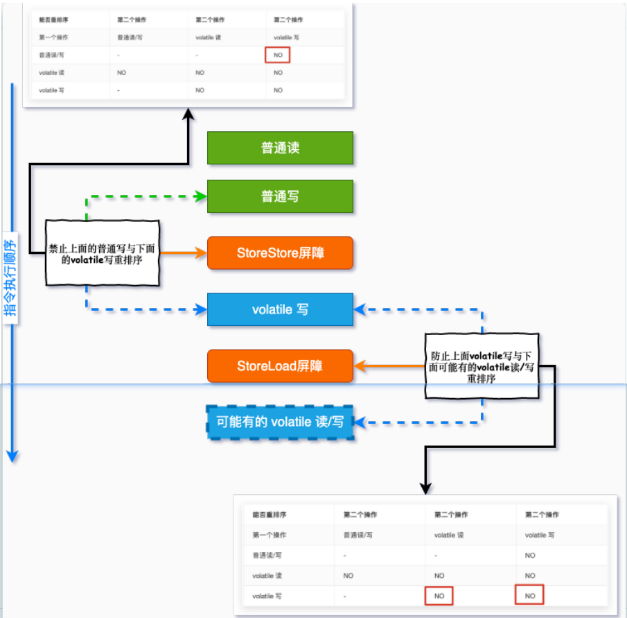

- 在每个volatile读操作的后面插入一个LoadLoad屏障
- 在每个volatile读操作的后面插入一个LoadStore屏障


## 6.3 volatile特性

**禁止指令重排小总结**（了解）

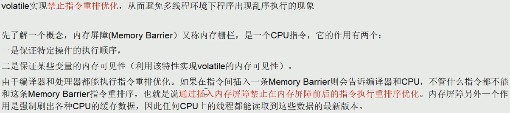

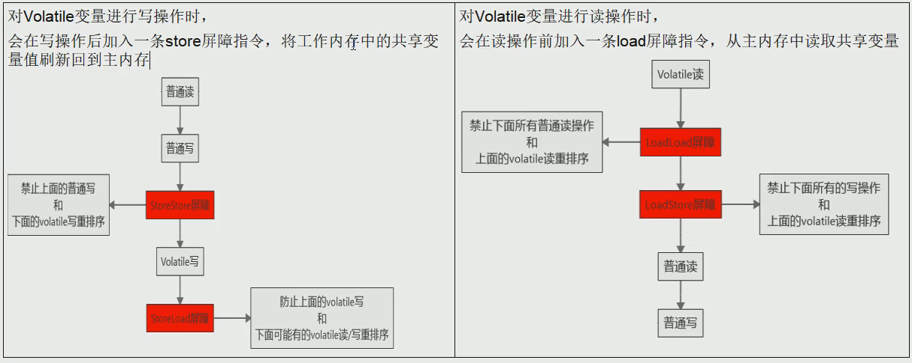

**volatile使用案例**

单例模式DCL代码

```java
public class SingletonDemo {

    private static volatile SingletonDemo instance=null;
    private SingletonDemo(){
        System.out.println(Thread.currentThread().getName()+"\t 构造方法");
    }

    /**
     * 双重检测机制
     * @return
     */
    public static SingletonDemo getInstance(){
        if(instance==null){
            synchronized (SingletonDemo.class){
                if(instance==null){
                    instance=new SingletonDemo();
                }
            }
        }
        return instance;
    }
}
```

但是DCL（双端检锁）机制不一定线程安全，原因是有指令重排的存在，加入volatile可以禁止指令重排，原因在于某一个线程在执行到第一次检测，读取到的instance不为null时，instance的引用对象**可能没有完成初始化**

instance = new SingletonDem(); 可以分为以下步骤（伪代码）

1. 分配对象内存空间 memory = allocate();
2. 初始化对象 instance(memory);
3. 设置instance指向刚分配的内存地址，此时instance != null

步骤2和步骤3不存在数据依赖关系，而且无论重排前还是重排后程序执行的结果在单线程中并没有改变，因此这种重排优化是允许的。

但是如果多线程情况下进行了重排优化，可能第三步先执行，此时对象还没初始化完，**所以当一条线程访问instance不为null时，由于instance实例未必完成初始化，也就造成了线程安全问题。**

因此我们可以加上volatile来禁止指令重排，就能保证多线程间的语义一致性，`private static volatile SingletonDemo instance = null`。

# 第七章 CAS

## 7.1 CAS

CAS：比较并交换，如果线程的期望值跟物理内存的真实值一样，就更新值到物理内存中，并返回true；如果线程的期望值跟物理内存的真实值不一样，返回false，本次修改失败，那么此时需要重新获得主物理内存的新值。

CASDemo代码

```java
public class CASDemo {
    public static void main(String[] args) {
        AtomicInteger atomicInteger = new AtomicInteger(5);
        System.out.println(atomicInteger.compareAndSet(5, 2019)+"\t current"+atomicInteger.get());
        System.out.println(atomicInteger.compareAndSet(5, 2014)+"\t current"+atomicInteger.get());
    }
}
```

**1、UnSafe**

对于`atomicInteger.getAndIncrement()方法的源代码`

```java
public final int getAndIncrement() {
	return unsafe.getAndAddInt(this, valueOffset, 1);
}
```

可以看到getAndIncrement方法底层用的是unsafe类中的方法

下面是AtomicInteger的部分源码

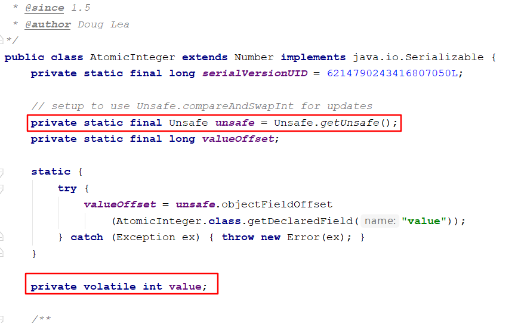

UnSafe是CAS的核心类，由于Java方法无法直接访问底层，需要通过本地（native）方法来访问，UnSafe相当于一个后门，基于该类可以直接操作特定的内存数据。UnSafe在sun.misc包中，其内部方法操作可以像C的指针一样直接操作内存。

**注意UnSafe类中的所有方法都是native修饰的，也就是说UnSafe类中的方法都是直接调用操作底层资源执行响应的任务**

变量valueOffset就是该变量在内存中的**偏移地址**，因为UnSafe就是根据内存偏移地址来获取数据的。

变量vlaue用volatile修饰，保证了多线程之间的可见性

**2、什么是CAS**

CAS的全称就是Compare-And-Swap，**它是一条CPU并发原语**，它的功能是判断内存某个位置的值是否为预期值，如果是则更新为新的值，这个过程是原子的。

CAS并发原语体现在Java语言中就是UnSafe类中的各个方法，调用UnSafe类中的CAS方法，JVM会帮我们实现**CAS汇编指令**，这是一种完全依赖于硬件功能，通过它实现了原子操作，再次强调，由于CAS是一种系统原语，原语属于操作系统用语范畴，用于完成某个功能的一个过程，并且原语的执行必须是连续的，在执行过程中不允许中断，也就是说CAS是一条原子指令，不会造成所谓的数据不一致问题

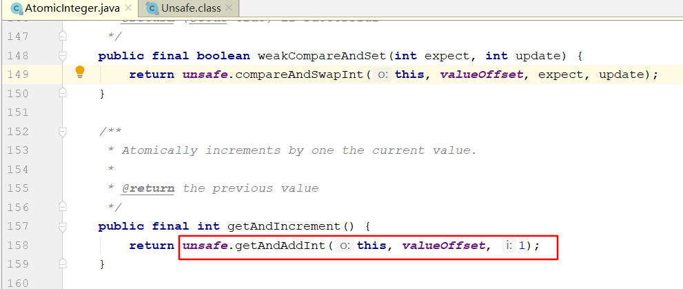

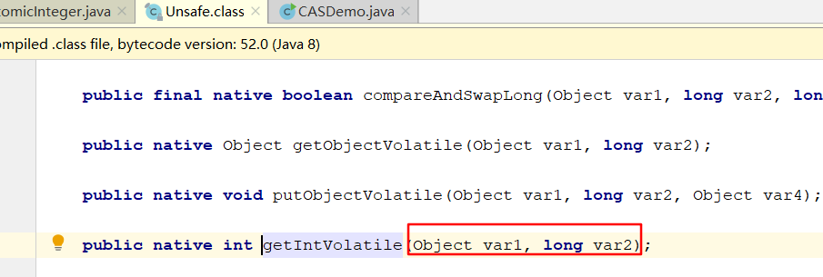

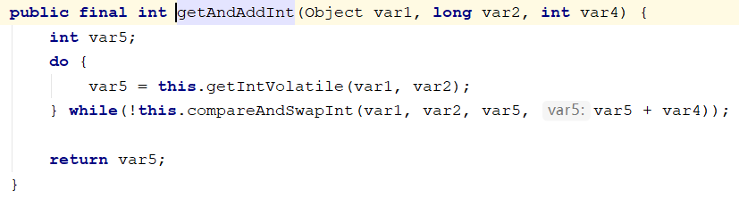

var1 AtomicInteger对象本身.

var2 该对象值的引用地址

var4 需要变动的数值

var5 是用过var1 var2找出内存中绅士的值

用该对象当前的值与var5比较

如果相同,更新var5的值并且返回true；如果不同,继续取值然后比较,直到更新完成

----

假设线程A和线程B两个线程同时执行getAndAddInt操作(分别在不同的CPU上):

1.AtomicInteger里面的value原始值为3,即主内存中AtomicInteger的value为3,根据JMM模型,线程A和线程B各自持有一份值为3的value的副本分别到各自的工作内存.

2.线程A通过getIntVolatile(var1,var2) 拿到value值3,这是线程A被挂起.

3.线程B也通过getIntVolatile(var1,var2) 拿到value值3,此时刚好线程B没有被挂起并执行compareAndSwapInt方法比较内存中的值也是3 成功修改内存的值为4 线程B打完收工 一切OK.

 4.这是线程A恢复,执行compareAndSwapInt方法比较,发现自己手里的数值和内存中的数字4不一致,说明该值已经被其他线程抢先一步修改了,那A线程修改失败,只能重新来一遍了.

 5.线程A重新获取value值,因为变量value是volatile修饰,所以其他线程对他的修改,线程A总是能够看到,线程A继续执行compareAndSwapInt方法进行比较替换,直到成功.


原子整型之所以在i++这种多线程的环境下面，不用加synchronized，就凭借着底层UnSafe类也能保证原子性，来保证线程安全，是因为UnSafe是CAS的核心类，且UnSafe是根据内存偏移地址来获取的。

**3、CAS的缺点**

1. 多次比较循环时间长开销很大：如果CAS失败的话，会一直进行尝试，如果CAS长时间一直不成功，可能会给CPU带来很大的开销
2. 只能保证一个共享变量的原子性：当对一个共享变量执行操作时，我们可以使用循环CAS的方式来保证原子操作，但是对多个共享变量操作时，循环CAS就无法保证操作的原子性，这时候就可以用锁来保证原子性
3. 引出来ABA问题

也就是说，如果使用synchronized进行加锁，一致性得到保证，但是并发性会下降；如果使用CAS，不加锁，能保证一致性，但是它需要多次比较，耗时时间长，开销很大。

## 7.2 ABA问题

**1、ABA问题的产生**

CAS会导致ABA问题，CAS算法实现一个重要前需要取出内存中某个时刻的数据并在当下时刻比较并替换， 那么在这个时间差内会导致数据的变化。

比如说一个线程one从内存位置V中取出A，这时候另一个线程two也从内存位置V中取出A，并且线程two进行了一些操作将值变成了B，然后线程two又将B变成了A，这个时候one进行CAS操作发现内存中仍然是A，然后线程one操作成功

**尽管one的CAS操作成功，但是不代表这个过程就是没有问题的**

**2、原子引用：AtomicReference**

```java
@Getter
@Setter
@AllArgsConstructor
@ToString
class User{
    private String name;
    private int age;
}
public class AtomicReferenceDemo {
    public static void main(String[] args) {
        User zs = new User("zs", 22);
        User ls = new User("ls", 22);
        AtomicReference<User> reference = new AtomicReference<>();
        reference.set(zs);
        System.out.println(reference.compareAndSet(zs, ls)+"\t"+reference.get().toString());
        System.out.println(reference.compareAndSet(zs, ls)+"\t"+reference.get().toString());
    }
}

//结果就是true	user = ls； false	user = ls
```

原子引用的用法其实和AtomicInteger差不多，只是可以自定义CAS操作对象，且这个同样也有ABA问题

**3、时间戳原子引用：AtomicStampedReference**

```java
/**
 * Description: ABA问题的解决
 *
 * @author veliger@163.com
 * @date 2019-04-12 21:30
 **/
public class ABADemo {
    private static AtomicReference<Integer> atomicReference=new AtomicReference<>(100);
    private static AtomicStampedReference<Integer> stampedReference=new AtomicStampedReference<>(100,1);
    public static void main(String[] args) {
        System.out.println("===以下是ABA问题的产生===");
        new Thread(()->{
            atomicReference.compareAndSet(100,101);
            atomicReference.compareAndSet(101,100);
        },"t1").start();

        new Thread(()->{
            //先暂停1秒 保证完成ABA
            try { TimeUnit.SECONDS.sleep(1); } catch (InterruptedException e) { e.printStackTrace(); }
            System.out.println(atomicReference.compareAndSet(100, 2019)+"\t"+atomicReference.get());
        },"t2").start();
        try { TimeUnit.SECONDS.sleep(2); } catch (InterruptedException e) { e.printStackTrace(); }
        System.out.println("===以下是ABA问题的解决===");

        new Thread(()->{
            int stamp = stampedReference.getStamp();
            System.out.println(Thread.currentThread().getName()+"\t 第1次版本号"+stamp+"\t值是"+stampedReference.getReference());
            //暂停1秒钟t3线程
            try { TimeUnit.SECONDS.sleep(1); } catch (InterruptedException e) { e.printStackTrace(); }

            stampedReference.compareAndSet(100,101,stampedReference.getStamp(),stampedReference.getStamp()+1);
            System.out.println(Thread.currentThread().getName()+"\t 第2次版本号"+stampedReference.getStamp()+"\t值是"+stampedReference.getReference());
            stampedReference.compareAndSet(101,100,stampedReference.getStamp(),stampedReference.getStamp()+1);
            System.out.println(Thread.currentThread().getName()+"\t 第3次版本号"+stampedReference.getStamp()+"\t值是"+stampedReference.getReference());
        },"t3").start();

        new Thread(()->{
            int stamp = stampedReference.getStamp();
            System.out.println(Thread.currentThread().getName()+"\t 第1次版本号"+stamp+"\t值是"+stampedReference.getReference());
            //保证线程3完成1次ABA
            try { TimeUnit.SECONDS.sleep(3); } catch (InterruptedException e) { e.printStackTrace(); }
            boolean result = stampedReference.compareAndSet(100, 2019, stamp, stamp + 1);
            System.out.println(Thread.currentThread().getName()+"\t 修改成功否"+result+"\t最新版本号"+stampedReference.getStamp());
            System.out.println("最新的值\t"+stampedReference.getReference());
        },"t4").start();
    }
}
```

这个可以规避掉ABA问题，就是**新增一种机制，那就是增加时间戳，当时间戳跟要比对的时间戳不一致的话，就说明这个数据在中间被修改过**

# 第八章 原子操作类之18罗汉增强

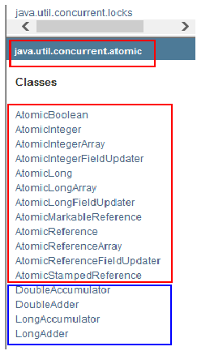

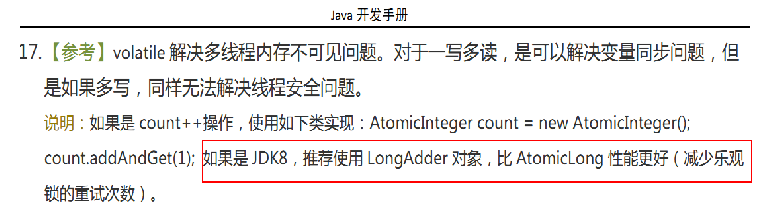

## 8.1 基本类型原子类

AtomicInteger、AtomicBoolean、AtomicLong

常用API简介：

- public final int get() //获取当前的值
- public final int getAndSet(int newValue)//获取当前的值，并设置新的值
- public final int getAndIncrement()//获取当前的值，并自增
- public final int getAndDecrement() //获取当前的值，并自减
- public final int getAndAdd(int delta) //获取当前的值，并加上预期的值
- boolean compareAndSet(int expect, int update) //如果输入的数值等于预期值，则以原子方式将该值设置为输入值（update）

```java
class MyNumber {
    AtomicInteger atomicInteger = new AtomicInteger();
    public void addPlusPlus() {
        atomicInteger.incrementAndGet();
    }
}

public class AtomicIntegerDemo {
    public static final int SIZE = 50;
    
    public static void main(String[] args) {
        MyNumber myNumber = new MyNumber();
        CountDownLatch countDownLatch = new CountDownLatch(SIZE);
        
        for (int i = 1; i <= SIZE; i++) {
            new Thread(() -> {
                try {
                    for (int j = 1; j <= 1000; j++) {
                        myNumber.addPlusPlus();
                    }
                } catch (Exception e) {
                    
                } finally {
                    countDownLatch.countDown();
                }
            }, String.value(i)).start();
        }
        
        countDownLatch.await();
        
        System.out.println(Thread.currentThread().getName() + " -- " myNumberr.atomicInteger.get());
    }
}
```

## 8.2 数组类型原子类

AtomicIntegerArray、AtomicLongArray、AtomicReferenceArray

```java
public static void main(String[] args) {
    AtomicIntegerArray atomicIntegerArray = new AtomicIntegerArray(new int[5]);
    for (int i = 0; i < atomicIntegerArray.length(); i++) {
        System.out.println(atomicIntegerArray.get(i));
    }

    int tmpInt = 0;
    tmpInt = atomicIntegerArray.getAndSet(0,1122);
    System.out.println(tmpInt+"\t"+atomicIntegerArray.get(0));
    atomicIntegerArray.getAndIncrement(1);
    atomicIntegerArray.getAndIncrement(1);
    tmpInt = atomicIntegerArray.getAndIncrement(1);
    System.out.println(tmpInt+"\t"+atomicIntegerArray.get(1));

}
// 结果如下：
/*
0
0
0
0
0

0	1122
2	3
*/
```

## 8.3 引用类型原子类

**1、AtomicReference：**

```java
public static void main(String[] args) {
    User z3 = new User("z3",24);
    User li4 = new User("li4",26);

    AtomicReference<User> ar = new AtomicReference<>();

    ar.set(z3);

    System.out.println(ar.compareAndSet(z3,li4)+"\t"+ar.get().toString());
    System.out.println(ar.compareAndSet(z3,li4)+"\t"+ar.get().toString());
}
```

也可以使用AtomicReference来实现自旋锁：

```java
/**
 * 题目：实现一个自旋锁
 * 自旋锁好处：循环比较获取没有类似wait的阻塞。
 *
 * 通过CAS操作完成自旋锁，A线程先进来调用myLock方法自己持有锁5秒钟，B随后进来后发现
 * 当前有线程持有锁，不是null，所以只能通过自旋等待，直到A释放锁后B随后抢到。
 */
public class SpinLockDemo {
    AtomicReference<Thread> atomicReference = new AtomicReference<>();

    public void myLock() {
        Thread thread = Thread.currentThread();
        System.out.println(Thread.currentThread().getName()+"\t come in");
        while(!atomicReference.compareAndSet(null,thread)) {

        }
    }

    public void myUnLock() {
        Thread thread = Thread.currentThread();
        atomicReference.compareAndSet(thread,null);
        System.out.println(Thread.currentThread().getName()+"\t myUnLock over");
    }

    public static void main(String[] args) {
        SpinLockDemo spinLockDemo = new SpinLockDemo();

        new Thread(() -> {
            spinLockDemo.myLock();
            //暂停一会儿线程
            try { TimeUnit.SECONDS.sleep( 5 ); } catch (InterruptedException e) { e.printStackTrace(); }
            spinLockDemo.myUnLock();
        },"A").start();
        //暂停一会儿线程，保证A线程先于B线程启动并完成
        try { TimeUnit.SECONDS.sleep( 1 ); } catch (InterruptedException e) { e.printStackTrace(); }

        new Thread(() -> {
            spinLockDemo.myLock();
            spinLockDemo.myUnLock();
        },"B").start();

    }
}
```

**2、AtomicStampedReference**

携带版本号的引用类型原子类，可以解决ABA问题，示例代码见第七章ABA问题

**解决修改过几次**

**3、AtomicMarkableReference**

原子更新带有标记位的引用类型对象，它的定义就是将状态戳简化为true|false，类似一次性筷子

**解决是否被修改**

```java
public class AtomicMarkableReferenceDemo {
    static AtomicMarkableReference<Integer> amr = new AtomicMarkableReference<>(100,false);

    public static void main(String[] args) {
        new Thread(() -> {
            boolean marked = amr.isMarked();
            System.out.println(Thread.currentThread().getName()+"\t"+"---默认修改标识："+marked);
            try { TimeUnit.SECONDS.sleep(1); } catch (InterruptedException e) { e.printStackTrace(); }
            amr.compareAndSet(100,101,marked,!marked);
        },"t1").start();

        new Thread(() -> {
            boolean marked = amr.isMarked();
            System.out.println(Thread.currentThread().getName()+"\t"+"---默认修改标识："+marked);
            try { TimeUnit.SECONDS.sleep(2); } catch (InterruptedException e) { e.printStackTrace(); }
            boolean b = amr.compareAndSet(100, 20210308, marked, !marked);

            System.out.println(Thread.currentThread().getName()+"\t"+"---操作是否成功:"+b);
            System.out.println(Thread.currentThread().getName()+"\t"+ amr.getReference());
            System.out.println(Thread.currentThread().getName()+"\t"+ amr.isMarked());

        },"t2").start();
    }
}
```

## 8.4 对象的属性修改原子类

AtomicIntegerFieldUpdater：原子更新对象中int类型字段的值

AtomicLongFieldUpdater：原子更新对象中Long类型字段的值

AtomicReferenceFieldUpdater：原子更新引用类型字段的值

使用目的：**以一种线程安全的方式操作非线程安全对象内的某些字段**

有什么用呢？**一般我们加锁都是锁定整个对象，但是我们使用对象的属性修改原子类，可以减少锁定的范围，只关注长期、敏感性变化的某一个字段，而不是整个对象，已达到精确加锁 + 节约内存的目的；类似医生的微创手术，不用麻痹全身**

**使用要求**：更新的对象属性必须使用 public **volatile** 修饰符。因为对象的属性修改类型原子类都是抽象类，所以每次使用都必须使用**静态方法newUpdater()**创建一个更新器，并且需要设置想要更新的类和属性。

**AtomicIntegerFieldUpdaterDemo**：

```java
class BankAccount {
    String bankName = "ccb";
    
    public volatile int money = 0;
    AtomicIntegerFieldUpdater fieldUpdater = AtomicIntegerFieldUpdater.newUpdater(BankAccount.class, "money");
    
    public void transfer(BankAccount bankAccount) {
        fieldUpdater.incrementAndGet(bankAccount);
    }
}

public class AtomicIntegerFieldUpdaterDemo {
    public static void main(String[] args) throws InterruptedException{
        BankAccount bankAccount = new BankAccount();
        
        for (int i = 1; i <= 1000; i++) {
            new Thread(() -> {
                bankAccount.transfer(bankAccount);
            }, String.valueOf(i)).start();
        }
        
        // 暂停几秒钟线程
        sleep(1);
        
        sout(bankAccount.money);
    }
}
```

**AtomicReferenceFieldUpdaterDemo**

这个同样可以实现单例模式：**多线程并发调用一个类的初始化方法，如果未被初始化过，将执行初始化工作，要求只能初始化一次**

```java
class MyVar {
    public volatile Boolean isInit = Boolean.FALSE;
    AtomicReferenceFieldUpdater<MyVar,Boolean> FieldUpdater = AtomicReferenceFieldUpdater.newUpdater(MyVar.class,Boolean.class,"isInit");

    public void init(MyVar myVar) {
        if(FieldUpdater.compareAndSet(myVar,Boolean.FALSE,Boolean.TRUE)) {
            System.out.println(Thread.currentThread().getName()+"\t"+"---start init");
            try { TimeUnit.SECONDS.sleep(3); } catch (InterruptedException e) { e.printStackTrace(); }
            System.out.println(Thread.currentThread().getName()+"\t"+"---end init");
        }else{
            System.out.println(Thread.currentThread().getName()+"\t"+"---抢夺失败，已经有线程在修改中");
        }
    }
}

/**
 *  多线程并发调用一个类的初始化方法，如果未被初始化过，将执行初始化工作，要求只能初始化一次
 */
public class AtomicReferenceFieldUpdaterDemo {
    public static void main(String[] args) {
        MyVar myVar = new MyVar();

        for (int i = 1; i <=5; i++) {
            new Thread(() -> {
                myVar.init(myVar);
            },String.valueOf(i)).start();
        }
    }
}
```

## 8.5 （重点）原子操作增强类原理深度解析

### **1、基本概念**

DoubleAccumulator、DoubleAdder、LongAccumulator、LongAdder

除了解决第八章开头的volatile多线程下i++不安全的问题，还可以实现以下功能：

1. 热点商品点赞计算器，点赞数加加统计，不要求实时精确
2. 一个很大的List，里面都是int类型，如何实现加加，说说思路

### **2、常用API**

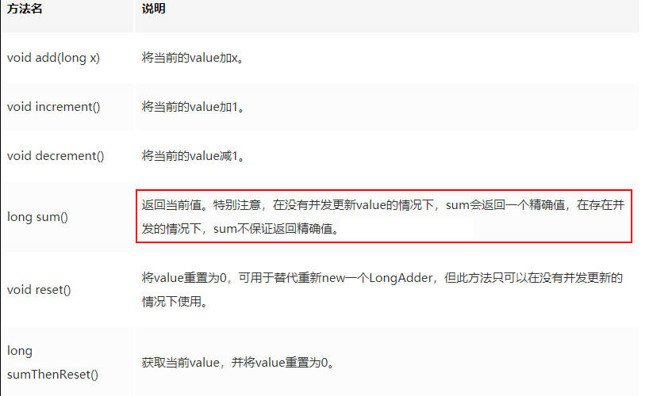

**LongAdder只能用来计算加法，且从零开始计算；**

**LongAccumulator提供了自定义的函数操作**：long类型的聚合器，需要传入一个long类型的二元操作，可以用来计算各种聚合操作，包括加乘等

使用示例如下：

```java
public class LongAdderAPIDemo {
    public static void main(String[] args) {
        LongAdder longAdder = new LongAdder();

        longAdder.increment();
        longAdder.increment();
        longAdder.increment();

        System.out.println(longAdder.longValue());

        LongAccumulator longAccumulator = new LongAccumulator((x,y) -> x * y,2);

        longAccumulator.accumulate(1);
        longAccumulator.accumulate(2);
        longAccumulator.accumulate(3);

        System.out.println(longAccumulator.longValue());
    }
}
```

### **3、LongAdder高性能对比Code演示**

```java
class ClickNumberNet {
    int number = 0;
    public synchronized void clickBySync() {
        number++;
    }

    AtomicLong atomicLong = new AtomicLong(0);
    public void clickByAtomicLong() {
        atomicLong.incrementAndGet();
    }

    LongAdder longAdder = new LongAdder();
    public void clickByLongAdder() {
        longAdder.increment();
    }

    LongAccumulator longAccumulator = new LongAccumulator((x,y) -> x + y,0);
    public void clickByLongAccumulator() {
        longAccumulator.accumulate(1);
    }
}

/**
 * @auther zzyy
 * @create 2020-05-21 22:23
 * 50个线程，每个线程100W次，总点赞数出来
 */
public class LongAdderDemo2 {
    public static void main(String[] args) throws InterruptedException {
        ClickNumberNet clickNumberNet = new ClickNumberNet();

        long startTime;
        long endTime;
        CountDownLatch countDownLatch = new CountDownLatch(50);
        CountDownLatch countDownLatch2 = new CountDownLatch(50);
        CountDownLatch countDownLatch3 = new CountDownLatch(50);
        CountDownLatch countDownLatch4 = new CountDownLatch(50);


        startTime = System.currentTimeMillis();
        for (int i = 1; i <=50; i++) {
            new Thread(() -> {
                try {
                    for (int j = 1; j <=100 * 10000; j++) {
                        clickNumberNet.clickBySync();
                    }
                }finally {
                    countDownLatch.countDown();
                }
            },String.valueOf(i)).start();
        }
        countDownLatch.await();
        endTime = System.currentTimeMillis();
        System.out.println("----costTime: "+(endTime - startTime) +" 毫秒"+"\t clickBySync result: "+clickNumberNet.number);

        startTime = System.currentTimeMillis();
        for (int i = 1; i <=50; i++) {
            new Thread(() -> {
                try {
                    for (int j = 1; j <=100 * 10000; j++) {
                        clickNumberNet.clickByAtomicLong();
                    }
                }finally {
                    countDownLatch2.countDown();
                }
            },String.valueOf(i)).start();
        }
        countDownLatch2.await();
        endTime = System.currentTimeMillis();
        System.out.println("----costTime: "+(endTime - startTime) +" 毫秒"+"\t clickByAtomicLong result: "+clickNumberNet.atomicLong);

        startTime = System.currentTimeMillis();
        for (int i = 1; i <=50; i++) {
            new Thread(() -> {
                try {
                    for (int j = 1; j <=100 * 10000; j++) {
                        clickNumberNet.clickByLongAdder();
                    }
                }finally {
                    countDownLatch3.countDown();
                }
            },String.valueOf(i)).start();
        }
        countDownLatch3.await();
        endTime = System.currentTimeMillis();
        System.out.println("----costTime: "+(endTime - startTime) +" 毫秒"+"\t clickByLongAdder result: "+clickNumberNet.longAdder.sum());

        startTime = System.currentTimeMillis();
        for (int i = 1; i <=50; i++) {
            new Thread(() -> {
                try {
                    for (int j = 1; j <=100 * 10000; j++) {
                        clickNumberNet.clickByLongAccumulator();
                    }
                }finally {
                    countDownLatch4.countDown();
                }
            },String.valueOf(i)).start();
        }
        countDownLatch4.await();
        endTime = System.currentTimeMillis();
        System.out.println("----costTime: "+(endTime - startTime) +" 毫秒"+"\t clickByLongAccumulator result: "+clickNumberNet.longAccumulator.longValue());

    }
}
```

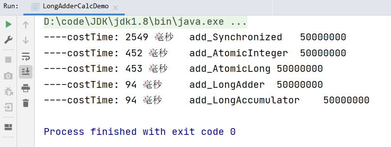

### **4、源码、原理分析**


那么为什么LongAdder这么快呢？

那是因为**LongAdder是Striped64的子类**

Striped64有几个比较重要的成员函数：

```java
/** Number of CPUS, to place bound on table size        CPU数量，即cells数组的最大长度 */
static final int NCPU = Runtime.getRuntime().availableProcessors();

/**
 * Table of cells. When non-null, size is a power of 2.
cells数组，为2的幂，2,4,8,16.....，方便以后位运算
 */
transient volatile Cell[] cells;

/**基础value值，当并发较低时，只累加该值主要用于没有竞争的情况，通过CAS更新。
 * Base value, used mainly when there is no contention, but also as
 * a fallback during table initialization races. Updated via CAS.
 */
transient volatile long base;

/**创建或者扩容Cells数组时使用的自旋锁变量调整单元格大小（扩容），创建单元格时使用的锁。
 * Spinlock (locked via CAS) used when resizing and/or creating Cells. 
 */
transient volatile int cellsBusy;
```

#### **Striped64中一些变量或者方法的定义**

- base：类似于AtomicLong中全局的value值。在没有竞争情况下数据直接累加到base上，或者cells扩容时，也需要将数据写入到base上。
- collide：表示扩容意向，false一定不会扩容，true可能会扩容。
- cellsBusy：初始化cells或者扩容cells需要获取锁，0表示无锁状态，1表示其他线程已经持有了锁。
- casCellsBusy（）：通过CAS操作修改cellsBusy的值，CAS成功代表获取锁，返回true
- NCPU：当前计算机CPU的数量，Cell数组扩容时会用到
- getProbe()：获取当前线程的hash值
- advanceProbe（）：重置当前线程的hash值

而所谓的Cell类，其实就是**是 java.util.concurrent.atomic 下 Striped64 的一个内部类**

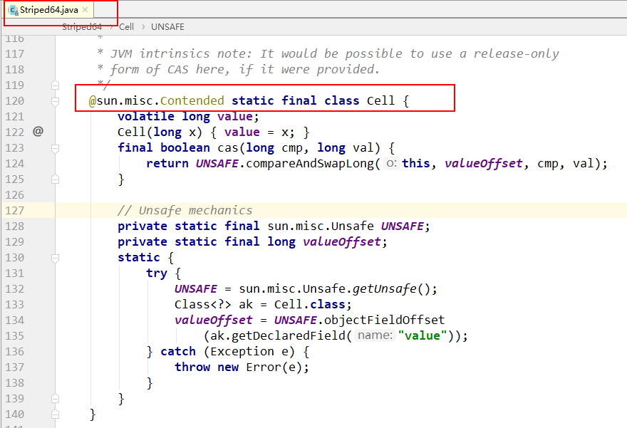

LongAdder的基本思路就是**分散热点**，将value值分散到一个**Cell数组**中，不同线程会命中到数组的不同槽中，各个线程只对自己槽中的那个值进行CAS操作，这样热点就被分散了，冲突的概率就小很多。如果要获取真正的long值，只需将各个槽中的变量值累加返回。

sum()会将所有Cell数组中的value和base累加作为返回值，核心的思想就是将之前AtomicLong一个value的更新压力分散到更多个value中去，**从而降级更新热点**

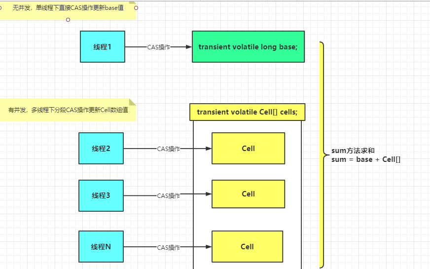

内部有一个base变量，一个Cell数组

base变量：非竞争条件下，直接累加到该变量上

cell数组：竞争条件下，累加到各个线程自己的槽Cell[i]中。


LongAdder在无竞争的情况，跟AtomicLong一样，对同一个base进行操作，当出现竞争关系时则是采用化整为零的做法，从空间换时间，用一个数组cells，将一个value拆分进这个数组cells。多个线程需要同时对value进行操作时候，可以对线程id进行hash得到hash值，再根据hash值映射到这个数组cells的某个下标，再对该下标所对应的值进行自增操作。当所有线程操作完毕，将数组cells的所有值和无竞争值base都加起来作为最终结果。

```java
public void increment() {
    add(1L);
}
```

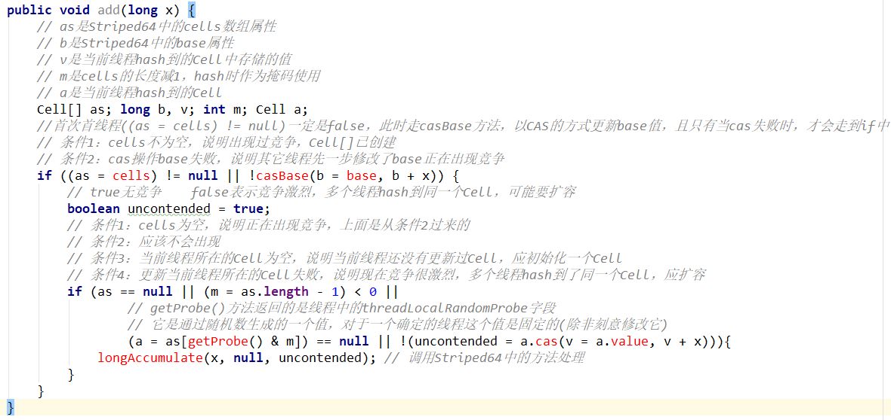

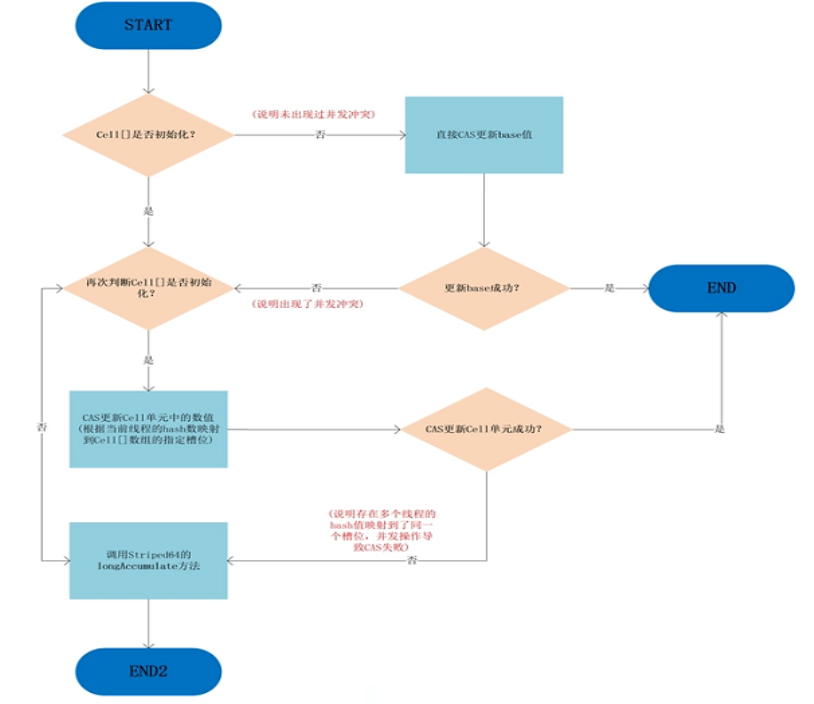

1. 最初无竞争时只更新base
2. 如果更新base失败后，首次新建一个Cell[]数组
3. 当多个线程竞争同一个Cell比较激烈时，可能就要对Cell[]扩容

#### **longAccumulate方法**

- long x ：需要增加的值，一般默认都是1
- LongBinrayOperator fn ：默认传递的是null
- wasUncontended竞争标识，如果是false则代表有竞争。只有cells初始化之后，并且当前线程CAS竞争修改失败，才会是false。


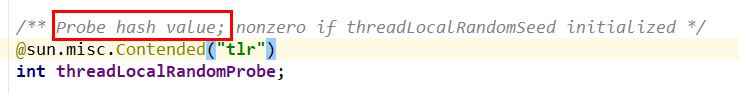

**接下来看总纲**


上述代码首先给当前线程分配一个hash值，然后进入一个for(;;)自旋，这个自旋分为三个分支：

- CASE1：Cell[]数组已经初始化
- CASE2：Cell[]数组未初始化(首次新建)
- CASE3：Cell[]数组正在初始化中

接下来分开看：

**1、刚刚要初始化Cell[]数组(首次新建)：**

未初始化过Cell[]数组，尝试占有锁并首次初始化cells数组


如果上面条件都执行成功就会执行数组的初始化及赋值操作， Cell[] rs = new Cell[2]表示数组的长度为2，rs[h & 1] = new Cell(x) 表示创建一个新的Cell元素，value是x值，默认为1。h & 1类似于我们之前HashMap常用到的计算散列桶index的算法，通常都是hash & (table.len - 1)。同hashmap一个意思。

**2、兜底**

多个线程尝试CAS修改失败的线程会走到这个分支


该分支实现直接操作base基数，将值累加到base上，也即其它线程正在初始化，多个线程正在更新base的值。

**3、Cell数组不再为空且可能存在Cell数组扩容**

多个线程同时命中一个cell的竞争

总体代码如下：

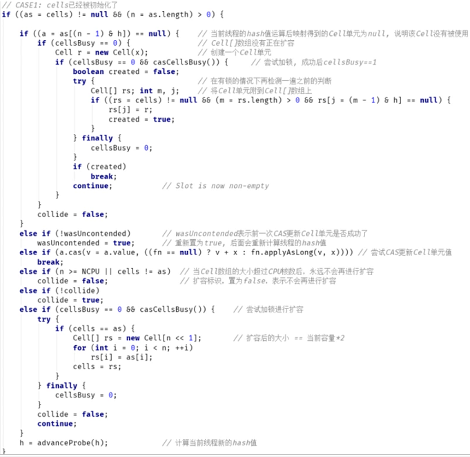

**3.1**


上面代码判断当前线程hash后指向的数据位置元素是否为空，如果为空则将Cell数据放入数组中，跳出循环。如果不空则继续循环。

**3.2**

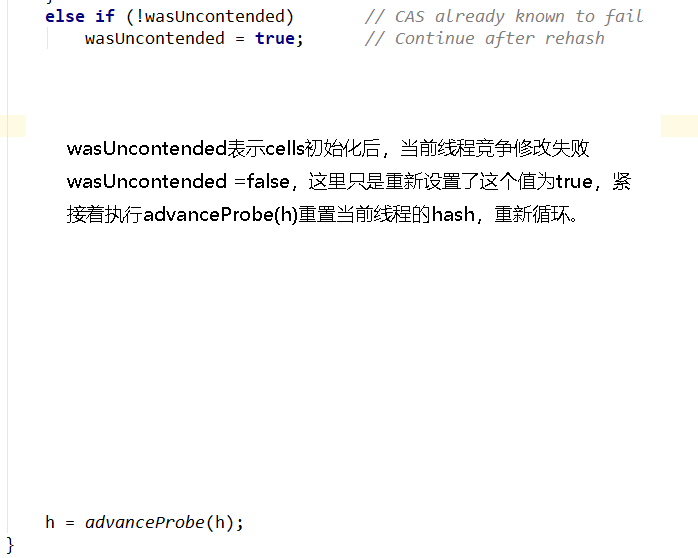

**3.3**


说明当前线程对应的数组中有了数据，也重置过hash值，这时通过CAS操作尝试对当前数中的value值进行累加x操作，x默认为1，如果CAS成功则直接跳出循环。


**3.4**

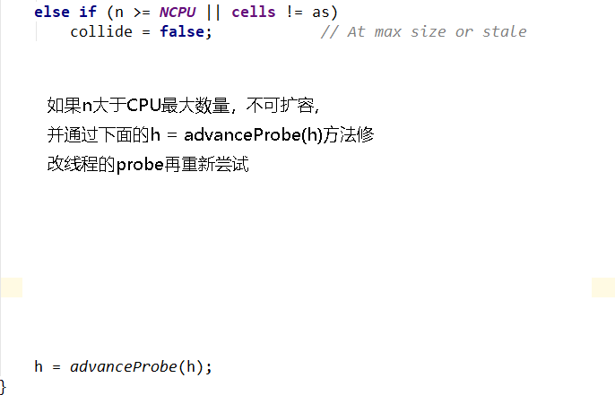

**3.5**


**3.6**

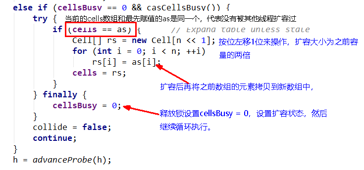

**上述六部总结如下**


#### **sum方法**

sum()会将所有Cell数组中的value和base累加作为返回值。核心的思想就是将之前AtomicLong一个value的更新压力分散到多个value中去，从而降级更新热点。

**sum执行时，并没有限制对base和cells的更新(一句要命的话)。所以LongAdder不是强一致性的，它是最终一致性的。**

首先，最终返回的sum局部变量，初始被复制为base，而最终返回时，很可能base已经被更新了，而此时局部变量sum不会更新，造成不一致。

其次，这里对cell的读取也无法保证是最后一次写入的值。所以，sum方法在没有并发的情况下，可以获得正确的结果。


### 5、使用总结

- AtomicLong
  - 线程安全，可允许一些性能损耗，要求高精度时可使用
  - 保证精度，性能代价
  - AtomicLong是多个线程针对单个热点值value进行原子操作
- LongAdder
  - 当需要在高并发下有较好的性能表现，且对值的精确度要求不高时，可以使用
  - 保证性能，精度代价
  - LongAdder是每个线程拥有自己的槽，各个线程一般只对自己槽中的那个值进行CAS操作

## 8.6 小总结

**AtomicLong：**

原理：CAS + 自旋、incrementAndGet

场景：低并发下的全局计算；AtomicLong能保证并发情况下计数的准确性，其内部通过CAS来解决并发安全性问题。

缺陷：高并发后性能急剧下降，这是因为AtomicLong的自旋造成瓶颈

N个线程CAS操作修改线程的值，每次只有一个成功过，其它N - 1失败，失败的不停的自旋直到成功，这样大量失败自旋的情况，一下子cpu就打高了。

**LongAdder VS Atomic Long Performance**

http://blog.palominolabs.com/2014/02/10/java-8-performance-improvements-longadder-vs-atomiclong/

**LongAdder**

原理：CAS + Base + Cell数组分散；空间换时间并分散了热点数据

场景：高并发下的全局计算

缺陷：sum求和后还有计算线程修改结果的话，最后结果不够准确

# 第九章 ThreadLocal

## 9.1 ThreadLocal简介

**1、面试题**：

- ThreadLocal中ThreadLocalMap的数据结构和关系？
- ThreadLocal的key是弱引用，这是为什么？
- ThreadLocal内存泄漏问题你知道吗？
- ThreadLocal中最后为什么要加remove方法？

**2、是什么？**

> This class provides thread-local variables. These variables differ from their normal counterparts in that each thread that accesses one (via its get or set method) has its own, independently initialized copy of the variable. ThreadLocal instances are typically private static fields in classes that wish to associate state with a thread (e.g., a user ID or Transaction ID).

ThreadLocal提供线程局部变量。这些变量与正常的变量不同，因为每一个线程在访问ThreadLocal实例的时候（通过其get或set方法）**都有自己的、独立初始化的变量副本**，ThreadLocal实例通常是类中的**私有静态字段**，使用它的目的是希望将状态（例如，用户ID或事物ID）与线程关联起来。

**3、能干嘛**

实现**每个线程都有自己专属的本地变量副本**（自己用自己的变量，不麻烦别人，不和其他人共享，人人有份，人各一份）

主要解决了让每个线程绑定自己的值，通过使用get和set方法，获取默认值或将其值更改为当前线程所存的副本的值从而避免了线程安全问题。

**4、API介绍**

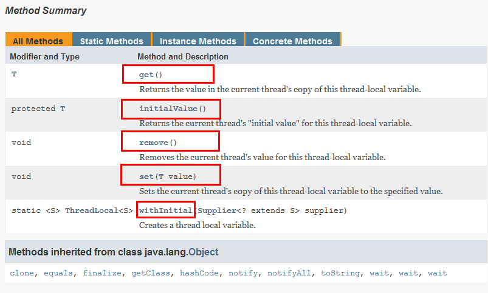

**5、小案例**

比如某找房软件，每个中介销售都有自己的销售额指标，自己专属自己的，不和别人掺和。

```java
class House {
    ThreadLocal<Integer> threadLocal = ThreadLocal.withInitial(() -> 0);

    public void saleHouse() {
        Integer value = threadLocal.get();
        value++;
        threadLocal.set(value);
    }

    main() {
        House house = new House();

        new Thread(() -> {
            try {
                for (int i = 1; i <= 3; i++) {
                    house.saleHouse();
                }
                sout(Thread.currentThread().getName() + " --- " + house.threadLocal.get());
            } finally {
                // 如果不清理自定义的ThreadLocal变量，可能会影响后续业务逻辑和造成内存泄漏问题
                house.threadLocal.remove();
            }
        }, "t1").start();

        new Thread(() -> {
            try {
                for (int i = 1; i <= 2; i++) {
                    house.saleHouse();
                }
                sout(Thread.currentThread().getName() + " --- " + house.threadLocal.get());
            } finally {
                // 如果不清理自定义的ThreadLocal变量，可能会影响后续业务逻辑和造成内存泄漏问题
                house.threadLocal.remove();
            }
        }, "t2").start();

        new Thread(() -> {
            try {
                for (int i = 1; i <= 5; i++) {
                    house.saleHouse();
                }
                sout(Thread.currentThread().getName() + " --- " + house.threadLocal.get());
            } finally {
                // 如果不清理自定义的ThreadLocal变量，可能会影响后续业务逻辑和造成内存泄漏问题
                house.threadLocal.remove();
            }
        }, "t3").start();

        sout(Thread.currentThread().getName() + " --- " + house.threadLocal.get());
    }
}
```

结果如下：

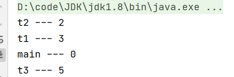

可以看到，每个线程都有自己的threadlocal。

**6、小总结**

因为每个Thread内有自己的实例副本且该副本只由当前线程自己使用，既然其他Thread不可访问，那就不存在多线程间共享的问题。统一设置初始值，但是每个线程对这个值的修改都是各自线程相互独立的。

如何才能不争抢？

- 加入synchronized或者Lock控制资源的访问顺序
- 人手一份，大家各自安好，没必要抢夺。

**7、使用细节**

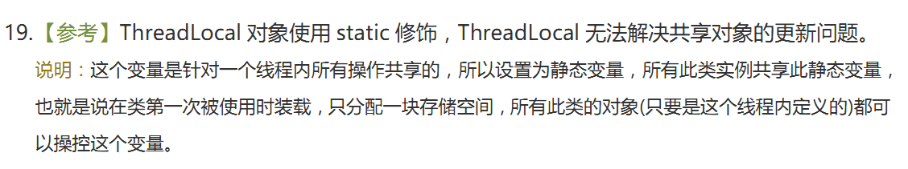

## 9.2 SimpleDateFormat问题

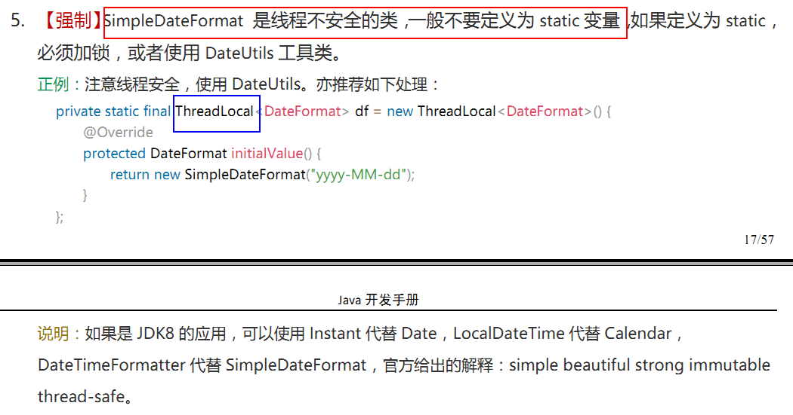

非线程安全的SimpleDateFormat：官方文档里面说，**SimpleDateFormat中的日期格式不是同步的。推荐（建议）为每个线程创建独立的格式实例。如果多个线程同时访问一个格式，则它必须保持外部同步。**

写时间工具类，一般写成**静态的成员变量**，不知，此种写法的多线程下的危险性！

示例如下：

```java
public class DateUtils {
	// 模拟并发环境下使用SimpleDateFormat的parse方法将字符串转换成Date对象
    public static final SimpleDateFormat SIMPLE_DATE_FORMAT = new SimpleDateFormat("yyyy-MM-dd HH:mm:ss");

    public static Date parseDate(String stringDate) throws Exception {
        return SIMPLE_DATE_FORMAT.parse(stringDate);
    }

    public static void main(String[] args) {
        for (int i = 1; i <= 30; i++) {
            new Thread(() -> {
                try {
                    System.out.println(DateUtils.parseDate("2022-02-04 17:20:45"));
                } catch (Exception e) {
                    e.printStackTrace();
                }
            }, String.valueOf(i)).start();
        }
    }
}
```

多线程下，产生的bugs如下：

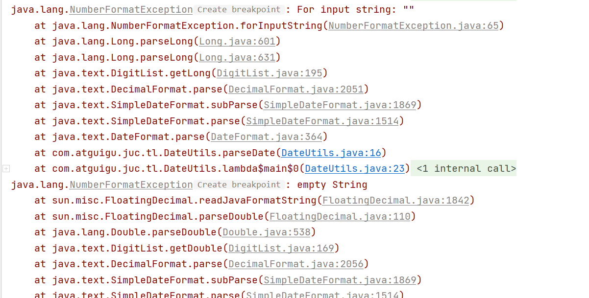

SimpleDateFormat类内部有一个Calendar对象引用，它用来存储和这个SimpleDateFormat相关的日期信息，例如：sdf.parse、sdf.format，诸如此类的方法参数传入的日期相关String，Date等等，都是交由Calendar引用来存储的，这样会导致一个问题，**如果你的SimpleDateFormat是一个static的，那么多个thread之间就会共享这个SimpleDateFormat，同时也是共享这个Calendar引用**

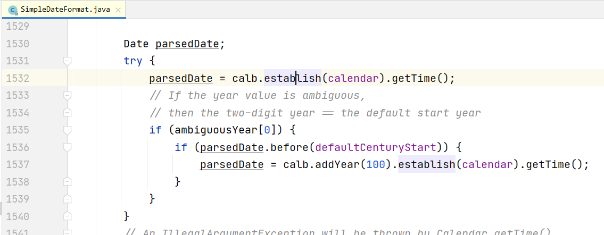

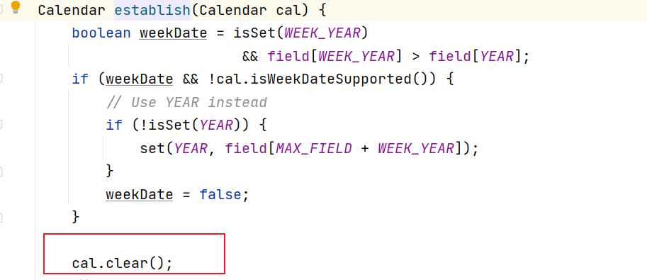

解决办法：

1. 将SimpleDateFormat定义为局部变量。但是每调用一次方法就会创建一个SimpleDateFormat对象，方法结束又要作为垃圾回收。

   ```java
   public static void main(String[] args) throws Exception {
       for (int i = 1; i <=30; i++) {
           new Thread(() -> {
               try {
                   SimpleDateFormat sdf = new SimpleDateFormat("yyyy-MM-dd HH:mm:ss");
                   System.out.println(sdf.parse("2020-11-11 11:11:11"));
                   sdf = null;
               } catch (Exception e) {
                   e.printStackTrace();
               }
           },String.valueOf(i)).start();
       }
   }
   ```

2. 使用ThreadLocal

   ```java
   public class DateUtils {
       private static final ThreadLocal<SimpleDateFormat>  sdf_threadLocal =
           ThreadLocal.withInitial(()-> new SimpleDateFormat("yyyy-MM-dd HH:mm:ss"));
   
       /**
   * ThreadLocal可以确保每个线程都可以得到各自单独的一个SimpleDateFormat的对象，那么自然也就不存在竞争问题了。
   */
       public static Date parseDateTL(String stringDate)throws Exception {
           return sdf_threadLocal.get().parse(stringDate);
       }
   
       public static void main(String[] args) throws Exception {
           for (int i = 1; i <=30; i++) {
               new Thread(() -> {
                   try {
                       System.out.println(DateUtils.parseDateTL("2020-11-11 11:11:11"));
                   } catch (Exception e) {
                       e.printStackTrace();
                   }
               },String.valueOf(i)).start();
           }
       }
   }
   ```

3. 加锁或者第三方时间库

4. 使用DateTimeFormatter

   ```java
   //3 DateTimeFormatter 代替 SimpleDateFormat
   public static final DateTimeFormatter DATE_TIME_FORMAT = DateTimeFormatter.ofPattern("yyyy-MM-dd HH:mm:ss");
   
   public static String format(LocalDateTime localDateTime) {
       return DATE_TIME_FORMAT.format(localDateTime);
   }
   
   public static LocalDateTime parse(String dateString) {
       return LocalDateTime.parse(dateString,DATE_TIME_FORMAT);
   }
   ```

## 9.3 源码分析

首先在Thread.Java中，可以再次体会，各自线程，人手一份。

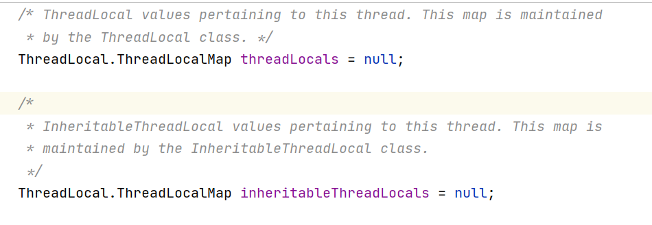

而在ThreadLocal.Java中，拥有内部类ThreadLocalMap.Java

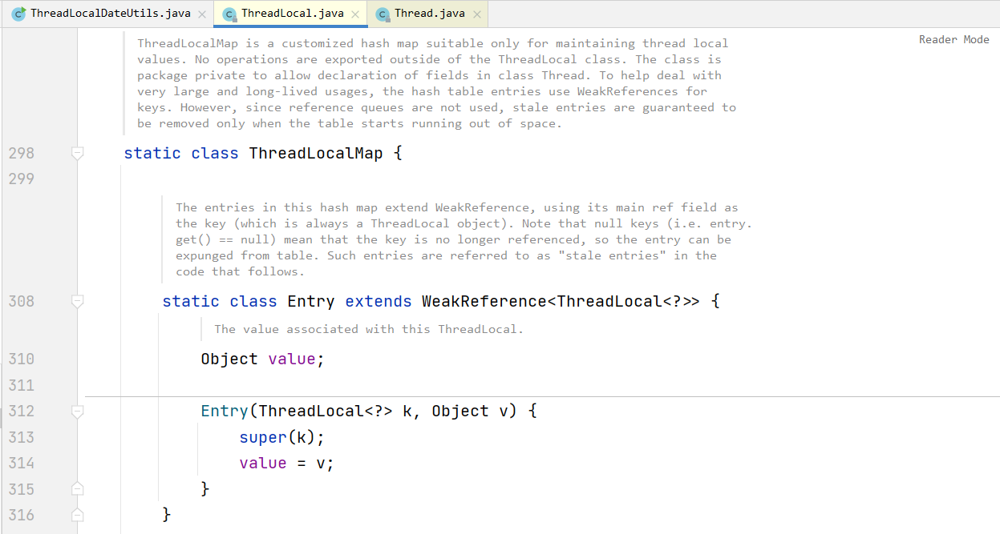

总的来说：

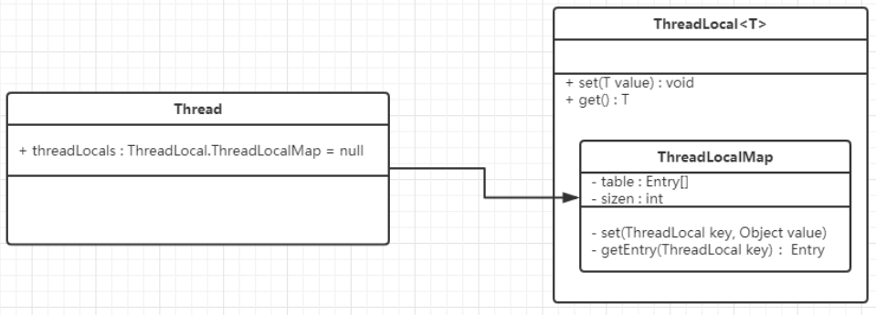

threadLocalMap实际上就是一个以threadLocal实例为key，任意对象为value的Entry对象。

当我们为threadLocal变量赋值，实际上就是以当前threadLocal实例为key，值为value的Entry往这个threadLocalMap中存放。

近似的可以理解为：

ThreadLocalMap从字面上就可以看出这是有一个保存ThreadLocal对象的map（实际上是以ThreadLocal为key），不过是经过了两层包装的ThreadLocal对象。

**JVM内部维护了一个线程版的Map<Thread, T>**(通过ThreadLocal对象的set方法，结果把ThreadLocal对象自己当作key，放进了ThreadLocalMap中)，每个线程要用到这个T的时候，用当前的线程去Map里面获取，**通过这样让每个线程都拥有了自己独立的变量**。

人手一份，竞争条件被彻底消除，在并发模式下是绝对安全的变量。

首先看ThreadLocal的set方法：

```java
public void set(T value) {
    Thread t = Thread.currentThread();
    ThreadLocalMap map = getMap(t); // getMap方法其实就是return t.threadLocals;
    if (map != null)
        map.set(this, value);
    else
        createMap(t, value);
}
```

也再次验证了，往ThreadLocal里面添加数据，其实是往该线程内部的threadLocalMap中添加。

## 9.4 内存泄漏问题

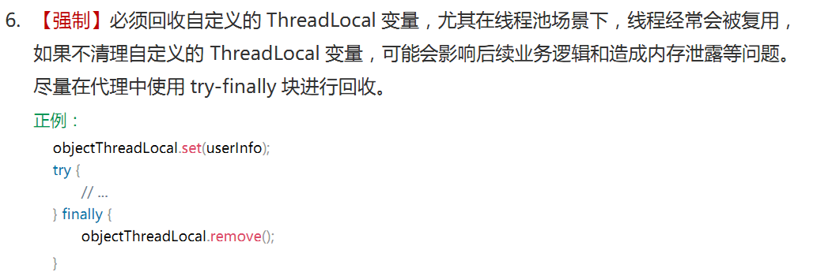

不再会被使用的对象或者变量占用的内存不能被回收，就是内存泄露。

那为什么ThreadLocal容易造成内存泄漏呢？

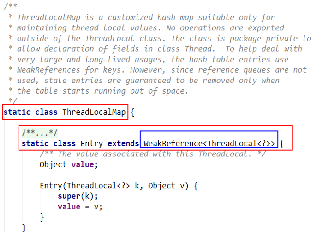

ThreadLocalMap从字面上就可以看出这是一个保存ThreadLocal对象的Map（其实是以他为key），不过是经过了两层包装的ThreadLocal对象。

1. 第一层是使用WeakReference<ThreadLocal<?>>将ThreadLocal对象变成一个**弱引用对象**
2. 第二层是定义了一个专门的类Entry来扩展WeakReference<ThreadLocal<?>>

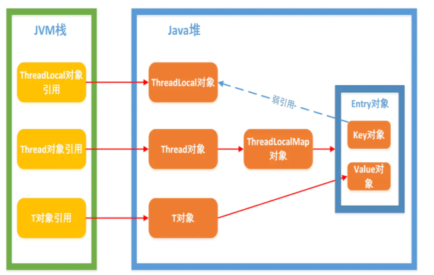

那么为什么ThreadLocal内部要使用弱引用呢？

```java
public void function01() {
    ThreadLocal tl = new ThreadLocal<Integer>();    //line1
    tl.set(2021);                                   //line2
    tl.get();                                       //line3
}
```

- line1新建了一个ThreadLocal对象，t1 是强引用指向这个对象；
- line2调用set()方法后新建一个Entry，通过源码可知Entry对象里的k是弱引用指向这个对象。

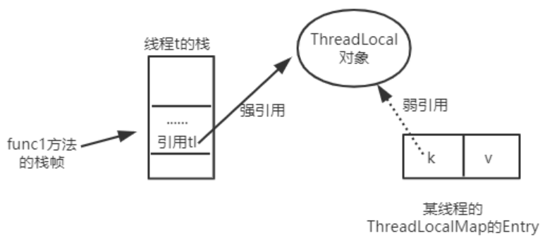

当function01方法执行完毕之后，栈帧销毁强引用tl也就没有了。但是此时线程的ThreadLocalMap里某个entry的key引用还指向这个对象。

- 如果这个key是**强引用**，就会导致key指向的ThreadLocal对象及v指向的对象不能被gc回收，造成内存泄漏。
- 如果这个key是**弱引用**，就会**大概率**减少内存泄漏的问题（**还有一个key为null的雷**）。使用弱引用，就可以使ThreadLocal在方法执行完毕后顺利被回收且Entry的**key引用指向null**。

**此后我们调用get,set或remove方法时，就会尝试删除key为null的entry，可以释放value对象所占用的内存。**

1. 当我们为threadLocal变量赋值，实际上就是当前的Entry（ThreadLocal实例为key，值为value）往这个threadLocalMap中存放。Entry中的key是弱引用，当threadLocal外部强引用被置为null（tl = null），那么系统GC的时候，根据可达性分析，这个threadLocal实例就没有任何一条链路能够引用到它，这个ThreadLocal势必会被回收，这样以来，**ThreadLocalMap中就会出现key为null的Entry，就没有办法访问这些key为null的Entry的value，如果当前线程再迟迟不结束的话，这些key为null的Entry的value就会一直存在一条强引用链：Thread Ref → Thread → ThreadLocalMap → Entry → value 永远无法回收，造成内存泄漏。**
2. 当然，如果当前thread运行结束，threadLocal，threadLocalMap，Entry没有引用链可达，在垃圾回收的时候都会被系统进行回收。
3. 但是实际使用中我们有时会使用线程池去维护我们的线程，比如在Executors.newFixedThreadPool()时创建线程的时候，为了复用线程是不会结束的，所以threadLocal内存泄漏就值得我们小心。

虽然弱引用，保证了key指向的ThreadLocal对象能被及时回收，但是v指向的value对象是需要ThreadLocalMap调用get、set时发现key为null时才会去回收整个entry、value，**因此弱引用不能100%保证内存不泄露。我们需要在不使用某个ThreadLocal对象后，手动调用remove方法来删除它**，尤其是在线程池中，不仅仅是内存泄漏的问题，因为线程池中的线程是重复使用的，意味着这个线程的ThreadLocalMap对象也是重复使用的，如果我们不手动调用remove方法，那么后面的线程就有可能获取到上个线程遗留下来的value值，造成bug。

**而在set、getEntry、remove方法里面，在threadLocal的生命周期里，针对threadLocal存在的内存泄漏等等问题，都会通过expungeStaleEnty、cleanSomSlots、replaceStaleEntry这三个方法清理掉key为null的脏entry。**

## 9.5 小总结

1. ThreadLocal并不解决线程间共享数据的问题
2. ThreadLocal适用于变量在线程间隔离且在方法间共享的场景
3. ThreadLocal通过隐式的在不同线程内创建独立实例副本避免了实例线程安全的问题
4. 每个线程持有一个只属于自己的专属Map并维护了ThreadLocal对象与具体实例的映射，该Map由于只被持有它的线程访问，故不存在线程安全及锁的问题
5. ThreadLocalMap的Entry对ThreadLocal的引用为弱引用，避免了ThreadLocal对象无法被回收的问题
6. 都会通过那三个回收方法回收键为null的Entry对象的值（即为具体实例）以及Entry对象本身从而防止内存泄漏，属于安全加固的方法

# 第十章 Java对象内存布局和对象头

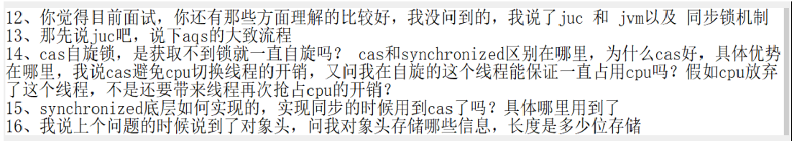

Object object = new Object()，谈谈你对这句话的理解？一般而言，JDK8按照默认情况下，new一个对象占多少内存空间？

## 10.1 对象在堆内存中的存储布局

**在HotSpot虚拟机里，对象在堆内存中的存储布局可以划分为三个部分：对象头、实际数据、对齐填充**


### 10.1.1 对象头

**对象头包含对象标记（Mark Word）和类元信息（又叫类型指针）**


**1、对象标记：**

| 存储内容                             | 标志位 | 状态               |
| ------------------------------------ | ------ | ------------------ |
| 对象哈希码、对象分代年龄             | 01     | 未锁定             |
| 指向锁记录的指针                     | 00     | 轻量级锁定         |
| 指向重量级锁的指针                   | 10     | 膨胀（重量级锁定） |
| 空，不需要记录信息                   | 11     | GC标记             |
| 偏向线程ID、偏向时间戳、对象分代年龄 | 01     | 可偏向             |

在64位系统中，MarkWord占了8个字节，类型指针占了8个字节，一共是16个字节。

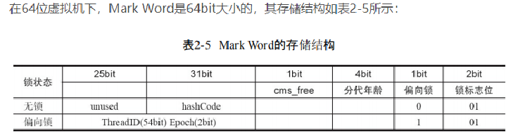

- 默认存储对象的HashCode、分代年龄和锁标志位等信息。
- 这些信息都是与对象自身定义无关的数据，所以MarkWord被设计成一个非固定的数据结构以便在极小的空间内存存储尽量多的数据。
- 它会根据对象的状态复用自己的存储空间，也就是说在运行期间MarkWord里存储的数据会随着锁标志位的变化而变化。

**2、类元信息（类型指针）**

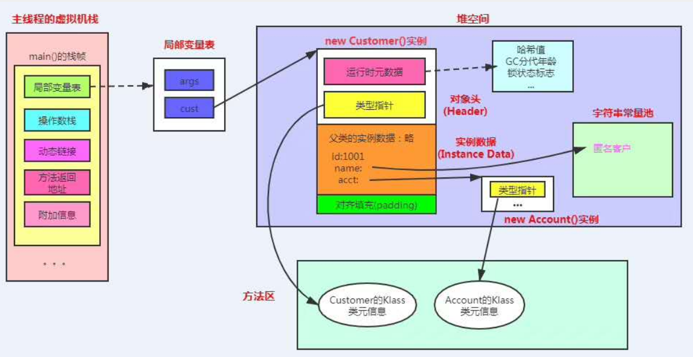

对象指向它的类元数据的指针，虚拟机通过这个指针来确定这个对象是哪个类的实例。

### 10.1.2 实例数据

存放类的属性（Field）数据信息，包括父类的属性信息，如果是数组的实例部分还包括数组的长度，这部分内存按4字节对齐。

### 10.1.3 对齐填充

虚拟机要求对象起始地址必须是8字节的整数倍。填充数据不是必须存在的，仅仅只是为了字节对齐，这部分内存按8字节补充对齐。

## 10.2 再说对象头的MarkWord


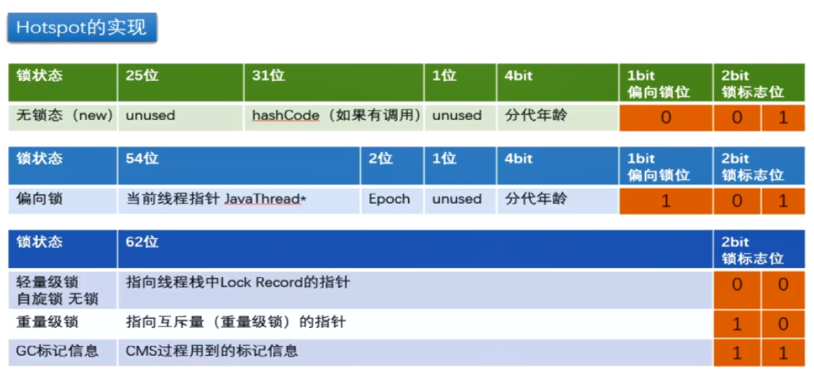


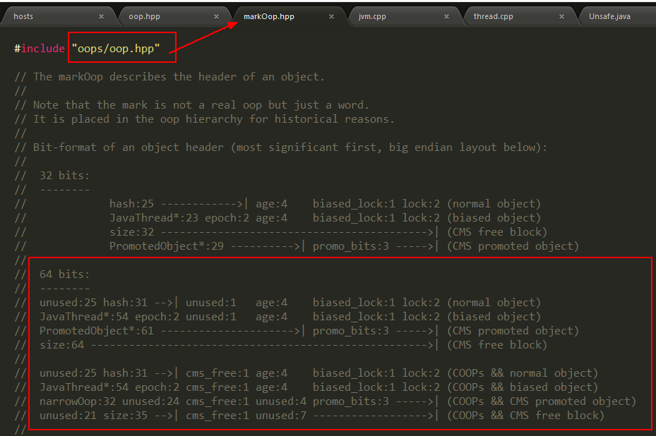

- hash：保存对象的哈希码
- age：保存对象的分代年龄
- biased_lock：偏向锁标识位
- lock：锁状态标识位
- JavaThread*：保存持有偏向锁的线程ID
- epoch：保存偏向时间戳

**对象布局、GC回收和后面的锁升级就是对象标记MarkWord里面标志位的变化**

## 10.3 聊聊Object obj = new Object()

http://openjdk.java.net/projects/code-tools/jol/

```xml
<!--
官网：http://openjdk.java.net/projects/code-tools/jol/
定位：分析对象在JVM的大小和分布
-->
<dependency>
    <groupId>org.openjdk.jol</groupId>
    <artifactId>jol-core</artifactId>
    <version>0.9</version>
</dependency>
```

示例代码如下所示：

```java
public static void main(String[] args) {
    Object object = new Object();

    //引入了JOL，直接使用
    System.out.println(ClassLayout.parseInstance(object).toPrintable());
}
```

结果如下：


其中MarkWord8个字节，类型指针4个字节

| 名称        | 含义                                     |
| ----------- | ---------------------------------------- |
| OFFSET      | 偏移量，也就是这个字段位置所占用的byte数 |
| SIZE        | 后面类型的字节大小                       |
| TYPE        | 是Class中定义的类型                      |
| DESCRIPTION | 类型的描述                               |
| VALUE       | TYPE在内存中的值                         |

注意到上述的类型指针只有4个字节，但是我们之前说类型指针应该是8个才对，这是因为**JVM默认开启了类型指针的压缩，来节省空间**

使用`-XX:-UseCompressedClassPointers`来关闭默认开启的类型指针压缩

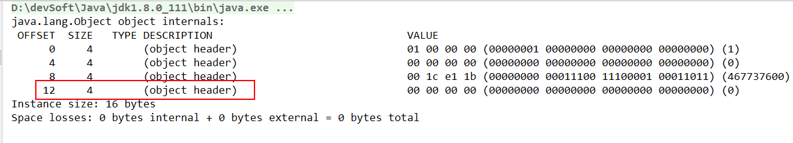

如果换成其他的对象：

```java
public class ObjectHeadDemo {
    public static void main(String[] args) {
        System.out.println(ClassLayout.parseInstance(new O()).toPrintable());
    }
}

class O {
    private boolean flag;
    private int j;
    private double d;
}
```

结果如下：


# 第十一章 Synchronized与锁升级

## 11.1 锁升级基本概念

面试题：

1. 谈谈你对Synchronized的理解
2. Synchronized的锁升级你聊聊
3. Synchronized的性能是不是一定弱于Lock

用锁能够实现数据的安全性，但是会带来性能下降。

无锁能够基于线程并行提升程序性能，但是会带来安全性下降。


synchronized锁：由对象头中的Mark Word根据锁标志位的不同而被复用及锁升级策略

在Java5之前，只有Synchronized，这个是操作系统级别的重量级操作。**重量级锁**，假如锁的竞争比较激烈的话，性能下降。Java5之前，用户态和内核态之间的切换。

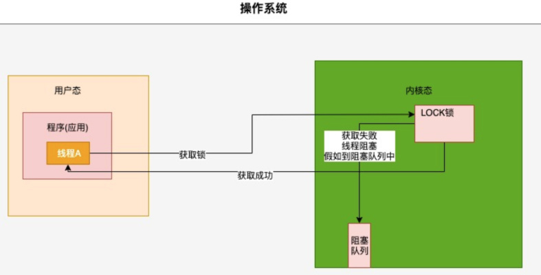

Java的线程是映射到操作系统原生线程之上的。如果要阻塞或唤醒一个线程就需要操作系统介入，需要用户态和核心态之间切换，这种切换会消耗大量的系统资源，因为用户态与内核态都有各自专用的内存空间，专用的寄存器等，用户态切换至内核态需要传递给许多变量、参数给内核，内核也需要保护好用户态在切换时的一些寄存器值、变量等，以便内核态调用结束后切换回用户态继续工作。

在Java早期版本中，**Synchronized属于重量级锁，效率低下，因为监视器锁（monitor）是依赖于底层的操作系统的Mutex Lock来实现的**，挂起线程和恢复线程都需要转入内核态去完成，阻塞或唤醒一个Java线程需要操作系统切换CPU状态来完成，这种状态切换需要耗费处理器时间，如果同步代码块中内容过于简单，这种切换的时间可能比用户代码执行的时间还长，时间成本相对较高，这也是为什么早期的synchronized效率低的原因。

**Java6之后，为了减少获得锁和释放锁所带来的性能消耗，引入了轻量级锁和偏向锁。**

**Monitor与Java对象以及线程是如何关联的？**

- 如果一个Java对象被某个线程锁住，则该Java对象的MarkWord字段中LockWord指向monitor的起始地址
- Monitor的Owner字段会存放拥有相关联对象锁的线程id

Motex Lock的切换需要从用户态转换到核心态，因此状态转换需要耗费很多的处理器时间。

**三种多线程访问情况：**

- 只有一个线程来访问
- 有两个线程AB交替访问
- 竞争激烈，多个线程来访问

**升级流程：synchronized用的锁是存在Java对象头里的MarkWord中，锁升级功能主要依赖MarkWord中锁标志位和释放偏向锁标志位**

## 11.2 无锁

```java
public class MyObject {
    public static void main(String[] args) {
        Object o = new Object();

        System.out.println("10进制hash码："+o.hashCode());
        System.out.println("16进制hash码："+Integer.toHexString(o.hashCode()));
        System.out.println("2进制hash码："+Integer.toBinaryString(o.hashCode()));

        System.out.println( ClassLayout.parseInstance(o).toPrintable());
    }
}
```


## 11.3 偏向锁

**当一段同步代码一直被同一个线程多次访问，由于只有一个线程那么该线程在后续访问时便会自动获得锁**

HotSpot的作者经过研究发现，大多数情况下：多线程的情况下，锁不仅不存在多线程竞争，还存在锁由同一线程多次获得的情况。**偏向锁就是在这种情况下出现的，它的出现是为了解决只有在一个线程执行同步时提高性能。**


通过CAS来修改MarkWord中的线程ID

**理论落地：**

在实际运行过程中发现，“锁总是同一个线程持有，很少发生竞争”，也就是说**锁总是被第一个占有他的线程持有，这个线程就是锁的偏向线程**

那么只需要在锁的第一次被拥有的时候，记录下偏向线程ID。这样偏向线程就一直持有着锁（后续这个线程进入和退出这段加了同步锁的代码块时，**不需要再次加锁和释放锁**。而是直接比较对象头里面是否存储了指向当前线程的偏向锁。

如果相等表示偏向锁时偏向于当前线程的，就不需要再次尝试获得锁了，直到竞争发生才释放锁。以后每次同步，检查锁的偏向线程ID与当前线程ID是否一致，如果一致直接进入同步。无需每次加锁解锁都去CAS更新对象头。如果自始至终使用锁的线程只有一个，很明显偏向锁几乎没有额外开销，性能极高。

假如不一致意味着发生了竞争，锁已经不是总是偏向于同一线程了，这时候可能需要升级位轻量级锁，才能保证线程间公平竞争锁。**偏向锁只有遇到其他线程尝试竞争偏向锁时，持有偏向锁的线程才会释放锁，线程是不会主动释放偏向锁的**

**技术实现：**

一个synchronized方法被一个线程抢到了锁时，那这个方法所在的对象就会在其所在的MarkWord中将偏向锁修改状态位，同时还会占用前54位来存储线程指针作为标识。若该线程再次访问同一个synchronized方法时，该线程只需去对象头的MarkWord中去判断一下是否有偏向锁指向本身的ID，无需再进入Monitor去竞争对象了。

**细化案例Account对象举例说明**

偏向锁的操作不用直接捅到操作系统，不涉及用户到内核转换，不必要直接升级为最高级，我们以一个account对象的“对象头”为例。

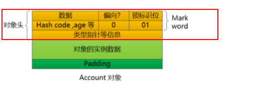

假如有一个线程执行到synchronized代码块的时候，JVM使用CAS操作把线程指针ID记录到MarkWord当中，并修改偏向标识，表示当前线程就获得该锁。锁对象变成偏向锁（通过CAS修改对象头里的锁标志位），字面意思是“偏向于第一个获得它的线程”的锁。执行完同步代码块之后，线程并不会主动释放偏向锁。


这时线程获得了锁，可以执行同步代码块。当该线程第二次到达同步代码块时会判断此时持有锁的线程是否还是自己（持有锁的线程ID也在对象头里面），JVM通过account对象的MarkWord判断：当前线程ID还在，说明还持有着这个对象的锁，就可以继续进入临界区工作。**由于之前没有释放锁，这里也就不需要重新加锁。**

结论：JVM不用和操作系统协商设置Mutex(争取内核)，它只需要记录下线程ID就标示自己获得了当前锁，不用操作系统接入。

上述就是偏向锁：在没有其他线程竞争的时候，一直偏向偏心当前线程，当前线程可以一直执行。

**开启偏向锁**

实际上偏向锁再JDK1.6之后是默认开启的，但是启动时间 有延迟，所以需要添加参数`-XX:BiasedLockingStartupDelay = 0`，让其在程序启动时立刻启动。

开启偏向锁：

`-XX:+UseBiasedLocking(开启) -XX:BiasedLockingStartupDelay = 0（关闭延迟）`

关闭偏向锁：关闭之后程序默认会直接进入轻量级锁状态

`-XX:-UseBiasedLocking`

**线程多了之后**

当有另外线程逐步来竞争锁的时候，就不能再使用偏向锁了，要升级为轻量级锁。竞争线程尝试CAS更新对象头失败，会等待到全局安全点（此时不会执行任何代码）撤销偏向锁。

**偏向锁的撤销**

偏向锁使用一种等到竞争出现才释放锁的机制，只有当其他线程竞争锁时，持有偏向锁的原来线程才会被撤销。
撤销需要等待全局安全点(该时间点上没有字节码正在执行)，同时检查持有偏向锁的线程是否还在执行： 

①  第一个线程正在执行synchronized方法(处于同步块)，它还没有执行完，其它线程来抢夺，该偏向锁会被取消掉并出现锁升级。此时轻量级锁由原持有偏向锁的线程持有，继续执行其同步代码，而正在竞争的线程会进入自旋等待获得该轻量级锁。

②  第一个线程执行完成synchronized方法(退出同步块)，则将对象头设置成无锁状态并撤销偏向锁，重新偏向 。

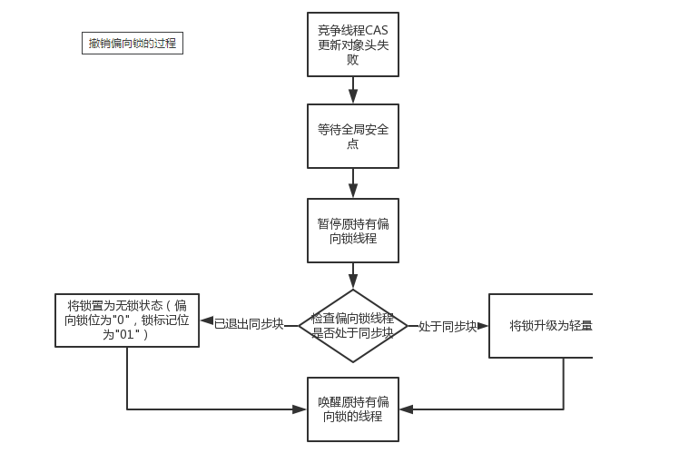

## 11.4 轻量级锁

有线程来参与锁的竞争，但是获取锁的冲突时间非常短

本质就是自旋锁


**1、轻量级锁的获取**

轻量级锁是为了在线程**近乎交替**执行同步块时提高性能。

主要目的：在没有多线程竞争的前提下，通过CAS减少重量级锁使用操作系统互斥量产生的性能消耗，说白了就是**先自旋再阻塞**

升级时机：当关闭偏向锁功能或多线程竞争偏向锁会导致偏向锁升级为轻量级锁

假如线程A已经拿到了锁，这时线程B又来抢夺该对象的锁，由于该对象的锁已经被线程A拿到了，当前该锁已经是偏向锁了。而线程B在争夺中发现对象头MarkWord中的线程ID不是线程B自己的线程ID，而是线程A，那线程B就会进行CAS操作希望能获得锁。

此时B有两种情况：

1. 如果锁获取成功，直接替换MarkWord中的线程ID为B自己的ID，重新偏向于其他线程（即将偏向锁交给其他线程，相当于当前线程”被“释放了锁），该锁会保持偏向锁状态，A线程Over，B线程上位；
2. 如果锁获取失败，则偏向锁升级为轻量锁，此时轻量级锁由原持有偏向锁的线程持有，继续执行其同步代码，而正在竞争的线程B会进入自旋等待获得该轻量级锁。

**2、自旋达到一定次数之后**

在Java6之前，默认骑电动，默认情况下自旋的次数是10次，`-XX:PreeBlockSpin =10`来修改，或者自旋新线程数超过CPU核数的一半

在Java6之后，采用自适应，这意味着自旋的次数不是固定不变的，而是根据同一锁上一次自旋的时间和拥有锁线程的状态来决定。

**3、和偏向锁的区别**

争夺轻量级锁失败时，自旋尝试抢占锁

轻量级锁每次退出同步块都需要释放锁，而偏向锁是在竞争发生时才释放锁。

## 11.5 重锁

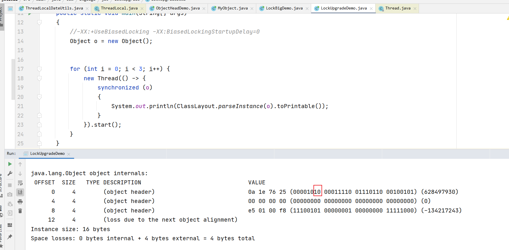

## 11.6 小总结

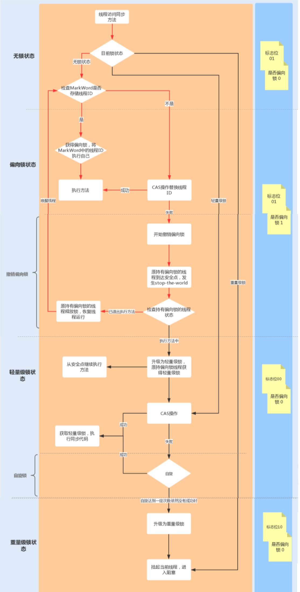


**synchronized锁升级过程总结：一句话，就是先自旋，不行再阻塞。**

实际上是把之前的悲观锁(重量级锁)变成在一定条件下使用偏向锁以及使用轻量级(自旋锁CAS)的形式

synchronized在修饰方法和代码块在字节码上实现方式有很大差异，但是内部实现还是基于对象头的MarkWord来实现的。

JDK1.6之前synchronized使用的是重量级锁，JDK1.6之后进行了优化，拥有了无锁->偏向锁->轻量级锁->重量级锁的升级过程，而不是无论什么情况都使用重量级锁。

**偏向锁:**适用于单线程适用的情况，在不存在锁竞争的时候进入同步方法/代码块则使用偏向锁。

**轻量级锁**：适用于竞争较不激烈的情况(这和乐观锁的使用范围类似)， 存在竞争时升级为轻量级锁，轻量级锁采用的是自旋锁，如果同步方法/代码块执行时间很短的话，采用轻量级锁虽然会占用cpu资源但是相对比使用重量级锁还是更高效。

**重量级锁**：适用于竞争激烈的情况，如果同步方法/代码块执行时间很长，那么使用轻量级锁自旋带来的性能消耗就比使用重量级锁更严重，这时候就需要升级为重量级锁。

## 11.7 JIT编译器对锁的优化

Just In Time Compiler，一般翻译为即时编译器

### 锁消除

```java
/**
 * 锁消除
 * 从JIT角度看相当于无视它，synchronized (o)不存在了,这个锁对象并没有被共用扩散到其它线程使用，
 * 极端的说就是根本没有加这个锁对象的底层机器码，消除了锁的使用
 */
public class LockClearUPDemo {
    static Object objectLock = new Object();//正常的

    public void m1() {
        //锁消除,JIT会无视它，synchronized(对象锁)不存在了。不正常的
        Object o = new Object();

        synchronized (o) {
            System.out.println("-----hello LockClearUPDemo"+"\t"+o.hashCode()+"\t"+objectLock.hashCode());
        }
    }

    public static void main(String[] args) {
        LockClearUPDemo demo = new LockClearUPDemo();

        for (int i = 1; i <=10; i++) {
            new Thread(() -> {
                demo.m1();
            },String.valueOf(i)).start();
        }
    }
}
```

### 锁粗化

```java
/**
 * 锁粗化
 * 假如方法中首尾相接，前后相邻的都是同一个锁对象，那JIT编译器就会把这几个synchronized块合并成一个大块，
 * 加粗加大范围，一次申请锁使用即可，避免次次的申请和释放锁，提升了性能
 */
public class LockBigDemo {
    static Object objectLock = new Object();

    public static void main(String[] args)
    {
        new Thread(() -> {
            synchronized (objectLock) {
                System.out.println("11111");
            }
            synchronized (objectLock) {
                System.out.println("22222");
            }
            synchronized (objectLock) {
                System.out.println("33333");
            }
        },"a").start();

        new Thread(() -> {
            synchronized (objectLock) {
                System.out.println("44444");
            }
            synchronized (objectLock) {
                System.out.println("55555");
            }
            synchronized (objectLock) {
                System.out.println("66666");
            }
        },"b").start();
    }
}
```

# 第十二章 AbstractQueuedSynchronizer之AQS

抽象的队列同步器

是用来构建锁或者其它同步器组件的**重量级基础框架及整个JUC体系的基石**，通过内置的FIFO**队列**来完成资源获取线程的排队工作，并通过一个**int变量**表示持有锁的状态

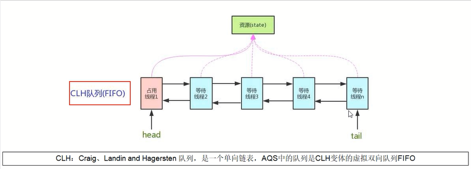

和AQS有关的内容如下图所示

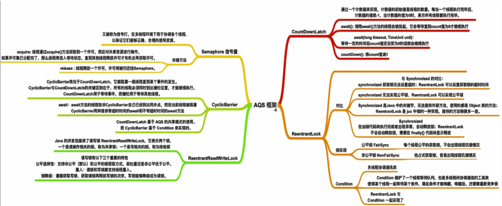

锁，面向锁的使用者，定义了程序员和锁交互的使用层API，隐藏了实现细节，调用就可以

同步器，面向锁的实现者，比如java并发大神Douglee提出了统一规范并简化了锁的实现，屏蔽了同步状态管理、阻塞线程排队和通知、唤醒机制等。

## 12.1 能干嘛

加锁会导致阻塞，有阻塞就需要排队，实现排队必然需要有某种形式的队列来管理

抢到资源的线程直接使用办理业务，抢占不到资源的线程的必然涉及一种排队等候机制，抢占资源失败的线程继续去等待（类似办理窗口都满了，暂时没有受理窗口的顾客只能去候客区排队等候），仍然保留获取锁的可能且获取锁流程仍在继续（候客区的顾客也在等着叫号，轮到了再去受理窗口办理业务）。

如果共享资源被占用，就需要一定的阻塞等待唤醒机制来保证锁分配。这个机制主要用的是CLH队列的变体实现的，将暂时获取不到锁的线程加入到队列中，这个队列就是AQS的抽象表现。它将请求共享资源的线程封装成队列的结点（Node），通过CAS、自旋以及LockSupport.park()的方式，维护state变量的状态，使并发达到同步的效果。

## 12.2 AQS初步

> ```
> /**
>  * Provides a framework for implementing blocking locks and related
>  * synchronizers (semaphores, events, etc) that rely on
>  * first-in-first-out (FIFO) wait queues.  This class is designed to
>  * be a useful basis for most kinds of synchronizers that rely on a
>  * single atomic {@code int} value to represent state. Subclasses
>  * must define the protected methods that change this state, and which
>  * define what that state means in terms of this object being acquired
>  * or released.  Given these, the other methods in this class carry
>  * out all queuing and blocking mechanics. Subclasses can maintain
>  * other state fields, but only the atomically updated {@code int}
>  * value manipulated using methods {@link #getState}, {@link
>  * #setState} and {@link #compareAndSetState} is tracked with respect
>  * to synchronization.
> ```
>
> 依靠单个原子来表示状态，通过占用和释放方法改变状态值

AQS使用一个volatile的int类型的成员变量来表示同步状态，通过内置的FIFO队列来完成资源获取的排队工作将每条要去抢占资源的线程封装成一个Node节点来实现锁的分配，通过CAS完成对State值的修改

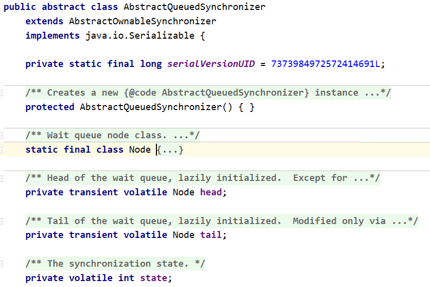

对于state变量来说，如果为0就是相当于自由状态，线程可以进行锁的抢占，类似于银行办理业务的受理窗口可以进行办理；如果大于0，有人占用窗口，线程得进行阻塞等待

CLH队列是一个双向队列，从尾部入队，头部出队，即AQS就是state变量 + CLH双端Node队列

Node类在AQS类内部：

```java
static final class Node {

    // 共享
    static final Node SHARED = new Node();
	// 独占
    static final Node EXCLUSIVE = null;
	// 线程被取消了
    static final int CANCELLED =  1;
	// 后继线程需要唤醒
    static final int SIGNAL    = -1;
	// 等待condition唤醒
    static final int CONDITION = -2;
    // 共享式同步状态获取将会无条件地传播下去
    static final int PROPAGATE = -3;
	// 初始为0，状态是上面的几种
    volatile int waitStatus;
	// 前置节点
    volatile Node prev;
	// 后继节点
    volatile Node next;

    volatile Thread thread;
    
    // 后面省略。。。
}
```

Node的waitStatus就是等候区其他顾客（其他线程）的等待状态，队列中每一个排队的个体就是一个Node

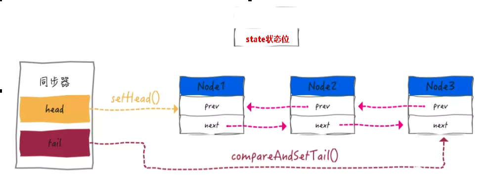


AQS底层是用LockSupport.park()进行排队的

## 12.3 源码解析

我们以ReentrantLock为例进行解读

```java
public class AQSDemo {
    public static void main(String[] args) {
        ReentrantLock lock = new ReentrantLock();
        //带入一个银行办理业务的案例来模拟我们的AQS如何进行线程的管理和通知唤醒机制
        //3个线程模拟3个来银行网点，受理窗口办理业务的顾客
        //A顾客就是第一个顾客，此时受理窗口没有任何人，A可以直接去办理
        new Thread(() -> {
                lock.lock();
                try{
                    System.out.println("-----A thread come in");
                    try { TimeUnit.MINUTES.sleep(20); }catch (Exception e) {e.printStackTrace();}
                }finally { lock.unlock(); }
        },"A").start();

        //第二个顾客，第二个线程---》由于受理业务的窗口只有一个(只能一个线程持有锁)，此时B只能等待，
        //进入候客区
        new Thread(() -> {
            lock.lock();
            try{
                System.out.println("-----B thread come in");
            }finally { lock.unlock(); }
        },"B").start();

        //第三个顾客，第三个线程---》由于受理业务的窗口只有一个(只能一个线程持有锁)，此时C只能等待，
        //进入候客区
        new Thread(() -> {
            lock.lock();
            try{
                System.out.println("-----C thread come in");
            }finally { lock.unlock(); }
        },"C").start();
    }
}
```

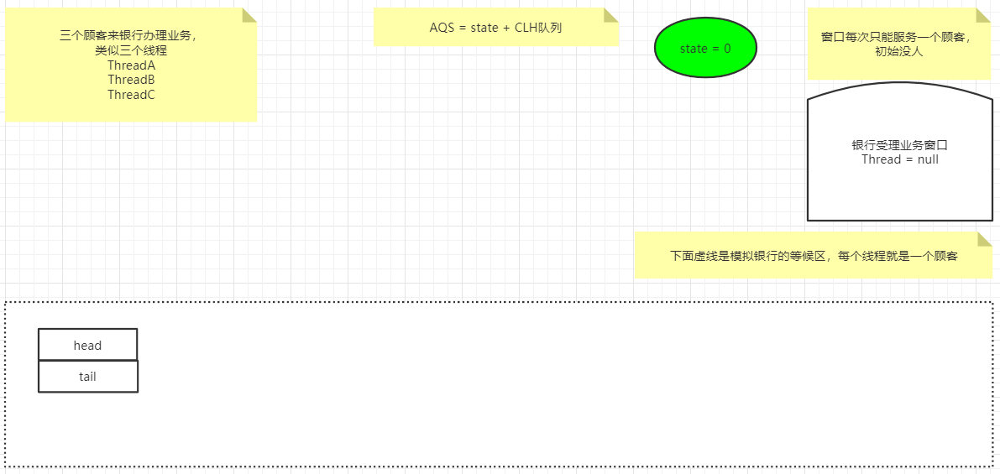

Lock接口的实现类基本上都是通过聚合了一个队列同步器的子类完成线程访问控制的

对于公平和非公平锁，比较他们的tryAcqure()方法， 其实差别就在于**非公平锁获取锁时比公平锁中少了一个判断**`!hasQueuedPredecessors()`，该方法中判断了是否需要排队。

公平锁：先来先到，线程在获取锁时，如果这个锁的等待队列中已经有线程在等待，那么当前线程就会进入等待队列中

非公平锁：不管是否有等待队列，如果可以获取锁，则立刻占有锁对象。也就是说队列的第一个排队线程在unpark，之后还是需要竞争锁（存在线程竞争的情况下）

```java
// hasQueuedPredecessors()
public final boolean hasQueuedPredecessors() {
    // The correctness of this depends on head being initialized
    // before tail and on head.next being accurate if the current
    // thread is first in queue.
    Node t = tail; // Read fields in reverse initialization order
    Node h = head;
    Node s;
    return h != t &&
        ((s = h.next) == null || s.thread != Thread.currentThread());
}
```

首先看非公平锁的lock方法

```java
final void lock() {
    if (compareAndSetState(0, 1))
        setExclusiveOwnerThread(Thread.currentThread());
    else
        acquire(1);
}
```

如果是第一个线程进来，一开始status为0，因此就能够通过CAS变成1，因此进入if里面进行抢占，在我们的银行例子中，A线程就能抢占到锁。其中`setExclusiveOwnerThread`设置该锁是被当前线程所占领，即A线程

此时状态如下：

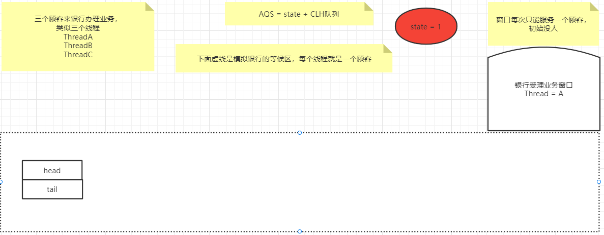

因为A线程设置的时候阻塞了20分钟，因此此时B线程进来抢夺锁，发现state已经被占用了，就执行else里面的`acquire(1)`方法

```java
public final void acquire(int arg) {
    if (!tryAcquire(arg) &&
        acquireQueued(addWaiter(Node.EXCLUSIVE), arg))
        selfInterrupt();
}
```

其中tryAcquire方法在父类中的实现是抛出一个异常，这是设计模式的内容，旨在强制让子类重写该方法

本例我们使用的是ReentrantLock中的非公平锁，代码如下：

```java
final boolean nonfairTryAcquire(int acquires) {
    final Thread current = Thread.currentThread();
    int c = getState();
    if (c == 0) { // 通过变量state判断锁是否被占用，0表示未被占用
        if (compareAndSetState(0, acquires)) {
            setExclusiveOwnerThread(current);
            return true;
        }
    }
    else if (current == getExclusiveOwnerThread()) {
        /* 
        	当前锁已经被占用，但是占用锁的是当前线程本身，ReentrantLock支持重入
        	这里就是重入锁的实现，当已经获取锁的线程每多获取一次锁，state就进行加1操作
        */
        int nextc = c + acquires;
        if (nextc < 0) // overflow
            throw new Error("Maximum lock count exceeded");
        setState(nextc);
        return true;
    }
    // 如果线程没有抢到锁，就返回，继续推进条件，走下一步方法addWaiter
    return false;
}
```

当线程B进入nonfairTryAcquire方法时，发现还是无法抢到锁，就返回false，继续执行接下来的方法，也就是addWaiter(Node.EXCLUSIVE,arg)；

```java
private Node addWaiter(Node mode) {
    Node node = new Node(Thread.currentThread(), mode);
    // Try the fast path of enq; backup to full enq on failure
    Node pred = tail;
    if (pred != null) {
        node.prev = pred;
        if (compareAndSetTail(pred, node)) {
            pred.next = node;
            return node;
        }
    }
    enq(node);
    return node;
}
```

第一次进入，tail指向null，也就是CLH队列中还没有线程，就执行enq方法

```java
private Node enq(final Node node) {
    for (;;) {
        Node t = tail;
        if (t == null) { // Must initialize
            if (compareAndSetHead(new Node()))
                tail = head;
        } else {
            node.prev = t;
            if (compareAndSetTail(t, node)) {
                t.next = node;
                return t;
            }
        }
    }
}
```

再次判断tail指向null，因此新建一个Node节点，让head指向该Node，然后让tail指向head，也就是这个新建的Node，

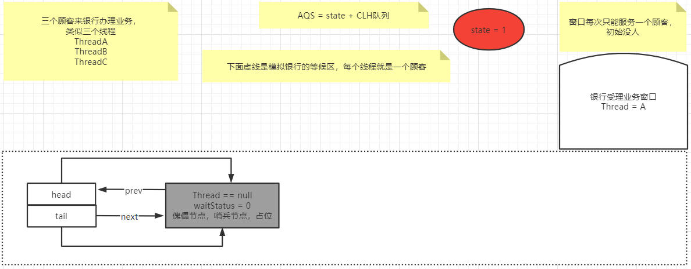

双向链表中，**第一个节点为虚节点，也叫哨兵节点**，其实并不存储任何信息，只是占位。真正的第一个有数据的节点，是从第二个节点开始的。

此时方法还没结束，继续下一次循环，注意的是，此时tail已经不为null了，进入else中，而此时的node就是线程B所在的节点，将线程B加入到CLH队列之中。

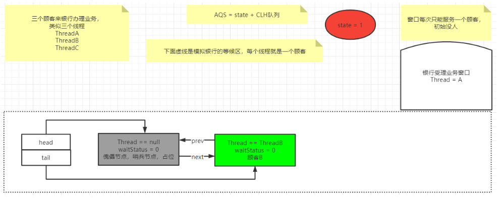

然后这时候C线程也进来了，重复线程B的动作，但是在addWaiter方法能进if里面， 此时将线程C也添加进CLH队列中

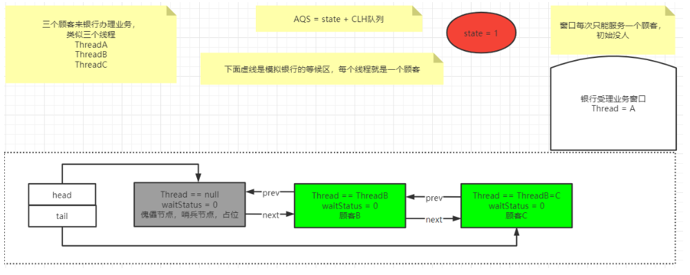

接着执行下一个方法：

```java
final boolean acquireQueued(final Node node, int arg) {
    boolean failed = true;
    try {
        // 标志异常中断情况
        boolean interrupted = false;
        for (;;) {
            final Node p = node.predecessor(); // 获取当前节点的prev节点
            if (p == head && tryAcquire(arg)) {
                // 当前线程抢占锁成功
                setHead(node);
                p.next = null; // help GC
                failed = false;
                return interrupted;
            }
            // 
            if (shouldParkAfterFailedAcquire(p, node) &&
                parkAndCheckInterrupt())
                interrupted = true;
        }
    } finally {
        if (failed)
            cancelAcquire(node);
    }
}
```

如果此时A线程仍然没有执行完成，线程B会继续进行抢夺，抢夺失败后执行shouldParkAfterFailedAcquire方法

```java
private static boolean shouldParkAfterFailedAcquire(Node pred, Node node) {
    // 获取前驱节点的状态
    int ws = pred.waitStatus;
    // 等待被占用的资源释放返回true
    if (ws == Node.SIGNAL)
        return true;
    // 说明是CANCELLD状态
    if (ws > 0) {
        // 循环判断前驱节点的前驱节点是否也为CANCELLED状态，忽略该状态的节点，重新连接队列
        do {
            node.prev = pred = pred.prev;
        } while (pred.waitStatus > 0);
        pred.next = node;
    } else {
		// 将当前节点的前驱节点设置为SIGNAL，用于后续唤醒操作
        // 程序第一次执行到这里返回false，还会进行外层第二次循环
        compareAndSetWaitStatus(pred, ws, Node.SIGNAL);
    }
    return false;
}
```

如果前驱节点的waitstatus是SINGNAL状态（-1），即该方法会返回true，程序会继续向下执行parkAndCheckInterrupt方法，用于将线程挂起。

但是此时B节点的前驱节点的waitStatus是0，因此往下走，然后将B前面的哨兵节点的waitstatus的值变成了-1，出去该方法后还会进行第二次循环，然后发现waitstatus是SINGNAL了，就返回true，进行阻塞

```java
private final boolean parkAndCheckInterrupt() {
    LockSupport.park(this);
    return Thread.interrupted();
}
```

也就是说此时线程A还在办理当中，线程B和线程C在CLH队列中进行等候，到这里的时候B线程和C线程就已经被阻塞了。

当线程A办理完成的时候，会释放锁，然后status变成了0，这时候会调用unlock方法，然后执行release方法，将哨兵节点的waitstatus变成0，然后唤醒线程B，接着就会返回到parkAndCheckInterrupt方法，因为没有什么中断异常，方法返回false，继续acquireQueued方法里面的for循环里面的自旋，然后发现这次执行tryAcquire方法后抢到了锁，就让头节点指向线程B

```java
// acquireQueued中的方法
private void setHead(Node node) {
    head = node;
    node.thread = null;
    node.prev = null;
}
```

线程B抢到锁之后，就让线程B变成哨兵节点

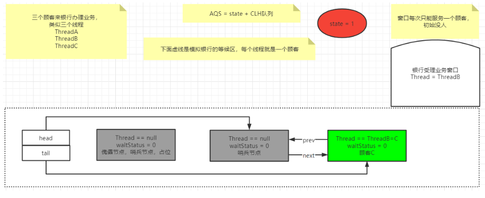

原来的哨兵节点就被GC回收掉了

## 12.4 小细节

AQS里面的state有三个状态，0表示没占用，1表示被占用，大于1是可重入锁

如果AB两个线程进来了以后，CLH中总共有三个Node节点，因为还包含哨兵节点。

# 第十三章 ReentrantLock、ReentrantReadWriteLock、StampedLock讲解

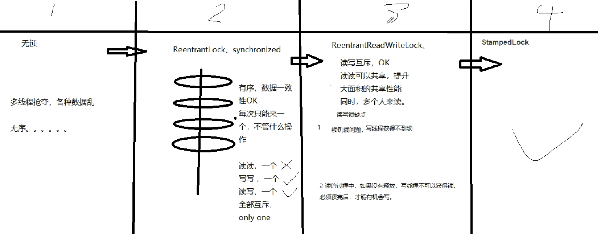

面试题：

- 你知道Java里面有哪些锁吗？
- 你说你用过读写锁，锁饥饿问题是什么
- 有没有比读写锁更快的锁
- StampedLock知道吗
- ReentrantReadWriteLock有锁降级机制策略你知道吗

## 13.1 读写锁

并不是真正意义上的读写分离，**它只允许读读共存，而读写和写写依然是互斥的**

大多实际场景是**读读线程间并不存在互斥关系**，只有读写线程或写写线程间的操作需要互斥的，因此就引入了ReentrantReadWriteLock。

一个读写锁同时只能存在一个写锁，但是可以存在多个读锁，但是不能同时存在写锁和读锁，也即**一个资源可以被多个读操作访问或者一个写操作访问**，**但是两者不能同时进行**

只有在读多写少的情景下，读写锁才具有较高的性能体现。

**1、特点**

可重入、读写分离

**2、无锁无序 → 加锁 → 读写锁演变复习**

```java
class MyResource {
    Map<String,String> map = new HashMap<>();
    //=====ReentrantLock 等价于 =====synchronized
    Lock lock = new ReentrantLock();
    //=====ReentrantReadWriteLock 一体两面，读写互斥，读读共享
    ReentrantReadWriteLock rwLock = new ReentrantReadWriteLock();

    public void write(String key,String value) {
        rwLock.writeLock().lock();
        try {
            System.out.println(Thread.currentThread().getName()+"\t"+"---正在写入");
            map.put(key,value);
            //暂停毫秒
            try { TimeUnit.MILLISECONDS.sleep(500); } catch (InterruptedException e) { e.printStackTrace(); }
            System.out.println(Thread.currentThread().getName()+"\t"+"---完成写入");
        }finally {
            rwLock.writeLock().unlock();
        }
    }
    public void read(String key) {
        rwLock.readLock().lock();
        try {
            System.out.println(Thread.currentThread().getName()+"\t"+"---正在读取");
            String result = map.get(key);
            //后续开启注释修改为2000，演示一体两面，读写互斥，读读共享，读没有完成时候写锁无法获得
            //try { TimeUnit.MILLISECONDS.sleep(200); } catch (InterruptedException e) { e.printStackTrace(); }
            System.out.println(Thread.currentThread().getName()+"\t"+"---完成读取result："+result);
        }finally {
            rwLock.readLock().unlock();
        }
    }
}

public class ReentrantReadWriteLockDemo {
    public static void main(String[] args) {
        MyResource myResource = new MyResource();

        for (int i = 1; i <=10; i++) {
            int finalI = i;
            new Thread(() -> {
                myResource.write(finalI +"", finalI +"");
            },String.valueOf(i)).start();
        }

        for (int i = 1; i <=10; i++) {
            int finalI = i;
            new Thread(() -> {
                myResource.read(finalI +"");
            },String.valueOf(i)).start();
        }

        //暂停几秒钟线程
        try { TimeUnit.SECONDS.sleep(1); } catch (InterruptedException e) { e.printStackTrace(); }

        //读全部over才可以继续写
        for (int i = 1; i <=3; i++) {
            int finalI = i;
            new Thread(() -> {
                myResource.write(finalI +"", finalI +"");
            },"newWriteThread==="+String.valueOf(i)).start();
        }
    }
}
```

**3、从写锁→读锁，ReentrantReadWriteLock可以降级**

锁的严苛程度变强叫做升级，反之叫做降级


锁降级：**遵循获取写锁 → 再获取读锁 → 再释放写锁的次序，写锁能够降级成为读锁。**

**如果一个线程占有了写锁，在不释放写锁的情况下，它还能占有读锁，即写锁降级为读锁。**

Java8 官网说明：重入还允许通过获取写入锁定，然后读取锁然后释放写锁从写锁到读取锁, 
但是，从读锁定升级到写锁是不可能的。

**锁降级是为了让当前线程感知到数据的变化，目的是保证数据可见性**

```java
/**
 * 锁降级：遵循获取写锁→再获取读锁→再释放写锁的次序，写锁能够降级成为读锁。
 * 如果一个线程占有了写锁，在不释放写锁的情况下，它还能占有读锁，即写锁降级为读锁。
 */
public class LockDownGradingDemo {
    public static void main(String[] args) {
        ReentrantReadWriteLock readWriteLock = new ReentrantReadWriteLock();

        ReentrantReadWriteLock.ReadLock readLock = readWriteLock.readLock();
        ReentrantReadWriteLock.WriteLock writeLock = readWriteLock.writeLock();

        writeLock.lock();
        System.out.println("-------正在写入");

        readLock.lock();
        System.out.println("-------正在读取");
        
        writeLock.unlock();
    }
}
```

如果有线程在读，那么写线程是无法获取写锁的，是悲观锁的策略

**4、不可锁升级**

线程获取读锁是不能直接升级为写入锁的。

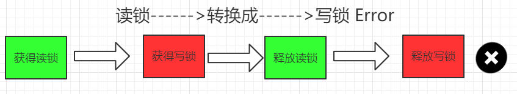

在ReentrantReadWriteLock中，当读锁被使用时，如果有线程尝试获取写锁，该写线程会被阻塞。

所以，需要释放所有读锁，才可获取写锁，


**5、写锁和读锁是互斥的**

写锁和读锁是互斥的（这里的互斥是指**线程间的互斥**，当前线程可以获取到写锁又获取到读锁，但是获取到了读锁不能继续获取写锁），这是因为读写锁要保持写操作的可见性。

因为，如果允许读锁在被获取的情况下对写锁的获取，那么正在运行的其他读线程无法感知到当前写线程的操作。

因此，分析读写锁ReentrantReadWriteLock，会发现它有个潜在的问题：

**读锁全完，写锁有望；写锁独占，读写全堵；**

如果有线程正在读，写线程需要等待读线程释放锁后才能获取写锁；

即ReadWriteLock读的过程中不允许写，只有等待线程都释放了读锁，当前线程才能获取写锁，
也就是写入必须等待，这是一种悲观的读锁，o(╥﹏╥)o，人家还在读着那，你先别去写，省的数据乱。

================================**后续讲解StampedLock时再详细展开**=======================

分析StampedLock(后面详细讲解)，会发现它改进之处在于：

读的过程中也允许获取写锁介入(相当牛B，读和写两个操作也让你“共享”(注意引号))，这样会导致我们读的数据就可能不一致！

所以，需要额外的方法来判断读的过程中是否有写入，这是一种乐观的读锁，O(∩_∩)O哈哈~。 

**显然乐观锁的并发效率更高，但一旦有小概率的写入导致读取的数据不一致，需要能检测出来，再读一遍就行。**

 **6、源码总结**

锁降级  下面的示例代码摘自ReentrantWriteReadLock源码中：

ReentrantWriteReadLock支持锁降级，遵循按照获取写锁，获取读锁再释放写锁的次序，写锁能够降级成为读锁，不支持锁升级。

解读在最下面:

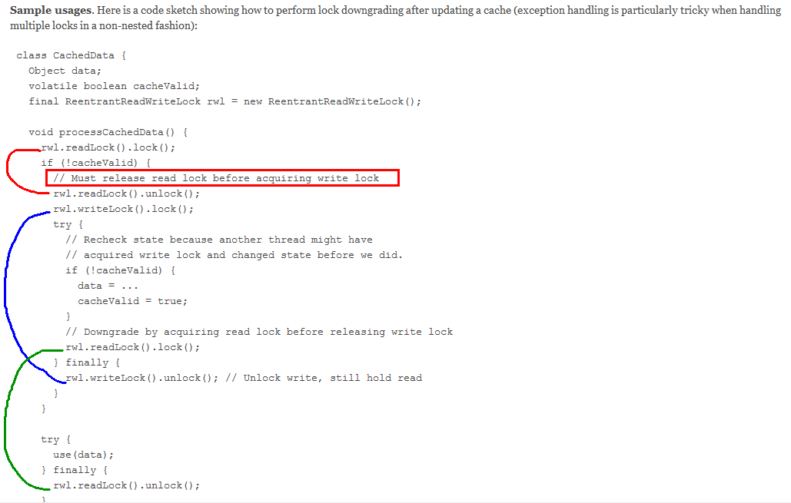

1. 代码中声明了一个volatile类型的cacheValid变量，保证其可见性。
2. 首先获取读锁，如果cache不可用，则释放读锁，获取写锁，在更改数据之前，再检查一次cacheValid的值，然后修改数据，将cacheValid置为true，然后在释放写锁前获取读锁；此时，cache中数据可用，处理cache中数据，最后释放读锁。这个过程就是一个完整的锁降级的过程，目的是保证数据可见性。

**如果违背锁降级的步骤** ：如果当前的线程C在修改完cache中的数据后，没有获取读锁而是直接释放了写锁，那么假设此时另一个线程D获取了写锁并修改了数据，那么C线程无法感知到数据已被修改，则数据出现错误。

**如果遵循锁降级的步骤** ：线程C在释放写锁之前获取读锁，那么线程D在获取写锁时将被阻塞，直到线程C完成数据处理过程，释放读锁。这样可以保证返回的数据是这次更新的数据，该机制是专门为了缓存设计的。

**7、持有写锁了，再获得读锁的意义**

如果我们一开始使用写锁，将一个数据设为5，我们希望外面调用5这个数据，但是，多线程可能导致又一个写进程进来，将5改为88，这样，对外的数据就不是5而是88了。

也就是说，线程1写完了，我们希望大家马上拿到1.0版本，你们立刻来读取。这样就要立刻加读锁，在读的过程中，不可以让其他写线程进来修改数据。保证我们的1.0版本可以被其他线程完整读取后再进行下一次修改。

**写后立即可以读，感知到数据的变化**

实战代码如下：

```java
writeLock.lock();
try
{
    //biz  l;ajfd;lakjsfd;lksajd;lksajf;lakjfds;
    //本次写完立刻被读取。
    /*
            * 1
            * 2 // 进行相关业务代码
            * 3
            * 4
            * 5----biz end
            * */
    readLock.lock();
}catch (Exception e){
    e.printStackTrace();
}finally {
    writeLock.unlock();
}
```

## 13.2 邮戳锁

**1、是什么**

StampedLock是JDK1.8中新增的一个读写锁，也是对JDK1.5的读写锁ReentrantReadWriteLock的优化。

也叫票据锁

stamp（戳记，long类型）：代表了锁的状态，当stamp返回零的时候，表示线程获取锁失败。并且，当释放锁或者转换锁的时候，都要传入最初获取的stamp值。

**2、饥饿锁问题**

ReentrantReadWriteLock实现了读写分离，但是一旦读操作比较多的时候，想要获取写锁就变得比较困难了，
假如当前1000个线程，999个读，1个写，有可能999个读取线程长时间抢到了锁，那1个写线程就悲剧了 

因为当前有可能会一直存在读锁，而无法获得写锁，根本没机会写，o(╥﹏╥)o

使用”公平“策略可以一定程度上缓解这个问题：`new ReentrantReadWriteLock(true)`，但是以牺牲系统吞吐量为代价的。

**这就导致了StampedLock类的乐观读锁闪亮登场；**

**ReentrantReadWriteLock**

允许多个线程同时读，但是只允许一个线程写，在线程获取到写锁的时候，其他写操作和读操作都会处于阻塞状态，读锁和写锁也是互斥的，所以在读的时候是不允许写的，读写锁比传统的synchronized速度要快很多，
原因就是在于ReentrantReadWriteLock支持读并发

**StampedLock横空出世**

ReentrantReadWriteLock的读锁被占用的时候，其他线程尝试获取写锁的时候会被阻塞。但是，StampedLock采取乐观获取锁后，其他线程尝试获取写锁时不会被阻塞，这其实是对读锁的优化，所以，在获取乐观读锁后，还需要对结果进行校验。

**3、StampedLock的特点**

- 所有获取锁的方法，都返回一个邮戳（Stamp），Stamp为零表示获取失败，其余都表示成功；
- 所有释放锁的方法，都需要一个邮戳（Stamp），这个Stamp必须是和成功获取锁时得到的Stamp一致；
- StampedLock是**不可重入的**，危险(**如果一个线程已经持有了写锁，再去获取写锁的话就会造成死锁**) 
- 三种访问模式:
  1. Reading（读模式）：功能和ReentrantReadWriteLock的读锁类似
  2. Writing（写模式）：功能和ReentrantReadWriteLock的写锁类似
  3. Optimistic reading（乐观读模式）：无锁机制，类似于数据库中的乐观锁，支持读写并发，**很乐观认为读取时没人修改，假如被修改再实现升级为悲观读模式**

乐观读模式code演示：**读的过程中也允许获取写锁介入**

```java
public class StampedLockDemo {
    static int number = 37;
    static StampedLock stampedLock = new StampedLock();

    public void write() {
        long stamp = stampedLock.writeLock();
        System.out.println(Thread.currentThread().getName()+"\t"+"=====写线程准备修改");
        try {
            number = number + 13;
        }catch (Exception e){
            e.printStackTrace();
        }finally {
            stampedLock.unlockWrite(stamp);
        }
        System.out.println(Thread.currentThread().getName()+"\t"+"=====写线程结束修改");
    }

    //悲观读
    public void read() {
        long stamp = stampedLock.readLock();
        System.out.println(Thread.currentThread().getName()+"\t come in readlock block,4 seconds continue...");
        //暂停几秒钟线程
        for (int i = 0; i <4 ; i++) {
            try { TimeUnit.SECONDS.sleep(1); } catch (InterruptedException e) { e.printStackTrace(); }
            System.out.println(Thread.currentThread().getName()+"\t 正在读取中......");
        }
        try {
            int result = number;
            System.out.println(Thread.currentThread().getName()+"\t"+" 获得成员变量值result：" + result);
            System.out.println("写线程没有修改值，因为 stampedLock.readLock()读的时候，不可以写，读写互斥");
        }catch (Exception e){
            e.printStackTrace();
        }finally {
            stampedLock.unlockRead(stamp);
        }
    }

    //乐观读
    public void tryOptimisticRead() {
        long stamp = stampedLock.tryOptimisticRead();
        int result = number;
        //间隔4秒钟，我们很乐观的认为没有其他线程修改过number值，实际靠判断。
        System.out.println("4秒前stampedLock.validate值(true无修改，false有修改)"+"\t"+stampedLock.validate(stamp));
        for (int i = 1; i <=4 ; i++) {
            try { TimeUnit.SECONDS.sleep(1); } catch (InterruptedException e) { e.printStackTrace(); }
            System.out.println(Thread.currentThread().getName()+"\t 正在读取中......"+i+
                    "秒后stampedLock.validate值(true无修改，false有修改)"+"\t"
                    +stampedLock.validate(stamp));
        }
        if(!stampedLock.validate(stamp)) {
            System.out.println("有人动过--------存在写操作！");
            stamp = stampedLock.readLock();
            try {
                System.out.println("从乐观读 升级为 悲观读");
                result = number;
                System.out.println("重新悲观读锁通过获取到的成员变量值result：" + result);
            }catch (Exception e){
                e.printStackTrace();
            }finally {
                stampedLock.unlockRead(stamp);
            }
        }
        System.out.println(Thread.currentThread().getName()+"\t finally value: "+result);
    }

    public static void main(String[] args) {
        StampedLockDemo resource = new StampedLockDemo();

        new Thread(() -> {
            resource.read();
            //resource.tryOptimisticRead();
        },"readThread").start();

        // 2秒钟时乐观读失败，6秒钟乐观读取成功resource.tryOptimisticRead();，修改切换演示
        //try { TimeUnit.SECONDS.sleep(6); } catch (InterruptedException e) { e.printStackTrace(); }

        new Thread(() -> {
            resource.write();
        },"writeThread").start();
    }
}
```

**4、StampedLock的缺点**

- StampedLock 不支持重入，没有Re开头
- StampedLock 的悲观读锁和写锁都不支持条件变量（Condition），这个也需要注意。
- 使用 StampedLock一定不要调用中断操作，即不要调用interrupt() 方法
- 如果需要支持中断功能，一定使用可中断的悲观读锁 readLockInterruptibly()和写锁writeLockInterruptibly()