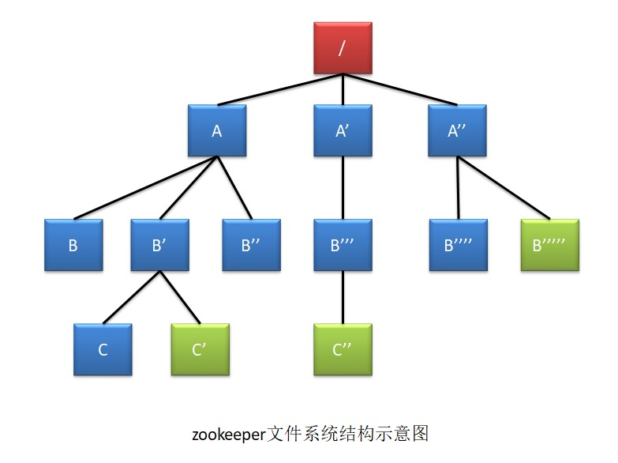
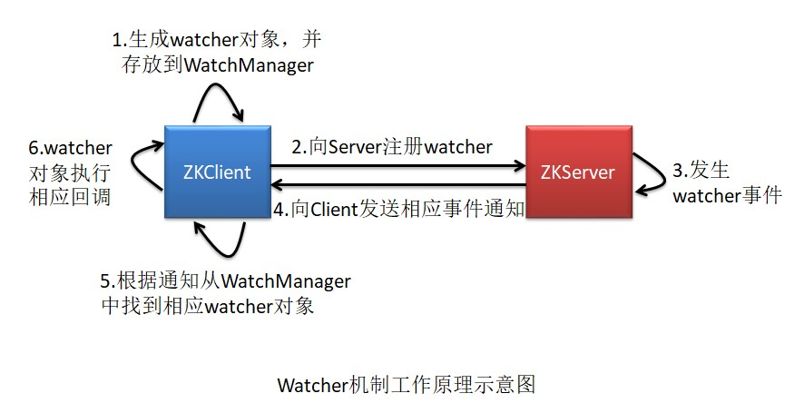
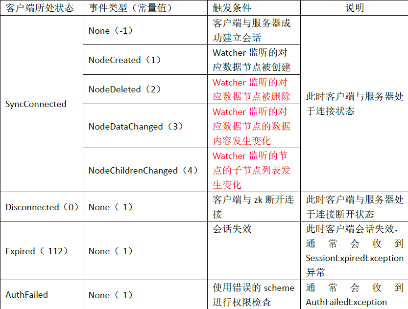
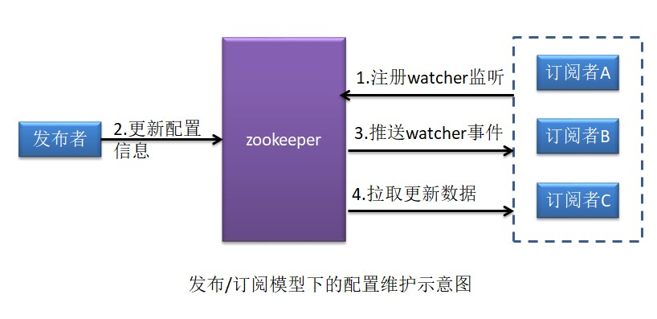
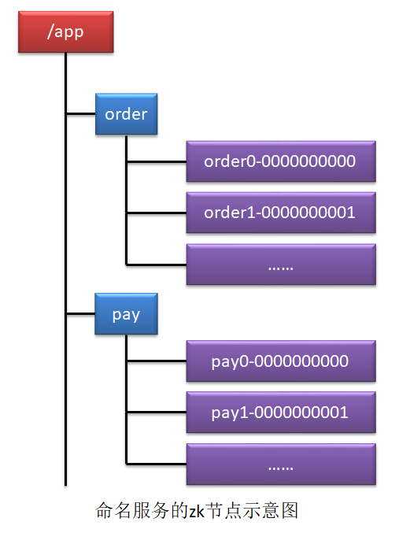

# 第一章：Zookeeper概述

Zookeeper是一个开源的**分布式应用程序协调服务器**，其为分布式系统提供**一致性**服务。其一致性是基于Paxos算法的ZAB协议完成的。主要功能包括：配置维护、域名服务、分布式同步、集群管理等。

## 1.1 一致性

zk如何保证分布式系统的一致性呢？是因为zk具有以下几个方面的特点：

**1、顺序一致性：**zk 接收到的 n 多个事务请求（写操作请求），最终会严格按照其接收顺序被应用到 zk 中。注意这里的顺序，指的是zk接受的顺序，比如有三个请求A、B、C按照顺序发送，但是到达zk的顺序是BCA，那么它们的顺序就是BCA。

**2、原子性：**所有事务请求的结果在集群中每一台 zk 上的应用情况都是一致的。

**3、单一视图：**无论客户端连接的是 zk 集群中的哪个服务器，其看到的服务端数据模型都是一致的， 即 zk 主机中的 znode 都是相同的，这样可以保证用户读取到的数据都是相同的。 

**原子性是针对是写操作的，而单一视图是针对读操作的。**

**4、可靠性：**一旦 zk 成功应用了一个事务，那么该事务所引起的 zk 状态变更（**持久节点上的变更**，临时节点不一样） 将会被一直保留下来，除非有另一个事务又对其进行了变更。

**5、最终一致性：**一旦一个事务被成功应用，zk 可以保证在一段较短的时间后，客户端最终能够从 zk 上 读取到最新的数据状态。但不能保证实时读取到。在同步期间会进行集群锁定。

## 1.2 数据模型znode

zk 数据存储结构与标准的 Unix 文件系统非常相似，都是在根节点下挂很多子节点。**zk 中没有引入传统文件系统中目录与文件的概念**，而是使用了称为 **znode** 的数据节点概念。 znode 是 zk 中数据的最小单元，每个 znode 上都可以保存数据，同时还可以挂载子节点，形 成一个树形化命名空间。 

zk 中虽然可以存放数据，但其主要作用并不是用于存储数据的，而是通过在不同时间创建不同关系、不同类型的 znode 节点，来描述和体现某种关系。

每个 znode 节点可以存放数据的大小上限为 1M 字节。

### 1. 节点类型

每个znode根据节点类型的不同，具有不同的生命周期。

- **持久节点：**节点被创建后会一直保存在zk中，直到将其删除。
- **持久顺序节点：**一个父节点可以为它的第一个子节点维护一份顺序，用于记录每个子节点创建的先后顺序。其在创建子节点时，会在子节点名称后添加数字序号，作为该子节点的完整节点名。序号由10位数字组成，由0开始计数。比如bj0000000000、sh0000000001
- **临时节点：**临时节点的生命周期与客户端的会话绑定在一起，会话消失则该节点就会被 自动清理。临时节点只能作为叶子节点，不能创建子节点。
- **临时顺序节点：**添加了创建序号的临时节点。 

### 2. 节点状态

- cZxid：Created Zxid，表示当前 znode 被创建时的事务 ID
- ctime：Created Time，表示当前 znode 被创建的时间
- mZxid：Modified Zxid，表示当前 znode 最后一次被修改时的事务 ID
- mtime：Modified Time，表示当前 znode 最后一次被修改时的时间
- pZxid：表示当前 znode 的子节点列表最后一次被修改时的事务 ID。注意，只能是其子 节点列表变更了才会引起 pZxid 的变更，子节点内容的修改不会影响 pZxid。
- cversion：Children Version，表示子节点的版本号。该版本号用于充当乐观锁。
- dataVersion：表示当前 znode 数据的版本号。该版本号用于充当乐观锁。
- aclVersion：表示当前 znode 的权限 ACL 的版本号。该版本号用于充当乐观锁。
- ephemeralOwner：若当前 znode 是持久节点，则其值为 0；若为临时节点，则其值为创 建该节点的会话的 SessionID。当会话消失后，会根据 SessionID 来查找与该会话相关的 临时节点进行删除。
- dataLength：当前 znode 中存放的数据的长度。
- numChildren：当前 znode 所包含的子节点的个数。

## 1.3 Watcher机制

zk通过Watcher机制实现了发布/订阅模式。

**1、Watcher工作原理**：

**2、watcher时间**

对于同一个事件类型，在不同的通知状态中代表的含义是不同的。

**3、watcher特性：**

- **一次性：**一旦一个 watcher 被触发，zk 就会将其从客户端的 WatchManager 中删除，当然也就会从服务端删除。当需要再使用时客户端需要再向 zk 重新注册 watcher。
- **串行性：**同一 znode的相同事件类型所引发的 watcher 回调方法的执行是串行的，同步 的。
- **轻量级：**客户端向服务端注册 watcher，并没有将整个 watcher 实例发送到服务端，而是向服务端发送了 watcher中的部分必要数据。watcher 实例及回调逻辑仍是存放在客户端的。这是一种轻量级设计。

zk的watcher机制不适合监听变化非常频繁的场景，也不适合在watcher回调中进行耗时IO型操作（因为串行性，如果有耗时IO会导致整个流程效率低）。

kafka的Consumer的消费offset在0.8版本之前是保存在zk中，而之后的版本是保存在broker中。

# 第二章：zk的典型应用场景解决方案

## 2.1 配置维护

分布式系统中，很多服务都是部署在集群中的，即多台服务器中部署着完全相同的应用， 起着完全相同的作用。当然，集群中的这些服务器的配置文件是完全相同的。 

若集群中服务器的配置文件需要进行修改，那么我们就需要逐台修改这些服务器中的配置文件。如果我们集群服务器比较少，那么这些修改还不是太麻烦，但如果集群服务器特别多，比如某些大型互联网公司的 Hadoop 集群有数千台服务器，那么纯手工的更改这些配置 文件几乎就是一件不可能完成的任务。即使使用大量人力进行修改可行，但过多的人员参与，出错的概率大大提升，对于集群所形成的危险是很大的。

同类产品还有 Spring Cloud Config、Nacos Config、Apollo 等。

**实现原理：**

zk 可以通过“发布/订阅模型”实现对集群配置文件的管理与维护。

## 2.2 命名服务

命名服务是指可以为一定范围内的元素命名一个**唯一标识**，以与其它元素进行区分。在 分布式系统中被命名的实体可以是集群中的主机、服务地址等。 

UUID、GUID，其存在的明显问题有两个：长度太长，无语义。

通过利用 zk 中节点路径不可重复的特点来实现命名服务的。当然，也可以配带上顺序 节点的有序性来体现唯一标识的顺序性。

## 2.3 集群管理

对于集群，我们总是希望能够随时获取到当前集群中各个主机的运行时状态、当前集群中主机的**存活状况**等信息。通过zk可以实现对集群的随机监控。

**分布式日志收集系统：**下面以分布式日志收集系统为例来分析 zk 对于集群的管理。

