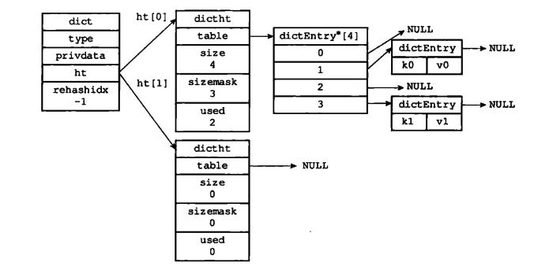
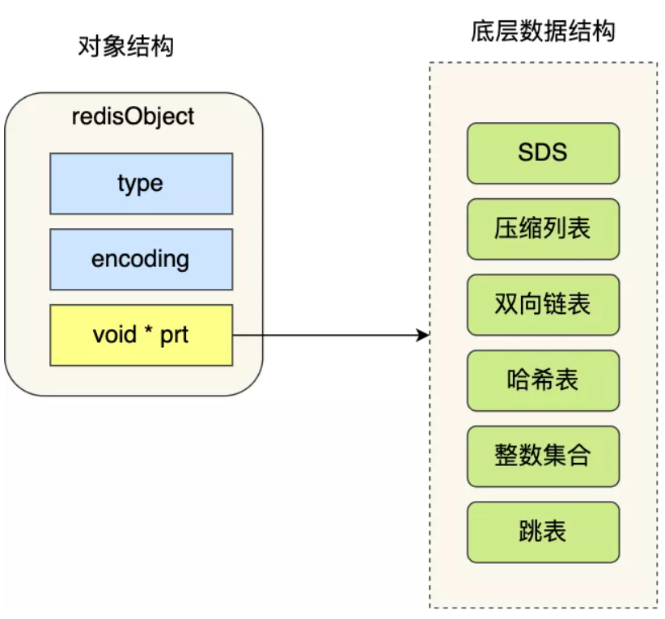
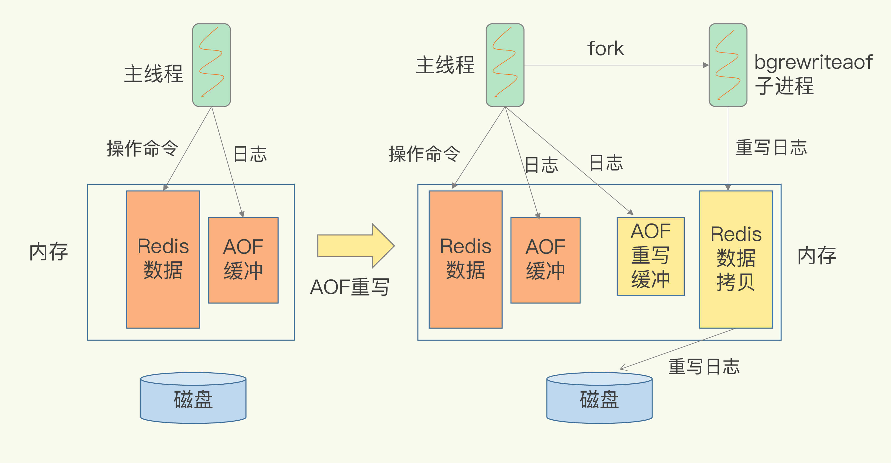

# 第一章 Redis中的单线程

**redis中的单线程，主要指的是Redis的网络IO和键值对的读写是由一个线程来完成的**，但是其余的功能，比如持久化、异步删除、集群数据同步等功能其实还是由其余的线程来完成的。

**为什么使用单线程？】**

多线程来说，它虽然能够提升系统同时处理的请求数，提高吞吐量。但是其实如果线程过多了，系统的吞吐量其实是会逐渐下降的，因为他们可能会有线程上下文的切换的消耗，而且为了保证在多线程环境下修改共享变量的正确性，还得添加同步机制，这个额外的机制同样也会造成额外的开销，同时也会降低系统的易调试性和可维护性。如果不添加额外的同步机制，就可能会引起多线程编程模式下面临的共享资源的并发访问控制的问题。

因此Redis采用的是单线程。

**单线程Redis为什么这么快？】**

1. 大部分操作都是在内存中进行的。
2. 高效的数据结构，比如哈希表、跳表
3. **IO多路复用机制**，能够在网络IO操作中并发处理大量的客户端请求。Redis是基于多路复用模型中的epoll模型进行网络通讯的，epoll模型只需要一个线程就可以监听多个连接，epoll模型的事件监听机制，所有的数据都是异步操作，也不会阻塞主线程。

**Redis单线程处理IO请求性能的瓶颈】**

1. 任意一个请求在server中一旦发生耗时，都会影响整个server的性能，也就是说后面的请求都要等前面这个耗时请求处理完成，自己才能被处理到。耗时的操作包括以下几种： 
   - 操作bigkey：写入一个bigkey在分配内存时需要消耗更多的时间，同样，删除bigkey释放内存同样会产生耗时；
   - 使用复杂度过高的命令：例如SORT/SUNION/ZUNIONSTORE，或者O(N)命令，但是N很大，例如lrange key 0 -1一次查询全量数据；
   - 大量key集中过期：Redis的过期机制也是在主线程中执行的，大量key集中过期会导致处理一个请求时，耗时都在删除过期key，耗时变长；
   - 淘汰策略：淘汰策略也是在主线程执行的，当内存超过Redis内存上限后，每次写入都需要淘汰一些key，也会造成耗时变长；
   - AOF刷盘开启always机制：每次写入都需要把这个操作刷到磁盘，写磁盘的速度远比写内存慢，会拖慢Redis的性能；
   - 主从全量同步生成RDB：虽然采用fork子进程生成数据快照，但fork这一瞬间也是会阻塞整个线程的，实例越大，阻塞时间越久；
2. 并发量非常大时，单线程读写客户端IO数据存在性能瓶颈，虽然采用IO多路复用机制，但是读写客户端数据依旧是同步IO，只能单线程依次读取客户端的数据，无法利用到CPU多核。这里的同步并不是指直接整个网络IO是同步的，而是指从内核缓冲区中拷贝数据的操作是同步操作。

针对问题1：一方面需要业务人员去规避，一方面Redis在4.0推出了lazy-free机制，把bigkey释放内存的耗时操作放在了异步线程中执行，降低对主线程的影响。 

针对问题2，Redis在6.0推出了多线程，可以在高并发场景下利用CPU多核多线程读写客户端数据，进一步提升server性能，当然，只是针对客户端的读写是并行的，每个命令的真正操作依旧是单线程的。

# 第二章 底层数据结构

## 2.0 全局哈希表（hashtable）

**概念】**

所谓的哈希表，其实就是一个保存键值对（key-value）的数据结构。

在Redis中，用了一张全局的哈希表来存取所有的key，它的优点在于能够以O(1)的复杂度快速的查询数据。但是随着key的值越来越多，难免会造成哈希冲突，而Redis解决哈希冲突的办法就是使用拉链法，将冲突的key构成一个链表。

但是如果链表过长了，它的查询效率就会退化成O(n)，因此在就会触发**rehash**进行扩容，对哈希表的大小进行扩展。 

**rehash】**

首先rehash的触发条件和**负载因子**有关，而负载因子：哈希表已经保存的节点数量/哈希表的大小

1. 当负载因子大于等于1，并且Redis没有在执行bgsave命令（rdb全量快照）或者bgrewiteaof命令（aof重写），也就是没有执行RDB快照或者没有进行AOF重写的时候，就会进行rehash。
2. 当负载因子大于等于5，此时说明哈希冲突非常严重了，不管有没有在进行RDB快照或者AOF重写都会强制性的rehash操作。
3. 当负载因此小于0.1的时候，会触发**缩容机制**。同样也不会考虑AOF和RDB过程是否进行中。

**那么Redis是如何进行rehash过程的呢？】**

首先我们得知道，全局哈希表的具体结构：

```c
/* 源码文件 src\dict.h */

/* 哈希表
 * 每个字典都使用两个哈希表，以实现渐进式 rehash 。
 */
typedef struct dictht {
    dictEntry **table;       // 哈希表数组
    unsigned long size;      // 哈希表大小
    unsigned long sizemask;  // 哈希表大小掩码，用于计算索引值，总是等于 size - 1
    unsigned long used;      // 该哈希表 已有节点数量
} dictht;

// Redis 中的字典结构
typedef struct dict {
    dictType *type; // 类型特定函数
    void *privdata; // 私有数据
    dictht ht[2];  // 哈希表
    long rehashidx; /* Rehash 索引，当不在进行Rehash时 值为 -1 */
    unsigned long iterators; /* 目前正在运行的安全迭代器的数量 */
} dict;

typedef struct dictEntry {
    void *key; // 键
    union {   // 值
        void *val;
        uint64_t u64;
        int64_t s64;
    } v;
    struct dictEntry *next; // 指向下个哈希表节点，形成链表
} dictEntry;
```



可以看到，在Redis中的字典结构中，会有两个哈希表，同时考虑到在Redis数据量大的时候，进行rehash过程中可能会造成Redis线程阻塞，无法服务其他的请求，这样Redis就无法快速访问数据了，因此，Redis中的rehash采用的是**渐进式rehash**：

所谓的渐进式哈希，其实就是并不是集中式的一次性完成整个哈希过程，而是**分多次、渐进式地完成的，Redis将数据的迁移任务分散到了每次的请求中。**

1. 在字典中维护了一个rehashidx变量，刚开始rehash的时候，它的值被设置为0，也就是表示第一个哈希表从索引0开始。
2. 在每次的增删改查等redis操作的时候，都会去判断当前的rehashidx变量的值，如果不是-1就表示正在进行rehash，就会顺带的把rehashidx索引位置的元素迁移到第二个哈希表中。
3. 随着操作的不断执行，最终会在某个时间点上，哈希表1中所有的键值对都会被rehash到哈希表2中，此时就将rehashidx重新设置为-1，表示rehash操作已经完成。

同时，rehash被触发之后，Redis会按照一定的频率（100ms/次）执行rehash操作。所以即使没有收到新请求，Redis也会**定时执行一次rehash操作**。缩短整个rehash的过程。而且每次执行时常不会超过1ms，以免对其他任务造成影响。

**rehash过程中的增删改查】**

在渐进式rehash过程中，字典会同时使用到两个哈希表，因此在此过程中，字典的增删改查等操作就会在两个哈希表上进行：比如说查找一个key，会先在第一个哈希表中查找，如果没找到就会去第二个哈希表中查找；而且对于新添加的字典的键值对，会一律保存到第二个哈希表。这样就能保证第一个哈希表中的键值对数量只减不增，并随着rehash操作的执行而最终变成空表。

## 2.1 SDS（symbol dynamic string）

简单动态字符串，Redis中的String类型有什么特殊之处呢？

虽然Redis采用的是c语言进行实现，但是它并没有直接使用C语言中的char*数组来实现字符串，而是自己封装了一个名为Simple Dynamic String的数据结构来表示字符串。

**C语言字符串的缺陷】**

1. **获取字符串长度的时间复杂度为O(N)：**对于C语言来说，它的char*指针只是指向字符数组的起始位置，字符数组的结尾位置就用"\0"来表示。因此获取字符串长度的时候就得从头遍历到尾部。
2. **无法保存二进制数据：**它的结尾是以"\0"字符标识，因此字符串中不能够包含"\0"字符，但是二进制流等数据中就有可能包含这种特殊字符。
3. **字符串操作函数不高效不安全：**比如有缓冲区溢出的风险，有可能造成程序运行终止。

**SDS的数据结构】**

1. **len**：记录字符串的长度，在获取长度的时候，只需返回这个变量即可。
2. **alloc：**分配给字符串的空间长度。在修改字符串的时候，就可以通过alloc-len计算出剩余的空间大小。如果剩余空间不满足修改需求，就会自动将SDS空间扩展至执行修改所需的空间大小（小于1MB翻倍扩容，大于1MB按照1MB扩容），然后才执行实际的修改操作。因此SDS就无需担心缓冲区溢出的风险。
3. **flags：**用来表示不同类型的SDS，分别为sdshdr5、8、16、32、54
4. **buf[]：**字符数组，用来保存实际的数据，不仅可以保存字符串，也可以保存二进制数据。

**5种类型的SDS】**

上述说到，SDS中有一个flags标志位，用来标志不同类型的SDS，那么他们的区别是什么呢？

**数据结构中的len和allo成员的数据类型不同。**

```c
/* Note: sdshdr5 is never used, we just access the flags byte directly.
 * However is here to document the layout of type 5 SDS strings. */
struct __attribute__ ((__packed__)) sdshdr5 {
    unsigned char flags; /* 3 lsb of type, and 5 msb of string length */
    char buf[];
};
struct __attribute__ ((__packed__)) sdshdr8 {
    uint8_t len; /* used */
    uint8_t alloc; /* excluding the header and null terminator */
    unsigned char flags; /* 3 lsb of type, 5 unused bits */
    char buf[];
};
struct __attribute__ ((__packed__)) sdshdr16 {
    uint16_t len; /* used */
    uint16_t alloc; /* excluding the header and null terminator */
    unsigned char flags; /* 3 lsb of type, 5 unused bits */
    char buf[];
};
struct __attribute__ ((__packed__)) sdshdr32 {
    uint32_t len; /* used */
    uint32_t alloc; /* excluding the header and null terminator */
    unsigned char flags; /* 3 lsb of type, 5 unused bits */
    char buf[];
};
struct __attribute__ ((__packed__)) sdshdr64 {
    uint64_t len; /* used */
    uint64_t alloc; /* excluding the header and null terminator */
    unsigned char flags; /* 3 lsb of type, 5 unused bits */
    char buf[];
};
```

之所以这么设计是为了能够**灵活保存不同大小的字符串，从而有效节省内存空间**，当保存小字符串的时候，结构体占用的空间也比较小。

除了设置不同类型的结构体，Redis在编程上还使用了专门的编译优化来节省内存空间，即在struct声明了**attribute((packed))**，作用是**告诉编译器取消结构体在编译过程中的优化对齐，按照实际占用字节数进行对齐**。

**SDS优点】**

1. 使用O1复杂度获取字符串长度
2. 放置缓冲区溢出，因为扩容机制
3. 减少字符串修改带来的内存分配次数：**空间预先分配**和**惰性空间释放机制**（当Redis需要减少SDS字符串长度的时候，redis并不会直接释放多余的空间，而是使用free字段进行记录，以便下一次增加长度的时候使用。当然如果有需要的话，redis底层会自动的回收这部分空间，而不用担心这部分空间的冗余）。
4. 二进制安全。

## 2.2 压缩列表（ziplist）


```c
typedef struct ziplist{
    /*ziplist分配的内存大小*/
    uint32_t bytes;
    /*达到尾部的偏移量*/
    uint32_t tail_offset;
    /*存储元素实体个数*/
    uint16_t length;
    /*存储内容实体元素*/
    unsigned char* content[];
    /*尾部标识*/
    unsigned char end;
}ziplist;
```

在压缩列表中，如果要查找定位第一个元素和最后一个元素，就可以通过表头三个字段直接定位，复杂度为O1。

**整数数组和压缩列表在查找时间复杂度上并没有很大的优势，那么Redis为什么还会将他们作为底层数据结构？】**

1. 内存利用率：数组和压缩列表都是非常紧凑的数据结构，它比链表占用的内存要更少。Redis是基于内存的数据库，因此要尽可能的提高内存的利用率。
2. 数组对CPU高速缓存更加的友好。Redis在设计的过程中，集合数据元素在较少的情况下，默认采用内存紧凑排列的方式存储，同时利用CPU高速缓存不会降低访问速度。当数据元素超过设定阈值后，避免查询时间复杂度太高，就会转为哈希和跳表数据结构存储，保证查询效率。
3. Redis底层使用数组和压缩链表对数据大小限制在64字节以下。当大于64字节会改变存储的数据结构。

**总结】**

1. 压缩列表在空间利用率上极高，每个entry最多只有6字节的浪费
2. 底层无链表结构，通过内存偏移量获取next或last节点的位置
3. 在插入和删除的时候会有相当大的概率出现**连锁更新**，因此在使用的时候尽量保证所存的value位数相同。

## 2.3 紧凑列表（listpack）

我们知道的是，ziplist有着一个致命的缺陷，那就是**连锁更新**，而listpack是Redis5作为ziplist的替代品而引入的，在Redis6以后就已经作为哈希结构的基础底层结构了。

那么listpack相对于ziplist有什么优势呢？


首先listpack从**结构上**相对于ziplist，少了一个tail_offset（达到尾部的偏移量）字段，这个字段的作用是为了方便找到最后一个节点然后进行反方向的遍历。

新的listpack节点的定义如下：

```c
int<var> encoding;
optional byte[] content;
int<var> length;
```

相对于ziplist的定义，它记录的不再是前一个节点的长度，而是自己的长度。同时它将记录自己的长度放到了节点的尾部。

1. 不再需要zltail_offset属性也可以快速定位到最后一个节点。只需要使用listpack的总长度 - 最后一个节点的长度。
2. **每个节点记录自己的长度，当本节点的值发生了改变，只需要更改自己的长度即可，不再需要更改别的节点的属性，解决掉了连锁更新问题**
3. listpack的内存使用率上逊色于ziplist
4. 代码的实现或复杂度上面，极简且高效

## 2.4 快速列表（quicklist）

对于Redis中的双向链表来说，每个节点除了数据部分，都要额外的16字节的内存来表示prev和next（64bit系统的指针为8个字节），而且每个节点的内存都是单独分配的，容易加剧内存的碎片化，影响内存管理效率。

Redis3.2之后对于List类型的value来说，**使用quicklist代替了ziplist和linkedlist。**

对于quicklist来说，它其实是ziplist和linkedlist的结合体，它将linkedlist按段切分，每一段使用ziplist来紧凑存储，多个ziplist之间使用双向指针连接起来。

它相对于linkedlist来说，**进一步压缩了空间**


```c
typedef struct quicklist {
    quicklistNode *head; // 头节点
    quicklistNode *tail; // 尾节点
	// 所有的节点的个数
    unsigned long count;        /* total count of all entries in all ziplists */
    // quicklistNode的个数
    unsigned long len;          /* number of quicklistNodes */
    // 16bit，ziplist大小设置，存放list-max-ziplist-size参数的值
    int fill : QL_FILL_BITS;              /* fill factor for individual nodes */
    // 16bit，节点压缩深度设置，存放lits-compress-depth参数的值
    unsigned int compress : QL_COMP_BITS; /* depth of end nodes not to compress;0=off */
    unsigned int bookmark_count: QL_BM_BITS;
    quicklistBookmark bookmarks[];
} quicklist;

typedef struct quicklistNode {
    struct quicklistNode *prev;
    struct quicklistNode *next;
    unsigned char *zl; // 如果当前节点的数据没有压缩，那么它指向一个ziplist，否则指向一个quicklistLZF结构
    // zl指向的ziplist总大小，包括bytes、zltail、zllen、zlend和各个数据项。
    // 如果ziplist被压缩了，这个sz同样也是压缩前的ziplist大小。
    unsigned int sz; 
    // ziplist里面包含的数据项个数，16bit
    unsigned int count : 16;     /* count of items in ziplist */
    // 1表示没有压缩，2表示被压缩了，而且用的是LZF压缩算法
    unsigned int encoding : 2;   /* RAW==1 or LZF==2 */
    // 预留字段，本来的设计是用来表明一个quicklistNode下面是直接存数据还是使用ziplist存储数据，或者用其它的结构来存。
    // 但是目前只是固定的值2，表示使用ziplist作为数据容器。
    unsigned int container : 2;  /* NONE==1 or ZIPLIST==2 */
    unsigned int recompress : 1; /* was this node previous compressed? */
    unsigned int attempted_compress : 1; /* node can't compress; too small */
    unsigned int extra : 10; /* more bits to steal for future usage */
} quicklistNode;

/* quicklistLZF is a 4+N byte struct holding 'sz' followed by 'compressed'.
 * 'sz' is byte length of 'compressed' field.
 * 'compressed' is LZF data with total (compressed) length 'sz'
 * NOTE: uncompressed length is stored in quicklistNode->sz.
 * When quicklistNode->zl is compressed, node->zl points to a quicklistLZF */
// 表示一个被压缩过的ziplist
typedef struct quicklistLZF {
    unsigned int sz; /* LZF size in bytes*/
    char compressed[]; // 柔性数组，存放压缩后的ziplist字节数组。
} quicklistLZF;
```

对于quicklist的插入来说：

1. 如果是往头节点（尾节点）插入，
    1. 如果此时对应的ziplist的容量足够，就直接插入到对应的ziplist中；
    2. 如果超出了容量限制，就会创建一个新的quicklistNode，这个新的node里面又会包含新的ziplist，而新数据就存储在这里面，并且这个新的quicklistNode就会插入到新的quicklist双向链表中。
2. 如果是指定位置插入数据：
    1. 当插入位置所在的ziplist大小没有超过限制时，直接插入到ziplist中就好了；
    2. 当插入位置所在的ziplist大小超过了限制，但插入的位置位于ziplist两端，并且相邻的quicklist链表节点的ziplist大小没有超过限制，那么就转而插入到相邻的那个quicklist链表节点的ziplist中；
    3. 当插入位置所在的ziplist大小超过了限制，但插入的位置位于ziplist两端，并且相邻的quicklist链表节点的ziplist大小也超过限制，这时需要新创建一个quicklist链表节点插入。
    4. 对于插入位置所在的ziplist大小超过了限制的其它情况（主要对应于在ziplist中间插入数据的情况），则需要把当前ziplist分裂为两个节点，然后再其中一个节点上插入数据。

如果是quicklist的查询，因为每个quicklistNode其实记录了内部的ziplist的entry的个数，因此就可以通过index找到是哪个ziplist，然后进而找到对应的值。

## 2.5 跳表

[Redis数据结构——跳跃表 - Mr于 - 博客园 (cnblogs.com)](https://www.cnblogs.com/hunternet/p/11248192.html)

## 2.6 整数集合

[Redis数据结构——整数集合 - Mr于 - 博客园 (cnblogs.com)](https://www.cnblogs.com/hunternet/p/11268067.html)

[Redis数据结构——压缩列表 - Mr于 - 博客园 (cnblogs.com)](https://www.cnblogs.com/hunternet/p/11306690.html)

[Redis对象——字符串 - Mr于 - 博客园 (cnblogs.com)](https://www.cnblogs.com/hunternet/p/11675540.html)

[Redis对象——哈希(Hash) - Mr于 - 博客园 (cnblogs.com)](https://www.cnblogs.com/hunternet/p/12651530.html)

[Redis对象——集合(Set) - Mr于 - 博客园 (cnblogs.com)](https://www.cnblogs.com/hunternet/p/12695738.html)

[Redis对象——有序集合(ZSet) - Mr于 - 博客园 (cnblogs.com)](https://www.cnblogs.com/hunternet/p/12717643.html)

[Redis数据结构——字典 - Mr于 - 博客园 (cnblogs.com)](https://www.cnblogs.com/hunternet/p/9989771.html)

[Redis数据结构——字典 - Mr于 - 博客园 (cnblogs.com)](https://www.cnblogs.com/hunternet/p/9989771.html)

## 2.7 redisObject

Redis采用redisObject结构来统一几种不同的数据类型，这样所有的数据类型就都可以通过相同的形式在函数间传递而不用使用特定的类型结构。同时为了识别不同的数据类型，redisObject中还定义了type和encoding来对不同的数据类型加以区分。简单来说，redisObject就相当于这些数据类型的父类，可以在函数间传递时隐藏具体的类型信息。

**前面说到的全局哈希表，在dictEntry中会有一个指针val指向数据对象的地址，而这个val指向的地址的内存空间其实就是一个redisObject！**

dictEntry 结构，表示哈希表节点的结构，结构里存放了 void * key 和 void * value 指针， *key 指向的是 String 对象，而 *value 则可以指向 String 对象，也可以指向集合类型的对象，比如 List 对象、Hash 对象、Set 对象和 Zset 对象。

void * key 和 void * value 指针指向的是 Redis 对象，Redis 中的每个对象都由 redisObject 结构表示，如下图：



```c
typedef struct redisObject {
    // 当前value对象的一个数据结构
   // string、hash、set、list、zset、stream、bitmaps、typeloglogs、geo
    unsigned type:4;
    // 当前值对象底层存储的编码格式
    unsigned encoding:4;
    // 记录对象最后一次访问时间
    unsigned lru:LRU_BITS; /* LRU time (relative to global lru_clock) or
                            * LFU data (least significant 8 bits frequency
                            * and most significant 16 bits access time). */
    // 记录当前对象被引用的次数，为0表示可以安全回收当前对象
    int refcount;
    // 真实存储数据的指针。
    void *ptr;
} robj;

// 下面是Redis所拥有的编码格式
/* Objects encoding. Some kind of objects like Strings and Hashes can be
 * internally represented in multiple ways. The 'encoding' field of the object
 * is set to one of this fields for this object. */
#define OBJ_ENCODING_RAW 0     /* Raw representation */
#define OBJ_ENCODING_INT 1     /* Encoded as integer */
#define OBJ_ENCODING_HT 2      /* Encoded as hash table */
#define OBJ_ENCODING_ZIPMAP 3  /* Encoded as zipmap */
#define OBJ_ENCODING_LINKEDLIST 4 /* No longer used: old list encoding. */
#define OBJ_ENCODING_ZIPLIST 5 /* Encoded as ziplist */
#define OBJ_ENCODING_INTSET 6  /* Encoded as intset */
#define OBJ_ENCODING_SKIPLIST 7  /* Encoded as skiplist */
#define OBJ_ENCODING_EMBSTR 8  /* Embedded sds string encoding */
#define OBJ_ENCODING_QUICKLIST 9 /* Encoded as linked list of ziplists */
#define OBJ_ENCODING_STREAM 10 /* Encoded as a radix tree of listpacks */
```


# 第三章 基本数据类型

## 3.1 List

**底层结构】**

在Redis3.2之前，List类型的底层结构有两种：

- **压缩列表：**当列表的元素个数小于list-max-ziplist-entries配置（默认512个），同时列表中的每个元素的值都小于list-max-ziplist-value配置（默认64字节），Redis会选用压缩列表作为内部的实现来减少内存的使用。
- **链表：**当列表类型无法满足压缩列表所需要的条件的时候，Redis就会使用链表作为内部实现。

在Redis3.2开始，List类型的底层使用快速列表（quicklist）代替了ziplist和linkedlist

**应用场景】**

1. **消息队列：**列表类型可以相当于队列去使用，生产者使用lpush将消息添加到list中，然后消费者就可以使用brpop从list的头部去拿消息进行消费。

2. **用户订阅店铺：**比如用户C订阅了店铺A和B，然后他们分别发送了两篇文章，为11和22。只要他们发送了文章，就会安装到C的list里面

   ```
   lpush likearticle:CID 11 22 // 文章推送
   lrange likearticle:CID 0 10 // 查看用户C订阅的全部推文，只显示10条，类似分页
   ```

3. lpush + lpop = stack

4. lpush + rpop = queue

5. lpush  + ltrim = 有限集合

6. lpush + brpop = 消息队列

## 3.2 Hash

压缩 + 哈希表

**应用场景】**

1. 相当于Java里面的Map<String, Map<Object, Object>>，可以用来实现早期的购物车。

```
新增商品 hset shopcar:uid1024 334488 1 // 用户1024添加一件334488的商品到购物车
增加商品数量 hincrby shopcar:uid1024 334488 1
商品总数 hlen shopcar:uid1024
全部选择 hgetall shopcar:1024
```

## 3.3 Set

整数数组、哈希表

**应用场景】**

1. **店铺抽奖活动：**

   ```
   用户参加抽奖 sadd action UID1024
   显示已经有多少人参与了 scard action
   抽奖，从set中选n个人 srandmember key 2 随机抽2人，不删除；
   随机抽3人，删除 spop key 3
   ```

2. **给商品点赞**

   ```
   新增点赞 sadd productId UID1 UID2
   取消点赞 srem productId UID1
   展示所有点赞过的用户 smembers productId
   点赞用户数统计 scard productId
   判断某个人是否对该商品点过赞 sismember productId UID1
   ```

## 3.4 ZSet

压缩列表、跳表

**应用场景】**

1. **热搜排行榜**

   

# 第四章 持久化机制

Redis是基于内存的数据库，而服务器一旦宕机就会导致内存中的数据全部丢失，因此Redis的持久化机制是非常重要的。

## 4.1 AOF

对于MySQL的日志来说，它是有一个WAL机制，也就是先将修改的数据记录到日志中，再去执行指令。但是对于Redis来说，恰好相反。先将数据写入内存之后再记录日志。

1. **可以避免额外的检查开销：**Redis在进行记录日志的时候，并不会去进行语法检查。所以如果采用日志先写的方式，万一这条语句是错误的，就会导致日志恢复数据的时候出错。而采用日志后写的方式，会让系统先执行命令，只有命令执行成功了才会去记录日志。
2. **写之后再记录日志，不会阻塞当前的写操作。**

但是这样可能会导致我们记录写成功了，此时服务器宕机，还没来得及进行日志的持久化，就会导致**数据的丢失。**

再者AOF日志也是在主线程中执行的，如果在日志写入磁盘时，磁盘写压力大，就会导致写盘很慢，**进而导致后续的操作无法执行了**

**三种写回策略】**

| 配置项   | 写回时机           | 优点                     | 缺点                           |
| -------- | ------------------ | ------------------------ | ------------------------------ |
| Always   | 同步写回           | 可靠性高，数据基本不丢失 | 每个写命令都要落盘，性能影响大 |
| Everysec | 每秒写回           | 性能适中                 | 宕机时丢失1秒内的数据          |
| No       | 操作系统控制的写回 | 性能好                   | 宕机时丢失数据较多             |

**AOF重写机制】**

AOF日志过大的时候会造成性能问题：

1. 文件系统本身会对文件大小有限制
2. 文件过大，往里面追加记录的时候，效率会降低
3. 宕机之后恢复数据时，恢复过程非常缓慢

AOF文件采用追加的方式，记录逐一接收到的写命令。因此一个键值对可能会进行多次的写，因此一个键值对可能会有很多的记录。而在重写的过程中，会根据这一条键值对的最新状态，为他生成对应的写入命令。这样一个键值对在日志中只需要用一条命令就可以了。

AOF的重写采用**后台子进程bgrewriteaof**来完成的，避免阻塞主线程导致性能下降。

每次执行重写的时候，主线程会fork出一个子进程。此时fork会把主线程的内存拷贝一份给子进程（其实并不是拷贝，详情见下面的注意事项），这里面就包含了数据库的最新数据。然后子进程就可以在不影响主线程的情况下，逐一把拷贝的数据写成操作，记入重写日志。

但是此时主线程并未阻塞，因此还是会有新的操作执行。Redis对于新来的操作还是会将其添加到AOF缓冲中，这可以保证即使宕机了，整个AOF日志仍然是齐全的；同时也会添加到AOF重写缓冲中，等到子进程重写完成之后，会将AOF重写缓冲中的内容追加到新的日志文件中。

也就是说在AOF重写的过程中，主进程执行三个工作：执行client发送过来的命令请求；将写命令追加到现有的AOF文件中（根据三种策略决定）；将写命令追加到AOF重写缓存中。

**当子进程完成AOF重写之后**，会向主线程发送一个完成信号，然后主线程接受到信号之后会调用一个信号处理函数

- 将AOF重写缓冲中的内容全部写入新的AOF文件中，这时候新的AOF文件所保存的数据库状态和服务器当前的状态一致。
- 对新的AOF文件进行改名，原子的覆盖原有的AOF文件，完成新老文件的替换。



**触发时机】**

有两个配置项在控制AOF重写的触发时机： 

1. auto-aof-rewrite-min-size: 表示运行AOF重写时文件的最小大小，默认为64MB 
2. auto-aof-rewrite-percentage: 这个值的计算方法是：当前AOF文件大小和上一次重写后AOF文件大小的差值，再除以上一次重写后AOF文件大小。默认100

也就是当前AOF文件比上一次重写后AOF文件的增量大小，和上一次重写后AOF文件大小的比值。 AOF文件大小同时超出上面这两个配置项时，会触发AOF重写。

比如AOF文件体量超过64MB，并且比上次重写后的体量增加了百分百时自动触发重写。

**注意事项】**

**重写过程中的潜在阻塞风险？**

1. **fork子进程**：在fork这一瞬间一定会阻塞主线程的，但是在fork的时候并不会一次性拷贝所有内存数据给子进程，而是采用的写时复制机制，避免一次性拷贝大量内存数据给子进程造成的长时间阻塞，**子进程会拷贝父进程的页表，即虚实映射关系，而不是拷贝物理内存**，子进程复制父进程页表，就能共享访问父进程中的内存数据了，此时，类似于有了父进程的所有内存数据。而且这个拷贝的过程会消耗大量CPU资源，拷贝完成之前的整个过程是阻塞的。
2. fork出的子进程指向与父进程相同的内存地址空间，此时子进程就可以开始AOF重写，把内存中的所有数据写入到AOF文件中。但是此时父进程依然是可以进行写入的。如果父进程操作的是一个已经存在的key，那么此时就会真正拷贝的这个key对应的内存数据，申请新的内存空间，这样逐渐地父子进程内存数据开始分离，逐渐开始拥有各自独立的内存空间。而且内存分配是以页为单位进行分配的，默认4k，如果父进程此时操作的是一个bigkey，重新申请大块内存耗时变长，可能会产生阻塞风险。

**AOF重写也有一个重写日志，为什么它不共享使用AOF本身的日志呢？**

1. 父子进程之间使用共享的文件必然会产生竞争问题
2. 如果重写失败了，原来的AOF文件就会被污染了，无法做恢复使用。如果重写失败后，只需要删除这个文件就好了，不会影响到原先的AOF文件。

## 4.2 RDB

AOF在进行故障恢复的时候，需要逐一将AOF日志中的指令都执行一遍。如果操作日志非常多，会导致恢复速度缓慢。

RDB：内存快照，记录的是某一时刻的数据，并不是操作。所以在执行故障恢复的时候可以直接将RDB文件读入内存，很快完成恢复。

RDB就像拍照，要考虑两个问题：

1. 给哪些场景（数据）拍照（持久化）？
2. 拍照的时候不能动，不然会模糊（阻塞）

Redis提供了两个命令来生成RDB文件：

- **save**：在主线程中执行，会导致阻塞
- **bgsave：**fork一个子进程，专门用于写RDB文件，避免了主线程的阻塞，也是默认的配置。

按照一般来说，利用bgsave的机制的确可以让主线程没有阻塞，可以正常接受请求。但是为了保证快照的完整性，主线程就只能进行读操作，因为不能修改正在执行快照的数据。这样为了快照而暂停主线程的写操作是非常不好的选择。为了解决这个问题，Redis使用了操作系统提供的写时复制技术，在执行快照的同时能够去正常处理写操作。

如果主线程接收到的是读请求，那么主线程和子进程相互不影响；如果是写请求，比如主线程要修改一块数据，那么这块数据将会被复制一份，生成该数据的副本，然后主线程就会在这个数据副本上进行修改。同时子进程可以继续将原来的快照数据写入RDB文件。**这样就保证了快照的完整性，同时也允许主线程同时对数据进行修改，避免影响正常业务**

但是还得考虑下面的问题：

1. 如果频繁地执行快照，就会给磁盘带来很大的压力，多个快照竞争有限的磁盘带宽。而且在fork子进程的时候，主线程会有一定的阻塞，主线程内存越大，阻塞时间越长。
2. 如果执行快照的时间间隔很长，就会导致服务宕机之后，丢失的数据变多。

**增量快照】**

在我们做了一次全量快照之后，后续的快照只需要对修改的记录进行快照记录，只需记录哪些值被修改了，就可以避免每次全量快照的巨大开销。但是这也需要使用额外的元数据信息去记录哪些数据被修改了。

而且如果我们的记录的大小很小，而记录它的元数据信息就相对来说就比较大了，这样对于内存宝贵的Redis来说是得不偿失的，因此就有了下面的解决方案：

**混合使用AOF和RDB】**

在Redis4.0的时候提出了这个方法，简单来说，内存快照以一定的频率执行，在两次快照之间，使用AOF日志记录这期间的所有命令操作。这样一来快照就不用很频繁地被执行，也就避免了频繁fork造成的主线程阻塞。同时AOF日志也只需要记录两次快照之间的操作，也不会出现文件过大的情况，避免AOF重写带来的开销。

而当第二次快照的时候，就可以清空AOF日志了，因为此时的修改都已经被记录到了RDB快照文件中了，恢复的时候也无需AOF日志了。

官方：4.0之后，Redis的AOF重写就是把内存中的数据以RDB的格式写入AOF文件中，好处就是可以结合RDB和AOF的优点，快速加载同时避免丢失过多的数据。但是AOF里面的RDB部分是压缩格式不再是AOF格式，可读性差。

**2核CPU、4GB内存、500G磁盘，Redis实例占用2GB，写读比例为8:2，此时做RDB持久化，产生的风险？】**

1. **内存资源风险：**Redis fork子进程去处理RDB，由于此时写的比例为80%，因此在持久化过程中，写时复制会重新分配整个实例80%的内存副本，大约需要1.6GB，加上本来的2GB，这就使得整个系统的内存接近于饱和。如果机器开启了Swap机制，那么Redis会有一部分的数据被交换到磁盘上，当Redis访问这部分数据时，性能急剧下降。如果没有开启Swap机制，会直接触发OOM，父子进程会面临被系统kill掉的危险。
2. **CPU资源风险：**生成RDB快照过程会消耗大量CPU资源，虽然Redis是单线程的，但是Redis服务还是会有其余的线程在后台工作，比如AOF在Everysec写回策略下的刷盘、异步关闭文件描述符等操作。此时只有2核CPU，父进程就占用了超过一半的CPU资源，而子进程在进行持久化的过程中，可能会产生CPU竞争，导致父进程处理请求延迟增大，子进程生成RDB快照的时间也会变长。

# 第五章 集群下的Redis

