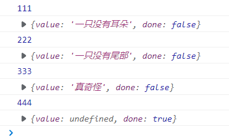

# 第一章 ECMASript6新特性

## 1.1 let关键字

- let用来声明变量，但是它无法重复声明（var可以）
- 块级作用域：{}、if、else、while、for
- 不存在变量提升，即不允许在变量的声明之前去使用该变量
- 不影响作用域链

```js
{
    let school = '尚硅谷';
    function fn() {
        console.log(school);
    }
    fn(); // 输出尚硅谷
}
```

- 实战：**最好实战中都使用let，而不是var**

```html
<div>
    <div class="item"></div>
    <div class="item"></div>
    <div class="item"></div>
</div>
<script>
	let items = document.getElementsByClassName('item');
    for (var i = 0; i < items.length; i++) {
        items[i].onclick = function() {
            items[i].style.backgroud = 'pink';
            // 发现修改不了，是因为var是全局的变量，页面一加载的时候就执行完循环，绑定好事件了。
            // 此时的i就已经是3了，当点击的时候，就会出现数组越界
            // 如果将var i = 0 改为 let i = 0 就没有这个问题 
        }
    }
</script>
```

## 1.2 const常量

- 一定要赋初始值
- 一般常量使用大写（潜规则）
- 常量值不能修改
- 块级作用域
- 不允许重复声明
- 对于数组和对象的元素修改，不算做对常量的修改，不会报错
- **声明对象类型使用const，非对象类型声明使用let**

## 1.3 变量的解构赋值

ES6中允许按照一定模式从数组和对象中提取值，对变量进行赋值，这被称为解构赋值

- 数组的解构

```js
const F4 = ['小沈阳','刘能','赵四','宋小宝'];
let [xiao, liu, zhao, song] = F4;
// 这样let声明的数组中各个元素的值和F4相对应
```

- 对象的解构

```js
const zhao = {
    name: '赵本山',
    age: '不详',
    xiaopin: function(){
        console.log("我可以演小品");
    }
};
let {name, age, xiaopin} = zhao;
xiaopin(); // 能调用，就不需要zhao.xiaopin()了
```

- 复杂解构

```js
let wangfei = { 
    name: '王菲', 
    age: 18, 
    songs: ['红豆', '流年', '暧昧', '传奇'], 
    history: [ 
        {name: '窦唯'}, 
        {name: '李亚鹏'}, 
        {name: '谢霆锋'} 
    ] };
let {songs: [one, two, three], history: [first, second, third]} = wangfei;
```

- **频繁使用对象方法、数组元素就可以使用解构赋值方式**

## 1.4 模板字符串

template string是增强版的字符串，用反引号标识

- 字符串中可以出现换行符
- 可以使用${xxx}形式输出变量

```js
// 定义字符串
let str = `<ul>
		<li>aaa</li>
		<li>bbb</li>
	</ul>`;
// 变量拼接
let star = '王宁';
let result = `${star}在前几年离开了开心麻花`;
```

**当遇到字符串与变量拼接的情况可以使用模板字符串**

## 1.5 简化对象写法

ES6允许在大括号里面，直接写入变量和函数，作为对象的属性和方法。这样的书写更加简洁，但是需要同名

```js
let name = '尚硅谷'; 
let slogon = '永远追求行业更高标准'; 
let improve = function () { 
    console.log('可以提高你的技能');
} 
//属性和方法简写 
let atguigu = { 
    name,
    slogon,
    improve,
    change() { 
        console.log('可以改变你') 
    } 
};
```

## 1.6 箭头函数

- 通用写法

```js
let fun = (arg1, arg2, arg3) => {
	return arg1 + arg2 + arg3;
}
```

- 如果形参只有一个，则小括号可以省略
- 函数体如果只有一条语句，则花括号可以省略，函数的返回值作为该条语句的执行结果
- **箭头函数this指向声明时所在作用域下this的值**
- 箭头函数不能作为构造函数实例化

```js
let Person = (name, age) => {
    this.name = name;
    this.age = age;
}
let me = new Person('xiao', 30);
console.log(me); // 会报错
```

- 不能使用arguments
- 箭头函数适合与this无关的回调：定时器、数组的方法回调
- 箭头函数不适合与this有关的回调：DOM事件回调、对象的方法

```js
let ad = document.getElementById('ad');
// 绑定事件
ad.addEventListener("click", function() {
    // 保存this的值
    // let _this = this
    // 定时器
    setTimeout(() => {
        // 如果定时器不适用箭头函数，就得保存上一级的this
        // _this.style.background = 'pink';
        this.style.background = 'pink';
    })
})
```

## 1.7 rest参数

用于获取函数的实参，用来代替arguments，非常适用于不定个数参数函数的场景

```js
function add(...args) {
    console.log(args);
}
add(1, 2, 3, 4, 5);
```

## 1.8 spread扩展运算符

它也是三个点，相当于rest参数的逆运算，将一个数组转换为用逗号分割的参数序列，对数组进行解包

```js
let test = ['aaa', 'bbb', 'ccc'];
function fn() {
    console.log(arguments);
}
fn(...test); // 相当于fn('aaa', 'bbb', 'ccc');
```

## 1.9 Symbol

ES6引入了新的原始数据类型Symbol，表示独一无二的值。它是JS语言的第七种数据类型，是一种类似于字符串的数据类型

- Symbol的值是唯一的，用来解决命名冲突问题
- Symbol的值不能与其他数据进行运算
- Symbol定义的对象属性不能使用for...in 循环遍历，但是可以使用Reflect.ownKeys来获取对象的所有键名

```js
// 创建Symbol
let s = Symbol();

let s2 = Symbol('尚硅谷');
let s3 = Symbol('尚硅谷');
console.log(s2 === s3) // false
//Symbol.for 创建
let s4 = Symbol.for('尚硅谷');
let s5 = Symbol.for('尚硅谷');
console.log(s4 === s5) // true
```

Symbol除了定义自己使用的Symbol值以外，ES6还提供了11个内置的Symbol值，指向语言内部使用的方法。可以称这些方法为魔术方法，因为它们会在特定的场景下自动执行

| 名字                      | 作用                                                         |
| ------------------------- | ------------------------------------------------------------ |
| Symbol.hasInstance        | 当其他对象使用instanceof运算符，判断是否为该对象的实例时，会调用这个方法 |
| Symbol.isConcatSpreadable | 对象的<Symbol.isConcatSpreadable属性等于的是一个布尔值，表示该对象用于 Array.prototype.concat()时，是否可以展开。 |
| Symbol.species            | 创建衍生对象时，会使用该属性                                 |
| Symbol.match              | 当执行str.match(myObject) 时，如果该属性存在，会调用它，返回该方法的返回值。 |
| Symbol.replace            | 当该对象被str.replace(myObject)方法调用时，会返回该方 法的返回值。 |
| Symbol.search             | 当该对象被str. search (myObject)方法调用时，会返回该方法的返回值。 |
| Symbol.split              | 当该对象被str. split (myObject)方法调用时，会返回该方法的返回值。 |
| Symbol.iterator           | 对象进行for...of循环时，会调用 Symbol.iterator方法，返回该对象的默认遍历器 |
| Symbol.toPrimitive        | 该对象被转为原始类型的值时，会调用这个方法，返回该对象对应的原始类型值。 |
| Symbol. toStringTag       | 在该对象上面调用toString方法时 ，返回该方法的返回值          |
| Symbol. unscopables       | 该对象指定了使用with关键字时，哪些属性会被 with环境排除。    |

## 1.10 迭代器

遍历器（Iterator）就是一种机制。它是一种接口，为各种不同的数据结构提供统一的访问机制。任何数据结构只要部署Iterator接口，就可以完成遍历操作。

- ES6创造了一种新的遍历命令for...of循环，Iterator接口主要供for...of消费
- 原生具备iterator接口的数据：Array、Arguments、Set、Map、String、TypedArray、NodeList
- 工作原理：
  - 创建一个指针对象，指向当前数据结构的起始位置
  - 第一次调用对象的next方法，指针自动指向数据结构的第一个成员
  - 接下来不断调用next方法，指针一直往后移动，直到指向最后一个成员
  - 每调用next方法返回一个包含value和done属性的对象

## 1.11 生成器

生成器函数是ES6提供的一种异步编程解决方案，语言行为与传统函数完全不同

```js
function * gen(){
    console.log(111);
    yield '一只没有耳朵';
    console.log(222);
    yield '一只没有尾部';
    console.log(333);
    yield '真奇怪';
    console.log(444);
}

let iterator = gen();
console.log(iterator.next());
console.log(iterator.next());
console.log(iterator.next());
console.log(iterator.next());
```

输出结果如下图所示：



- *的位置没有限制
- 生成器函数返回的结果是迭代器对象，调用迭代器对象的next方法可以得到yield语句后的值
- yield相当于函数的暂停标记，也可以认为是函数的分隔符，每调用一次next方法，执行一段代码
- next方法可以传递实参，作为yield语句的返回值

**异步编程中使用生成器案例**

需求一：1s后控制台输出111，2s后输出222，3s后输出333

```js
// 回调地狱
setTimeout(() => {
    console.log(111);
    setTimeout(() => {
        console.log(222);
        setTimeout(() => {
            console.log(333);
        }, 3000);
    }, 2000);
}, 1000);

// 使用生成器函数
function one(){
    setTimeout(()=>{
        console.log(111);
        iterator.next();
    },1000)
}

function two(){
    setTimeout(()=>{
        console.log(222);
        iterator.next();
    },2000)
}

function three(){
    setTimeout(()=>{
        console.log(333);
        iterator.next();
    },3000)
}

function * gen(){
    yield one();
    yield two();
    yield three();
}

//调用生成器函数
let iterator = gen();
iterator.next();
```

需求二：模拟获取数据：用户数据、订单数据、商品数据，并按顺序获取，且含有关联

```js
function getUsers(){
    setTimeout(()=>{
        let data = '用户数据';
        //调用 next 方法, 并且将数据传入
        iterator.next(data);
    }, 1000);
}

function getOrders(){
    setTimeout(()=>{
        let data = '订单数据';
        iterator.next(data);
    }, 1000)
}

function getGoods(){
    setTimeout(()=>{
        let data = '商品数据';
        iterator.next(data);
    }, 1000)
}

function * gen(){
    let users = yield getUsers();
    let orders = yield getOrders();
    let goods = yield getGoods();
}

//调用生成器函数
let iterator = gen();
iterator.next();
```

## 1.12 Promise

详情见Promise相关笔记

## 1.13 Set

ES6提供了新的数据结构Set。它类似于数组，但是成员的值都是唯一的，集合实现了iterator接口，所以可以使用扩展运算符和for...of...进行遍历，集合的属性和方法：

1. size：返回集合的元素个数
2. add：增加一个新元素，返回当前集合
3. delete：删除元素，返回boolean值
4. has：检测集合中是否包含某个元素，返回boolean值
5. clear：清空集合，返回undefined

```js
//创建一个空集合 
let s = new Set();
//创建一个非空集合 
let s1 = new Set([1,2,3,1,2,3]); 
//集合属性与方法 
//返回集合的元素个数 
console.log(s1.size);
//添加新元素
console.log(s1.add(4)); 
//删除元素
console.log(s1.delete(1)); 
//检测是否存在某个值
console.log(s1.has(2)); 
//清空集合
console.log(s1.clear());
```

## 1.14 Map

ES6 提供了 Map 数据结构。它类似于对象，也是键值对的集合。 但是“键”的范围不限于字符串，各种类型的值（包括对象）都可以当作键。 Map也实现了iterator接口，所以可以使用『扩展运算符』和『 for…of…』进行遍历。Map的属性和方法：

- size 返回 Map的元素个数
- set 增加一个新元素，返回当前 Map
- get 返回键名对象的键值
- has 检测 Map中是否包含某个元素，返回 boolean值
- clear 清空集合，返回 undefined

```js
//创建一个空 map
let m = new Map();
//创建一个非空 map 
let m2 = new Map([
    ['name','尚硅谷'],
    ['slogon','不断提高行业标准']
]);

//属性和方法
//获取映射元素的个数 
console.log(m2.size);
//添加映射值
console.log(m2.set('age', 6)); 
//获取映射值
console.log(m2.get('age'));
//检测是否有该映射
console.log(m2.has('age'));
//清除
console.log(m2.clear());
```

## 1.15 class类

ES6提供了更接近传统语言的写法，引入了Class这个概念，作为对象的模板。通过class关键字，可以定义类。基本上，ES6的class可以看作只是一个语法糖，它的绝大部分功能，ES5都可以做到，新的class写法只是让对象原型的写法更加清晰、更像面向对象编程的语法而已

- class声明类
- constructor定义构造函数初始化
- extends继承父类
- super调用父级构造方法
- static定义静态方法和属性
- 父类方法可以重写

```js
//父类 
class Phone { 
    //构造方法 
    constructor(brand, color, price) { 
        this.brand = brand; 
        this.color = color; 
        this.price = price; 
    } 
    //对象方法 
    call() {
        console.log('我可以打电话!!!') 
    } 
} 
//子类 
class SmartPhone extends Phone { 
    constructor(brand, color, price, screen, pixel) {
        super(brand, color, price);
        this.screen = screen; 
        this.pixel = pixel; 
    } 
    //子类方法 
    photo(){ 
        console.log('我可以拍照!!'); 
    } 
    playGame(){ 
        console.log('我可以玩游戏!!'); 
    } 
    //方法重写
    call(){
        console.log('我可以进行视频通话!!'); 
    } 
    //静态方法
    static run(){
        console.log('我可以运行程序')
    } 
    static connect(){ 
        console.log('我可以建立连接') 
    } 
}

//实例化对象
const Nokia = new Phone('诺基亚', '灰色', 230); 
const iPhone6s = new SmartPhone('苹果', '白色', 6088, '4.7inch','500w');
//调用子类方法 
iPhone6s.playGame();
//调用重写方法 
iPhone6s.call();
//调用静态方法 
SmartPhone.run();
```

## 1.16 数值扩展

- ES6提供了二进制和八进制数值的新的写法，分别用0b和0o表示
- Number.isFinite()用来检查一个数值是否为有限的
- Number.isNaN()用来检查一个值是否为NaN
- ES6将全局方法parseInt和parseFloat移植到Number对象上面，使用不变
- Math.trunc用于去除一个数的小数部分，返回整数部分
- Number.isInteger()用来判断一个数值是否为整数

## 1.17 对象扩展

```js
// Object.is比较两个值是否严格相等，与===基本一致，但是还是有区别
console.log(Object.is(120, 120)); // true
console.log(Object.is(NaN, NaN)); // true
console.log(NaN === NaN); // false
// Object.assign 对象的合并，将源对象的所有可枚举属性，复制到目标对象
const config1 = {
    host: 'localhost',
    test: 'test'
};
const config2 = {
    host: 'http://atguigu.com',
    test2: 'test2'
}
// 最终输出的对象的host为atguigu、还含有test和test2
console.log(Object.assign(config1, config2)); 

// _proto_、setPrototypeOf、setPrototypeOf可以直接设置对象的原型
const school = {
    name: '尚硅谷'
}
const cities = {
    xiaoqu: ['北京','上海','深圳']
}
Object.setPrototypeOf(school, cities);
console.log(Object.getPrototypeOf(school));
console.log(school);
```

## 1.18 模块化

模块化是指将一个大的程序文件，拆分成许多小的文件，然后将小文件组合起来。

好处：防止命名冲突、代码复用、高维护性

模块功能主要由export和import构成，export用于规定模块的对外接口，import用于输入其他模块提供的功能

```js
// 1、分别暴露方式
export let school = '尚硅谷';
export function teach() {
    console.log("我们可以教给你开发技能");
}

// 2、统一暴露
let school = 'aaa';
function findJob() {
    ///
}
export {school, findJob};

// 3、默认暴露
export default {
    school: 'ATGUIGU',
    change: function() {
        ///
    }
}
```

引入暴露出来的功能

```html
<script type="module">
    // 1. 通用的导入方式
    // 引入 m1.js 模块内容
    import * as m1 from "./src/js/m1.js";
    //引入 m2.js 模块内容
    import * as m2 from "./src/js/m2.js";
    //引入 m3.js 
    import * as m3 from "./src/js/m3.js";

    // 2. 解构赋值形式
    import {school, teach} from "./src/js/m1.js";
    import {school as guigu, findJob} from "./src/js/m2.js";
    import {default as m3} from "./src/js/m3.js";

    // 3. 简便形式  针对默认暴露
    import m3 from "./src/js/m3.js";
    console.log(m3);
</script>
```

# 第二章 ECMASript7新特性

1. Array.prototype.includes用来检测数组中是否包含某个元素，返回布尔类型值
2. 在ES7中引入指数运算符**，用来实现幂运算，功能与Math.pow结果相同

```js
const mingzhu = ['西游记','红楼梦','三国演义','水浒传'];

//判断
console.log(mingzhu.includes('西游记'));
console.log(mingzhu.includes('金瓶梅'));

// **
console.log(2 ** 10);// 
console.log(Math.pow(2, 10));
```

# 第三章 ECMASript8新特性

## 3.1 async和await

这两种语法结合可以让异步代码像同步代码一样

async：它的返回值为promise对象，promise对象的结果由async函数执行的返回值决定

await：必须写在async函数中，它的右侧的表达式一般为promise对象；返回的是promise成功的值；如果await的promise失败了就会抛出异常，需要通过try...catch捕获处理

**一般用async和await结合来封装ajax请求**

```js
// 发送 AJAX 请求, 返回的结果是 Promise 对象
function sendAJAX(url) {
    return new Promise((resolve, reject) => {
        //1. 创建对象
        const x = new XMLHttpRequest();
        //2. 初始化
        x.open('GET', url);
        //3. 发送
        x.send();
        //4. 事件绑定
        x.onreadystatechange = function () {
            if (x.readyState === 4) {
                if (x.status >= 200 && x.status < 300) {
                    //成功啦
                    resolve(x.response);
                }else{
                    //如果失败
                    reject(x.status);
                }
            }
        }
    })
}

//promise then 方法测试
// sendAJAX("https://api.apiopen.top/getJoke").then(value=>{
//     console.log(value);
// }, reason=>{})

// async 与 await 测试  axios
async function main(){
    //发送 AJAX 请求
    let result = await sendAJAX("https://api.apiopen.top/getJoke");
    //再次测试
    let tianqi = await sendAJAX('https://www.tianqiapi.com/api/?version=v1&city=%E5%8C%97%E4%BA%AC&appid=23941491&appsecret=TXoD5e8P')
    console.log(tianqi);
}

main();
```

## 3.2 对象方法扩展

1. Object.values()方法返回一个给定对象的所有可枚举属性值的数组
2. Object.entries()方法返回一个给定对象自身可遍历属性[key, value]的数组
3. Object.getOwnPropertyDescriptors返回指定对象所有自身属性的描述对象

```js
//声明对象
const school = {
    name:"尚硅谷",
    cities:['北京','上海','深圳'],
    xueke: ['前端','Java','大数据','运维']
};

//获取对象所有的键
console.log(Object.keys(school));
//获取对象所有的值
console.log(Object.values(school));
//entries
console.log(Object.entries(school));
//创建 Map
const m = new Map(Object.entries(school));
console.log(m.get('cities'));

//对象属性的描述对象
console.log(Object.getOwnPropertyDescriptors(school));

const obj = Object.create(null, {
    name: {
        //设置值
        value: '尚硅谷',
        //属性特性
        writable: true,
        configurable: true,
        enumerable: true
    } 
});
```

