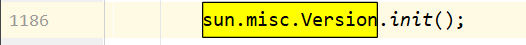
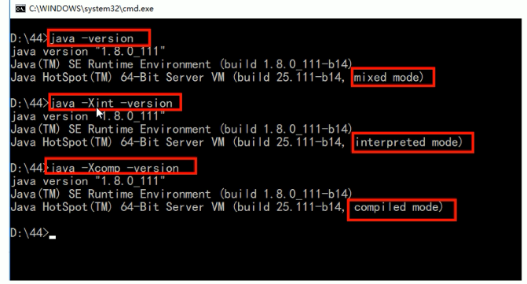
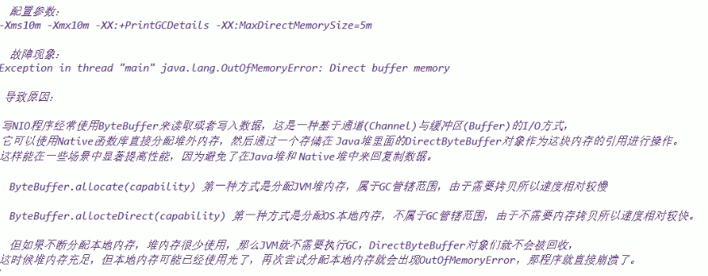
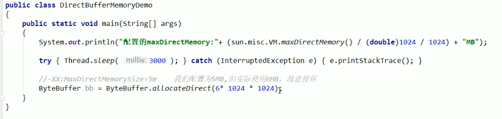
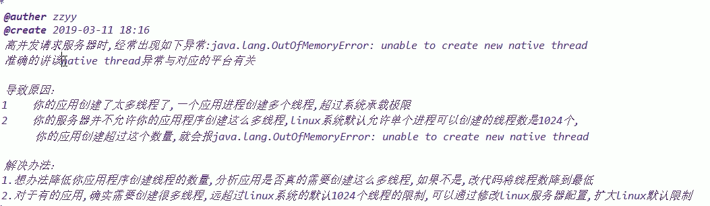
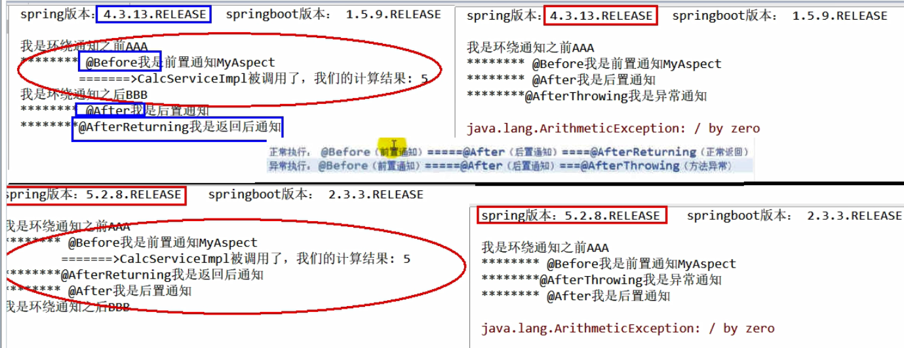
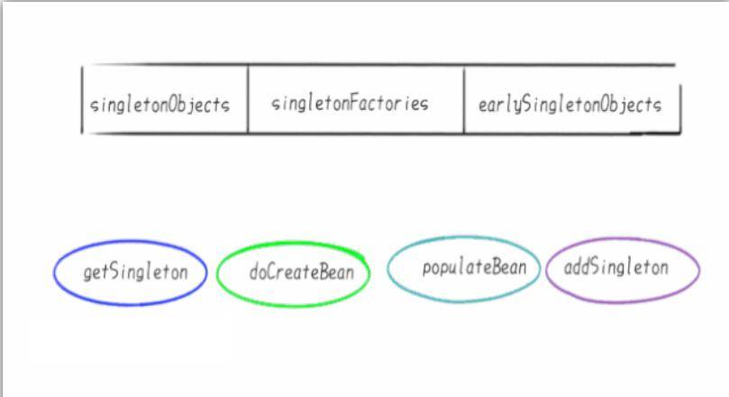

# 第一章 Java基础

```java
public class StringPool58Demo {
    public static void main(String[] args) {

        String str1 = new StringBuilder("58").append("tongcheng").toString();
        System.out.println(str1);
        System.out.println(str1.intern());
        System.out.println(str1 == str1.intern());

        System.out.println("------------");

        String str2 = new StringBuilder("ja").append("va").toString();
        System.out.println(str2);
        System.out.println(str2.intern());
        System.out.println(str2 == str2.intern());

    }
}
```

在JDK7及以后的结果： true false

**本人在Java14的情况下测试，都是true**

第一个true还可以理解，因为在jdk7之后将str1的内存地址写入了字符串常量池，但是第二个为false就难理解了

原因是有一个初始化的java字符串（JDK自带的），在加载sun.misc.Version这个类的时候进入常量池

System.java类中



Version类中

```java
private static final String launcher_name = "java";
private static final String java_version = "1.8.0_301";
private static final String java_runtime_name = "Java(TM) SE Runtime Environment";
private static final String java_profile_name = "";
private static final String java_runtime_version = "1.8.0_301-b09";
```

# 第二章、JVM

## 2.1 GC Roots

所谓垃圾就是内存中已经不再被使用到的空间，要进行垃圾回收，如何判断一个对象是否可以被回收，有两种算法，引用计数器和可达性分析算法

引用计数器：Java中,引用和对象是有关联的。如果要操作对象则必须用引用进行。因此,很显然一个简单的办法是通过引用计数来判断一个对象是否可以回收。简单说,给对象中添加一个引用计数器,每当有一个地方引用它,计数器值加1；每当有一个引用失效时,计数器值减1。任何时刻计数器值为零的对象就是不可能再被使用的,那么这个对象就是可回收对象，那为什么主流的Java虚拟机里面都没有选用这种算法呢?其中最主要的原因是它很难解决对象之间相互循环引用的问题，同时引用计数器本身也有一定的消耗

可达性分析算法：通过GC Roots作为起点，从这个被称为GC Roots的对象开始向下搜索，如果一个对象到GCRoots没有任何引用链相连时，则说明此对象不可用。

具体内容可以查看笔记《JVM--内存与垃圾回收篇》

## 2.2 JVM系统默认值

1. 标配参数：java -version、java -help、java -showversion

2. X参数：

   1. -Xint：解释执行
   2. -Xcomp：第一次使用就编译成本地代码
   3. -Xmixed：混合模式

   

3. XX参数

   Boolean类型：-XX: + 或者 - 某个属性值；+表示开启，-表示关闭

   ​		是否打印GC收集信息：-XX: +-PrintGCDetails

   ​		是否使用串行垃圾收集器：-XX: +-UseSerialGC

   KV设值类型：-XX：属性key = 属性value

   ​		-XX：MetaspaceSize = 128m

   jinfo举例，如何查看当前运行程序的配置：jinfo -flag （配置项） 进程编号

   -Xms：等价于-XX：InitialHeapSize，初始化堆内存

   -Xmx：等价于-XX：MaxHeapSize，最大堆内存

4. 查看JVM默认值

   查看初始默认值，`java -XX:+PrintFlagsInitial -version`

   `java -XX:+PrintFlagsFinal -version`：主要查看修改更新

   `java -XX:+PrintCommandLineFlags -version`：查看程序使用的默认JVM参数

## 2.3 常用基本配置参数

-Xms：初始堆大小内存，默认为物理内存的1/64

-Xmx：最大分配内存，默认为物理内存四分之一

-Xss：设置单个线程堆栈的大小，一般默认为512K到1024K，等价于-XX：ThreadStackSize

-Xmn：设置年轻代大小，一般使用默认值

-XX：MetaspaceSize，设置元空间大小，不管多少内存，元空间默认占用20多M

-XX：+PrintGCDetails，输出详细GC收集日志信息

-XX：SurivivoRatio：设置新生代中eden和S0、S1空间的比例，默认为8，即8：1：1

-XX：NewRatio：设置年轻代和老年代在堆结构的占比，默认为2，即新生代：老年代1：2

-XX：MaxTenuringThreshold，设置垃圾最大年龄，如果设置为0的话，则年轻代对象不经过Survivor区，直接进入年老代。对于年老代比较多的应用可以提高效率。如果将此值设置为一个较大值，则年轻代对象会在Survivor区进行多次复制，这样可以增加对象在年轻代的存活时间，增加在年轻代即被回收的概率

## 2.4 四种引用

1. 强引用：当内存不足，JVM开始垃圾回收，对于强引用对象，就算是出现了OOM也不会对该对象进行回收，死都不收。

   强引用是我们最常见的普通对象引用，只要还有强引用指向一个对象，就能表明该对象还活着，垃圾收集器不会碰这种对象。在Java中最常见的就是强引用，把一个对象赋给一个引用变量，这个引用变量就是强引用。当一个对象被强引用变量引用的时候，它处于可达状态，不可能会被垃圾回收机制回收，即使该对象以后永远都不会被用到。因此强引用是造成JVM内存泄漏的主要原因之一

2. 软引用：是一种相对强引用弱化了一些的引用，需要java.lang.ref.SoftReference类来实现，可以让对象豁免一些垃圾收集。**当系统内存充足时它不会被回收，否则就会被回收**，软引用通常用在对内存敏感的程序中，比如高速缓存。

3. 弱引用：需要java.lang.ref.WeakReference类来实现，对于只有弱引用的对象来说，只要垃圾回收机制一运行，不管JVM的内存空间是否足够，都会回收该对象的占用内存。

   【举例】

   假如一个应用需要读取大量的本地图片：如果每次读取图片都从硬盘读取则会严重影响性能；如果一次性全部加载到内存中又可能造成内存溢出，此时软引用就可以解决这个问题。

   【设计思路】

   用一个HashMap来保存图片的路径和相应图片对象关联的软引用之间的映射关系，在内存不足时JVM会自动回收这些缓存图片对象所占用的空间，从而有效避免了OOM

   `Map<String,SoftReference<Bitmap>> imageCache = new HashMap<String, SoftReference<Bitmap>>();`

4. 虚引用：要用java.lang.ref.PhantomReference类来实现。虚引用并不会决定对象的生命周期。**如果一个对象仅持有虚引用，那么它就和没有任何引用一样，在任何时候都可能被垃圾回收器回收**，他不能单独使用也不能通过它访问对象，虚引用必须和引用队列（ReferenceQueue）联合使用

   主要作用是跟踪对象被垃圾回收的状态。仅仅是提供了一种确保对象被finalize以后做某些事情的机制。PhantomReference的get方法总是返回null，因此无法访问对象的引用对象，其意义在于说明一个对象已经进入finalization阶段，可以被gc回收，用来实现比finalization机制更灵活的回收操作。

   换句话说，设置虚引用关联的唯一目的就是在这个对象被收集器回收的时候收到一个系统通知或者后续添加进一步的处理。Java技术允许使用finalize方法在垃圾收集器将对象从内存中清除出去之前做必要的清理工作

## 2.5 OOM

**java.lang.StackOverflowError**：栈溢出错误，深度的方法调用导致出不来栈，栈爆了

**Java.lang.OutOfMemoryError: Java heap space**：堆内存不够用，对象没地方放

**Java.lang.OutOfMemoryError:GC overhead limit exceeded**：程序在垃圾回收上花费了百分之九十八的时间，却回收不到百分之二的空间，如果不抛出该异常，GC清理的这一点内存很快就会被再次填满，迫使GC再次执行，造成恶性循环

**Java.lang.OOM:Direct buffer memory**：





**OOM: unable to create new nativee thread**：



```java
public static void main(Stirng[] args) {
    for (int i = 1; ; i++) {
        System.out.println("***** I = " + i);
        new Thead(() -> {
            try{ 
                Thread.sleep(Integer.MAX_VALUE); 
            } catch (InterruptedException e) { 
                e.printStackTrace();
            }
        },"" + i).start();
    }
}
```

**OOM: Metaspace**：元空间溢出

# 第三章 Spring

## 3.1 AOP顺序



## 3.2 循环依赖

> 1、解释下spring的三级缓存
>
> 2、三级缓存分别是什么？三个Map有什么异同
>
> 3、什么是循环依赖？看过Spring源码吗？一般我们说的spring容器是什么？
>
> 4、如何检测是否存在循环依赖？实际开发中见过循环依赖的异常吗？
>
> 5、多例的情况下，循环依赖问题为什么无法解决？

多个bean之间相互依赖，形成一个闭环，这就是循环依赖。通常来说，如果问spring容器内部如何解决循环依赖， 一定是指默认的单例Bean中，属性相互引用的场景，也就是说Spring的循环依赖是Spring容器注入时候出现的问题

AB循环依赖问题只要A的注入方式是setter且singleton，就不会有循环依赖问题

**构造器注入没有办法解决循环依赖**

```java
@Component
public class ServiceA {
    private ServiceB serviceB;
    public ServiceA(ServiceB serviceB) { this.serviceB = serviceB; }
}

@Component
public class ServiceB {
    private ServiceA serviceA;
    public ServiceB(ServiceA serviceA) { this.serviceA = serviceA; }
}

public class ClientConstructor {
    public static void main(String[] args) {
        new ServiceA(new ServiceB(new ServiceA(new ServiceB(...))));
    }
}
```

**只有单例的bean会通过三级缓存提前暴露来解决循环依赖问题，因为单例的时候只有一份，随时复用，那么就放到缓存里面；而多例的bean，每次从容器中获取都是一个新的对象，都会重新创建，所以非单例的bean是没有缓存的，不会将其放入三级缓存中**


所谓的三级缓存其实就是spring容器内部用来解决循环依赖问题的三个map

DefaultSingletonBeanRegistry

```java
/** Cache of singleton objects: bean name to bean instance. 
	第一级缓存，也叫单例池，存放已经经历了完整生命周期的Bean对象
*/
private final Map<String, Object> singletonObjects = new ConcurrentHashMap<>(256);

/** Cache of singleton factories: bean name to ObjectFactory. 
	第三级缓存，存放可以生成Bean的工厂
*/
private final Map<String, ObjectFactory<?>> singletonFactories = new HashMap<>(16);

/** Cache of early singleton objects: bean name to bean instance. 
	第二级缓存，存放早期暴露出来的Bean对象，Bean的生命周期未结束（属性还未填充完成）
*/
private final Map<String, Object> earlySingletonObjects = new HashMap<>(16);
```

**实例化**：堆内存中申请一块内存空间，租好房子，自己的家具东西还没有搬进去

**初始化属性填充**：完成属性的各种赋值，装修、家电进场

Spring解决循环依赖，靠的是三大缓存 + 四大方法

	

1. getSingleton：希望从容器里面获得单例的bean，没有的话
2. doCreateBean：没有就创建bean
3. populateBean：创建完了以后要填充属性
4. addSingleton：填充完了以后，再添加到容器中进行使用

**A/B两对象在三级缓存中的迁移说明**

1. A创建过程中需要B，于是A将自己放到三级缓存中，去实例化B
2. B实例化的时候发现需要A，于是B先查一级缓存，没有再查二级缓存，还是没有再查三级缓存，找到A，然后把三级缓存里面的这个A放到二级缓存里面，并删除三级缓存里面的A
3. B顺利初始化完成，将自己放到一级缓存中（此时B里面的A依然是创建中状态），然后回来接着创建A，此时B已经创建结束，直接从一级缓存里面拿到B，然后完成创建，并将A自己放到一级缓存里面

Spring创建bean主要分为两个步骤，创建原始bean对象，接着去填充对象属性和初始化。Spring解决循环依赖依靠的是Bean的**中间态**这个概念，而这个中间态指的是**已经实例化但还没初始化的状态**，也就是半成品。


1. 调用doGetBean()方法，想要获取beanA，于是调用getSingleton()方法从缓存中查找beanA
2. 在getSingleton()方法中，从一级缓存中查找，没有，返回null
3. doGetBean()方法中获取到的beanA为null，于是走对应的处理逻辑，调用getSingleton()的重载方法（参数为ObjectFactory的)
4. 在getSingleton()方法中，先将beanA_name添加到一个集合中，用于标记该bean正在创建中。然后回调匿名内部类creatBean方法
5. 进入AbstractAutowireCapableBeanFactory#doCreateBean，先反射调用构造器创建出beanA的实例，然后判断。是否为单例、是否允许提前暴露引用(对于单例一般为true)、是否正在创建中〈即是否在第四步的集合中)。判断为true则将beanA添加到【三级缓存】中
6. 对beanA进行属性填充，此时检测到beanA依赖于beanB，于是开始查找beanB
7. 调用doGetBean()方法，和上面beanA的过程一样，到缓存中查找beanB，没有则创建，然后给beanB填充属性
8. 此时beanB依赖于beanA，调用getsingleton()获取beanA，依次从一级、二级、三级缓存中找，此时从三级缓存中获取到beanA的创建工厂，通过创建工厂获取到singletonObject，此时这个singletonObject指向的就是上面在doCreateBean()方法中实例化的beanA
9. 这样beanB就获取到了beanA的依赖，于是beanB顺利完成实例化，并将beanA从三级缓存移动到二级缓存中
10. 随后beanA继续他的属性填充工作，此时也获取到了beanB，beanA也随之完成了创建，回到getsingleton()方法中继续向下执行，将beanA从二级缓存移动到一级缓存中

# 第四章 Redis

## 4.1 传统五大基本类型落地应用

### 4.1.1 String

商品编号、订单号采用INCR命令生成

INCR items: 1

是否喜欢的文章：同样也是使用INCR命令自增实现

### 4.1.2 hash

相当于Java里面的Map<String, Map<Object, Object>>

可以用来实现早期的购物车，当前小中厂可用

```redis
新增商品	hset shopcar:uid1024 334488 1 // 用户1024的334488号商品添加一件到购物车
新增商品	hset shopcar:uid1024 334477 1
增加商品数量	hincrby shopcar:uid1024 334477 1
商品总数	hlen shopcar:uid1024
全部选择	hgetall shopcar:uid1024
```

### 4.1.3 list

微信文章订阅公众号

```
比如A和B两个公众号分别发了两篇文章，为11和22
C关注了A和B，只要他们发布了新文章，就会安装到C的list里面
lpush likearticle:CID 11 22
查看C的号订阅的全部文章，类似分页
lrange likearticle:CID 0 10 // 一次显示10条
```

### 4.1.4 set

微信抽奖小程序

1、用户Id，立即参与按钮：sadd key 用户ID

2、显示已经有多少人参与了：SCARD key

3、抽奖，从set中任意选N个中奖人：SRANDMEMBER key 2 随机抽2个人，元素不删除；SPOP key 3 随机抽3个人，元素删除

微信朋友圈点赞

1. 新增点赞	sadd pub:msgID ID1 ID2
2. 取消点赞    srem pub:msgId ID
3. 展现所有点赞过的用户：SMEMBERS pub:msgID
4. 点赞用户数统计：scard pub:msgID
5. 判断某个朋友是否对楼主点赞过：SISMEMBER pub:msgID ID

微博好友关注社交关系之共同关注的人 SINTER s1 s2

微博好友关注社交关系之我关注的人也关注他 SISMEMBER s1 3 // 看s1中是否有3

QQ内推可能认识的人	SDIFF s1 s2

### 4.1.5 zset

有序集合

抖音热搜

1、点击视频	ZINCRBY hotvcr:20200919 1 八佰；ZINCRBY hotvcr:20200919 15 八佰 2 花木兰

2、展示当前排行前10条	ZREVRANGE hotvcr:20200919 0 9 withscores

## 4.2 分布式锁

对于一个秒杀功能来说，可以一步步优化

1. 如果是单机版，可以用synchronized来解决并发问题，但是在分布式系统中，因为竞争的线程可能不再同一个节点中（同一个JVM上），所以需要一个让所有进程都能访问到的锁来实现，比如redis或zookeeper来构建。

   ```java
   @GetMapping("/buy_goods")
   public String buy_Goods(){
       synchronized (this) {
           String result = stringRedisTemplate.opsForValue().get("goods:001");
           int goodsNumber = result == null ? 0 : Integer.parseInt(result);
   
           if (goodsNumber > 0){
               int realNumber = goodsNumber - 1;
               stringRedisTemplate.opsForValue().set("goods:001",realNumber + "");
               System.out.println("成功秒杀还剩余：" + realNumber);
               return "成功秒杀还剩余：" + realNumber;
           }else {
               System.out.println("商品已经售罄/活动结束/调用超时，欢迎下次光临");
           }
           return "商品已经售罄/活动结束/调用超时，欢迎下次光临";
       }
   }
   ```

2. 此时我们如果使用nginx进行分布式微服务架构，那么synchronized就不够用了，需要上redis分布式锁setnx

3. 但是如果出现了异常的话，可能无法释放锁，就必须在代码层面finally释放锁

4. 如果部署了微服务jar包的机器宕机了，代码层面根本没走到finally这块，没办法保证解锁，这个key没有删除，需要加入一个过期时间限定key

5. 设置key + 过期时间应该保证原子性

6. 必须规定只能自己删除自己的锁，不能将别人的锁给删除了

   ```java
   public static final String REDIS_LOCK_KEY = "lockdlf";
   
   @GetMapping("/buy_goods")
   public String buy_Goods(){
   
       String value = UUID.randomUUID().toString()+Thread.currentThread().getName();
       try{
           //setIfAbsent() == setnx 就是如果不存在就新建，同时加上过期时间保证原子性
           Boolean lockFlag = stringRedisTemplate.opsForValue().setIfAbsent(REDIS_LOCK_KEY, value,10L, TimeUnit.SECONDS);
           if (!lockFlag) {
               return "抢锁失败，┭┮﹏┭┮";
           }else {
               String result = stringRedisTemplate.opsForValue().get("goods:001");
               int goodsNumber = result == null ? 0 : Integer.parseInt(result);
   
               if (goodsNumber > 0){
                   int realNumber = goodsNumber - 1;
                   stringRedisTemplate.opsForValue().set("goods:001",realNumber + "");
                   System.out.println("成功秒杀剩余：" + realNumber);
                   return "成功秒杀剩余：" + realNumber;
               }else {
                   System.out.println("商品已经售罄/活动结束/调用超时，欢迎下次光临");
               }
               return "商品已经售罄/活动结束/调用超时，欢迎下次光临";
           }
       }finally {
           if (value.equalsIgnoreCase(stringRedisTemplate.opsForValue().get(REDIS_LOCK_KEY))){
               stringRedisTemplate.delete(REDIS_LOCK_KEY);//释放锁
           }
       }
   }
   ```

7. 在finally里面，判断和删除应该保证原子性，这里可以用redis自身的事务，或者lua脚本

   使用redis自身的事务：

   ```java
   while (true) {
       stringRedisTemplate.watch(REDIS_LOCK_KEY); //加事务，乐观锁
       if (value.equalsIgnoreCase(stringRedisTemplate.opsForValue().get(REDIS_LOCK_KEY))){
           stringRedisTemplate.setEnableTransactionSupport(true);
           stringRedisTemplate.multi();//开始事务
           stringRedisTemplate.delete(REDIS_LOCK_KEY);
           List<Object> list = stringRedisTemplate.exec();
           if (list == null) {  //如果等于null，就是没有删掉，删除失败，再回去while循环那再重新执行删除
               continue;
           }
       }
       //如果删除成功，释放监控器，并且breank跳出当前循环
       stringRedisTemplate.unwatch();
       break;
   }
   ```

   使用lua脚本

   ```java
   Jedis jedis = RedisUtils.getJedis();
   
   String script = "if redis.call('get', KEYS[1]) == ARGV[1]"+"then "
       +"return redis.call('del', KEYS[1])"+"else "+ "  return 0 " + "end";
   try{
       Object result = jedis.eval(script, Collections.singletonList(REDIS_LOCK_KEY), Collections.singletonList(value));
       if ("1".equals(result.toString())){
           System.out.println("------del REDIS_LOCK_KEY success");
       }else {
           System.out.println("------del REDIS_LOCK_KEY error");
       }
   }finally {
       if (null != jedis){
           jedis.close();
       }
   }
   ```

   ```java
   // RedisUtils
   public class RedisUtils {
       private static JedisPool jedisPool;
       static {
           JedisPoolConfig jedisPoolConfig = new JedisPoolConfig();
           jedisPoolConfig.setMaxTotal(20);
           jedisPoolConfig.setMaxIdle(10);
          
           jedisPool = new JedisPool(jedisPoolConfig,"ip",6379,100000);
       }
   
       public static Jedis getJedis() throws Exception{
           if (null!=jedisPool){
               return jedisPool.getResource();
           }
           throw new Exception("Jedispool is not ok");
       }
   }
   ```

8. 但是还得确保redisLock的过期时间要大于业务执行时间，即redis分布式锁如何续期？集群模式下，如果redis异步赋值造成锁丢失，比如：主节点没来的及把刚刚set进来的这条数据给从节点就宕机了，就得上Redisson解决

   ```java
   public static final String REDIS_LOCK_KEY = "lockhhf";
   
   @Autowired
   private Redisson redisson;
   
   @GetMapping("/buy_goods")
   public String buy_Goods(){
   
       String value = UUID.randomUUID().toString()+Thread.currentThread().getName();
   
       RLock redissonLock = redisson.getLock(REDIS_LOCK_KEY);
       redissonLock.lock();
       try{
           String result = stringRedisTemplate.opsForValue().get("goods:001");
           int goodsNumber = result == null ? 0 : Integer.parseInt(result);
   
           if (goodsNumber > 0){
               int realNumber = goodsNumber - 1;
               stringRedisTemplate.opsForValue().set("goods:001",realNumber + "");
               System.out.println("成功秒杀剩余：" + realNumber);
               return "成功秒杀剩余：" + realNumber;
           }else {
               System.out.println("商品已经售罄/活动结束/调用超时，欢迎下次光临");
           }
           return "商品已经售罄/活动结束/调用超时，欢迎下次光临";
       }finally {
           //还在持有锁的状态，并且是当前线程持有的锁再解锁
           if (redissonLock.isLocked() && redissonLock.isHeldByCurrentThread()){
               redissonLock.unlock();
           }
       }
   }
   ```

   ```java
   @Bean
   public Redisson redisson(){
       Config config = new Config();
       config.useSingleServer().setAddress("redis://"+redisHost+":6379").setDatabase(0);
       return (Redisson) Redisson.create(config);
   }
   ```

   

## 4.3 缓存过期淘汰策略

> 1. 生产上你们的redis内存设置多少？
> 2. 如何配置、修改redis的内存大小
> 3. 如果内存满了你怎么办
> 4. redis清理内存的方式？定期删除和惰性删除你了解过吗
> 5. redis缓存淘汰策略

### 4.3.1 redis内存满了怎么办

查看Redis最大占用内存：打开redis配置文件，设置maxmemory参数，它是bytes字节类型，注意转换

如果不设置最大内存大小或者设置最大内存大小为0，**在64位操作系统下不限制内存大小**，在32位操作系统下最多使用3GB内存

一般生产上推荐redis设置内存为最大物理内存的四分之三

可以通过配置redis配置文件来修改redis内存，也可以通过命令修改：config set maxmemory 104857600；config get maxmemory

使用info memory命令查看redis内存使用情况

如果redis内存使用超出了设置的最大值，就会在redis里面报(error) OOM conmand not allowed when used memeory > 'maxmemory'。

### 4.3.2 缓存淘汰策略

redis过期键的删除策略：如果一个键是过期的，它到过期时间之后不会马上就从内存中被删除

**三种不同的删除策略**

1. 定时删除：redis不可能时时刻刻遍历所有被设置了生存时间的key，来检测数据是否已经到达过期时间，然后对它进行删除。立即删除能保证内存中数据的最大新鲜度，因为它保证过期键值会在过期后马上被删除，其所占用的内存也会随之释放。但是立即删除对cpu是最不友好的。因为删除操作会占用cpu的时间，如果刚好碰上了cpu很忙的时候，比如正在做交集或排序等计算的时候就会给cpu造成额外的压力。**这会产生大量的性能消耗，同时也会影响数据的读取操作**

2. 惰性删除：数据到达过期时间不做处理，等下次访问该数据时，如果未过期返回数据，过期了就删除，返回不存在。惰性策略的缺点是它对内存是最不友好的。如果一个键已经过期，而这个键又仍然保留在数据库中，那么只要这个过期键不被删除，它所占用的内存就不会释放。在使用惰性删除策略时，如果数据库中有非常多的过期键，而这些过期键又恰好没有被访问到的话，那么它们也许永远不会被删除（除非用户手动执行FLUSHDB），我们甚至可以将这种情况看作是一种内存泄漏--无用的垃圾数据占用了大量的内存，而服务器却不会自己去释放他们，这对于运行状态非常依赖于内存的reids服务器来说肯定不是一个好消息

3. 定期删除：定期删除策略是前两种策略的折中：定期删除策略**每隔一段时间执行一次删除过期键操作**，并通过限制删除操作执行的时长和频率来减少删除操作对CPU的影响。周期性轮询redis库中的时效性数据，采用随机抽取的策略，利用过期数据占比的方式控制删除频度。

   - 特点1：CPU性能占用设置有峰值，检测频度可自定义设置
   - 特点2：内存压力不是很大，长期占用内存的冷数据会被持续清理
   - 总结：周期性抽查存储空间（随机抽查，重点抽查）

   定期删除策略的难点是确定删除操作执行的时长和频率：如果删除操作执行得太频繁，或者执行的时间太长，定期删除策略就会退化成定时删除策略，以至于将CPU时间过多地消耗在删除过期键上面。如果删除操作执行得太少，或者执行的时间太短，定期删除策略又会和惰性删除束略一样，出现浪费内存的情况。因此，如果采用定期删除策略的话，服务器必须根据情况，合理地设置删除操作的执行时长和执行频率。

**内存淘汰策略**

1. noeviction：不会驱逐任何key
2. allkeys-lru：对所有key使用LRU算法进行删除
3. volatile-lru：对所有设置了过期时间的key使用LRU算法进行删除
4. allkeys-random：对所有key随机删除
5. volatile-random：对所有设置了过期时间的key随机删除
6. volatile-ttl：删除马上要过期的key
7. allkeys-lfu：对所有key使用LFU算法进行删除
8. volatile-lfu：对所有设置了过期时间的key使用LFU算法进行删除

配置内存淘汰策略：config set maxmemory-policy allkeys-lru

配置文件：maxmemory-policy allkeys-lru

## 4.4 LRU算法

LRU是Least Recently Used的缩写，是一种常见的页面置换算法，选择最近最久未使用的数据予以淘汰

**设计思想**

1. 所谓缓存，必须要有读+写两个操作，按照命中率的思路考虑，写操作+读操作时间复杂度都需要为O（1）
2. 特性要求分析
   1. 必须有顺序之分，以区分最近使用和很久没用到的数据排序
   2. 写和读操作一次搞定
   3. 如果容量（坑位）满了要删除最不常用的数据，每次新访问还要把新的数据插入到队头

LRU的核心算法就是哈希链表，本质就是HashMap + DoubleLinkedList

依赖JDK来实现LRU

```java
public class LRUCacheDemo<K,V> extends LinkedHashMap<K, V> {
    
    private int capacity;//缓存坑位
    
    /*	accessOrder the ordering mode
    	true -- for access-order 访问顺序
    	false -- for insertion-order 插入顺序*/
    public LRUCacheDemo(int capacity) {
        super(capacity,0.75F,false);
        this.capacity = capacity;
    }

    // 配置移出规则
    @Override
    protected boolean removeEldestEntry(Map.Entry<K, V> eldest) {
        return super.size() > capacity; }

    public static void main(String[] args) {
        LRUCacheDemo lruCacheDemo = new LRUCacheDemo(3);

        lruCacheDemo.put(1,"a");
        lruCacheDemo.put(2,"b");
        lruCacheDemo.put(3,"c");
        System.out.println(lruCacheDemo.keySet());

        lruCacheDemo.put(4,"d");
        System.out.println(lruCacheDemo.keySet());

        lruCacheDemo.put(3,"c");
        System.out.println(lruCacheDemo.keySet());
        lruCacheDemo.put(3,"c");
        System.out.println(lruCacheDemo.keySet());
        lruCacheDemo.put(3,"c");
        System.out.println(lruCacheDemo.keySet());
        lruCacheDemo.put(5,"x");
        System.out.println(lruCacheDemo.keySet());
    }
}

/**
 * true			false
 * [1, 2, 3] [1, 2, 3]
 * [2, 3, 4] [2, 3, 4]
 * [2, 4, 3] [2, 3, 4]
 * [2, 4, 3] [2, 3, 4]
 * [2, 4, 3] [2, 3, 4]
 * [4, 3, 5] [3, 4, 5]
 * */
```

不依赖JDK，手写

```java
public class LRUCacheDemo{
	//map负责查找，构建一个虚拟的双向链表，它里面安装的就是一个个Node节点，作为数据载体。

    //1.构造一个node节点作为数据载体
    class Node<K, V> {
        K key;
        V value;
        Node<K,V> prev;
        Node<K,V> next;

        public Node(){
            this.prev = this.next = null;
        }

        public Node(K key, V value) {
            this.key = key;
            this.value = value;
            this.prev = this.next = null;
        }

    }

    //2 构建一个虚拟的双向链表,,里面安放的就是我们的Node
    class DoubleLinkedList<K, V> {
        Node<K, V> head;
        Node<K, V> tail;

        public DoubleLinkedList(){
            head = new Node<>();
            tail = new Node<>();
            head.next = tail;
            tail.prev = head;
        }

        //3. 添加到头
        public void addHead(Node<K,V> node) {
            node.next = head.next;
            node.prev = head;
            head.next.prev = node;
            head.next = node;
        }

        //4.删除节点
        public void removeNode(Node<K, V> node) {
            node.next.prev = node.prev;
            node.prev.next = node.next;
            node.prev = null;
            node.next = null;
        }

        //5.获得最后一个节点
        public Node getLast() {
            return tail.prev;
        }
    }

    private int cacheSize;
    Map<Integer,Node<Integer,Integer>> map;
    DoubleLinkedList<Integer,Integer> doubleLinkedList;

    public LRUCacheDemo(int cacheSize) {
        this.cacheSize = cacheSize;//坑位
        map = new HashMap<>();//查找
        doubleLinkedList = new DoubleLinkedList<>();
    }

    public int get(int key){
        if (!map.containsKey(key)){
            return -1;
        }

        Node<Integer, Integer> node = map.get(key);
        doubleLinkedList.removeNode(node);
        doubleLinkedList.addHead(node);

        return node.value;
    }

    public void put(int key, int value) {
        if (map.containsKey(key)){  //update
            Node<Integer, Integer> node = map.get(key);
            node.value = value;
            map.put(key, node);

            doubleLinkedList.removeNode(node);
            doubleLinkedList.addHead(node);
        }else {
            if (map.size() == cacheSize) { // 坑位满了
                Node<Integer,Integer> lastNode = doubleLinkedList.getLast();
                map.remove(lastNode.key);
                doubleLinkedList.removeNode(lastNode);
            }

            //新增一个
            Node<Integer, Integer> newNode = new Node<>(key, value);
            map.put(key,newNode);
            doubleLinkedList.addHead(newNode);

        }
    }

    public static void main(String[] args) {

        LRUCacheDemo lruCacheDemo = new LRUCacheDemo(3);

        lruCacheDemo.put(1,1);
        lruCacheDemo.put(2,2);
        lruCacheDemo.put(3,3);
        System.out.println(lruCacheDemo.map.keySet());

        lruCacheDemo.put(4,1);
        System.out.println(lruCacheDemo.map.keySet());

        lruCacheDemo.put(3,1);
        System.out.println(lruCacheDemo.map.keySet());
        lruCacheDemo.put(3,1);
        System.out.println(lruCacheDemo.map.keySet());
        lruCacheDemo.put(3,1);
        System.out.println(lruCacheDemo.map.keySet());
        lruCacheDemo.put(5,1);
        System.out.println(lruCacheDemo.map.keySet());
    }
}
```

