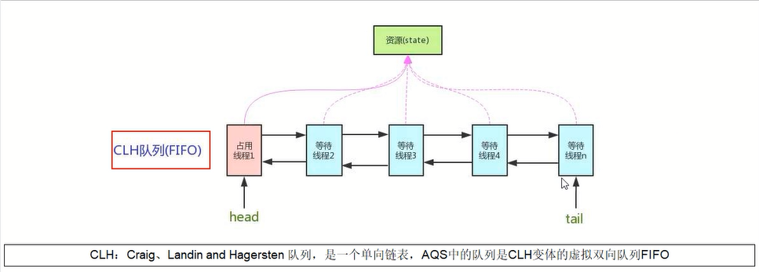
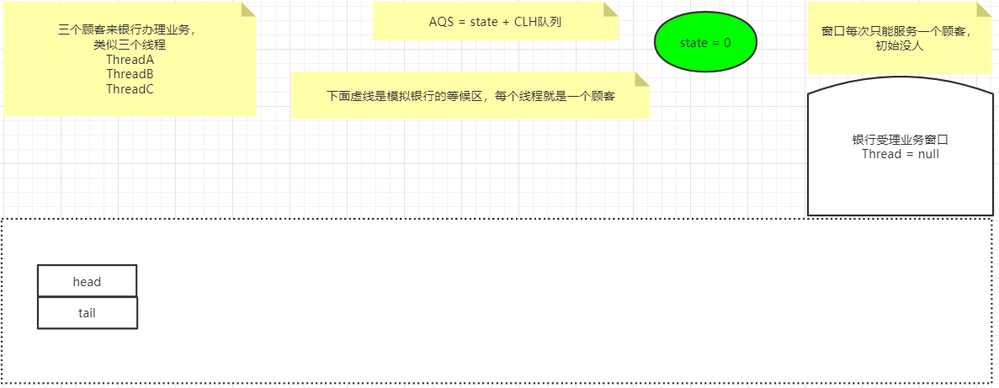
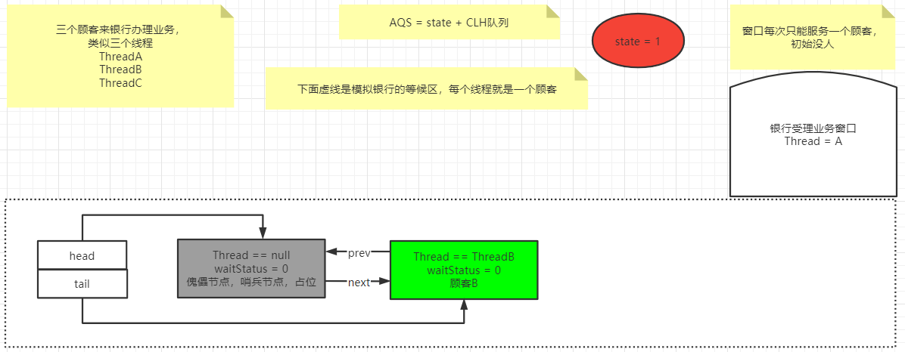
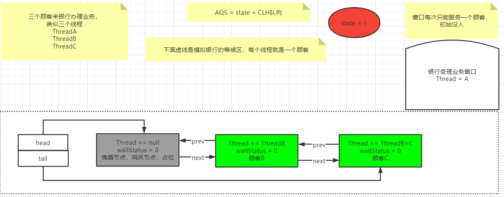
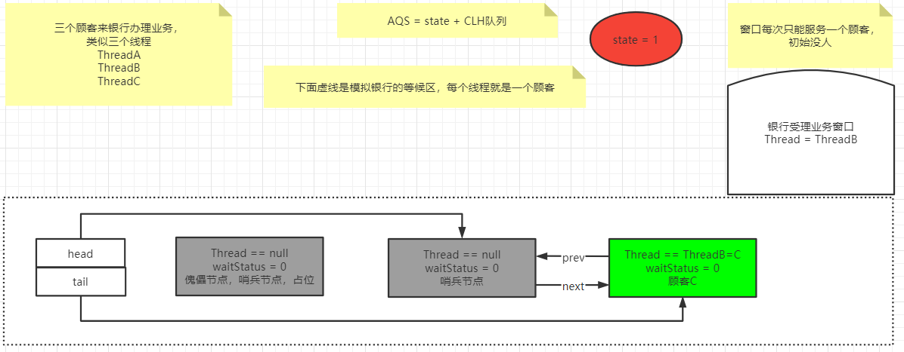

# 第一章 Java基础

```java
public class StringPool58Demo {
    public static void main(String[] args) {

        String str1 = new StringBuilder("58").append("tongcheng").toString();
        System.out.println(str1);
        System.out.println(str1.intern());
        System.out.println(str1 == str1.intern());

        System.out.println("------------");

        String str2 = new StringBuilder("ja").append("va").toString();
        System.out.println(str2);
        System.out.println(str2.intern());
        System.out.println(str2 == str2.intern());

    }
}
```

在JDK7及以后的结果： true false

**本人在Java14的情况下测试，都是true**

第一个true还可以理解，因为在jdk7之后将str1的内存地址写入了字符串常量池，但是第二个为false就难理解了

原因是有一个初始化的java字符串（JDK自带的），在加载sun.misc.Version这个类的时候进入常量池

System.java类中


Version类中

```java
private static final String launcher_name = "java";
private static final String java_version = "1.8.0_301";
private static final String java_runtime_name = "Java(TM) SE Runtime Environment";
private static final String java_profile_name = "";
private static final String java_runtime_version = "1.8.0_301-b09";
```

# 第二章 JUC

## 2.1 可重入锁的实现机理

**每个锁对象拥有一个锁计数器和一个指向持有该锁的线程的指针**

当执行monitorenter时，如果目标锁对象的计数器为零，那么说明它没有被其他线程所持有，Java虚拟机会将该锁对象的持有线程设置为当前线程，并且将其计数器加1（后面会讲源码）

在目标锁对象的计数器不为零的情况下，如果锁对象的持有线程是当前线程，那么Java虚拟机可以将其计数器加1，否则需要等待，直到持有线程释放该锁

当执行monitorexit时，Java虚拟机则需将锁对象的计数器减1，计数器为零代表锁已经被释放

## 2.2 LockSupport

LockSupport是用来创建锁和其他同步类的基本线程阻塞原语

LockSupport中的park()和unpart（）的作用分别是阻塞线程和解除阻塞线程

### 2.2.1 线程等待唤醒机制

1. 使用Object中的wait方法让线程等待，使用Object中的notify方法唤醒线程

   wait和notify方法必须放在同步代码块当中并且成对出现使用，如果将notify放在wait前面，程序将会无法完整执行，无法唤醒。

2. 使用JUC包中Condition的await方法让线程等待，使用signal方法唤醒线程

   和wait、notify的执行结果差不多

3. **LockSupport类可以阻塞当前线程以及唤醒指定被阻塞的线程**

### 2.2.2 LockSupport中的park等待和unpark唤醒

通过part()和unpark（thread）方法来实现阻塞和唤醒线程的操作

LockSupport类使用了一种名为Permit（许可）的概念来做到阻塞和唤醒线程的功能，每个线程都有一个许可，permit只有两个值，1和0。可以把许可看成是一种（0，1）信号量（Semaphore），但是许可的累加上限是1

```java
// LockSupport.park()
public static void park() {
    UNSAFE.park(false, 0L);
}

public static void park(Object blocker) {
    Thread t = Thread.currentThread();
    setBlocker(t, blocker);
    UNSAFE.park(false, 0L);
    setBlocker(t, null);
}
```

permit默认为0，所以一开始调用park()方法，当前线程就会阻塞，直到别的线程将当前线程的permit设置为1时，park方法会被唤醒，然后将permit再次设置为0并返回

```java
public static void unpark(Thread thread) {
    if (thread != null)
        UNSAFE.unpark(thread);
}
```

调用unpark方法后，就会将thread线程的许可permit设置为1（注意多次调用unpark方法不会累加，permit值还是1）会自动唤醒thread线程

即之前阻塞中的LockSupport.part()方法会立即返回

如果先执行unpart，那么permit就会被设置为1，那么后面再执行park的时候，就相当于park方法不存在，形同虚设，因此不会产生阻塞

**重点说明**

LockSupport是用来创建锁和其他同步类的基本线程阻塞原语

LockSupport是一个线程阻塞工具类，所有的方法都是静态方法，可以让线程在任意位置阻塞，阻塞之后也有对应的唤醒方法。归根结底，LockSupport调用的Unsafe中的native代码。

LockSupport提供park()和unpark()方法实现阻塞线程和解除线程阻塞的过程

LockSupport和每个使用它的线程都有一个许可(permit)关联。permit相当于1，0的开关，默认是0，调用一次unpark就加1变成1，调用一次park会消费permit，也就是将1变成o，同时park立即返回。

如再次调用park会变成阻塞(因为permit为零了会阻塞在这里，一直到permit变为1)，这时调用unpark会把permit置为1。

每个线程都有一个相关的permit, permit最多只有一个，重复调用unpark也不会积累凭证。

**形象的理解**

线程阻塞需要消耗凭证(permit)，这个凭证最多只有1个。

当调用park方法时

- 如果有凭证，则会直接消耗掉这个凭证然后正常退出;
- 如果无凭证，就必须阻塞等待凭证可用;

而unpark则相反，它会增加一个凭证，但凭证最多只能有1个，累加无效。

### 2.2.3 面试题

**为什么可以先唤醒线程后阻塞线程**

因为unpark获得了一个凭证，之后再调用park方法，就可以名正言顺的凭证消费，故不会阻塞

**为什么唤醒两次后阻塞两次，但最终结果还会阻塞线程？**

因为凭证的数量最多为1，连续调用两次unpark和调用一个unpark效果一样，只会增加一个凭证；而调用两次park却需要消费两个凭证

## 2.3 AbstractQueuedSynchronizer之AQS

抽象的队列同步器

是用来构建锁或者其它同步器组件的**重量级基础框架及整个JUC体系的基石**，通过内置的FIFO**队列**来完成资源获取线程的排队工作，并通过一个**int变量**表示持有锁的状态



和AQS有关的内容如下图所示


锁，面向锁的使用者，定义了程序员和锁交互的使用层API，隐藏了实现细节，调用就可以

同步器，面向锁的实现者，比如java并发大神Douglee提出了统一规范并简化了锁的实现，屏蔽了同步状态管理、阻塞线程排队和通知、唤醒机制等。

### 2.3.1 能干嘛

加锁会导致阻塞，有阻塞就需要排队，实现排队必然需要有某种形式的队列来管理

抢到资源的线程直接使用办理业务，抢占不到资源的线程的必然涉及一种排队等候机制，抢占资源失败的线程继续去等待（类似办理窗口都满了，暂时没有受理窗口的顾客只能去候客区排队等候），仍然保留获取锁的可能且获取锁流程仍在继续（候客区的顾客也在等着叫号，轮到了再去受理窗口办理业务）。

如果共享资源被占用，就需要一定的阻塞等待唤醒机制来保证锁分配。这个机制主要用的是CLH队列的变体实现的，将暂时获取不到锁的线程加入到队列中，这个队列就是AQS的抽象表现。它将请求共享资源的线程封装成队列的结点（Node），通过CAS、自旋以及LockSupport.park()的方式，维护state变量的状态，使并发达到同步的效果。

### 2.3.2 AQS初步

> ```
> /**
>  * Provides a framework for implementing blocking locks and related
>  * synchronizers (semaphores, events, etc) that rely on
>  * first-in-first-out (FIFO) wait queues.  This class is designed to
>  * be a useful basis for most kinds of synchronizers that rely on a
>  * single atomic {@code int} value to represent state. Subclasses
>  * must define the protected methods that change this state, and which
>  * define what that state means in terms of this object being acquired
>  * or released.  Given these, the other methods in this class carry
>  * out all queuing and blocking mechanics. Subclasses can maintain
>  * other state fields, but only the atomically updated {@code int}
>  * value manipulated using methods {@link #getState}, {@link
>  * #setState} and {@link #compareAndSetState} is tracked with respect
>  * to synchronization.
> ```
>
> 依靠单个原子来表示状态，通过占用和释放方法改变状态值

AQS使用一个volatile的int类型的成员变量来表示同步状态，通过内置的FIFO队列来完成资源获取的排队工作将每条要去抢占资源的线程封装成一个Node节点来实现锁的分配，通过CAS完成对State值的修改


对于state变量来说，如果为0就是相当于自由状态，线程可以进行锁的抢占，类似于银行办理业务的受理窗口可以进行办理；如果大于0，有人占用窗口，线程得进行阻塞等待

CLH队列是一个双向队列，从尾部入队，头部出队，即AQS就是state变量 + CLH双端Node队列

Node类在AQS类内部：

```java
static final class Node {

    // 共享
    static final Node SHARED = new Node();
	// 独占
    static final Node EXCLUSIVE = null;
	// 线程被取消了
    static final int CANCELLED =  1;
	// 后继线程需要唤醒
    static final int SIGNAL    = -1;
	// 等待condition唤醒
    static final int CONDITION = -2;
    // 共享式同步状态获取将会无条件地传播下去
    static final int PROPAGATE = -3;
	// 初始为0，状态是上面的几种
    volatile int waitStatus;
	// 前置节点
    volatile Node prev;
	// 后继节点
    volatile Node next;

    volatile Thread thread;
    
    // 后面省略。。。
}
```

Node的waitStatus就是等候区其他顾客（其他线程）的等待状态，队列中每一个排队的个体就是一个Node


AQS底层是用LockSupport.park()进行排队的

### 2.3.3 源码解析

我们以ReentrantLock为例进行解读

```java
public class AQSDemo {
    public static void main(String[] args) {
        ReentrantLock lock = new ReentrantLock();
        //带入一个银行办理业务的案例来模拟我们的AQS如何进行线程的管理和通知唤醒机制
        //3个线程模拟3个来银行网点，受理窗口办理业务的顾客
        //A顾客就是第一个顾客，此时受理窗口没有任何人，A可以直接去办理
        new Thread(() -> {
                lock.lock();
                try{
                    System.out.println("-----A thread come in");
                    try { TimeUnit.MINUTES.sleep(20); }catch (Exception e) {e.printStackTrace();}
                }finally { lock.unlock(); }
        },"A").start();

        //第二个顾客，第二个线程---》由于受理业务的窗口只有一个(只能一个线程持有锁)，此时B只能等待，
        //进入候客区
        new Thread(() -> {
            lock.lock();
            try{
                System.out.println("-----B thread come in");
            }finally { lock.unlock(); }
        },"B").start();

        //第三个顾客，第三个线程---》由于受理业务的窗口只有一个(只能一个线程持有锁)，此时C只能等待，
        //进入候客区
        new Thread(() -> {
            lock.lock();
            try{
                System.out.println("-----C thread come in");
            }finally { lock.unlock(); }
        },"C").start();
    }
}
```



Lock接口的实现类基本上都是通过聚合了一个队列同步器的子类完成线程访问控制的

对于公平和非公平锁，比较他们的tryAcqure()方法， 其实差别就在于**非公平锁获取锁时比公平锁中少了一个判断**`!hasQueuedPredecessors()`，该方法中判断了是否需要排队。

公平锁：先来先到，线程在获取锁时，如果这个锁的等待队列中已经有线程在等待，那么当前线程就会进入等待队列中

非公平锁：不管是否有等待队列，如果可以获取锁，则立刻占有锁对象。也就是说队列的第一个排队线程在unpark，之后还是需要竞争锁（存在线程竞争的情况下）

```java
// hasQueuedPredecessors()
public final boolean hasQueuedPredecessors() {
    // The correctness of this depends on head being initialized
    // before tail and on head.next being accurate if the current
    // thread is first in queue.
    Node t = tail; // Read fields in reverse initialization order
    Node h = head;
    Node s;
    return h != t &&
        ((s = h.next) == null || s.thread != Thread.currentThread());
}
```

首先看非公平锁的lock方法

```java
final void lock() {
    if (compareAndSetState(0, 1))
        setExclusiveOwnerThread(Thread.currentThread());
    else
        acquire(1);
}
```

如果是第一个线程进来，一开始status为0，因此就能够通过CAS变成1，因此进入if里面进行抢占，在我们的银行例子中，A线程就能抢占到锁。其中`setExclusiveOwnerThread`设置该锁是被当前线程所占领，即A线程

此时状态如下：


因为A线程设置的时候阻塞了20分钟，因此此时B线程进来抢夺锁，发现state已经被占用了，就执行else里面的`acquire(1)`方法

```java
public final void acquire(int arg) {
    if (!tryAcquire(arg) &&
        acquireQueued(addWaiter(Node.EXCLUSIVE), arg))
        selfInterrupt();
}
```

其中tryAcquire方法在父类中的实现是抛出一个异常，这是设计模式的内容，旨在强制让子类重写该方法

本例我们使用的是ReentrantLock中的非公平锁，代码如下：

```java
final boolean nonfairTryAcquire(int acquires) {
    final Thread current = Thread.currentThread();
    int c = getState();
    if (c == 0) { // 通过变量state判断锁是否被占用，0表示未被占用
        if (compareAndSetState(0, acquires)) {
            setExclusiveOwnerThread(current);
            return true;
        }
    }
    else if (current == getExclusiveOwnerThread()) {
        /* 
        	当前锁已经被占用，但是占用锁的是当前线程本身，ReentrantLock支持重入
        	这里就是重入锁的实现，当已经获取锁的线程每多获取一次锁，state就进行加1操作
        */
        int nextc = c + acquires;
        if (nextc < 0) // overflow
            throw new Error("Maximum lock count exceeded");
        setState(nextc);
        return true;
    }
    // 如果线程没有抢到锁，就返回，继续推进条件，走下一步方法addWaiter
    return false;
}
```

当线程B进入nonfairTryAcquire方法时，发现还是无法抢到锁，就返回false，继续执行接下来的方法，也就是addWaiter(Node.EXCLUSIVE,arg)；

```java
private Node addWaiter(Node mode) {
    Node node = new Node(Thread.currentThread(), mode);
    // Try the fast path of enq; backup to full enq on failure
    Node pred = tail;
    if (pred != null) {
        node.prev = pred;
        if (compareAndSetTail(pred, node)) {
            pred.next = node;
            return node;
        }
    }
    enq(node);
    return node;
}
```

第一次进入，tail指向null，也就是CLH队列中还没有线程，就执行enq方法

```java
private Node enq(final Node node) {
    for (;;) {
        Node t = tail;
        if (t == null) { // Must initialize
            if (compareAndSetHead(new Node()))
                tail = head;
        } else {
            node.prev = t;
            if (compareAndSetTail(t, node)) {
                t.next = node;
                return t;
            }
        }
    }
}
```

再次判断tail指向null，因此新建一个Node节点，让head指向该Node，然后让tail指向head，也就是这个新建的Node，


双向链表中，**第一个节点为虚节点，也叫哨兵节点**，其实并不存储任何信息，只是占位。真正的第一个有数据的节点，是从第二个节点开始的。

此时方法还没结束，继续下一次循环，注意的是，此时tail已经不为null了，进入else中，而此时的node就是线程B所在的节点，将线程B加入到CLH队列之中。



然后这时候C线程也进来了，重复线程B的动作，但是在addWaiter方法能进if里面， 此时将线程C也添加进CLH队列中



接着执行下一个方法：

```java
final boolean acquireQueued(final Node node, int arg) {
    boolean failed = true;
    try {
        // 标志异常中断情况
        boolean interrupted = false;
        for (;;) {
            final Node p = node.predecessor(); // 获取当前节点的prev节点
            if (p == head && tryAcquire(arg)) {
                // 当前线程抢占锁成功
                setHead(node);
                p.next = null; // help GC
                failed = false;
                return interrupted;
            }
            // 
            if (shouldParkAfterFailedAcquire(p, node) &&
                parkAndCheckInterrupt())
                interrupted = true;
        }
    } finally {
        if (failed)
            cancelAcquire(node);
    }
}
```

如果此时A线程仍然没有执行完成，线程B会继续进行抢夺，抢夺失败后执行shouldParkAfterFailedAcquire方法

```java
private static boolean shouldParkAfterFailedAcquire(Node pred, Node node) {
    // 获取前驱节点的状态
    int ws = pred.waitStatus;
    // 等待被占用的资源释放返回true
    if (ws == Node.SIGNAL)
        return true;
    // 说明是CANCELLD状态
    if (ws > 0) {
        // 循环判断前驱节点的前驱节点是否也为CANCELLED状态，忽略该状态的节点，重新连接队列
        do {
            node.prev = pred = pred.prev;
        } while (pred.waitStatus > 0);
        pred.next = node;
    } else {
		// 将当前节点的前驱节点设置为SIGNAL，用于后续唤醒操作
        // 程序第一次执行到这里返回false，还会进行外层第二次循环
        compareAndSetWaitStatus(pred, ws, Node.SIGNAL);
    }
    return false;
}
```

如果前驱节点的waitstatus是SINGNAL状态（-1），即该方法会返回true，程序会继续向下执行parkAndCheckInterrupt方法，用于将线程挂起。

但是此时B节点的前驱节点的waitStatus是0，因此往下走，然后将B前面的哨兵节点的waitstatus的值变成了-1，出去该方法后还会进行第二次循环，然后发现waitstatus是SINGNAL了，就返回true，进行阻塞

```java
private final boolean parkAndCheckInterrupt() {
    LockSupport.park(this);
    return Thread.interrupted();
}
```

也就是说此时线程A还在办理当中，线程B和线程C在CLH队列中进行等候，到这里的时候B线程和C线程就已经被阻塞了。

当线程A办理完成的时候，会释放锁，然后status变成了0，这时候会调用unlock方法，然后执行release方法，将哨兵节点的waitstatus变成0，然后唤醒线程B，接着就会返回到parkAndCheckInterrupt方法，因为没有什么中断异常，方法返回false，继续acquireQueued方法里面的for循环里面的自旋，然后发现这次执行tryAcquire方法后抢到了锁，就让头节点指向线程B

```java
// acquireQueued中的方法
private void setHead(Node node) {
    head = node;
    node.thread = null;
    node.prev = null;
}
```

线程B抢到锁之后，就让线程B变成哨兵节点



原来的哨兵节点就被GC回收掉了

### 2.3.4 小细节

AQS里面的state有三个状态，0表示没占用，1表示被占用，大于1是可重入锁

如果AB两个线程进来了以后，CLH中总共有三个Node节点，因为还包含哨兵节点。

# 第三章 Spring

## 3.1 AOP顺序


## 3.2 循环依赖

> 1、解释下spring的三级缓存
>
> 2、三级缓存分别是什么？三个Map有什么异同
>
> 3、什么是循环依赖？看过Spring源码吗？一般我们说的spring容器是什么？
>
> 4、如何检测是否存在循环依赖？实际开发中见过循环依赖的异常吗？
>
> 5、多例的情况下，循环依赖问题为什么无法解决？

多个bean之间相互依赖，形成一个闭环，这就是循环依赖。通常来说，如果问spring容器内部如何解决循环依赖， 一定是指默认的单例Bean中，属性相互引用的场景，也就是说Spring的循环依赖是Spring容器注入时候出现的问题

AB循环依赖问题只要A的注入方式是setter且singleton，就不会有循环依赖问题

**构造器注入没有办法解决循环依赖**

```java
@Component
public class ServiceA {
    private ServiceB serviceB;
    public ServiceA(ServiceB serviceB) { this.serviceB = serviceB; }
}

@Component
public class ServiceB {
    private ServiceA serviceA;
    public ServiceB(ServiceA serviceA) { this.serviceA = serviceA; }
}

public class ClientConstructor {
    public static void main(String[] args) {
        new ServiceA(new ServiceB(new ServiceA(new ServiceB(...))));
    }
}
```

**只有单例的bean会通过三级缓存提前暴露来解决循环依赖问题，因为单例的时候只有一份，随时复用，那么就放到缓存里面；而多例的bean，每次从容器中获取都是一个新的对象，都会重新创建，所以非单例的bean是没有缓存的，不会将其放入三级缓存中**


所谓的三级缓存其实就是spring容器内部用来解决循环依赖问题的三个map

DefaultSingletonBeanRegistry

```java
/** Cache of singleton objects: bean name to bean instance. 
	第一级缓存，也叫单例池，存放已经经历了完整生命周期的Bean对象
*/
private final Map<String, Object> singletonObjects = new ConcurrentHashMap<>(256);

/** Cache of singleton factories: bean name to ObjectFactory. 
	第三级缓存，存放可以生成Bean的工厂
*/
private final Map<String, ObjectFactory<?>> singletonFactories = new HashMap<>(16);

/** Cache of early singleton objects: bean name to bean instance. 
	第二级缓存，存放早期暴露出来的Bean对象，Bean的生命周期未结束（属性还未填充完成）
*/
private final Map<String, Object> earlySingletonObjects = new HashMap<>(16);
```

**实例化**：堆内存中申请一块内存空间，租好房子，自己的家具东西还没有搬进去

**初始化属性填充**：完成属性的各种赋值，装修、家电进场

Spring解决循环依赖，靠的是三大缓存 + 四大方法

	

1. getSingleton：希望从容器里面获得单例的bean，没有的话
2. doCreateBean：没有就创建bean
3. populateBean：创建完了以后要填充属性
4. addSingleton：填充完了以后，再添加到容器中进行使用

**A/B两对象在三级缓存中的迁移说明**

1. A创建过程中需要B，于是A将自己放到三级缓存中，去实例化B
2. B实例化的时候发现需要A，于是B先查一级缓存，没有再查二级缓存，还是没有再查三级缓存，找到A，然后把三级缓存里面的这个A放到二级缓存里面，并删除三级缓存里面的A
3. B顺利初始化完成，将自己放到一级缓存中（此时B里面的A依然是创建中状态），然后回来接着创建A，此时B已经创建结束，直接从一级缓存里面拿到B，然后完成创建，并将A自己放到一级缓存里面

Spring创建bean主要分为两个步骤，创建原始bean对象，接着去填充对象属性和初始化。Spring解决循环依赖依靠的是Bean的**中间态**这个概念，而这个中间态指的是**已经实例化但还没初始化的状态**，也就是半成品。


1. 调用doGetBean()方法，想要获取beanA，于是调用getSingleton()方法从缓存中查找beanA
2. 在getSingleton()方法中，从一级缓存中查找，没有，返回null
3. doGetBean()方法中获取到的beanA为null，于是走对应的处理逻辑，调用getSingleton()的重载方法（参数为ObjectFactory的)
4. 在getSingleton()方法中，先将beanA_name添加到一个集合中，用于标记该bean正在创建中。然后回调匿名内部类creatBean方法
5. 进入AbstractAutowireCapableBeanFactory#doCreateBean，先反射调用构造器创建出beanA的实例，然后判断。是否为单例、是否允许提前暴露引用(对于单例一般为true)、是否正在创建中〈即是否在第四步的集合中)。判断为true则将beanA添加到【三级缓存】中
6. 对beanA进行属性填充，此时检测到beanA依赖于beanB，于是开始查找beanB
7. 调用doGetBean()方法，和上面beanA的过程一样，到缓存中查找beanB，没有则创建，然后给beanB填充属性
8. 此时beanB依赖于beanA，调用getsingleton()获取beanA，依次从一级、二级、三级缓存中找，此时从三级缓存中获取到beanA的创建工厂，通过创建工厂获取到singletonObject，此时这个singletonObject指向的就是上面在doCreateBean()方法中实例化的beanA
9. 这样beanB就获取到了beanA的依赖，于是beanB顺利完成实例化，并将beanA从三级缓存移动到二级缓存中
10. 随后beanA继续他的属性填充工作，此时也获取到了beanB，beanA也随之完成了创建，回到getsingleton()方法中继续向下执行，将beanA从二级缓存移动到一级缓存中

# 第四章 Redis

## 4.1 传统五大基本类型落地应用

### 4.1.1 String

商品编号、订单号采用INCR命令生成

INCR items: 1

是否喜欢的文章：同样也是使用INCR命令自增实现

### 4.1.2 hash

相当于Java里面的Map<String, Map<Object, Object>>

可以用来实现早期的购物车，当前小中厂可用

```redis
新增商品	hset shopcar:uid1024 334488 1 // 用户1024的334488号商品添加一件到购物车
新增商品	hset shopcar:uid1024 334477 1
增加商品数量	hincrby shopcar:uid1024 334477 1
商品总数	hlen shopcar:uid1024
全部选择	hgetall shopcar:uid1024
```

### 4.1.3 list

微信文章订阅公众号

```
比如A和B两个公众号分别发了两篇文章，为11和22
C关注了A和B，只要他们发布了新文章，就会安装到C的list里面
lpush likearticle:CID 11 22
查看C的号订阅的全部文章，类似分页
lrange likearticle:CID 0 10 // 一次显示10条
```

### 4.1.4 set

微信抽奖小程序

1、用户Id，立即参与按钮：sadd key 用户ID

2、显示已经有多少人参与了：SCARD key

3、抽奖，从set中任意选N个中奖人：SRANDMEMBER key 2 随机抽2个人，元素不删除；SPOP key 3 随机抽3个人，元素删除

微信朋友圈点赞

1. 新增点赞	sadd pub:msgID ID1 ID2
2. 取消点赞    srem pub:msgId ID
3. 展现所有点赞过的用户：SMEMBERS pub:msgID
4. 点赞用户数统计：scard pub:msgID
5. 判断某个朋友是否对楼主点赞过：SISMEMBER pub:msgID ID

微博好友关注社交关系之共同关注的人 SINTER s1 s2

微博好友关注社交关系之我关注的人也关注他 SISMEMBER s1 3 // 看s1中是否有3

QQ内推可能认识的人	SDIFF s1 s2

### 4.1.5 zset

有序集合

抖音热搜

1、点击视频	ZINCRBY hotvcr:20200919 1 八佰；ZINCRBY hotvcr:20200919 15 八佰 2 花木兰

2、展示当前排行前10条	ZREVRANGE hotvcr:20200919 0 9 withscores

## 4.2 分布式锁

对于一个秒杀功能来说，可以一步步优化

1. 如果是单机版，可以用synchronized来解决并发问题，但是在分布式系统中，因为竞争的线程可能不再同一个节点中（同一个JVM上），所以需要一个让所有进程都能访问到的锁来实现，比如redis或zookeeper来构建。

   ```java
   @GetMapping("/buy_goods")
   public String buy_Goods(){
       synchronized (this) {
           String result = stringRedisTemplate.opsForValue().get("goods:001");
           int goodsNumber = result == null ? 0 : Integer.parseInt(result);
   
           if (goodsNumber > 0){
               int realNumber = goodsNumber - 1;
               stringRedisTemplate.opsForValue().set("goods:001",realNumber + "");
               System.out.println("成功秒杀还剩余：" + realNumber);
               return "成功秒杀还剩余：" + realNumber;
           }else {
               System.out.println("商品已经售罄/活动结束/调用超时，欢迎下次光临");
           }
           return "商品已经售罄/活动结束/调用超时，欢迎下次光临";
       }
   }
   ```

2. 此时我们如果使用nginx进行分布式微服务架构，那么synchronized就不够用了，需要上redis分布式锁setnx

3. 但是如果出现了异常的话，可能无法释放锁，就必须在代码层面finally释放锁

4. 如果部署了微服务jar包的机器宕机了，代码层面根本没走到finally这块，没办法保证解锁，这个key没有删除，需要加入一个过期时间限定key

5. 设置key + 过期时间应该保证原子性

6. 必须规定只能自己删除自己的锁，不能将别人的锁给删除了

   ```java
   public static final String REDIS_LOCK_KEY = "lockdlf";
   
   @GetMapping("/buy_goods")
   public String buy_Goods(){
   
       String value = UUID.randomUUID().toString()+Thread.currentThread().getName();
       try{
           //setIfAbsent() == setnx 就是如果不存在就新建，同时加上过期时间保证原子性
           Boolean lockFlag = stringRedisTemplate.opsForValue().setIfAbsent(REDIS_LOCK_KEY, value,10L, TimeUnit.SECONDS);
           if (!lockFlag) {
               return "抢锁失败，┭┮﹏┭┮";
           }else {
               String result = stringRedisTemplate.opsForValue().get("goods:001");
               int goodsNumber = result == null ? 0 : Integer.parseInt(result);
   
               if (goodsNumber > 0){
                   int realNumber = goodsNumber - 1;
                   stringRedisTemplate.opsForValue().set("goods:001",realNumber + "");
                   System.out.println("成功秒杀剩余：" + realNumber);
                   return "成功秒杀剩余：" + realNumber;
               }else {
                   System.out.println("商品已经售罄/活动结束/调用超时，欢迎下次光临");
               }
               return "商品已经售罄/活动结束/调用超时，欢迎下次光临";
           }
       }finally {
           if (value.equalsIgnoreCase(stringRedisTemplate.opsForValue().get(REDIS_LOCK_KEY))){
               stringRedisTemplate.delete(REDIS_LOCK_KEY);//释放锁
           }
       }
   }
   ```

7. 在finally里面，判断和删除应该保证原子性，这里可以用redis自身的事务，或者lua脚本

   使用redis自身的事务：

   ```java
   while (true) {
       stringRedisTemplate.watch(REDIS_LOCK_KEY); //加事务，乐观锁
       if (value.equalsIgnoreCase(stringRedisTemplate.opsForValue().get(REDIS_LOCK_KEY))){
           stringRedisTemplate.setEnableTransactionSupport(true);
           stringRedisTemplate.multi();//开始事务
           stringRedisTemplate.delete(REDIS_LOCK_KEY);
           List<Object> list = stringRedisTemplate.exec();
           if (list == null) {  //如果等于null，就是没有删掉，删除失败，再回去while循环那再重新执行删除
               continue;
           }
       }
       //如果删除成功，释放监控器，并且breank跳出当前循环
       stringRedisTemplate.unwatch();
       break;
   }
   ```

   使用lua脚本

   ```java
   Jedis jedis = RedisUtils.getJedis();
   
   String script = "if redis.call('get', KEYS[1]) == ARGV[1]"+"then "
       +"return redis.call('del', KEYS[1])"+"else "+ "  return 0 " + "end";
   try{
       Object result = jedis.eval(script, Collections.singletonList(REDIS_LOCK_KEY), Collections.singletonList(value));
       if ("1".equals(result.toString())){
           System.out.println("------del REDIS_LOCK_KEY success");
       }else {
           System.out.println("------del REDIS_LOCK_KEY error");
       }
   }finally {
       if (null != jedis){
           jedis.close();
       }
   }
   ```

   ```java
   // RedisUtils
   public class RedisUtils {
       private static JedisPool jedisPool;
       static {
           JedisPoolConfig jedisPoolConfig = new JedisPoolConfig();
           jedisPoolConfig.setMaxTotal(20);
           jedisPoolConfig.setMaxIdle(10);
          
           jedisPool = new JedisPool(jedisPoolConfig,"ip",6379,100000);
       }
   
       public static Jedis getJedis() throws Exception{
           if (null!=jedisPool){
               return jedisPool.getResource();
           }
           throw new Exception("Jedispool is not ok");
       }
   }
   ```

8. 但是还得确保redisLock的过期时间要大于业务执行时间，即redis分布式锁如何续期？集群模式下，如果redis异步赋值造成锁丢失，比如：主节点没来的及把刚刚set进来的这条数据给从节点就宕机了，就得上Redisson解决

   ```java
   public static final String REDIS_LOCK_KEY = "lockhhf";
   
   @Autowired
   private Redisson redisson;
   
   @GetMapping("/buy_goods")
   public String buy_Goods(){
   
       String value = UUID.randomUUID().toString()+Thread.currentThread().getName();
   
       RLock redissonLock = redisson.getLock(REDIS_LOCK_KEY);
       redissonLock.lock();
       try{
           String result = stringRedisTemplate.opsForValue().get("goods:001");
           int goodsNumber = result == null ? 0 : Integer.parseInt(result);
   
           if (goodsNumber > 0){
               int realNumber = goodsNumber - 1;
               stringRedisTemplate.opsForValue().set("goods:001",realNumber + "");
               System.out.println("成功秒杀剩余：" + realNumber);
               return "成功秒杀剩余：" + realNumber;
           }else {
               System.out.println("商品已经售罄/活动结束/调用超时，欢迎下次光临");
           }
           return "商品已经售罄/活动结束/调用超时，欢迎下次光临";
       }finally {
           //还在持有锁的状态，并且是当前线程持有的锁再解锁
           if (redissonLock.isLocked() && redissonLock.isHeldByCurrentThread()){
               redissonLock.unlock();
           }
       }
   }
   ```

   ```java
   @Bean
   public Redisson redisson(){
       Config config = new Config();
       config.useSingleServer().setAddress("redis://"+redisHost+":6379").setDatabase(0);
       return (Redisson) Redisson.create(config);
   }
   ```

   

## 4.3 缓存过期淘汰策略

> 1. 生产上你们的redis内存设置多少？
> 2. 如何配置、修改redis的内存大小
> 3. 如果内存满了你怎么办
> 4. redis清理内存的方式？定期删除和惰性删除你了解过吗
> 5. redis缓存淘汰策略

### 4.3.1 redis内存满了怎么办

查看Redis最大占用内存：打开redis配置文件，设置maxmemory参数，它是bytes字节类型，注意转换

如果不设置最大内存大小或者设置最大内存大小为0，**在64位操作系统下不限制内存大小**，在32位操作系统下最多使用3GB内存

一般生产上推荐redis设置内存为最大物理内存的四分之三

可以通过配置redis配置文件来修改redis内存，也可以通过命令修改：config set maxmemory 104857600；config get maxmemory

使用info memory命令查看redis内存使用情况

如果redis内存使用超出了设置的最大值，就会在redis里面报(error) OOM conmand not allowed when used memeory > 'maxmemory'。

### 4.3.2 缓存淘汰策略

redis过期键的删除策略：如果一个键是过期的，它到过期时间之后不会马上就从内存中被删除

**三种不同的删除策略**

1. 定时删除：redis不可能时时刻刻遍历所有被设置了生存时间的key，来检测数据是否已经到达过期时间，然后对它进行删除。立即删除能保证内存中数据的最大新鲜度，因为它保证过期键值会在过期后马上被删除，其所占用的内存也会随之释放。但是立即删除对cpu是最不友好的。因为删除操作会占用cpu的时间，如果刚好碰上了cpu很忙的时候，比如正在做交集或排序等计算的时候就会给cpu造成额外的压力。**这会产生大量的性能消耗，同时也会影响数据的读取操作**

2. 惰性删除：数据到达过期时间不做处理，等下次访问该数据时，如果未过期返回数据，过期了就删除，返回不存在。惰性策略的缺点是它对内存是最不友好的。如果一个键已经过期，而这个键又仍然保留在数据库中，那么只要这个过期键不被删除，它所占用的内存就不会释放。在使用惰性删除策略时，如果数据库中有非常多的过期键，而这些过期键又恰好没有被访问到的话，那么它们也许永远不会被删除（除非用户手动执行FLUSHDB），我们甚至可以将这种情况看作是一种内存泄漏--无用的垃圾数据占用了大量的内存，而服务器却不会自己去释放他们，这对于运行状态非常依赖于内存的reids服务器来说肯定不是一个好消息

3. 定期删除：定期删除策略是前两种策略的折中：定期删除策略**每隔一段时间执行一次删除过期键操作**，并通过限制删除操作执行的时长和频率来减少删除操作对CPU的影响。周期性轮询redis库中的时效性数据，采用随机抽取的策略，利用过期数据占比的方式控制删除频度。

   - 特点1：CPU性能占用设置有峰值，检测频度可自定义设置
   - 特点2：内存压力不是很大，长期占用内存的冷数据会被持续清理
   - 总结：周期性抽查存储空间（随机抽查，重点抽查）

   定期删除策略的难点是确定删除操作执行的时长和频率：如果删除操作执行得太频繁，或者执行的时间太长，定期删除策略就会退化成定时删除策略，以至于将CPU时间过多地消耗在删除过期键上面。如果删除操作执行得太少，或者执行的时间太短，定期删除策略又会和惰性删除束略一样，出现浪费内存的情况。因此，如果采用定期删除策略的话，服务器必须根据情况，合理地设置删除操作的执行时长和执行频率。

**内存淘汰策略**

1. noeviction：不会驱逐任何key
2. allkeys-lru：对所有key使用LRU算法进行删除
3. volatile-lru：对所有设置了过期时间的key使用LRU算法进行删除
4. allkeys-random：对所有key随机删除
5. volatile-random：对所有设置了过期时间的key随机删除
6. volatile-ttl：删除马上要过期的key
7. allkeys-lfu：对所有key使用LFU算法进行删除
8. volatile-lfu：对所有设置了过期时间的key使用LFU算法进行删除

配置内存淘汰策略：config set maxmemory-policy allkeys-lru

配置文件：maxmemory-policy allkeys-lru

## 4.4 LRU算法

LRU是Least Recently Used的缩写，是一种常见的页面置换算法，选择最近最久未使用的数据予以淘汰

**设计思想**

1. 所谓缓存，必须要有读+写两个操作，按照命中率的思路考虑，写操作+读操作时间复杂度都需要为O（1）
2. 特性要求分析
   1. 必须有顺序之分，以区分最近使用和很久没用到的数据排序
   2. 写和读操作一次搞定
   3. 如果容量（坑位）满了要删除最不常用的数据，每次新访问还要把新的数据插入到队头

LRU的核心算法就是哈希链表，本质就是HashMap + DoubleLinkedList

依赖JDK来实现LRU

```java
public class LRUCacheDemo<K,V> extends LinkedHashMap<K, V> {
    
    private int capacity;//缓存坑位
    
    /*	accessOrder the ordering mode
    	true -- for access-order 访问顺序
    	false -- for insertion-order 插入顺序*/
    public LRUCacheDemo(int capacity) {
        super(capacity,0.75F,false);
        this.capacity = capacity;
    }

    // 配置移出规则
    @Override
    protected boolean removeEldestEntry(Map.Entry<K, V> eldest) {
        return super.size() > capacity; }

    public static void main(String[] args) {
        LRUCacheDemo lruCacheDemo = new LRUCacheDemo(3);

        lruCacheDemo.put(1,"a");
        lruCacheDemo.put(2,"b");
        lruCacheDemo.put(3,"c");
        System.out.println(lruCacheDemo.keySet());

        lruCacheDemo.put(4,"d");
        System.out.println(lruCacheDemo.keySet());

        lruCacheDemo.put(3,"c");
        System.out.println(lruCacheDemo.keySet());
        lruCacheDemo.put(3,"c");
        System.out.println(lruCacheDemo.keySet());
        lruCacheDemo.put(3,"c");
        System.out.println(lruCacheDemo.keySet());
        lruCacheDemo.put(5,"x");
        System.out.println(lruCacheDemo.keySet());
    }
}

/**
 * true			false
 * [1, 2, 3] [1, 2, 3]
 * [2, 3, 4] [2, 3, 4]
 * [2, 4, 3] [2, 3, 4]
 * [2, 4, 3] [2, 3, 4]
 * [2, 4, 3] [2, 3, 4]
 * [4, 3, 5] [3, 4, 5]
 * */
```

不依赖JDK，手写

```java
public class LRUCacheDemo{
	//map负责查找，构建一个虚拟的双向链表，它里面安装的就是一个个Node节点，作为数据载体。

    //1.构造一个node节点作为数据载体
    class Node<K, V> {
        K key;
        V value;
        Node<K,V> prev;
        Node<K,V> next;

        public Node(){
            this.prev = this.next = null;
        }

        public Node(K key, V value) {
            this.key = key;
            this.value = value;
            this.prev = this.next = null;
        }

    }

    //2 构建一个虚拟的双向链表,,里面安放的就是我们的Node
    class DoubleLinkedList<K, V> {
        Node<K, V> head;
        Node<K, V> tail;

        public DoubleLinkedList(){
            head = new Node<>();
            tail = new Node<>();
            head.next = tail;
            tail.prev = head;
        }

        //3. 添加到头
        public void addHead(Node<K,V> node) {
            node.next = head.next;
            node.prev = head;
            head.next.prev = node;
            head.next = node;
        }

        //4.删除节点
        public void removeNode(Node<K, V> node) {
            node.next.prev = node.prev;
            node.prev.next = node.next;
            node.prev = null;
            node.next = null;
        }

        //5.获得最后一个节点
        public Node getLast() {
            return tail.prev;
        }
    }

    private int cacheSize;
    Map<Integer,Node<Integer,Integer>> map;
    DoubleLinkedList<Integer,Integer> doubleLinkedList;

    public LRUCacheDemo(int cacheSize) {
        this.cacheSize = cacheSize;//坑位
        map = new HashMap<>();//查找
        doubleLinkedList = new DoubleLinkedList<>();
    }

    public int get(int key){
        if (!map.containsKey(key)){
            return -1;
        }

        Node<Integer, Integer> node = map.get(key);
        doubleLinkedList.removeNode(node);
        doubleLinkedList.addHead(node);

        return node.value;
    }

    public void put(int key, int value) {
        if (map.containsKey(key)){  //update
            Node<Integer, Integer> node = map.get(key);
            node.value = value;
            map.put(key, node);

            doubleLinkedList.removeNode(node);
            doubleLinkedList.addHead(node);
        }else {
            if (map.size() == cacheSize) { // 坑位满了
                Node<Integer,Integer> lastNode = doubleLinkedList.getLast();
                map.remove(lastNode.key);
                doubleLinkedList.removeNode(lastNode);
            }

            //新增一个
            Node<Integer, Integer> newNode = new Node<>(key, value);
            map.put(key,newNode);
            doubleLinkedList.addHead(newNode);

        }
    }

    public static void main(String[] args) {

        LRUCacheDemo lruCacheDemo = new LRUCacheDemo(3);

        lruCacheDemo.put(1,1);
        lruCacheDemo.put(2,2);
        lruCacheDemo.put(3,3);
        System.out.println(lruCacheDemo.map.keySet());

        lruCacheDemo.put(4,1);
        System.out.println(lruCacheDemo.map.keySet());

        lruCacheDemo.put(3,1);
        System.out.println(lruCacheDemo.map.keySet());
        lruCacheDemo.put(3,1);
        System.out.println(lruCacheDemo.map.keySet());
        lruCacheDemo.put(3,1);
        System.out.println(lruCacheDemo.map.keySet());
        lruCacheDemo.put(5,1);
        System.out.println(lruCacheDemo.map.keySet());
    }
}
```

