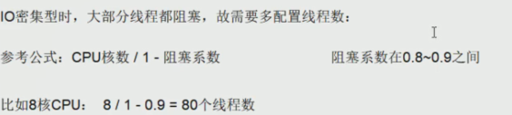
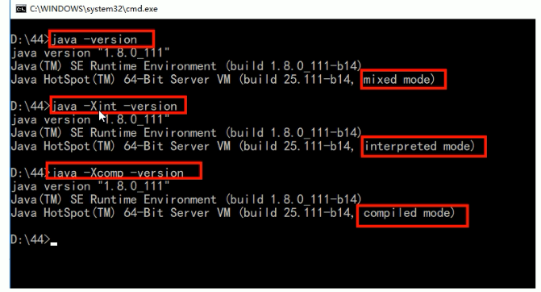

# 第一章、JUC

## 1.1 volatile是什么

volatile是Java虚拟机提供的轻量级的同步机制，基本上遵循了JMM的规范，它有三大特性：保证可见性、**不保证原子性**、禁止指令重排。

**那么JMM是什么**？

Java内存模型，Java Memory Model，简称JMM，本身是一种抽象的概念，并不真实存在，它描述的是一组规则或规范。通过规范定制了程序各个变量（包括实例字段、静态字段和构成数组对象的元素）的访问方式

JMM关于同步规定：①、线程解锁前， 必须把共享变量​的值刷新回主内存；②、线程加锁前， 必须读取主内存的最新值到自己的工作内存；③、加锁解锁是同一把锁

由于JVM运行程序的实体是线程，而每个线程创建时JVM都会为其创建一个工作内存（有些地方称为栈空间），工作内存是每个线程的私有数据区域，而Java内存模型中规定所有变量都存储在**主内存**（电脑装的内存条，硬件）中，主内存是共享内存区域，所有线程都可以访问，**但是线程对变量的操作（读取赋值等）必须在工作内存中进行，首先要将变量从主内存拷贝到自己的工作空间，然后对变量进行操作，操作完成再将变量写回主内存中，不能直接操作主内存中的变量**，各个线程中的工作内存储着主内存中的变量副本拷贝，因此不同的线程无法访问对方的工作内存，此案成间的通讯（传值）必须通过主内存来完成


**1、JMM可见性**

通过前面对JMM的介绍，我们知道各个线程对主内存中共享变量的操作都是各个线程各自拷贝到自己的工作内存中，操作后再写回主内存中的。

这就可能存在一个线程AAA修改了共享变量X的值，还未写回主内存中时，另外一个线程BBB又对内存中的一个共享变量X进行操作，但此时AAA线程工作内存中的共享变量X对BBB来说并不可见，这种工作内存与主内存同步延迟现象就造成了可见性的问题

因此就必须要有一种机制，只要有一个线程修改完自己的工作内存中的值，并写回给主内存以后要及时通知其他线程，这种即时通知就是JMM中的可见性。

代码示例如下

```java
class MyData{

    //volatile就是增强了主线程和线程的可见性
    volatile  int number = 0;

    public void addTO60(){
        this.number = 60;
    }
}

/**
 * 1.验证volatile的可见性
 *  1.1 假如int number = 0; number变量之前没有添加volatile关键字修饰，没有可见性
 */
public class VolatileDemo {
    public static void main(String[] args) {

        MyData myData = new MyData();//线程操作资源类

        new Thread(() -> {
            System.out.println(Thread.currentThread().getName()+"\t come in");
            //线程暂停3秒钟
            try { TimeUnit.SECONDS.sleep(3); }catch (Exception e) {e.printStackTrace();}
            //3秒钟以后将把0改为60
            myData.addTO60();
            System.out.println(Thread.currentThread().getName()+"\t updated number value:"+myData.number);
        },"AAA").start();

        //第二个线程就是我们的main线程
        while (myData.number == 0){
            //main主线程就一直在这里等待循环，直到number不再等于零
        }
        //若这句话打印出来了，说明main主线程感知到了number的值发生了变化，那么此时可见性就会被触发
        System.out.println(Thread.currentThread().getName()+"\t mission is over,main get number value:"+myData.number);  //这个是main线程
    }
}
```

AAA线程拿到副本进行操作，几乎同时主线程也拿到了number的副本进行while循环，当AAA三秒之后将number修改为60，随后写入内存中，但是此时主线程还是使用自己的内存空间中的number副本，因此循环继续。

如果给while语句前面添加上延迟时间，保证while拿到数据的时候AAA线程已经完成了修改并写入主内存，那么while拿到的就是number修改之后的值

**2、JMM原子性**

什么是原子性？其实就是看最终一致性能不能保证。不可分割、完整性。即某个线程正在做某个业务的时候，中间不可以被加塞或者被分割，需要整体完整。

JMM要求保证原子性，但是volatile是不保证原子性的。


number++在多线程的情况下是非线程安全的，除了加synchronized以外，还能通过AtomicInteger来解决。

为什么number++无法保证线程安全？因为很多值在putfield这步写回主内存的时候可能线程的调度被挂起了，刚好也没有收到最新值的通知，有那么一个纳秒级的时间差，一写就出现了写覆盖，将之前的值给覆盖掉了。

```java
volatile int number = 0;
AtomicInteger atomicInteger = new AtomicInteger();

numeber++;
atomicInteger.getAndIncrement();
```

AtomicInteger（带原子性包装的整形类）的底层原理：CAS

**3、JMM有序性**

计算机在执行程序时，为了提高性能，编译器和处理器常常会做**指令重排**，一般分为一下3种


单线程环境里面确保程序最终执行结果和代码顺序执行结果一致

处理器在进行重新排序时必须要考虑指令之间的**数据依赖性**

多线程环境中线程交替执行，由于编译器优化重排的存在，两个线程使用的变量能否保持一致性是无法确定的，结果无法预测

禁止指令重排小总结（了解）


**volatile使用案例**

单例模式DCL代码

```java
public class SingletonDemo {

    private static volatile SingletonDemo instance=null;
    private SingletonDemo(){
        System.out.println(Thread.currentThread().getName()+"\t 构造方法");
    }

    /**
     * 双重检测机制
     * @return
     */
    public static SingletonDemo getInstance(){
        if(instance==null){
            synchronized (SingletonDemo.class){
                if(instance==null){
                    instance=new SingletonDemo();
                }
            }
        }
        return instance;
    }
}
```

但是DCL（双端检锁）机制不一定线程安全，原因是有指令重排的存在，加入volatile可以禁止指令重排，原因在于某一个线程在执行到第一次检测，读取到的instance不为null时，instance的引用对象**可能没有完成初始化**

instance = new SingletonDem(); 可以分为以下步骤（伪代码）

1. 分配对象内存空间 memory = allocate();
2. 初始化对象 instance(memory);
3. 设置instance指向刚分配的内存地址，此时instance != null

步骤2和步骤3不存在数据依赖关系，而且无论重排前还是重排后程序执行的结果在单线程中并没有改变，因此这种重排优化是允许的。

但是如果多线程情况下进行了重排优化，可能第三步先执行，此时对象还没初始化完，**所以当一条线程访问instance不为null时，由于instance实例未必完成初始化，也就造成了线程安全问题。**

因此我们可以加上volatile来禁止指令重排，就能保证多线程间的语义一致性，`private static volatile SingletonDemo instance = null`。

## 1.2 CAS

CAS：比较并交换，如果线程的期望值跟物理内存的真实值一样，就更新值到物理内存中，并返回true；如果线程的期望值跟物理内存的真实值不一样，返回false，本次修改失败，那么此时需要重新获得主物理内存的新值。

CASDemo代码

```java
public class CASDemo {
    public static void main(String[] args) {
        AtomicInteger atomicInteger = new AtomicInteger(5);
        System.out.println(atomicInteger.compareAndSet(5, 2019)+"\t current"+atomicInteger.get());
        System.out.println(atomicInteger.compareAndSet(5, 2014)+"\t current"+atomicInteger.get());
    }
}
```

**1、UnSafe**

对于`atomicInteger.getAndIncrement()方法的源代码`

```java
public final int getAndIncrement() {
	return unsafe.getAndAddInt(this, valueOffset, 1);
}
```

可以看到getAndIncrement方法底层用的是unsafe类中的方法

下面是AtomicInteger的部分源码


UnSafe是CAS的核心类，由于Java方法无法直接访问底层，需要通过本地（native）方法来访问，UnSafe相当于一个后门，基于该类可以直接操作特定的内存数据。UnSafe在sun.misc包中，其内部方法操作可以像C的指针一样直接操作内存。

**注意UnSafe类中的所有方法都是native修饰的，也就是说UnSafe类中的方法都是直接调用操作底层资源执行响应的任务**

变量valueOffset就是该变量在内存中的**偏移地址**，因为UnSafe就是根据内存偏移地址来获取数据的。

变量vlaue用volatile修饰，保证了多线程之间的可见性

**2、什么是CAS**

CAS的全称就是Compare-And-Swap，**它是一条CPU并发原语**，它的功能是判断内存某个位置的值是否为预期值，如果是则更新为新的值，这个过程是原子的。

CAS并发原语体现在Java语言中就是UnSafe类中的各个方法，调用UnSafe类中的CAS方法，JVM会帮我们实现**CAS汇编指令**，这是一种完全依赖于硬件功能，通过它实现了原子操作，再次强调，由于CAS是一种系统原语，原语属于操作系统用语范畴，用于完成某个功能的一个过程，并且原语的执行必须是连续的，在执行过程中不允许中断，也就是说CAS是一条原子指令，不会造成所谓的数据不一致问题


var1 AtomicInteger对象本身.

var2 该对象值的引用地址

var4 需要变动的数值

var5 是用过var1 var2找出内存中绅士的值

用该对象当前的值与var5比较

如果相同,更新var5的值并且返回true；如果不同,继续取值然后比较,直到更新完成

----

假设线程A和线程B两个线程同时执行getAndAddInt操作(分别在不同的CPU上):

1.AtomicInteger里面的value原始值为3,即主内存中AtomicInteger的value为3,根据JMM模型,线程A和线程B各自持有一份值为3的value的副本分别到各自的工作内存.

2.线程A通过getIntVolatile(var1,var2) 拿到value值3,这是线程A被挂起.

3.线程B也通过getIntVolatile(var1,var2) 拿到value值3,此时刚好线程B没有被挂起并执行compareAndSwapInt方法比较内存中的值也是3 成功修改内存的值为4 线程B打完收工 一切OK.

 4.这是线程A恢复,执行compareAndSwapInt方法比较,发现自己手里的数值和内存中的数字4不一致,说明该值已经被其他线程抢先一步修改了,那A线程修改失败,只能重新来一遍了.

 5.线程A重新获取value值,因为变量value是volatile修饰,所以其他线程对他的修改,线程A总是能够看到,线程A继续执行compareAndSwapInt方法进行比较替换,直到成功.


原子整型之所以在i++这种多线程的环境下面，不用加synchronized，就凭借着底层UnSafe类也能保证原子性，来保证线程安全，是因为UnSafe是CAS的核心类，且UnSafe是根据内存偏移地址来获取的。

**3、CAS的缺点**

1. 多次比较循环时间长开销很大：如果CAS失败的话，会一直进行尝试，如果CAS长时间一直不成功，可能会给CPU带来很大的开销
2. 只能保证一个共享变量的原子性：当对一个共享变量执行操作时，我们可以使用循环CAS的方式来保证原子操作，但是对多个共享变量操作时，循环CAS就无法保证操作的原子性，这时候就可以用锁来保证原子性
3. 引出来ABA问题

也就是说，如果使用synchronized进行加锁，一致性得到保证，但是并发性会下降；如果使用CAS，不加锁，能保证一致性，但是它需要多次比较，耗时时间长，开销很大。

## 1.3 ABA问题

**1、ABA问题的产生**

CAS会导致ABA问题，CAS算法实现一个重要前需要取出内存中某个时刻的数据并在当下时刻比较并替换， 那么在这个时间差内会导致数据的变化。

比如说一个线程one从内存位置V中取出A，这时候另一个线程two也从内存位置V中取出A，并且线程two进行了一些操作将值变成了B，然后线程two又将B变成了A，这个时候one进行CAS操作发现内存中仍然是A，然后线程one操作成功

**尽管one的CAS操作成功，但是不代表这个过程就是没有问题的**

**2、原子引用：AtomicReference**

```java
@Getter
@Setter
@AllArgsConstructor
@ToString
class User{
    private String name;
    private int age;
}
public class AtomicReferenceDemo {
    public static void main(String[] args) {
        User zs = new User("zs", 22);
        User ls = new User("ls", 22);
        AtomicReference<User> reference = new AtomicReference<>();
        reference.set(zs);
        System.out.println(reference.compareAndSet(zs, ls)+"\t"+reference.get().toString());
        System.out.println(reference.compareAndSet(zs, ls)+"\t"+reference.get().toString());
    }
}

//结果就是true	user = ls； false	user = ls
```

原子引用的用法其实和AtomicInteger差不多，只是可以自定义CAS操作对象，且这个同样也有ABA问题

**3、时间戳原子引用：AtomicStampedReference**

```java
/**
 * Description: ABA问题的解决
 *
 * @author veliger@163.com
 * @date 2019-04-12 21:30
 **/
public class ABADemo {
    private static AtomicReference<Integer> atomicReference=new AtomicReference<>(100);
    private static AtomicStampedReference<Integer> stampedReference=new AtomicStampedReference<>(100,1);
    public static void main(String[] args) {
        System.out.println("===以下是ABA问题的产生===");
        new Thread(()->{
            atomicReference.compareAndSet(100,101);
            atomicReference.compareAndSet(101,100);
        },"t1").start();

        new Thread(()->{
            //先暂停1秒 保证完成ABA
            try { TimeUnit.SECONDS.sleep(1); } catch (InterruptedException e) { e.printStackTrace(); }
            System.out.println(atomicReference.compareAndSet(100, 2019)+"\t"+atomicReference.get());
        },"t2").start();
        try { TimeUnit.SECONDS.sleep(2); } catch (InterruptedException e) { e.printStackTrace(); }
        System.out.println("===以下是ABA问题的解决===");

        new Thread(()->{
            int stamp = stampedReference.getStamp();
            System.out.println(Thread.currentThread().getName()+"\t 第1次版本号"+stamp+"\t值是"+stampedReference.getReference());
            //暂停1秒钟t3线程
            try { TimeUnit.SECONDS.sleep(1); } catch (InterruptedException e) { e.printStackTrace(); }

            stampedReference.compareAndSet(100,101,stampedReference.getStamp(),stampedReference.getStamp()+1);
            System.out.println(Thread.currentThread().getName()+"\t 第2次版本号"+stampedReference.getStamp()+"\t值是"+stampedReference.getReference());
            stampedReference.compareAndSet(101,100,stampedReference.getStamp(),stampedReference.getStamp()+1);
            System.out.println(Thread.currentThread().getName()+"\t 第3次版本号"+stampedReference.getStamp()+"\t值是"+stampedReference.getReference());
        },"t3").start();

        new Thread(()->{
            int stamp = stampedReference.getStamp();
            System.out.println(Thread.currentThread().getName()+"\t 第1次版本号"+stamp+"\t值是"+stampedReference.getReference());
            //保证线程3完成1次ABA
            try { TimeUnit.SECONDS.sleep(3); } catch (InterruptedException e) { e.printStackTrace(); }
            boolean result = stampedReference.compareAndSet(100, 2019, stamp, stamp + 1);
            System.out.println(Thread.currentThread().getName()+"\t 修改成功否"+result+"\t最新版本号"+stampedReference.getStamp());
            System.out.println("最新的值\t"+stampedReference.getReference());
        },"t4").start();
    }
}
```

这个可以规避掉ABA问题，就是**新增一种机制，那就是增加时间戳，当时间戳跟要比对的时间戳不一致的话，就说明这个数据在中间被修改过**

## 1.4 ArrayList

众所周知，ArrayList是线程不安全的，那么请举个例子表示它是线程不安全的？

```java
public static void main(String[] args) {
    List<String> list = new ArrayList<>();
    for (int i = 1; i <= 30; i++) {
        new Thread(() -> {
            list.add(UUID.randomUUID().toString().substring(0, 8));
            System.out.println(list);
        },String.valueOf(i)).start();
    }
}
```

出现故障**java.util.ConcurrentModificationException**，原因就是并发中各线程互相争抢修改导致。

解决方案：

1. new Vector<>( );

   矢量队列，能解决线程安全问题，源码中的add方法被synchronized同步修饰

   ```java
   public synchronized boolean add(E e) {
       ++this.modCount;
       this.add(e, this.elementData, this.elementCount);
       return true;
   }
   ```

   但是这个类已经过时了，同时效率较低

2. Collections工具类

   该集合工具类中提供了方法synchronizedList来保证list是同步安全的，同时set和map都可以用这个来确保安全

3. CopyOnWriteArrayList

   相当于线程安全的arraylist，是一个可变数组

   1、最适合于以下特征的应用程序：List大小通常很小，只读操作远多于可变操作，需要在遍历期间防止线程间的冲突

   2、线程是安全的

   3、通常需要复制整个基础数组，所以可变操作的开销很大

   4、迭代器支持hasNext、next等不可变操作，但是不支持remove等操作

   5、使用迭代器遍历的速度很快，并且不会与其他线程发生冲突

   当我们往一个容器添加元素的时候，不直接往当前容器里面添加，而是先将容器复制一份，然后再在新的容器里面添加元素，添加完之后再将原来的容器的引用指向新的容器

   也就是**读写分离和写时复制技术**，能保证线程安全，但是因为读和写不是对应的同一份数据，因此可能会读到脏数据

   JDK8源码如下（后序的JDK版本可能会稍有不同）：

   ```java
   public boolean add(E e) {
       final ReentrantLock lock = this.lock;
       lock.lock();
       try {
           Object[] elements = getArray();
           int len = elements.length;
           Object[] newElements = Arrays.copyOf(elements, len + 1);
           newElements[len] = e;
           setArray(newElements);
           return true;
       } finally {
           lock.unlock();
       }
   }
   
   final void setArray(Object[] a) {
       array = a;
   }
   ```

**Set**

HashSet也是不安全的，同样可以用Collections里的工具类，也可以用CopyOnWriteArraySet，但是注意的是，CopyOnWriteArraySet底层用的是CopyOnWriteArrayList

```java
/**
 * Creates an empty set.
 */
public CopyOnWriteArraySet() {
    al = new CopyOnWriteArrayList<E>();
}
```

而且HashSet的底层用的是HashMap，进行添加操作的时候，只关系map的key，也就是该添加的元素，至于value的话就是一个Object类常量

```java
public boolean add(E e) {
    return map.put(e, PRESENT)==null;
}

// Dummy value to associate with an Object in the backing Map
private static final Object PRESENT = new Object();
```

**Map**

HashMap没有CopyOnWriteArrayMap，而是用的ConcurrentHashMap

## 1.5 公平锁、非公平锁、可重入锁、递归锁、自旋锁谈谈你的理解？请手写一个自旋锁

**公平锁和非公平锁**

公平锁：多个线程按照申请锁的顺序来获取锁，类似于排队打饭；在并发环境中，每个线程在获取锁的时候会先查看此锁维护的等待队列，如果为空， 或者当前线程是等待队列的第一个公平锁，就占有锁，否则就会加入到等待队列中，以后会按照FIFO的规则从队列中取到自己。

非公平锁：是指在多个线程获取锁的顺序并不是按照申请锁的顺序，有可能后申请的线程比先申请的线程优先获取到锁，在高并发的情况下，有可能造成优先级反转或者饥饿现象（线程一直抢不到锁，一直等待）；非公平锁比较粗鲁，一上来就直接尝试占有锁，如果尝试失败，就再采用类似公平锁那种方式

并发包ReentrantLock的创建可以指定构造函数的boolean类型来得到公平锁或者非公平锁，默认是非公平锁；

对于synchronized而言，也是一种非公平锁

**可重入锁（递归锁）**

指的是同一线程外层函数获得锁之后，内存递归函数仍然能获取该锁的代码，在同一个线程在外层方法获取锁的时候，在进入内层方法会自动获取锁。**线程可以进入任何一个它已经拥有的锁所同步着的代码块**，可以用于**避免死锁问题**。就类似于获得了房子的总钥匙，再进其余的房间就不需要锁了

ReentrantLock和synchronized就是一个典型的可重入锁

```java
class Phone implements Runnable {
    private Lock lock = new ReentrantLock();

    @Override
    public void run() {
        get();
    }

    private void get() {
        lock.lock();
        try {
            System.out.println(Thread.currentThread().getName() + "\tget");
            set();
        } finally {
            lock.unlock();
        }
    }

    private void set() {
        lock.lock();
        try {
            System.out.println(Thread.currentThread().getName() + "\tset");
        } finally {
            lock.unlock();
        }
    }
}

/**
 * Description:
 * 可重入锁(也叫做递归锁)
 * 指的是同一先生外层函数获得锁后,内层敌对函数任然能获取该锁的代码
 * 在同一线程外外层方法获取锁的时候,在进入内层方法会自动获取锁
 * <p>
 * 也就是说,线程可以进入任何一个它已经标记的锁所同步的代码块
 *
 * @author veliger@163.com
 * @date 2019-04-12 23:36
 **/
public class ReenterLockDemo {
    /**
     * Thread-0 get
     * Thread-0 set
     * Thread-1 get
     * Thread-1 set
     *
     * @param args
     */
    public static void main(String[] args) {
        Phone phone = new Phone();
        Thread t3 = new Thread(phone);
        Thread t4 = new Thread(phone);
        t3.start();
        t4.start();

    }
}
```

**自旋锁**

是指尝试获取锁的线程不会立即阻塞，而是**采用循环的方式去尝试获取锁**，这样的好处是减少线程上下文切换的消耗，缺点是循环会消耗CPU，上面讲的CAS就是用到了自旋锁（spinlock）

手写自旋锁

```java
package com.dlf.test;

import java.util.concurrent.TimeUnit;
import java.util.concurrent.atomic.AtomicReference;

/**
 * 题目：实现一个自旋锁
 * 自旋锁的好处：循环比较获取直到成功为止，没有类似wait的阻塞
 *
 * 通过CAS操作完成自旋锁，A线程先进来调用myLock方法自己持有锁5秒钟，
 * B随后进来后发现当前有线程持有锁，不是null，
 * 所以只能通过自旋等待，直到A释放锁后B随后抢到
 * @author dlf
 * @Description
 * @create 2021-09-12-13:16
 */
public class SpinLockDemo {

    AtomicReference<Thread> atomicReference = new AtomicReference<>();

    public void myLock() {
        Thread thread = Thread.currentThread();

        System.out.println(Thread.currentThread().getName() + "\t come in");

        while (!atomicReference.compareAndSet(null, thread)) {
            System.out.println(Thread.currentThread().getName() + "\t 正在自旋");
            mySleep(1);
        }
    }

    public void myUnLock() {
        Thread thread = Thread.currentThread();
        atomicReference.compareAndSet(thread, null);
        System.out.println(Thread.currentThread().getName() + "\t invoked myUnLock()");
    }

    public static void main(String[] args) {
        SpinLockDemo spinLockDemo = new SpinLockDemo();

        new Thread(() -> {
            spinLockDemo.myLock();
            mySleep(5);
            spinLockDemo.myUnLock();
        },"AA").start();

        mySleep(1);

        new Thread(() -> {
            spinLockDemo.myLock();
            mySleep(1);
            spinLockDemo.myUnLock();
        },"BB").start();
    }

    public static void mySleep(long time) {
        try {
            TimeUnit.SECONDS.sleep(time);
        } catch (InterruptedException e) {
            e.printStackTrace();
        }
    }
}

/*
AA	 come in
BB	 come in
BB	 正在自旋
BB	 正在自旋
BB	 正在自旋
BB	 正在自旋
AA	 invoked myUnLock()
BB	 invoked myUnLock()
*/
```

**独占锁（写）、共享锁（读）、互斥锁**

独占锁：指该锁一次只能被一个线程所持有。对ReentrantLock和Synchronized而言都是独占锁

共享锁：指该锁可被多个线程所持有；对ReentrantReadWriteLock其读锁是共享锁，写锁是独占锁

读锁的共享锁可保证并发读是非常高效的， 读写、写读、写写的过程都是互斥的

```java
package com.dlf.test;

import java.util.HashMap;
import java.util.Map;
import java.util.concurrent.TimeUnit;
import java.util.concurrent.locks.ReentrantReadWriteLock;

/**
 * 资源类
 */
class MyCaChe {
    /**
     * 保证可见性
     */
    private volatile Map<String, Object> map = new HashMap<>();
    private ReentrantReadWriteLock reentrantReadWriteLock = new ReentrantReadWriteLock();

    /**
     * 写
     *
     * @param key
     * @param value
     */
    public void put(String key, Object value) {
        reentrantReadWriteLock.writeLock().lock();
        try {
            System.out.println(Thread.currentThread().getName() + "\t正在写入" + key);
            //模拟网络延时
            try {
                TimeUnit.MICROSECONDS.sleep(300);
            } catch (InterruptedException e) {
                e.printStackTrace();
            }
            map.put(key, value);
            System.out.println(Thread.currentThread().getName() + "\t正在完成");
        } finally {
            reentrantReadWriteLock.writeLock().unlock();
        }
    }

    /**
     * 读
     *
     * @param key
     */
    public void get(String key) {
        reentrantReadWriteLock.readLock().lock();
        try {
            System.out.println(Thread.currentThread().getName() + "\t正在读取");
            //模拟网络延时
            try {
                TimeUnit.MICROSECONDS.sleep(300);
            } catch (InterruptedException e) {
                e.printStackTrace();
            }
            Object result = map.get(key);
            System.out.println(Thread.currentThread().getName() + "\t正在完成" + result);
        } finally {
            reentrantReadWriteLock.readLock().unlock();
        }
    }

    public void clearCaChe() {
        map.clear();
    }

}

/**
 * Description:
 * 多个线程同时操作 一个资源类没有任何问题 所以为了满足并发量
 * 读取共享资源应该可以同时进行
 * 但是
 * 如果有一个线程想去写共享资源来  就不应该有其他线程可以对资源进行读或写
 * <p>
 * 小总结:
 * 读 读能共存
 * 读 写不能共存
 * 写 写不能共存
 * 写操作 原子+独占 整个过程必须是一个完成的统一整体 中间不允许被分割 被打断
 *
 * @author veliger@163.com
 * @date 2019-04-13 0:45
 **/
public class ReadWriteLockDemo {
    public static void main(String[] args) {
        MyCaChe myCaChe = new MyCaChe();
        for (int i = 1; i <= 5; i++) {
            final int temp = i;
            new Thread(() -> {
                myCaChe.put(temp + "", temp);
            }, String.valueOf(i)).start();
        }
        for (int i = 1; i <= 5; i++) {
            int finalI = i;
            new Thread(() -> {
                myCaChe.get(finalI + "");
            }, String.valueOf(i)).start();
        }
    }
}
```

## 1.6 CountDownLatch、Cyclic Barrier、Semaphore用过吗？

**1、CountDownLatch**

让一些线程阻塞直到另外一些完成后才被唤醒，CountDownLatch主要有两个方法，当一个或多个线程调用await方法时，调用线程会被阻塞，其他线程调用countDown方法计数器减1(调用countDown方法时线程不会阻塞),当计数器的值变为0,因调用await方法被阻塞的线程会被唤醒,继续执行

```java
public class CountDownLatchDemo {
    public static void main(String[] args) throws Exception {
        closeDoor();
    }
    
    private static void closeDoor() throws InterruptedException {
        CountDownLatch countDownLatch = new CountDownLatch(6);
        
        for (int i = 1; i <= 6; i++) {
            new Thread(() -> {
                System.out.println(Thread.currentThread().getName() + "上完自习");
                countDownLatch.countDown();
            }, String.valueOf(i)).start();
        }
        countDownLatch.await();
        System.out.println(Thread.currentThread().getName() + "班长锁门离开教室");
    }
}
```

**2、CyclicBarrier**

CyclicBarrier的字面意思是可循环(Cyclic) 使用的屏障(barrier).它要做的事情是,让一组线程到达一个屏障(也可以叫做同步点)时被阻塞,知道最后一个线程到达屏障时,屏障才会开门,所有被屏障拦截的线程才会继续干活,线程进入屏障通过CyclicBarrier的await()方法.

及其七颗龙珠就能召唤神龙，和CountDownLatch恰好相反

```java
public class CyclicBarrierDemo {
    public static void main(String[] args) {
        CyclicBarrier cyclicBarrier=new CyclicBarrier(7,()->{
            System.out.println("召唤神龙");
        });

        for (int i = 1; i <=7; i++) {
            final int temp = i;
            new Thread(()->{
             System.out.println(Thread.currentThread().getName()+"\t 收集到第"+ temp +"颗龙珠");
                try {
                    cyclicBarrier.await();
                } catch (InterruptedException e) {
                    e.printStackTrace();
                } catch (BrokenBarrierException e) {
                    e.printStackTrace();
                }
            },String.valueOf(i)).start();
        }
    }
}
```

**3、Semaphore**

信号量的主要用户有两个目的，一个是用于多和共享资源的相互排斥使用，另一个用于并发资源数的控制

```java
/**
 * Description
 *
 * @author veliger@163.com
 * @version 1.0
 * @date 2019-04-13 11:08
 **/
public class SemaphoreDemo {
    public static void main(String[] args) {
        //模拟3个停车位
        Semaphore semaphore = new Semaphore(3);
        //模拟6部汽车
        for (int i = 1; i <= 6; i++) {
            new Thread(() -> {
                try {
                    //抢到资源
                    semaphore.acquire();
                    System.out.println(Thread.currentThread().getName() + "\t抢到车位");
                    try {
                        TimeUnit.SECONDS.sleep(3);
                    } catch (InterruptedException e) {
                        e.printStackTrace();
                    }
                    System.out.println(Thread.currentThread().getName() + "\t 停3秒离开车位");
                } catch (InterruptedException e) {
                    e.printStackTrace();
                } finally {
                    //释放资源
                    semaphore.release();
                }
            }, String.valueOf(i)).start();
        }
    }
}
```

## 1.7 阻塞队列


上图所示，线程1往阻塞队列中添加元素，线程二从队列中移除元素

当阻塞队列是空时，从队列中获取元素的操作将会被阻塞

当阻塞队列是满时，往队列中添加元素的操作将会被阻塞

**有什么好处？**

在多线程领域：所谓阻塞，在某些情况下会挂起线程（即线程阻塞），一旦条件满足，被挂起的线程会被自动唤醒。使用阻塞队列后我们不需要关心什么时候需要阻塞线程，什么时候需要唤醒线程，因为阻塞队列都给你一手包办好了。

**核心方法**


|   分类   |                             描述                             |
| :------: | :----------------------------------------------------------: |
| 抛出异常 | 当阻塞队列满时,再往队列里面add插入元素会抛IllegalStateException: Queue full<br/>当阻塞队列空时,再往队列Remove元素时候回抛出NoSuchElementException<br/>element()检查队列是否为空及队首元素是谁 NoSuchElementException |
|  特殊值  | 插入方法,成功返回true 失败返回false<br/>移除方法,成功返回元素,队列里面没有就返回null |
| 一直阻塞 | 当阻塞队列满时,生产者继续往队列里面put元素,队列会一直阻塞直到put数据or响应中断退出<br/>当阻塞队列空时,消费者试图从队列take元素,队列会一直阻塞消费者线程直到队列可用. |
| 超时退出 | 当阻塞队列满时,队列会阻塞生产者线程一定时间,超过后限时后生产者线程就会退出 |

​	**种类分析**

1. **ArrayBlockingQueue**: 由数组结构组成的有界阻塞队列.

2. **LinkedBlockingQueue**: 由链表结构组成的有界(但大小默认值Integer>MAX_VALUE)阻塞队列

3. PriorityBlockingQueue:支持优先级排序的无界阻塞队列.

4. DelayQueue: 使用优先级队列实现的延迟无界阻塞队列.

5. **SynchronousQueue**:不存储元素的阻塞队列,也即是单个元素的队列.

   与其他BlockingQueue不同，SynchronousQueue是一个不存储元素的BlockingQueue，每个put操作必须要等待一个take操作，否则不能继续添加元素，反之亦然

   ```java
   public class SynchronousQueueDemo {
       public static void main(String[] args) {
           BlockingQueue<String> blockingQueue = new SynchronousQueue<>();
           new Thread(() -> {
               try {
                   System.out.println(Thread.currentThread().getName() + "\t put 1");
                   blockingQueue.put("1");
                   System.out.println(Thread.currentThread().getName() + "\t put 2");
                   blockingQueue.put("2");
                   System.out.println(Thread.currentThread().getName() + "\t put 3");
                   blockingQueue.put("3");
               } catch (InterruptedException e) {
                   e.printStackTrace();
               }
           }, "AAA").start();
   
           new Thread(() -> {
               try {
                   try {
                       TimeUnit.SECONDS.sleep(5);
                   } catch (InterruptedException e) {
                       e.printStackTrace();
                   }
                   System.out.println(Thread.currentThread().getName() + "\t" + blockingQueue.take());
                   try {
                       TimeUnit.SECONDS.sleep(5);
                   } catch (InterruptedException e) {
                       e.printStackTrace();
                   }
                   System.out.println(Thread.currentThread().getName() + "\t" + blockingQueue.take());
                   try {
                       TimeUnit.SECONDS.sleep(5);
                   } catch (InterruptedException e) {
                       e.printStackTrace();
                   }
                   System.out.println(Thread.currentThread().getName() + "\t" + blockingQueue.take());
               } catch (InterruptedException e) {
                   e.printStackTrace();
               }
           }, "BBB").start();
       }
   }
   ```

6. LinkedTransferQueue:由链表结构组成的无界阻塞队列.

7. LinkedBlocking**Deque**:由了解结构组成的双向阻塞队列.

**用在哪里？**

生产者消费者模式、线程池、消息中间件

传统版生产者消费者模式

```java
class ShareData {
    private int number = 0;
    private Lock lock = new ReentrantLock();
    private Condition condition = lock.newCondition();

    //加
    public void increment()throws  Exception {
        lock.lock();
            try{
                //1.判断
                while (number != 0){
                    //等待，不能生产
                    condition.await();
                }
                //2.干活
                number++;
                System.out.println(Thread.currentThread().getName()+"\t"+number);
                //3.通知唤醒
                condition.signalAll();
            }catch (Exception e){
                e.printStackTrace();
            }finally {
                lock.unlock();
            }
    }

    //减
    public void decrement()throws  Exception {
        lock.lock();
        try{
            //1.判断
            while (number == 0){
                //等待，不能生产
                condition.await();
            }
            //2.干活
            number--;
            System.out.println(Thread.currentThread().getName()+"\t"+number);
            //3.通知唤醒
            condition.signalAll();
        }catch (Exception e){
            e.printStackTrace();
        }finally {
            lock.unlock();
        }
    }
}

/**
 *
 * 传统的消费者和生产者Demo
 * 题目：一个初始值为零的变量，两个线程对其交替操作，一个加一个减一，来五轮
 */
public class  ProdConsumer_TraditionDemo {
    public static void main(String[] args) {
        ShareData shareData = new ShareData();
        new Thread(() -> {
            for (int i = 1; i <=5 ; i++) {
                try {
                    shareData.increment();//增加
                } catch (Exception e) {
                    e.printStackTrace();
                }
            }
        },"AAA").start();

        new Thread(() -> {
            for (int i = 1; i <=5 ; i++) {
                try {
                    shareData.decrement();//减
                } catch (Exception e) {
                    e.printStackTrace();
                }
            }
        },"BBB").start();

    }
}
```

阻塞队列版生产者消费者模式

```java
class MyResource {
    private volatile boolean FLAG = true; //默认开启，进行生产+消费
    private AtomicInteger atomicInteger = new AtomicInteger();

    BlockingQueue<String> blockingQueue = null;

    public MyResource(BlockingQueue<String> blockingQueue) {
        this.blockingQueue = blockingQueue;
        System.out.println(blockingQueue.getClass().getName());
    }

    //生产者
    public void MyProd() throws Exception{
        String data = null;
        boolean retValue ; //默认是false

        while (FLAG) {
            //往阻塞队列填充数据
            data = atomicInteger.incrementAndGet()+"";//等于++i的意思
            retValue = blockingQueue.offer(data,2L, TimeUnit.SECONDS);
            if (retValue){ //如果是true，那么代表当前这个线程插入数据成功
                System.out.println(Thread.currentThread().getName()+"\t插入队列"+data+"成功");
            }else {  //那么就是插入失败
                System.out.println(Thread.currentThread().getName()+"\t插入队列"+data+"失败");
            }
            TimeUnit.SECONDS.sleep(1);
        }
        //如果FLAG是false了，马上打印
        System.out.println(Thread.currentThread().getName()+"\t大老板叫停了，表示FLAG=false,生产结束");
    }

    //消费者
    public void MyConsumer() throws Exception {
        String result = null;
        while (FLAG) { //开始消费
            //两秒钟等不到生产者生产出来的数据就不取了
            result = blockingQueue.poll(2L,TimeUnit.SECONDS);
            if (null == result || result.equalsIgnoreCase("")){ //如果取不到数据了
                FLAG = false;
                System.out.println(Thread.currentThread().getName()+"\t 超过两秒钟没有取到数据，消费退出");
                System.out.println();
                System.out.println();
                return;//退出
            }
            System.out.println(Thread.currentThread().getName()+"\t消费队列数据"+result+"成功");
        }
    }

    //叫停方法
    public void stop() throws Exception{
        this.FLAG = false;
    }

}

public class ProdConsumer_BlockQueueDemo {
    public static void main(String[] args)  throws Exception{
        MyResource myResource = new MyResource(new ArrayBlockingQueue<>(10));
        new Thread(() -> {
            System.out.println(Thread.currentThread().getName()+"\t 生产线程启动");
            try {
                myResource.MyProd();
            } catch (Exception e) {
                e.printStackTrace();
            }
        },"Prod").start();

        new Thread(() -> {
            System.out.println(Thread.currentThread().getName()+"\t 消费线程启动");
            System.out.println();
            System.out.println();
            try {
                myResource.MyConsumer();
                System.out.println();
                System.out.println();
            } catch (Exception e) {
                e.printStackTrace();
            }
        },"Consumer").start();

        try { TimeUnit.SECONDS.sleep(5); }catch (Exception e) {e.printStackTrace();}
        System.out.println();
        System.out.println();
        System.out.println();
        System.out.println("5秒钟时间到，大bossMain主线程叫停，活动结束");
        myResource.stop();
    }
}
```

## 1.8 synchronized和Lock的区别

**synchronized**

1. synchronized是JVM层面，它是JAVA的关键字
2. synchronized是不需要手动释放锁，当synchronized代码执行完以后，系统会自动让线程释放对锁的占用
3. synchronized不能中断，除非是抛出了异常或者是正常执行完成
4. synchronized是非公平锁
5. synchronized不支持精确唤醒，只能随机唤醒或者是唤醒全部线程

**lock**

1. Lock是API层面的具体类，它是java5以后新出的一个类
2. lock就需要手动去释放锁，若没有主动的去释放锁，就可能导致死锁的现象
3. lock是可以中断的，主要是设置超时的方法，
4. lock默认是非公平锁，但是也支持公平锁
5. lock可支持精确唤醒

**Lock可以支持绑定多个Condition，进行精确唤醒，并且还可中断Lock**

---

1、synchronized关键字

是java中的关键字，是一种同步锁，它可以修饰代码块和方法、静态方法、类。

虽然可以使用synchronized来定义方法，但是它并不属于方法定义的一部分，因此它不能被继承。如果父类中的某个方法使用了该关键字，而在子类中覆盖了该方法，在子类中的这个方法默认是不同步的，而必须显示地在子类的这个方法上添加该关键字。当然还可以在子类方法中调用父类相应的方法，这样虽然子类中的方法不是同步的，但是子类调用了父类的同步方法，因此子类的方法相当于同步了

但是对于synchronized关键字来说，获取锁的线程由于要等待IO或者其他原因被阻塞了，但是又没有释放锁，其他线程便只能等待，会影响程序的执行效率。这个时候就需要一种机制不让等待的线程一直无限期的等待下去，通过Lock可以办到

 2、Lock

Lock锁实现提供了比使用同步方法和语句可以获得的更广泛的锁操作。他们允许更灵活的结构，可能具有非常不同的属性，并且可能支持多个关联的条件对象

 3、区别

Lock不是java语言内置的，synchronized是java语言的关键字，因此是内置特性。Lock是一个类，通过这个类可以实现同步访问

 synchronized不需要用户去手动释放锁，而Lock必须要用户手动释放，不然可能会导致出现死锁的现象

 synchronized的锁可重入、不可中断、非公平，而Lock锁可重入、可中断、可公平（两种都可，在创建锁的时候设置）

 4、Lock接口

```java
public interface Lock {

 	void lock();
 	void lockInterruptibly() throws InterruptedException;
	boolean tryLock();
	boolean tryLock(long var1, TimeUnit var3) throws InterruptedException;
	void unlock();
	Condition newCondition();
}
```

1）lock（）

用来获取锁，如果锁已经被其它线程获取，则进行等待。一般来说，lock方法必须在try catch块中进行，并且将锁释放的操作放在finally中进行，以保证锁一定被释放，防止死锁的发生

```java
Lock lock-….;
lock.lock();
try{
	//处理任务
}catch(Exception ex){

}finally{
	lock.unlock(); //释放锁
}
```

2）newCondition

关键字synchronized与wait()/notify()这两个方法一起使用可以实现等待/通知模式，Lock锁的newContition方法返回Condition对象，也可以实现该模式

用notify通知时，JVM会随机唤醒某个等待的线程，使用Condition类可以进行选择性通知，常用的两个方法

- await（）：使当前线程等待，同时释放锁，当其他线程调用signal（）时，线程会重新获得锁并继续执行
- signal（）：用于唤醒一个等待的线程

在调用这两个方法前，需要线程持有相关的Lock锁，调用await后线程会释放这个锁，在singal调用后会从当前Condition对象的等待队列中，唤醒一个线程，唤醒的线程尝试获取锁，一旦获得锁成功就继续执行

---

## 1.9 线程间通信

**一般判断部分要使用循环，防止虚假唤醒（因为唤醒的时候从哪里wait就从哪里开始唤醒，如果是用if进行判断，就会绕过if判断，因此需要循环判断）**

1、线程间通信的模型有两种：共享内存和消息传递，以下方式都是基于这两种模型来实现的

```java
//第一步 创建资源类，定义属性和操作方法
class Share {
    private int number = 0;

    //创建Lock
    private Lock lock = new ReentrantLock();
    private Condition condition = lock.newCondition();

    //+1
    public void incr() throws InterruptedException {
        //上锁
        lock.lock();
        try {
            //判断
            while (number != 0) {
                condition.await();
            }
            //干活
            number++;
            System.out.println(Thread.currentThread().getName()+" :: "+number);
            //通知
            condition.signalAll();
        }finally {
            //解锁
            lock.unlock();
        }
    }

    //-1
    public void decr() throws InterruptedException {
        lock.lock();
        try {
            while(number != 1) {
                condition.await();
            }
            number--;
            System.out.println(Thread.currentThread().getName()+" :: "+number);
            condition.signalAll();
        }finally {
            lock.unlock();
        }
    }
}

public class ThreadDemo2 {

    public static void main(String[] args) {
        Share share = new Share();
        new Thread(()->{
            for (int i = 1; i <=10; i++) {
                try {
                    share.incr();
                } catch (InterruptedException e) {
                    e.printStackTrace();
                }
            }
        },"AA").start();
        new Thread(()->{
            for (int i = 1; i <=10; i++) {
                try {
                    share.decr();
                } catch (InterruptedException e) {
                    e.printStackTrace();
                }
            }
        },"BB").start();
        
    }
}
```

2、线程间定制化通信：A线程打印5次，B线程打印10次，C线程打印15次，按照顺序循环

```java
//第一步 创建资源类
class ShareResource {
    //定义标志位
    private int flag = 1;  // 1 AA     2 BB     3 CC

    //创建Lock锁
    private Lock lock = new ReentrantLock();

    //创建三个condition
    private Condition c1 = lock.newCondition();
    private Condition c2 = lock.newCondition();
    private Condition c3 = lock.newCondition();

    //打印5次，参数第几轮
    public void print5(int loop) throws InterruptedException {
        //上锁
        lock.lock();
        try {
            //判断
            while(flag != 1) {
                //等待
                c1.await();
            }
            //干活
            for (int i = 1; i <=5; i++) {
                System.out.println(Thread.currentThread().getName()+" :: "+i+" ：轮数："+loop);
            }
            //通知
            flag = 2; //修改标志位 2
            c2.signal(); //通知BB线程
        }finally {
            //释放锁
            lock.unlock();
        }
    }

    //打印10次，参数第几轮
    public void print10(int loop) throws InterruptedException {
        lock.lock();
        try {
            while(flag != 2) {
                c2.await();
            }
            for (int i = 1; i <=10; i++) {
                System.out.println(Thread.currentThread().getName()+" :: "+i+" ：轮数："+loop);
            }
            //修改标志位
            flag = 3;
            //通知CC线程
            c3.signal();
        }finally {
            lock.unlock();
        }
    }

    //打印15次，参数第几轮
    public void print15(int loop) throws InterruptedException {
        lock.lock();
        try {
            while(flag != 3) {
                c3.await();
            }
            for (int i = 1; i <=15; i++) {
                System.out.println(Thread.currentThread().getName()+" :: "+i+" ：轮数："+loop);
            }
            //修改标志位
            flag = 1;
            //通知AA线程
            c1.signal();
        }finally {
            lock.unlock();
        }
    }
}

public class ThreadDemo3 {
    public static void main(String[] args) {
        ShareResource shareResource = new ShareResource();
        new Thread(()->{
            for (int i = 1; i <=10; i++) {
                try {
                    shareResource.print5(i);
                } catch (InterruptedException e) {
                    e.printStackTrace();
                }
            }
        },"AA").start();

        new Thread(()->{
            for (int i = 1; i <=10; i++) {
                try {
                    shareResource.print10(i);
                } catch (InterruptedException e) {
                    e.printStackTrace();
                }
            }
        },"BB").start();

        new Thread(()->{
            for (int i = 1; i <=10; i++) {
                try {
                    shareResource.print15(i);
                } catch (InterruptedException e) {
                    e.printStackTrace();
                }
            }
        },"CC").start();
    }
}
```

## 1.10 Callable接口

1. 可以获取线程的返回结果

2. 为实现Callable接口，需要实现在完成时返回结果的call方法，而且call方法可以引发异常，run不能

3. Future接口：

   1. 当call方法完成时，结果必须存储在主线程已知的对象中，以便主线程可以知道该线程的返回结果，因此就需要Future对象，实现该接口需要重写五个方法
   2. `public boolean cancel(boolean mayInterrupt)`：用于停止任务，如果尚未启动任务它将停止任务。如果已经启动则仅在mayInterrupt为true时才会中断任务
   3. `public Object get()`：用于获取任务的结果，如果任务完成， 它将立即返回结果；否则等任务完成后再返回结果
   4. `public boolean isDone()`：如果任务完成返回true，否则返回false

4. FutureTask：可以通过为其构造函数提供Callable来创建FutureTask。然后将FutureTask对象提供给Thread的构造函数以创建Thread对象

5. 重点：

   1. 在主线程中需要执行比较耗时的操作时，但又不想阻塞主线程，可以把这些作业交给Future对象在后台完成
   2. 当主线程将来需要时，可以通过Future对象获得后台作业的计算结果或者执行状态
   3. 一般FutureTask多用于耗时的计算，主线程可以在完成自己的任务后，再去获取结果
   4. 仅在计算完成时才能检索结果，如果计算尚未完成，则阻塞get方法
   5. 一旦计算完成，就不能再重新开始或取消计算
   6. get方法而获取结果只有在计算完成时获取，否则会一直阻塞直到任务转入完成状态，然后回返回结果或抛出异常
   7. get只计算一次，因此get方法放到最后

   ```java
   //实现Callable接口
   class MyCallableImpl implements Callable {
   
       @Override
       public Integer call() throws Exception {
           System.out.println(Thread.currentThread().getName()+" come in callable");
           return 200;
       }
   }
   
   public class Demo1 {
       public static void main(String[] args) throws ExecutionException, InterruptedException {
   
           //FutureTask
           FutureTask<Integer> futureTask1 = new FutureTask<Integer>(new MyCallableImpl());
   
           //lam表达式
           FutureTask<Integer> futureTask2 = new FutureTask<>(()->{
               System.out.println(Thread.currentThread().getName()+" come in callable");
               return 1024;
           });
   
           //创建一个线程
           new Thread(futureTask1,"mary").start();
   
           //调用FutureTask的get方法
           System.out.println(futureTask1.get());
       }
   }
   ```

并发导致Callable接口的出现，主要是用Callable能够实现当多个任务执行当中，若有一个任务完成的耗时时间比较长，那么可以先将其他任务先完成然后等待这个耗时比较长的任务结束后一起进行总的计算。futureTask.get()操作应该放在最后，不然在计算完之前会导致阻塞强行等到计算完成。**如果同一个FutureTask创建了多个线程，只会执行一次**

## 1.11 线程池

### 1.11.1 为什么使用线程池？

线程池的工作主要是控制运行的线程的数量，处理过程中将任务加入队列，然后在线程创建后启动这些任务，如果线程超过了最大数量，超出的数量的线程排队等候，等其他线程执行完毕后再从队列中取出任务来执行

他的特点：**线程复用、控制最大并发数、管理线程**

1. 降低资源消耗，通过重复利用自己创建的线程降低线程创建和销毁造成的消耗
2. 提高响应速度，当任务到达时，任务可以不需要等到线程创建就能立即执行
3. 提高线程的可管理性。线程是稀缺资源，如果无限的创建，不仅会消耗资源，还会降低系统的稳定性，使用线程池可以进行同一分配、调优和监控。

### 1.11.2 编码实现

- `Executors.newScheduledThreadPool()`：了解

- `Executors.newWorkStealingPool(int)`：jdk8新出，了解

- `Executors.newFixedThreadPool(int)`：固定线程数的线程池，执行一个长期的任务，性能好很多

  ```java
  public static ExecutorService newFixedThreadPool(int nThreads) {
  	return new ThreadPoolExecutor(nThreads, nThreads,
                                   0L, TimeUnit.MILLISECONDS,
                                   new LinkedBlockingQueue<Runnable>());
  }
  ```

  主要特点：

  1. 创建一个**定长线程池**，可控制线程的最大并发数，超出的线程会在队列中等待
  2. newFixedThreadPool创建的线程池corePoolSize和MaxmumPoolSize是相等的，它使用的是**LinkedBlockingQueue**

- `Executors.newSingleThreadExecutor()`：一池一线程，一个任务一个线程执行的任务场景

  ```java
  public static ExecutorService newSingleThreadExecutor() {
      return new FinalizableDelegatedExecutorService
          (new ThreadPoolExecutor(1, 1,
                                  0L, TimeUnit.MILLISECONDS,
                                  new LinkedBlockingQueue<Runnable>()));
  }
  ```

  1. 创建一个**单线程化的线程池**，他只会用唯一的工作线程来执行任务，保证所有任务都按照指定顺序执行
  2. newSingleThreadExecutor将corePoolSize和MaxmumPoolSize都设置为1，它使用的**LinkedBlockingQueue**

- `Executors.newCachedThreadPool()`：一池多线程，可扩容，带缓冲缓存的，适用于执行很多短期异步的小程序或者负载较轻的服务器

  ```java
  public static ExecutorService newCachedThreadPool() {
      return new ThreadPoolExecutor(0, Integer.MAX_VALUE,
                                    60L, TimeUnit.SECONDS,
                                    new SynchronousQueue<Runnable>());
  }
  ```

  1. 创建一个**可缓存线程池**，如果线程池长度超过处理需要，可灵活回收空闲线程，若无可回收，则创建新线程
  2. 来了任务就创建线程运行， 如果线程空闲超过60秒就销毁线程

### 1.11.3 七大参数

```java
public ThreadPoolExecutor(int corePoolSize,
                          int maximumPoolSize,
                          long keepAliveTime,
                          TimeUnit unit,
                          BlockingQueue<Runnable> workQueue,
                          ThreadFactory threadFactory,
                          RejectedExecutionHandler handler) {
    if (corePoolSize < 0 ||
        maximumPoolSize <= 0 ||
        maximumPoolSize < corePoolSize ||
        keepAliveTime < 0)
        throw new IllegalArgumentException();
    if (workQueue == null || threadFactory == null || handler == null)
        throw new NullPointerException();
    this.corePoolSize = corePoolSize;
    this.maximumPoolSize = maximumPoolSize;
    this.workQueue = workQueue;
    this.keepAliveTime = unit.toNanos(keepAliveTime);
    this.threadFactory = threadFactory;
    this.handler = handler;
}
```

1. corePoolSize：线程池中的常驻核心线程数
   1. 在创建了线程池后，当有请求任务来之后，就会安排池中的线程去执行请求任务，近似理解为今日当值线程
   2. 当线程池中的线程数目达到corePoolSize后，就会把到达的任务放到缓存队列中
2. maimumPoolSize：线程池能够容纳同时执行的最大线程数，此值大于等于1
3. keepAliveTime：多余的空闲线程存活时间，当空间时间达到该值时，多余的线程会被销毁直到只剩下corePoolSize个线程为止
   默认情况下，只有当线程池数大于corePoolSize时keepAliveTime才会起作用，直到线程中的线程数不大于corePoolSize
4. unit：keepAliveTime的单位
5. workQueue：任务队列，被提交但尚未被执行的任务
6. threadFactory：表示生成线程池中工作线程的线程工厂，用户创建新线程，一般用默认即可
7. handler：拒绝策略，表示当线程队列满了并且工作线程大于等于线程池的最大显示数（maximumPoolSize）时如何来拒绝

### 1.11.4 底层工作原理


1. 在创建了线程池后，等待提交过来的任务请求
2. 当调用execute方法添加一个请求任务时，线程池会做如下判断：
   1. 如果正在运行的线程数小于corePoolSize，那么马上创建线程运行这个任务
   2. 如果正在运行的线程数大于或等于corePoolSize，那么将这个任务放入队列
   3. 如果这时候队列满了且正在运行的线程数还小于maximumPoolSize，那么还是要创建非核心线程立即运行这个任务
   4. 如果队列满了且正在运行的线程数量大于或等于maximumPoolSize，那么线程池会启动饱和拒绝策略来执行
3. 当一个线程完成任务时，他会从队列中取下一个任务执行
4. 当一个线程无事可做超过一定的时间（keepAliveTime）时，线程池会判断：如果当前运行的线程数大于corePoolSize，那么这个线程就会被停掉

### 1.11.5 拒绝策略

等待队列也已经排满了，再也塞不下新的任务了，同时线程池的max也到达了，无法继续为新任务服务，这个时候我们就需要拒绝策略机制合理的处理这个问题

1. AbortPolicy（默认）：直接抛出RejectedException异常阻止系统正常运行
2. CallerRunPolicy：“调用者运行”一种调节机制，该策略既不会抛弃任务也不会抛出异常，而是将某些任务回退到调用者，从而降低新任务的流量
3. DiscardOldestPolicy：抛弃队列中等待最久的任务，然后把当前任务加入队列中尝试再次提交当前任务
4. DiscardPolicy：直接丢弃任务，不予任何处理也不抛出异常，如果允许任务丢失，这是最好的一种拒绝策略方案

**以上内置策略均实现了RejectExecutionHandler接口**

### 1.11.6 自定义线程池

一般在工作中不使用JDK自带的线程池，只使用自定义的线程池


### 1.11.7 合理配置线程池

1. CPU密集型

   CPU密集型是该任务需要大量的运算，而没有阻塞，CPU一直全速运行。

   CPU密集任务只有在真正的多核CPU上才可能得到加速（通过多线程），而在单核CPU，无论你开几个模拟的多线程该任务都不可能得到加速，因为CPU总的运算力就那些

   CPU密集型任务配置尽可能少的线程数量：CPU核数+1个线程的线程池

   `Runtime.getRuntime().availableProcessors()`查看电脑的CPU核数

2. IO密集型

   由于IO密集型任务线程并不是一直在执行任务，则应配置尽可能多的线程，CPU核数*2。

   该任务需要大量的IO，大量的阻塞，在单线程上运行IO密集型任务会导致浪费大量的CPU运算能力在等待，所以在IO密集型任务中使用多线程可以大大的加速程序运行

   

1、看公司业务是CPU密集型还是IO密集型的，这两种不一样，来决定线程池线程数的最佳合理配置数

2、先查看服务器是几核的，调用Runtime.getRuntime().availableProcessors()这个方法来查看核数。

## 1.12 死锁

死锁就是指两个或两个以上的进程在执行过程中，因争夺资源而造成的一种相互等待的现象，若无外力干涉那他们都将无法推进下去，如果系统资源充足，进程的资源请求都能得到满足，死锁出现的可能性就会降低，否则就会因为争夺优先的资源而陷入死锁。

产生死锁的主要原因：系统资源不足、进程运行推进的顺序不合适、资源分配不当

```java
class HoldThread implements Runnable {

    private String lockA;
    private String lockB;

    public HoldThread(String lockA, String lockB) {
        this.lockA = lockA;
        this.lockB = lockB;
    }

    @Override
    public void run() {
        synchronized (lockA) {
            System.out.println(Thread.currentThread().getName() + "\t 自己持有锁" + lockA + "尝试获得" + lockB);
            try {
                TimeUnit.SECONDS.sleep(1);
            } catch (InterruptedException e) {
                e.printStackTrace();
            }
            synchronized (lockB) {
                System.out.println(Thread.currentThread().getName() + "\t 自己持有锁" + lockB + "尝试获得" + lockA);
            }
        }
    }
}

/**
 * Description:
 * 死锁是指两个或者以上的进程在执行过程中,
 * 因争夺资源而造成的一种相互等待的现象,
 * 若无外力干涉那他们都将无法推进下去
 **/
public class DeadLockDemo {
    public static void main(String[] args) {
        String lockA = "lockA";
        String lockB = "lockB";
        new Thread(new HoldThread(lockA, lockB), "threadAAA").start();
        new Thread(new HoldThread(lockB, lockA), "threadBBB").start();
    }
}
```

**解决方案**

1. jps命令定位进程编号
2. jstack找到死锁查看

# 第二章、JVM

## 2.1 GC Roots

所谓垃圾就是内存中已经不再被使用到的空间，要进行垃圾回收，如何判断一个对象是否可以被回收，有两种算法，引用计数器和可达性分析算法

引用计数器：Java中,引用和对象是有关联的。如果要操作对象则必须用引用进行。因此,很显然一个简单的办法是通过引用计数来判断一个对象是否可以回收。简单说,给对象中添加一个引用计数器,每当有一个地方引用它,计数器值加1；每当有一个引用失效时,计数器值减1。任何时刻计数器值为零的对象就是不可能再被使用的,那么这个对象就是可回收对象，那为什么主流的Java虚拟机里面都没有选用这种算法呢?其中最主要的原因是它很难解决对象之间相互循环引用的问题，同时引用计数器本身也有一定的消耗

可达性分析算法：通过GC Roots作为起点，从这个被称为GC Roots的对象开始向下搜索，如果一个对象到GCRoots没有任何引用链相连时，则说明此对象不可用。

具体内容可以查看笔记《JVM--内存与垃圾回收篇》

## 2.2 JVM系统默认值

1. 标配参数：java -version、java -help、java -showversion

2. X参数：

   1. -Xint：解释执行
   2. -Xcomp：第一次使用就编译成本地代码
   3. -Xmixed：混合模式

   

3. XX参数

   Boolean类型：-XX: + 或者 - 某个属性值；+表示开启，-表示关闭

   ​		是否打印GC收集信息：-XX: +-PrintGCDetails

   ​		是否使用串行垃圾收集器：-XX: +-UseSerialGC

   KV设值类型：-XX：属性key = 属性value

   ​		-XX：MetaspaceSize = 128m

   jinfo举例，如何查看当前运行程序的配置：jinfo -flag （配置项） 进程编号

   -Xms：等价于-XX：InitialHeapSize，初始化堆内存

   -Xmx：等价于-XX：MaxHeapSize，最大堆内存

4. 查看JVM默认值

   查看初始默认值，`java -XX:+PrintFlagsInitial -version`

   `java -XX:+PrintFlagsFinal -version`：主要查看修改更新

   `java -XX:+PrintCommandLineFlags -version`：查看程序使用的默认JVM参数

## 2.3 常用基本配置参数

-Xms：初始堆大小内存，默认为物理内存的1/64

-Xmx：最大分配内存，默认为物理内存四分之一

-Xss：设置单个线程堆栈的大小，一般默认为512K到1024K，等价于-XX：ThreadStackSize

-Xmn：设置年轻代大小，一般使用默认值

-XX：MetaspaceSize，设置元空间大小，不管多少内存，元空间默认占用20多M

-XX：+PrintGCDetails，输出详细GC收集日志信息

-XX：SurivivoRatio：设置新生代中eden和S0、S1空间的比例，默认为8，即8：1：1

-XX：NewRatio：设置年轻代和老年代在堆结构的占比，默认为2，即新生代：老年代1：2

-XX：MaxTenuringThreshold，设置垃圾最大年龄，如果设置为0的话，则年轻代对象不经过Survivor区，直接进入年老代。对于年老代比较多的应用可以提高效率。如果将此值设置为一个较大值，则年轻代对象会在Survivor区进行多次复制，这样可以增加对象在年轻代的存活时间，增加在年轻代即被回收的概率

## 2.4 四种引用

1. 强引用：当内存不足，JVM开始垃圾回收，对于强引用对象，就算是出现了OOM也不会对该对象进行回收，死都不收。

   强引用是我们最常见的普通对象引用，只要还有强引用指向一个对象，就能表明该对象还活着，垃圾收集器不会碰这种对象。在Java中最常见的就是强引用，把一个对象赋给一个引用变量，这个引用变量就是强引用。当一个对象被强引用变量引用的时候，它处于可达状态，不可能会被垃圾回收机制回收，即使该对象以后永远都不会被用到。因此强引用是造成JVM内存泄漏的主要原因之一

2. 软引用：是一种相对强引用弱化了一些的引用，需要java.lang.ref.SoftReference类来实现，可以让对象豁免一些垃圾收集。**当系统内存充足时它不会被回收，否则就会被回收**，软引用通常用在对内存敏感的程序中，比如高速缓存。

3. 弱引用：需要java.lang.ref.WeakReference类来实现，对于只有弱引用的对象来说，只要垃圾回收机制一运行，不管JVM的内存空间是否足够，都会回收该对象的占用内存。

   【举例】

   假如一个应用需要读取大量的本地图片：如果每次读取图片都从硬盘读取则会严重影响性能；如果一次性全部加载到内存中又可能造成内存溢出，此时软引用就可以解决这个问题。

   【设计思路】

   用一个HashMap来保存图片的路径和相应图片对象关联的软引用之间的映射关系，在内存不足时JVM会自动回收这些缓存图片对象所占用的空间，从而有效避免了OOM

   `Map<String,SoftReference<Bitmap>> imageCache = new HashMap<String, SoftReference<Bitmap>>();`

4. 虚引用：要用java.lang.ref.PhantomReference类来实现。虚引用并不会决定对象的生命周期。**如果一个对象仅持有虚引用，那么它就和没有任何引用一样，在任何时候都可能被垃圾回收器回收**，他不能单独使用也不能通过它访问对象，虚引用必须和引用队列（ReferenceQueue）联合使用

   主要作用是跟踪对象被垃圾回收的状态。仅仅是提供了一种确保对象被finalize以后做某些事情的机制。PhantomReference的get方法总是返回null，因此无法访问对象的引用对象，其意义在于说明一个对象已经进入finalization阶段，可以被gc回收，用来实现比finalization机制更灵活的回收操作。

   换句话说，设置虚引用关联的唯一目的就是在这个对象被收集器回收的时候收到一个系统通知或者后续添加进一步的处理。Java技术允许使用finalize方法在垃圾收集器将对象从内存中清除出去之前做必要的清理工作

## 2.5 OOM

**java.lang.StackOverflowError**：栈溢出错误，深度的方法调用导致出不来栈，栈爆了

**Java.lang.OutOfMemoryError: Java heap space**：堆内存不够用，对象没地方放

**Java.lang.OutOfMemoryError:GC overhead limit exceeded**：程序在垃圾回收上花费了百分之九十八的时间，却回收不到百分之二的空间，如果不抛出该异常，GC清理的这一点内存很快就会被再次填满，迫使GC再次执行，造成恶性循环

**Java.lang.OOM:Direct buffer memory**：


**OOM: unable to create new nativee thread**：


```java
public static void main(Stirng[] args) {
    for (int i = 1; ; i++) {
        System.out.println("***** I = " + i);
        new Thead(() -> {
            try{ 
                Thread.sleep(Integer.MAX_VALUE); 
            } catch (InterruptedException e) { 
                e.printStackTrace();
            }
        },"" + i).start();
    }
}
```

**OOM: Metaspace**：元空间溢出