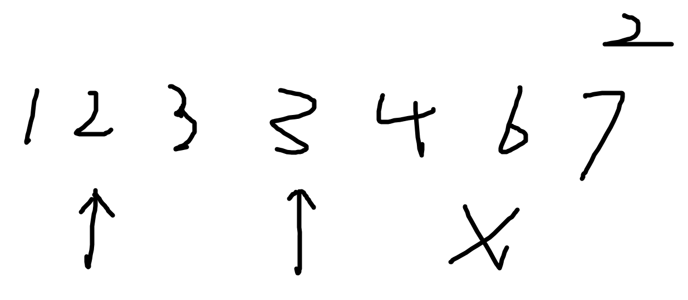
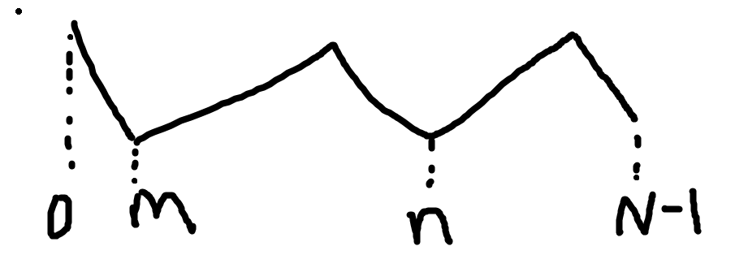
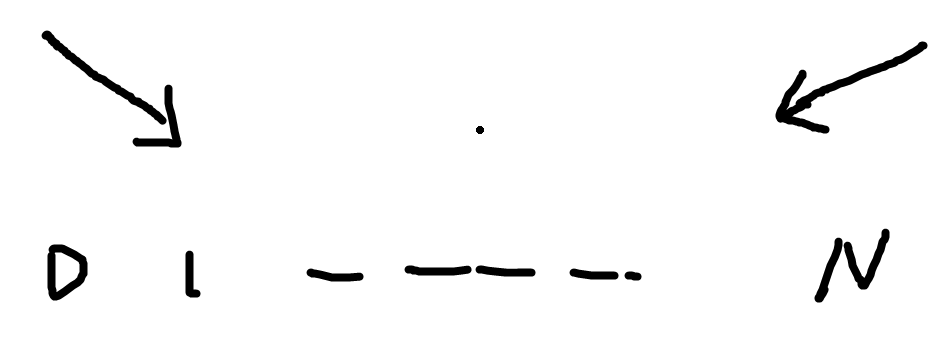
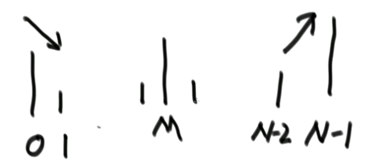

# 对数器

有时候，我们写好了一个代码，但是手上没有类似leetcode的代码检测器，验证不了该算法的正确性，就可以自己写一个对数器，用一种更为简单的方法来验证数据的正确性。

我们以排序算法为例来写一个对数器

```java
public class Code03_InsertionSort {

	public static void insertionSort(int[] arr) {
		if (arr == null || arr.length < 2) {
			return;
		}
		for (int i = 1; i < arr.length; i++) { 
			for (int j = i - 1; j >= 0 && arr[j] > arr[j + 1]; j--) {
				swap(arr, j, j + 1);
			}
		}
	}

	// i和j是一个位置的话，会出错
	public static void swap(int[] arr, int i, int j) {
		arr[i] = arr[i] ^ arr[j];
		arr[j] = arr[i] ^ arr[j];
		arr[i] = arr[i] ^ arr[j];
	}

	// for test
	public static void comparator(int[] arr) {
		Arrays.sort(arr);
	}

	// for test
	public static int[] generateRandomArray(int maxSize, int maxValue) {
		// Math.random() ->  [0,1) 所有的小数，等概率返回一个
		// Math.random() * N -> [0,N) 所有小数，等概率返回一个
		// (int)(Math.random() * N) -> [0,N-1] 所有的整数，等概率返回一个
		int[] arr = new int[(int) ((maxSize + 1) * Math.random())]; // 长度随机 
		for (int i = 0; i < arr.length; i++) {
			arr[i] = (int) ((maxValue + 1) * Math.random()) 
					- (int) (maxValue * Math.random());
		}
		return arr;
	}

	// for test
	public static int[] copyArray(int[] arr) {
		if (arr == null) {
			return null;
		}
		int[] res = new int[arr.length];
		for (int i = 0; i < arr.length; i++) {
			res[i] = arr[i];
		}
		return res;
	}

	// for test
	public static boolean isEqual(int[] arr1, int[] arr2) {
		if ((arr1 == null && arr2 != null) || (arr1 != null && arr2 == null)) {
			return false;
		}
		if (arr1 == null && arr2 == null) {
			return true;
		}
		if (arr1.length != arr2.length) {
			return false;
		}
		for (int i = 0; i < arr1.length; i++) {
			if (arr1[i] != arr2[i]) {
				return false;
			}
		}
		return true;
	}

	// for test
	public static void printArray(int[] arr) {
		if (arr == null) {
			return;
		}
		for (int i = 0; i < arr.length; i++) {
			System.out.print(arr[i] + " ");
		}
		System.out.println();
	}

	// for test
	public static void main(String[] args) {
		int testTime = 500000;
		int maxSize = 100; // 随机数组的长度0～100
		int maxValue = 100;// 值：-100～100
		boolean succeed = true;
		for (int i = 0; i < testTime; i++) {
			int[] arr1 = generateRandomArray(maxSize, maxValue);
			int[] arr2 = copyArray(arr1);
			insertionSort(arr1);
			comparator(arr2);
			if (!isEqual(arr1, arr2)) {
				// 打印arr1
				// 打印arr2
				succeed = false;
				break;
			}
		}
		System.out.println(succeed ? "Nice!" : "Fucking fucked!");

		int[] arr = generateRandomArray(maxSize, maxValue);
		printArray(arr);
		insertionSort(arr);
		printArray(arr);
	}
}
```

我们可以看到，在main方法里面，我们首先通过generateRandomArray方法获取了一个随机长度，随机数值的数组，然后复制该数组给另一个数组，arr1用我们需要测试的代码，arr2用于该问题的另外一种能保证正确性的解法，比如排序这里我们就可以用Arrays.sort方法。再进行比较，就能验证正确与否了。

# 二分法

## 判断一个数在一个有序队列里是否存在



可以看到，在这个有序数组中，我们要查询一下该数组中有没有2

1、找出中间下标mid，可以看到对应的结果为3，比2大，因此3右边的数肯定都比2大，就丢弃掉

2、继续找出左边部分的中间下标mid，对应结果刚好和2相等，这就可以返回true了

```java
public static boolean exist(int[] sortedArr, int num) {
    if (sortedArr == null || sortedArr.length == 0) {
        return false;
    }
    int L = 0;
    int R = sortedArr.length - 1;
    int mid = 0;
    while (L < R) {
        mid = L + ((R - L) >> 1); // mid = (L + R) / 2
        if (sortedArr[mid] == num) {
            return true;
        } else if (sortedArr[mid] > num) {
            R = mid - 1;
        } else {
            L = mid + 1;
        }
    }
    return sortedArr[L] == num;
}
```

## 在有序数组arr上，找满足>=value的最左位置

```java
public static int nearestIndex(int[] arr, int value) {
    int L = 0;
    int R = arr.length - 1;
    int index = -1; // 记录最左的对号
    while (L <= R) {
        int mid = L + ((R - L) >> 1);
        if (arr[mid] >= value) {
            index = mid;
            R = mid - 1;
        } else {
            L = mid + 1;
        }
    }
    return index;
}
```

## 局部最小问题

所谓的局部最小，其实可以理解为数学中的极小值，如下图所示



m、n、N-1 都是局部最小值，因此解答过程如下：

1. 如果arr的0下标比1下标所对应的值要下，那么就可以理解为0就是arr的局部最小

2. 同理可得，如果N-1比N-2要小，就能理解为局部最小为N-1

3. 如果都不满足，此时对应曲线图如下：

   

   先不管中间的数有多少个，分别是什么，在题目给定中，相邻的数一定不相等，因此必然在0和N之间存在一个局部最小

4. 此时取中间下标，并将其和mid-1对应的值去比较，如果大，那么在mid的左边一定存在局部最小，反之mid的右边一定存在局部最小

   

```java
public static int getLessIndex(int[] arr) {
    if (arr == null || arr.length == 0) {
        return -1; // no exist
    }
    if (arr.length == 1 || arr[0] < arr[1]) {
        return 0;
    }
    if (arr[arr.length - 1] < arr[arr.length - 2]) {
        return arr.length - 1;
    }
    int left = 1;
    int right = arr.length - 2;
    int mid = 0;
    while (left < right) {
        mid = (left + right) / 2;
        if (arr[mid] > arr[mid - 1]) {
            right = mid - 1;
        } else if (arr[mid] > arr[mid + 1]) {
            left = mid + 1;
        } else {
            return mid;
        }
    }
    return left;
}
```

# 异或运算

异或运算可以理解为无进位相加运算

## **无额外空间交换a和b的值**

```java
a = a ^ b; // a = a ^ b; b = b;
b = a ^ b; // a = a ^ b; b = a ^ b ^ b = a;
a = a ^ b; // a = a ^ b ^ a = b; b = a; 
```

## **一个数组中有一种数出现了奇数次，其他数都出现了偶数次，怎么找到并打印这种数**

其实这个问题很简单，根据异或运算 0^N=N , N^N=0

因此我们可以利用这两个性质来做题：用一个ero变量，将该数组所有的元素都异或一下，这样所有的偶数次数据都会被变成0，然后只留下奇数次数

代码如下：

```java
// arr中，只有一种数，出现奇数次
public static void printOddTimesNum1(int[] arr) {
    int eor = 0;
    for (int i = 0; i < arr.length; i++) {
        eor ^= arr[i];
    }
    System.out.println(eor);
}
```

## **怎么把一个int类型的数提取出最右侧的1来**

这个题目的意思就是，把int类型的数据看成二进制，找到二进制的最右侧的那个1，公式如下

例如：

N：	  100011000110

~N：    011100111001

~N+1：011100111010

进行与操作的话，就会将其余的数变成0，之后最右侧的那个1才能分离出来

```java
N & ((~N) + 1)
```

## **一个数组中有两种数出现了奇数次，其他数都出现了偶数次，怎么找到并打印这两种数**

思路如下：

1. 先用eor变量将数组中所有的值都异或一下，这样eor=a^b了，
2. a和b肯定是不同的两个数，化为二进制后，这样他们肯定会有一位不是相同的，要么是0，要么是1，这样eor必然会有一个位置上是1，我们可以找到最右侧这个1，并提取出来为rightOne。
3. 将rightOne和数组中的每一个数据进行遍历，进行与操作，这样就能将整个数组分为两堆，也就是rightOne位置上为0的一堆和位置上为1的一堆

```java
// arr中，有两种数，出现奇数次
public static void printOddTimesNum2(int[] arr) {
    int eor = 0;
    for (int i = 0; i < arr.length; i++) {
        eor ^= arr[i];
    }
    // eor = a ^ b
    // eor != 0
    // eor必然有一个位置上是1
    // 0110010000
    // 0000010000
    int rightOne = eor & (~eor + 1); // 提取出最右的1
    int onlyOne = 0; // eor'
    for (int i = 0 ; i < arr.length;i++) {
        //  arr[1] =  111100011110000
        // rightOne=  000000000010000
        if ((arr[i] & rightOne) != 0) {
            onlyOne ^= arr[i];
        }
    }
    System.out.println(onlyOne + " " + (eor ^ onlyOne));
}
```

