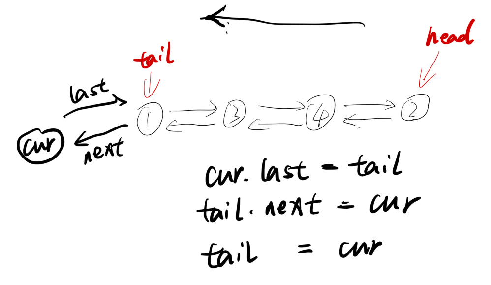
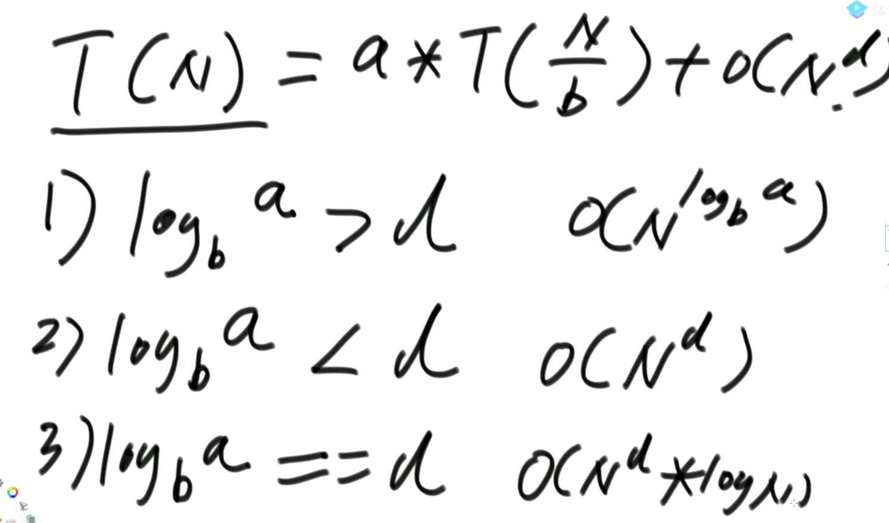

# 链表、栈和队列


## **双向链表代码**

尾部添加数据图示如下：



如图所示，一开始我们的尾部数据为2，其余的操作都和图示差不多，整体较为简单。

Node

```java
public static class Node<T>{
    public T value;
    public Node<T> last;
    public Ndoe<T> next;
    
    public Node(T data){
        value=data;
    }
}
```

DoubleEndsQueue

```java
public static class DoubleEndsQueue<T>{
    public Node<T> head;
    public Node<T> tail;
    
    public void addFromHead(T value){
        Node<T> cur=new Node<T>(value);
        if(head==null){
            head=cur;
            tail=cur;
        }else{
            cur.next=head;
            head.last=cur;
            head=cur;
        }
    }
    
    public void addFromBottom(T value){
        Node<T> cur=new Node<T>(value);
        if(head==null){
            head=cur;
            tail=cur;
        }else{
            cur.last=tail;
            tail.next=cur;
            tail=cur;
        }
    }
    
    public T popFromHead(){
        if(head==null){
            return null;
        }
        Node<T> cur=head;
        if(head==tail){
            head=null;
            tail=null;
        }else{
            head=head.next;
            cur.next=null;
            head.last=null;
        }
        return cur.value;
    }
    
    public T popFromBottom(){
        if(head==null){
            return null;
        }
        Node<T> cur=tail;
        if(head==tail){
            head=null;
            tail=null;
        }else{
            tail=tail.last;
            tail.next=null;
            cur.last=null;
        }
        return cur.value;
    }
}
```

## **双向链表实现栈**

双向链表实现栈，思路就是入栈操作在头部添加数据，出栈操作是在头部取出数据。

```java
public static class Mystack<T>{
    private DoubleEndsQueue<T> queue;
    
    public MyStack(){
        queue=new DoubleEndsQueue<T>();
    }
    public void push(T value){
        queue.addFromHead(value);
    }
    public T pop(){
        return queue.popFromHead();
    }
}
```

## **双向链表实现队列**

思路：入队操作为双向链表的尾部添加，出队操作为双向链表的头部出去

```java
public static class MyQueue<T> {
    private DoubleEndsQueue<T> queue;

    public MyQueue() {
        queue = new DoubleEndsQueue<T>();
    }

    public void push(T value) {
        queue.addFromBottom(value);
    }

    public T poll() {
        return queue.popFromHead();
    }
}
```


## **数组实现队列**

可以直接定义一个额外的size，这样就不用关系begin和end的问题了

```java
public static class MyQueue{
    private int[] arr;
    private int push;
    private int poll;
    private int size;
    private final int limit;
    
    public MyQueue(int limit){
        arr=new int[limit];
        push = 0;
        poll = 0;
        size = 0;
        this.limit = limit;
    }
    
    public void push(int value){
        if(size == limit){
            throw new RuntimeException("栈满了！！");
        }
        size++;
        arr[push]= value;
        push = nextIndex(push);
    }
    
    public int poll(){
        if(size == 0){
            throw new RuntimeException("栈空了");
        }
        size--;
        int result = arr[poll];
        poll = nextIndex(poll);
        return result;
    }
    
    private int nextIndex(int i){
        return i < limit - 1 ? i + 1 : 0;
    }
}
```


## **队列实现栈**

1. 可以使用两个队列实现栈结构，一个队列命名为queue，一个队列命名为help

2. 添加元素的时候，往queue中进行添加

3. 出栈操作的时候，将queue中的数据全都移动到help队列里面，只留下一个需要出栈的元素，将其出栈后，就将help和queue进行互换

4. ```java
   public static class TowQueueStack<T>{
       public Queue<T> queue;
       public Queue<T> help;
       
       public TwoQueueStack(){
           queue = new LinkedList<>();
           help = new LinkedList<>():
       }
       
       public void push(T value){
           queue.offer(value);
       }
       
       public T poll(){
           while(queue.size()>1){
               help.offer(queue.poll);
           }
           T result = queue.poll();
           Queue<T> temp = queue;
           queue = help;
           help = queue;
           return result;
       }
   }
   ```

   

## **栈实现队列**

1. 用两个栈实现队列，一个栈叫做stackPush，一个叫做stackPop
2. 入队的时候，就直接往stackPush里面入栈就行
3. 出队的时候，先看stackPop里面有没有数据，如果有就直接pop，如果没有就将stackPush里面的数据都转移到stackPop里面，然后pop

```java
public static class TwoStacksQueue{
    public Stack<Integer> stackPush;
    public Stack<Integer> stackPop;
    
    public TwoStacksQueue(){
        stackPush = new Stack<Integer>();
        stackPop = new Stack<Integer>();
    }
    
    public void add(Integer pushInt){
        stackPush.push(pushInt);
    }
    
    public Integer peek(){
        if (stackPop.empty() && stackPush.empty()){
            throw new RuntimeException("Queue is empty");
        }
        pushToPop();
        return stackPop.peek();
    }
    
    private void pushToPop(){
        if(stackPop.empty()){
            while(!stackPush.empty()){
                stackPop.push(stackPush.pop());
            }
        }
    }
}
```


## **以O(1)的时间复杂度找出当前栈中的最小值**

1. 这个用两个栈就可以实现，一个是stackData，一个是stackMin
2. 入栈的时候，比较入栈的数据和stackMin栈顶的元素，将两者中最小的那个放入stackMin中，stackData正常入栈
3. 出栈的时候，将stackMin数据pop，返回stackData中栈顶的数据
4. 如果想要获取最小值，就直接返回stackMin中的栈顶元素

```java
public static class MyStack2 {
    private Stack<Integer> stackData;
    private Stack<Integer> stackMin;

    public MyStack2() {
        this.stackData = new Stack<Integer>();
        this.stackMin = new Stack<Integer>();
    }

    public void push(int newNum) {
        if (this.stackMin.isEmpty()) {
            this.stackMin.push(newNum);
        } else if (newNum < this.getmin()) {
            this.stackMin.push(newNum);
        } else {
            int newMin = this.stackMin.peek();
            this.stackMin.push(newMin);
        }
        this.stackData.push(newNum);
    }

    public int pop() {
        if (this.stackData.isEmpty()) {
            throw new RuntimeException("Your stack is empty.");
        }
        this.stackMin.pop();
        return this.stackData.pop();
    }

    public int getmin() {
        if (this.stackMin.isEmpty()) {
            throw new RuntimeException("Your stack is empty.");
        }
        return this.stackMin.peek();
    }
}
```


# 递归

算时间复杂度，子递归的规模必须一致，要满足这个形式，例如递归求arr中最大值

```java
// 求arr中的最大值
public static int getMax(int[] arr) {
    return process(arr, 0, arr.length - 1);
}

// arr[L..R]范围上求最大值  L ... R   N
public static int process(int[] arr, int L, int R) {
    if (L == R) { // arr[L..R]范围上只有一个数，直接返回，base case
        return arr[L];
    }
    int mid = L + ((R - L) >> 1); // 中点   	1
    int leftMax = process(arr, L, mid);
    int rightMax = process(arr, mid + 1, R);
    return Math.max(leftMax, rightMax);
}
```

