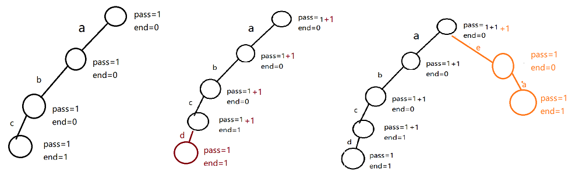
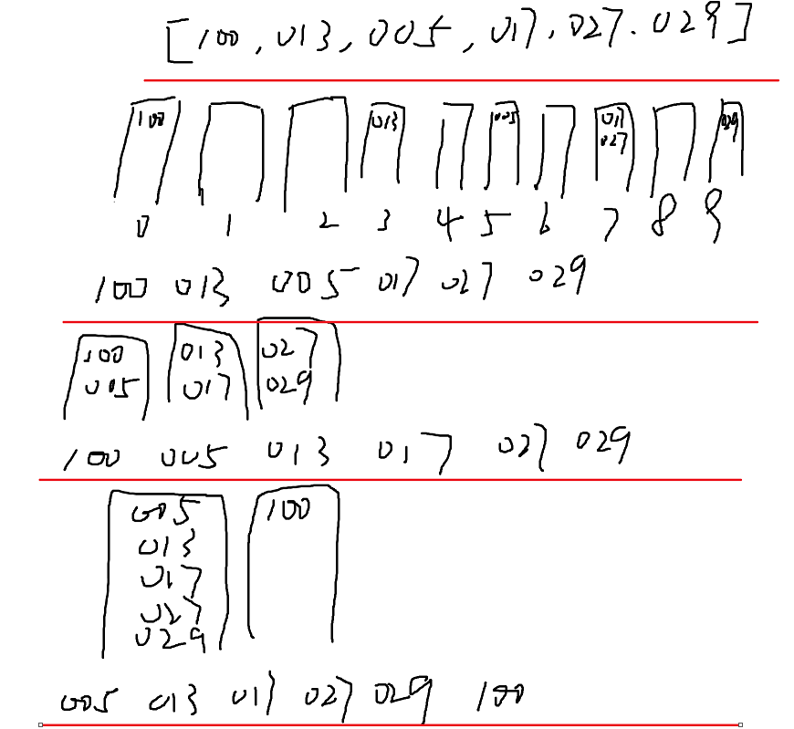
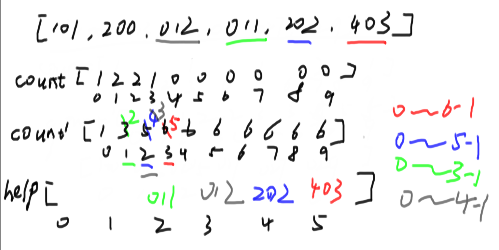
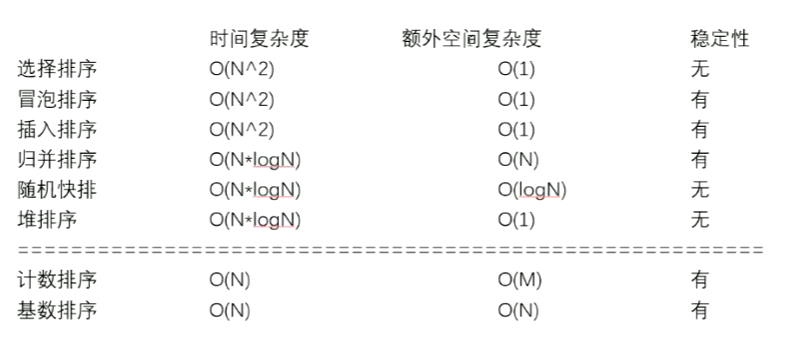
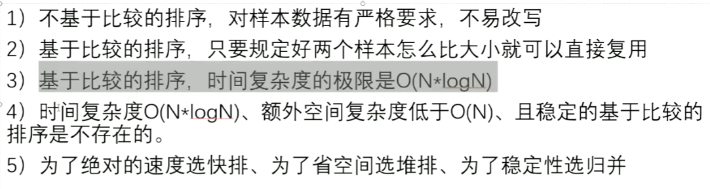
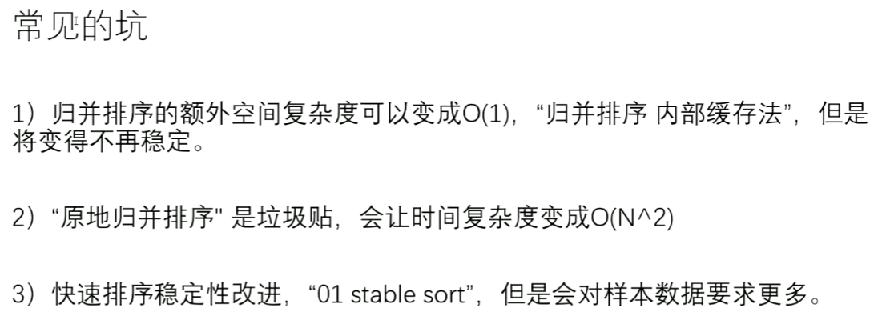

# 前缀树（TireTree）

比如给定几个字符串，"abc"，"abcd"，"ea"，遍历每个字符串，经过对应节点的时候，pass++，end=0，如果该字符串结尾了，就pass++，end++；



## **用数组进行结构存储**

```java
public static class Node{
    public int pass;
    public int end;
    public Node[] nexts;
    
    public Node(){
        pass = 0;
        end = 0;
        //规定每个字符串里面的字符都是小写字母
        // nexts[i] = null; 表示i方向的路不存在
        // nexts[i] != null i方向的路存在
        nexts = new Node[26];
    }
}

public static class Trie{
    private Node root;
    
    public Trie(){
        root = new Node();
    }
    
    //向前缀树插入一个字符串
    public void insert(String word){
        if (word == null){
            return;
        }
        char[] str = word.toCharArray();
        Node node = root;
        node.pass++;
        int path = 0;
        for (int i = 0; i< str.length; i++){
            path = str[i] - 'a';
            if (node.nexts[path] == null){
                node.nexts[path] = new Node();
            }
            node = node.nexts[path];
            node.pass++;
        }
        node.end++;
    }
    
    // word这个单词之前加入过几次
    public int search(String word){
        if (word == null){
            return 0;
        }
        char[] str = word.toCharArray();
        Node node = root;
        int path = 0;
        for (int i = 0; i < str.length; i++){
            path = str[i] - 'a';
            if (node.nexts[path] == null){
                return 0;
            }
            node = node.nexts[path];
        }
        return node.end;
    }
    
    //删除指定word
    public void delete(String word){
        if (search(wrod) != 0){
            char[] chs = word.toCharArray();
            Node node = root;
            node.pass--;
            int path = 0;
            for (int i = 0; i < chs.length; i++){
                path = chs[i]- 'a';
                if (--node.nexts[path].pass == 0){
                    node.nexts[path] = null;
                    return;
                }
                node = node.nexts[path];
            }
            node.end--;
        }
    }
    
    // 所有加入的字符串中，有几个是以pre这个字符串作为前缀的
    public int prefixNumber(String pre){
        if (pre == null){
            return 0;
        }
        char[] chs = pre.toCharArray();
        Node node = root;
        int path = 0;
        for (int i = 0; i < chs.length; i++){
            path = chs[i] -'a';
            if (node.nexts[path] == null){
                return 0;
            }
            node = node.nexts[path];
        }
        return node.pass;
    }
}
```


## **以hashMap作为nexts**

这个适用于任何字符构成的字符串

```java
public static class Node{
    public int pass;
    public int end;
    public HashMap<Integer, Node> nexts;
    
    public Node(){
        pass = 0;
        end = 0;
        nexts = new HashMap<>();
    }
}

public static class Trie{
    private Node root;
    
    public Trie(){
        root = new Node();
    }
    
    public void insert(String word){
        if (word == null){
            return;
        }
        char[] chs = word.toCharArray();
        Node node = root;
        node.pass++;
        int path = 0;
        for (int i = 0; i < chs.length; i++){
            path = (int) chs[i];
            if (!node.nexts.containsKey(path)){
                node.next.put(path, new Node());
            }
            node = node.nexts.get(path);
            node.pass++;
        }
        node.end++;
    }
    
    public int search(String word){
        if (word == null){
            return 0;
        }
        char[] chs = word.toCharArray();
        Node node = root;
        int path = 0;
        for (int i = 0; i < chs.length; i++){
            path = (int) chs[i];
            if (!node.nexts.containsKey(path)){
                return 0;
            }
            node = node.nexts.get(path);
        }
        return node.end;
    }
    
    public void delete(String word){
        if (search(word) != 0){
            char[] chs = word.toCharArray();
            Node node = root;
            node.pass--;
            int path = 0;
            for (int i = 0; i < chs.length; i++){
                index = (int) chs[i];
                if (--node.nexts.get(path).pass == 0){
                    node.nexts.remove(path);
                    return;
                }
                node = node.nexts.get(index);
            }
            node.end--;
        }
    }
    
    public int prefixNumber(String pre) {
        if (pre == null) {
            return 0;
        }
        char[] chs = pre.toCharArray();
        Node2 node = root;
        int path = 0;
        for (int i = 0; i < chs.length; i++) {
            index = (int) chs[i];
            if (!node.nexts.containsKey(path)) {
                return 0;
            }
            node = node.nexts.get(path);
        }
        return node.pass;
    }
}
```

 

# 桶排序

作为桶排序，虽然消耗的时间复杂度较低，但是他们的数据都是有限制的，因此桶排序的应用范围也是有限制的

## 计数排序

对0~200以内的数字进行排序

```java
public static void countSort(int[] arr){
    if (arr == null || arr.length < 2){
        return;
    }
    int max = Integer.MIN_VALUE;
    for (int i = 0; i < arr.length; i++){
        max = Math.max(max, arr[i]);
    }
    int[] bucker = new int[max + 1];
    for (int i = 0; i < arr.length; i++){
        bucker[arr[i]]++;
    }
    int i = 0;
    for (int j = 0; j < bucket.length; j++){
        while (bucket[j]-- > 0){
            arr[i++] = j;
        }
    }
}
```


## 基数排序

基数排序在理解上：比如我们要对十进制的数字进行排序，所以我们需要创建十个队列，分别对应0~9，然后对数列从左到右，位数从个位到十位的顺序进行遍历，一次次的进行入队出队进行排序，不足最大位数的数字在前面添加0，比如087；



过程如图所示

1. 原数组为[ 100, 013, 005, 017, 027, 029]
2. 进行第一次遍历，以个位为基准，将100放入0号队列，013放入3号队列，005放入5号队列，017放入7号队列，027放入7号队列，029放入9号队列，第一轮遍历完成，将队列中的数据依次出队，放回数组中，结果为[100, 013, 005, 017, 027, 029]；
3. 进行第二次遍历，以十位为基准，将100、005放入0号队列，013、017放入1号队列，027、029放入二号队列，依次出队后结果为【100，005，013，017，027，029】
4. 进行最后一次遍历，以百位为基准，此时依次出队后结果就为正确的排序好的数据

**虽然这种用队列的方式来实现基数排序较为容易理解和实现，但是耗费了很多空间大小，因此具体实现不食用队列方式，但是思想是一样的**

步骤：

1. 首先给定一个数组arr，再创建一个count数组，然后先比较arr中每个元素的个位数，例如arr[0]的个位数值为i，就让count[i]++。遍历完数组之后，让count[ i ]的值+=count[ i - 1]；也就是说第一个count数组中的元素值表示arr中相应位数等于 i 的有count[ i ]个，第二个count数组表示小于等于 i 的有多少个。
2. 然后依次从右到左遍历整个arr数组，例如029，就是count[9] = n，在help数组里面就比9小于或等于的数位于help的0~n-1处，因此help[n -1]就为029，然后n--。
3. 至于为什么要从右往左遍历，因为第二个count数组所代表的含义是<= i 的数有n个



```java
// only for no-negative value
public static void radixSort(int[] arr) {
    if (arr == null || arr.length < 2) {
        return;
    }
    radixSort(arr, 0, arr.length - 1, maxbits(arr));
}

public static int maxbits(int[] arr) {
    int max = Integer.MIN_VALUE;
    for (int i = 0; i < arr.length; i++) {
        max = Math.max(max, arr[i]);
    }
    int res = 0;
    while (max != 0) {
        res++;
        max /= 10;
    }
    return res;
}

// arr[l..r]排序  ,  digit
// l..r    3 56 17 100    3
public static void radixSort(int[] arr, int L, int R, int digit) {
    final int radix = 10;
    int i = 0, j = 0;
    // 有多少个数准备多少个辅助空间
    int[] help = new int[R - L + 1];
    for (int d = 1; d <= digit; d++) { // 有多少位就进出几次
        // 10个空间
        // count[0] 当前位(d位)是0的数字有多少个
        // count[1] 当前位(d位)是(0和1)的数字有多少个
        // count[2] 当前位(d位)是(0、1和2)的数字有多少个
        // count[i] 当前位(d位)是(0~i)的数字有多少个
        int[] count = new int[radix]; // count[0..9]
        for (i = L; i <= R; i++) {
            // 103  1   3
            // 209  1   9
            j = getDigit(arr[i], d);
            count[j]++;
        }
        for (i = 1; i < radix; i++) {
            count[i] = count[i] + count[i - 1];
        }
        for (i = R; i >= L; i--) {
            j = getDigit(arr[i], d);
            help[count[j] - 1] = arr[i];
            count[j]--;
        }
        for (i = L, j = 0; i <= R; i++, j++) {
            arr[i] = help[j];
        }
    }
}

public static int getDigit(int x, int d) {
    return ((x / ((int) Math.pow(10, d - 1))) % 10);
}
```

# 排序总结








**这个是无法做到的**
