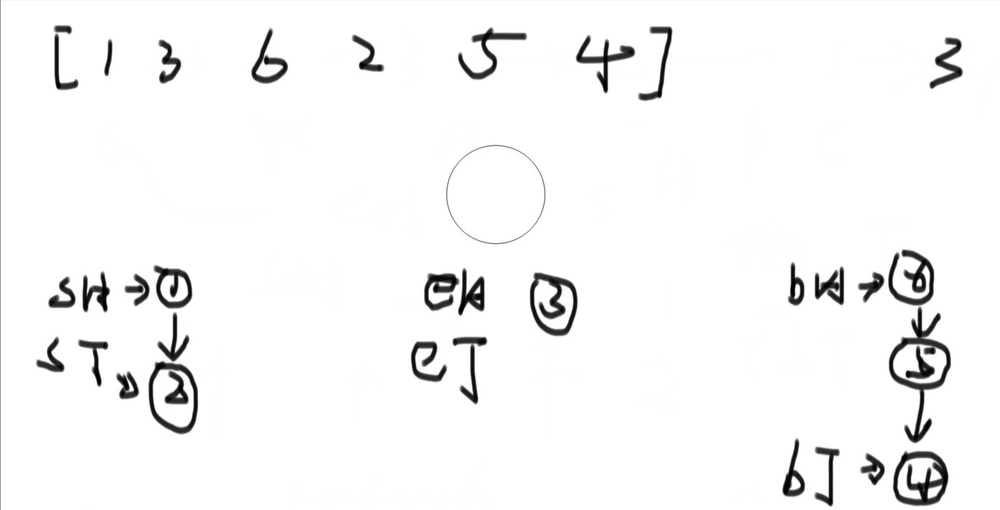
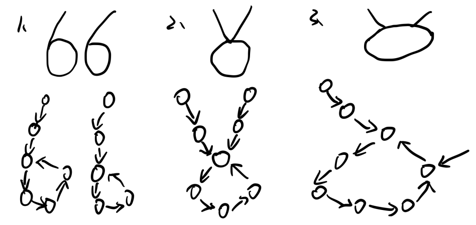

## **1、快慢指针**

```java
public static class Node {
	public int value;
    public Node next;
    
    public Node(int v) {
        value = v;
    }
}

// 1）输入链表头节点，奇数长度返回中点，偶数长度返回上中点
public static Node midOrUpMidNode(Node head) {
    if( head == null || head.next == null || head.next.next == null) {
        return head;
    }
    Node slow = head;
    Node fast = head;
    while (fast.next != null && fast.next.next != null){
        slow = slow.next;
        fast = fast.next.next;
    }
    return slow;
}

// 2）输入链表头节点，奇数长度返回中点，偶数长度返回下中点
public static Node midOrDownMidNode(Node head) {
    if (head == null || head.next == null) {
        return head;
    }
    Node slow = head.next;
    Node fast = head.next;
    while (fast.next != null && fast.next.next != null){
        slow = slow.next;
        fast = fast.next.next;
    }
    return slow;
}

// 3）输入链表头节点，奇数长度返回中点前一个，偶数长度返回上中点前一个
public static Node midOrUpMidPreNode(Node head) {
    if (head == null || head.next == null || head.next.next == null) {
        return head;
    }
    Node slow = head;
    Node fast = head.next.next;
    while (fast.next != null && fast.next.next != null){
        slow = slow.next;
        fast = fast.next.next;
    }
    return slow;
}

// 4）输入链表头节点，奇数长度返回中点前一个，偶数长度返回下中点前一个
public static Node midOrDownMidPreNode(Node head) {
    if (head == null || head.next == null) {
        return null;
    }
    if (head.next.next == null) {
        return head;
    }
    Node slow = head;
    Node fast = head.next;
    while (fast.next != null && fast.next.next != null) {
        slow = slow.next;
        fast = fast.next.next;
    }
    return slow;
}
```

## **2、给定一个单链表的头节点head，请判断该链表是否为回文结构**

```java
// nead n extra space
public static boolean isPalindrome1(Node head) {
    Stack<Node> stack = new Stack<>();
    Node cur = head;
    while (cur != null) {
        stack.push(cur);
        cur = cur.next;
    }
    while (head != null) {
        if (head.value != stack.pop().value) {
            return false;
        }
        head = head.next;
    }
    return true;
}

// nead n / 2 extra space
public static boolean isPalindrome2(Node head) {
    if (head == null || head.next == null) {
        return true;
    }
    Node right = head.next;
    Node cur = head;
    while (cur.next != null && cur.next.next != null) {
        right = right.next;
        cur = cur.next.next;
    }
    Stack<Node> stack = new Stack<>();
    while (right != null) {
        stack.push(right);
        right = right.next;
    }
    while (!stack.isEmpty()) {
        if (head.value != stack.pop().value) {
            return false;
        }
        head = head.value;
    }
    return true;
}

// need O(1) extra space
/*
	这个方法其实就是将链表后半段进行反转，然后用两个指针从两边进行遍历判断
*/
public static boolean isPalindrome3(Node node) {
    if (head == null || head.next == null) {
        return true;
    }
    
    Node n1 = head;
    Node n2 = head;
    //让n1位于链表中点，n2仅仅起到一个终点判断的作用
    while (n2.next != null && n2.next.next != null) {
        n1 = n1.next;
        n2 = n2.next.next;
    }
    
    n2 = n1.next; // 让n2指向链表右半部的第一个节点处
    n1.next = null;
    Node n3 = null;
    // 反转后半部链表
    while (n2 != null) {
        n3 = n2.next;
        n2.next = n1;
        n1 = n2;
        n2 = n3;
    }
    n3 = n1;
    n2 = head;
    boolean res = true;
    while (n1 != null && n2 != null) {
        if (n1.value != n2.value) {
            res = false;
            break;
        }
        n1 = n1.next;
        n2 = n2.next;
    }
    // 将链表复原
    n1 = n3.next;
    n3.next = null;
    while (n1 != null) {
        n2 = n1.next;
        n1.next = n3;
        n3 = n1;
        n1 = n2;
    }
    return res;
}
```


## **3、将单向链表按某值划分成左边小、中间相等、右边大的形式**

​	将链表放入数组中，然后再进行实现

```java
public static Node listPartition1(Node node, int pivot) {
    if (head == null) {
        return head;
    }
    Node cur = head;
    
    // 获取链表的总长度
    int i = 0;
    while (cur != null) {
        i++;
        cur = cur.next;
    }
    
    Node[] nodeArr = new Node[i];
    cur = head;
    for (i = 0; i < nodeArr.length; i++) {
        nodeArr[i] = cur;
        cur = cur.next;
    }
    
    // 主要算法
    arrPartition(nodeArr, pivot);
    
    // 将排好序的数组中的Node连接起来
    for (i = 1;i != nodeArr.length; i++) {
        nodeArr[i -1].next = nodeArr[i];
    }
    nodeArr[i -1].next = null;
    return nodeArr[0];
}

public static void arrPartition(Node[] nodeArr, int pivot) {
    int small = -1;
    int big = nodeArr.length;
    int index = 0;
    while (index != big) {
        if (nodeArr[index].value < pivot) {
            swap(nodeArr, ++small, index++);
        }else if (nodeArr[index].value == pivot) {
            index++;
        }else {
            swap(nodeArr, --big, index);
        }
    }
}
```

​	不适用链表转数组的方式实现



1、过程图如上，准备好六个指针，分别代表小于区域的开头、小于区域的结尾、等于区域的开头、等于区域的结尾、大于区域的开头、大于区域的结尾

2、依次遍历链表，将其放到对应的位置上。

3、最后合并的时候，让sT指向eH，让eT指向bH，但是得注意null值判断。

```java
public static Node listPartition2(Node head, int pivot) {
    Node sH = null;
    Node sT = null;
    Node eH = null;
    Node eT = null;
    Node mH = null;
    Node mT = null;
    Node next = null;
    
    while (head != null) {
        next = head.next;
        head.next = null;
        if (head.value < pivot) {
            if (sH == null) {
                sH = head;
                sT = head;
            } else {
                sT.next = head;
                sT = head;
            }
        } else if (head.value == pivot) {
            if (eH == null) {
                eH = head;
                eT = head;
            } else {
                eT.next = head;
                eT = head;
            }
        } else {
            if (mH == null) {
                mH = head;
                mT = head;
            } else {
                mT.next = head;
                mT = head;
            }
        }
        
        //小于区域的尾巴连等于区域的头，等于区域的尾巴连大于区域的头
        if (sT != null) {
            sT.next = eH;
            // 谁去连大于区域的头，谁就是eT
            eT = eT == null ? sT : eT;
        }
        if (eT != null) {
            eT.next = mH;
        }
        return sH != null ? sH : (eH != null ? eH : mH);
    }
}
```


## 4、复制含有rand指针的链表

**一种特殊的单链表节点类描述如下**
		**class Node{**
				**int value;** 
				**Node next;**
				**Node rand;**
				**Node(int val) { value = val}**
		**}**
		**rand指针是单链表节点结构中新增的指针，rand可能指向链表中的任意一个节点，也可能指向null。给定一个由Node节点类型组成的无环单链表的头节点head，请实现一个函数完成这个链表的复制，并返回复制的新链表的头节点。【要求】：时间复杂度O(N)，额外空间复杂度O(1)**

4.1、使用hashMap的方式实现该题目

- 先遍历一遍链表，并且在hashMap里面创建对应的副本
- 再从头开始遍历链表，根据key的next和rand关系决定value的next和rand关系。
- 最后返回头节点副本

```java
public static Node copyListWithRand(Node head) {
    HashMap<Node, Node> map = new HashMap<>();
    Node cur = head;
    while (cur != null) {
        map.put(cur,new Node(cur.value));
        cur = cur.next;
    }
    cur = head;
    while (cur != null) {
        map.get(cur).next = map.get(cur.next);
        map.get(cur).rand = map.get(cur.rand);
        cur = cur.next;
    }
    return map.get(head);
}
```

4.2、第二种方法


- 首先遍历链表，让cur和cur.next之间插入一个cur ' ；
- 这样就可以不用通过hashMap建立cur和cur'的联系了，节省了空间

```java
public static Node copyListWithRand(Node head) {
    if (head == null) {
        return null;
    }
    Node cur = head;
    Node next = null;
    while (cur != null) {
        next = cur.next;
        cur.next = new Node(cur.value);
        cur.next.next = next;
        cur = next;
    }
    
    // 处理链表的rand部分
    cur = head;
    Node curCopy = null;
    while (cur != null) {
        next = cur.next.next;
        curCopy = cur.next;
        curCopy.rand = cur.rand != null ? cur.rand.next : null;
        cur = next;
    }
    
    // 将复制好的链表分离出来
    Node res = head.next;
    cur = head;
    while (cur != null) {
        next = cur.next.next;
        curCopy = cur.next;
        cur.next = next;
        curCopy.next = next != null ? next.next : null;
        cur = next;
    }
    return res;
}
```


## 5、两单链表相交问题

**给定两个可能有环也可能无环的单链表，头节点head1和head2。请实现一个函数，如果两个链表相交，请返回相交的第一个节点。如果不相交，返回null。【要求】：如果两个链表长度之和为N，时间复杂度请达到O(N)，额外空间复杂度请达到O(1)。**

1、针对于这个问题，应该分情况讨论：①、如果两个链表都没有环，②、两个链表其中有一个有环（此时比不可能相交），③、两个链表都有环

2、因此首先得判断单链表有没有环，如果有环，就返回第一个入环节点，否则返回null

```java
// 找到链表第一个入环节点，如果无环就返回null
public static Node getLoopNode(Node head) {
    if (head == null || head.next == null || head.next.next == null) {
        return null;
    }
    Node slow = head.next;
    Node fast = head.next.next;
    while (fast != slow) {
        if (fast.next == null || fast.next.next == null) {
            return null;
        }
        fast = fast.next.next;
        slow = slow.next;
    }
    fast = head;
    while (slow != fast) {
        fast = fast.next;
        slow = slow.next;
    }
    return slow;
}
```

如果两个链表都无环，则返回两个链表第一个相交节点，不过不相交就返回null

思路：两个链表如果相交，那么他们的尾节点必然相等（地址相等），然后同时定义一个变量n，用来记录两个链表长度的差值，第一个链表遍历的时候n++，第二个链表遍历的时候n--。当遍历完成后，将长的那个链表减去n长度，再依次比较两个链表。

```java
public static Node noLoop(Node head1, Node head2) {
    if (head1 == null || head2 == null) {
        return null;
    }
    Node cur1 = head1;
    Node cur2 = head2;
    int n = 0;
    while (cur1.next != null) {
        n++;
        cur1 = cur1.next;
    }
    while (cur2.next != null) {
        n--;
        cur2 = cur2.next;
    }
    if (cur1 != cur2) {
        return null;
    }
    
    cur1 = n > 0 ? head1 : head2; //谁长，谁变成cur1
    cur2 = cur1 == head1 ? head2 : head1;
    
    n = Math.abs(n);
    while (n != 0) {
        n--;
        cur1 = cur1.next;
    }
    while (cur1 != cur2) {
        cur1 = cur1.next;
        cur2 = cur2.next;
    }
    return cur1;
}
```

如果两个链表都有环，只能为三种情况：



如果是第二种情况，则loop1 == loop2，这样就可以将loop1看成是两个链表的尾节点，这就和上面的链表无环相交相类似。这里值得注意的地方，那就是loop1 和 loop2 虽然是两个链表相交的节点，但并不一定是第一个相交的节点。

对于第三种情况来说，取loop1 或者 loop2 都是可以的。如果真的是第三种情况，那么用一个指针从loop1的next处开始遍历，直到回到loop1处之前，一定能够遇到loop2。

```java
public static Node bothLoop(Node head1, Node loop1, Node head2, Node loop2) {
    Node cur1 = null;
    Node cur2 = null;
    if (loop1 == loop2) { // 说明是第二种情况
        cur1 = head1;
        cur2 = head2;
        int n = 0;
        while (cur1 != loop1) {
            n++;
            cur1 = cur1.next;
        }
        while (cur2 != loop2) {
            n--;
            cur2 = cur2.next;
        }
        cur1 = n > 0 ? head1 : head2;
        cur2 = cur1 == head1 ? head2 : head1;
        n = Math.abs(n);
        while (n != 0) {
            n--;
            cur1 = cur1.next;
        }
        while (cur1 != cur2) {
            cur1 = cur1.next;
            cur2 = cur2.next;
        }
        return cur1;
    } else {
        cur1 = loop1.next;
        while (cur1 != loop1) {
            if (cur1 == loop2) {
                return loop1;
            }
            cur1 = cur1.next;
        }
        return null;
    }
}
```

将上述所有内容结合起来就得到该题解：

```java
public static Node getIntersectNode(Node head1, Node head2) {
    if (head1 == null || head2 == null) {
        return null;
    }
    Node loop1 = getLoopNode(head1);
    Node loop2 = getLoopNode(head2);
    if (loop1 == null && loop2 == null) {
        return noLoop(head1, head2);
    }
    if (loop1 != null && loop2 != null) {
        return bothloop(head1, loop1, head2, loop2);
    }
    return null;
}
```


## 6、不给头节点删除规定节点

**能不能不给单链表的头节点，只给想要删除的节点，就能做到在链表上将这个点给删掉**

答案是不能的，虽然我们可以将想要删除的节点node的next节点的值覆盖到node上，然后让node的next指向node的next的next，这样可以达到删除该节点的伪效果，但是该办法无法删除最后一个节点。