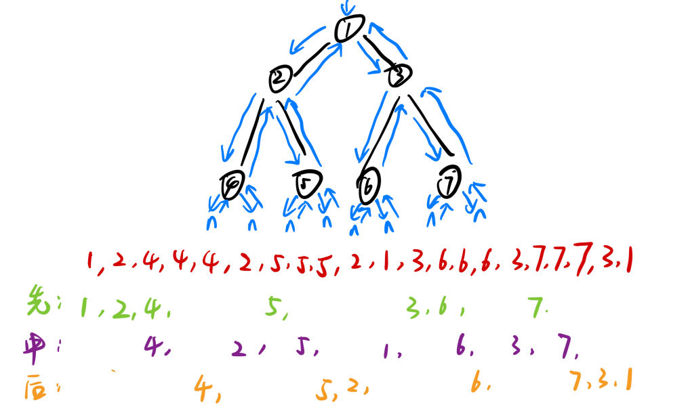
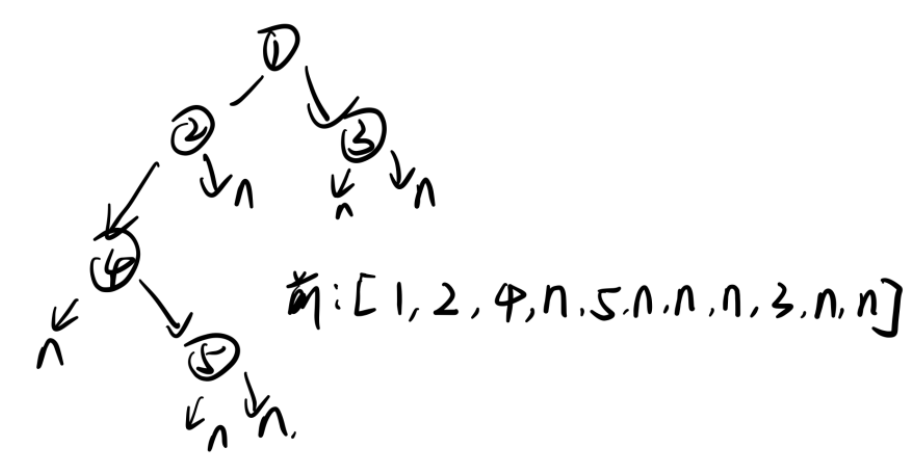
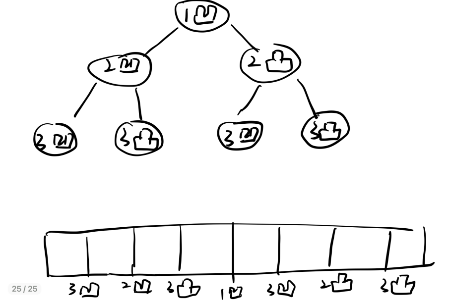

# 递归序

对于一棵二叉树来说，在进行一次完整的遍历的时候，每个节点都会经历三次



因此对于先、中、后序遍历，就是在第一、二、三次遇到该节点的时候进行输出数据

# 先、中、后序遍历

## 先序遍历

```java
public static void pre(Node head) {
    if (head == null) {
        return;
    }
    System.out.println(head.value);
    pre(head.left);
    pre(head.right);
}
```

## 中序遍历

```java
public static void in(Node head) {
    if (head == null) {
        return;
    }
    in(head.left);
    System.out.println(head.value);
    in(head.right);
}
```

## 后序遍历

```java
public static void pos(Node head) {
    if (head == null) {
        return;
    }
    pos(head.left);
    pos(head.right);
    System.out.println(head.value);
}
```


# 非递归实现先中后遍历

## 先序遍历

1. 首先将头节点放入栈中，然后弹出栈顶，并打印该元素
2. 接着将该元素的右节点和左结点依次压入栈中
3. 再弹出栈顶，打印后，执行步骤2

```java
public static void pre(Node head) {
    if (head != null) {
        Stack<Node> stack = new Stack<>();
        stack.add(head);
        while (!stack.isEmpty()) {
            head = stack.pop();
            System.out.println(head.value + " ");
            if (head.right != null) {
                stack.push(head.right);
            }
            if (head.left != null) {
                stack.push(head.left);
            }
        }
    }
}
```

## 中序遍历

这个并不好理解，可以直接记忆。先将整条左边界压入栈中，然后弹出的时候就是左、头的顺序了，处理完左边后才能处理右边

```java
public static void in(Node head) {
    if (head != null) {
        Stack<Node> stack = new Stack<>();
        while (!stack.isEmpty() || head != null) {
            // 将整条左边界压入栈中
            if (head != null) {
                stack.push(head);
                head = head.left;
            } else {
                /* 
                	此时head已经为null了，说明左边界已经完全压入栈中了
                	将栈顶元素弹出并打印，这个打印的元素此时的左子树已经全都处理完了
                	让head指向右节点，这时候开始处理右子树
                	这样就是左、中、后的遍历顺序了
                */
                head = stack.pop();
                System.out.print(head.value + " ");
                head = head.right;
            }
        }
    }
}
```


## 后序遍历

1、对于非递归实现前序遍历来说，是先、左、右的顺序，于是我们也可以变成先、右、左的顺序，然后反转后就是后序遍历

```java
public static void pos(Node head) {
    if (head != null) {
        Stack<Node> s1 = new Stack<>();
        Stack<Node> s2 = new Stack<>();
        s1.push(head);
        while (!s1.isEmpty()) {
            head = s1.pop();
            s2.push(head);
            if (head.left != null) {
                s1.push(head.left);
            }
            if (head.right != null) {
                s1.push(head.right);
            }
        }
        while (!s2.isEmpty()) {
            System.out.print(s2.pop().value + " ");
        }
    }
}
```

2、只使用一个栈就完成非递归后序遍历

h指向上次已经处理的节点，当我们要处理c节点的时候，先看看左结点有没有被处理，再看看右节点有没有被处理，如果都处理了就直接处理c节点。

```java
public static void pos(Node h) {
    if (h != null) {
        Stack<Node> stack = new Stack<>();
        stack.push(h);
        Node c = null;
        while (!stack.isEmpty()) {
            c = stack.peek();
            if (c.left != null && h != c.left && h != c.right) {
                // 说明当前节点的左数还没被处理
                stack.push(c.left);
            } else if (c.right != null && h != c.right) {
                // 说明该节点的右数还没被处理
                stack.push(c.right);
            } else {
                // 左右都处理了，就直接处理当前节点
                System.out.println(c.value + " ");
                // h指向已经被处理了的节点
                h = c;
            }
        }
    }
}
```


# 按层遍历

```java
public static void level(Node node) {
    if (head == null) {
        return;
    }
    Queue<Node> queue = new LinkedList<>();
    queue.add(head);
    while (!queue.isEmpty()) {
        Node cur = queue.poll();
        System.out.println(cur.value);
        if (cur.left != null) {
            queue.add(cur.left);
        }
        if (cur.right != null) {
            queue.add(cur.right);
        }
    }
}
```


# 最大宽数

1、使用hashMap进行辅助处理

```java
public static int maxWidthUseMap(Node head) {
	if (head == null) {
    	return 0;    
    }
    Queue<Node> queue = new LinkedList<>();
    queue.add(head);
    
    HashMap<Node, Integer> levelMap = new HashMap<>();
    levelMap.put(head, 1);
    int curLevel = 1;  // 当前正在统计哪一层
    int curLevelNodes = 0; // curLevel层宽度目前是多少
    int max = 0;
    while (!queue.isEmpty()) {
        Node cur = queue.poll();
        // 当前节点所属的层次
        int curNodeLevel = levelMap.get(cur);
        if (cur.left != null) {
            queue.add(cur.left);
            levelMap.put(cur.left, curNodeLevel +1);
        }
        if (cur.right != null) {
            queue.add(cur.right);
            levelMap.put(cur.right, curNodeLevel +1);
        }
        // 说明还在当前层遍历
        if (curLevel == curNodeLevel) {
            curLevelNodes++;
        } else {
            max = Math.max(max, curLevelNodes);
            curLevel++;
            curLevelNodes = 1;
        }
    }
    // 因为每次max的判断都是等到上一层的结束才进行，
    // 因此等到while循环结束之后再次进行一次判断
    return Math.max(max, curLevelNodes);
}
```

2、不使用hashMap进行实现

```java
public static int maxWidthNoMap(Node head) {
    if (head == null) {
        return 0;
    }
    Queue<Node> queue = new LinkedList<>();
    queue.add(head);
    Node curEnd = head; // 当前层最右节点是谁
    Node nextEnd = null; // 下一层最右节点是谁
    int max = 0;
    int curLevelNodes = 0;
    while (!queue.isEmpty()) {
        Node cur = queue.poll();
        if (cur.left != null) {
            queue.add(cur.left);
            nextEnd = cur.left;
        }
        if (cur.right != null) {
            queue.add(cur.right);
            nextEnd = cur.right;
        }
        curLevelNodes++;
        if (cur == curEnd) {
            max = Math.max(max, curLevelNodes);
            curLevelNodes = 0;
            curEnd = nextEnd;
        }
    }
    return max;
}
```


# 二叉树序列化与反序列化

二叉树可以通过先序、后序或者层序遍历的方式序列化和反序列化，但是无法通过中序遍历的方式实现序列化和反序列化

## 前序实现



```java
// 前序实现序列化
public static Queue<String> preSerial(Node head) {
    Queue<String> ans = new LinkedList<>();
    pres(head, ans);
    return ans;
}

public static void pres(Node head, Queue<String> ans) {
    if (head == null) {
        ans.add(null);
    } else {
        ans.add(String.valueOf(head.value));
        pres(head.left, ans);
        pres(head.right, ans);
    }
}

// 前序实现反序列化
public static Node buildByPreQueue(Queue<String> prelist) {
    if (prelist == null || preList.size() == 0) {
        return null;
    }
    return preb(prelist);
}

public static Node preb(Queue<String> prelist) {
    String value = prelist.poll();
    if (value == null) {
        return null;
    }
    Node head = new Node(Integer.valueOf(value));
    head.left = preb(prelist);
    head.right = preb(prelist);
    return head;
}
```


## 后序实现

```java
// 后序实现序列化
public static Queue<String> posSerival(Node head) {
    Queue<String> ans = new LinkedList<>();
    poss(head, ans);
    return ans;
}

public static void poss(Node head, Queue ans) {
    if (head == null) {
        ans.add(null);
    } else {
        poss(head.left, ans);
        poss(head.right, ans);
        ans.add(String.valueOf(head.value));
    }
}


// 后序实现反序列化
public static Node buildByPosQueue(Queue<String> poslist) {
    if (poslist == null || poslist.size() == 0) {
        return null;
    }
    Stack<String> stack = new Stack<>();
    // 左右中 -- 中右左 
    while (!poslist.isEmpty()) {
        stakc.push(poslist.poll());
    }
    return posb(stack);
}

public static Node posb(Stack<String> posstack) {
    String value = posstack.pop();
    if (value == null) {
        return null;
    }
    Node head = new Node(Integer.valueOf(value));
    head.right = posb(posstack);
    head.left = posb(posstack);
    return head;
}
```


## 层序实现

```java
public static Queue<String> levelSerial(Node head) {
    Queue<String> ans = new LinkedList<>();
    if (head == null) {
        ans.add(null);
    } else {
        ans.add(String.valueOf(head.value));
        Queue<Node> queue = new LinkedList<>();
        queue.add(head);
        while (!queue.isEmpty()) {
            head = queue.poll();
            if (head.left != null) {
                ans.add(String.valueOf(head.left.value));
                queue.add(head.left);
            } else {
                ans.add(null);
            }
            if (head.right != null) {
                ans.add(String.valueOf(head.right.value));
                queue.add(head.right);
            } else {
                ans.add(null);
            }
        }
    }
    return ans;
}

public static Node buildByLevelQueue(Queue<String> levelList) {
    if (levelList == null || levelList.size() == 0) {
        return null;
    }
    Node head = generateNode(levelList.poll());
    Queue<Node> queue = new LinkedList<>();
    if (head != null) {
        queue.add(head);
    }
    Node node = null;
    while (!queue.isEmpty()) {
        node = queue.poll();
        node.left = generateNode(levelList.poll());
        node.right = generateNode(levelList.poll());
        if (node.left != null) {
            queue.add(node.left);
        }
        if (node.right != null) {
            queue.add(node.right);
        }
    }
    return head;
}

public static Node generateNode(String val) {
    if (val == null) {
        return null;
    }
    return new Node(Integer.valueOf(val));
}
```


# 实现打印一个树的打印函数

这个打印的话我们可以将整棵树逆时针九十度进行打印，然后按照右、中、左的顺序进行遍历打印

```java
public static void printTree(Node head) {
    System.out.println("Binary Tree:");
    printInOrder(head, 0, "H", 17);
    System.out.println();
}

/*
	height: 位于树上的第几层
	to: 打印的数据的前后标识
	len: 打印的数据的总长度，比如打印1，就在1前面添加8个空格，1后面也添加8个空格
*/
public static void printInOrder(Node head, int height, String to, int len) {
    if (head == null) {
        return;
    }
    printInOrder(head.right, height + 1, "v", len);
    
    String val = to + head.value + to;
    int lenM = val.length();
    int lenL = (len - lenM) / 2;
    int lenR = len - lenM - lenL;
    val = getSpace(lenL) + val + getSpace(lenR);
    System.out.println(getSpace(height * len) + val);
    
    printInOrder(head.left, height + 1, "^", len);
}

public static String getSpace(int num) {
    String space = " ";
    StringBuffer buf = new StringBuffer("");
    for (int i = 0; i < num; i++) {
        buf.append(space);
    }
    return buf.toString();
}
```


# 返回指定节点的后继节点

题目：

​	**如果有一棵含有指向其父节点的属性的二叉树，求指定节点的后继节点。**

后继节点指的是，将二叉树按照中序遍历打印后，指定节点的下一个应该打印的节点即为后继节点

1. 如果指定节点有右子树，那么它的后继节点必然是右子树的最左边的节点
2. 如果指定节点没有右子树，那么就找它的父节点，如果它是它父节点的左子树，就打印该父节点，否则继续找父节点的父节点。

```java
public static class Node {
    public int value;
    public Node left;
    public Node right;
    public Noe parent;
    
    public Node(int data) { this.value = data; }
}

public static Node getSuccessorNode(Node node) {
    if (node == null) {
        return node;
    }
    if (node.right != null) {
        return getLeftMost(node.right);
    } else {
        Node parent = node.parent;
        while (parent != null && parent.right == node) {
            node = parent;
            parent = node.parent;
        }
        return parent;
    }
}

public static Node getLeftNode(Node node) {
    if (node == null) {
        return null;
    }
    while (node.left != null) {
        node = node.left;
    }
    return node;
}
```


# 折纸打印凹痕问题

> 请把一段纸条竖着放在桌子上，然后从纸条的下边向上对着1次，压出折痕后展开。此时这很是凹下去的，即折痕突起的方向指向纸条的背面。如果从纸条的下边向上方连续对折两次，压出折痕后展开，此时有3条折痕，从上到下依次是下折痕、下折痕和上折痕。
>
> 给定一个输入参数N，代表纸条都从下边向上方连续对着N次。请从上到下打印所有折痕的方向。
>
> 例如：N = 1时，打印：dowm 
>
> ​			N = 2时，打印：dowm dowm up



这个问题看起来挺复杂的，其实是有一定的规律的。当我们进行对折的时候，每一次之前的折痕的上一个折痕是凹下去的，下一个折痕是凸起来的。因此就可以构成一个假象的二叉树，进行中序遍历就行

```java
public static void printAllFolds(int N) {
    printProcess(1, N, true);
}

/*
	递归过程，来到了某一个节点
	i是节点的层数，N是对折了几次，也就是一共的层数
*/
public static void printProcess(int i, int N, boolean down) {
    if (i > N) {
        return;
    }
    printProcess(i + 1, N, true);
    System.out.println(down ? "down " : "up ");
    printProcess(i + 1, N, false);
}
```

