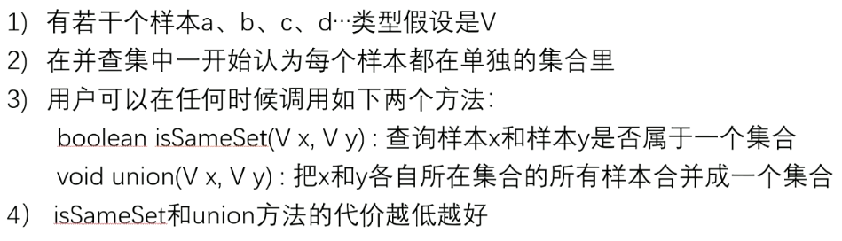

# 并查集



所谓的并查集，其实就是将两个集合进行合并，也就是连通器相关算法

```java
public static class UnionSet<V> {
    public HashMap<V, Node<V>> nodes; // 所有的数据节点
    public HashMap<Node<V>, Node<V>> parents; // 它们的父节点 前一个的父节点是后一个
    public HashMap<Node<V>, Integer> sizeMap; // 节点所在集合的大小
    
    public UnionSet(List<V> values) {
        for (V cur : values) {
            Node<V> node = new Node<>(cur);
            nodes.put(cur, node);
            parents.put(node, node);
            sizeMap.put(node, 1);
        }
    }
    
    // 从点cur开始一直往上找，找到不能再往上的代表点，返回，并进行一些优化
    public Node<V> findFather(Node<V> cur) {
        Stack<Node<V>> path = new Stack<>();
        while (cur != parents.get(cur)) {
            path.push(cur);
            cur = parents.get(cur);
        }
        // 此时cur就是代表点了，开始进行优化
        while (!path.isEmpty()) {
            parents.put(path.pop(), cur);
        }
        // 将初始cur所有的前置节点（父节点或爷爷节点）都挂载在代表点上
        return cur;
    }
    
    public boolean isSameSet(V a, V b) {
        if (!nodes.containsKey(a) || !nodes.containsKey(b)) {
            return false;
        }
        
        return findFather(nodes.get(a)) == findFather(nodes.get(b));
    }
    
    public void union(V a, V b) {
        if (!nodes.containsKey(a) || !nodes.containsKey(b)) {
            return false;
        }
        Node<V> aHead = findFather(nodes.get(a));
        Node<V> bHead = findFather(nodes.get(b));
        if (aHead != bHead) {
            int aSetSize = sizeMap.get(aHead);
            int bSetSize = sizeMap.get(bHead);
            Node<V> big = aSetSize >= bSetSize ? aHead : bHead;
            Node<V> small = big == aHead ? bHead : aHead;
            parents.put(small, big);
            sizeMap.put(big, aSetSize + bSetSize);
            sizeMap.remove(small);
        }
    }
}

// 将数据封装成节点
public static class Node<V> {
    V value;
    public Node(V v) { value = v;}
}
```

> 如果两个user，a字段一样或者b字段一样、或者c字段一样，就认为这是一个人
>
> 比如银行卡甲乙丙三张的主人都是同一个身份证，说明这三张卡都是同一个人办理的
>
> 请合并user，返回合并之后的用户数量

```java
public static int mergeUsers(List<User> users) {
    UnionSet<User> unionFind = new UnionSet<>(users);
    HashMap<String, User> mapA = new HashMap<>();
    HashMap<String, User> mapB = new HashMap<>();
    HashMap<String, User> mapC = new HashMap<>();
    for (User user : users) {
        if (mapA.containsKey(user.a)) {
            unionFind.union(user, mapA.get(user.a));
        } else {
            mapA.put(user.a, user);
        }
        if (mapB.containsKey(user.b)) {
            unionFind.union(user, mapB.get(user.b));
        } else {
            mapB.put(user.b, user);
        }
        if (mapC.containsKey(user.c)) {
            unionFind.union(user, mapC.get(user.c));
        } else {
            mapC.put(user.c, user);
        }
    }
    return unionFind.getSetNum();
}

public static class User {
    public String a;
    public String b;
    public String c;

    public User(String a, String b, String c) {
        this.a = a;
        this.b = b;
        this.c = c;
    }
}
```

# 图的相关算法

图：

1. 由点的集合和边的集合构成
2. 虽然存在有向图和无向图的概念，但实际上都可以用有向图来表达
3. 边上可能带有权值


图的算法都不算难，只不过coding的代价比较高

1. 先用自己最熟练的方式实现图结构的表达
2. 在自己熟悉的结构上实现所有常用的图算法作为模板
3. 把面试题提供的图结构转换为自己熟悉的图结构

**推荐的图结构**

```java
public class Graph {
    public HashMap<Integer, Node> nodes;
    public HashMap<Edge> edges;
    
    public Graph() {
        nodes = new HashMap<>();
        edges = new HashMap<>();
    }
}

public class Node {
    public int value; // 该节点的编号
    public int in; // 入度数
    public int out; // 出度数
    public ArrayList<Node> nexts; // 该节点所有的邻节点
    public ArrayList<Edge> edges; // 该节点所有的边关系
    
    public Node(int value) {
        this.value = value;
        in = 0;
        out = 0;
        nexts = new ArrayList<>();
        edges = new ArrayList<>();
    }
}

public class Edge {
    public int weight; // 权重
    public Node from;
    public Node to;
}
```

> 图结构的转换问题
>
> 将题目给定的图结构转换为我们自己的图结构

```java
// matrix 所有的边
// N*3 的矩阵
// 每一行 [weight, from节点上面的值，to节点上面的值]
public static Graph createGraph(Integer[][] matrix) {
    Graph graph = new Graph();
    for (int i = 0; i < matrix.length; i++) {
        Integer weight = matrix[i][0];
        Integer from = matrix[i][1];
        Integer to = matrix[i][1];
        
        if (!graph.nodes.containsKey(from)) {
            graph.nodes.put(from, new Node(from));
        }
        if (!graph.nodes.containsKey(to)) {
            graph.nodes.put(to, new Node(to));
        }
        Node fromNode = graph.nodes.get(from);
        Node toNode = graph.nodes.get(to);
        Edge newEdge = new Edge(weight, fromNode, toNode);
        fromNode.nexts.add(toNode);
        fromNode.out++;
        toNode.in++;
        fromNode.edges.add(newEdge);
        graph.edges.add(newEdge);
    }
    return graph;
}
```


> 宽度优先遍历
>
> 1. 利用队列实现
> 2. 从源节点开始依次按照宽度进队列，然后弹出
> 3. 每弹出一个点，就把该节点所有没有进过队列的邻接点放入队列
> 4. 直到队列为空

```java
public static void bfs(Node node) {
    if (node == null) {
        return;
    }
    Queue<Node> queue = new LinkedList<>();
    HashSet<Node> set = new HashSet<>();
    queue.add(node);
    set.add(node);
    while (!queue.isEmpty()) {
        Node cur = queue.poll();
        System.out.println(cur.value);
        for (Node next : cur.nexts) {
            if (!set.contains(next)) {
                set.add(next);
                queue.add(next);
            }
        }
    }
}
```


> 图的深度优先遍历
>
> 1. 利用栈实现
> 2. 从源节点开始把节点按照深度放入栈，然后弹出
> 3. 每弹出一个点，就把该节点下一个没有进过栈的邻接点放入栈
> 4. 直到栈为空

```java
public static void dfs(Node node) {
    if (node == null) {
        return null;
    }
    Stack<Node> stack = new Stack<>();
    HashSet<Node> set = new HashSet<>();
    stack.add(node);
    set.add(node);
    System.out.println(node.value);
    while (!stack.isEmpty()) {
        Node cur = stack.pop();
        for (Node next : cur.nexts) {
            if (!set.contains(next)) {
                stack.push(cur);
                stack.push(next);
                set.add(next);
                System.out.println(next.value);
                break;
            }
        }
    }
}
```


> 图的拓扑排序算法
>
> 1. 在图中找到所有入度为0的点输出
> 2. 把所有入度为0的点在图中删除，继续找入度为0的点
> 3. 图的所有点被删除后，依次输出的顺序就是拓扑排序
>
> 要求：有向图且其中没有环
>

```java
public static List<Node> sortedTopology(Graph graph) {
    // key : 某个node
    // value : 剩余的入度
    HashMap<Node, Integer> inMap = new HashMap<>();
    // 剩余入度为0的点才能进这个队列
    Queue<Node> zeroInQueue = new LinkedList<>();
    for (Node node : graph.nodes.values()) {
        inMap.put(node, node.in);
        if (node.in == 0) {
            zeroInQueue.add(node);
        }
    }
    // 拓扑排序的结果
    List<Node> result = new ArrayList<>();
    while (!zeroInQueue.isEmpty()) {
        Node cur = zeroInQueue.poll();
        result.add(cur);
        for (Node next : cur.nexts) {
            inMap.put(next, inMap.get(next) - 1);
            if (inMap.get(next) == 0) {
                zeroInQueue.add(next);
            }
        }
    }
    return result;
}
```

> 最小生成树之Kruskal算法
>
> 1. 总是从权值最小的边开始考虑，依次考虑权值依次变大的边
> 2. 当前的边要么进入最小生成树的集合，要么丢弃
> 3. 如果当前的边进入最小生成树的集合中不会形成环，就要当前边
> 4. 如果当前边进入最小生成树的集合中会形成环，就不要当前边
> 5. 考虑完所有边之后，最小生成树的集合也得到了

```java
public static Set<Edge> kruskalMST(Graph graph) {
    UnionFind unionFind = new UnionFind(graph.nodes.values());
    // 小根堆
    PriorityQueue<Edge> priorityQueue = new PriorityQueue<>(new EdgeComparator());
    // 将所有的边加到小根堆里面
    for (Edge edge : graph.edges) {
        priorityQueue.add(edge);
    }
    Set<Edge> result = new HashSet<>();
    while (!priorityQueue.isEmpty()) {
        Edge edge = priorityQueue.poll();
        // 如果发现这条最小的边的两边的节点不在同一个集合中，就将其添加到结果中进行合并
        if (!unionFind.isSameSet(edge.from, edge.to)) {
            result.add(edge);
            unionFind.union(edge.from, edge.to);
        }
    }
    return result;
}

public static class EdgeComparator implements Comparator<Edge> {
    public int compare(Edge o1, Edge o2) {
        return o1.weight - o2.weight;
    }
}

public static class UnionFind {
    // 前一个的父节点是后一个
    private HashMap<Node, Node> fatherMap;
    private HashMap<Node, Integer> sizeMap;
    
    public UnionFind(Collection<Node> nodes) {
        fatherMap = new HashMap<Node, Node>();
        sizeMap = new HashMap<Node, Integer>();
        for (Node node : nodes) {
            fatherMap.put(node, node);
            sizeMap.put(node, 1);
        }
    }
    
    private Node findFather(Node node) {
        Stack<Node> path = new Stack<>();
        while (node != fatherMap.get(node)) {
            path.add(node);
            node = fatherMap.get(node);
        }
        while (!path.isEmpty()) {
            fatherMap.put(path.pop(), node);
        }
        return node;
    }
    
    public boolean isSameSet(Node a, Node b) {
        return findFather(a) == findFather(b);
    }
    
    public void union(Node a, Node b) {
        if (a == null || b == null) {
            return;
        }
        Node aHead = findFather(a);
        Node bHead = findFather(b);
        if (aHead != bHead) {
            int aSetSize = sizeMap.get(aHead);
            int bSetSize = sizeMap.get(bHead);
            Node big = aSetSize >= bSetSize ? aHead : bHead;
            Node small = big == aHead ? bHead : aHead;
            fatherMap.put(small, big);
            sizeMap.put(big, aSetSize + bSetSize);
            sizeMap.remove(small);
        }
    }
}
```


> 最小生成树算法之Prim
>
> 1. 可以从任意节点出发来寻找最小生成树
> 2. 某个点加入到被选取的点中后，解锁这个点出发的所有新的边
> 3. 在所有解锁的边中选最小的边，然后看看这个边会不会形成环
> 4. 如果会，不要当前边，继续考察剩下解锁的边中最小的边，重复3
> 5. 如果不会，要当前边，将该边的指向点加入到被选取的点中，重复2
> 6. 当所有点都被选取，最小生成树就得到了

```java
public static Set<Edge> primMST(Graph graph) {
    // 按边的权重进行排序
    PriorityQueue<Edge> priorityQueue = new PriorityQueue<>(new EdgeComparator());
    // 哪些点已经被解锁出来了
    HashSet<Node> nodeSet = new HashSet<>();
    Set<Edge> result = new HashSet<>();
    // 随便找一个点 同时也是防止森林的出现
    for (Node node : graph.nodes.values()) {
        if(!nodeSet.contains(node)) {
            nodeSet.add(node);
            // 由一个点解锁所有相邻的边
            for (Edge edge : node.edges) {
                priorityQueue.add(edge);
            }
            while (!priorityQueue.isEmpty()) {
                // 弹出解锁的最小边
                Edge edge = priorityQueue.poll();
                Node toNode = edge.to;
                if (!nodeSet.contains(toNode)) {
                    // 说明这个就是新点
                    nodeSet.add(toNode);
                    result.add(edge);
                    for (Edge nextEdge : toNode.edges) {
                        priorityQueue.add(nextEdge);
                    }
                }
            }
        }
    }
    return res;
}
```


> 最短路径算法之Dijkstra算法
>
> 1. 该算法必须指定一个源点
> 2. 生成一个源点到各个点的最小距离表，一开始只有一条记录，即源点到自己的最小距离为0，源点到其它点的最小距离都为正无穷大
> 3. 从距离表中拿出没拿过记录里的最小记录，通过这个点发出的边，更新源点到各个点的最小距离表，不断重复这一步
> 4. 源点到所有的点记录如果都被拿一遍，过程停止，最小距离表得到了


**注意这里D和E之间的距离为3，不小心擦掉了**

1. 首先选出A点就是源点，A到A的距离就是0
2. 从A开始，A和C、D、B相连，发现A到他们最小的是点B，因此遍历完之后更新表A，0；B，2；C，7；D，16
3. 再从distanceMap中选出一个最小的，就是C，7。C - A = 7，C - E = 4；对比发现A - E = 4 + 7 = 11。如图第三个所示
4. 再选出最小的为A - E = 11，发现E - D = 3，然后A经过E点到达D后距离为11 + 3 = 14 ，比16要小，进行覆盖
5. 整体流程大概如此，代码如下

```java
public static HashMap<Node, Integer> dijkstra(Node from) {
    // 从from出发到所有点的最小距离
    // key :从from出发到达key
    // value : 从from出发到达key的最小距离
    HashMap<Node, Integer> distanceMap = new HashMap<>();
    distanceMap.put(from, 0);
    // 已经求过距离的节点，以后再也不碰
    HashSet<Node> selectedNodes = new HashSet<>();
    Node minNode = getMinDistanceAndUnselectedNode(distanceMap, selectedNodes);
    while (minNode != null) {
        int distance = distanceMap.get(minNode);
        for (Edge edge : minNode.edges) {
            Node toNode = edge.to;
            if (!distanceMap.containsKey(toNode)) {
                distanceMap.put(toNode, distance + edge.weight);
            } else {
                // 从from到toNode之前需要的距离 和 经过edge.to点之后的距离进行比较
                distanceMap.put(edge.to, Math.min(distanceMap.get(toNode), 
                                                  distance + edge.weight));
            }
        }
        selectedNodes.add(minNode);
        minNode = getMinDistanceAndUnselectedNode(distanceMap, selectedNodes);
    }
    return distanceMap;
}

// 返回from点到其它未被选过的最小距离的点
public static Node getMinDistanceAndUnselectedNode(
    HashMap<Node, Integer> distanceMap, HashSet<Node> touchedNodes) {
    Node midNode = null;
    int minDistance = Integer.MAX_VALUE;
    // 遍历HashMap
    for (Entry<Node, Integer> entry : distanceMap.entrySet()) {
        Node node = entry.getKey();
        int distance = entry.getValue();
        if (!touchedNodes.contains(node) && distance < minDistance) {
            minNode = node;
            minDistance = distance;
        }
    }
    return minNode;
}
```

但是每次找出最小节点的时候都需要遍历整个distanceMap，耗时

可以用小根堆代替hashMap，因为他会自动排序，但是我们有时需要修改小根堆内节点里面的数据，这是系统提供的小根堆无法实现的，需要我们自行实现小根堆

