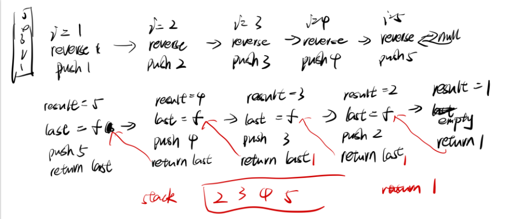
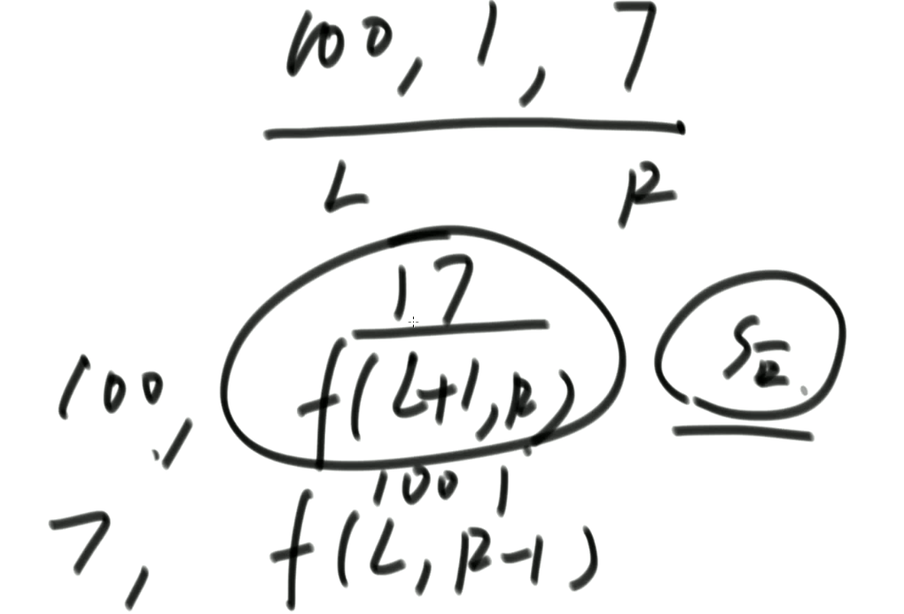

暴力递归就是尝试

1. 把问题转化为规模缩小了的同类问题的子问题
2. 有明确的不需要继续进行递归的条件
3. 有当得到了子问题的结果之后的决策过程
4. 不记录每一个子问题的解

# Hanoi

> 打印n层汉诺塔从最左边移动到最右边的全部过程

```java
public static void hanoi(int n) {
    if (n > 0) {
        func(n, "left", "right", "mid");
    }
}

// 1 - N圆盘，目标是from - to，other是另一个
public static void func(int N, String from, String to, String other) {
    if (N == 1) {
        System.out.println("Move 1 from " + from + " to " + to);
    } else {
        func(N - 1, from, other, to);
        System.out.println("Move " + N + " from " + from + " to " + to);
        func(N -1, other, to, from);
    }
}
```

# PrintAllSubsquences

> 打印一个字符串的全部子序列
>
> 比如字符串abc，那么子序列就是a、b、c、ab、ac、bc、abc，不会出现ba等等
>
> 可以不连续，但是相对顺序不能变

解题思路：给每个位置都定义两种状态，选择和不选择，这样就成了二叉树结构

```java
public static List<String> subs(String s) {
    char[] str = s.toCharArray();
    String path = "";
    List<String> ans = new ArrayList<>();
    process(str, 0, ans, path);
    return ans;
}

// str固定不变
// index：此时来到的位置，要 or 不要
// 如果index来到了str中的终止位置，就将沿途的答案放到ans中
// 之前作过的选择 就是path
public static void process(char[] str, int index, List<String> ans, String path) {
    if (index == str.length) {
        ans.add(path);
        return;
    }
    String no = path;
    process(str, index + 1, ans, no);
    String yes = path + str[index];
    process(str, index + 1, ans, yes);
}
```


# PrintAllPermutations

```java
public static ArrayList<String> permutation(String str) {
    ArrayList<String> res = new ArrayList<>();
    if (str == null || str.length() == 0) {
        return res;
    }
    char[] chs = str.toCharArray();
    process(chs, 0, res);
    return res;
}

// 表示0..i - 1的位置上都已经处理好了
// i...都有机会来到i位置
public static void process(char[] str, int i, ArrayList<String> ans) {
    if (i == ans.length) {
        ans.add(String.valueOf(str));
        return;
    }
    for (int j = i; j < str.length; j++) {
        swap(str, i, j);
        process(str, i + 1, ans);
        swap(str, i, j);
    }
}
```

# ReverseStackUsingRecursive

> 给你一个栈，请你逆序这个栈，不能申请额外的数据结构，只能使用递归函数

可以得到结论，我们可以利用递归获取某些数据



要想逆序整个栈，而且用递归方法

逆转0..N，就需要逆转1..N，因此就需要一个函数f，可以将栈底的元素取出来，然后等到它在栈中上面的元素逆序完之后再将其压入栈中就能完成整个逆序

因此核心功能在f函数里面

要想拿到栈底元素，就需要先将栈顶元素给pop出来，然后将剩下的元素继续执行f方法，直到将栈底元素给pop出来，然后依次进行返回，将每次pop出来的result依次返回

```java
// 取出栈底元素
public static int f(Stack<Integer> stack) {
    int result = stack.pop();
    if (stack.isEmpty()) {
        return result;
    } else {
        int last = f(stack);
        stack.push(result);
        return last;
    }
}

public static void reverse(Stack<Integer> stack) {
    if (stack.isEmpty()) {
        return;
    }
    int i = f(stack);
    reverse(stack);
    stack.push(i);
}
```

# ConvertToLetterString

> 规定1和A对应、2和B对应、3和C对应，那么一个数字字符串比如111就可以转换为AAA、KA和AK。
>
> 给定一个只有数字字符组成的字符串str，返回有多少种转换结果

解题思路：由于26个字母，因此如果首字符串为1，那么无论后面是什么数字都可以进行转化，如果是2，那么后面一位只能是0-6，如果是3-9，那么后面再加上后面一位的话肯定无法转化

```java
public static int number(String str) {
    if (str == null || str.length() == 0) {
        return 0;
    }
    return process(str.toCharArray(), 0);
}

public static int process(char[] str, int i) {
    if (i == str.length) {
        return 1;
    }
    if (str[i] == '0') {
        return 0;
    }
    if (str[i] == '1') {
        int res = process(str, i + 1);
        if (i + 1 < str.length) {
            res += process(str, i + 2);
        }
        return res;
    }
    if (str[i] == '2') {
        int res = process(str, i + 1);
        if (i + 1 < str.length && (str[i + 1] >= '0' && str[i + 1] <= '6')) {
            res += process(str, i + 2);
        }
        return res;
    }
    return process(str, i + 1);
}
```

# Knapsack

> 给定两个长度都为N的数组weights和values，weights[i]和values[i]分别代表i号物品的重量和价值。给定一个正数bag，表示一个载重bag的袋子，你装的物品不能超过这个重量，返回你能装下最多的价值是多少？

```java
public static int maxValue(int[] w, int[] v, int bag) {
    return process(w, v, 0, bag);
}

// 只剩下rest的空间了
// index.. 货物自由选择，但是剩余空间不要小于0
// 返回index..货物能获得的最大价值
public static int process(int[] w, int[] v, int index, int rest) {
    if (rest < 0) {
        return -1;
    }
    if (index == w.length) {
        return 0;
    }
    // 有货也有空间
    int p1 = process(w, v, index + 1, rest);// 没有选择该物品
    int p2 = -1;
    // 选择了该物品之后index + 1后物品的价值。
    int p2Next = process(w, v, index + 1, rest - w[index]);
    if (p2Next != -1) {
        p2 = v[index] + p2Next;
    }
    return Math.max(p1, p2);
}
```

动态规划版本，定义一个二维数组，`arr[i][j] = r`,表示在 i... 的货物自由选择，背包剩余重量为j，所能达到的最大价值为r

```java
public static int dpWay(int[] w, int[] v, int bag) {
    int N = w.length;
    int[][] dp = new int[N + 1][bag + 1];
    // 由于判断条件index == w.length ,return 0，因此dp[N][...] = 0
   	for (int index = N - 1; index >= 0; index++) {
        for (int rest = 0; rest <= bag; rest++) {
            int p1 = dp[index + 1][rest];
            int p2 = -1;
            if (rest - w[index] >= 0) {
                p2 = v[index] + dp[index + 1][rest - w[index]];
            }
            dp[index][rest] = Math.max(p1, p2);
        }
    }
    return dp[0][bag];
}
```


# CardsInLine

> 给定一个整形数组arr，代表数值不同的纸牌排成一条线，玩家A和玩家B依次拿走每张纸牌，规定玩家A先拿，玩家B后拿，但是每个玩家只能拿走最左或最右的纸牌，玩家A和玩家B都绝顶聪明。返回最后获胜者的分数。



如果给定的牌是100、1、7

那么如果我是后手，先手选择100或者7后，那么就轮到我是先手了，也就是在1、7之间挑选或者100、1之间挑选，那么一开始的先手肯定只会留给我们最小的，防止我们胜利。因此我的分数只能是f(1,2)和f(0,1)之间的最小值

```java
public static int win(int[] arr) {
    if (arr == null || arr.length == 0) {
        return 0;
    }
    // 先手从0到length-1的分数和后手从0到length-1的分数取最大值
    return Math.max(f(arr, 0, arr.length - 1), s(arr, 0, arr.length -1));
}

public static int f(int[] arr, int L, int R) {
    //只剩一张牌了，先手肯定拿这张牌
    if (L == R) {
        return arr[L];
    }
    /*
    	先手拿最左边的牌后，后手肯定会在L+1到R之间给先手留最小的情况
    	先手拿最右边的牌后，后手肯定会在L到R-1之间给先手留最小的情况
    	先手需要获得两种方式的最大值进行返回
    */
    return Math.max(arr[L] + s(arr, L + 1, R), arr[R] + s(arr, L, R - 1));
}

public static int s(int[] arr, int L, int R) {
    // 只剩一张牌，后手没有牌拿
    if (L == R) {
        return 0;
    }
    /*
    	后手无法决定拿哪张牌，但是一定是留给先手最小的情况
    */
    return Math.min(f(arr, L + 1, R), f(arr, L, R - 1));
}
```

动态规划版本

```java
public static int windp(int[] arr) {
    if (arr == null || arr.length == 0) {
        return 0;
    }
    int N = arr.length;
    int[][] f = new int[N][N];
    int[][] s = new int[N][N];
    for (int i = 0; i < N; i++) {
        f[i][i] = arr[i];
    }
    for (int col = 1; col < N; col++) {
        // 对角线出发位置(0, col)
        int L = 0;
        int R = col;
        while (L < N && R < N) {
            f[L][R] = Math.max(arr[L] + s[L + 1][R], arr[R] + s[L][R - 1]);
            s[L][R] = Math.min(f[L + 1][R], f[L][R - 1]);
            L++;
            R++;
        }
    }
    return Math.max(f[0][N - 1], s[0][N - 1]);
}
```


# NQueens

> N皇后问题
>
> N皇后问题指的是在N*N的棋盘上要摆N个皇后，要求任何两个皇后不同行、不同列，也不在同一条斜线上

```java
public static int nums(int n) {
    if ( n < 1) {
        return 0;
    }
    int[] record = new int[n];
    return process(0, record, n);
}

// i 当前行  n 整体一共多少行
// 返回值是摆完0..i-1个皇后后，剩下的部分的合理摆法
public static int process(int i, int[] record, int n) {
    // 说明已经终止了，就只有前面摆好的那一种
    if (i == n) {
        return 1;
    }
    int res = 0;
    // 对i行所有的列都进行尝试
    for (int j = 0; j < n; j++) {
        // 验证如果皇后放在i,j处，是否符合规则
        if (isvalid(record, i, j)) {
            // 不需要还原，因为下一次会直接覆盖
            record[i] = j;
            res += process(i + 1, record, n);
        }
    }
    return res;
}

public static boolean isValid(int[] record, int i, int j) {
    for (int k = 0; k < i; k++) {
        if (j == record[k] || Math.abs(record[k] - j) == Math.abs(i - k)) {
            return false;
        }
    }
    return true;
}
```

可以用位运算进行优化

```java
public static int num(int n) {
    if (n < 1 || n > 32) {
        return 0;
    }
    // 如果是13皇后问题，limit 最右13个1，其它都是0
    // n = 3 的话 1<<n --->  0...01000 减去1之后就是0..0111;
    int limit = n == 32 ? -1 : (1 << n) - 1;
    return process(limit, 0, 0, 0);
}

// limit 划定了问题的规模 -> 固定

// colLim 列的限制，1的位置不能放皇后，0的位置可以
// leftDiaLim 左斜线的限制，1的位置不能放皇后，0的位置可以
// rightDiaLim 右斜线的限制，1的位置不能放皇后，0的位置可以
public static int process2(
    int limit, 
    int colLim, 
    int leftDiaLim,
    int rightDiaLim) {
    if (colLim == limit) { // base case
        return 1;
    }
    // 所有可以放皇后的位置，都在pos上
    // colLim | leftDiaLim | rightDiaLim   -> 总限制
    // ~ (colLim | leftDiaLim | rightDiaLim) -> 左侧的一坨0干扰，右侧每个1，可尝试
    int pos = limit & ( ~(colLim | leftDiaLim | rightDiaLim) );
    int mostRightOne = 0;
    int res = 0;
    while (pos != 0) {
        // 其取出pos中，最右侧的1来，剩下位置都是0
        mostRightOne = pos & 1(~pos + 1);
        pos = pos - mostRightOne;
        res += process2(limit, 
                        colLim | mostRightOne,
                        (leftDiaLim | mostRightOne) << 1,
                        (rightDiaLim | mostRightOne) >>> 1);
    }
    return res;
}
```

# RobotWalk

> 假设有排成一行的N个位置，记为1-N，N一定大于或等于2
>
> 开始时机器人在其中的M位置上（M一定是1到N中的一个）
>
> 如果机器人来到1位置，那么下一步只能往右来到2位置
>
> 如果机器人来到N位置，那么下一步只能往左来到N-1位置
>
> 如果机器人来到中间位置，那么下一步只能往左来到N-1位置
>
> 规定机器人必须走K步，最终能来到p位置（P也是1到N中的一个）的方法有多少中
>
> 给定四个参数N、M、K、P，返回方法数

对于f(7, 2, 3, 3)来说，机器人在2位置上，要走3步来到3这个位置上，有多少种方法

那么就可以拆解为f(7, 1, 2, 3) + f(7, 3, 2, 3)，即机器人往左走的方法加上往右走的方法，即机器人在1位置上，走两步来到3这个位置上的方法 + 机器人在3位置上，走两步来到3位置的方法

暴力递归版本如下：

```java
public static int ways(int n, int m, int k, int p) {
    if (n < 2 || k < 1 || m < 1 || m > n || p < 1 || p > n) {
        return 0;
    }
    return walk(n, m, k, p)
}

/*
	一行一共有n个位置，固定参数
	当前还在cur位置，可变参数
	还剩rest步没走，可变参数
	最终目标是p，可变参数
*/
public static int walk(int n, int cur, int rest, int p) {
    if (rest == 0) {
        return cur == p ? 1 : 0;
    }
    if (cur == 1) {
        return walk(n, 2, rest - 1, p);
    }
    if (cur == n) {
        return walk(n, n - 1, rest - 1, p);
    }
    return walk(n, cur + 1, rest - 1, p) + walk(n, cur - 1, rest - 1, p);
}
```

但是其实这里面会有很多重复的操作，浪费时间，可以将每种情况的结果用缓存存起来

改动版本如下：

```java
public static int waysCache(int n, int m, int k, int p) {
    if (n < 2 || k < 1 || m < 1 || m > n || p < 1 || p > n) {
        return 0;
    }
    int[][] dp = new int[n + 1][k + 1];
    for (int row = 0; row <= n; row++) {
        for (int col = 0; col <= k; col++) {
            // 表示f(n, row, col, p)还没有走过
            dp[row][col] = -1;
        }
    }
    return walk(n, m, k, p)
}

public static int walkCache(int n, int cur, int rest, int p, int[][] dp) {
    if(dp[cur][rest] != -1) {
        return dp[cur][rest];
    }
    if (rest == 0) {
        dp[cur][rest] = cur == P ? 1 : 0;
        return dp[cur][rest];
    }
    if (cur == 1) {
        dp[cur][rest] = walkCache(N, 2, rest - 1, P, dp);
        return dp[cur][rest];
    }
    if (cur == N) {
        dp[cur][rest] =walkCache(N, N - 1, rest - 1, P,dp);
        return dp[cur][rest];
    }
    dp[cur][rest] = walkCache(N, cur + 1, rest - 1, P,dp) 
        + walkCache(N, cur - 1, rest - 1, P, dp);
    return dp[cur][rest];
}
```

但是根据暴力递归和缓存来看，我们可以用一个二维数组来表示整个过程，甚至都不需要看题目就能完成动态规划过程。每次walk方法变的只有两个参数，因此可以用一个二维数组进行表示，`dp[n + 1][k + 1]`。

当rest为0的时候，即二维数组的整个第0列都能表示出来，然后继续看cur的条件：当cur为1的时候，它的值取决于2，rest - 1的值；当cur为n的时候，它的值取决于n - 1，rest - 1的值；当cur为中间的时候，它的值为cur + 1，rest - 1与cur - 1，rest - 1的和。

最后将整张表填完之后，返回`dp[m,k]`就行

```java
//M:当前位置，K：剩余步数
public static int ways(int N, int M, int K, int P) {
    if (N < 2 || K < 1 || M < 1 || M > N || P < 1 || P > N) {
        return 0;
    }
    int[][] dp = new int[N + 1][K + 1];
    dp[P][0] = 1;
    for (int rest = 1; rest <= K; rest++) {
        dp[1][rest] = dp[2][rest - 1];
        for (int cur = 2; cur < N; cur++) {
            dp[cur][rest] = dp[cur - 1][rest - 1] + dp[cur + 1][rest - 1];
        }
        dp[N][rest] = dp[N - 1][rest - 1];
    }
    return dp[M][K];
}
```

# StickersToSpellWord

> 给定一个字符串str，给定一个字符串类型的数组arr
>
> arr里的每一个字符串，代表一张贴纸，你可以把单个字符剪开使用，目的是拼出str来。返回需要至少多少张贴纸可以完成这个任务。每种贴纸可以无限使用
>
> 例子：str = "babac"，arr = {"ba", "c", "abcd"}
>
> 至少需要ba和abcd，可以拼出str

解题思路：

暴力递归来说，可以每次都让str试一试arr中的每一个贴纸，看看最少可以用多少张。为了方便表示，可以将arr中的贴纸转化为一个二维数组，其中每一行表示一个贴纸，`arr [i ][0] = r`表示第i张贴纸的a字符串含有r个。

使用缓存的方式来简化暴力递归

```java
public static int minStickers(String[] stickers, String targer) {
    int n = stickers.length;
    // 用二维数组代替所有贴纸
    int[][] map = new int[n][26];
    for (int i = 0; i < n; i++) {
        char[] str = stickers[i].toCharArray();
        for (char c : str) {
            map[i][c - 'a']++;
        }
    }
    // 用于存放结果，表示想要key字符串要被表示出来至少需要多少张贴纸
    HashMap<String, Integer> dp = new HashMap<>();
    dp.put("", 0);
    return process(dp, map, target);
}

public static int process(HashMap<Stirng, Integer> dp, int[][] map, String rest) {
    if (dp.containsKey(rest)) {
        return dp.get(rest);
    }
    // 搞定rest使用的最少贴纸数量
    int ans = Integer.MAX_VALUE;
    int n = map.length;
    // 用来代替rest字符串，方便和map进行交互
    int[] tmap = new int[26];
    char[] target = rest.toCharArray();
    for (char c : target) {
        tmap[c - 'a']++;
    }
    // 依次遍历所有的贴纸
    for (int i = 0; i < n; i++) {
        /*
        	防止出现死递归
        	比如rest = "abbc"，但是第i号贴纸是"bbc"，经过第一次递归后
        	rest = "a"，然后第二次递归的for循环再次到达i号贴纸的时候，发现无法消除rest，这样就会再次递归
        	如此反复就会导致出现死递归
        */
        if (map[i][target[0] - 'a'] == 0) {
            continue;
        }
        StringBuilder sb = new StringBuilder();
        for (int j = 0; j < 26; j++) {
            // tmap用来代替rest字符串，如果tmap[j]大于0，表示rest字符串还包含j + 'a'字符，需要进行消除
            if (tmap[j] > 0) {
                // 将消除后还剩下的字符给拼接上去
                for (int k = 0; k < Math.max(0, tmap[j] - map[i][j]); k++) {
                    sb.append((char) ('a' + j));
                }
            }
        }
        String s = sb.toString();
        int tmp = process(dp, map, s);
        if (tmp != -1) {
            ans = Math.min(ans, 1 + tmp);
        }
    }
    // 返回-1表示所有的字符串都无法对rest进行消除
    dp.put(rest, ans == Integer.MAX_VALUE ? -1 : ans);
    return dp.get(rest);
}
```


# PalindromeSubsequence

> 两个字符串的最长公共子序列问题

```java
public static int dpWay(char[] str1, char[] str2) {
    // dp[i][j] = r str1从0到i字符 和 str2从0到j字符 最长公共子序列是多长
    int[][] dp = new int[str1.length][str2.length];
    dp[0][0] = str1[0] == str2[0] ? 1 : 0;
    
    for (int i = 1; i < str1.length; i++) {
        dp[i][0] = Math.max(dp[i - 1][0], str1[i] == str2[0] ? 1 : 0);
    }
    for (int j = 1; j < str2.length; j++) {
        dp[0][j] = Math.max(dp[0][j - 1], str1[0] == str2[j] ? 1 : 0);
    }
    /*
    	对于dp中任意一个点，也就是str1 0-i 和str2 0-j的最长子序列是多少
    	1、他们的最长子序列在str1 0到i-1和str2 0到j中
    	2、他们的最长子序列在str1 0到i和str2 0到j-1中
    	3、他们的最长子序列在str1 0到i-1和str2 0到j-1
    	4、他们的最长子序列在str1 0到i和str2 0到j中，因此str1 i等于str2 j
    	但是第三种情况一定会比第1种和第2种要小
    */
    for (int i = 1; i < str1.length; i++) {
        for (int j = 1; j < str2.length; j++) {
            dp[i][j] = Math.max(dp[i - 1][j], dp[i][j - 1]);
            if (str1[i] == str2[j]) {
                dp[i][j] = Math.max(dp[i][j], dp[i - 1][j - 1] + 1);
            }
        }
    }
    return dp[str1.length - 1][str2.length - 1];
}
```


# Coffee

> 给定一个数组，代表每个人喝完咖啡准备刷杯子的时间
>
> 只有一台咖啡机，一次只能洗一个杯子，时间耗费a，洗完才能洗下一杯
>
> 每个咖啡杯也可以自己挥发干净，时间耗费b，咖啡杯可以并行挥发
>
> 返回让所有咖啡杯变干净的最早完成时间
>
> 三个参数int[] arr, int a, int b;
