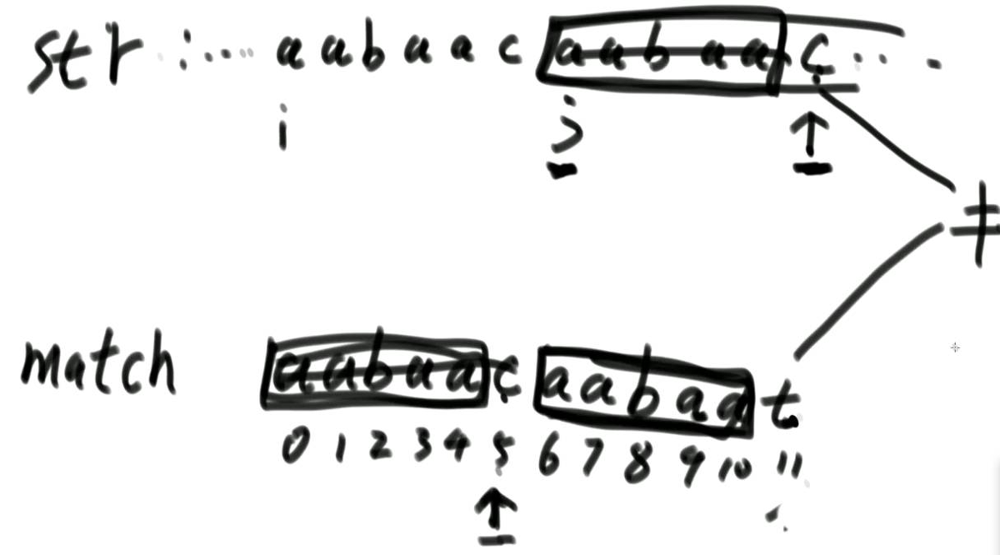
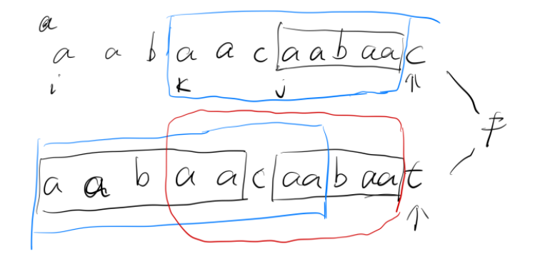
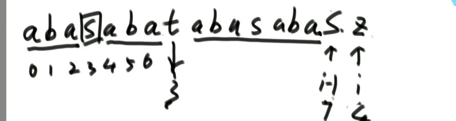

# KMP

> 给定一个字符串str，和另一个字符串match，返回str中首次出现match字符串的下标位置

解题思路：在暴力方法中，我们是遍历整个str，然后以每个字符为开头去依次和match匹配，但是这样太耗时，因此就有了KMP算法。首先得明白几个概念

指标：比如有一个字符串abcabce，那么e的指标就是3，也就是**e所在字符的前面的字符串**，前缀和后缀相等的最大数。

next数组：存储match字符串的每个字符的指标信息，match0位置的信息为-1，match的1位置的信息是0

整体过程大概如下：首先肯定是依次进行字符比较，假如str来到x位置、match来到y位置的时候，发现两者所对应的字符不相等，因此就查看match中y位置的指标信息为s，然后将match的y指针回退到match[ next[y] ]中，继续和str[x]进行比较

原理如下图所示，看到c和t不相等， 那么就看next[11] = 5，首先c字符前面五个字符一定和t前面5个字符相等（因为这是一步步比对过来的），然后因为next[11]为5，因此match前五个字符一定和c字符前五个字符相等，于是就可以让match从5号字符继续进行比较



那么为什么能确保上图的i到j位置之间不会出现能匹配match成功的开头点呢？




如上图所示，如果以k位置开头往后的字符串能匹配到整个match的话，那么上面那个蓝色部分一定会和下面那个蓝色部分完全相同，然而经过第一次从i位置开始往后直到最后一个字符的比对，上面蓝色部分一定会和下面红色部分相同，也就是说matcha中t字符所在位置的指标数就不对了，会发生冲突，因此如果真能匹配出match，那么结果绝不会出现在i和j的中间。

```java
public static int getIndexOf(String s, String m) {
    if (s == null || m == null || m.length() < 1 || s.length() < m.length()) {
        return -1;
    }
    char[] str = s.toCharArray();
    char[] match = m.toCharArray();
    int x = 0; //  str中当前比对到的位置
    int y = 0; // match中当前比对到的位置
    int[] next = getNextArray(match);
    
    while (x < str.length && y < match.length) {
        if (str[x] == match[y]) {
            x++;
            y++;
        } else if (next[y] == -1) {
            x++;
        } else {
            y = next[y];
        }
    }
    // x越界， y越界	返回结果
    // x不越界 y越界	返回结果
    // x越界 y不越界	返回-1
    return y == match.length ? x - y : -1;
}

public static int[] getNextArray(char[] match) {
    if (match.length == 1) {
        return new int[] { -1 };
    }
    int[] next = new int[match.length];
    next[0] = -1;
    next[1] = 0;
    int i = 2;
    // cn位置的字符，是当前和i - 1位置比较的字符
    int cn = 0;
    while (i < next.length) {
        if (match[i - 1] == match[cn]) { // 跳出来了
            next[i++] = ++cn;
        } else if (cn > 0) { // 发现不相等而且cn还可以往前跳
            cn = next[cn];
        } else { // cn跳到了0位置或者-1位置
            next[i++] = 0
        }
    }
    return next;
}
```

对于next数组的求解看下面的例子



首先对于s字符所在的位置也就是i-1来说，next[i - 1] = 7。

当想要求i位置的next数组值是多少的时候，比对发现match[i - 1]和match[7]不相等，然后cn = 7，所以就cn就等于cn[7]，即为3。这时候发现match[i - 1]和match[3]相等，就让next[i] = 4；

# TreeEqual

> 给定一颗二叉树big，和另一个二叉树small，判断small是否是big的子树

暴力方法：

```java
public static boolean containsTree(Node big, Node small) {
    if (small == null) return true;
    if (big == null) return false;
    if (isSameValueStructure(big, small)) return true;
    return containsTree(big.left, small) || containsTree(big.right, small);
}

// head1是否和head2完全一样
public static boolean isSameValueStructure(Node head1, Node head2) {
    if (head1 == null && head2 == null) {
        return true;
    }
    if (head1 == null && head2 != null) {
        return false;
    }
    if (head1 != null && head2 == null) {
        return false;
    }
    if (head1.value != head2.value) {
        return false;
    }
    return isSameValueStructure(head1.left, head2.left)
        && isSameValueStructrue(head1.right, head2.right);
}
```

第二种方法就是利用KMP算法来做。首先得明白的是，如果将一棵树给前序序列化，那么它一定只能代表唯一的一棵树，因此就可以将两棵树全部给前序序列化，然后看big里面包不包含small

```java
public static boolean containsTree(Node big, Node small) {
    if (small == null) return true;
    if (big == null) return false;
    ArrayList<String> b = preSerial(big);
    ArrayList<String> s = preSerial(small);
    String[] str = new String[b.size()];
    for (int i = 0; i < str.length; i++) {
        str[i] = b.get(i);
    }

    String[] match = new String[s.size()];
    for (int i = 0; i < match.length; i++) {
        match[i] = s.get(i);
    }
    return getIndexOf(str, match) != -1;
}

public static ArrayList<String> preSerial(Node head) {
    ArrayList<String> ans = new ArrayList<>();
    pres(head, ans);
    return ans;
}

public static void pres(Node head, ArrayList<String> ans) {
    if (head == null) {
        ans.add(null);
    } else {
        ans.add(String.valueOf(head.value));
        pres(head.left, ans);
        pres(head.right, ans);
    }
}

// 注意这里的树的序列化，如果node的value = 20，就会序列化为字符串20，
// 然后就需要将这个20当成一个整体进行判断
public static int getIndexOf(String[] str, String[] match) {
    if (str == null || match == null || str.length < 1 || str.length < match.length) {
        return -1;
    }
    int x = 0;
    int y = 0;
    int[] next = getNextArray(match);
    while (x < str.length && y < match.length) {
        if (isEqual(str[x], match[y])) {
            x++;
            y++;
        } else if (next[y] == -1) {
            x++;
        } else {
            y = next[y];
        }
    }
    return y == match.length ? x - y : -1;
}

public static int[] getNextArray(String[] match) {
    if (match.length == 1) {
        return new int[] { -1 };
    }
    int[] next = new int[match.length];
    next[0] = -1;
    next[1] = 0;
    int i = 2;
    int cn = 0;
    while (i < match.length) {
        if (isEqual(match[i - 1], match[cn])) {
            next[i++] = ++cn;
        } else if (cn > 0) {
            cn = next[cn];
        } else {
            next[i++] = 0
        }
    }
    return next;
}

public static boolean isEqual(String a, String b) {
    if (a == null && b == null) {
        return true;
    } else {
        if (a == null || b == null) {
            return false;
        } else {
            return a.equals(b);
        }
    }
}
```

# IsRotation

> 判断字符串a是不是b的旋转数

比如字符串1234，它的旋转数有1234、23241、3412、4123，解题思路就是让b写两遍，比如1234就变成12341234，然后找新的b里面有没有a就行，也是靠KMP算法