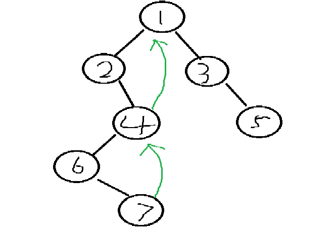

# Morris

对于Morris遍历算法来说，适用于二叉树。整体流程如下：

当前节点cur，一开始cur来到整数棵树的头节点

1. cur无左树，cur = cur.right
2. cur有左树，找到左树最右节点，mostright
   1. most right的右指针指向null的，most right.right = cur, cur =  cur.left
   2. most right的右指针指向cur，most right.right = null, cur = cur.right
3. 当cur = null 停

举例说明：




1. 一开始cur来到节点1，发现cur有左子树，且左子树的最右节点是4，且节点4的右指针指向null，于是mostRight-node4.right = node1，cur来到了node2
2. 然后cur-node2没有左树，就让cur-node4
3. cur-node4有左树，且此时mostRight-node7，它的右指针指向null，因此node7.right = cur-node4，也就是绿色那条线，并且cur指向了node6
4. 继续看cur-node6，没有左树，因此cur指向了node7
5. 此时cur-node7没有左树，因此cur = cur.right，即cur指向了node4
6. 再看cur-node4有左子树，且左子树上的mostRight = node7，这时候发现mostright.right = cur-node4，就让mostRight.right = null , cur指向node1
7. 后续的步骤省略
8. 最后的Morris顺序为：1、2、4、6、7、4、1、3、5

通过整个流程可以发现以下几点：

- 如果一个节点有左树就会经过两次
- 如果一个节点有左树就会先遍历左树，然后回来之后再遍历右树
- 如果一个节点是第一次来到它自己，那么它左树上的最右节点一定是指向null，否则指向它自己

代码如下：

```java
public static void morris(Node head) {
    if (head == null) {
        return;
    }
    Node cur = head;
    Node mostRight = null;
    while (cur != null) {
        // cur有没有左树
        mostRight = cur.left;
        // 在有左树的情况下
        if (mostRight != null) {
            // 找到真实的最右节点
            while (mostRight != null && mostRight.right != cur) {
                mostRight = mostRight.right;
            }
            if (mostRight.right == null) {
                mostRight.right = cur;
                cur = cur.left;
                continue;
            } else {
                mostRight.right = null;
                cur = cur.right;
                continue;
            }
        } else {
            // 没有左树的情况下
            cur = cur.right;
        }
    }
}
```

有了Morris算法之后，就可以用更少的额外空间来完成二叉树的遍历或者判断是否是搜索二叉树了

由于Morris遍历算法会对于有左树的节点来说会经过两次，因此对于先序遍历来说，只需在第一次经过的时候打印就可以了；对于中序遍历来说，只需在第二次经过的时候打印就可以了。

```java
public static void morrisIn(Node head) {
    if (head == null) {
        return;
    }
    Node cur = head;
    Node mostRight = null;
    while (cur != null) {
        mostRight = cur.left;
        if (mostRight != null) {
            while (mostRight.right != null && mostRight.right != cur) {
                mostRight = mostRight.right;
            }
            if (mostRight.right == null) {
                mostRight.right = cur;
                cur = cur.left;
                continue;
            } else {
                mostRight.right = null;
            }
        }
        System.out.print(cur.value + " ");
        cur = cur.right;
    }
    System.out.println();
}

public static void morrisPre(Node head) {
    if (head == null) {
        return;
    }
    Node cur1 = head;
    Node cur2 = null;
    while (cur1 != null) {
        cur2 = cur1.left;
        if (cur2 != null) {
            while (cur2.right != null && cur2.right != cur1) {
                cur2 = cur2.right;
            }
            if (cur2.right == null) {
                cur2.right = cur1;
                System.out.print(cur1.value + " ");
                cur1 = cur1.left;
                continue;
            } else {
                cur2.right = null;
            }
        } else {
            System.out.print(cur1.value + " ");
        }
        cur1 = cur1.right;
    }
    System.out.println();
}
```

对于判断是否是二叉搜索树来说，其实可以利用它的性质：二叉搜索树的中序遍历一定是递增的

```java
public static boolean isBST(Node head) {
    if (head == null) {
        return true;
    }
    Node cur = head;
    Node mostRight = null;
    Integer pre = null;
    boolean ans = true;
    while (cur != null) {
        mostRight = cur.left;
        if (mostRight != null) {
            while (mostRight.right != null && mostRight.right != cur) {
                mostRight = mostRight.right;
            }
            if (mostRight.right == null) {
                mostRight.right = cur;
                cur = cur.left;
                continue;
            } else {
                mostRight.right = null;
            }
        }
        if (pre != null && pre >= cur.value) {
            ans = false;
        }
        pre = cur.value;
        cur = cur.right;
    }
    return ans;
}
```

# MinHeight

> 返回二叉树的最小高度

```java
// 根据morris遍历改写
public static int minHeight2(Node head) {
    if (head == null) {
        return 0;
    }
    Node cur = head;
    Node mostRight = null;
    int curLevel = 0;
    int minHeight = Integer.MAX_VALUE;
    while (cur != null) {
        mostRight = cur.left;
        if (mostRight != null) {
            int rightBoardSize = 1;
            while (mostRight.right != null && mostRight.right != cur) {
                rightBoardSize++;
                mostRight = mostRight.right;
            }
            if (mostRight.right == null) { // 第一次到达
                curLevel++;
                mostRight.right = cur;
                cur = cur.left;
                continue;
            } else { // 第二次到达
                if (mostRight.left == null) {
                    minHeight = Math.min(minHeight, curLevel);
                }
                curLevel -= rightBoardSize;
                mostRight.right = null;
            }
        } else { // 只有一次到达
            curLevel++;
        }
        cur = cur.right;
    }
    int finalRight = 1;
    cur = head;
    while (cur.right != null) {
        finalRight++;
        cur = cur.right;
    }
    if (cur.left == null && cur.right == null) {
        minHeight = Math.min(minHeight, finalRight);
    }
    return minHeight;
}
```

