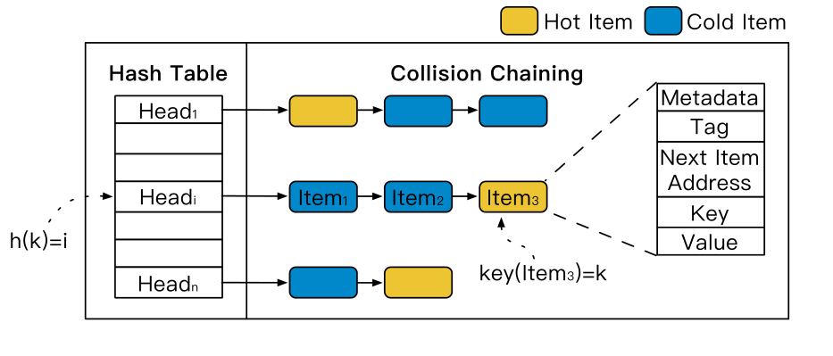
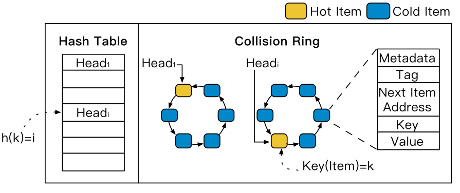
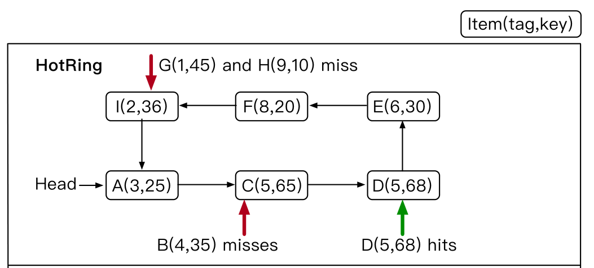
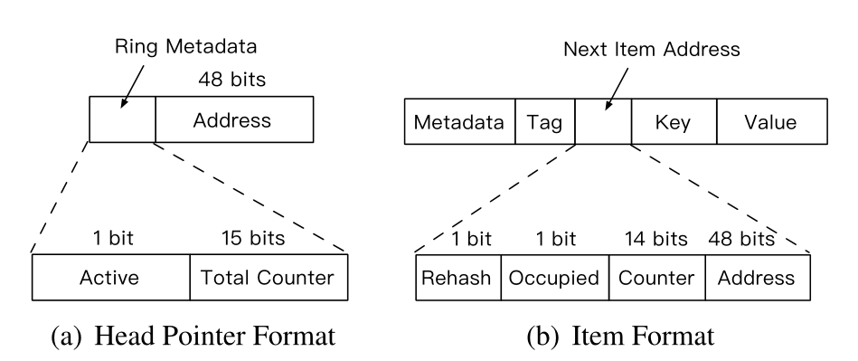
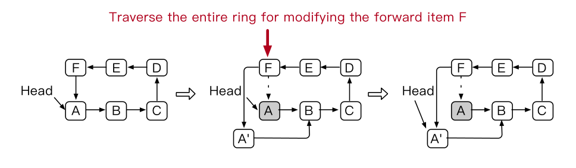
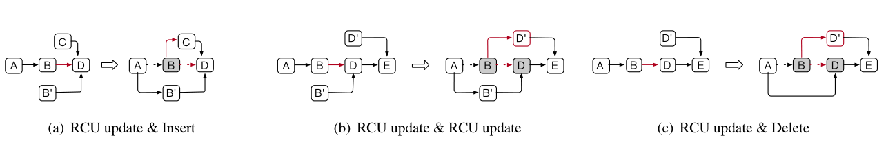
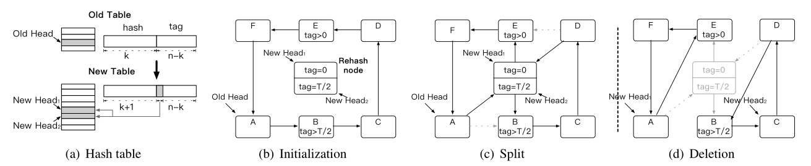

# HotRing：A Hotspot-Aware In-Memory Key-Value Store

> 一种热点可感知的内存 KV 存储结构

## 1. 背景

在真实场景中经常会造成热点数据的出现，比如双十一的时候，会给缓存系统带来巨大的访问量；比如微博的热点事件，大多数的访问都集中在少量的数据上，也就是存在访问倾斜。为了解决这些问题，针对集群系统，一般都会采用一致性哈希、数据迁移、前端数据缓存等等。而对于单体应用而言，计算机体系结构能够利用分层存储布局，比如我们最常见的 CPU 三级缓存，将频繁访问的数据给缓存在低延时的存储介质中。

基于内存的 KV 存储结构（KVS， key-value stores）通常被广泛应用于缓存热数据，以解决基于磁盘的存储或分布式系统中的热点问题。许多的索引结构其实都可以实现 KVS，比如 skiplist、balanced/trie trees、hash 等等。我们最常用的索引结构是哈希，因为它的快速查找功能具备大家喜爱，尤其是上层应用在不需要范围查找的时候。但是对于传统的 KVS 来说，它们所使用的底层结构对数据的冷热没有进行区分，都是统一进行管理，因而对于内存中的热点问题没有得到一个很好的解决。

如Figure 1 所示，这种结构作为底层的 KVS 将无法感知热点数据。如果我们想找到一个热点数据，例如 Item3，就必须遍历整个 Collision Chaining，这样带来的内存访问次数无疑是很高的，所造成的性能影响是很大的。虽然会存在某些机制来减少内存访问次数，比如采用 CPU 缓存，但是 CPU 的大小是有限制的。或者采用 rehash 扩大哈希表来减少每个碰撞链的长度，但是这样会显著增加内存占用（HashMap 的 rehash 会扩容成原来的两倍）。

> PS：下列两篇论文都介绍了各自设计的能更好利用 CPU 缓存的缓存友好型索引结构：
>
> 1. FASTER：A Concurrent Key-Value Store with In-Place Updates
> 2. MICA：A Holistic Approach to Fast In-Memory Key-Value Storage

> Figure 1：无热点感知的哈希结构

出于上述的考虑，在本次的 paper 中，作者探索了 KVS 中内存索引结构的热点感知设计，讨论了热点转移和并发访问问题，最终设计了一种新的热点感知 KVS，即 HotRing。

- 热点转移：在实际应用中，热点肯定是动态变化的，比如微博的热搜是每时每刻都会变化。因此就需要有一种轻量级的方法来跟踪热度的变化。
  - 底层实现基于有序哈希索引结构，通过将头指针移动到更靠近热点项的位置来实现快速访问热点项的功能。同时，它还采用了一种轻量级策略来检测运行时的热点转移。
- 并发访问：既然是热点数据，肯定存在大量并发请求，为了保证性能，需要支持读/写操作的高并发性
  - HotRing在其设计中全面采用了无锁结构来解决并发访问问题 ，用于常见操作（即读取、更新）和特定于 HotRing 的操作（即热点移动检测、头指针移动和 ordered-ring rehash ）。

## 2. 设计原理

### 2.1 基于有序环的哈希索引设计

前面提到，一般的 KVS 都采用链表来解决哈希冲突，为了让热点项更快地被访问到，就需要将热点项给放到链表的头部，可是在并发情况下，想要保证该操作的原子性比较麻烦，因此我们就可以从另一个角度思考：不移动热点项到头部，而是直接移动 Head 的指针，使其指向热点项，并且该操作可以使用 CAS 来保证原子性。

不过这就又引出一个新问题，由于链表是单向的，如果 Head 的指针不再指向头部了，就会导致一部分的节点无法被访问到。为了确保无论头部指针怎么移动，bucket 中的所有 item 始终能访问，就需要将链表设计成环状。

同时，环形链表没有终结点，为了更好的进行值的查找，需要将环形链表设计成有序的，这样就可以根据前后项的关系判断是否终结本次查询。注意，将头指针指向的第一个 item 作为停止信号是不合适的，因为它可以被并发请求修改。

此外，比较两个较长的 Key 所带来的开销可能比较昂贵，我们将首先使用 Tag 字段进行比较。也就是说，我们的环的有序性根据其 Tag 和 Key 这一字段进行的, $order_k = (tag_k, key_k)$

至此，我们的 HashRing 就被设计成了一个基于有序环的哈希索引了。

> Figure 2：基于有序环的哈希索引

现在来详细的说一说第三点：环的有序性。如果我们想要查找 item k，并且我们此时正在访问的是 item i，有如下所示的查找规则：

- 找到 item k：

$$
order_i = order_k
$$

- 未找到 item k:

$$
\begin{cases} \quad\space order_{i-1} < order_k < order_i \quad①\\
or \space order_k < order_i < order_{i - 1} \quad ②\\
or \space order_i < order_{i -1} < order_k \quad ③
	
\end{cases}
$$

> Figure 3：Find operation in HotRing

- 当查找指针指向 C 的时候，发现 C 的值要比 B 大，同时 C 的前项 A 要比 B 小，因此 B miss，对应情况①。
- 当查找指针指向 I 的时候，发现 I 的值要比 G 大，同时 I 的前项 F 也大于 G，并且 I 小于 F，因此 G miss，对应情况②。
- H 的 miss 原因对应于情况③。

### 2.2 热点转移问题

采用有序环的哈希索引，在查找过程中能很轻易的判断当前查找项是否命中，剩下的问题就是当热点移动的时候如何识别热点并调整头部指针。由于哈希值的分布非常均匀，热点项在所有桶中均匀分布。在这里，我们专注于独立地识别每个存储桶中的热点。实际上，每个桶中的冲突项的数量相对较少（例如，5 到 10 个项目），因此每个冲突环中通常有一个热点（热点比率低于10%-20%）。我们可以通过将头部指针指向唯一的热点来改进热点访问，这避免了重新组织数据并减少了内存开销。

为了获得良好的性能，必须考虑两个指标，即识别精度和反应延迟。

- 热点识别的准确性通过所识别的热点的比例来衡量。
- 反应延迟是新热点发生的时间和我们成功检测到它的时间之间的时间跨度。

考虑到这两个指标，我们首先引入一种随机移动策略，以识别反应延迟极低的热点。然后，我们提出了一种统计采样策略，该策略在相对较高的反应延迟下提供了更高的识别精度。

首先，我们定义了本节中使用的几个术语。头指针指向的第一个项目称为热项目，其余项目为冷项目。它们对它们的访问分别定义为热访问和冷访问。

#### 随机移动策略

该策略适合于高度倾斜的数据访问，能带来较少的反应延迟，但是相对较低的精度。其基本思想是，头指针从即时决策中周期性地移动到潜在热点，而不记录任何历史元数据。特别是，为每个线程分配了一个线程本地参数，以记录它执行的请求数。在每个R请求之后，线程确定是否执行头指针移动操作。

- 如果第 R 次访问是热访问，则头指针的位置不受影响。
- 否则，指针将移动到该冷访问访问的项目，该项目将成为新的热项目。

参数 R 影响反应延迟和识别精度。如果使用小的 R，则实现稳定性能的反应延迟将很低。然而，这也可能导致频繁且无效的头部指针移动。在我们的场景中，数据访问是高度倾斜的，因此头部指针的移动往往很少。默认情况下，参数 R 根据经验设置为 5，这已被证明可提供低反应延迟和可忽略的性能影响。

注：也就是说在随机移动策略下，由于大部分的请求访问的都是热点数据，因此在大量的请求之后，该环的头部指针会偏向于指向热项目。不过如果一个环中存在不止一个热项目，那么就会导致头部指针的频繁移动，造成性能的丢失，因此该策略无法处理环中多个热点项的情况。

#### 统计采样策略

为了实现更高的性能，我们设计了一种统计采样策略，该策略旨在提供更准确的热点识别，并具有略高的反应延迟。在详细解释该策略之前，我们先来介绍一下 HotRing 中的一些结构的内部实现：

> Figure 4：HotRing Index Format.

- Index Format

如 Figure 4 所示，对于我们的头部指针而言，由于物理地址占 48 位，因此可以使用 48位来表示头部指针指向的地址，至于剩下的 16位（计算机可以对 64 位进行原子的 CAS），就可以用来记录一些元数据信息。

其中 Active：1 bit，用于控制热点识别的统计采样的标志。Total Counter：15 bits，表示访问对应桶中的环中的数据项的总访问次数。

同时，对于环中的一个数据项的结构而言，除了一些元数据、Tag、Key 和 Value，最重要要的是指向下一个数据项的指针：Next Item Address，同样的，它使用 48 位来表示地址，剩余的 16 位表示一些额外信息。Rehash：控制 Rehash 过程的标志；Occupied：用于确保并发正确性；Counter：记录当前数据项的访问次数。

- Statistical Sample

在介绍了相关结构之后，接下来的问题就是如何以低开销来动态识别热点。为了在保持精度的同时最小化开销，我们每个线程都为已处理的请求维护一个线程本地计数器，来记录执行了多少次请求。每完成 R 个请求之后线程就需要决定是否移动头部指针。

1. 如果第 R 个请求是热访问，则意味着当前热点识别仍然准确，不需要触发采样。
2. 否则需要移动头指针，开启统计采用，采其中 Sample 的次数等于桶中环的数据项个数。
   1. 使用 CAS 来开启 Active 标志
   2. 对环后续的访问请求将被记录在 head.totalCounter 和 next.counter 上，同样使用 CAS。

根据收集的统计数据，我们能够确定新的热点项目，并根据项目的访问频率移动头部指针。采样过程完成后，最后一个访问线程负责频率计算和热点调整。首先，线程使用 CAS 原语自动重置 Active 位，这确保只有一个线程将执行后续任务。

然后，该线程计算环中每个项目的访问频率。项目 k 的访问频率是 n~k~/N，其中 N 是环的总计数器，n~k~ 是第 k 个项目的计数器。接下来，我们计算每个项目的头指针的收入。当项目 t（0<t<k)被头指针指向时，相应的收入 W~t~通过以下公式计算：
$$
W_t=\sum_{i=1}^{k} \frac{n_i}{N} * [(i - t) \space mod \space k]
$$
环中总共有 k 个节点，其中 ni/N 表示访问第 i 个节点的概率，i - t 表示当头指针指向节点 t 的时候，移动到 i 需要的内存访问次数。

W~t~ 测量当项目 t 被选择为由头部指针指向时，环的平均内存访问次数。因此，选择具有最小值（Wt）的项目作为热项目可确保更快地访问热点。如果计算的位置与前一个头部不同，则应使用 CAS 原语移动头部指针。

注意，该策略不仅处理单个热点，还适用于多个热点。它有助于找出避免热点之间频繁移动的最佳位置（例如，可能不一定是最热的项目）。热点调整完成后，该线程将重置所有计数器，为将来的下一轮采样做准备。

- Write-Intensive Hotspot with RCU

对于更新操作，HotRing 为那些小于 8 字节的值提供了一种就地更新方法（即，现代机器支持最多8字节的原子操作）。在这种情况下，read 和 update 数据项在热度方面是相同的。然而，对于较大的值，情况完全不同，如图5所示。为了获得高性能，必须应用 read-copy-update（RCU）协议。在这种情况下，需要修改前一项的指针，以在更新期间指向新项。如果修改了头中的写入密集型热点，则必须遍历整个冲突环才能到达其前一项。也就是说，写密集型热项也会使其前一项变热。根据这一见解，我们稍微修改了统计抽样策略。对于RCU下，更新的是其前一项的计数器。这有助于指出写入密集型热点的先例，使整个RCU更新操作快速（This helps to point the head to the precedent of a write-intensive hotspot, making the entire RCU update operation fast.）

由于在 RCU 下，更新的是前一项的计数器，头指针就会趋向于指向写入项的前一项，在写密集型的热点时，可以直接定位到热点的前一项，更新时就不需要遍历链表。

> Figure 5：Updating hot item A with RCU makes item F hot
>
> 热点是 A，RCU 下，修改 A 需要前一项 F，这就需要遍历整个环。所以 RCU 下，更新的是 F 的计数器，从而让头指针指向 F（写入热点依然是 A），之后写入 A 时，不需要遍历环了。

- Hotspot Inheritance

在头节点上执行 RCU 更新或删除时，我们需要将头指针指向其余的数据项。然而，如果头指针被随机移动，它可能以高概率指向冷项目，这将导致热点识别策略被频繁触发。此外，由于识别策略的频繁触发，系统的性能将严重下降。

首先，如果碰撞环只有一个项目（即下一个项目地址与头指针的位置相同），则 CAS 会修改头指针以完成更新或删除。如果有多个项，HotRing 使用现有的热点信息（即，头部指针位置）来继承热点。我们为 RCU 更新和删除操作设计了不同的头部指针移动策略，以确保热点调整的有效性：对于头节点的 RCU 更新，由于访问的时间局部性，最近更新的项目很有可能立即被访问。因此，头指针指向新版本的头。对于头节点的删除，只需将头指针移动到下一项，这是一个简单有效的解决方案。

### 2.3 并发操作设计

头部指针的移动使无锁设计更加复杂。这主要体现在以下几个方面：一方面，头部指针的移动可能与其他线程并行。因此，我们需要考虑头部指针移动和其他修改操作的并发性，防止指针指向无效项。

另一方面，当我们删除或更新项目时，我们需要检查头部指针是否指向该项目。如果是这样，我们需要正确而巧妙地移动头部指针。在本节中，我们主要介绍并发访问的控制方法，以解决 HotRing 中的并发问题。

为了实现高访问并发性并确保高吞吐量，我们实现了一套完整的无锁设计，这在之前的工作中得到了严格的介绍。原子 CAS 操作用于确保两个线程不会同时修改同一个Next Item Address。如果多个线程试图更新同一个Next Item Address，则只有一个线程成功，其他线程失败。失败的线程必须重新执行其操作。

> Figure 6：Different concurrency issues that involve RCU operations.

- Read

无需任何同步，它本身就是安全的

- Insertion

创建一个新项目并插入到环中，并修改前面的数据的 Next Item Address。两个并发操作可能会竞争相同的 Next Item Address。而 CAS 操作确保只有一个成功，其余的只能失败重试。

- Update

我们针对不同的价值大小设计了两种更新策略。就地更新操作（针对8字节值）不会影响其他操作，这是通过CAS保证的。

然而，RCU 操作（对于较长的值）需要创建一个新项，这对其他操作的并发性提出了挑战。以 RCU 更新和插入为例，如上图 a 所示：一个线程尝试通过修改 item B 的 next 指针（Next item Address）来插入 数据 C，另一个线程尝试同时使用 B‘ 更新 B。两个操作都会成功，因为它们使用 CAS 修改了不同的指针。然而由于环看不到 B，因此即使 C 插入成功，也无法被访问到，从而导致不正确。

图 b 中也存在这样的问题。为了解决这种问题，HotRing 使用 Occupied 来保证正确性。将分为两部进行更新操作。例如在 update & insert 的情况下：首先我们想要更新 B，它的 next 指针被原子的设置为已占用。一旦设置了 Occupied，C 的插入将失败，并且必须重试。其次，A 的下一个项目地址被原子的改变为 B’，B‘ 的 Occupied 将被重置。

- Deletion

通过将指向已删除项目的指针修改为其下一个项目来实现删除。因此，必须确保在操作过程中未更改已删除项目的下一个项目地址。类似地，我们使用 Occupied 来确保并发操作的正确性。

对于如图6（c）所示的 RCU 更新和删除的情况，当项目 B 当前被删除时，通过更新转发项目 B 的指针来处理项目 D 的更新。无法正确遍历更新的项目 D’，导致数据丢失。如果项目 B 的占用位设置为删除，则项目 D 的更新将无法修改项目 B 的下一个项目地址，必须重试。一旦项目 B 的删除完成，就可以成功执行更新操作。

- Head Pointer Movement

头部指针的移动是 HotRing 中的一个特殊动作。为了确保头部指针移动与其他操作（尤其是更新和删除）的正确性，我们需要额外的管理。有两个主要问题需要解决：（1）如何处理正常操作的并发性和标识策略导致的头指针移动？（2） 如何处理头部项目更新或删除导致的头部指针移动？

对于由识别策略引起的头部指针移动，我们还使用占用位来确保正确性。当将头指针移动到新项目时，我们设置其占用位，以确保在移动过程中不会更新或删除该项目。对于头项更新，HotRing将头指针移动到此项的新版本。在移动头指针之前，我们需要确保新版本项不会被其他线程更改（即，更新或删除）。因此，在更新项目时，HotRing会先设置新版本项目的占用位，直到移动完成。对于头部项目删除，HotRing不仅需要占用准备删除的项目，还需要占用其下一个项目。因为如果在删除操作期间下一个项目未被占用，则下一个节点可能已被更改，这使得头部指针指向无效项目。

### 2.4 无锁化的 rehash

随着新数据从插入中到达，环中冲突项的数量继续增加，导致每次访问遍历更多项。在这种情况下，KVS 的性能将严重下降。HotRing 中提出了一种无锁重新散列策略，该策略允许随着数据量的增加而灵活地重新散列。传统的重新散列策略由哈希表的负载因子（即平均链长度）触发。

> Figure 7：The lock-free rehash strategy(The dotted line between (c) and (d) represents a transition period before deletion)

然而，这没有考虑热点的影响，因此不适合 HotRing。为了使索引适应热点项目的增长，HotRing使用访问开销（即检索项目的平均内存访问次数）来触发重新散列。我们的无锁重新散列策略包括三个步骤：

- Initialization

首先，HotRing 创建一个后端 rehash 线程。线程通过共享标记的最高位来初始化新哈希表，该哈希表的大小是旧哈希表的两倍。如图7（a）所示，旧表的存储桶中有一个旧的头指针，相应地，新表中有两个新的头指针。旧表采用哈希值的 k 位作为哈希地址，新表取 k + 1 位。HotRing 根据标记范围划分数据。

假设哈希值有 n 位，标记范围为 [0，T) (T=2^（n-k）^)，两个新的头指针分别管理 [0，T/2) 和 [T/2，T) 中的项。同时，rehash 线程创建由两个子 rehash 项组成的 rehash 节点，它们分别对应于两个新的头指针。除了没有存储有效的KV对之外，每个重新散列项具有与数据项相同的格式。HotRing 通过每个项中的 rehash 位标识 rehash 项。在初始化阶段，两个子 rehash 项的标记设置不同。如图9（b）所示，相应的 rehash 项分别将标记设置为 0 和 T/2。

- Split

在拆分阶段，rehash 线程通过将两个 rehash 项插入到环中来拆分环。如图 7（c）所示，reash 项分别插入到项 B 和项 E 之前，成为标记范围的边界以划分环。两个插入操作完成后，“新建表”将激活。之后，后续访问（来自新表）需要通过比较标记来选择相应的头指针，而之前的访问（来自旧表）则通过标识 rehash 节点来继续。可以正确访问所有数据，而不影响并发读写。到目前为止，对项目的访问在逻辑上分为两条路径。当我们查找目标项目时，最多需要扫描环的一半。例如，访问项 F 的遍历路径是 Head~1~ -> E -> F

- Deletion

在此阶段，rehash 线程删除 rehash 节点（如图 7（d）所示）。在此之前，rehash 线程必须保持一个过渡期，以确保从旧表启动的所有访问都已完成，例如读取副本更新同步原语的宽限期。

当所有访问结束时，重新散列线程可以安全地删除旧表，然后重新散列节点。请注意，过渡期只阻塞 rehash 线程，而不阻塞访问线程。

## 3. 总结

本篇论文展示了一种全新的优化角度：关注内存中的热点数据问题。为了能够内存感知，该论文设计了一种全新的数据结构 -- HotRing。它以我们常见的 HashMap 为模板，进行了一系列改进：将链表设计成环，并且通过移动头指针来保证移动的并发安全性。同时环还是有序的，方便在环中快速查找到对应数据是否存在。同时考虑到热点转移问题，给出了两种热点策略，随机移动策略和统计采样策略。其中随机策略在单桶中多热点情况下表现不佳，而统计采用策略又需要一定量的计算而造成延迟，因此两种策略的选择得视情况而定。

而在并发性这一方面，HotRing 在设计的时候采用了无锁结构来解决并发访问问题，使用了 RCU 机制和 Occupied 占位符进行限制，并将该无锁结构使用在常见的操作上，即读取、更新、热点移动检测、头指针移动和无锁化的 rehash。

参考资料：

[硬核课堂：HotRing 论文解读](https://hardcore.feishu.cn/mindnotes/bmncnt6dBr8eAb9swqLz8L7KJih)

HotRing 原论文：https://www.usenix.org/conference/fast20/presentation/chen-jiqiang

[论文阅读-HotRing: A Hotspot-Aware In-Memory Key-Value Store - keys961 | keys961 Blog](https://keys961.github.io/2020/02/28/论文阅读-HotRing-A-Hotspot-Aware-In-Memory-Key-Value-Store/)

[HotRing: A Hotspot-Aware In-Memory Key-Value Store - 简书 (jianshu.com)](https://www.jianshu.com/p/0777755969ab)
