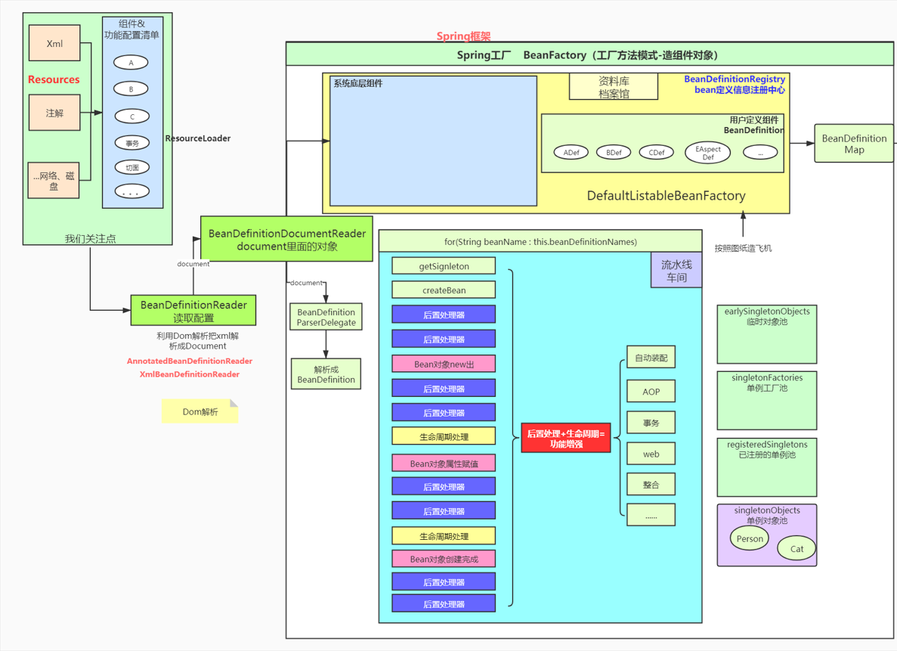
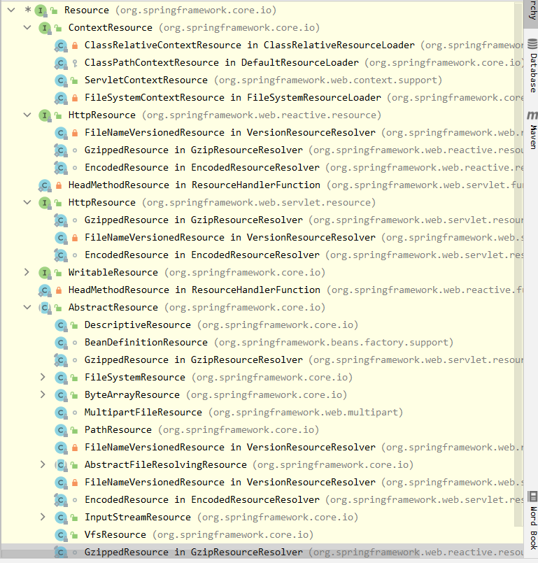
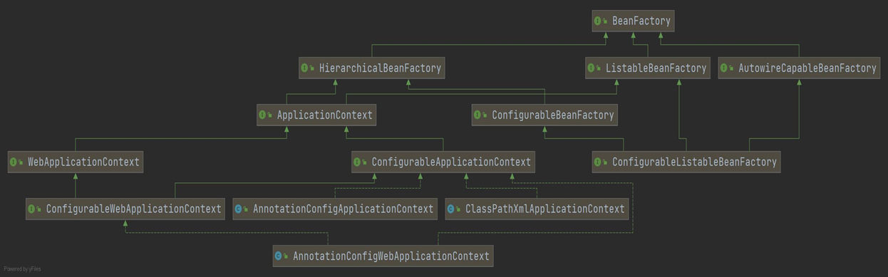
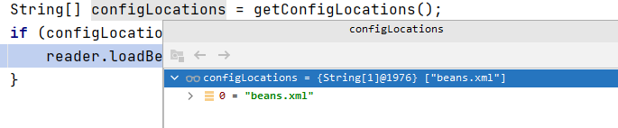
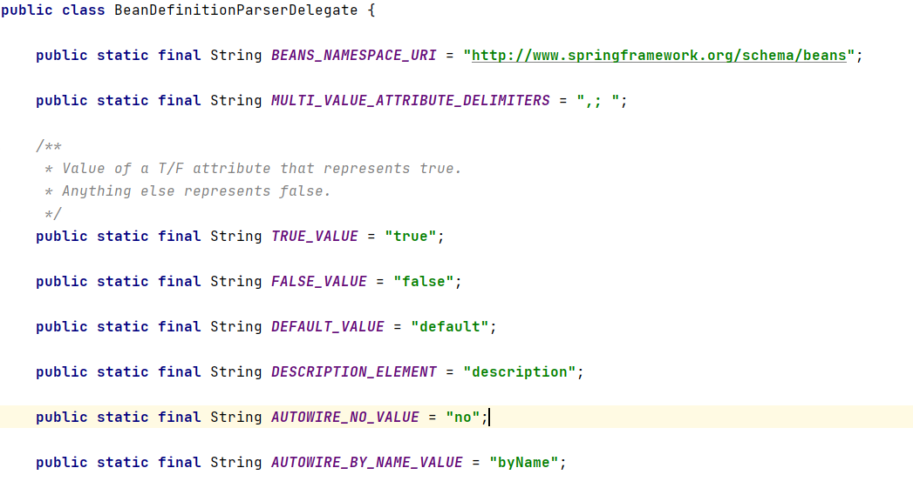
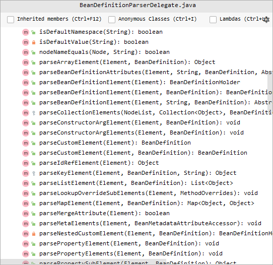
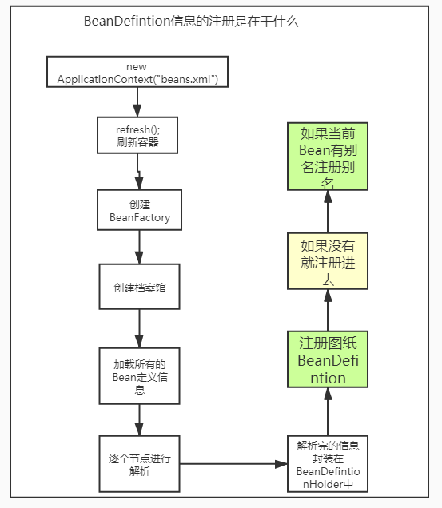
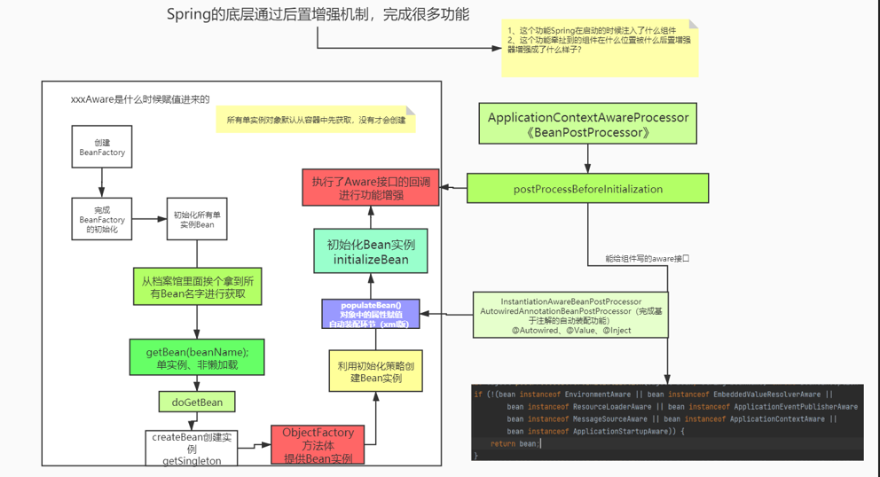

# 前置

导入spring源码需要gradle，但是问题就是gradle导入源码太慢了，因此也可以退而求其次，选择用maven来搭建，只不过用maven的话，无法修改源码，无法在源码上写注释，但是其实问题不大。

```xml
<dependencies>
    <dependency>
        <groupId>org.springframework</groupId>
        <artifactId>spring-core</artifactId>
        <version>5.3.5</version>
    </dependency>
    <dependency>
        <groupId>org.springframework</groupId>
        <artifactId>spring-context</artifactId>
        <version>5.3.5</version>
    </dependency>
    <dependency>
        <groupId>org.springframework</groupId>
        <artifactId>spring-test</artifactId>
        <version>5.3.5</version>
        <scope>test</scope>
    </dependency>
    <dependency>
        <groupId>org.springframework</groupId>
        <artifactId>spring-web</artifactId>
        <version>5.3.5</version>
    </dependency>
    <dependency>
        <groupId>org.springframework</groupId>
        <artifactId>spring-webflux</artifactId>
        <version>5.3.5</version>
    </dependency>
    <dependency>
        <groupId>org.springframework</groupId>
        <artifactId>spring-beans</artifactId>
        <version>5.3.5</version>
    </dependency>
    <dependency>
        <groupId>org.springframework</groupId>
        <artifactId>spring-tx</artifactId>
        <version>5.3.5</version>
    </dependency>
    <dependency>
        <groupId>org.springframework</groupId>
        <artifactId>spring-aop</artifactId>
        <version>5.3.5</version>
    </dependency>
    <dependency>
        <groupId>org.springframework</groupId>
        <artifactId>spring-expression</artifactId>
        <version>5.3.5</version>
    </dependency>
    <dependency>
        <groupId>org.springframework</groupId>
        <artifactId>spring-jms</artifactId>
        <version>5.3.5</version>
    </dependency>
    <dependency>
        <groupId>commons-logging</groupId>
        <artifactId>commons-logging</artifactId>
        <version>1.2</version>
    </dependency>
    <dependency>
        <groupId>org.springframework</groupId>
        <artifactId>spring-websocket</artifactId>
        <version>5.3.5</version>
    </dependency>
    <dependency>
        <groupId>org.springframework</groupId>
        <artifactId>spring-webmvc</artifactId>
        <version>5.3.5</version>
    </dependency> 
    <dependency>
        <groupId>org.springframework</groupId>
        <artifactId>spring-r2dbc</artifactId>
        <version>5.3.5</version>
    </dependency> 
    <dependency>
        <groupId>org.springframework</groupId>
        <artifactId>spring-oxm</artifactId>
        <version>5.3.5</version>
    </dependency>
    <dependency>
        <groupId>org.springframework</groupId>
        <artifactId>spring-orm</artifactId>
        <version>5.3.5</version>
    </dependency>
    <dependency>
        <groupId>org.springframework</groupId>
        <artifactId>spring-messaging</artifactId>
        <version>5.3.5</version>
    </dependency>
    <dependency>
        <groupId>org.springframework</groupId>
        <artifactId>spring-jdbc</artifactId>
        <version>5.3.5</version>
    </dependency>
    <dependency>
        <groupId>org.springframework</groupId>
        <artifactId>spring-jcl</artifactId>
        <version>5.3.5</version>
    </dependency>
    <dependency>
        <groupId>org.springframework</groupId>
        <artifactId>spring-instrument</artifactId>
        <version>5.3.5</version>
    </dependency>
    <dependency>
        <groupId>org.springframework</groupId>
        <artifactId>spring-context-support</artifactId>
        <version>5.3.5</version>
    </dependency>
    <dependency>
        <groupId>org.springframework</groupId>
        <artifactId>spring-context-indexer</artifactId>
        <version>5.3.5</version>
        <scope>optional</scope>
    </dependency>
    <dependency>
        <groupId>org.springframework</groupId>
        <artifactId>spring-aspects</artifactId>
        <version>5.3.5</version>
    </dependency>
    <dependency>
        <groupId>org.springframework</groupId>
        <artifactId>spring-framework-bom</artifactId>
        <version>5.3.5</version>
        <type>pom</type>
    </dependency>
</dependencies>
```

# 第一章 核心注解

| **注解**         | **功能**                                                     |
| :--------------- | ------------------------------------------------------------ |
| @Bean            | 容器中注册组件                                               |
| @Primary         | 同类组件如果有多个，标注主组件                               |
| @DependsOn       | 组件之间声明依赖关系                                         |
| @Lazy            | 组件懒加载（最后使用的时候才创建）                           |
| @Scope           | 声明组件的作用范围(SCOPE_PROTOTYPE,SCOPE_SINGLETON)          |
| @Configuration   | 声明这是一个配置类，替换以前配置文件                         |
| @Component       | @Controller、@Service、@Repository                           |
| @Indexed         | 加速注解，所有标注了  @Indexed 的组件，直接会启动快速加载    |
| @Order           | 数字越小优先级越高，越先工作                                 |
| @ComponentScan   | 包扫描                                                       |
| @Conditional     | 条件注入                                                     |
| @Import          | 导入第三方jar包中的组件，或定制批量导入组件逻辑              |
| @ImportResource  | 导入以前的xml配置文件，让其生效                              |
| @Profile         | 基于多环境激活                                               |
| @PropertySource  | 外部properties配置文件和JavaBean进行绑定.结合ConfigurationProperties |
| @PropertySources | @PropertySource组合注解                                      |
| @Autowired       | 自动装配                                                     |
| @Qualifier       | 精确指定                                                     |
| @Value           | 取值、计算机环境变量、JVM系统。xxxx。@Value(“${xx}”)         |
| @Lookup          | 单例组件依赖非单例组件，非单例组件获取需要使用方法           |

注：**@Indexed需要引入依赖**

```xml
<dependency>
	<groupId>org.springframework</groupId>
	<artifactId>spring-context-indexer</artifactId>
	<optional>true</optional>
</dependency>
```

## 1.1 使用xml文件创建bean

```java
<?xml version="1.0" encoding="UTF-8"?>
<beans xmlns="http://www.springframework.org/schema/beans"
       xmlns:xsi="http://www.w3.org/2001/XMLSchema-instance"
       xsi:schemaLocation="http://www.springframework.org/schema/beans http://www.springframework.org/schema/beans/spring-beans.xsd">

    <bean class="top.noaharno.bean.Person" id="person">
        <property name="name" value="张三"/>
    </bean>
</beans>
```

```java
public static void main(String[] args) {
    ClassPathXmlApplicationContext context = new ClassPathXmlApplicationContext("beans.xml");
    Person bean = context.getBean(Person.class);
    System.out.println(bean);
}
```

## 1.2 使用注解的方式创建bean

```java
@Configuration
public class MainConfig {

    // 通过注解的方式导入bean
    @Bean
    public Person person() {
        Person person = new Person();
        person.setName("李四");
        return person;
    }
}
```

```java
public static void main(String[] args) {
    ApplicationContext context = new AnnotationConfigApplicationContext(MainConfig.class);
    Person bean = context.getBean(Person.class);
    System.out.println(bean);
}
```

## 1.3 @Import注解

除了使用@Bean来导入bean，还可以在MainConfig类上使用@Import(Person.class)来导入bean，但是这种方式是利用无参构造器来创建bean到容器中的。

@Import的部分源码如下：

```java
/**
 * {@link Configuration @Configuration}, {@link ImportSelector},
 * {@link ImportBeanDefinitionRegistrar}, or regular component classes to import.
 */
Class<?>[] value();
```

可以看到，它一共有四种方式导入，我们先关注ImportDefinitionRegistrar方式导入bean定义信息

```java
// BeanDefinitionRegistry Bean定义信息注册中心，图纸中心，档案馆，它里面都是BeanDefinition
// 所有的bean定义信息都在这里面存着
class MyImportRegistrar implements ImportBeanDefinitionRegistrar {

    @Override
    public void registerBeanDefinitions(AnnotationMetadata importingClassMetadata,
                                        BeanDefinitionRegistry registry) {

        // BeanDefinition
        RootBeanDefinition catDefinition = new RootBeanDefinition();
        catDefinition.setBeanClass(Cat.class);
        // 可以声明定义信息，包括我需要自动装配什么
        // Spring 这个实例的类型、名字
        registry.registerBeanDefinition("tomCat", catDefinition);
    }
}
```

我们的重点是了解一下BeanDefinitionRegistry，这是spring中非常重要的一个类。

可以使用`@Import(MyInportRegistrar.class)`的方式向容器中导入tomcat这个名字的bean

## 1.4 @Lookup注解

如果我们让Person里面组合一个Cat类，然后让Cat的类型为`@Scope(scopeName = ConfigurableBeanFactory.SCOPE_PROTOTYPE)`，原型模式，这样如果通过注解方式的容器来获取Cat实例，就会得到不一样的Cat实例对象

```java
class Person {
    private String name;
    @Autowired
    private Cat cat;
}
```

但是如果我们同时创建两个Person，并且比较两个Person中的cat对象是否想的，得到的答案确是相等的。

```java
public static void main(String[] args) {
    ApplicationContext context = new AnnotationConfigApplicationContext(MainConfig.class);
    Person bean1 = context.getBean(Person.class);
    Person bean2 = context.getBean(Person.class);
    System.out.println(bean2.getCat() == bean1.getCat());
}
```

原因就是person是单实例的，在我们创建了第一个person的时候，给person赋值，就会根据原型模式创建出一个cat。导致获取到的cat就是第一次创建person对象的时候，容器初始化的cat。

要想每次创建person，都会创建一个新的cat，就需要注解@Lookup了。

```java
@Component
public class Person {
    String name;
    //    @Autowired
    private Cat cat;
    // 去容器中找。不过注意的是@Bean的这种方式注册的Person，@Lookup不生效。
    @Lookup  // 标注在get方法上面。
    public Cat getCat() {
        return cat;
    }
}
```

# 第二章 Spring整体架构

## 2.1 Spring整体流程



Spring暴露给程序员的，通过XML、注解、网络、磁盘等方式，将功能定义出来，最终生成一个组件或者功能 的配置清单。**比如我们在xml中写的bean配置都会在spring底层中对应一个BeanDefinition**，然后通过ResourceLoader（资源加载器）帮我们把这些Resources加载来，并交给BeanDefinitionReader（Bean定义信息的读取器），然后放在spring中的档案馆里面（也就是BeanDefinitionRegistry），其实就是一个BeanDefinitionMap，保存组件是咋定义的。接着就是将这些BeanDefinition创建成对象（车间流水线的工作）。创建完之后就可以从容器中拿取了。在对象创建过程中，有很多池，所有创建好的实例分类放到池中。

## 2.2 Resource 和 ResourceLoader

在spring中，resource可以有很多种，可以来自于xml、注解，也可以来自于磁盘、网络



而ResourceLoader中，使用了策略模式，资源加载器

```java
public interface Resource {
    // 资源加载策略接口
    Resource getResource(String location);
}
```

## 2.3 BeanFactory

The root interface for accessing a Spring bean container。BeanFactory是根接口，整个访问容器的入口。这个接口可以保存很多的BeanDefinition信息，每一个信息都有一个唯一的名字。



- **HierarchicalBeanFactory**：定义工厂父子关系的工厂（父子容器）
- **ListableBeanFactory**：它的实现是DefaultListableBeanFactory，保存了ioc容器中的核心信息
- **AutowireCapaableBeanFactory**：提供自动装配能力

AnnotationApplicationContext组合了档案馆，而档案馆有自动装配能力。

在ListableBeanFactory的实现类`AbstractApplicationContext`中，有一个`ResourcePatternResolver`，并且在`AbstractApplicationContext`对象创建的时候就拿到了，它是一个ResourceLoader。而AbstractApplicationContext就是**策略模式环境类**。

在`DefaultListableBeanFactory`中有一个属性，这里面所有BeanDefinition信息按照名字对应BeanDefinition关系都保存好了，这个就是**总档案馆**。

```java
/** Map of bean definition objects, keyed by bean name. */
private final Map<String, BeanDefinition> beanDefinitionMap = new ConcurrentHashMap<>(256);
```

## 2.4 BeanDefinition信息的注册流程

根据前置分析，我们的总档案馆就存放在DefaultListableBeanFactory中的beanDefinitionMap中，就可以通过查看啥时候调用了beanDefinitionMap的put方法，就知道了生成的BeanDefinition是什么时候被存放在总档案馆里面了。

因此就可以将断点打在DefaultListableBeanFactory中的registerBeanDefinition方法的首句上。

```java
public static void main(String[] args) {
    ClassPathXmlApplicationContext context = new ClassPathXmlApplicationContext("beans.xml");
    Cat cat = context.getBean("cat", Cat.class);
}
```

```xml
<bean class="top.noaharno.bean.Cat" id="cat">
    <property name="name" value="张三的猫"/>
</bean>
```

以Debugger方式运行测试类，然后分析整个执行堆栈。

首先我们通过`new ClassPathXmlApplicationContext`来创建IOC容器的时候，需要在构造器里面执行**refresh**方法刷新容器。

```java
public ClassPathXmlApplicationContext(
      String[] configLocations, boolean refresh, @Nullable ApplicationContext parent)
      throws BeansException {

   super(parent);
   setConfigLocations(configLocations);
   if (refresh) {
      refresh(); // 刷新容器，即创建整个容器的过程，这是最重要的地方
   }
}
```

在refresh方法中，我们这次就分析下面的一句话，其余的后续再分析

```java
// Tell the subclass to refresh the internal bean factory.
ConfigurableListableBeanFactory beanFactory = obtainFreshBeanFactory();
```

也就是说，我们先告诉子类去刷新它们内部的beanFactory，并且将刷新好的beanFactory进行返回，

```java
protected ConfigurableListableBeanFactory obtainFreshBeanFactory() {
   refreshBeanFactory(); // 刷新工厂
   return getBeanFactory();
}
```

```java
@Override
protected final void refreshBeanFactory() throws BeansException {
    // 如果有beanFacory了就销毁它
    if (hasBeanFactory()) {
        destroyBeans();
        closeBeanFactory();
    }
    try {
        // 在这里创建我们的BeanFactory，档案馆，也就是存放图纸的地方
        DefaultListableBeanFactory beanFactory = createBeanFactory();
        // 给工厂一个序列化id
        beanFactory.setSerializationId(getId());
        customizeBeanFactory(beanFactory);
        // 这里就是准备给创建好的beanFactory加载所有的BeanDefinitions
        loadBeanDefinitions(beanFactory);
        this.beanFactory = beanFactory;
    }
    catch (IOException ex) {
        throw new ApplicationContextException("I/O error parsing bean definition source for " + getDisplayName(), ex);
    }
}
```

在如上的loadBeanDefinitions方法实现如下：

```java
@Override
protected void loadBeanDefinitions(DefaultListableBeanFactory beanFactory) throws BeansException, IOException {
    // Create a new XmlBeanDefinitionReader for the given BeanFactory.
    XmlBeanDefinitionReader beanDefinitionReader = new XmlBeanDefinitionReader(beanFactory);

    // Configure the bean definition reader with this context's
    // resource loading environment.
    beanDefinitionReader.setEnvironment(this.getEnvironment());
    // 给读取器组合一个资源加载器
    beanDefinitionReader.setResourceLoader(this);
    beanDefinitionReader.setEntityResolver(new ResourceEntityResolver(this));

    // Allow a subclass to provide custom initialization of the reader,
    // then proceed with actually loading the bean definitions.
    initBeanDefinitionReader(beanDefinitionReader);
    // 加载所有的Bean定义信息。
    loadBeanDefinitions(beanDefinitionReader);
}
```

可以看到，我们想要加载所有的BeanDefinition信息的时候，需要创建一个**XMLBeanDefinitionReader**，一个读取器，为的就是**利用Dom解析把xml解析成Document。**

然后就继续调用**loadBeanDefinitions**方法，只不过这次是将我们准备好的beanDefinitionReader传进去了。

```java
protected void loadBeanDefinitions(XmlBeanDefinitionReader reader) throws BeansException, IOException {
    /**
	 * Return an array of Resource objects, referring to the XML bean definition
	 * files that this context should be built with.
	 * <p>The default implementation returns {@code null}. Subclasses can override
	 * this to provide pre-built Resource objects rather than location Strings.
	 * @return an array of Resource objects, or {@code null} if none
	 * @see #getConfigLocations()
	 */
    // 默认返回为null。子类可以重写该方法
    Resource[] configResources = getConfigResources();
    if (configResources != null) {
        reader.loadBeanDefinitions(configResources);
    }
    // 允许多个配置文件
    String[] configLocations = getConfigLocations();
    if (configLocations != null) {
        reader.loadBeanDefinitions(configLocations);
    }
}
```




此时通过方法**reader.loadBeanDefinitions(configLocations)**，读取器终于要开始读取配置文件中的bean了。

```java
@Override
public int loadBeanDefinitions(String... locations) throws BeanDefinitionStoreException {
   Assert.notNull(locations, "Location array must not be null");
   int count = 0;
    // 在这个方法里面，是对每一个配置文件都逐个进行加载
   for (String location : locations) {
      count += loadBeanDefinitions(location);
   }
   return count;
}
```

```java
public int loadBeanDefinitions(String location, @Nullable Set<Resource> actualResources) throws BeanDefinitionStoreException {
    // 首先判断有没有资源加载器
    ResourceLoader resourceLoader = getResourceLoader();
    if (resourceLoader == null) {
        throw new BeanDefinitionStoreException(
            "Cannot load bean definitions from location [" + location + "]: no ResourceLoader available");
    }

    if (resourceLoader instanceof ResourcePatternResolver) {
        // Resource pattern matching available.
        try {
            // 策略模式，获取资源
            Resource[] resources = ((ResourcePatternResolver) resourceLoader).getResources(location);
            // 依次遍历所有的Resources，逐个进行加载。
            int count = loadBeanDefinitions(resources);
            ............
}
```

以下方法就是解析单个Resource的方法

```java
/**
 * Load bean definitions from the specified XML file.
 * @param encodedResource the resource descriptor for the XML file,
 * allowing to specify an encoding to use for parsing the file
 * @return the number of bean definitions found
 * @throws BeanDefinitionStoreException in case of loading or parsing errors
 */
public int loadBeanDefinitions(EncodedResource encodedResource) throws BeanDefinitionStoreException {
	.........
    try (InputStream inputStream = encodedResource.getResource().getInputStream()) {
        InputSource inputSource = new InputSource(inputStream);
        if (encodedResource.getEncoding() != null) {
            inputSource.setEncoding(encodedResource.getEncoding());
        }
        // 利用DOM解析配置文件中的Bean为BeanDefinition了
        return doLoadBeanDefinitions(inputSource, encodedResource.getResource());
    }
	.........
}
```

```java
protected int doLoadBeanDefinitions(InputSource inputSource, Resource resource)
    throws BeanDefinitionStoreException {

    try {
		// 这里的doc其实就是package org.w3c.dom; dom解析
        // 利用dom解析工具把xml变成dom解析文档（Document）
        Document doc = doLoadDocument(inputSource, resource);
        int count = registerBeanDefinitions(doc, resource);
        if (logger.isDebugEnabled()) {
            logger.debug("Loaded " + count + " bean definitions from " + resource);
        }
        return count;
    }
    .........
}
```

```java
public int registerBeanDefinitions(Document doc, Resource resource) throws BeanDefinitionStoreException {
    /*
    	在前面，我们通过BeanDefinitionReader利用DOM解析把xml解析成Document
    	而在这里，我们利用BeanDefinitionDocumentReader将Document里面的对象解析成BeanDefinition
    */
    BeanDefinitionDocumentReader documentReader = createBeanDefinitionDocumentReader();
    // 记录统计前BeanDefinition的加载个数
    int countBefore = getRegistry().getBeanDefinitionCount();
    // 利用BeanDefinitionDocumentReader将document解析成BeanDefinition
    // 这里使用到了单一职责原理，将逻辑处理委托给的单一的类进行处理，这个逻辑处理类就是BeanDefinitionDocumentReader对象
    documentReader.registerBeanDefinitions(doc, createReaderContext(resource));
    // 统计本次加载BeanDefinition的个数
    return getRegistry().getBeanDefinitionCount() - countBefore;
}
```

接着就是看registerBeanDefinitions中的doRegisterBeanDefinitions方法，该方法的核心就是以下语句

```java
BeanDefinitionParserDelegate parent = this.delegate;
this.delegate = createDelegate(getReaderContext(), root, parent);
......
parseBeanDefinitions(root, this.delegate);
......
```

也就是说，Spring准备一个BeanDefinitionParserDelegate，这里面其实利用了解释器模式，用于将Document对象解析成BeanDefinition。





```java
protected void parseBeanDefinitions(Element root, BeanDefinitionParserDelegate delegate) {
    if (delegate.isDefaultNamespace(root)) {
        NodeList nl = root.getChildNodes();
        for (int i = 0; i < nl.getLength(); i++) {
            // 遍历文档中的所有的节点
            Node node = nl.item(i);
            if (node instanceof Element) {
                Element ele = (Element) node;
                if (delegate.isDefaultNamespace(ele)) {
                    // 解析节点
                    parseDefaultElement(ele, delegate);
                }
                else {
                    delegate.parseCustomElement(ele);
                }
            }
        }
    }
    else {
        delegate.parseCustomElement(root);
    }
}
```

解析节点的方法如下，其实底层也就是通过if else来判断当前解析的节点是以什么开头的，然后分别调用不同的方法来解析。

```java
private void parseDefaultElement(Element ele, BeanDefinitionParserDelegate delegate) {
    if (delegate.nodeNameEquals(ele, IMPORT_ELEMENT)) {
        importBeanDefinitionResource(ele);
    }
    else if (delegate.nodeNameEquals(ele, ALIAS_ELEMENT)) {
        processAliasRegistration(ele);
    }
    else if (delegate.nodeNameEquals(ele, BEAN_ELEMENT)) {
        // 由于我们的测试条件，是在配置文件中通过bean来创建对象，就调用这个解析方法
        processBeanDefinition(ele, delegate);
    }
    else if (delegate.nodeNameEquals(ele, NESTED_BEANS_ELEMENT)) {
        // recurse
        doRegisterBeanDefinitions(ele);
    }
}
```

processBeanDefinition方法如下：

```java
protected void processBeanDefinition(Element ele, BeanDefinitionParserDelegate delegate) {
    // 把当前标签解析完了，并将BeanDefinition和beanName给封装成bdHolder
    BeanDefinitionHolder bdHolder = delegate.parseBeanDefinitionElement(ele);
    if (bdHolder != null) {
        bdHolder = delegate.decorateBeanDefinitionIfRequired(ele, bdHolder);
        try {
            // Register the final decorated instance.
            // 利用工具类进行注册，
            /*
            	它里面的核心其实就是利用BeanDefinitionRegistry注册中心进行注册
            */
            BeanDefinitionReaderUtils.registerBeanDefinition(bdHolder, getReaderContext().getRegistry());
        }
        catch (BeanDefinitionStoreException ex) {
            getReaderContext().error("Failed to register bean definition with name '" +
                                     bdHolder.getBeanName() + "'", ele, ex);
        }
        // Send registration event.
        getReaderContext().fireComponentRegistered(new BeanComponentDefinition(bdHolder));
    }
}
```

我们看开头的**BeanDefinitionHolder**，这个类其实就是封装了BeanDefinition和beanName这两个属性。Holder还可以用于注册bean的别名信息。

而在最后的**registerBeanDefinition**方法中，也就是最终的将我们之前生成好的BeanDefinition注册进DefaultListableBeanFactory（总档案馆）中：

```java
@Override
public void registerBeanDefinition(String beanName, BeanDefinition beanDefinition)
    throws BeanDefinitionStoreException {
    
	.........

    BeanDefinition existingDefinition = this.beanDefinitionMap.get(beanName);
    // 首先判断我们该BeanDefinition是否已经被注册进去了。
    if (existingDefinition != null) {
        .........
    }
    else {
        if (hasBeanCreationStarted()) {
            // Cannot modify startup-time collection elements anymore (for stable iteration)
            synchronized (this.beanDefinitionMap) {
                this.beanDefinitionMap.put(beanName, beanDefinition);
                List<String> updatedDefinitions = new ArrayList<>(this.beanDefinitionNames.size() + 1);
                // 同时还会保存所有的BeanDefinition名字
                updatedDefinitions.addAll(this.beanDefinitionNames);
                updatedDefinitions.add(beanName);
                this.beanDefinitionNames = updatedDefinitions;
                removeManualSingletonName(beanName);
            }
        }
        else {
            // Still in startup registration phase
            this.beanDefinitionMap.put(beanName, beanDefinition);
            this.beanDefinitionNames.add(beanName);
            removeManualSingletonName(beanName);
        }
        this.frozenBeanDefinitionNames = null;
    }
    
    .........
}
```

最后创建好的BeanDefinition如下图所示：


**总结：**



最后总结来说，其实就是以XML方式注册BeanDefinition信息的时候，首先得刷新容器，在刷新容器的过程中将档案馆DefaultListableBeanFactory给创建出来，然后遍历所有的配置文件，再遍历所有配置文件中的资源，逐个节点进行解析。最后利用BeanDefinitionParserDelegate将节点解析成相应的BeanDefinition之后，就将该BeanDefinition给注册进总档案管中。

## 2.5 BeanDefinition创建过程

经过上一节疏通的BeanDefinition信息注册流程，我们已经明白了BeanDefinition是怎么注册的了。本小节我们详细追踪一下BeanDefinition的创建过程。

由上一节可知，spring利用**BeanDefinitionParserDelegate**来生成BeanDefinitionHolder：BeanDefinitionHolder bdHolder = delegate.parseBeanDefinitionElement(ele);

```java
@Nullable
public BeanDefinitionHolder parseBeanDefinitionElement(Element ele, @Nullable BeanDefinition containingBean) {
    // 根据Element获取id和nameAttr
    String id = ele.getAttribute(ID_ATTRIBUTE);
    String nameAttr = ele.getAttribute(NAME_ATTRIBUTE);

    List<String> aliases = new ArrayList<>();
    if (StringUtils.hasLength(nameAttr)) {
        String[] nameArr = StringUtils.tokenizeToStringArray(nameAttr, MULTI_VALUE_ATTRIBUTE_DELIMITERS);
        aliases.addAll(Arrays.asList(nameArr));
    }

    String beanName = id; // 这就是为什么xml中配置的bean的id就是它的名字的底层

    .........
        
	// 这就是创建BeanDefinition的过程
    AbstractBeanDefinition beanDefinition = parseBeanDefinitionElement(ele, beanName, containingBean);
    
    .........
}
```

在parseBeanDefinitionElement方法中，核心语句是

```java
AbstractBeanDefinition bd = createBeanDefinition(className, parent);
```

createBeanDefinition使用了BeanDefinitionReaderUtils.createBeanDefinition方法来创建对应的Bean Definition。

```java
public static AbstractBeanDefinition createBeanDefinition(
    @Nullable String parentName, @Nullable String className, @Nullable ClassLoader classLoader) throws ClassNotFoundException {

    // 创建了一个BeanDefinition准备封装标签中的内容
    GenericBeanDefinition bd = new GenericBeanDefinition();
    bd.setParentName(parentName);
    if (className != null) {
        if (classLoader != null) {
            bd.setBeanClass(ClassUtils.forName(className, classLoader));
        }
        else {
            bd.setBeanClassName(className);
        }
    }
    return bd;
}
```

在拿到了该BeanDefinition的基本信息后，又给该BeanDefinition添加了许多其余的信息

```java
try {
    // 刚刚解析过
    AbstractBeanDefinition bd = createBeanDefinition(className, parent);
	// 下面就是解析bean标签里面的元数据填充完BeanDefinition
    parseBeanDefinitionAttributes(ele, beanName, containingBean, bd);
    bd.setDescription(DomUtils.getChildElementValueByTagName(ele, DESCRIPTION_ELEMENT));

    parseMetaElements(ele, bd);
    parseLookupOverrideSubElements(ele, bd.getMethodOverrides());
    parseReplacedMethodSubElements(ele, bd.getMethodOverrides());

    parseConstructorArgElements(ele, bd);
    parsePropertyElements(ele, bd);
    parseQualifierElements(ele, bd);

    bd.setResource(this.readerContext.getResource());
    bd.setSource(extractSource(ele));

    return bd;
}
```

## 2.6 xxxAware

比如我们如果想要在Person类中有一个方法， 那就是能获取到Spring的IOC容器，可以通过@Autowired将IOC容器自动注入进来，也可以使用Aware。

```java
@Component
public class Person implements ApplicationContextAware, MessageSourceAware {
    // 利用回调机制，把ioc容器传入 xxxAware
    // Aware：帮我们装配spring底层的组件
    ApplicationContext context;
    MessageSource messageSource;
    String name;

    public Person() {
        System.out.println("person创建。。。"); // TODO  打断点
    }

    public ApplicationContext getContext() {
        return context;
    }

    public void setContext(ApplicationContext context) {
        this.context = context;
    }

    public String getName() {
        return name;
    }

    public void setName(String name) {
        this.name = name;
    }

    @Override
    public void setApplicationContext(ApplicationContext applicationContext) throws BeansException {
        this.context = applicationContext; // TODO 打断点
    }

    @Override
    public void setMessageSource(MessageSource messageSource) {
        this.messageSource = messageSource;
    }

    @Override
    public String toString() {
        return "Person{" +
            "name='" + name + '\'' +
            '}';
    }

    public static void main(String[] args) {
        ApplicationContext context = new AnnotationConfigApplicationContext(MainConfig.class);
        Person bean = context.getBean(Person.class);
        System.out.println(context == bean.getContext()); // true
    }
}
```

首先我们需要创建BeanFactory（细节上几节说了），接着就得完成BeanFactory的初始化

```java
// Instantiate all remaining (non-lazy-init) singletons.
finishBeanFactoryInitialization(beanFactory);
```

而我们创建Person的过程其实就是在这里面进行的。在这个方法里面，我们关注它最后一行的方法：**beanFactory.preInstantiateSingletons();**，这个方法的作用就是初始化所有的非懒加载的单实例Bean

接下来我们看这个方法是怎么实现的：在这个方法里面， 先拿到DefaultListableBeanFactory中的beanDefinitionNames，然后就依次遍历每一个beanName，进行大量判断之后，就调用**getBean(beanName)**，通过beanName来创建出对应的Bean。

在getBean里面，核心调用了doGetBean方法：

```java
protected <T> T doGetBean(
    String name, @Nullable Class<T> requiredType, @Nullable Object[] args, boolean typeCheckOnly)
    throws BeansException {

    String beanName = transformedBeanName(name);
    Object beanInstance;

    // Eagerly check singleton cache for manually registered singletons.
    Object sharedInstance = getSingleton(beanName); // 检查缓存有没有
    if (sharedInstance != null && args == null) {
        .........
    } else {
        .........
            try {
                .........
                    // Guarantee initialization of beans that the current bean depends on.
                    // 看当前bean有没有依赖其余的bean，如果有就先获取它依赖的bean
                    String[] dependsOn = mbd.getDependsOn();
                if (dependsOn != null) {
                    for (String dep : dependsOn) {
                        ......
                            registerDependentBean(dep, beanName);
                        try {
                            getBean(dep);
                        }
                        ......
                    }
                }

                // Create bean instance.
                if (mbd.isSingleton()) {
                    // getSingleton方法
                    sharedInstance = getSingleton(beanName, () -> {
                        try {
                            /// 创建Bean对象的实例
                            return createBean(beanName, mbd, args);
                        }
                        ......
                    }
```

注意的是doGetBean方法执行的时候，首先就看看缓存中有没有该Bean，即**getSingleton(beanName)方法**，这个方法其实是看**DefaultSingletonBeanRegistry中的singletonObjects缓存**中有没有该Bean。

**IOC容器-单例池就是DefaultSingletonBeanRegistry中的singletonObjects，缓存所有的单实例对象，单例对象池**

**在执行getSingleton方法的时候，用ObjectFactory方法体提供Bean实例**

在createBean方法内部，执行了doCreateBean方法，我们重点分析这个

```java
protected Object doCreateBean(String beanName, RootBeanDefinition mbd, @Nullable Object[] args)
    throws BeanCreationException {

    // Instantiate the bean.
    BeanWrapper instanceWrapper = null;
    if (mbd.isSingleton()) {
        instanceWrapper = this.factoryBeanInstanceCache.remove(beanName);
    }
    // 创建bena的实例对象，在这里面使用策略模式来创建
    if (instanceWrapper == null) {
        instanceWrapper = createBeanInstance(beanName, mbd, args);
    }
    .........

        // Initialize the bean instance.
        Object exposedObject = bean;
    try {
        populateBean(beanName, mbd, instanceWrapper);
        // 初始化bean实例
        exposedObject = initializeBean(beanName, exposedObject, mbd);
        ......
```

注：createBeanInstance(beanName, mbd, args);，利用策略模式来创建Bean。可以用jdk的反射，也可以用cglib

**现在我们知道了Person对象通过注解方式创建Bean的时机了，也就是AbstractAutowireCapableBeanFactory中的doCreateBean方法中的createBeanInstance方法。那么spring是什么时候通过Aware将ApplicationContext给放进去的呢？**

这时候就得继续分析。

在我们创建好Person对象的实例之后，就得调用initializeBean方法来对Person对象进行初始化。

在初始化的时候，**重点用了一个ApplicationContextAwareProcessor后置处理器**：

```java
@Override
public Object applyBeanPostProcessorsBeforeInitialization(Object existingBean, String beanName)
    throws BeansException {

    Object result = existingBean;
    for (BeanPostProcessor processor : getBeanPostProcessors()) {
        // 后置处理器
        Object current = processor.postProcessBeforeInitialization(result, beanName);
        if (current == null) {
            return result;
        }
        result = current;
    }
    return result;
}
```

我们查看这个postProcessBeforeInitialization方法来看：

```java
@Nullable
public Object postProcessBeforeInitialization(Object bean, String beanName) throws BeansException {
    if (!(bean instanceof EnvironmentAware || bean instanceof EmbeddedValueResolverAware ||
          bean instanceof ResourceLoaderAware || bean instanceof ApplicationEventPublisherAware ||
          bean instanceof MessageSourceAware || bean instanceof ApplicationContextAware ||
          bean instanceof ApplicationStartupAware)) {
        return bean;
    }

    AccessControlContext acc = null;

    if (System.getSecurityManager() != null) {
        acc = this.applicationContext.getBeanFactory().getAccessControlContext();
    }

    if (acc != null) {
        AccessController.doPrivileged((PrivilegedAction<Object>) () -> {
            invokeAwareInterfaces(bean);
            return null;
        }, acc);
    }
    else {
        // 重点！！执行Aware规定的方法
        invokeAwareInterfaces(bean);
    }

    return bean;
}
```

**发现这个位于ApplicationContextAwareProcessor类中的方法首先判断该bean是否属于对应Aware类型，如果是，就得执行invokeAwareInterfaces方法将对应的Aware放到对应的Bean中。**

```java
private void invokeAwareInterfaces(Object bean) {
    if (bean instanceof EnvironmentAware) {
        ((EnvironmentAware) bean).setEnvironment(this.applicationContext.getEnvironment());
    }
    if (bean instanceof EmbeddedValueResolverAware) {
        ((EmbeddedValueResolverAware) bean).setEmbeddedValueResolver(this.embeddedValueResolver);
    }
    if (bean instanceof ResourceLoaderAware) {
        ((ResourceLoaderAware) bean).setResourceLoader(this.applicationContext);
    }
    if (bean instanceof ApplicationEventPublisherAware) {
        ((ApplicationEventPublisherAware) bean).setApplicationEventPublisher(this.applicationContext);
    }
    if (bean instanceof MessageSourceAware) {
        ((MessageSourceAware) bean).setMessageSource(this.applicationContext);
    }
    if (bean instanceof ApplicationStartupAware) {
        ((ApplicationStartupAware) bean).setApplicationStartup(this.applicationContext.getApplicationStartup());
    }
    if (bean instanceof ApplicationContextAware) {
        ((ApplicationContextAware) bean).setApplicationContext(this.applicationContext);
    }
}
```

**在Spring的底层，判断该bean到底是实现了哪个Aware接口，并执行对应的方法将对应的容器放到该Bean中。**



总结：

- Bean的功能增强全都是由BeanPostProcessor + InitializingBean 
- Person为什么能把ApplicationContext、MessageSource当作自己的参数传进来：通过接口的方式自动注入，由BeanPostProcessor + InitializingBean实现。

## 2.7 BeanPostProcessor（后置处理器）

spring底层通过后置增强机制，完成很多功能

## 2.8 @Autowire将Cat装配

InjectedElement，装饰模式，通过分析所有方法或者属性找到标注@Autowired等注解的，然后封装为InjectedElement

