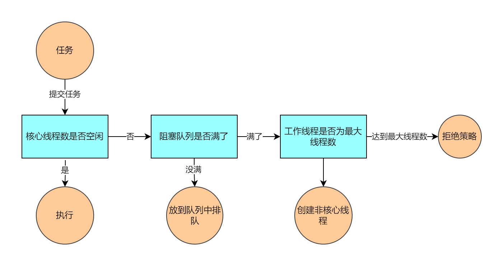
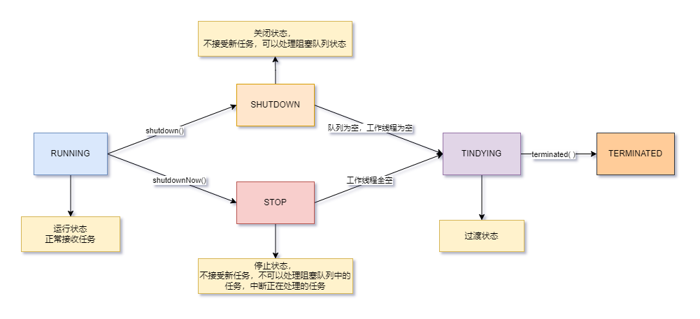

# 第一章 线程池执行流程



线程池在内部其实构建了一个生产者消费者模型，将线程和任务两者解耦，并不直接关联，从而良好的缓冲任务，复用线程。线程池的运行主要分为两部分：任务管理、状态管理。其中任务管理就是充当生产者的角色，当任务提交之后，线程池会判断该任务后续的流转：

1. 直接申请线程执行该任务
2. 缓冲到阻塞队列中等待线程执行
3. 拒绝该任务。

线程管理部分是消费者，它们被统一维护在线程池内，根据任务请求进行

# 第二章 线程池属性标识

```java

// 两个作用：声明当前线程池状态；声明线程池中的线程数
private final AtomicInteger ctl = new AtomicInteger(ctlOf(RUNNING, 0));
// 高3位是线程池装填，低29位是线程池中的线程个数
// SIZE：32，COUNT_BITS就是29，方便后面做位运算
private static final int COUNT_BITS = Integer.SIZE - 3;
// 通过位运算得出最大容量
// 因为后29位是表示线程池中的线程数，因此就是1111111111111，29位1，2的29次方
private static final int CAPACITY   = (1 << COUNT_BITS) - 1;

// runState is stored in the high-order bits
// 线程池的五种状态
private static final int RUNNING    = -1 << COUNT_BITS; // 高三位为111 代表正常接受任务
// 000 不接受任务，但是内部还会处理阻塞队列中的任务，正在进行中的任务也正常执行 执行shutdown方法
private static final int SHUTDOWN   =  0 << COUNT_BITS;
// 001 不接受新任务，也不去处理阻塞队列中的任务，同时会中断正在执行的任务 执行shutdownNow方法
private static final int STOP       =  1 << COUNT_BITS;
private static final int TIDYING    =  2 << COUNT_BITS; // 010 过渡状态，代表线程池即将OVER
private static final int TERMINATED =  3 << COUNT_BITS; // 011 执行terminated（），真的凉凉了。

// Packing and unpacking ctl
// 得到线程池的状态
private static int runStateOf(int c)     { return c & ~CAPACITY; }
// 得到当前线程池的线程数量，不区分核心和非核心
private static int workerCountOf(int c)  { return c & CAPACITY; }
// 通过状态和线程数生成ctl
private static int ctlOf(int rs, int wc) { return rs | wc; }
```

| 线程状态   | 状态释义                                                     |
| ---------- | ------------------------------------------------------------ |
| RUNNING    | 线程池被创建后的初始状态，能接受新提交的任务，也能处理阻塞队列中的任务 |
| SHUTDOWM   | 关闭状态，不接受新任务，但是仍然可以处理已经进入阻塞队列中的任务 |
| STOP       | 会中断正在处理任务的线程，不能再接受新的任务，也不能继续处理阻塞队列中的任务 |
| TIDYING    | 所有的任务都已经终止，workerCount（有效工作线程数）为0       |
| TERMINATED | 线程池彻底终止运行                                           |



# 第三章 execute方法

```java
public void execute(Runnable command) {
   
    if (command == null)
        throw new NullPointerException();
    //拿到32位的int
    int c = ctl.get();
    // 获取工作线程数，是否小于核心线程数，说明可以创建核心线程数，一个线程池刚创建的时候内部没有线程
    if (workerCountOf(c) < corePoolSize) {
        if (addWorker(command, true)) // true表示核心线程
            return;
        // 如果创建失败，重新获取ctl值（没加锁）
        c = ctl.get();
    }
    // 判读线程池是否在运行，将任务添加到阻塞队列中
    if (isRunning(c) && workQueue.offer(command)) {
        int recheck = ctl.get();
        // 如果不是running，移除任务
        if (! isRunning(recheck) && remove(command))
            reject(command); // 拒绝策略
        else if (workerCountOf(recheck) == 0) // 工作线程为0
            addWorker(null, false); // 阻塞队列有任务，但是没有工作线程，添加一个任务为空的工作线程处理阻塞队列中的任务
    } // 创建非核心线程
    else if (!addWorker(command, false))
        // 创建非核心线程失败，拒绝策略
        reject(command);
}
```

查看execute方法中的**addWorker源码**

```java
private boolean addWorker(Runnable firstTask, boolean core) {
    retry: // 标记，内部for循环跳出外部for循环
    for (;;) {
        int c = ctl.get();
        int rs = runStateOf(c); // 获取线程池状态

        // Check if queue empty only if necessary.
        if (rs >= SHUTDOWN && // 除了RUNNING都有可能
            ! (rs == SHUTDOWN &&
               firstTask == null && // 任务为空
               ! workQueue.isEmpty())) // 阻塞队列不为null
            return false;

        for (;;) {
            int wc = workerCountOf(c);
            if (wc >= CAPACITY || // 如果当前线程已经大于线程池最大容量就不去创建
                wc >= (core ? corePoolSize : maximumPoolSize)) // wc是否超过核心线程或者最大线程
                return false;
            if (compareAndIncrementWorkerCount(c)) // 将工作线程数+1
                break retry;
            c = ctl.get();  // Re-read ctl
            if (runStateOf(c) != rs)
                continue retry;
            // else CAS failed due to workerCount change; retry inner loop
        }
    }	
    /// 上述经过大量判断将工作线程数标识+1

    boolean workerStarted = false;
    boolean workerAdded = false;
    Worker w = null;
    try {
        w = new Worker(firstTask);
        final Thread t = w.thread;
        if (t != null) {
            final ReentrantLock mainLock = this.mainLock;
            mainLock.lock();
            // 避免我添加任务时，其他线程干掉线程池，因为干掉线程池需要先获取这个锁。
            try {
                // Recheck while holding lock.
                // Back out on ThreadFactory failure or if
                // shut down before lock acquired.
                int rs = runStateOf(ctl.get());

                if (rs < SHUTDOWN ||
                    (rs == SHUTDOWN && firstTask == null)) {
                    if (t.isAlive()) // precheck that t is startable
                        throw new IllegalThreadStateException();
                    workers.add(w);
                    int s = workers.size();
                    if (s > largestPoolSize)
                        largestPoolSize = s;
                    workerAdded = true;
                }
            } finally {
                mainLock.unlock();
            }
            if (workerAdded) {
                t.start();
                workerStarted = true;
            }
        }
    } finally {
        if (! workerStarted)
            addWorkerFailed(w);
    }
    return workerStarted;
}
```

# 第四章 Worker的封装

[线程池源码撸完，面试还怕被问线程池 - 掘金 (juejin.cn)](https://juejin.cn/post/7051572669439246367#heading-14)
