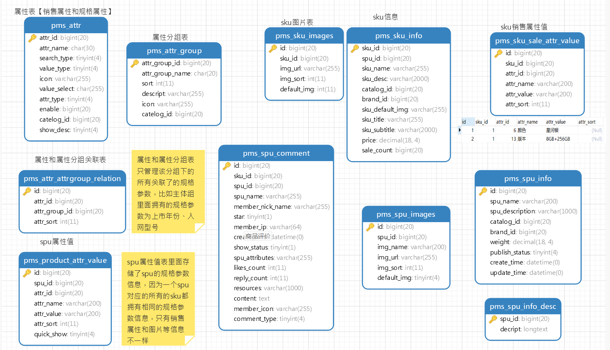

SPU可以认为是一个小米9手机，然后它下面有很多的版本，比如8+128、6+128，这些就构成了一个个的SKU

关于商品有关信息的表格设计大致如此，这里只是给个示例

对于商品的发布来说，比如要发布一个华为nova4，就需要录入它所有的规格参数，和一些共同的基本信息。然后在录入销售属性的时候，会根据它们之间的笛卡尔积自动生成很多的sku展示在前端页面，需要调整一些细节方面的内容。最后再保存完成。

因为商品的发布过程较为繁琐，需要分为好几个阶段，为了方式录入过程中的某些意外中断，就可以在录入的时候先将所有的信息在前端给收集起来，最后才将其一起发送至服务器进行解析。

在对商品进行操作的时候，由于电商系统数据量庞大，因此基本各表之间没有建立关联，在新增和修改数据的时候一定要记得联调其余的表中的数据。