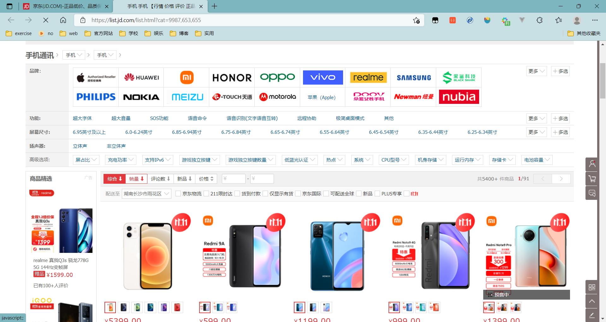

# 1、商品Mapping

在谷粒商城或者说其余的要用到ES进行检索服务的项目来说，都需要向ES导入想要进行检索的数据。在谷粒商城里面就是商品的相关信息。需要在商品上架的时候就导入相关数据。

首先需要在ES中建立Mapping

分析：商品上架在ES中存储的是sku还是spu：



1. 在检索的时候需要输入商品的名字，这些是需要按照sku的title进行检索的（但是在京东真实的体验中， 每种商品只会有一中sku会被展示在搜索页面，并不会将spu的全部sku都给展示，而谷粒商城的业务代码里面是展示spu的所有sku）
2. 如上图所示，检索使用商品规格，规格就是spu的公共属性，每个spu是一样的。
3. 设计如下：

```json
PUT gulimall_product
{
    "mappings":{
        "properties":{
            "skuId":{
                "type":"long"
            },
            "spuId":{
                "type":"keyword"
            },
            "skuTitle":{
                "type":"text",
                "analyzer":"ik_smart"
            },
            "skuPrice":{
                "type":"keyword"
            },
            "skuImg":{
                "type":"keyword",
                "index":false,
                "doc_values":false
            },
            "saleCount":{
                "type":"long"
            },
            "hasStock":{
                "type":"long"
            },
            "hotScore":{ // 热度评分
                "type":"long",
            },
            "brandId":{
                "type":"long"
            },
            "catalogId":{
                "type":"long"
            },
            "brandName":{
                "type":"keyword",
                "index":false,
                "doc_values":false
            },
            "brandImg":{
                "type":"keyword",
                "index":false,
                "doc_values":false
            },
            "catalogName":{
                "type":"keyword",
                "index":false,
                "doc_values":false
            },
            "attrs":{
                "type":"nested",
                "properties":{
                    "attrId":{
                        "type":"long"
                    },
                    "attrName":{
                        "type":"keyword",
                        "index":false,
                        "doc_values":false
                    },
                    "attrValue":{
                        "type":"keyword"
                    }
                }
            }
        }
    }
}
```

index：默认为true，表示该字段不会被索引，但是检索结果里面有，但字段本身不能当作检索条件。

doc_values：设置为false，表示不可以做排序、聚合以及脚本操作，这样更节省磁盘空间。还可以通过设定doc_values为true，index为false来让字段不能被搜索但是可以用于排序、聚合以及脚本等操作。

# 2、上架细节

上架是将后台的商品放在es中可以提供检索和查询功能。

记得要保证数据一致性，商品下架的时候需要删除es中相关的数据，并且在数据库里面进行更改商品的状态。商品默认是有库存的时候，当没有库存的时候才更新es，当有库存的时候也更新es

# 3、代码实现

首先得根据ES中的Mapping在Java中创建相关Bean，

然后根据spuId来将它所有的sku给放入ES中。

大致流程就是通过查询数据库等操作封装好要交给ES的数据

```java
@Override
public void up(Long spuId) {
    //1。查出当前spuid对应的所有sku信息，品牌的名字等
    List<SkuInfoEntity> skus = skuInfoService.getSkusBySpuId(spuId);

    List<Long> skuIdList = skus.stream().map(SkuInfoEntity::getSkuId).collect(Collectors.toList());

    //TODO 4、查出当前spu的所有可以被用来检索的规格属性,
    //选出该spu所有的规格属性
    List<ProductAttrValueEntity> baseAttrs = attrValueService.baseAttrlistforspu(spuId);
    //挑出是可以检索属性的信息,收集所有属性的id
    List<Long> attrIds = baseAttrs.stream().map(attr -> {  //把属性的id都先统一返回过来
        return attr.getAttrId();
    }).collect(Collectors.toList());

    //再根据上面收集到的所有属性的id，去attr属性表里面挑出他们的attr_id在我们指定的集合里面并且search_type是1。这个1是检索属性
    List<Long> searchAttrIds = attrService.selectSearchAttrIds(attrIds); //过滤出一个都是检索属性的attrs的集合
    Set<Long> idSet = new HashSet<>(searchAttrIds);
    // 每个spu下的attr都相同，只需查询一份
    List<SkuEsModel.Attrs> attrsList = baseAttrs.stream()
            .filter(item -> idSet.contains(item.getAttrId())) //过滤掉该spu所有规格属性中不可被检索的属性
            .map(item -> {
                //拿到检索属性的元素
                SkuEsModel.Attrs attrs1 = new SkuEsModel.Attrs();
                BeanUtils.copyProperties(item, attrs1);
                return attrs1;
            }).collect(Collectors.toList());

    //TODO 1、发送远程调用，库存系统查询sku是否有库存
    Map<Long, Boolean> stockMap = null;
    try {
        R r = wareFeignService.getSkusHasStock(skuIdList);
        //skuid，和到低有没有库存组合成了一个map
        TypeReference<List<SkuHasStockVo>> typeReference = new TypeReference<List<SkuHasStockVo>>() {
        };
        stockMap = r.getData(typeReference).stream().collect(Collectors.toMap(SkuHasStockVo::getSkuId, item -> item.getHasStock()));
    } catch (Exception e) {
        log.error("库存服务查询异常：原因{}", e);
    }
    //2.封装每个sku的信息
    Map<Long, Boolean> finalStockMap = stockMap;
    List<SkuEsModel> upProducts = skus.stream().map(sku -> {
        //组装数据到es
        SkuEsModel esModel = new SkuEsModel();
        BeanUtils.copyProperties(sku, esModel);
        esModel.setSkuPrice(sku.getPrice());
        esModel.setSkuImg(sku.getSkuDefaultImg());
        //设置库存信息，到低有没有库存
        if (finalStockMap == null) { //就算远程服务有问题，也让他有数据
            esModel.setHasStock(true);
        } else {
            //才从map里面检索到的库存信息来
            esModel.setHasStock(finalStockMap.get(sku.getSkuId()));
        }
        //TODO 2、热度评分。0,
        esModel.setHotScore(0L);

        //TODO 3、查询品牌和分类的名字信息
        BrandEntity brand = brandService.getById(esModel.getBrandId());
        esModel.setBrandName(brand.getName());
        esModel.setBrandImg(brand.getLogo());
        CategoryEntity category = categoryService.getById(esModel.getCatalogId());
        esModel.setCatalogName(category.getName());
        esModel.setAttrs(attrsList); //设置检索属性
        return esModel;
    }).collect(Collectors.toList());

    //TODO 5、将数据发送给ES进行保存 gulimail-search
    R r = searchFeignService.productStatusUp(upProducts);
    if (r.getCode() == 0) {  //远程调用成功
        //TODO 6、修改当前spu的状态
        baseMapper.updateSpuStatus(spuId, ProductConstant.StatusEnum.SPU_UP.getCode());
    } else {  //远程调用失败
        //TODO 7、重复调用？接口幂等性; 重试机制？
    }
}
```

操控ES将数据给保存

```java
@Override
public boolean productStatusUp(List<SkuEsModel> skuEsModels) throws IOException {
    //数据保存到es中
    //1.给es中建立一个索引。product，建立映射关系

    //2.给es中保存数据，
    // BulkRequest bulkRequest, RequestOptions options
    BulkRequest bulkRequest = new BulkRequest();
    //构造批量操作
    for (SkuEsModel model : skuEsModels) {
        //构造保存的请求
        IndexRequest indexRequest = new IndexRequest(EsConstant.PRODUCT_INDEX);
        indexRequest.id(model.getSkuId().toString());//当前商品的sku的id
        String s = JSON.toJSONString(model);
        indexRequest.source(s, XContentType.JSON);
        bulkRequest.add(indexRequest);
    }
    BulkResponse bulk = restHighLevelClient.bulk(bulkRequest, GulimailElasticSearchConfig.COMMON_OPTIONS);//批量保存数据到es

    //TODO 1.如果批量错误，就可以处理错误
    boolean b = bulk.hasFailures();//统计哪些商品上架失败
    List<String> collect = Arrays.stream(bulk.getItems()).map(item -> {
        //拿到每一个的处理结果，进行处理
        return item.getId();
    }).collect(Collectors.toList());
    log.info("商品上架完成:{},返回数据: {}",collect,bulk.toString());

    return b;

}
```