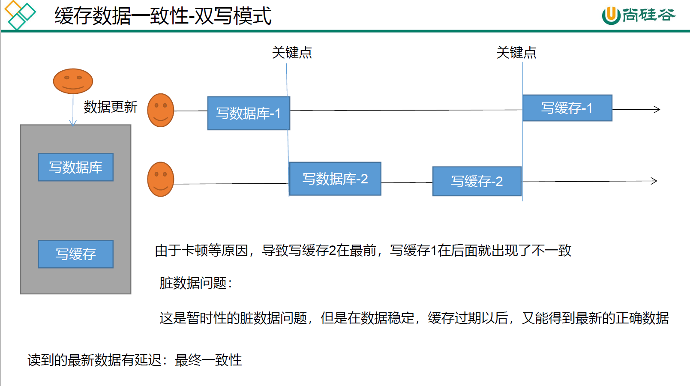
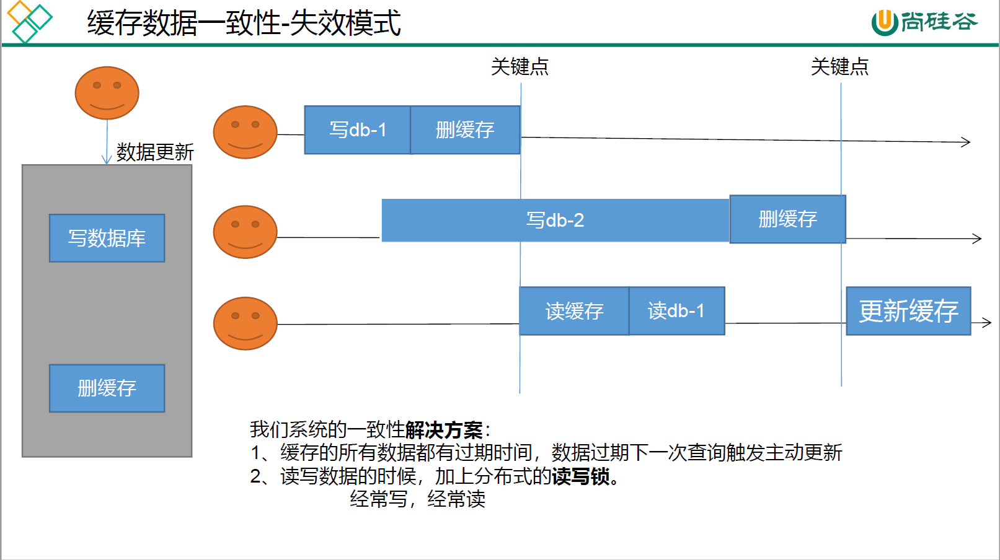
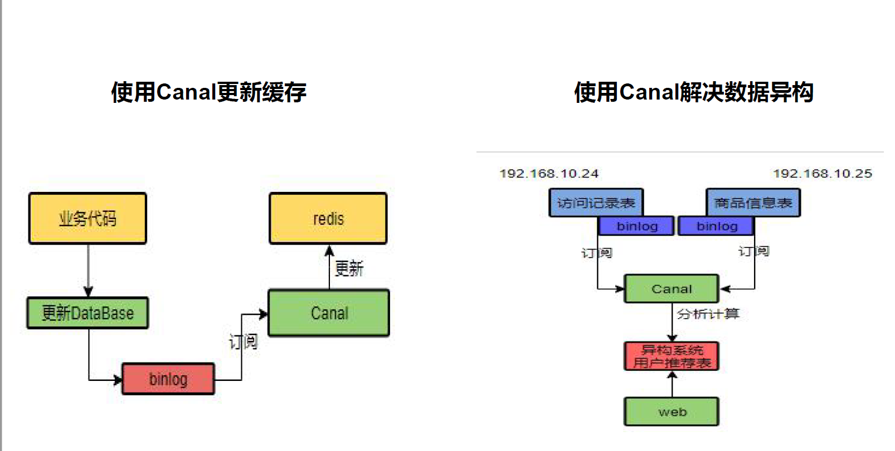

# 0、导读

我们在实际中并不需要对缓存设置的那么精确和严格， 过于复杂的设计反而会导致性能的下降，要根据具体的业务进行具体的分析。

分布式锁可以保证在没有缓存或者缓存过期时，高并发一同进来查询的时候，解决缓存击穿问题，但是分布式锁一般都用于秒杀场景，而不是保证缓存中只查询一次数据库。

# 1、redis缓存

对于那些即时性、数据一致性要求不高的，或者读多写少的数据，可以将其添加到缓存中，就可以加速访问。在开发中，凡是放入缓存中的数据我们都应该指定过期时间。

```xml
<dependency>
    <groupId>org.springframework.boot</groupId>
    <artifactId>spring-boot-starter-data-redis</artifactId>
</dependency>
```

可以使用fastjson包进行对象和json数据之间的转换

```java
String s = JSON.toJSONString(catalogJsonFromDb);
Map<String, List<Catelog2Vo>> result = JSON.parseObject(catelogJsonFromDb, new TypeReference<Map<String, List<Catelog2Vo>>>(){});
```


**堆外内存溢出异常：OutOfDirectMemoryError**

原因：springboot2.0以后默认使用lettuce作为操作redis的客户端，它使用netty进行网络通信，但是lettuce本身就有bug，会导致netty堆外内存溢出，如果netty没有指定堆外内存，就会默认使用自己设置的最大堆内存（-Xmx 300m）

解决方法：

1. 升级lettuce客户端

2. 切换使用redis（集群篇好像还得修改为lettuce，先插眼）

   ```xml
   <dependency>
       <groupId>org.springframework.boot</groupId>
       <artifactId>spring-boot-starter-data-redis</artifactId>
       <exclusions>
           <exclusion>
               <groupId>io.lettuce</groupId>
               <artifactId>lettuce-core</artifactId>
           </exclusion>
       </exclusions>
   </dependency>
   
   <dependency>
       <groupId>redis.clients</groupId>
       <artifactId>jedis</artifactId>
   </dependency>
   ```

在spring boot中，我们使用redisTemplate来作为操作redis的客户端，但是redisTemplate是的底层使用的是lettuce或者jedis，redisTemplate同时对lettuce和jedis进行了封装

# 2、高并发下缓存三大问题

**缓存雪崩**

在高并发场景下，**瞬间过期数据量（不同的数据）太大**，导致对数据库服务器造成的压力过大。

白话文：如果缓存中有1000个商品，他们都设置了相同的过期时间，当时间到了的时候，所有的redis中的数据都过期了，这个时候，有很多个请求同时发送过来，就会全部去访问数据库，就会导致数据库宕机。

解决方法：

1. 可以设置缓存数据永不失效
2. 可以对每个数据都加一个随机的过期时间，防止同一时间大量数据过期现象发生

**缓存击穿**

对于某些设置了过期时间的key，如果这个key会在某个时间点被超高并发的访问，也就是存在高并发的场景，如果该key值过期了，大量的请求将会同一时间对该数据进行查询，都会落到数据库中

**注意：缓存击穿指的是并发查询同一条数据，缓存雪崩指的是不同数据都过期了，很多数据都查不到从而查询数据库。**

解决方法：对查询数据库的方法加锁，大量的并发只让一个人查，其他人等待，当唯一的线程查到数据后就放入缓存中，其余的线程等锁释放后先查询缓存。

单体应用下解决缓存击穿问题

```java
public Map<String, List<Catelog2Vo>> getCatalogJsonFromDbWithLocalLock() {
    synchronized (this) {
        //1、先查询缓存中有没有数据，如果有数据就返回
        //2、没有数据就进行数据的查询
        //3、将查询到的数据存入缓存中（值得注意的是，这个步骤一定也要放入锁中，
        //         不然当第一个线程查询到了数据释放锁之后，还没来得及将数据放入redis中，
        //          第二个线程就进来先判断缓存中没有数据，就会再查询一次数据库
    }
}
```

**缓存穿透**

查询一个一定不存在的数据。由于缓存不命中，将去查询数据库，但是数据库也没有该记录，我们没有将这次查询到的null值写入缓存，这将导致这个不存在的数据每次请求都到存储层去查询，失去了缓存的意义，也对数据库服务器造成压力

解决方法：null结果缓存，并且加入短暂的过期时间，可以通过springcache来解决

# 3、分布式锁

**为什么需要分布式锁？为了解决缓存击穿的问题，也适用于秒杀等高并发场景。**

我们一般使用Redis作为分布式锁，但是在高并发情况下，由于采用的是Redis，网络交互就会有一定的延迟，因此在设计分布式锁的时候就得考虑到很多东西。

```java
public Map<String, List<Catelog2Vo>> getCatalogJsonFromDbWithRedisLock() {

    /**
     * 问题一、setnx占好了位，业务代码异常或者程序再页面过程中宕机。没有执行删除逻辑，这就造成了死锁
         * 解决方法：设置锁的自动过期，即使没有删除，会自动删除
         *
     * 问题二、setnx设置好，正要去设置过期时间，宕机，又死锁了
         * 解决：设置过期时间和占位时间必须是原子的
         *
     * 问题三、删除锁的时候由于业务时间很长，锁自己过期了，我们直接删除的话就可能把别人正在持有的锁删除了。
         * 解决：占锁的时候，值指定位uuid，每个人匹配的是自己的锁才删除
         * 理解：假如锁的过期时间为10秒，但是业务处理时间为30秒，当业务还没处理完成的时候锁就过期了，
         * 其余的线程发现锁消失了，也会产生一个lock，这个时候可能第一个线程的业务已经完成，就会进行lock的删除，则把第二个线程的lock给删除
         *      一旦加了uuid作为值，当第一个线程业务完成的时候，匹配自己的uuid和redis中的uuid的值，如果相同才能删除
         *
     * 问题四：如果正好判断是当前值，正要删除锁的时候，锁已经过期，别人已经设置了新的值，那么我们删除的是别人的锁
         * 解决：删除锁必须保证原子性，即判断+删除，可以使用redis+Lua脚本完成
         */

    // 1、占分布式锁，去redis占坑
    String uuid = UUID.randomUUID().toString();
    /**
     * 如果返回true则表示一开始里面没有锁
         * 返回false表示redis中已经存在该lock，加锁失败
         *
     * 这里使用uuid是为了给每一个微服务都有一个自己的lock值，防止误删除
         * 原子
         */
    Boolean lock = redisTemplate.opsForValue().setIfAbsent("lock", uuid, 300, TimeUnit.SECONDS);
    if (lock) {
        System.out.println("获取分布式锁成功。。");
        //加锁成功。。执行业务

        //2、设置过期时间,必须和加锁同步
        Map<String, List<Catelog2Vo>> dataFromDb=null;
        /**无论业务执行是否成功，都会将该锁进行删除，下面的脚本是为了让获取值进行对比和对比成功删除成为一个原子操作*/
        try {
            dataFromDb = getDataFromDb();
        }finally {
            String script= "if redis.call('get',KEYS[1])==ARGV[1] then return redis.call('del',KEYS[1]) else return 0 end";
            //删除锁
            Long lock1 = redisTemplate.execute(new DefaultRedisScript<>(script, Long.class), Arrays.asList("lock"), uuid);
        }
        //获取值对比+对比成功删除=原子操作 lua脚本解锁
        //            String lockValue = redisTemplate.opsForValue().get("lock");
        //            if (uuid.equalsIgnoreCase(lockValue)) {
        //                redisTemplate.delete("lock");//删除锁
        //
        //            }
        return dataFromDb;
    } else {
        System.out.println("获取分布式锁失败。。等待重试");
        //休眠200ms重试
        try {
            Thread.sleep(200);
        } catch (InterruptedException e) {
        }
        return getCatalogJsonFromDbWithRedisLock();//自旋的方式
    }
}
```

总结来说，

1. 使用redis作为分布式锁，需要考虑到业务代码宕机而导致redis没有执行删除锁的操作，因此需要给锁加上过期时间，并且还得保证加过期时间和设置锁是原子性
2. 删除锁的时候必须保证原子性，即判断当前锁是自己的锁 + 删除操作，必须是原子性，使用lua脚本解决
3. 但是还有一个问题，那就是业务执行的时间超过了锁的过期时间，这就得为锁续期，可以使用Redisson来解决。
4. 可以参照尚硅谷面试题第三季的笔记。

# 4、Redisson

Redisson是架设在Redis基础上的一个Java驻内存数据网格（In-Memory Data Grid）。充分 的利用了 Redis 键值数据库提供的一系列优势，基于 Java 实用工具包中常用接口，为使用者 提供了一系列具有分布式特性的常用工具类。使得原本作为协调单机多线程并发程序的工 具包获得了协调分布式多机多线程并发系统的能力，大大降低了设计和研发大规模分布式 系统的难度。同时结合各富特色的分布式服务，更进一步简化了分布式环境中程序相互之间 的协作。 

官方文档：https://github.com/redisson/redisson/wiki/%E7%9B%AE%E5%BD%95

```xml
<dependency>
    <groupId>org.redisson</groupId>
    <artifactId>redisson</artifactId>
    <version>3.12.0</version>
</dependency>
```

添加Redisson配置类

```java
@Configuration
public class MyRedissonConfig {
    /**
     * 所有对Redisson的使用都是通过RedissonClient对象
     */
    @Bean(destroyMethod = "shutdown")
    public RedissonClient redisson() throws IOException {
        //1、创建配置
        Config config=new Config();
        config.useSingleServer().setAddress("redis://192.168.118.128:6379");
        //2、根据config创建出RedissonClient示例
        RedissonClient redissonClient = Redisson.create(config);
        return redissonClient;
    }
}
```

1. Redisson的锁具有自动续期功能，如果业务超长，当锁的过期时间低于20秒的时候，运行期间会自动给锁续上新的30秒（默认锁的过期时间是30秒），不用担心业务时间长，导致锁自动过期被删掉
2. 加锁的业务只要运行完成，就不会给当前锁续期，即使不手动解锁，锁默认在30秒之后自动删除
3. **也可以在加锁的时候指定加锁时间，但是指定了加锁时间后，就不会有看门狗机制了，也不会有自动续期，但是实战中推荐这种方式，只要将时间设置的大一点就行，因为自动续期会消耗较多的资源。**
4. Redisson的使用和juc中的锁几乎一模一样，差别在于本地锁只能锁住当前服务，而redisson可以锁住分布式应用


**使用Redisson实现分布式锁**

```java
public Map<String, List<Catelog2Vo>> getCatalogJsonFromDbWithRedissonLock() {

    //锁的粒度：具体缓存的是某个数据 11号商品 product-11-lock
    RLock lock = redissson.getLock("catalogJson-lock");
    lock.lock();
    Map<String, List<Catelog2Vo>> dataFromDb = null;
    try {
        dataFromDb = getDataFromDb();
    } finally {
        lock.unlock();
    }
    return dataFromDb;
}
```

# 5、缓存一致性

1. **双写模式**

   描述：在对数据进行写操作的时候，同时将缓存中的数据也进行更新

   解决方法：给写操作加读写锁；看业务的需求，对数据的精度高不高。

   

2. **失效模式**

   

3. **解决方案**

   1. 无论是双写模式还是失效模式，都会导致缓存不一致的问题，即多个实例同时更新会出事。
      - 如果是用户维度（订单数据、用户数据），这种并发几率很小，不用考虑这个问题，缓存数据加上过期时间，每隔一段时间触发读的主动更新即可。
      - 如果是菜单、商品介绍等基础数据，可以不用管，也可以使用Canal订阅binlog的方式
      - 缓存数据 + 过期时间也足够解决大部分业务对缓存的要求。
      - 通过加锁保证并发读写、写写的时候按顺序排队，读读无所谓。所以适合使用读写锁（业务不关心脏数据，允许临时脏数据可忽略）
   2. 总结：
      - 我们能放入缓存的数据本身就不应该是实时性、一致性要求高的，所以缓存数据的时候加上过期时间，保证每天拿到的数据是最新的数据即可
      - 我们不应该过度设计，增加系统的复杂度
      - 遇到实时性、一致性要求高的数据，就应该查数据库，即使慢点

4. Canal

   

# 6、SpringCache

0、基本知识

1. Cache接口为缓存的组件规范定义，包含缓存的各种操作集合；Cache接口下Spring提供了各种xxxCache的实现，如RedisCache、EhCacheCache、ConcurrentMapCache等
2. 每次调用需要缓存功能的方法时，Spring会检查指定参数的指定的目标方法是否已经被调用过；如果有就直接从缓存中获取方法调用后的结果，如果没有就调用方法并缓存结果后返回给用户。下次调用直接从缓存中获取。

1、导入依赖

```xml
<dependency>
    <groupId>org.springframework.boot</groupId>
    <artifactId>spring-boot-starter-cache</artifactId>
</dependency>
```

2、添加配置信息

```yaml
#springCache配置
  cache:
    type: redis
    redis:
      time-to-live: 3600000  #设置存活时间
      #如果指定了前缀，就用指定的前缀，如果没有就用指定的value，一般不指定
#      key-prefix: CACHE_
      use-key-prefix: true
      #是否缓存空值,防止缓存穿透
      cache-null-values: true
```

3、配置SpringCache，让其保存的格式为json格式，**并且开启缓存功能（@EnableCaching）**

```java
@EnableConfigurationProperties(CacheProperties.class)
@EnableCaching
@Configuration
public class MyCacheConfig {

    @Bean
    RedisCacheConfiguration redisCacheConfiguration(CacheProperties cacheProperties){

        RedisCacheConfiguration config = RedisCacheConfiguration.defaultCacheConfig();
        config = config.serializeKeysWith(RedisSerializationContext.SerializationPair.fromSerializer(new StringRedisSerializer()));
        config = config.serializeValuesWith(RedisSerializationContext.SerializationPair.fromSerializer(new GenericJackson2JsonRedisSerializer()));

        CacheProperties.Redis redisProperties = cacheProperties.getRedis();
        //将配置文件中的所有配置都生效
        if (redisProperties.getTimeToLive() != null) {
            config = config.entryTtl(redisProperties.getTimeToLive());
        }
        if (redisProperties.getKeyPrefix() != null) {
            config = config.prefixKeysWith(redisProperties.getKeyPrefix());
        }
        if (!redisProperties.isCacheNullValues()) {
            config = config.disableCachingNullValues();
        }
        if (!redisProperties.isUseKeyPrefix()) {
            config = config.disableKeyPrefix();
        }
        return config;
    }
}
```

4、常用注解

- @Cacheable：触发将数据保存到缓存中的操作
- @CacheEvict：触发将数据从缓存中删除的操作
- @CachePut：不影响方法执行，更新缓存；保证方法被调用，又希望结果能被缓存
- @Caching：组合以上多个操作
- @CacheConfig：在类级别共享缓存的相同配置

5、默认行为

- key默认指定生成：缓存的名字::SimpleKey[] (自主生成的key)
- 默认过期时间为-1
- 缓存的value值默认使用jdk序列化机制，将序列化之后的结果存入redis

6、一般而言，存储同一类型的数据，都可以指定同一分区，分区名默认是前缀，方便删除。如果一个数据的修改要同时删除多个缓存，有两种方式

```java
@Caching(evict = {
    @CacheEvict(value = {"category"},key = "'getLevel1Categorys'"),
    @CacheEvict(value = {"category"},key = "'getCatalogJson'")
})


@CacheEvict(value="category",allEntries=true)
// 将该分区下的所有缓存都删除
```

7、对于读模式下，缓存穿透可以通过ache-null-values = true来解决；缓存雪崩可以通过加过期时间解决；缓存击穿可以通过加锁解决：@Cache注解中添加sync = true，并且其实本地锁就已经够用了

对于写模式，如果是读多的话就加锁；引入Canal，感知mysql的更新去更新缓存；读多写多就不需要引入缓存

8、**常规数据（读多写少，即时性、一致性要求不高的数据），完全可以使用Spring-Cache，写模式只要缓存有过期时间就够用了**

**特殊数据：特殊设计**