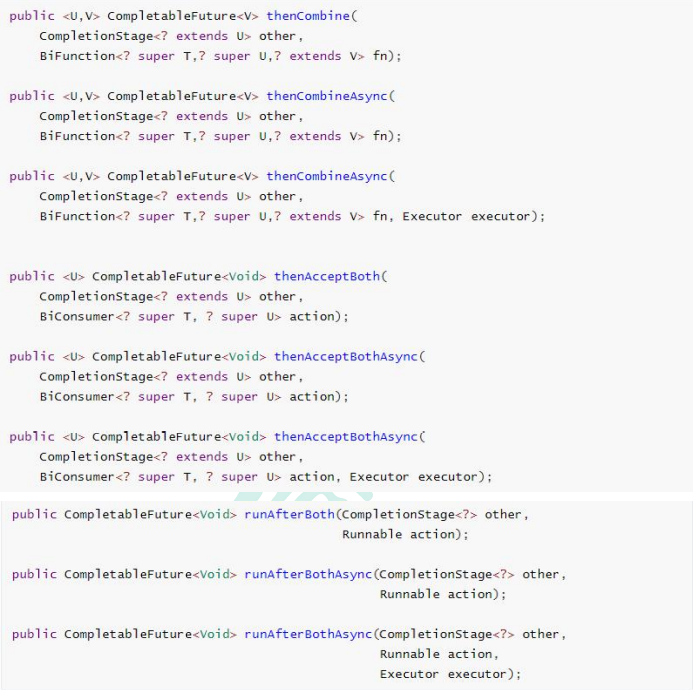
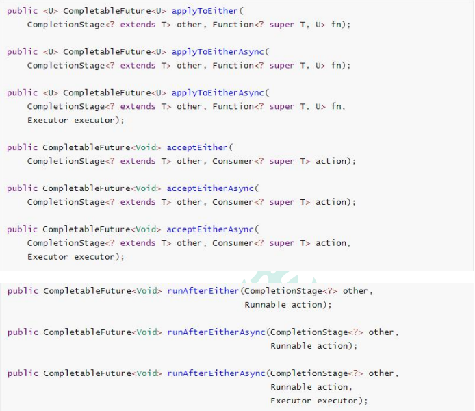

# 1、线程池

1. 初始化线程的四种方式

   1. 继承Thread
   2. 实现Runnable接口
   3. 实现Callable接口 + FutureTask（可以拿到返回结果，可以处理异常）
   4. 线程池

   对于方法一和方法二来说，主线程无法获取线程的运算结果

   对于方法三：主线程可以获取线程的运算结果，但是不利于控制服务器中的线程资源，可以导致服务器资源耗尽。

   方法四有两种方式初始化线程池

   ```java
   Executors.newFiexedThreadPool(3);
   //或者
   new ThreadPoolExecutor(corePoolSize, maximumPoolSize, keepAliveTime, TimeUnit unit, workQueue, threadFactory, 
   ```

2. 线程池的七大参数

   1. corePoolSize：核心线程数，线程池中一直保持的线程的数量，即使线程空闲。除非设置了allowCoreThreadTimeOut
   2. maximumPoolSize：线程池中允许的最大线程数
   3. keepAliveTime：当线程数大于corePoolSize时，线程在最大多长时间没有接到新任务就会终止释放，最终线程池维持在corePoolSize大小
   4. timeUnit：时间单位
   5. workQueue：阻塞队列，用来存储等待执行的任务，如果当前对线程的需求超过了corePoolSize大小，就会放到这里等待空闲线程执行
   6. threadFactory：创建线程的工厂，比如指定线程名
   7. handler：拒绝策略，如果线程满了，线程池就会使用拒绝策略

3. 线程池运行流程

   1. 线程池创建，准备好core数量的核心线程，准备接受任务
   2. 新的任务进来，用core准备好的空闲线程执行
      1. core满了，就将再进来的任务放入阻塞队列中，空闲的core就会自己去阻塞队列中获取任务并进行执行
      2. 阻塞队列满了，就直接开启新线程执行，最大只能开到max指定的数量
      3. max都执行好了，max-core数量空闲的线程会在keepAliveTime指定的时间后自动销毁，最终保持到core大小
      4. 如果线程数开到了max的数量，还有新任务过来，就会使用reject指定的拒绝策略进行处理
   3. 所有的线程创建都是由factory创建的

4. 简单面试题：一个线程池，core = 7，max = 20， queue = 50， 100并发进来怎么分配的？

   先有7个能直接得到执行，接下来50个放入queue中进入队列排队，再多开13个继续执行，所以有7 0个被安排上了，剩下的30个默认拒绝策略

5. 常见的4种线程池

   - newCachedThreadPool：创建一个可缓存线程池，如果线程池长度超过处理需要，可灵活回收空闲线程，若无可回收，则创建新线程。
   - newFixedThreadPool：创建一个定长线程池，可控制线程最大并发数，超出的线程会在队列种等待
   - newScheduledThreadPool：创建一个定长线程池，支持定时以及周期性任务执行
   - newSingleThreadExecutor：创建一个单线程化的线程池，他只会用唯一的工作线程来执行任务，保证所有任务按照指定顺序（FIFO、LIFO、优先级）执行。

6. 开发中为什么使用线程池

   - 降低资源的消耗：通过重复利用已经创建好的线程降低线程的创建和销毁带来的损耗
   - 提高响应速度：因为线程池中的线程数没有超过线程池的最大上限时，有的线程处于等待分配任务的状态，当任务来时无需创建新的线程就能执行
   - 提高线程池可管理性：线程池会根据当前系统特点对池内的线程进行优化处理，减少创建和销毁线程带来的系统开销，无限的创建和销毁线程不仅消耗系统资源，还降低系统的稳定性，使用线程池进行统一的分配

# 2、CompletableFuture异步编排

1. 创建异步对象

   ```java
   static CompletableFuture<void> runAsync(Runnable runnable);
   static CompletableFuture<void> runAsync(Runnable runnable, Executor executor);
   static <U> CompletableFuture<U> supplyAsync(Supplier<U> supplier);
   static <U> CompletableFuture<U> supplyAsync(Supplier<U> supplier, Executor executor);
   // runXxx都是没有返回结果的，supplyXxx都是可以获取返回结果的
   // 可以传入自定义的线程池，否则就用默认的线程池
   ```

2. 计算完成时的回调方法

   ```java
   public CompletableFuture<T> whenComplete(BiConsumer<? super T, ? super Throwable> action);
   public CompletableFuture<T> whenCompleteAsync(BiConsumer<? super T, ? super Throwable> action);
   public CompletableFuture<T> whenCompleteAsync(BiConsumer<? super T, ? super Throwable> action, Executor executor);
   public CompletableFuture<T> exceptionally(Function<Throwable, ? extends T> fn);
   ```

   whenComplete可以处理正常和异常的计算结果，exceptionally处理异常情况。

   方法不以Async结尾，意味着Action使用相同的线程执行，而Async可能会使用其他线程执行。

3. handle方法

   ```java
   public <U> CompletionStage<U> handle(BiFunction<? super T, Throwable, ? extends U> fn);
   public <U> CompletionStage<U> handleAsync(BiFunction<? super T, Throwable, ? extends U> fn);
   public <U> CompletionStage<U> handleAsync(BiFunction<? super T, Throwable, ? extends U> fn, Executor executor);
   ```

   和Complete一样，可对结果做最后的处理（可处理异常），可改变返回值

4. 线程串行化方法

   ```java
   public <U> CompletableFuture<U> thenApply(Function<? super T, extends U> fn);
   public <U> CompletableFuture<U> thenApplyAsync(Function<? super T, extends U> fn);
   public <U> CompletableFuture<U> thenApplyasync(Function<? super T, extends U> fn, Executor executor);
   
   public CompletionStage<Void> thenAccept(Consumer<? super T> action);
   public CompletionStage<void> thenAcceptAsync(Consumer<? super T> action);
   public CompletionStage<void> thenAcceptAsync(Consumer<? super T> action, Executor executor);
   
   public CompletionStage<void> thenRun(Runnable action);
   public CompletionStage<Void> thenRunAsync(Runnable action);
   public CompletionStage<Void> thenRunAsync(Runnable action, Executor executor);
   ```

   thenApply 方法：当一个线程依赖另一个线程时，获取上一个任务返回的结果，并返回当前 任务的返回值。 

   thenAccept 方法：消费处理结果。接收任务的处理结果，并消费处理，无返回结果。 

   thenRun 方法：只要上面的任务执行完成，就开始执行 thenRun，只是处理完任务后，执行 thenRun 的后续操作 

   带有 Async 默认是异步执行的。同之前。 

   以上都要前置任务成功完成。 

   Function<? super T, ? extends U> 

   ​		T：上一个任务返回结果的类型

   ​		U：当前任务的返回值类型

5. 两任务组合 - 都要完成

   

   两个任务必须都完成，触发该任务。

   thenCombine：组合两个 future，获取两个 future 的返回结果，并返回当前任务的返回值 

   thenAcceptBoth：组合两个 future，获取两个 future 任务的返回结果，然后处理任务，没有返回值。 

   runAfterBoth：组合两个 future，不需要获取 future 的结果，只需两个 future 处理完任务后，处理该任务。

6. 两任务组合 - 一个完成

   

   当两个任务中，任意一个future任务完成的时候，执行任务

   applyToEither：两个任务有一个执行完成，获取它的返回值，处理任务并有新的返回值。 

   acceptEither：两个任务有一个执行完成，获取它的返回值，处理任务，没有新的返回值。 

   runAfterEither：两个任务有一个执行完成，不需要获取 future 的结果，处理任务，也没有返回值。

7. 多任务组合

   ```java
   // 等待所有任务完成
   public static CompletableFuture<void> allOf(CompleteableFuture<?> ... cfs); 
   // 只要有一个任务完成
   public static CompletableFuture<void> anyOf(CompleteableFuture<?> ... cfs);
   ```

8. 具体实战请看下一篇笔记：业务-商品详情页

 

# 3、异步编排中使用ThreadLocal注意事项

threadlocal是指在同一个线程中能进行数据的共享，但是如果一个线程进行了异步编排，那么该方法内部就会产生不同的线程，这样threadlocal中的数据就无法做到共享了

解决办法：在异步任务执行之前，先将threadlocal中的数据放到主线程之中，然后在异步线程中获取到这些请求数据。

```java
RequestAttributes requestAttributes = RequestContextHolder.getRequestAttributes();
CompletableFuture<void> getAddressFuture = CompletableFuture.runAsync(() -> {
    RequestContextHolder.setRequestAttributes(requestAttributes);
});
```

**该例子同样可以解决Feign异步情况丢失上下文问题。**