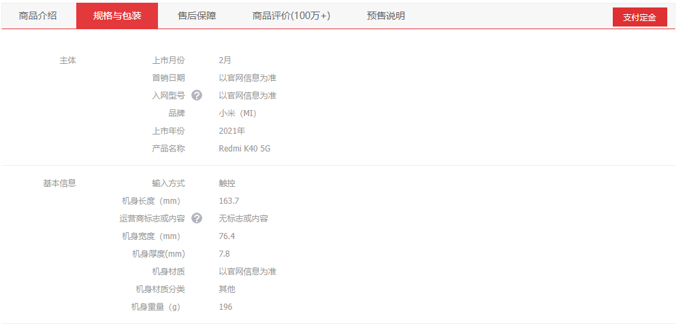
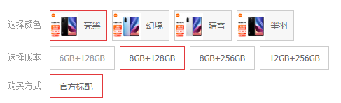
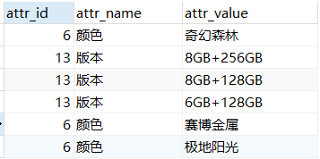
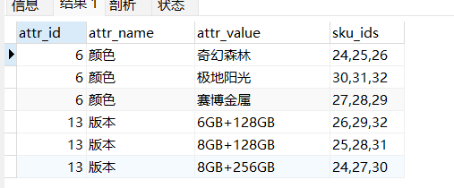

观察京东的商品详情页，可以看到，当我们点击了对应的商品后，商品详情页面需要的数据可以分为几大模块：商品的副标题等信息、商品的销售属性、秒杀信息、商品介绍里面的长图和基本信息、规格与包装里面的规格参数等等，这些信息就可以采用异步编排的方式进行查询，可以节约时间。

在springboot中使用CompletableFuture异步编排首先需要写一个我们自己的线程池，并且还可以将配置写在配置文件中

```java
@ConfigurationProperties(prefix = "gulimall.thread")
@Component
@Data
public class ThreadPoolConfigProperties {

    private Integer coreSize;  //核心线程数
    private Integer maxSize; //最大线程数
    private Integer keepAliveTime; //休眠时长

}
```

在yaml文件中进行相关属性的配置

```yaml
gulimall:
  thread:
    core-size: 20
    max-size: 200
    keep-alive-time: 10
```

然后配置我们自己的线程池

```java
@Configuration
public class MyThreadConfig {

    @Bean
    public ThreadPoolExecutor threadPoolExecutor(ThreadPoolConfigProperties pool){
        return   new ThreadPoolExecutor(pool.getCoreSize(),
                                        pool.getMaxSize(),
                                        pool.getKeepAliveTime(),
                                        TimeUnit.SECONDS,
                                        new LinkedBlockingDeque<>(100000),
                                        Executors.defaultThreadFactory(),
                                        new ThreadPoolExecutor.AbortPolicy());
    }
}
```

接着就可以通过ThreadPoolExecutor来使用异步编排了。

```java
@Override
public SkuItemVo item(Long skuId) throws ExecutionException, InterruptedException {
    SkuItemVo skuItemVo = new SkuItemVo();
    
    //第一个异步任务
    CompletableFuture<SkuInfoEntity> infoFuture = CompletableFuture.supplyAsync(() -> {
        //1.sku基本信息获取  pms_sku_info表
        SkuInfoEntity info = getById(skuId);
        skuItemVo.setInfo(info);
        return info;
    }, executor);
    
    //第二个异步任务
    CompletableFuture<Void> saleAttrFuture = infoFuture.thenAcceptAsync((res) -> {
        //3、获取spu的销售属性组合
        //3.1.查出当前spu属于哪个分类，就能知道有哪些分组信息
        List<SkuItemSaleAttrsVo> saleAttrsVos = skuSaleAttrValueService.getSaleAttrsBySpuId(res.getSpuId());  //获取所有可能的销售属性组合
        skuItemVo.setSaleAttr(saleAttrsVos);
    }, executor);
    
    //第三个异步任务
    CompletableFuture<Void> descFuture = infoFuture.thenAcceptAsync(res -> {
        //4.获取spu的介绍信息  pms_spu_info_desc
        SpuInfoDescEntity spuInfoDescEntity = spuInfoDescService.getById(res.getSpuId());  //按照spuid来查询spu的介绍信息
        skuItemVo.setDesp(spuInfoDescEntity);
    }, executor);
    
    //第四个异步任务
    CompletableFuture<Void> baseAttrFuture = infoFuture.thenAcceptAsync(res -> {
        //5.获取spu的规格参数信息
        List<SpuItemAttrGroupVo> attrGroupVos = attrGroupService.getAttrGroupWithAttrsBySpuId(res.getSpuId(), res.getCatalogId());  //查出某个spu的属性分组信息,以及这个分组里面所有属性对应的值
        skuItemVo.setGroupAttrs(attrGroupVos);
    }, executor);
    
    //第五个异步任务，这个异步任务跟上面的所有任务都没有关系的
    //2.sku的图片信息 pms_sku_images表
    CompletableFuture<Void> imageFuture = CompletableFuture.runAsync(() -> {
        List<SkuImagesEntity> images = imagesService.getImagesBySkuId(skuId);
        skuItemVo.setImages(images);
    }, executor);

    //3、查询当前sku是否参与秒杀优惠
    CompletableFuture<Void> seckillFuture = CompletableFuture.runAsync(() -> {
        R seckillInfo = seckillFeignService.getSkuSeckillInfo(skuId);
        if (seckillInfo.getCode() == 0) { //一切都是成功的
            SeckillInfoVo seckillInfoVo = seckillInfo.getData(new TypeReference<SeckillInfoVo>() {
            });
            skuItemVo.setSeckillInfo(seckillInfoVo);
        }
    }, executor);

    //等待所有任务都完成，此方法就是以上的所有异步任务都做完了以后,才返回数据
    CompletableFuture.allOf(saleAttrFuture,descFuture,baseAttrFuture,imageFuture,seckillFuture).get();
    return skuItemVo;
}
```

上述的代码展示了有关于异步编排是如何在实战中运用的，实际业务实际分析。

值得注意的是，在前端页面，如果我们切换销售属性中的一个，就会跳转到对应的sku商品详情页。谷粒商城给的算法：



比如这个，颜色选择了亮黑，同时也得知道颜色为亮黑的所有skuId。此时版本那里选择的8+128也含有拥有该版本的所有skuId，这样只需要两边求个交集就能选择到具体的skuId是哪个了。这个是在前端页面做的。

对于**查询商品的销售属性**，mysql代码如果是如下的话：

```mysql
SELECT 
ssav.attr_id,
ssav.attr_name,
ssav.attr_value
FROM pms_sku_info info
LEFT JOIN pms_sku_sale_attr_value ssav on ssav.sku_id = info.sku_id
where info.spu_id = 13
GROUP BY ssav.attr_id, ssav.attr_name,ssav.attr_value
```

得到的结果是这样的



但是这样无法获得所有颜色为奇幻森林的skuId，这时候就得用到group_concat函数了

前言：在有group by的查询语句中，select指定的字段要么就包含在group by语句的后面，作为分组的依据，要么就包含在聚合函数中。

而group_concat函数的作用是将groupby产生的同一分组中的对应值连接起来，返回一个字符串结果。

语法：group_concat([distince] 要连接的字段 [order by 排序字段 asc/desc] [separator '分隔符'])

```mysql
SELECT 
ssav.attr_id,
ssav.attr_name,
ssav.attr_value,
GROUP_CONCAT(ssav.sku_id) sku_ids
-- ssav.sku_id
FROM pms_sku_info info

LEFT JOIN pms_sku_sale_attr_value ssav on ssav.sku_id = info.sku_id
where info.spu_id = 13
GROUP BY ssav.attr_id, ssav.attr_name,ssav.attr_value
```

结果如下图所示：



就可以看到颜色为奇幻森林的sku有25、26、27