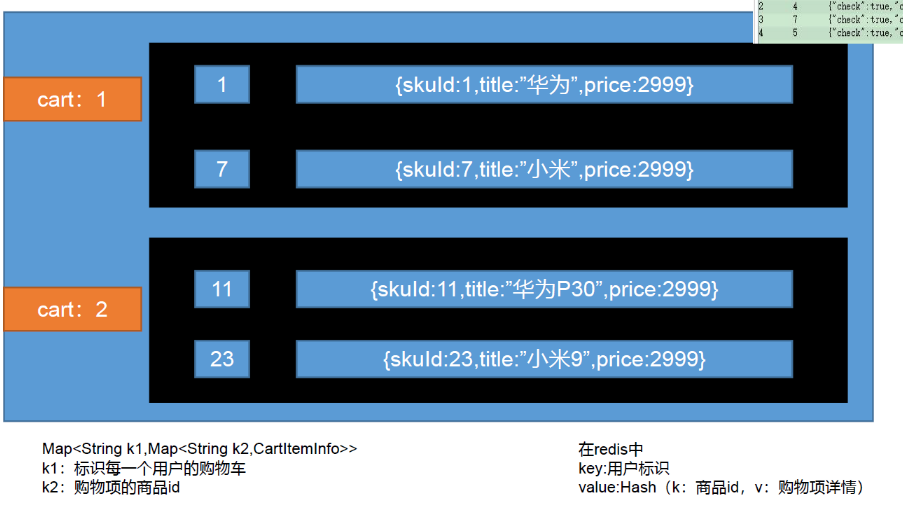

对于购物车功能，考虑到性能等各种因素，使用redis进行是实现，并且使用hash来存储，使用gulimall:cart:{cartkey}来作为hash的field进行存储，使用skuId作为value的key，商品详情可以作为value的value。



购物车在redis中的存储结构如上图所示。

观看京东之前的购物车设计，用户就算没有登录也可以将商品添加到购物车，并且还会给临时用户在session中分配一个随机生成的user-key，标志这是一个临时用户。用户如果没有登录的话，会用该user-key在redis中存储相关购物车的信息。如果登录的话，会将对应的user-key所对应的购物车和自己的userid对应的购物车进行合并。（现在的京东已经没有离线购物车了，必须要登录才能使用购物车，这样设计和实现也会方便很多）

1. 基本流程

   如果用户未登录使用购物车模块相关功能，在拦截器中会给请求获取一个userkey，并且将其存入cookie中，这就相当于一个临时的购物车。cartkey=gulimall:cart:userkey

   如果用户登录了，就获取用户的userId，并且用cartkey=gulimall:cart:userId作为hash的field进行redis缓存，并且合并临时购物车中的数据。

2. 值得注意的是，应该在购物车模块的每个请求之前判断本次操作是使用临时购物车还是真实购物车，这就得使用到springmvc的拦截器功能。

   根据设计，浏览器中会有一个cookie，用来标识用户的身份，也就是user-key，而且这个身份一般都是一个月之后才过期的。

   如果是第一次访问购物车，都会自动分配一个临时用户身份，这个临时用户身份会保存在浏览器中，每次购物的相关的请求都会带上这个临时用户身份。

   如果是登录了，那么就是在session中会有相关的数据：loginuser；如果没有登陆了，就按照cookie里面带来的临时用户身份来做；如果一开始没有临时用户身份的话，还得自动创建一个临时用户给浏览器。

   也就是每一个请求都得检查这个浏览器是否已经登录了。

   因此就可以在目标方法执行前，先让拦截器获取一下当前浏览器的登录与不登陆的状态信息。如果浏览器没有登录，而且cookie里面没有临时用户信息，还得在方法执行之后给浏览器创建一个临时id用户身份。

```java
/**
 * 拦截器的功能就是：
 *  在执行目标方法之前，先来判断用户的登录状态
 *  保证购物车所有请求一进来，先能获取到用户的信息，无论是临时的还是登录后的用户信息
 */
public class CartInterceptor implements HandlerInterceptor {

    public static ThreadLocal<UserInfoTo> threadLocal = new ThreadLocal<>();

    /**
     * 在目标方法执行之前拦截
     * 判断用户是否已经登录
     */
    @Override
    public boolean preHandle(HttpServletRequest request, HttpServletResponse response, Object handler) throws Exception {
        UserInfoTo userInfoTo = new UserInfoTo();//登录了就有用户的id，没有登录就有用户的临时身份
        //查看当前用户有没有登录，
        HttpSession session = request.getSession();
        MemberRespVo  Member= (MemberRespVo) session.getAttribute(AuthServerConstant.LOGIN_USER);//获取当前登录的用户信息
        //不管用户登录了还是没有登录
        if (Member!=null){//说明用户登录了
            userInfoTo.setUserId(Member.getId());//就把用户的id设置进去
        }
        //每次发请求，识别临时用户还是登录后的用户，是从cookie里面识别的，所以每次请求来可以获取cookie里面的数据
        Cookie[] cookies = request.getCookies();//获取指定的cookie
        if (cookies!=null && cookies.length>0){ //说明cookie里面有数据
            //遍历cookie，获取指定的cookie信息
            for (Cookie cookie : cookies) {
                //先看看有没有这个系统的临时用户身份
                String name = cookie.getName();//获取cookie的名字
                if (name.equals(CartConstant.TEMP_USER_COOKIE_NAME)){ //如果有这个名字的cookie，那么就相当于拿到这个cookie
                    userInfoTo.setUserKey(cookie.getValue());
                    userInfoTo.setTempUser(true);
                }
            }
        }
        if (StringUtils.isEmpty(userInfoTo.getUserKey())){ //说明没有临时用户
            //那么就自定义一个临时的用户
            String uuid = UUID.randomUUID().toString();
            userInfoTo.setUserKey(uuid);
        }
        //目前方法执行之前
        threadLocal.set(userInfoTo);
        return true;  //来带目标方法全部都放行
    }

    /**
     * 目标方法执行之后，
     * 分配临时用户，让浏览器保存
     * 这样以后无论是调用购物车的任意方法，都可以很方便的获取到用户信息
     */
    @Override
    public void postHandle(HttpServletRequest request, HttpServletResponse response, Object handler, ModelAndView modelAndView) throws Exception {
        UserInfoTo userInfoTo = threadLocal.get();
//        判断cookie之前中有没有userkey 如果没有就设置
        if (!userInfoTo.isTempUser()){//如果默认是没有临时用户信息
            //持续延长临时用户的过期时间
            Cookie cookie = new Cookie(CartConstant.TEMP_USER_COOKIE_NAME, userInfoTo.getUserKey());
            cookie.setDomain("gulimall.com");//放大作用域
            cookie.setMaxAge(CartConstant.TEMP_USER_COOKIE_TIMEOUT);//过期时间
            //命令浏览器保存cookie
            response.addCookie(cookie);
        }

    }
}
```

**在使用拦截器的时候，一定要将自定义好的拦截器提交给springmvc里面**

```java
@Configuration
public class GulimallWebConfig implements WebMvcConfigurer {

    @Override
    public void addInterceptors(InterceptorRegistry registry) {
        registry.addInterceptor(new CartInterceptor()).addPathPatterns("/**"); //拦截当前购物车的所有请求
    }
}
```


可以使用ThreadLocal进行线程之间的通信：能在同一线程下进行数据共享。

对于真正的业务方法，可以从threadlocal中获取到userinfoTo的值，然后通过判断userId是否为空来判断用户是否登录。

